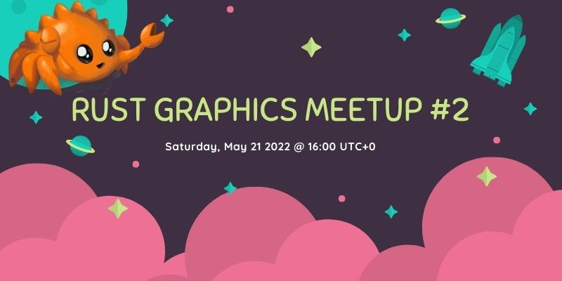

+++
title = "Rust Graphics Meetup 2"
date = 2022-05-18
transparent = true
aliases = ["posts/graphics-meetup-02"]
+++

<!-- markdownlint-disable single-title heading-increment no-blanks-blockquote -->
<!-- markdownlint-configure-file {"line-length": {"heading_line_length": 120}} -->

The second Rust Graphics Meetup will take place on [May 21st at 16:00
UTC+0][meetup-time]. This meetup is a chance to see what others have been
working on in the Rust graphics community. You can see the videos from the
[first meetup here][rust-graphics-meetup-1].

[meetup-time]: https://everytimezone.com/s/b6ec5c17
[rust-graphics-meetup-1]: https://www.youtube.com/playlist?list=PLYiOdhpKxxXJwaocrJcOCoBhlV6foaO8F

## Schedule

### Vismut

#### 16:00 - 16:20, Lukas Orsvärn

(waiting for description)

### Screen-13 v0.2: "automatic" Vulkan driver

#### 16:20 - 16:30, John Wells

(waiting for description)

### Optimizing wgpu with Data Driven Design

#### 16:30 - 17:00, Connor Fitzgerald

A look into how Data Driven Design is the key to the performance
increases coming in wgpu 0.13 and what the future holds for solving long
standing performance bottlenecks in the codebase. wgpu is the graphics
abstraction at the core of many rust projects and ensuring it is as fast as
possible will push the boundary of what is possible in safe Rust today.
