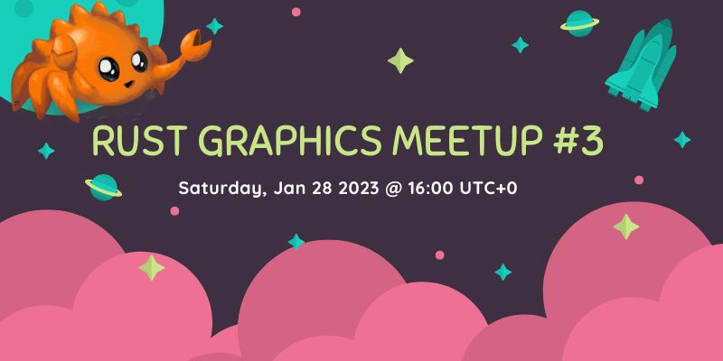

+++
title = "Rust Graphics Meetup 3"
date = 2023-01-25
transparent = true
aliases = ["posts/graphics-meetup-03"]
+++

<!-- markdownlint-disable single-title heading-increment no-blanks-blockquote -->
<!-- markdownlint-configure-file {"line-length": {"heading_line_length": 120}} -->

The third Rust Graphics Meetup will take place on [Jan 28th at 16:00
UTC+0][meetup-time]. This meetup is a chance to see what others have been
working on in the Rust graphics community. You can see videos from the [previous
meetups here][rust-graphics-meetup-playlist].

The meetup will take place on the Rust Gamedev [YouTube][youtube-stream] and
[Twitch][twitch-stream].

[meetup-time]: https://everytimezone.com/s/0d2e3d68
[rust-graphics-meetup-playlist]: https://www.youtube.com/watch?v=Yzr9va5UtiE&list=PLYiOdhpKxxXJwaocrJcOCoBhlV6foaO8F
[youtube-stream]: https://www.youtube.com/watch?v=63dnzjw4azI
[twitch-stream]: https://www.twitch.tv/RustGameDev

## Schedule

### Introduction 👋 | [Dzmitry Malyshau] & [Connor Fitzgerald]

**16:00 - 16:05**

### Hello, Blade! | [Dzmitry Malyshau]

**16:05 - 16:40**

> Introducing a lean and mean graphics library 'Blade', for fun and no profit.

### Implementing an Extensible Renderer | [Philip Degarmo]

**16:40 - 16:55**

> Quick introduction to Rafx, and some ideas for making more extensible renderers

### Rend3: High Performance, Cross Platform, GPU Driven Rendering in wgpu and WebGPU | [Connor Fitzgerald]

**16:55 - 17:25**

> An overview of the current state of rend3: new data and gpu driven rendering
> model, performance.

### Conclusion

**17:25 - 17:30**

[Dzmitry Malyshau]: https://github.com/kvark
[Connor Fitzgerald]: https://github.com/cwfitzgerald
[Philip Degarmo]: https://github.com/aclysma
