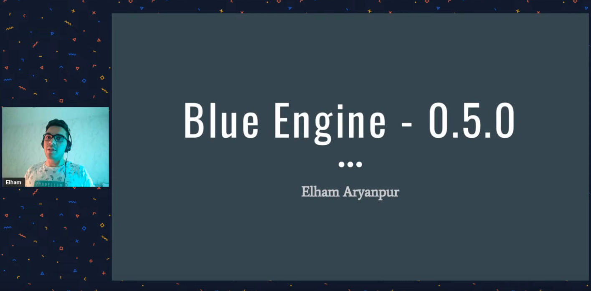
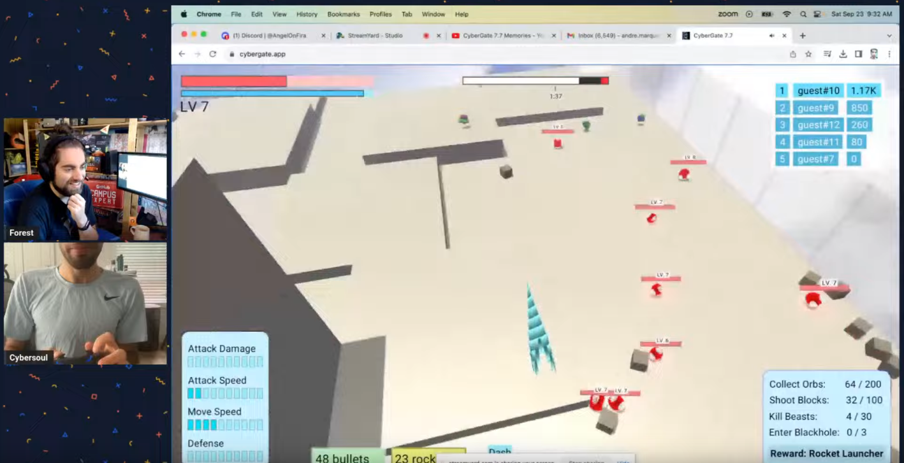
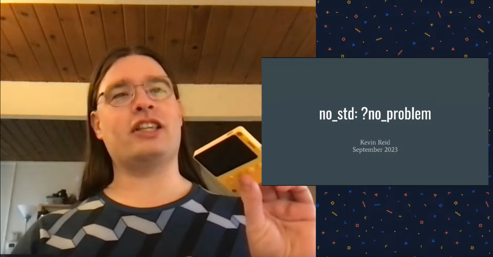

+++
title = "Rust Gamedev Meetup 30"
date = 2023-09-23
transparent = true
aliases = ["posts/gamedev-meetup-30"]
+++

<!-- markdownlint-disable single-title heading-increment -->
<!-- markdownlint-disable no-blanks-blockquote no-emphasis-as-header -->
<!-- markdownlint-configure-file {"line-length": {"heading_line_length": 120}} -->

The 30th Rust Gamedev Meetup took place on September 23rd. You can watch the
recording of the meetup [here on YouTube][meetup-video]. The meetup will take
place on the Rust Gamedev [YouTube][youtube-stream] and [Twitch][twitch-stream].
The meetups take place on the second Saturday of every month via the [Rust
Gamedev Discord server][rust-gamedev-discord] and are also [streamed on
Twitch][rust-gamedev-twitch].

[rust-gamedev-discord]: https://discord.gg/yNtPTb2
[rust-gamedev-twitch]: https://twitch.tv/rustgamedev
[meetup-video]: https://www.youtube.com/watch?v=fAp_-Hp2gGo
[youtube-stream]: https://www.youtube.com/@RustGameDevelopment
[twitch-stream]: https://www.twitch.tv/RustGameDev

## Talks

### [Blue Engine] | [@ElhamAryanpur]

> Updates about the Blue Engine project and its 0.5.0 release.

**Links:**

- [Blue Engine GitHub repository]
- [Blue Engine Discord server]

[@ElhamAryanpur]: https://github.com/ElhamAryanpur
[Blue Engine GitHub repository]: https://github.com/AryanpurTech/BlueEngine
[Blue Engine Discord server]: https://discord.gg/s7xsj9q

### [Cybergate] | [@cybersoulK]

> An overview of Cybergate, a multiplayer game being developed for native and
> browser play.

**Links:**

- [Cybergate Discord server]

[@cybersoulK]: https://github.com/cybersoulK
[Cybergate Discord server]: https://discord.gg/R7DkHqw7zJ

### [no_std: ?no_problem]  | [@kpreid]

> An introduction to making your Rust crates `no_std` compatible, and
> why you might want to do this.

**Links:**

- [YouTube Video]
- [Slides]

[@kpreid]: https://github.com/kpreid
[YouTube Video]: https://www.youtube.com/watch?v=Oq-3bOBrpeo
[Slides]: https://docs.google.com/presentation/d/e/2PACX-1vTfI-IhBIjyz3vf1sGAQSw02xUuQaDuQ5N4KZRvIdblJrX0uf9ijarVx7gwpUNzhhPotTEqKbgFP0Qe/pub?start=false&slide=id.p

[Blue Engine]: https://www.youtube.com/live/fAp_-Hp2gGo?si=3uhCXRBGEtJa9XY_&t=731
[Cybergate]: https://www.youtube.com/live/fAp_-Hp2gGo?si=U8yNvON23EqAXz19&t=1581
[no_std: ?no_problem]: https://www.youtube.com/live/fAp_-Hp2gGo?si=N_bzPJNx29XDhoyf&t=3010