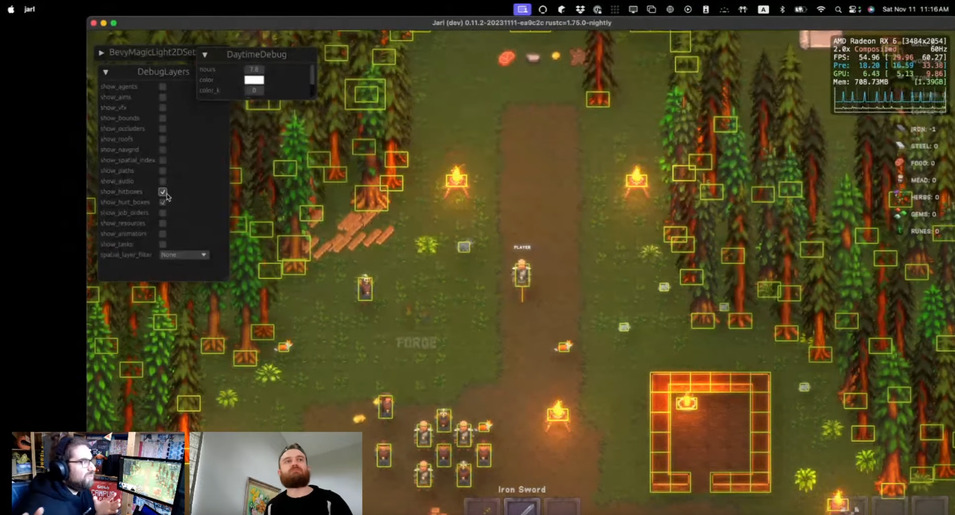

+++
title = "Rust Gamedev Meetup 32"
date = 2023-11-11
transparent = true
aliases = ["posts/gamedev-meetup-32"]
+++

<!-- markdownlint-disable single-title heading-increment -->
<!-- markdownlint-disable no-blanks-blockquote no-emphasis-as-header -->
<!-- markdownlint-configure-file {"line-length": {"heading_line_length": 120}} -->

The 32nd Rust Gamedev Meetup took place on November 11th. You can watch the
recording of the meetup [here on YouTube][meetup-video]. The meetup took
place on the Rust Gamedev [YouTube][youtube-stream] and [Twitch][twitch-stream].
The meetups take place on the second Saturday of every month via the [Rust
Gamedev Discord server][rust-gamedev-discord] and are also [streamed on
Twitch][rust-gamedev-twitch].

[rust-gamedev-discord]: https://discord.gg/yNtPTb2
[rust-gamedev-twitch]: https://twitch.tv/rustgamedev
[meetup-video]: https://www.youtube.com/watch?v=MadryxOwjb8
[youtube-stream]: https://www.youtube.com/@RustGameDevelopment
[twitch-stream]: https://www.twitch.tv/RustGameDev

## Talks

### [Minewars] | [@inodentry]

> An upcoming multiplayer minesweeper game.

**Links:**

- GH (incl GH Sponsors): [@inodentry]
- Mastodon: [@iyes@mastodon.gamedev.place]
- Discord: @iyesgames
- Open source client: [Minewars GitHub]
- Public documentation: [Minewars Documentation]
- Open-source vs proprietary plans: [Minewars FOSS Plans]

[@inodentry]: https://github.com/inodentry
[@iyes@mastodon.gamedev.place]: https://mastodon.gamedev.place/@iyes
[Minewars GitHub]: https://github.com/IyesGames/minewars
[Minewars Documentation]: https://iyes.games/minewars/book/
[Minewars FOSS Plans]: https://iyes.games/minewars/book/foss.html

### [Blade] | [@Kvark]

> Sharp and simple graphics library

**Links:**

- GitHub: [@Kvark]

[@Kvark]: https://github.com/kvark
[Blade]: https://github.com/kvark/blade

### [Jarl][Jarl Game] | [@zaycev]

> A fantasy colony simulator.

**Links:**

- GitHub: [@zaycev]
- Website: [Jarl Game]
- Twitter: [@jarl_game]
- YouTube: [Jarl-Game-com]
- Discord: [Jarl Discord server]

[@zaycev]: https://github.com/zaycev
[Jarl Game]: https://jarl-game.com/
[@jarl_game]: https://twitter.com/jarl_game
[Jarl-Game-com]: https://www.youtube.com/@Jarl-Game-com
[Jarl Discord server]: https://discord.com/invite/Dcwemjyfbb

### [Seeker] | [@inodentry] & [@c12hz]

> A 2D platformer game.

**Links:**

- Discord: [Seeker Discord server]
- GitHub: [@TheSeekerGame]

[@c12hz]: https://github.com/c12hz
[Seeker Discord server]: https://discord.gg/b7YRzMFzBN
[@TheSeekerGame]: https://github.com/TheSeekerGame/TheSeeker
