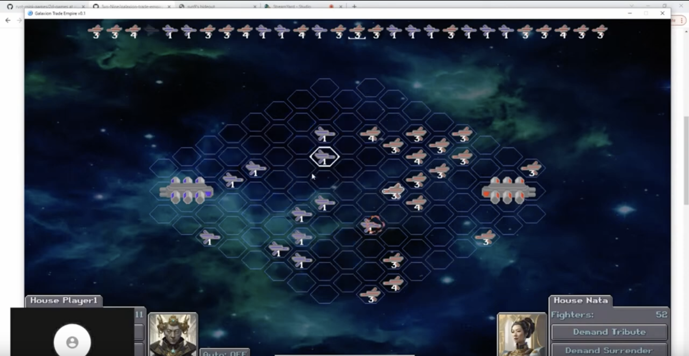
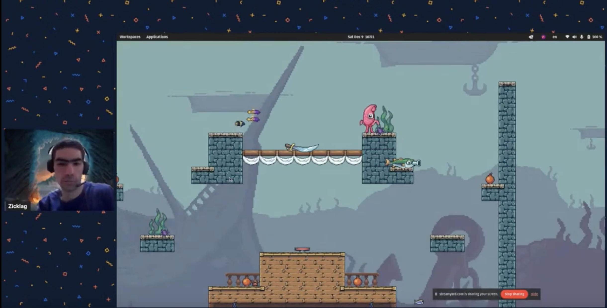

+++
title = "Rust Gamedev Meetup 33"
date = 2023-12-09
transparent = true
aliases = ["posts/gamedev-meetup-33"]
+++

<!-- markdownlint-disable single-title heading-increment -->
<!-- markdownlint-disable no-blanks-blockquote no-emphasis-as-header -->
<!-- markdownlint-configure-file {"line-length": {"heading_line_length": 120}} -->

The 33rd Rust Gamedev Meetup took place on December 9th. You can watch the
recording of the meetup [here on YouTube][meetup-video]. The meetup took
place on the Rust Gamedev [YouTube][youtube-stream] and [Twitch][twitch-stream].
The meetups take place on the second Saturday of every month via the [Rust
Gamedev Discord server][rust-gamedev-discord] and are also [streamed on
Twitch][rust-gamedev-twitch].

[rust-gamedev-discord]: https://discord.gg/yNtPTb2
[rust-gamedev-twitch]: https://twitch.tv/rustgamedev
[meetup-video]: https://www.youtube.com/watch?v=eItRSKJGV1I
[youtube-stream]: https://www.youtube.com/@RustGameDevelopment
[twitch-stream]: https://www.twitch.tv/RustGameDev

## Talks

### [Blue Engine][blue-engine-video] | [@ElhamAryanpur]

[][blue-engine-video]

> Updates about community work for the Blue Engine, as well as future engine
> features coming up.

**Links:**

- [Blue Engine GitHub repository]
- [Blue Engine Discord server]

[@ElhamAryanpur]: https://github.com/ElhamAryanpur
[blue-engine-video]: https://www.youtube.com/watch?v=7u9YrBOnTww
[Blue Engine GitHub repository]: https://github.com/AryanpurTech/BlueEngine
[Blue Engine Discord server]: https://discord.gg/s7xsj9q

### [Galaxion Trade Wars][galaxion-trade-wars-video] | [@Syn-Nine]

[][galaxion-trade-wars-video]

> Space Trading Game made in Rust based on the Trade Wars 2002 BBS game.

**Links:**

- [Galaxion Trade Wars GitHub repository]
- [Syn-Nine Twitter]
- [Syn-Nine Website]

[@Syn-Nine]: https://github.com/Syn-Nine
[galaxion-trade-wars-video]: https://www.youtube.com/watch?v=oNx5wqAsvXM
[Galaxion Trade Wars GitHub repository]: https://github.com/Syn-Nine/galaxion-trade-empire/
[Syn-Nine Twitter]: https://twitter.com/Syn9Dev
[Syn-Nine Website]: https://syn9.thehideoutgames.com/

### [Bones Engine][bones-engine-video] | [@zicklag]

[][bones-engine-video]

> A 'meta-engine' framework made to facilitate the development of moddable,
> multiplayer 2D games.

**Links:**
- [@zicklag]
- [Bone Engine GitHub repository]
- [Jumpy GitHub repository]
- [Jumpy's Migration to the Bones Framework]
- [Introducing Lua Scripting in Jumpy]

[@zicklag]: https://github.com/zicklag
[bones-engine-video]: https://www.youtube.com/watch?v=bEyZubAx_oM
[Bone Engine GitHub repository]: https://github.com/fishfolk/bones
[Jumpy GitHub repository]: https://github.com/fishfolk/jumpy
[Jumpy's Migration to the Bones Framework]: https://fishfolk.org/blog/jumpy-migration-to-bones-framework/
[Introducing Lua Scripting in Jumpy]: https://fishfolk.org/blog/introducing-lua-scripting-in-jumpy/
