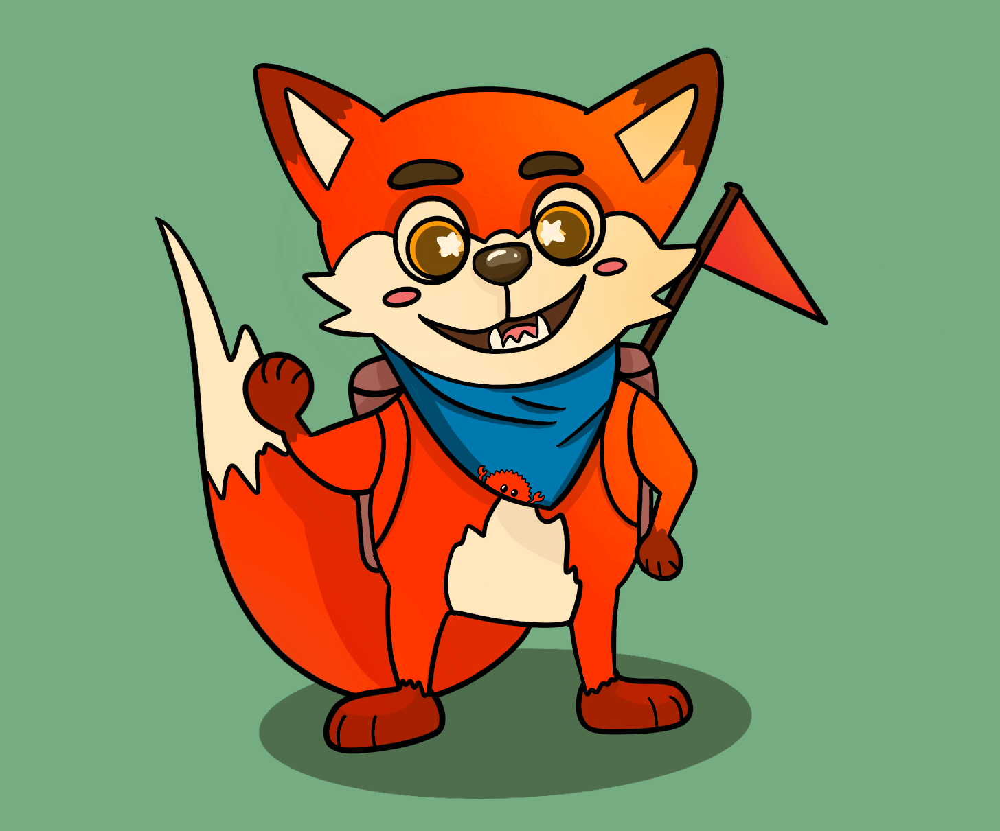

+++
title = "RustyJam 2"
date = 2022-06-11
transparent = true
+++

Hey everyone, we're finally announcing the [RustyJam #2][itch]!
It's a great chance to try out some new Rusty tech,
form a team of like-minded rustaceans, and feel what
a full cycle of making a game in Rust feels like in miniature!

Submissions will be open from June 18th to June 26th.
Voting on submissions will begin as soon as the jam ends and will run for a week.

This jam focuses more on using Rust than anything else.
That means you aren't restricted on your design, music, or graphics,
as long as you use Rust to make it!

The optional-to-use theme for the jam is going to be announced
[in the Rusty Jam Discord][discord] and pinned in the community section.
While you're waiting for the theme, you can start looking for a team
in the #looking-for-team Discord channel.
If you want to solo jam though, that's fine too.

[See the itch.io page for more details about dates, rules, modifiers, etc!][itch]

------

This jam's mascot is Aaron the Rust-loving fox ([submitted][mascot] by vSmiles)!

> Aaron is a proud supporter of Rust and loves spreading this love
> around the world.
>
> He hands out little red flags as he marks the places he's reached,
> and with his big furry smile, he wants Rust to be an approachable
> programming language that's suitable for anyone!
>
> He also has a very special bandana that features his little friend Ferris.

[itch]: https://itch.io/jam/rusty-jam-2
[discord]: https://discord.gg/8dUQJFFmxG
[mascot]: https://vsmiles.itch.io/aaron-the-rust-loving-fox
