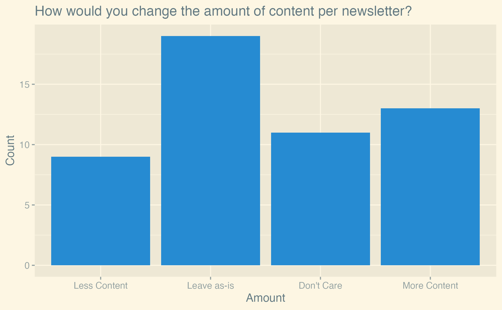
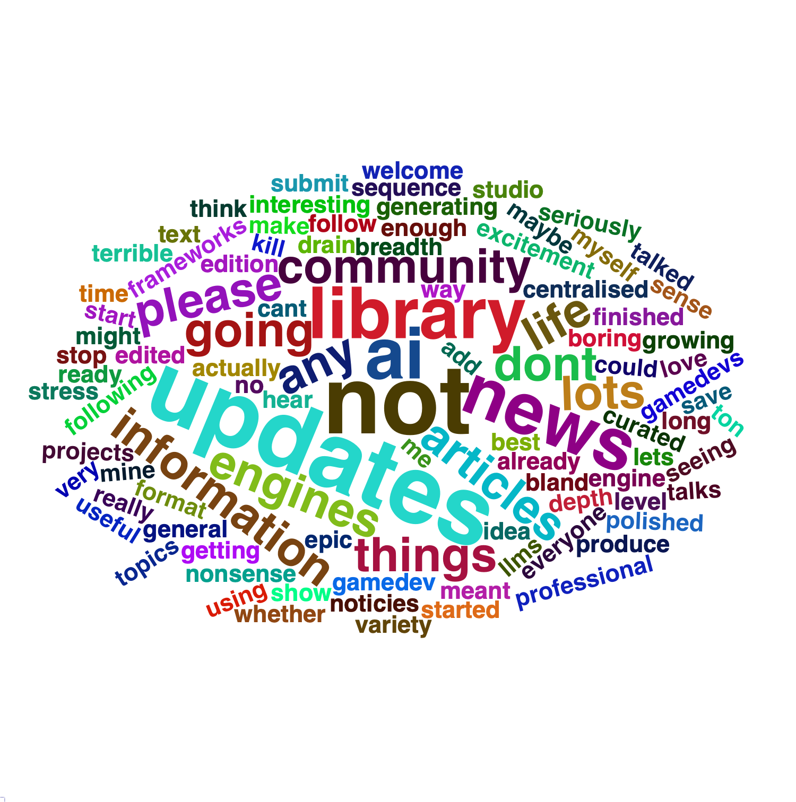
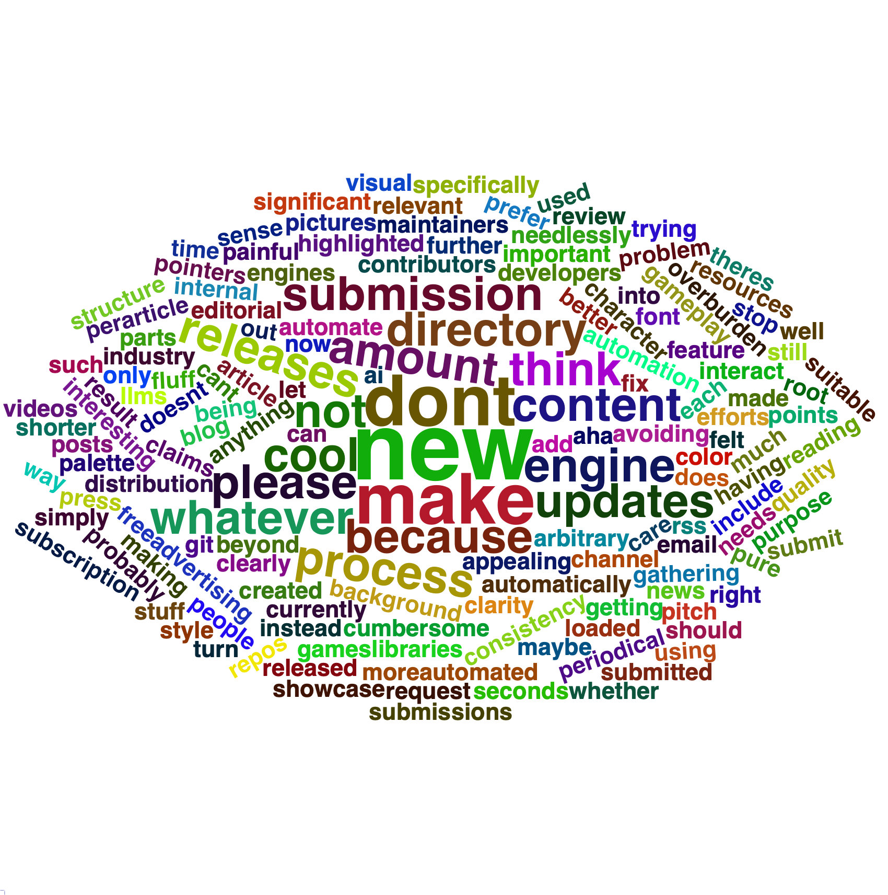

+++
title = "Newsletter Survey Results"
date = 2024-06-03
transparent = true
draft = false
+++

Since we are [rebooting the newsletter](https://gamedev.rs/blog/newsletter-changes/), we wanted to know more about our readers. 
52 of you filled out the survey last month. Thank you very much!

The biggest takeaways are:
- People are generally excited about the newsletter
- The current frequency of the newsletter is good
- Readers do not want anything in the newsletter generated by AI
- Contributing to the newsletter could be easier. If you've got ideas on how to make this happen, please [let us know](https://github.com/rust-gamedev/rust-gamedev.github.io/issues/1519)!

We will now go through the results in the same order as the questions were asked. The full analysis and data is open-sourced on [GitHub](https://github.com/janhohenheim/rust-gamedev-statistics/tree/main/jan-hohenheim-2024).

## Excitement

On average, readers are excited about the newsletter. The mean excitement level is 3.6 out of 5, the median is 4.
Our 95% confidence interval is [3.32, 3.91] using a standard error of 0.15 (sd = 1.05, n = 52).

These are fairly nice results. Anecdotally, we got a lot of messages about issues with the newsletter and how to improve it, 
so we are happy to see that the excitement is still high. Still, the data shows that we have room for improvement.

## Content Quantity

When asked about how to change the amount of content per newsletter, the majority of readers (58%) voted to leave the amount as-is or don't care. 
On the other hand, this means nearly half of the readers would change something about the content quantity. 
17% voted for "less content; keep only the most important news" and 25% for "more content; add sections for minor news".
These two options are luckily not mutually exclusive. 
One option we could implement is to have a new section for "minor news" where we don't go into detail, 
and a section for "miscellaneous links" where we only list some links without any commentary.

## Newsletter Frequency

73% of readers are either happy with the current frequency or don't care. A minority of 21% would like the newsletter to become quarterly. 
Arguments we've heard for this are that a lower frequency would allow editors to improve the quality that goes into each newsletter. 
Counterarguments include that a lower frequency would make the newsletter less timely. 
Things like calls for playtesters or job offers would be less useful if they were only sent out every three months.

## AI

This question was a catalyst for a lot of discussion on [Discord]. 

If we interpret the answers as a scale of 1-5, where 1 is "not okay at all" and 5 is "I love it", the mean answer was 2.25, the median 2.
Notably, the mode is tied at 1 and 2. The 95% confidence interval is [1.89, 2.61] using a standard error of 0.18 (sd = 1.30, n = 52). 
People are generally against using an LLM to generate summaries. 79.2% of readers would prefer not to use AI.

Viewed from another angle: while a majority of readers (65%) are at least okay with AI-generated summaries, 
a significant minority (35%) are not okay at all with this proposal.
These include very active members of the community and 
contributors who have announced that they would no longer want their content to be included in the newsletter if AI was used.

The reasons people gave for not wanting AI-generated summaries were varied.
Among these were:
- Solidarity with the large number of creatives who recently lost their jobs due to AI-generated content, 
inside and outside the game development industry.
- Concerns about the quality of AI-generated summaries.
- Skepticism about AI-generated summaries saving time if they still need to be edited by hand.

## Tone

A significant majority of readers (86.5%) are happy with the current tone of the newsletter, with a minority of 11.5% wanting a less formal tone. 
While votes for the latter did not reach a majority, the written feedback we got included quite a few requests for more "personality" in the newsletter.

## Contributions

The majority of readers (61.5%) have not yet contributed to the newsletter and 26.9% have contributed 2-5 times. 
Only 3.8% contributed exactly once, while the rest (7.7%) are heavy contributors, helping us out more than five times.

While it might seem weird that more people contributed 2-5 times than exactly once,
keep in mind that the former is the sum of people who contributed twice, thrice, four times, and five times. 
The reason we binned these together is that we are interested in the following categories:
- Pure readers
- People who contributed once and then stopped
- People who contributed a few times
- People who are regular contributors

We are happy to see that people who contributed once seem to continue contributing in the future.

## Ease

The mean ease of contributing is 3.0, and the median is 3. The 95% confidence interval is [2.5, 3.6] using a standard error of 0.26 (sd = 1.26, n = 23).

Readers generally feel neutral about the ease of contributing to the newsletter.

We can do better here, but we are not sure yet how. 
We'd love to hear your ideas on [GitHub](https://github.com/rust-gamedev/rust-gamedev.github.io/issues/1519) or on [Discord] (ping @janhohenheim).

## Keeping up with the newsletter

This was a multiple-choice question. The most popular source of information about the newsletter is RSS (27.5%). 
If we add the choices for the official [Rust GameDev Discord server][Discord] (21.7%) and other Discord servers (11.6%), 
Discord in general becomes the leading source of information (33.3%), taking up nearly exactly a third of all votes.

We can see the shift from X / Twitter to Mastodon reported by many OSS communities in our readers as well. 
Lemmy is not looking popular as an alternative to Reddit yet, with no reader reporting it as a source of information.

The "Email" option in the survey is meant for people who have set up some kind of email alerts manually.

Per written feedback, a lot of people want to see proper email subscriptions implemented. While this was a goal for this month, 
we have not managed to implement it yet.
We will try to [get this done](https://github.com/rust-gamedev/rust-gamedev.github.io/issues/24) for the next newsletter.

## What is going well

This was a free-text question. The above is a word cloud of the answers with some obvious words like "game" or "newsletter" removed.
Note that the inclusion of the word "AI" is misleading, as it was only mentioned in answers that read similar to 
"I like that we don't use AI, please don't use LLMs".

Going through the feedback by hand, common things readers enjoy about the newsletter are:
- A good mix of content
- Very open to contributions
- Small-scale games are featured, not just success stories or technical articles

## What needs to be improved

Another free-text question. The feedback here is fairly diverse. The most common complaints we already mentioned in previous sections are:
- Add an email subscription
- Improve the ease of contributing

Additionally, many people feel like the "Games" section reads more like an advertisement than an article aimed at other game developers.

Among the more unique suggestions were:
- Conduct interviews
- Have a stronger sense of personality in the writing
- Make the newsletter more consistent in timing and quantity
- Have more editors to not overburden the current ones
- Have some more clarity of purpose

## Comments

This last free-text question was meant for any additional comments readers might have. 
The word cloud above is dominated by one sentence: "Thank you for your work". Thank you very very much for your kind words! 
We are working on this newsletter in our free time because we love the community and Rust game development, so reading this means a lot to us.

## Correlations

We were interested in how the responses to some questions correlated with how much people had already contributed to the newsletter.
Long story short: it seems like there is no significant correlation between how much people contributed and how they answered the other questions.

Let's look at the correlations in turn now.
Note that all the following plots are jittered to make the data more readable.

### Excitement By Contributions

We hypothesized that people who contributed more to the newsletter would be more excited about it. 
We found no evidence for this (the p-value of a Jonckheere-Terpstra test for increasing trend is 0.986). 
Based on the plot above, we then hypothesized that the opposite might be true, namely that frequent contributors are less excited about the newsletter.
This actually might be the case (p-value is 0.021), but do not take this as a strong result.
It is a posthoc hypothesis and the resulting p-value is not very low considering the number of tests we run in this analysis. 
For these reasons, we do not consider this result to be significant.

### Feelings About AI By Contributions

We hypothesized that there would be a correlation between how much people contributed to the newsletter and how they felt about AI-generated summaries. 
We found no evidence for this (the p-value of a Jonckheere-Terpstra test for a two-sided alternative is 0.57).

### Ease of Contributing By Contributions

We hypothesized that there would be a correlation between how much people contributed to the newsletter and how easily they found it to contribute.

We found no evidence for this (the p-value of a Jonckheere-Terpstra test for a two-sided alternative is 0.25).

## Conclusion

All in all, we are happy with the results of the survey. 
It seems like our readers are generally happy with the newsletter, and have good ideas on how to improve it. 
We will discuss how to implement these ideas in the future and keep you updated on our progress.

If you are interested in helping us out, we are always looking for new editors and contributors. Just leave us a message on [Discord] or [GitHub].

Again, thank you very much for your feedback. Rebooting the newsletter was a big ordeal for us,
and we are happy to see such an active interest in the community. We hope that we can continue to provide you with a newsletter you enjoy.

Until next time!

~ The Rust GameDev Newsletter Team, and Jan Hohenheim in particular

[Discord]: https://discord.gg/yNtPTb2
[GitHub]: https://github.com/rust-gamedev/rust-gamedev.github.io
