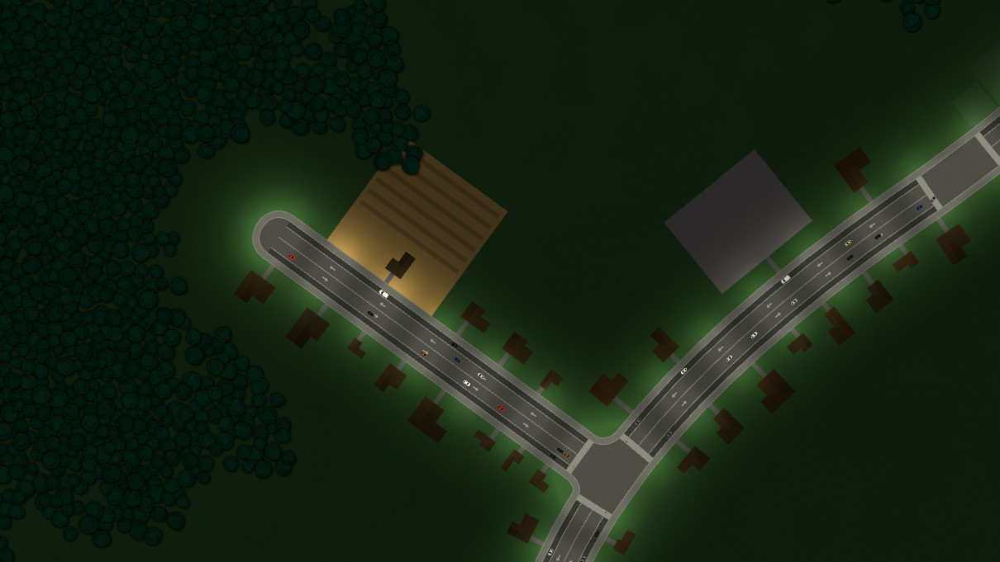
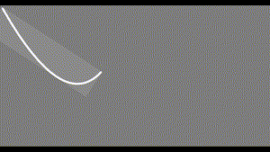
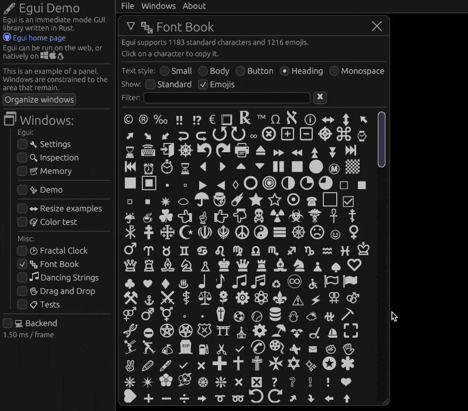

+++
title = "This Month in Rust GameDev #17 - December 2020"
date = 2021-01-14
transparent = true
aliases = ["posts/newsletter-017"]
+++

Welcome to the 17th issue of the Rust GameDev Workgroup's
monthly newsletter.
[Rust] is a systems language pursuing the trifecta:
safety, concurrency, and speed.
These goals are well-aligned with game development.
We hope to build an inviting ecosystem for anyone wishing
to use Rust in their development process!
Want to get involved? [Join the Rust GameDev working group!][join]

You can follow the newsletter creation process
by watching [the coordination issues][coordination].
Want something mentioned in the next newsletter?
[Send us a pull request][pr].
Feel free to send PRs about your own projects!

[Rust]: https://rust-lang.org
[join]: https://github.com/rust-gamedev/wg#join-the-fun
[pr]: https://github.com/rust-gamedev/rust-gamedev.github.io
[coordination]: https://github.com/rust-gamedev/rust-gamedev.github.io/issues?q=label%3Acoordination
[Rust]: https://rust-lang.org
[join]: https://github.com/rust-gamedev/wg#join-the-fun

Table of contents:

- [Rust GameDev Podcast #4](#rust-gamedev-podcast-4)
- [Rust Gamedev Meetup](#rust-gamedev-meetup)
- [Game Updates](#game-updates)
- [Learning Material Updates](#learning-material-updates)
- [Library & Tooling Updates](#library-tooling-updates)
- [Popular Workgroup Issues in Github](#popular-workgroup-issues-in-github)
- [Requests for Contribution](#requests-for-contribution)

<!--
Ideal section structure is:

```
### [Title]


_image caption_

A paragraph or two with a summary and [useful links].

_Discussions:
[/r/rust](https://reddit.com/r/rust/todo),
[twitter](https://twitter.com/todo/status/123456)_

[Title]: https://first.link
[useful links]: https://other.link
```

If needed, a section can be split into subsections with a "------" delimiter.
-->

## Rust Gamedev Meetup


The Rust Gamedev meetup will happen on the second Saturday of every month
at 16:00 GMT+0. The meetup will be an opportunity to chat with others
from the Rust game development community and see what people are working on.

The meetup will take place on the [Rust Gamedev Discord server][meetup].

_Discussions:
[/r/rust_gamedev](https://reddit.com/r/rust_gamedev/comments/ksflbm/the_first_rust_gamedev_meetup),
[Twitter](https://twitter.com/rust_gamedev/status/1347286339079860225)_

[meetup]: https://discord.gg/yNtPTb2

## [Rust GameDev Podcast #4][podcast-4]


[The 4th podcast episode][podcast-4] is an interview with [Fedor Logachev][@fedor_games],
creator of the [macroquad] and [miniquad] games libraries.

> We discuss the libraries' features, development, and plans for the future
> as well as the accompanying book and games project that will act
> as both an introduction to Rust games development and the Macroquad library.

Listen and subscribe from the following platforms:
[Rust GameDev Podcast (simplecast)](https://rustgamedev.com/),
[Apple Podcasts](https://podcasts.apple.com/gb/podcast/rust-game-dev/id1526304768),
[Spotify](https://open.spotify.com/show/7HRfGnTcXkLkQd9fxJbDGj),
[RSS Feed](https://feeds.simplecast.com/C6NQglnL),
[Google Podcasts](https://podcasts.google.com/feed/aHR0cHM6Ly9mZWVkcy5zaW1wbGVjYXN0LmNvbS9DNk5RZ2xuTA).

_Discussions:
[/r/rust_gamedev](https://reddit.com/r/rust_gamedev/comments/kit4pa/rustgamedev_podcast_4_fedor_logachev)_

[podcast-4]: https://rustgamedev.com/episodes/interview-with-fedor-logachev
[@fedor_games]: https://twitter.com/fedor_games
[macroquad]: https://github.com/not-fl3/macroquad
[miniquad]: https://github.com/not-fl3/miniquad

## Game Updates

### [Way of Rhea has a Discord!][wor-discord]


_Updated visuals for interactive items._

[Way of Rhea][wor-website] is a puzzle platformer that takes place in a world
where you can only interact with objects that match your current color. The game
is being developed in a custom built Rust game engine and hot swappable
scripting language.

This month's updates:

- More progress has been made on the hub world! The game is no longer fully
  linear.
- All interactive elements are getting a visual update, pictured above.
- The devs have created [a Discord server][wor-discord] where you can hang out,
  stay up to date on the latest developments, and if you're interested, chat
  about the implementation (see the `#tech` channel.)

[wor-discord]: https://discord.gg/JGeVt5XwPP
[wor-website]: https://anthropicstudios.com/way-of-rhea

### [Veloren][veloren]


_A village over the river_

[Veloren][veloren] is an open world, open-source voxel RPG inspired by Dwarf
Fortress and Cube World.

In December, Veloren [released its 100th devblog][veloren-blog-100]!
This edition included sections about all aspects of the project
from 20 contributors, making it by far the longest Veloren devblog yet:

- [A journey to implement a controller support with gilrs][veloren-gilrs].
- Two sections about modelling: [by @Gemu][veloren-modelling-1]
  and [by @Snowram][veloren-modelling-2].
- [Veloren's database persistence and inventory improvements][veloren-persistence].
- [Combat improvements: new weapon skills, better AI, and a poise system][veloren-combat].
- [Network analysis and an overview of new Network Backend][veloren-net].
- Overviews of [the state of graphics and UI][veloren-graphics],
  [the graphical future of the game][veloren-graphic-future],
  and [UI progress][veloren-ui].
- [Procedural generation of unique, good looking, and fun to climb trees][veloren-trees].
- [New website design prototypes][veloren-site].
- And lots of other interesting sections with updates
  and personal contributors' stories.

Other December updates include:

- Lots of work on the economic simulation:
  [part 1][veloren-econ-1], [part 2][veloren-econ-2].
- [Reflective water was added to the level of detail system][veloren-98-contributors],
  making far-off lakes look much better.
- A plugin system is in the prototyping phase.
  This will eventually allow mods to be added to the game.
- An aura system was added for radial buffs around entities, for example,
  being near a fireplace now allows you to heal.

December's full weekly devlogs: "This Week In Veloren...":
[#97](https://veloren.net/devblog-97),
[#98](https://veloren.net/devblog-98),
[#99](https://veloren.net/devblog-99),
[#100](https://veloren.net/devblog-100).

[][veloren-0.8-gameplay]
_[New glider physics][veloren-glider] video_

In January, work will continue on 0.9. Work will be done on economic simulation,
world simulation, and combat systems. New developers are joining the project
every month, and development is moving forward quickly.

[veloren]: https://veloren.net
[veloren-blog-100]: https://veloren.net/devblog-100
[veloren-98-contributors]: https://veloren.net/devblog-98/#contributor-work
[veloren-econ-1]: https://veloren.net/devblog-98#economic-simulation-update-by-christof
[veloren-econ-2]: https://veloren.net/devblog-99#economic-simulation-by-christof
[veloren-ui]: https://veloren.net/devblog-100#ui-progress-by-pfau
[veloren-glider]: https://veloren.net/devblog-100#glider-physics-by-slipped
[veloren-gilrs]: https://veloren.net/devblog-100#mckol-s-veloren-journey
[veloren-modelling-1]: https://veloren.net/devblog-100#modeling-with-gemu
[veloren-modelling-2]: https://veloren.net/devblog-100#modeling-with-snowram
[veloren-persistence]: https://veloren.net/devblog-100#work-by-xvar
[veloren-combat]: https://veloren.net/devblog-100#combat-improvements-by-james
[veloren-net]: https://veloren.net/devblog-100#network-analysis-by-xmac94x
[veloren-graphics]: https://veloren.net/devblog-100#the-state-of-graphics-and-ui-by-imbris
[veloren-trees]: https://veloren.net/devblog-100#procedural-trees-by-ccgauche
[veloren-site]: https://veloren.net/devblog-100#new-website-design-by-songtronix
[veloren-graphic-future]: https://veloren.net/devblog-100#looking-to-the-graphical-future-by-sharp
[veloren-0.8-changelog]: https://gitlab.com/veloren/veloren/-/blob/master/CHANGELOG.md#080-2020-11-28
[veloren-minidebconf-talk]: https://youtube.com/watch?v=76FPpOnshNw
[veloren-0.8-gameplay]: https://youtube.com/watch?v=8WWVe1cIu7I

### [15-minute Santa][15m-santa]


In [15-minute Santa][15m-santa], you deliver presents around a city,
occasionally stopping at a restaurant to refuel -- biking uphill in the snow
isn't easy! The game uses real data from OpenStreetMap and local GIS sources to
know where shops, single-family homes, and apartments are located. In places
where zoning rules keep people separated from food, Santa will have a hard
time.

15-minute Santa was created by the [A/B Street][abstreet] team as an experiment
to see how quickly we could build a simple arcade game that gets people
thinking about how their city is designed. [The code][santa-code] doesn't make
use of an entity-component system or an existing engine, and animation and
particle effects don't use a custom shader. The game runs natively on Linux,
Mac, and Windows, and on web browsers. There are instructions for modding the
game and adding your own city!

A/B Street updates will return next month. In the meantime, please comment on
the [2021 roadmap][abstreet-roadmap].

[15m-santa]: http://santa.abstreet.org
[abstreet]: https://abstreet.org
[santa-code]: https://github.com/dabreegster/abstreet/tree/master/santa/src/
[abstreet-roadmap]: https://docs.google.com/document/d/1oV4mdtb0ve-wf0HqbEvR9IwXLIkTeDu8a3UnJxnr2F0

### [Egregoria]



[Egregoria]'s objective is to become a granular society simulation,
filled with fully autonomous agents interacting with their world in real time.
The city should evolve by itself and form interesting patterns.

The [7th devlog][egregoria-blog-post] was published. Celebrating the first
anniversary of the project! Updates include:

- A summary of Egregoria's progress and ambition.
- Music and sounds.
- Basic economy design.
- A specialized gridlock detection algorithm.

Join [Egregoria's Discord server][egregoria-discord].

[Egregoria]: https://github.com/Uriopass/Egregoria
[egregoria-blog-post]: http://douady.paris/blog/egregoria_7.html
[egregoria-discord]: https://discord.gg/CAaZhUJ

### [doukutsu-rs][drs-repo]


[doukutsu-rs][drs-repo] is a remake of [Cave Story][cave-story] engine,
meant to be a drop-in replacement for the original game executable
(both freeware and commercial version), focused on being a portable modding
tool (most Cave Story mods patch the executable directly, including machine
code editing/assembly hacks) and adding various visual and gameplay-related
enhancements.

Built mainly using modified [ggez] crate, runs on desktop and Android.

Changes done during the last month:

- [An Android port with full touchscreen controls][drs-android].
- Work has been started on Lua API, meant for building custom stuff
  on top of the engine.
- Work started on pushing the project's changes upstream and moving back
  to mainline versions of crates.
- Improvements to the Organya player (a simple synthesizer that plays the
  in-game music using a set of 100 waves and 6 drum samples).
- A bunch of missing NPCs, bosses, and other stuff were added.
- The way how game loop works was redesigned, in preparation
  for adding networked multiplayer support.
- Countless bug fixes.

[drs-discord]: https://discord.gg/fbRsNNB
[drs-repo]: https://github.com/doukutsu-rs/doukutsu-rs
[cave-story]: https://en.wikipedia.org/wiki/Cave_Story
[ggez]: https://ggez.rs
[drs-android]: https://reddit.com/r/rust/comments/kh79r1/made_my_rust_remake_of_cave_story

### [Antorum]


[Antorum] is a micro-multiplayer online role-playing game by [@dooskington].
The game server is written in Rust, and the official client is being developed
in Unity.

December was an important month for the game. Along with tons of little fixes
and changes, major features such as NPC Dialog were finally implemented! Check
out the dev logs for more info.

- [#26: Various Improvements](https://ratwizard.dev/dev-log/antorum/26);
- [#27: The Big 2020 End-Of-Year Update](https://ratwizard.dev/dev-log/antorum/27);

[Antorum]: https://ratwizard.dev/dev-log/antorum
[@dooskington]: https://twitter.com/dooskington

### [A Zombie Shooter Game][zombie-shooter]

[][zombie-shooter-youtube]
_Watch a [video demo on YouTube][zombie-shooter-youtube]_

[A Zombie Shooter Game][zombie-shooter] is a work-in-progress multiplayer
top-down shooter. Actually, it's a Rust port of an old Java game with
a very simple goal - to shoot zombies chasing after you.
The game has several
advantages, like high-quality bullet ballistics and geocentric camera rotation
relative to the player.

This month's updates:

- Dummy AI.
- Projectiles (shooting) synchronization over network.
- Collision detection.

You can discuss the project at [its GitHub forum][zombie-shooter-forum].

[zombie-shooter]: https://github.com/aunmag/shooter-rust
[zombie-shooter-youtube]: https://youtu.be/9o6KjlwKyGo
[zombie-shooter-forum]: https://github.com/aunmag/shooter-rust/discussions

### [Akigi][akigi]

[Akigi][akigi] is a work-in-progress multiplayer online game world. Akigi
is being developed by [@chinedufn] for the web and desktop using a custom
Rust game engine.


_Moving while attacking. Don't look at the shoulders._

December updates include:

- [Support for additive animation blending][aiming] was added
  in order to be able to aim bows.
- A somewhat operational [skill progress meter][skill-progress] was added.
- A [discussion on Reddit][learning-art] about learning art as a programmer.

Full December's devlogs:
[#96](https://devjournal.akigi.com/december-2020/096-2020-12-06.html),
[#97](https://devjournal.akigi.com/december-2020/097-2020-12-13.html),
[#98](https://devjournal.akigi.com/december-2020/098-2020-12-20.html),
[#99](https://devjournal.akigi.com/december-2020/099-2020-12-27.html).

[akigi]: https://akigi.com
[skill-progress]: https://devjournal.akigi.com/december-2020/097-2020-12-13.html
[aiming]: https://devjournal.akigi.com/december-2020/099-2020-12-27.html#aiming
[learning-art]: https://reddit.com/r/gamedev/comments/k8i773/how_i_a_mere_programmer_am_learning
[@chinedufn]: https://chinedufn.com

### [Swoop][swoop-itch]


_Getting lapped by purple? - don't worry, it happens to everyone_

[Swoop][swoop-itch] by [@sdfgeoff] is a procedural racing web game
written in Rust from scratch.

> I've tried to make games in a variety of engines, but invariably got frustrated.
> So I decided to throw out the engine and find out what makes game-making so complex.
> It turns out that the stuff below the game engine is only slightly less friendly
> than the stuff above it.
>
> All up this game was a large experiment:
> I'm not all that familiar with Rust, it was my first go at targetting WASM,
> I've never used WebGL before, and my linear algebra is worse than I thought.

[The source code is available here][swoop-source] and
you can also read about the process of making the game
here: ["WASM Games From Scratch"][swoop-book].

You can also play the game's [prototype version done in shadertoy][swoop-shadertoy]
and check out a [prototype of the next @sdfgeoff's project][swoop-next]
that is based on raymarching giant caves.

[swoop-itch]: https://sdfgeoff.itch.io/swoop
[swoop-source]: https://github.com/sdfgeoff/wasm_minigames
[swoop-shadertoy]: https://shadertoy.com/view/WlScWd
[swoop-book]: https://sdfgeoff.github.io/wasm_minigames/a_first_game_swoop.html
[swoop-next]: https://shadertoy.com/view/tltyRB
[@sdfgeoff]: https://github.com/sdfgeoff

### Harvest Hero


_Harvest crops and whack those pesky Groobles!_

Harvest Hero by [@bombfuse_dev] is an arcade/roguelike game.
This month in development:

- A new level type called "Harvest Defense" was added.
- Some quality of life features like background music and sfx volume control
  were added.
- The devs began working with some artists to provide a music
  and pixelart makeover.

[@bombfuse_dev]: https://twitter.com/bombfuse_dev

### [FreeNukum][fn]


[FreeNukum][fn] is a free software clone of the 1991 DOS game *Duke Nukem
1* jump'n run by [@silwol]. Development of the game started in 2007, back
then it was written in C using SDL1. In 2020, the codebase was gradually
migrated to Rust, after that it got updated to SDL2. The first version
fully implemented in Rust was [released to crates.io][fn-crates-io] and
[announced on Reddit][fn-reddit-announce] in December 2020.

Some of [this month's changes][fn-changelog]:

- Controller support was added.
- Some of the actors found in the original game were added.
- The hero can do somersaults when jumping with boots.
- The project's wiki now has a ["FreeNukum Screenshots" page][fn-screenshots].
- A [Matrix chat room][fn-matrix-chat] is now available.


_Somersaults!_

[fn]: https://gitlab.com/silwol/freenukum
[fn-reddit-announce]: https://reddit.com/r/rust_gamedev/comments/k9dw50/freenukum
[fn-crates-io]: https://crates.io/crates/freenukum
[fn-screenshots]: https://gitlab.com/silwol/freenukum/-/wikis/FreeNukum-Screenshots
[fn-matrix-chat]: https://matrix.to/#/#freenukum:matrix.org
[fn-changelog]: https://gitlab.com/silwol/freenukum/-/blob/main/CHANGELOG.md
[@silwol]: https://chaos.social/@silwol

### [openEtG]


[openEtG] is an open source engine that is an HTML5 successor to the original
[Elements the Game][Elements], featuring additional cards and balance.
In December, 10k lines of JavaScript source were rewritten in Rust:

> Overall I've been brainstorming this change for a couple years. So I'd already
> shifted from a classical OOP mess with Shield/Weapon/Pillar inheriting from
> Permanent to one where everything is a Thing. This also made sense because in
> openEtG there's spells like Flying Weapon which convert the player's weapon
> into a creature. So before I'd create a new Creature filled in with stats from
> original weapon, whereas now it's mostly just moving the instance into a
> creature slot & updating its type tag.

You can read the full openEtG December writeup [here][openEtG-writeup].

[openEtG]: https://etg.dek.im
[Elements]: http://elementsthegame.com
[openEtG-writeup]: https://reddit.com/r/rust/comments/k3jy5g/i_rewrote_10k_lines_of_js_into_rust

### [Weegames][weegames-itch]


[Weegames][weegames-itch] is a fast-paced minigame collection.

The game now has a [web demo][weegames-itch] ([source][weegames-demo-source])
made with macroquad.
Sound was recently added to the demo using the quad-snd library.

[weegames-itch]: https://yeahross.itch.io/weegames
[weegames-demo-source]: https://github.com/yeahross0/Weegames-Demo

### [Shotcaller]


_ASCII and sprites versions of Shotcaller interface._

[Shotcaller] is a moddable RTS/MOBA game made with bracket-lib.

No new release is out yet, but several major updates happened:

- [Basic AI profiles](https://github.com/amethyst/shotcaller/pull/19) for leaders.
- [TreePerson](https://github.com/amethyst/shotcaller/pull/24) leader added.
- [Generic Leader 2](https://github.com/amethyst/shotcaller/pull/25) pending.
- More documentation.
- The game moved from specs to their own, heavily specs-based plank_ecs.

Contributions welcome: [try add a new Leader][shotcaller-issue-leader].

[Shotcaller]: https://github.com/amethyst/shotcaller
[shotcaller-web]: https://shotcaller.jojolepro.com/
[shotcaller-issue-leader]: https://github.com/amethyst/shotcaller/issues/6

### [Cheese]


_Pew pew!_

[Cheese] is a small Real Time Strategy game created for the
[GitHub Game Off 2020]. It was written using a 'low-level gamedev stack'
consisting of:

- [wgpu-rs] for rendering,
- [gltf] models,
- [wgpu_glyph] for text rendering
- [legion] for ECS
- and [lyon_tessellation] for rendering 2D UI elements.

The game is in a finished state, but it would be relatively easy to add new
features such as unit types and buildings.

Check out the source code at [github.com/expenses/cheese].

[Cheese]: https://expenses.itch.io/cheese
[GitHub Game Off 2020]: https://itch.io/jam/game-off-2020
[wgpu-rs]: https://github.com/gfx-rs/wgpu-rs
[gltf]: https://crates.io/crates/gltf
[wgpu_glyph]: https://crates.io/crates/wgpu_glyph
[legion]: https://crates.io/crates/legion
[lyon_tessellation]: https://crates.io/crates/lyon_tessellation
[github.com/expenses/cheese]: https://github.com/expenses/cheese

### [Vollmond][vollmond]


[Vollmond][vollmond] is a small non-violent adventure in the style of Zelda 2.
You as a player are cursed and must find 4 ingredients for the famous
`Moonshot` disenchantment potion.

It was initially created for the Github Game Off 2020 Jam to gain experience
with WASM and [macroquad]. This month a post jam version was released.
It contains:

- implementation of user feedback,
- adding music and sound effects.

The [source code][vollmond-source] is available and includes the following
technical implementations:

- drawing and modifying multilayer tilemap,
- tile-based animation and collision logic,
- tweening und timer,
- 4-way top-down and sideways player movement,
- independent game scenes.

[vollmond]: https://puppetmaster.itch.io/vollmond
[vollmond-source]: https://github.com/puppetmaster-/vollmond
[macroquad]: https://github.com/not-fl3/macroquad

## Learning Material Updates

### [How to Revive a Dead Rust Project][rustfest-talk]

[][rustfest-talk]
_Drawing by [Carlo Gilmar][visual_partner]. Click to [watch the talk.][rustfest-talk]_

At [RustFest Global 2020], [@micah_tigley] and [@carlosupina] talked about their
experiences collaborating together to revive the [space_shooter_rs] project through
effective planning, refactoring, and documentation. The video was recently
[released on YouTube][talk-tweet] in December!

Since then, both developers have been working away on improving the
game. Some updates include:

- [Adding debug lines for hitboxes][debug-lines]
- [Creating configurations files to store player variables][player-config]

[@micah_tigley]: https://twitter.com/micah_tigley
[@carlosupina]: https://twitter.com/carlosupina
[RustFest Global 2020]: https://rustfest.global/
[rustfest-talk]: https://www.youtube.com/watch?v=qoCryIy4bFE
[visual_partner]: https://twitter.com/visual_partner
[talk-tweet]: https://twitter.com/carlosupina/status/1341763006716407808
[space_shooter_rs]: https://github.com/amethyst/space_shooter_rs
[debug-lines]: https://twitter.com/carlosupina/status/1335289462738259974
[player-config]: https://github.com/amethyst/space_shooter_rs/pull/101

### [Building Pikachu Volleyball][pikachu-video]

[][pikachu-video]
_Click to [watch the video on YouTube][pikachu-video]_

[Building Pikachu Volleyball][pikachu-video] by [@danlogs] is the latest episode
of a video series inspired by Shing Lyu's book [Practical Rust Projects][amazon-book].
Here, [@danlogs] re-creates the Pikachu spin-off game from 1997
by Satoshi Takenouchi - Pikachu Volleyball.

Apart from being a good way for aspiring game developers to start
understanding the gist of game dev with Rust, this video also displays some of
the language's hardest topics (i.e. ownership, lifetimes, modules, etc.)
in a real-world application.

[The source code is available here.][pikachu-src]

Join the [danlogs's Discord channel][danlogs-discord]
or follow [@danologue on Twitter][@danologue].

[pikachu-src]: https://github.com/danbugs/danlogs/tree/master/rust/projects/pikachu_volleyball
[pikachu-video]: https://youtube.com/watch?v=Z1sxCC0CDts
[@danlogs]: http://youtube.com/c/danlogs
[amazon-book]: https://amazon.com/Practical-Rust-Projects-Computing-Applications/dp/1484255984
[danlogs-discord]: https://discord.com/invite/fSWE49H
[@danologue]: https://twitter.com/danologue

### [Creative Coding in Rust: Re-creating Retro Screensaver][timclicks-session]

[][timclicks-session]
_You can [watch the recording here][timclicks-session]._

[@timClicks] live streamed a coding session featuring
[Nannou][timclicks-nannou], an open-source creative-coding framework,
which is used to recreate the Mystify screensaver that appeared in Windows 3.1.

_Discussions:
[/r/rust](https://reddit.com/r/rust/comments/jxhozr/creative_coding_in_rust),
[Twitter](https://twitter.com/timClicks/status/1327789155930128387)_

[@timClicks]: https://twitter.com/timClicks
[timclicks-session]: https://youtube.com/watch?v=d9lsT4kJo44
[timclicks-nannou]: https://nannou.cc

### [Drawing Bezier curves with SDFs][bezier_article]


_The demo is available [here][bezier_demo]_

A short note by [@VladZhukov0] about drawing Bezier curves (strokes)
with signed distance fields.
Continuation of a [previous note][hqlines] about drawing lines with SDF.

[bezier_article]: https://vladjuckov.github.io/beziers-sdf
[bezier_demo]: https://pum-purum-pum-pum.github.io/bezier
[@VladZhukov0]: https://twitter.com/VladZhukov0
[hqlines]: https://vladjuckov.github.io/hqlines

### [Nannou: Creative Coding with Rust][mactuitui-talk]

[][mactuitui-talk]
_You can [watch the recording here][mactuitui-talk]._

[Alexis André][@mactuitui] gave a [talk][mactuitui-talk] at
[GitHub Universe][mactuitui-github-universe] about working with Rust
and [Nannou][mactuitui-nannou-website], an open-source creative-coding
framework.

> Alexis André is an artist, researcher, and designer aiming at redefining
> entertainment. In this golden age of computation and data overflow,
> why is our entertainment still designed to be consumed in a passive
> way? A few media are offering interactive experiences, but none of
> them are designed specifically for you. In this live demo, Alexis
> will create a sketch from scratch for participants to experience
> what it's like working with Nannou and Rust.

The code is available at [GitHub][mactuitui-repository].

_Discussions:
[Twitter][mactuitui-discussion]_

[@mactuitui]: https://twitter.com/mactuitui
[mactuitui-talk]: https://www.youtube.com/watch?v=Ml6tpyTyXhM
[mactuitui-repository]: https://github.com/MacTuitui/nannou-universe
[mactuitui-discussion]: https://twitter.com/MacTuitui/status/1339863034991276035
[mactuitui-nannou-website]: https://nannou.cc
[mactuitui-github-universe]: https://githubuniverse.com/Nannou-creative-coding-with-Rust/

### [Undergrad Thesis on Game Scripting for Legion][legion-script]

In December 2020, [@pablodiegoss] and [@rodrigocam] presented their undergrad
thesis where they created a proof-of-concept scripting system for the Legion ECS,
called [Legion Script][legion-script].
Legion is being currently integrated into the [Amethyst game engine][amethyst],
and this contribution might be included in future releases.

With [Legion Script][legion-script], it is possible to declare, write and read
components into Legion using Python scripts.
However, this project exports an API that can be evolved
for other languages and interpreters.

Since then, both developers have been sharing their work and receiving feedback
for the project while planning the next steps for the code, which is available
at [GitHub][legion-script].

The PDF version of the thesis could be found
in [this Amethyst forum thread][thesis-thread].

[legion-script]: https://github.com/redcodestudios/legion_script
[@pablodiegoss]: https://github.com/pablodiegoss
[@rodrigocam]: https://github.com/rodrigocam
[amethyst]: https://github.com/amethyst/amethyst
[thesis-thread]: https://community.amethyst.rs/t/undergrad-thesis-on-game-scripting-for-legion/1753

### [Triangle from Scratch][tri-scratch]

[Triangle from Scratch][tri-scratch] ([source code][tri-scratch-src])
is a new tutorial series by [@Lokathor]
about drawing a triangle without using any outside crates.
So far there's just one article for opening a window using the Win32 API,
but more subjects and on more platforms will be added over time.
From the author:

> The point isn't that we specifically care about drawing the triangle.
> That's just a goal that's easy to grasp.
> The point is that we're doing it with no dependencies as a way
> to get ourselves to learn about low level OS interaction details as we go.
> That said, the "no crates" rule is for educational purposes only;
> please feel free to use crates in normal situations.

[tri-scratch]: https://rust-tutorials.github.io/triangle-from-scratch
[tri-scratch-src]: https://github.com/rust-tutorials/triangle-from-scratch
[@Lokathor]: https://twitter.com/Lokathor

### [WASM Games From Scratch][wasm-scratch-book]


[@sdfgeoff] published a book that describes the process
of building the abovementioned web game [Swoop][swoop-itch] from scratch:
["WASM Games From Scratch"][wasm-scratch-book].

> Game engines are huge behemoths, and contain algorithms
> for handling everything and the kitchen sink.
> While that's normally good, if you want to do something small,
> or possibly do something outside the bounds of a normal game engine,
> you suddenly have to learn how to do everything yourself.
>
> Or perhaps you just like the "type it and run" style of development
> for shadertoy shaders and want something similar
> that you can host on your system as (pretty much) a single file.
>
> Either way, this book chronicles my adventures
> into creating WASM games from scratch in Rust.

Some of the topics covered by the book:

- Building for WASM, event handling, WebGL, and shader basics.
- Map generation using a Fourier series.
- Camera positioning and drawing a map, ships, and engine trails.
- Ship physics and simple AI.

[wasm-scratch-book]: https://sdfgeoff.github.io/wasm_minigames

## Library & Tooling Updates

### [Thermite SIMD]: Melt Your CPU

Thermite is a WIP SIMD library focused on providing portable SIMD (Single
Instruction, Multiple Data) acceleration of SoA (Structure of Arrays)
algorithms, using consistent-length SIMD vectors for lockstep iteration and
computation. Extensive research and work have gone into minimizing wasted CPU
cycles and making the most out of what your CPU can do.

The goal of Thermite is to provide highly optimized feature-rich backends for
SSE2, SSE4.2, AVX and AVX2, with planned support for AVX512, ARM/Aarch64 NEON,
and WASM SIMD extensions. In addition to that, Thermite will include a highly
optimized vectorized math library with many special math functions and
algorithms, specialized for both single and double precision.

Thermite has been worked on for a little over a month now. The AVX2 backend and
vectorized math library are almost fully implemented. Pre-AVX2/WASM/ARM backends
are a work in progress. The latest documentation is available
[here][thermite-documentation].

[thermite-documentation]: https://raygon-renderer.github.io/thermite/
[Thermite SIMD]: https://github.com/raygon-renderer/thermite

### [This Month in Mun][mun-december]

[][Mun]

[Mun] is a scripting language for gamedev focused on quick iteration times
that is written in Rust.

November went by without the usual monthly update from the Mun team, as they
were unable to make much headway. Instead they posted a slightly different
[blog][mun-november], expressing their desire to add a third developer to the
Mun Core Team, whom they are willing to fund themselves - albeit a token
amount.

The team was able to start ramping back up during the holiday; those
[December updates][mun-december] include:

- language support for `use` statements;
- Rust version updates and bugfixes.

[Mun]: https://mun-lang.org
[mun-november]: https://mun-lang.org/blog/2020/12/07/this-month-november
[mun-december]: https://mun-lang.org/blog/2021/01/05/this-month-december

### [Kira]

[Kira] by [@tesselode] is an audio library designed to help create expressive
audio for games. It aims to fill the holes in many game engines' built-in audio
APIs with features for creating seamless music loops and scripting audio events.

Kira v0.2.0 and v0.3.0 were released recently with quite a few improvements:

- Arrangements for stitching together multiple sounds and better seamless looping
- Per-sequence custom event types
- Groups for controlling multiple instances at a time
- Audio streams for sending arbitrary audio data to the mixer
- Lots of smaller features and workflow improvements

Kira v0.4.0 is in the works with an API refactor, serde support for config
structs, and WASM support.

[Kira]: https://github.com/tesselode/kira
[@tesselode]: https://twitter.com/tesselode

_Discussions:
[/r/rust](https://www.reddit.com/r/rust/comments/kkf1jz/kira_game_audio_library_v030_persequence_custom/),
[Twitter](https://twitter.com/tesselode/status/1342878087990685700)_

### [polyhedron-ops]


_Some brutalist polyhedron; rendered with 3Delight and post processed in Darktable._

[polyhedron-ops] implements the [Conway Polyhedron Operators][polyhedron-wiki]
and their extensions by George W. Hart and others.

It is based on Kit Wallace’s OpenSCAD code.
As OpenSCAD Language is functional it lends itself well
to translation into functional Rust:

```rust
// Conway notation: gapcD
let polyhedron = Polyhedron::dodecahedron()
    .chamfer(None, true)
    .propellor(None, true)
    .ambo(None, true)
    .gyro(None, None, true)
    .finalize();
// Export as ./polyhedron-gapcD.obj
polyhedron.write_to_obj(&Path::new("."), false);
```

The internal representation uses mesh buffers that need furter preprocessing
before they can be sent to a GPU
but are almost fine to send to an offline renderer, as-is.

Optionally enabled features include:

- Converting a polyhedron [into a bevy Mesh][polyhedron-bevy].
- Sending a polyhedron to an offline renderer via the [nsi] crate.
- Writing data out as Wavefront OBJ.

[polyhedron-ops]: https://github.com/virtualritz/polyhedron-ops
[polyhedron-wiki]: http://en.wikipedia.org/wiki/Conway_polyhedron_notation
[polyhedron-bevy]: https://github.com/virtualritz/polyhedron-ops/blob/76a0c4b83/examples/bevy/bevy.rs
[nsi]: https://crates.io/crates/nsi

### [raw-gl-context]

[raw-gl-context] is a cross-platform library for OpenGL context creation which
had its initial release in December. raw-gl-context works in any situation
where a [RawWindowHandle] is available, so it can be used with [winit] and
other windowing libraries that provide one, as well as in more diverse
situations such as audio plugins. Currently supported platforms are Windows,
macOS, and X11.

[raw-gl-context]: https://github.com/glowcoil/raw-gl-context
[RawWindowHandle]: https://github.com/rust-windowing/raw-window-handle
[winit]: https://github.com/rust-windowing/winit

### [SPIR-Q] v0.4.10

[SPIR-Q] is a light-weight SPIR-V query library which supports one-pass shader
parsing and reflection. The latest release, version 0.4.10, introduced customized
shader auditing by allowing the users to hook and to inspect the instructions
SPIR-Q has worked on, while with all access to its reflection intermediates.

For more information, please refer to [the original post][spirq-reddit].

[SPIR-Q]: https://github.com/penguinliong/spirq-rs
[spirq-reddit]: https://reddit.com/r/rust_gamedev/comments/kgv4gh/spirq_0410

### [rust-gpu]


_Various shaders from shadertoy.com ported to Rust and built with rust-gpu._

[rust-gpu] is a new codegen backend by Embark Studios for Rust, aimed at making
Rust a first class language for writing GPU shaders! This past month was the
release of rust-gpu 0.2, including a tonne of new features and capabilities.

Some of the highlights include:

- [You can build and test your shaders on the web.][rust-gpu-web] Thanks to SHADERed.
- [Support for accessing and sampling textures][rust-gpu-textures].
- [Initial support for compute shaders][rust-gpu-compute].
- [Rust's new `asm!` macro now supports writing SPIR-V][rust-gpu-asm].

[rust-gpu]: https://github.com/EmbarkStudios/rust-gpu
[rust-gpu-web]: https://shadered.org/blog?id=4
[rust-gpu-textures]: https://github.com/EmbarkStudios/rust-gpu/pull/276
[rust-gpu-compute]: https://github.com/EmbarkStudios/rust-gpu/pull/195
[rust-gpu-asm]: https://github.com/EmbarkStudios/rust-gpu/pull/254

### [Egui]


_Some of the supported emojis in the [online demo][demo]._

[Egui] is an easy-to-use GUI in pure Rust.
Egui can be integrated into a game engine, or used standalone with the help of [eframe].
This month versions 0.5, 0.6 and 0.7 were released with many improvements,
including custom fonts, emojis and improved layout engine ([full changelog][changelog]).

[Egui]: https://github.com/emilk/egui
[demo]: https://emilk.github.io/egui
[eframe]: https://lib.rs/eframe
[egui_template]: https://github.com/emilk/egui_template
[changelog]: https://github.com/emilk/egui/blob/master/CHANGELOG.md

### [Tetra]

[Tetra] is a simple 2D game framework, inspired by XNA and Raylib. This month,
versions 0.5.5 and 0.5.6 were released, with various improvements:

- Customizable `Mesh` colors and winding orders
- Enabling/disabling the user's screen saver
- Improved CPU usage on some devices

For full details and a list of breaking changes, see the
[changelog][tetra-changelog].

[tetra]: https://github.com/17cupsofcoffee/tetra
[tetra-changelog]: https://github.com/17cupsofcoffee/tetra/blob/main/CHANGELOG.md

### [ggez]

[ggez] is a lightweight game framework for making 2D games with minimum
friction. Work has continued towards the next stable release,
incorporating last-minute API changes and fixes. The intended plan is
to freeze the API this month and make a release candidate for people to
play with it and try it out, then fix bugs and incorporate feedback into
a 0.6.0 release.

[ggez]: https://github.com/ggez/ggez

### [macroquad]


_Macroquad-profiler footage._

[macroquad] is a cross-platform (Windows/Linux/macOS/Android/iOS/WASM)
game framework built on top of [miniquad].
This month's updates:

- The source code of the previously announced [particles editor][particles-web]
  got [released][particles-source].

- A new `telemetry` module was introduced exposing
  the frame timing data to any third-party visualisation tool.
  For in-game profiling data visualisation the `macroquad-profiler` crate
  is available.

  [A new book chapter "Profiling" was released][profiling-blog]
  with more information on the subject.

- `physics-platformer` is a new optional crate based on Maddy Thorson's
  ["Celeste and TowerFall Physics" blogpost][celeste-physics] on platformers physics:
  [web demo][platformer-web], [source code][platformer-source].

- Also, macroquad was featured in the episode
  of the [Rust GameDev Podcast][macroquad-interview].

[macroquad-interview]: https://rustgamedev.com/episodes/interview-with-fedor-logachev
[platformer-source]: https://github.com/not-fl3/macroquad/blob/master/examples/platformer.rs
[platformer-web]: https://not-fl3.github.io/miniquad-samples/platformer.html
[celeste-physics]: https://maddythorson.medium.com/celeste-and-towerfall-physics-d24bd2ae0fc5
[miniquad]: https://github.com/not-fl3/miniquad
[macroquad]: https://github.com/not-fl3/macroquad
[particles-web]: https://fedorgames.itch.io/macroquad-particles
[particles-source]: https://github.com/not-fl3/particles-editor
[profiling-blog]: https://not-fl3.github.io/platformer-book/profiling.html

### [rg3d]

[][rg3d_twit]
_A level made in [rusty-editor][rusty_editor] which is a native scene editor
for the rg3d game engine._

[rg3d] is a game engine that aims to be easy to use and provide large set
of out-of-box features. Some of the recent updates:

- Improved [dark UI theme][rg3d_dark_theme].
- Added verbosity levels for logger.
- Improved lightmap quality.
- Added proper syncing between physics and scene graph.
- Improved examples.
- Added cylinder emitter for particle systems.
- Improved lots of UI widgets and added VectorImage widget.
- rg3d-sound is now able to manage multiple contexts.
- [hrtf][hrtf] crate now has 2 times better performance.
- Added support for 64-bit FBX format (version 7500+).
- rusty-editor now has [navigation meshes][rusty_editor_navmesh] and
  particle systems editor.
- Lots of other small fixes and improvements.

Join the [rg3d's Discord channel][rg3d_discord]
or follow [Dmitry Stepanov on Twitter][rg3d_twitter].

[rg3d]: https://github.com/mrDIMAS/rg3d
[rg3d_twit]: https://twitter.com/DmitryNStepanov/status/1336802725007396865
[rg3d_discord]: https://discord.gg/xENF5Uh
[rg3d_twitter]: https://twitter.com/DmitryNStepanov
[rusty_editor_navmesh]: https://twitter.com/DmitryNStepanov/status/1343288956704743425
[rg3d_dark_theme]: https://twitter.com/DmitryNStepanov/status/1340755066068889603
[rusty_editor]: https://github.com/mrDIMAS/rusty-editor
[hrtf]: https://github.com/mrDIMAS/hrtf

### [starframe]


[starframe] by [@molentum] is a work-in-progress game engine
for physics-y sidescrolling 2D games. This month, a new, more versatile
constraint solver was used to add friction and basic joints. Collision
detection accuracy and overall stability were also improved.

_Discussions:
[twitter](https://twitter.com/molentum_/status/1338066680724008960)_

[starframe]: https://github.com/m0lentum/starframe
[@molentum]: https://twitter.com/molentum_

### [Dotrix]

[][dotrix-video]

Last month [Dotrix] got a major feature boost that made the engine ready for
3D games development. To demonstrate the features, the [demo example][dotrix-demo]
was turned into an all-in-one proof-of-concept application.
You can see the full version on [YouTube][dotrix-video].

In less than 300 lines of Rust code (including comments) you can get a game
prototype with an animated character, that you can control using your keyboard
and mouse, run it across some flat terrain, surrounded by a skybox with a
light source.

Join the [Löwenware's Discord channel][lowenware-discord]
or follow [@lowenware on Twitter][@lowenware].

[dotrix]: https://github.com/lowenware/dotrix
[lowenware-discord]: https://discord.com/invite/DrzwBysNRd
[@lowenware]: https://twitter.com/lowenware
[dotrix-demo]: https://github.com/lowenware/dotrix/blob/main/examples/demo/demo.rs
[dotrix-video]: https://youtu.be/KXOr_KxMNWM

### [Bevy Engine v0.4][bevy-0-4]

[][bevy]

[Bevy][bevy] is a refreshingly simple data-driven game engine built in Rust.
It is [free and open source][bevy-repo] forever!

This month, thanks to 66 contributors, 178 pull requests, and their
[generous sponsors][bevy-sponsors], Bevy 0.4 was released. You can view the
[full Bevy 0.4 announcement here][bevy-0-4]. Here are some highlights:

- A WebGL2 render backend.
- Cross platform main function: `#[bevy_main]`.
- Live shader reloading.
- Schedule v2 with custom stages, run criteria, fixed timestep,
  and typed stage builders.
- States that allow you to enable/disable systems
  according to the state your app is in.
- Scenes can now be spawned as children.
- Dynamic linking that significantly cuts compile times.
- A new general-purpose Rust reflection API.
- 3D texture assets.
- HIDPI fixes.
- GLTF, timer, text layout, task system, logging & profiling improvements.
- ECS improvements: flexible system parameters, improved query filter API,
  and system inputs/outputs/chaining.
- Apple Silicon support!

_Discussions:
[/r/rust](https://reddit.com/r/rust/comments/kge7zy/bevy_04/),
[hacker news](https://news.ycombinator.com/item?id=25480321),
[Twitter](https://twitter.com/cart_cart/status/1340376850560905218)_

[bevy]: https://bevyengine.org
[bevy-repo]: https://github.com/bevyengine/bevy
[bevy-0-4]: https://bevyengine.org/news/bevy-0-4
[bevy-sponsors]: https://github.com/sponsors/cart

------

Community plugin updates:

- [bevy_webgl2](https://github.com/mrk-its/bevy_webgl2):
  WebGL2 renderer plugin for WASM target.
- [bevy_rapier](https://github.com/dimforge/bevy_rapier):
  Rapier Physics' official Bevy plugin was updated to support Bevy 0.4.
- [bevy_megaui](https://github.com/mvlabat/bevy_megaui): A plugin for
  [megaui](https://crates.io/crates/megaui) integration into Bevy.
- [bevy_prototype_inline_assets](https://crates.io/crates/bevy_prototype_inline_assets):
  A simple plugin for bundling assets into your binary.
- [bevy_doryen](https://github.com/smokku/bevy_doryen): A plugin integrating Bevy
  ECS with [doryen-rs](https://github.com/jice-nospam/doryen-rs) Ascii
  roguelike library.
- [bevy_discovery](https://crates.io/crates/bevy_discovery): Automatically detects
  and registers systems for you.
- [bevy_prototype_parallax](https://github.com/btrepp/bevy-prototype-parallax):
  A parallax scrolling background plugin.
- [Kurinji](https://crates.io/crates/kurinji): Input Map for bevy. Converts user
  input from different input hardware into game specific actions, eg. keyboard
  "Space" or joystick "A" can be mapped to "Jump" Action.  This allows decoupling
  of the game code from device specific input api.
- [bevy-earcutr](https://github.com/frewsxcv/bevy-earcutr): Draw polygons.
- [bevy_stl](https://github.com/nilclass/bevy_stl): STL mesh asset loader plugin.

Community tutorial updates:

- [Making Chess Clone in 3D](https://caballerocoll.com/blog/bevy-chess-tutorial):
  Walkthrough on how to make a Chess Clone with 3D pieces.
- [0.3 to 0.4 Migration Guide](https://sburris.xyz/posts/bevy-update-0-4/).
- [Bevy Chinese Website(Bevy中文网)](https://bevyengine-cn.github.io/): Translate
  official website and The Bevy Book in Chinese.

Community game updates:

- [Robbo](https://github.com/mrk-its/bevy-robbo):
  Bevy port of great 8-bit Atari game, working native and in the browser.
- [SiO2](https://github.com/dmitriy-shmilo/sio2): A simple powder toy clone.
- [snake_bevy](https://github.com/mtKeller/snake_bevy): It's Snake!
- [DJMcNab/life-rs](https://github.com/DJMcNab/life-rs): Bevy reproduction of the
  rules of [Conway's Game of Life](https://en.wikipedia.org/wiki/Conway%27s_Game_of_Life)
  on a randomised board. Alternative implementation: [Byteron/life-rs](https://github.com/Byteron/life-rs).

Join Bevy's [Discord][bevy-discord], [/r/bevy subreddit][bevy-reddit],
and follow [@BevyEngine on Twitter][bevy-twitter].

[bevy-discord]: https://discord.com/invite/gMUk5Ph
[bevy-reddit]: https://reddit.com/r/bevy
[bevy-twitter]: https://twitter.com/BevyEngine

### [rpt]: Rust Path Tracer


_Sample images rendered by path tracing._

[rpt] by [@ekzhang] and [@scanhex] is a physically based, CPU-only rendering
engine written in Rust. It uses path tracing to generate realistic images of 3D
scenes.

There's a lot of features, including kd-tree mesh acceleration, physical
material properties (microfacet BSDF with multiple importance sampling), HDRI
environment maps, OBJ/MTL/STL files, depth of field, and particle physics
simulation.

It's also parallelized with [rayon] and available as a library on [crates.io].
The entire source code, including code for the above examples and more, is very
short (~3K SLOC). Future directions include extending the renderer with
bidirectional path tracing and other features.

_Discussions:
[/r/rust](https://reddit.com/r/rust/comments/k81wwi/rpt_v01)_

[rpt]: https://github.com/ekzhang/rpt
[@ekzhang]: https://www.ekzhang.com/
[@scanhex]: https://github.com/scanhex
[rayon]: https://github.com/rayon-rs/rayon
[crates.io]: https://crates.io/

### [Textyle]


[Textyle] by [Stefan Devai][@stefandevai] is a simple web-based tilemap editor
for 2D games built using React JS and Rust (WASM).

You can try it out now [in the browser][textyle-browser].

Textyle aims to simplify and speed up the process of making tilemaps for your
games. Running on the web means that you don't have to download any additional
tools for creating your maps, and exporting it to an easy format means that you
don't have to add additional libraries or plugins to your game.

React JS was used for the UI, WebGL for the rendering and Rust compiled to WASM
for the tilemap logic and algorithms. Right now most of the code is JavaScript,
however, most of the features in the roadmap will take advantage of Rust and
WASM. The project is in its initial stages of development, expect great
improvements to come!

_Discussions:
[/r/rust_gamedev](https://reddit.com/r/rust_gamedev/comments/khl8jq/textyle)_

[Textyle]: https://github.com/stefandevai/textyle
[textyle-browser]: https://textyle.app/edit
[@stefandevai]: https://github.com/stefandevai

### [Rust Graphics Playground][rust-graphics-playground]

[][rust-graphics-playground]

The [Rust Graphics Playground][rust-graphics-playground] is a small tool that
allows you to create and share miniature graphics demos in Rust that will run
in the browser. Here are a few examples of what you can make:

- [3D Spinning Triangle][spinning-triangle]
- [3D Spinning Cube][spinning-cube]
- [Serpinski Triangle][serpinski-triangle]
- [Serpinski Carpet][serpinski-carpet]

The [source code][graphics-playground-source] is available online.

_Discussions:
[/r/rust](https://reddit.com/r/rust/comments/kk6i38/write_mini_graphics_demos_in_rust_in_the_browser)_

[rust-graphics-playground]: http://playground.meteorlinker.com
[spinning-triangle]: http://playground.meteorlinker.com/?share=1
[spinning-cube]: http://playground.meteorlinker.com/?share=864
[serpinski-triangle]: http://playground.meteorlinker.com/?share=682
[serpinski-carpet]: http://playground.meteorlinker.com/?share=1054
[graphics-playground-source]: https://gitlab.com/DixieDev/rust-graphics-playground

## Popular Workgroup Issues in Github

<!-- Up to 10 links to interesting issues -->

- [rust-gamedev/rust-gamedev.github.io](https://github.com/rust-gamedev/rust-gamedev.github.io):
  - [#406 "Separate category for engines vs libraries/tools"](https://github.com/rust-gamedev/rust-gamedev.github.io/issues/406);
- [rust-gamedev/wg](https://github.com/rust-gamedev/wg):
  - [#18 "Set up a gamedev usergroup on users.rust-lang.org"](https://github.com/rust-gamedev/wg/issues/18);
  - [#23 "A pure rust SPIRV generator"](https://github.com/rust-gamedev/wg/issues/23);
  - [#94 "raw-window-handle maintenance"](https://github.com/rust-gamedev/wg/issues/94);
  - [#97 "WG brand update proposal"](https://github.com/rust-gamedev/wg/issues/97);
  - [#98 "Monthly Rust Gamedev Meetup"](https://github.com/rust-gamedev/wg/issues/98);
  - [#99 "Official Rust Gamedev Discord"](https://github.com/rust-gamedev/wg/issues/99);

## Requests for Contribution

<!-- Links to "good first issue"-labels or direct links to specific tasks -->

- [winit is seeking new maintainers][winit-call].
- [Embark's open issues][embark-open-issues] ([embark.rs]).
- [gfx-rs's "contributor-friendly" issues][gfx-issues].
- [wgpu's "help wanted" issues][wgpu-help-wanted].
- [luminance's "low hanging fruit" issues][luminance-fruits].
- [ggez's "good first issue" issues][ggez-issues].
- [Veloren's "beginner" issues][veloren-beginner].
- [Amethyst's "good first issue" issues][amethyst-issues].
- [A/B Street's "good first issue" issues][abstreet-issues].
- [Mun's "good first issue" issues][mun-issues].
- [SIMple Mechanic's good first issues][simm-issues].
- [Bevy's "good first issue" issues][bevy-issues].

[embark.rs]: https://embark.rs
[embark-open-issues]: https://github.com/search?q=user:EmbarkStudios+state:open
[gfx-issues]: https://github.com/gfx-rs/gfx/issues?q=is%3Aissue+is%3Aopen+label%3Acontributor-friendly
[wgpu-help-wanted]: https://github.com/gfx-rs/wgpu-rs/issues?q=is%3Aissue+is%3Aopen+label%3A%22help+wanted%22
[luminance-fruits]: https://github.com/phaazon/luminance-rs/issues?q=is%3Aissue+is%3Aopen+label%3A%22low+hanging+fruit%22
[ggez-issues]: https://github.com/ggez/ggez/labels/%2AGOOD%20FIRST%20ISSUE%2A
[veloren-beginner]: https://gitlab.com/veloren/veloren/issues?label_name=beginner
[amethyst-issues]: https://github.com/amethyst/amethyst/issues?q=is%3Aissue+is%3Aopen+label%3A%22good+first+issue%22
[abstreet-issues]: https://github.com/dabreegster/abstreet/issues?q=is%3Aissue+is%3Aopen+label%3A%22good+first+issue%22
[mun-issues]: https://github.com/mun-lang/mun/labels/good%20first%20issue
[simm-issues]: https://github.com/mkhan45/SIMple-Mechanics/labels/good%20first%20issue
[bevy-issues]: https://github.com/bevyengine/bevy/labels/good%20first%20issue
[winit-call]: https://github.com/rust-windowing/winit/issues/1777

------

That's all news for today, thanks for reading!

Want something mentioned in the next newsletter?
[Send us a pull request][pr].

Also, subscribe to [@rust_gamedev on Twitter][@rust_gamedev]
or [/r/rust_gamedev subreddit][/r/rust_gamedev] if you want to receive fresh news!

**Discussions of this post**:
[/r/rust](https://reddit.com/r/rust/comments/kxd8kt/this_month_in_rust_gamedev_17),
[Twitter](https://twitter.com/rust_gamedev/status/1349805081378611205).

[/r/rust_gamedev]: https://reddit.com/r/rust_gamedev
[@rust_gamedev]: https://twitter.com/rust_gamedev
[pr]: https://github.com/rust-gamedev/rust-gamedev.github.io
