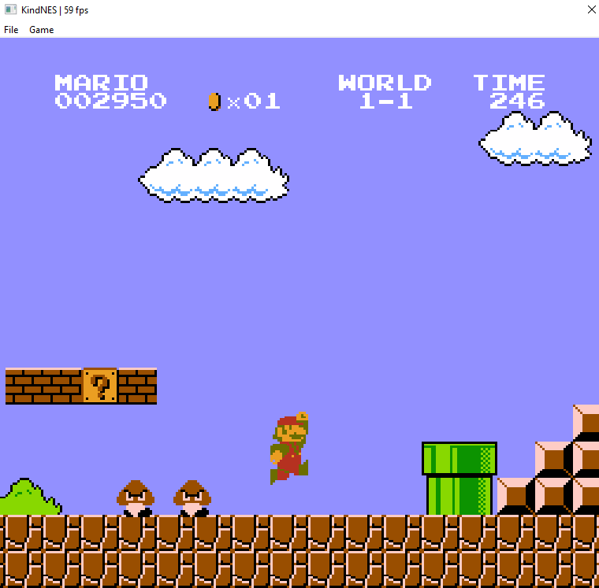

+++
title = "This Month in Rust GameDev #21 - April 2021"
date = 2021-05-04
transparent = true
draft = true
+++

Welcome to the 21st issue of the Rust GameDev Workgroup's
monthly newsletter.
[Rust] is a systems language pursuing the trifecta:
safety, concurrency, and speed.
These goals are well-aligned with game development.
We hope to build an inviting ecosystem for anyone wishing
to use Rust in their development process!
Want to get involved? [Join the Rust GameDev working group!][join]

You can follow the newsletter creation process
by watching [the coordination issues][coordination].
Want something mentioned in the next newsletter?
[Send us a pull request][pr].
Feel free to send PRs about your own projects!

[Rust]: https://rust-lang.org
[join]: https://github.com/rust-gamedev/wg#join-the-fun
[pr]: https://github.com/rust-gamedev/rust-gamedev.github.io
[coordination]: https://github.com/rust-gamedev/rust-gamedev.github.io/issues?q=label%3Acoordination

[Rust]: https://rust-lang.org
[join]: https://github.com/rust-gamedev/wg#join-the-fun

- [Game Updates](#game-updates)
- [Learning Material Updates](#learning-material-updates)
- [Engine Updates](#engine-updates)
- [Library & Tooling Updates](#library-tooling-updates)
- [Popular Workgroup Issues in Github](#popular-workgroup-issues-in-github)
- [Meeting Minutes](#meeting-minutes)
- [Requests for Contribution](#requests-for-contribution)
- [Jobs](#jobs)
- [Bonus](#bonus)

<!--
Ideal section structure is:

```
### [Title]


_Optional image caption_

A paragraph or two with a summary and [useful links].

_Discussions:
[/r/rust](https://reddit.com/r/rust/todo),
[twitter](https://twitter.com/todo/status/123456)_

[Title]: https://first.link
[useful links]: https://other.link
```

If needed, a section can be split into subsections with a "------" delimiter.
-->

## Rust GameDev Meetup


The fourth Rust Gamedev Meetup happened in April. It was an opportunity for
developers to show off what Rust projects they've been working on in the game
ecosystem. This month, we heard a talk about threading in WASM, profiling,
getting a game ready for release, and much more. You can watch the recording of
the meetup [here on Youtube][gamedev-meetup-video].

The next meetup will take place on the 8th of May at 16:00 GMT on the [Rust
Gamedev Discord server][rust-gamedev-discord], and can also be [streamed on
Twitch][rust-gamedev-twitch]. If you would like to show off what you've been
working on, fill out [this form][gamedev-meetup-form].

[gamedev-meetup-form]: https://forms.gle/BS1zCyZaiUFSUHxe6
[gamedev-meetup-video]: https://www.youtube.com/watch?v=XE0lH0tlbBs
[rust-gamedev-discord]: https://discord.gg/yNtPTb2
[rust-gamedev-twitch]: https://twitch.tv/rustgamedevmeetup

## Game Updates

### [LD48: Micronaut][micronaut-itch]

[][micronaut-itch]
_Micronaut features a deep recursive level layout_

Micronaut is a small puzzle platformer by [@Healthire] made in 48 hours for the
Ludum Dare 48 Compo. Run and jump your way through a recursive level layout to
reach the end. Cross platform for native and web, with source available on
[GitHub][micronaut-github].

_Discussions: [Twitter][micronaut-twitter], [ldjam.com][micronaut-ldjam]_

[@Healthire]: https://twitter.com/healthire
[micronaut-github]: https://github.com/Healthire/ld48
[micronaut-itch]: https://healthire.itch.io/micronaut
[micronaut-twitter]: https://twitter.com/healthire/status/1386468257125830662
[micronaut-ldjam]: https://ldjam.com/events/ludum-dare/48/micronaut

### [Fish game]


[Fish game] is an online multiplayer game,
created in a collaboration between [Nakama][nakama], an open-source scalable
game server, and the [Macroquad][macroquad] game engine.

This month:

- [Fish game tutorial] got published.
  The tutorial breaks down the game codebase into steps, from setting
  up an empty macroquad project into building a platformer game, and
  then turning it into a multiplayer game with Nakama.

- [Web build][fishgame-itch] went live on itch.io

[Fish game]: https://github.com/heroiclabs/fishgame-macroquad
[fishgame-itch]: https://fedorgames.itch.io/fish-game
[nakama]: https://heroiclabs.com/
[macroquad]: https://github.com/not-fl3/macroquad
[Fish game tutorial]: https://heroiclabs.com/blog/tutorials/rust-fishgame/

### [The Process]


_The new test map in The Process_

[The Process] by @setzer22 is an upcoming
game about factory building, process management and carrot production, built
with Rust using the Godot game engine!

Some of the main highlights of the game:

- Automate complex processes by combining machines and programmable workers.
- Obtain materials from a wide variety of natural resources: Even chicken!
- An upbeat, wholesome aesthetic: Factories don't need to be depressing.

This last month was focused on implementing the following features:

- A [test map](https://twitter.com/PlayTheProcess/status/1381648397569036291) to
  ensure all corners of the codebase are working
- Improved player mobility by introducing a
  [grappling hook](https://www.reddit.com/r/rust_gamedev/comments/mztqhy/added_a_grappling_hook_to_my_game_built_with_rust/)

The game has been in active development for over a year and is now approaching
its first initial playable alpha version. Stayed tuned to the official twitter
for updates!

_Discussions:
[/r/rust_gamedev](https://www.reddit.com/r/rust_gamedev/comments/mopoxk/showcasing_my_game_the_process_built_with_rust/),
[Twitter](https://twitter.com/PlayTheProcess)_

[The Process]: https://twitter.com/PlayTheProcess/

### [pGLOWrpg][pglowrpg-github]


[pGLOWrpg][pglowrpg-github] by [@Roal_Yr]
is a Procedurally Generated Living Open World RPG,
a long-term project in development, which aims to be a narrative text-based game
with maximum portability and accessibility.

Recent updates include:

- Finished implementing new printing interface.
- Different types of text: normal, announcement, banner, etc.
- Text color scheme in separate .ron preset file.
- Text wrap implemented.
- Fallback modes for text printing implemented.

_Discussions: [Twitter][pglowrpg-twitter]_

[@Roal_Yr]: https://twitter.com/Roal_Yr
[pglowrpg-twitter]: https://twitter.com/pglowrpg
[pglowrpg-github]: https://github.com/roalyr/pglowrpg

### [Taipo][taipo-itch]

[][taipo-itch]
_Click the image to play the game in your desktop browser!_

Taipo ([itch.io][taipo-itch], [GitHub][taipo-github]) by [@rparrett]
is a Tower Defense game that's controlled solely by typing words and phrases.

Taipo is intended to be a thin veneer of a game over a tool for practicing
Japanese, but there's an English mode as well. Gameplay sessions are short and
the game is playable in a desktop web browser.

Taipo was built with [Bevy 0.5][taipo-bevy] with web builds made possible by
[bevy_webgl2] and [bevy_kira_audio]. Taipo is also supported by these great
projects: [bevy_tiled], [bevy_asset_ron].

[taipo-itch]: https://euclidean-whale.itch.io/taipo
[taipo-github]: https://github.com/rparrett/taipo
[taipo-bevy]: https://bevyengine.org
[bevy_webgl2]: https://github.com/mrk-its/bevy_webgl2
[bevy_asset_ron]: https://github.com/jamadazi/bevy_asset_ron
[bevy_tiled]: https://github.com/stararawn/bevy_tiled
[bevy_kira_audio]: https://github.com/NiklasEi/bevy_kira_audio
[@rparrett]: https://github.com/rparrett

### [A/B Street]


[A/B Street] by [@dabreegster] is a traffic simulation game exploring how small
changes to roads affect cyclists, transit users, pedestrians, and drivers, with
support for any city with OpenStreetMap coverage.

In April, a new road editor was prototyped, letting the number and width of
lanes be changed. Initial installation and downloading new maps is now simpler.
Slowly, complex intersections are being handled better. The team also completed
four usability study sessions and adjusted the UI accordingly.

[A/B Street]: https://github.com/a-b-street/abstreet
[@dabreegster]: https://twitter.com/CarlinoDustin

### [Way of Rhea][wor]

[][wor]

[Way of Rhea][wor] is a picturesque puzzle platformer—without the platforming.
Solve mind bending color puzzles, unlock new areas of a vibrant hub world, and
talk to NPCs to unravel the mysteries of a world you left behind!

Way of Rhea is being produced by [@masonremaley][mason-remaley]. Latest Way of
Rhea developments:

- A [hierarchy tree view][wor-hierarchy] was added to the editor to make getting
  art into the game easier.
- Work is wrapping up getting [art into the first snow crab level!][wor-art]
- [@masonremaley][mason-remaley] wrote up [an article walking through how the
  Way of Rhea crash reporter works][wor-crash-reporter].
- [@masonremaley][mason-remaley] is mixing signed distance fields, bézier
  curves, and art by [Carolyn Whitmeyer][carolyn-whitmeyer] to create
  [procedural vines][wor-vines].
- [Carolyn Whitmeyer][carolyn-whitmeyer], the game's artist, released [a demo
  real including some content from Way of Rhea][wor-cw-demo-reel].

[wor]: https://store.steampowered.com/app/1110620?utm_campaign=tmirgd&utm_source=n21
[wor-art]: https://twitter.com/AnthropicSt/status/1388907046574215172
[wor-hierarchy]: https://twitter.com/AnthropicSt/status/1387947007508160517
[mason-remaley]: https://twitter.com/masonremaley
[wor-crash-reporter]: https://www.anthropicstudios.com/2021/03/05/crash-reporter/
[carolyn-whitmeyer]: https://www.instagram.com/cw_visuals_insta/
[wor-cw-demo-reel]: https://twitter.com/masonremaley/status/1387102693626421254
[wor-vines]: https://twitter.com/masonremaley/status/1389070879536173056

### [Veloren][veloren]


_A mist rolling over the land_

[Veloren][veloren] is an open world, open-source voxel RPG inspired by Dwarf
Fortress and Cube World.

In April, work started on 0.10. Work is being done on combat, with new models
being created for enemies, animations being refined, and new player gear being
added. The trading and economic systems have continued progress at a good pace.
The music system was expanded to support combat music.

Veloren's financial state was overhauled to examine previous expenses, and
prepare for provisioning the dedicated server. Functionality was added to switch
between server-authoratative and client-authoratative physics. Skeletons for
big-winged creatures were added. Data being sent over the network is being
optimized to reduce the amount of bandwidth players have to use.

April's full weekly devlogs: "This Week In Veloren...":
[#114](https://veloren.net/devblog-114),
[#115](https://veloren.net/devblog-115),
[#116](https://veloren.net/devblog-116).
[#117](https://veloren.net/devblog-117).

[veloren]: https://veloren.net

### [Outer Wonders]


[Outer Wonders] is a colorful, pixel art, puzzle-based adventure game
developed by [Utopixel] where you play as Bibi, a cute round monkey who
enjoys rolling in straight lines. Explore a whimsical nature where
altering the environment is key to progress, and solve puzzles to protect
its wonders.

In April, [Utopixel] released the first playable demo of [Outer Wonders]
for Windows and Linux on [itch.io]! In order to achieve this, the [Utopixel]
team:

- Added a cutscene and a tutorial level at the beginning of the demo campaign.
- Integrated sound effects for interaction with the environment and the UI.
- Finished implementing full support for Linux on [itch.io] through a portable
  build of the game.
- Polished the menus by adding a "_Press any key to continue_" prompt on game
  startup, as well as a confirmation prompt for all quit buttons.
- Tested the demo thoroughly on both Windows and Linux to fix all bugs
  and level design issues.

_Discussions:
[/r/rust](https://www.reddit.com/mx3enm),
[Twitter](https://twitter.com/utopixel/status/1385632054021345289)_

[Outer Wonders]: https://utopixel.itch.io/outer-wonders
[Utopixel]: https://utopixel.games
[itch.io]: https://utopixel.itch.io/outer-wonders

### [Theta Wave]

[][Theta Wave]
_Mobs may now be spawned in predefined formations_

[Theta Wave] is an open-source space shooter game by developers [@micah_tigley] and
[@carlosupina]. It is one of the showcase games for the [Amethyst Engine]. In
the past month, the ["Formations"] update was released which organized how mobs
are spawned in different phases of the level.

They are now working on the ["Loot"] update which will enhance how loot drops
are rolled, spawned, and how their effects are applied to the game.

[Theta Wave]: https://github.com/amethyst/theta-wave
[@micah_tigley]: https://twitter.com/micah_tigley
[@carlosupina]: https://twitter.com/carlosupina
[Amethyst Engine]: https://amethyst.rs/
["Formations"]: https://github.com/amethyst/theta-wave/releases/tag/v0.1.5
["Loot"]: https://github.com/amethyst/theta-wave/projects/4

## Engine Updates

### [macroquad]

[][macroquad.rs]

[macroquad] is a cross-platform (Windows/Linux/macOS/Android/iOS/WASM) game
framework built on top of [miniquad].

This month macroquad finally got out of alpha and `0.3` got released!
All the examples with both sources and interactive wasm versions may
be found on [the new macroquad website][macroquad.rs].

[miniquad]: https://github.com/not-fl3/miniquad
[macroquad]: https://github.com/not-fl3/macroquad
[macroquad.rs]: https://macroquad.rs

### [Tetra]

[Tetra] is a simple 2D game framework, inspired by XNA, Love2D, and Raylib. This
month, version 0.6.3 was released, featuring:

- BMFont support
- An `ImageData` type for loading and manipulating images on the CPU
- More color utilities, including shortcuts for premultiplied alpha
- Bugfixes and docs improvements

For more details, see the [changelog][tetra-changelog].

Additionally, [Tetra's website][tetra-website] has been updated to make it easier
to read and contribute to. The site features tutorials, guides and FAQs on how to
use Tetra effectively, as well as a showcase of cool projects made using the
framework - additions are welcomed!

[Tetra]: https://github.com/17cupsofcoffee/tetra
[tetra-changelog]: https://github.com/17cupsofcoffee/tetra/blob/main/CHANGELOG.md#063---2021-04-09
[tetra-website]: https://tetra.seventeencups.net/

### [Oxygengine v0.19.1][oxygengine-git]


_Making splash screens in Oxygengine with RAUI_

[Oxygengine][oxygengine-git] by [@PsichiX][psichix-twitter] is the hottest
HTML5 + WASM game engine for games written in Rust with web-sys.
The goal of this project is to combine professional game development tools under
one highly modular toolset.

This month's changes include:

- Fixed bugs with rendering images on Firefox browser.
- Added support for filters.
- Updated [RAUI][raui-git] dependency to improve UI.
- Added support for image smoothing render command.
- Added [puzzle game demo WIP][oxygengine-puzzle-demo] that shows how to use RAUI
  to make for example fancy splash screens with RAUI.

[psichix-twitter]: https://twitter.com/psichix
[oxygengine-git]: https://github.com/PsichiX/Oxygengine
[oxygengine-puzzle-demo]: https://github.com/PsichiX/Oxygengine/tree/master/demos/soulhunter

## Learning Material Updates

### [Rust LA Meetup: Happiness in Rust][rust-la]

[][rust-la]
_Click on the image to watch the talk_

As part of April's Rust LA meetup, [Andrea Pessino][rad-andrea] from
[Ready at Dawn][rad] gave a talk examining how to increase Rust adoption
among game developers and performance-centric developers, giving
practical, actionable advice to those who hit early bumps in their
Rust discovery.

[rust-la]: https://www.youtube.com/watch?v=TJ3w-pZ7FMI
[rad-andrea]: https://twitter.com/AndreaPessino
[rad]: http://www.readyatdawn.com/

### [How To Write a Crash Reporter][crash-reporter]


[@masonremaley][mason-remaley] wrote [an article](crash-reporter) walking
through [Way of Rhea's][wor] crash reporter implementation.

The article covers how to detect a crash, how to report a crash via chat
services like Discord or Slack, and how to implement a robust native UI on
Windows to handle requesting user consent to file the report, as well as some
design considerations.

[crash-reporter]: https://www.anthropicstudios.com/2021/03/05/crash-reporter/
[mason-remaley]: https://twitter.com/masonremaley
[wor]: https://store.steampowered.com/app/1110620?utm_campaign=tmirgd&utm_source=n21

## Library & Tooling Updates

### [wgpu]-0.8


[wgpu] is a [WebGPU] implementation in Rust. It is safe, efficient,
and portable: can target both native (Vulkan/D3D/Metal) and the Web.

The team has rolled out gfx-hal-0.8 and wgpu-0.8 updates on crates!
Read [gfx-release-blog] for more details.

In April, the team implemented more validation on both the host and the shader
sides. [Naga]'s coverage of SPIR-V and MSL features is also greately improved.

On the infrastructure side, [wgpu] integrated [profiling] and got the first
[naga performance][naga perf numbers] numbers, which looked promising.

[wgpu]: https://github.com/gfx-rs/wgpu
[webgpu]: https://gpuweb.github.io/gpuweb/
[naga]: https://github.com/gfx-rs/naga
[profiling]: https://github.com/aclysma/profiling
[gfx-release-blog]: https://gfx-rs.github.io/2021/04/30/release-0.8.html
[naga perf numbers]: https://github.com/gfx-rs/wgpu-rs/discussions/879

### [KindNES]



[KindNES] by [@henryksloan]
is a new NES emulator that supports sound, controllers, and
much of the NES library.

KindNES is designed to strike a balance between performance, hardware accuracy,
and code clarity. It directly emulates the CPU, graphics, and sound of the NES
with minimal approximation. The code is intended to pair well with the NESdev
wiki as a resource for learning about the NES.

KindNES is in a playable state, and is approaching a release version.
Features planned before release include saving and an improved cross-platform
GUI.

[KindNES]: https://github.com/henryksloan/kind-nes/releases/tag/v0.9.1-beta
[@henryksloan]: https://github.com/henryksloan

### [rafx]

[][rafx-webgl-demo]
_Rafx WebGL 1.0 support, [click for live demo][rafx-webgl-demo]!_

Rafx is a multi-backend renderer that optionally integrates with the
[distill][rafx-distill] asset pipeline. This month, frustum culling
and a new OpenGL ES 2.0/WebGL 1.0 backend were added.

[@dvd] revived the `rafx-visibility` crate and implemented frustum culling.
Frustum culling greatly reduces draw call counts, improving frame rate
in certain scenes. The changes also improve consistency between various
rendering feature implementations (i.e. meshes, text etc.) and avoids running
the extract-prepare-submit pipeline on entities that are not visible.

[@aclysma] implemented an OpenGL ES 2.0 backend. While ES2 cannot support all
funcionality in `rafx-api`, it provides very broad compatibility. This means
the core functionality of rafx-api can be used with almost any mobile device
or browser ([~98% web coverage][rafx-webgl-caniuse].)

[rafx]: https://github.com/aclysma/rafx
[rafx-webgl-demo]: https://aclysma.github.io/rafx/demo-web/index.html
[rafx-distill]: https://github.com/amethyst/distill
[rafx-webgl-caniuse]: https://caniuse.com/?search=webgl
[@aclysma]: https://github.com/aclysma
[@dvd]: https://github.com/DavidVonDerau

### [RAUI v0.34.0][raui-git]


_RAUI Scroll Box_

[RAUI][raui-git] by [@PsichiX][psichix-twitter] is a Renderer Agnostic User
Interface crate that is based on declarative mode UI composition similar to
React.js and UE4 Slate system.

This month's changes include:

- Moved from `widget_hooks!` and `widget_component!` to `#[pre_hooks]`and
  `#[post_hooks]` macros.
- Added `PropsData` and `MessageData` derive macros.
- Improved support for Scroll Box widgets to allow frictionless usage.
- Added use of Scroll Box in [TODO demo app][raui-todo-app] to demonstrate how
  to use it.

[raui-git]: https://github.com/PsichiX/raui
[raui-todo-app]: https://github.com/PsichiX/raui/tree/master/demos/todo-app

### [profiling]

[](profiling.png)

This month, version 1.0 of [profiling] was released on crates.io. 🎉 🎉

This crate provides a very thin abstraction over instrumented profiling crates
like `puffin`, `optick`, `tracing`, `tracy`, and `superluminal-perf`.

Profiling is used by multiple projects including `gfx-hal`, `rafx`, and
`wgpu`.

[profiling]: https://crates.io/crates/profiling

### [simple-async-local-executor]

```rust
let executor = Executor::default();
let events = [executor.create_event_handle(), executor.create_event_handle()];

async fn wait_event(events: [EventHandle; 2], executor: Executor) {
    executor.event(&events[0]).await;
    executor.event(&events[1]).await;
}

executor.spawn(wait_event(events.clone(), executor.clone()));
assert_eq!(executor.step(), true);
assert_eq!(executor.step(), true);
executor.notify_event(&events[0]);
assert_eq!(executor.step(), true);
executor.notify_event(&events[1]);
assert_eq!(executor.step(), false);
```

[simple-async-local-executor] by [Enlightware]
is a single-threaded polling-based executor suitable for use in games, embedded
systems or WASM.

This executor can be useful when the number of tasks is small or
if a small percentage is blocked. Being polling-based, in the general
case it trades off efficiency for simplicity and does not require any
concurrency primitives such as `Arc`, etc.

[simple-async-local-executor]: https://github.com/enlightware/simple-async-local-executor
[Enlightware]: https://enlightware.ch

### [egui]

[egui] by [@emilk] is an easy-to-use immediate mode GUI library in pure Rust.

This month [version 0.11] of egui was released, with many improvements,
including optimized to run almost twice as fast!

You can try out egui in the [online demo].

[egui]: https://github.com/emilk/egui
[online demo]: https://emilk.github.io/egui
[version 0.11]: https://github.com/emilk/egui/blob/master/CHANGELOG.md
[@emilk]: https://twitter.com/ernerfeldt

### [bevy_egui]

[][bevy_egui]

[bevy_egui] provides an [Egui](https://github.com/emilk/egui) integration
for the [Bevy](https://github.com/bevyengine/bevy) game engine.
It supports [bevy_webgl2] and implements the full set of Egui features
(such as clipboard and opening URLs).

In April, [version 0.4] was released, providing an integration with
Egui 0.11 and implementing multiple windows support.

Try out the [online demo](https://mvlabat.github.io/bevy_egui_web_showcase/index.html).

[bevy_egui]: https://github.com/mvlabat/bevy_egui
[bevy_webgl2]: https://github.com/mrk-its/bevy_webgl2
[version 0.4]: https://github.com/mvlabat/bevy_egui/blob/main/CHANGELOG.md

### [puffin_egui]


[puffin_egui] by [@emilk] is an easy-to-use integration
of the [puffin] profiler for the [egui] GUI library.

It has never been easier to add an in-game flamegraph profiler to your game!

[puffin_egui]: https://github.com/emilk/puffin_egui
[puffin]: https://github.com/emilk/puffin
[egui]: https://github.com/emilk/egui
[@emilk]: https://twitter.com/ernerfeldt

### [chip-8-rs]


_Debugging Pong_

[Chip-8-rs][chip-8-rs] by @jonathanmurray is
a _CHIP-8_ emulator with some basic debugging functionality.

When running a game through the emulator, CHIP-8 instructions are listed
next to the main display, with the currently executed one highlighted. By
running at a very low clock-frequency (and pausing/resuming) you can step
through a program one instruction at a time, to better understand how it
works (or doesn't work!).

See it in action on [YouTube][chip-8-rs-video].

[chip-8-rs]: https://github.com/JonathanMurray/chip-8-rs
[chip-8-rs-video]: https://youtu.be/nVDJ5PZpPfI?t=72

### [wasm_plugin]

[wasm_plugin][wasm_plugin] by @alec-deason is a
low-ish level tool for easily hosting WASM based plugins for modding or scripting.

The latest version now supports calling host functions from the plugin and more
flexible serialization which allows plugins to be written in languages other
than Rust.

It consists of two crates:

- [wasm_plugin_host] which wraps a wasmer instance with methods for calling
  functions on the guest plugin.
- [wasm_plugin_guest] which provides an attribute macro to easily import and
- export functions to the host.

[wasm_plugin]: https://github.com/alec-deason/wasm_plugin
[wasm_plugin_host]: https://lib.rs/crates/wasm_plugin_host
[wasm_plugin_guest]: https://lib.rs/crates/wasm_plugin_guest

## Popular Workgroup Issues in Github

<!-- Up to 10 links to interesting issues -->

## Meeting Minutes

<!-- Up to 10 most important notes + a link to the full details -->

[See all meeting issues][label_meeting] including full text notes
or [join the next meeting][join].

[label_meeting]: https://github.com/rust-gamedev/wg/issues?q=label%3Ameeting

## Requests for Contribution

<!-- Links to "good first issue"-labels or direct links to specific tasks -->

## Jobs

<!-- An optional section for new jobs related to Rust gamedev -->

## Bonus

<!-- Bonus section to make the newsletter more interesting
and highlight events from the past. -->

------

That's all news for today, thanks for reading!

Want something mentioned in the next newsletter?
[Send us a pull request][pr].

Also, subscribe to [@rust_gamedev on Twitter][@rust_gamedev]
or [/r/rust_gamedev subreddit][/r/rust_gamedev] if you want to receive fresh news!

<!--
TODO: Add real links and un-comment once this post is published
**Discuss this post on**:
[/r/rust](TODO),
[Twitter](TODO),
[Discord](https://discord.gg/yNtPTb2).
-->

[/r/rust_gamedev]: https://reddit.com/r/rust_gamedev
[@rust_gamedev]: https://twitter.com/rust_gamedev
[pr]: https://github.com/rust-gamedev/rust-gamedev.github.io
