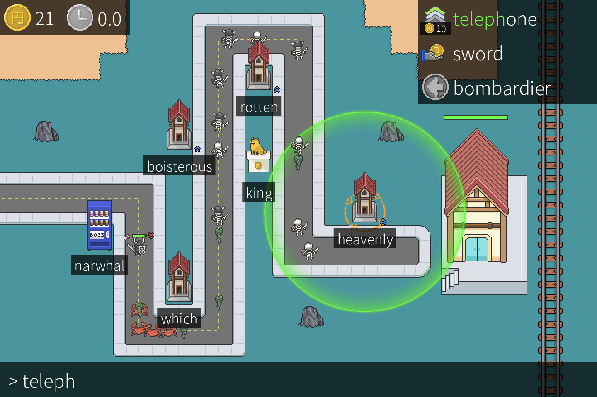

+++
title = "This Month in Rust GameDev #21 - April 2021"
date = 2021-05-04
transparent = true
draft = true
+++

Welcome to the 21st issue of the Rust GameDev Workgroup's
monthly newsletter.
[Rust] is a systems language pursuing the trifecta:
safety, concurrency, and speed.
These goals are well-aligned with game development.
We hope to build an inviting ecosystem for anyone wishing
to use Rust in their development process!
Want to get involved? [Join the Rust GameDev working group!][join]

You can follow the newsletter creation process
by watching [the coordination issues][coordination].
Want something mentioned in the next newsletter?
[Send us a pull request][pr].
Feel free to send PRs about your own projects!

[Rust]: https://rust-lang.org
[join]: https://github.com/rust-gamedev/wg#join-the-fun
[pr]: https://github.com/rust-gamedev/rust-gamedev.github.io
[coordination]: https://github.com/rust-gamedev/rust-gamedev.github.io/issues?q=label%3Acoordination

[Rust]: https://rust-lang.org
[join]: https://github.com/rust-gamedev/wg#join-the-fun

- [Game Updates](#game-updates)
- [Learning Material Updates](#learning-material-updates)
- [Engine Updates](#engine-updates)
- [Library & Tooling Updates](#library-tooling-updates)
- [Popular Workgroup Issues in Github](#popular-workgroup-issues-in-github)
- [Meeting Minutes](#meeting-minutes)
- [Requests for Contribution](#requests-for-contribution)
- [Jobs](#jobs)
- [Bonus](#bonus)

<!--
Ideal section structure is:

```
### [Title]


_Optional image caption_

A paragraph or two with a summary and [useful links].

_Discussions:
[/r/rust](https://reddit.com/r/rust/todo),
[twitter](https://twitter.com/todo/status/123456)_

[Title]: https://first.link
[useful links]: https://other.link
```

If needed, a section can be split into subsections with a "------" delimiter.
-->

## Game Updates

### [The Process]


_The new test map in The Process_

[The Process] by @setzer22 is an upcoming
game about factory building, process management and carrot production, built
with Rust using the Godot game engine!

Some of the main highlights of the game:

- Automate complex processes by combining machines and programmable workers.
- Obtain materials from a wide variety of natural resources: Even chicken!
- An upbeat, wholesome aesthetic: Factories don't need to be depressing.

This last month was focused on implementing the following features:

- A [test map](https://twitter.com/PlayTheProcess/status/1381648397569036291) to
  ensure all corners of the codebase are working
- Improved player mobility by introducing a
  [grappling hook](https://www.reddit.com/r/rust_gamedev/comments/mztqhy/added_a_grappling_hook_to_my_game_built_with_rust/)

The game has been in active development for over a year and is now approaching
its first initial playable alpha version. Stayed tuned to the official twitter
for updates!

_Discussions:
[/r/rust_gamedev](https://www.reddit.com/r/rust_gamedev/comments/mopoxk/showcasing_my_game_the_process_built_with_rust/),
[Twitter](https://twitter.com/PlayTheProcess)_

[The Process]: https://twitter.com/PlayTheProcess/

### [pGLOWrpg][pglowrpg-github]


[pGLOWrpg][pglowrpg-github] by [@Roal_Yr]
is a Procedurally Generated Living Open World RPG,
a long-term project in development, which aims to be a narrative text-based game
with maximum portability and accessibility.

Recent updates include:

- Finished implementing new printing interface.
- Different types of text: normal, announcement, banner, etc.
- Text color scheme in separate .ron preset file.
- Text wrap implemented.
- Fallback modes for text printing implemented.

_Discussions: [Twitter][pglowrpg-twitter]_

[@Roal_Yr]: https://twitter.com/Roal_Yr
[pglowrpg-twitter]: https://twitter.com/pglowrpg
[pglowrpg-github]: https://github.com/roalyr/pglowrpg

### [Taipo][taipo-itch]

[][taipo-itch]
_Click the image to play the game in your desktop browser!_

Taipo ([itch.io][taipo-itch], [GitHub][taipo-github]) by [@rparrett]
is a Tower Defense game that's controlled solely by typing words and phrases.

Taipo is intended to be a thin veneer of a game over a tool for practicing
Japanese, but there's an English mode as well. Gameplay sessions are short and
the game is playable in a desktop web browser.

Taipo was built with [Bevy 0.5][taipo-bevy] with web builds made possible by
[bevy_webgl2] and [bevy_kira_audio]. Taipo is also supported by these great
projects: [bevy_tiled], [bevy_asset_ron].

[taipo-itch]: https://euclidean-whale.itch.io/taipo
[taipo-github]: https://github.com/rparrett/taipo
[taipo-bevy]: https://bevyengine.org
[bevy_webgl2]: https://github.com/mrk-its/bevy_webgl2
[bevy_asset_ron]: https://github.com/jamadazi/bevy_asset_ron
[bevy_tiled]: https://github.com/stararawn/bevy_tiled
[bevy_kira_audio]: https://github.com/NiklasEi/bevy_kira_audio
[@rparrett]: https://github.com/rparrett

### [Way of Rhea][wor]

[][wor]

[Way of Rhea][wor] is a picturesque puzzle platformer—without the platforming.
Solve mind bending color puzzles, unlock new areas of a vibrant hub world, and
talk to NPCs to unravel the mysteries of a world you left behind!

Way of Rhea is being produced by [@masonremaley][mason-remaley]. Latest Way of
Rhea developments:

- A [hierarchy tree view][wor-hierarchy] was added to the editor to make getting art into the game easier
- Work is wrapping up getting [art into the first snow crab level!][wor-art]
- [@masonremaley][mason-remaley] wrote up [an article walking through how the Way of Rhea crash reporter works][wor-crash-reporter]
- [Carolyn Whitmeyer][carolyn-whitmeyer], the game's artist, released [a demo real including some content from Way of Rhea](https://twitter.com/masonremaley/status/1387102693626421254)

[wor]: https://store.steampowered.com/app/1110620?utm_campaign=tmirgd&utm_source=n21
[wor-art]: https://twitter.com/AnthropicSt/status/1388907046574215172
[wor-hierarchy]: https://twitter.com/AnthropicSt/status/1387947007508160517
[mason-remaley]: https://twitter.com/masonremaley
[wor-crash-reporter]: https://www.anthropicstudios.com/2021/03/05/crash-reporter/
[carolyn-whitmeyer]: https://www.instagram.com/cw_visuals_insta/
[wor-cw-demo-reel]: https://twitter.com/masonremaley/status/1387102693626421254
[wor-discord]: https://discord.gg/JGeVt5XwPP

## Engine Updates

## Learning Material Updates

### [How To Write a Crash Reporter][crash-reporter]


[@masonremaley][mason-remaley] wrote an article walking through [Way of Rhea's][wor] crash reporter implementation.

The article covers how to detect a crash, how to report a crash via chat services like Discord or Slack, and how to implement a robust native UI on Windows to handle requesting user consent to file the report, as well as some design considerations.

[crash-reporter]: https://www.anthropicstudios.com/2021/03/05/crash-reporter/
[mason-remaley]: https://twitter.com/masonremaley
[wor]: https://store.steampowered.com/app/1110620?utm_campaign=tmirgd&utm_source=n21

## Library & Tooling Updates

## Popular Workgroup Issues in Github

<!-- Up to 10 links to interesting issues -->

## Meeting Minutes

<!-- Up to 10 most important notes + a link to the full details -->

[See all meeting issues][label_meeting] including full text notes
or [join the next meeting][join].

[label_meeting]: https://github.com/rust-gamedev/wg/issues?q=label%3Ameeting

## Requests for Contribution

<!-- Links to "good first issue"-labels or direct links to specific tasks -->

## Jobs

<!-- An optional section for new jobs related to Rust gamedev -->

## Bonus

<!-- Bonus section to make the newsletter more interesting
and highlight events from the past. -->

------

That's all news for today, thanks for reading!

Want something mentioned in the next newsletter?
[Send us a pull request][pr].

Also, subscribe to [@rust_gamedev on Twitter][@rust_gamedev]
or [/r/rust_gamedev subreddit][/r/rust_gamedev] if you want to receive fresh news!

<!--
TODO: Add real links and un-comment once this post is published
**Discuss this post on**:
[/r/rust](TODO),
[Twitter](TODO),
[Discord](https://discord.gg/yNtPTb2).
-->

[/r/rust_gamedev]: https://reddit.com/r/rust_gamedev
[@rust_gamedev]: https://twitter.com/rust_gamedev
[pr]: https://github.com/rust-gamedev/rust-gamedev.github.io
