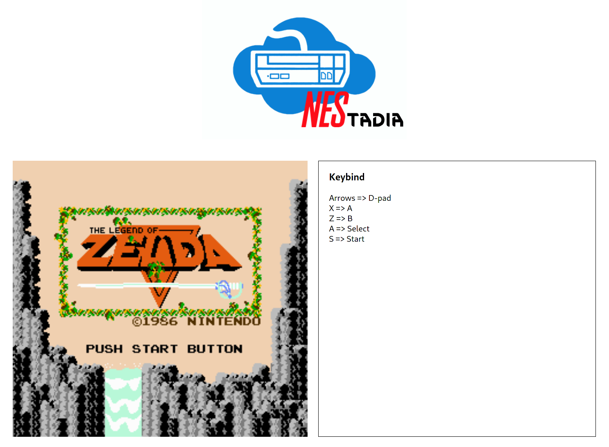

+++
title = "This Month in Rust GameDev #22 - May 2021"
date = 2021-06-01
transparent = true
draft = true
+++

Welcome to the 22nd issue of the Rust GameDev Workgroup's
monthly newsletter.
[Rust] is a systems language pursuing the trifecta:
safety, concurrency, and speed.
These goals are well-aligned with game development.
We hope to build an inviting ecosystem for anyone wishing
to use Rust in their development process!
Want to get involved? [Join the Rust GameDev working group!][join]

You can follow the newsletter creation process
by watching [the coordination issues][coordination].
Want something mentioned in the next newsletter?
[Send us a pull request][pr].
Feel free to send PRs about your own projects!

[Rust]: https://rust-lang.org
[join]: https://github.com/rust-gamedev/wg#join-the-fun
[pr]: https://github.com/rust-gamedev/rust-gamedev.github.io
[coordination]: https://github.com/rust-gamedev/rust-gamedev.github.io/issues?q=label%3Acoordination

[Rust]: https://rust-lang.org
[join]: https://github.com/rust-gamedev/wg#join-the-fun

- [Game Updates](#game-updates)
- [Learning Material Updates](#learning-material-updates)
- [Engine Updates](#engine-updates)
- [Library & Tooling Updates](#library-tooling-updates)
- [Popular Workgroup Issues in Github](#popular-workgroup-issues-in-github)
- [Meeting Minutes](#meeting-minutes)
- [Requests for Contribution](#requests-for-contribution)
- [Jobs](#jobs)
- [Bonus](#bonus)

<!--
Ideal section structure is:
```
### [Title]

_Optional image caption_
A paragraph or two with a summary and [useful links].
_Discussions:
[/r/rust](https://reddit.com/r/rust/todo),
[twitter](https://twitter.com/todo/status/123456)_
[Title]: https://first.link
[useful links]: https://other.link
```
If needed, a section can be split into subsections with a "------" delimiter.
-->

## Game Updates

### [Veloren][veloren]

 _The beginning of an exciting journey_

[Veloren][veloren] is an open world, open-source voxel RPG inspired by Dwarf
Fortress and Cube World.

Veloren's 3rd birthday was at the end of May, on the 25th! During the month,
lots of systems were overhauled. Music changes were made to only play certain
tracks in certain areas. Econsim was optimized, and many bugs were fixed. The
minimap was overhauled, with many quality-of-life and visual improvements.
Terrain compression speed was worked on, with many trials of different
compression techniques.

The large physics overhaul was merged, and lots of patches are being added to
issues that popped up from it. You can see a small flight in action
[here][veloren-glider]. Dungeons have been balanced, and many weapons have also
seen changes. In June, 0.10 will be released.

May's full weekly devlogs: "This Week In Veloren...":
[#118](https://veloren.net/devblog-118),
[#119](https://veloren.net/devblog-119),
[#120](https://veloren.net/devblog-120),
[#121](https://veloren.net/devblog-121),
[#122](https://veloren.net/devblog-122).

[veloren]: https://veloren.net
[veloren-glider]: https://www.reddit.com/r/Veloren/comments/nc4tvo/i_cant_believe_how_beautiful_this_game_is/

## Engine Updates

## Learning Material Updates

## Library & Tooling Updates

### [naga]


Naga is a shader translation library in pure Rust, aiming to replace
glsl-to-spirv and SPIRV-Cross.

In April the gfx-rs team shared a glimpse of the performance difference with
SPIRV-Cross on a single pipeline creation. In May, they did a full-fledged
Dota2 run on [gfx-portability] without SPIRV-Cross. All shader translation was
done by [naga], roughly 4x as fast as the C++ alternative
(with no pipeline caching involved). Read more on [gfx-naga-blog].

[naga]: https://github.com/gfx-rs/naga
[gfx-portability]: https://github.com/gfx-rs/portability
[gfx-naga-blog]: https://gfx-rs.github.io/2021/05/09/dota2-msl-compilation.html

### [Nestadia][nestadia]



[Nestadia][nestadia] by [@zer0x64], [@junior-n30] and [@CBenoit]
is a server-based NES emulator.  

Nestadia was written as a reverse engineering and memory exploitation challenge
for NorthSec CTF 2021, a cybersecurity competition. Contestants were required
to reverse-engineer the emulator and ultimately write a Tool Assisted Speedrun to run 
arbitrary code inside a provided ROM.  

After the competition, the code was open-sourced and 
cleaned up to remove references to the competition.
The developers intend on fixing more bugsand adding more features in the near future.  

Some interesting features of this emulator are its server-based nature,
and the no_std core which means that the emulator can be built and 
ran pretty much anywhere without much work.

Incoming improvements include online multiplayer,
sound, a WASM port, porting to a libretro core,
and using wgpu instead of sdl for the native GUI and debugger.

[nestadia]: https://github.com/zer0x64/nestadia

## Popular Workgroup Issues in Github

<!-- Up to 10 links to interesting issues -->

## Meeting Minutes

<!-- Up to 10 most important notes + a link to the full details -->

[See all meeting issues][label_meeting] including full text notes
or [join the next meeting][join].

[label_meeting]: https://github.com/rust-gamedev/wg/issues?q=label%3Ameeting

## Requests for Contribution

<!-- Links to "good first issue"-labels or direct links to specific tasks -->

## Jobs

<!-- An optional section for new jobs related to Rust gamedev -->

## Bonus

<!-- Bonus section to make the newsletter more interesting
and highlight events from the past. -->

------

That's all news for today, thanks for reading!

Want something mentioned in the next newsletter?
[Send us a pull request][pr].

Also, subscribe to [@rust_gamedev on Twitter][@rust_gamedev]
or [/r/rust_gamedev subreddit][/r/rust_gamedev] if you want to receive fresh news!

<!--
TODO: Add real links and un-comment once this post is published
**Discuss this post on**:
[/r/rust](TODO),
[Twitter](TODO),
[Discord](https://discord.gg/yNtPTb2).
-->

[/r/rust_gamedev]: https://reddit.com/r/rust_gamedev
[@rust_gamedev]: https://twitter.com/rust_gamedev
[pr]: https://github.com/rust-gamedev/rust-gamedev.github.io
