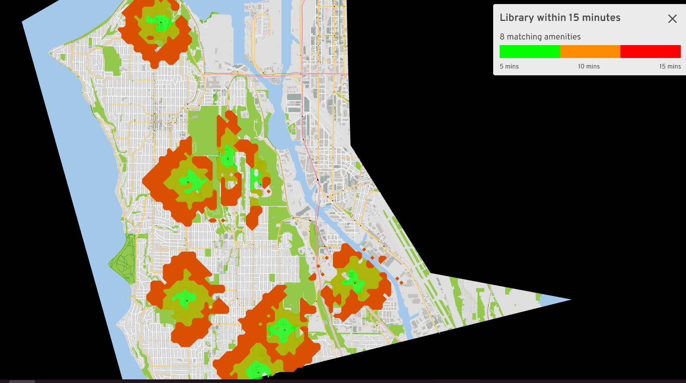
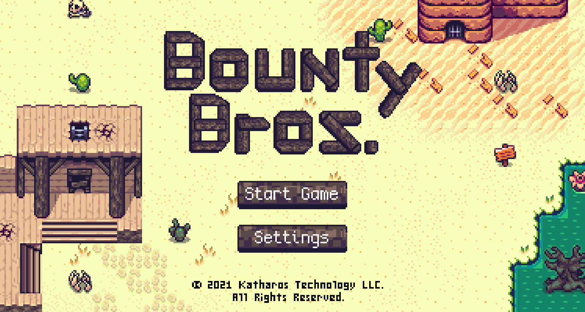
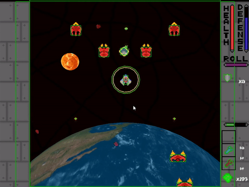
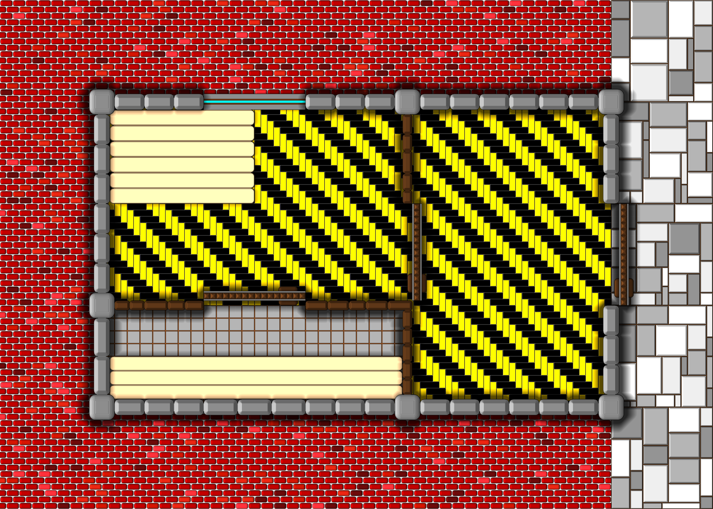
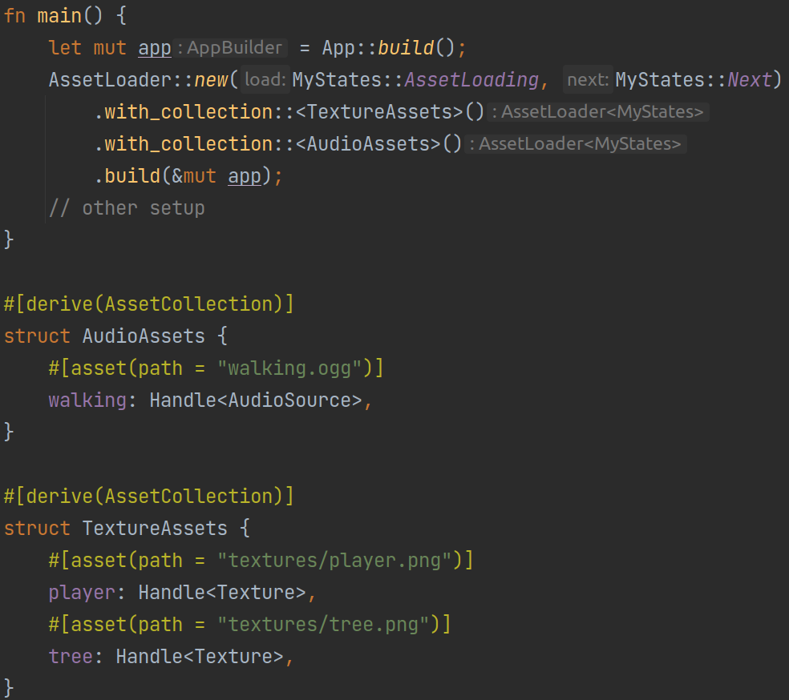

+++
title = "This Month in Rust GameDev #22 - May 2021"
date = 2021-06-09
transparent = true
+++

Welcome to the 22nd issue of the Rust GameDev Workgroup's
monthly newsletter.
[Rust] is a systems language pursuing the trifecta:
safety, concurrency, and speed.
These goals are well-aligned with game development.
We hope to build an inviting ecosystem for anyone wishing
to use Rust in their development process!
Want to get involved? [Join the Rust GameDev working group!][join]

You can follow the newsletter creation process
by watching [the coordination issues][coordination].
Want something mentioned in the next newsletter?
[Send us a pull request][pr].
Feel free to send PRs about your own projects!

[Rust]: https://rust-lang.org
[join]: https://github.com/rust-gamedev/wg#join-the-fun
[pr]: https://github.com/rust-gamedev/rust-gamedev.github.io
[coordination]: https://github.com/rust-gamedev/rust-gamedev.github.io/issues?q=label%3Acoordination

[Rust]: https://rust-lang.org
[join]: https://github.com/rust-gamedev/wg#join-the-fun

- [Game Updates](#game-updates)
- [Learning Material Updates](#learning-material-updates)
- [Engine Updates](#engine-updates)
- [Tooling Updates](#tooling-updates)
- [Library Updates](#library-updates)
- [Popular Workgroup Issues in Github](#popular-workgroup-issues-in-github)
- [Meeting Minutes](#meeting-minutes)
- [Requests for Contribution](#requests-for-contribution)
- [Jobs](#jobs)
- [Bonus](#bonus)

<!--
Ideal section structure is:
```
### [Title]

_Optional image caption_
A paragraph or two with a summary and [useful links].
_Discussions:
[/r/rust](https://reddit.com/r/rust/todo),
[twitter](https://twitter.com/todo/status/123456)_
[Title]: https://first.link
[useful links]: https://other.link
```
If needed, a section can be split into subsections with a "------" delimiter.
-->

## Rust GameDev Meetup


The fifth Rust Gamedev Meetup happened in May. You can watch the recording of
the meetup [here on Youtube][gamedev-meetup-video]. The meetups take place on
the second Saturday every month via the [Rust Gamedev Discord
server][rust-gamedev-discord], and can also be [streamed on
Twitch][rust-gamedev-twitch]. If you would like to show off what you've been
working on in a future meetup, fill out [this form][gamedev-meetup-form].

[gamedev-meetup-form]: https://forms.gle/BS1zCyZaiUFSUHxe6
[gamedev-meetup-video]: https://www.youtube.com/watch?v=6drrul3p_hU
[rust-gamedev-discord]: https://discord.gg/yNtPTb2
[rust-gamedev-twitch]: https://twitch.tv/rustgamedevmeetup

## Game Updates

### Flesh


_a new enemy_

Flesh by [@im_oab] is a 2D-horizontal shmup game with hand-drawn animation and
organic/fleshy theme. It is implemented using [Tetra]. This month's updates
include:

- Add (internal use) level editor.
- Add new enemy types.
- Prepare to release a short demo next month for collecting feedback.

[@im_oab]: https://twitter.com/im_oab
[Tetra]: https://github.com/17cupsofcoffee/tetra

### [Veloren][veloren]

 _The beginning of an exciting journey_

[Veloren][veloren] is an open world, open-source voxel RPG inspired by Dwarf
Fortress and Cube World.

Veloren's 3rd birthday was at the end of May, on the 25th! During the month,
lots of systems were overhauled. Music changes were made to only play certain
tracks in certain areas. Econsim was optimized, and many bugs were fixed. The
minimap was overhauled, with many quality-of-life and visual improvements.
Terrain compression speed was worked on, with many trials of different
compression techniques.

The large physics overhaul was merged, and lots of patches are being added to
issues that popped up from it. You can see a small flight in action
[here][veloren-glider]. Dungeons have been balanced, and many weapons have also
seen changes. In June, 0.10 will be released.

May's full weekly devlogs: "This Week In Veloren...":
[#118](https://veloren.net/devblog-118),
[#119](https://veloren.net/devblog-119),
[#120](https://veloren.net/devblog-120),
[#121](https://veloren.net/devblog-121),
[#122](https://veloren.net/devblog-122).

[veloren]: https://veloren.net
[veloren-glider]: https://www.reddit.com/r/Veloren/comments/nc4tvo/i_cant_believe_how_beautiful_this_game_is/

### [A/B Street]



[A/B Street] by [@dabreegster] is a traffic simulation game exploring how small
changes to roads affect cyclists, transit users, pedestrians, and drivers, with
support for any city with OpenStreetMap coverage. The project aims to engage
more citizens with transportation planning, letting people advocate for real
changes they want to see.

In May, travel time stopped being the only "score" for how well road changes
work. Risk exposure of cyclists crossing dangerous intersections or travelling
in front of high-speed traffic is now measured, with lots of data visualization
work by Michael. Trevor also revived the 15-minute isochrone tool, finding
areas of a city without easy access to education, hospitals, or other
facilities. We also moved the map import process, with over 100 supported maps,
to the cloud from a single poor laptop. OpenStreetMap importing now handles
multiple turn lanes, U-turns, and stop signs much better.

[A/B Street]: https://github.com/a-b-street/abstreet
[@dabreegster]: https://twitter.com/CarlinoDustin

### [The Process]


_This factory has never looked livelier!_

[The Process] by @setzer22 is an upcoming game about factory building, process
management and carrot production, built with Rust using the Godot game engine!

This month has been focused on improving the game's UI and extending the machine
logistics system, but there was also room for a few cosmetic improvements:

- Improved visualization of connections in the [logistic
  network](https://twitter.com/PlayTheProcess/status/1391484080798281728).
- Implemented configurable filters for machines to build a [sorting
  machine](https://twitter.com/PlayTheProcess/status/1392894719311613953)!
- New materials and [terrain
  shader](https://twitter.com/PlayTheProcess/status/1396175924652019718).
- [Trees and dynamically updating
  grass](https://twitter.com/PlayTheProcess/status/1399774534417498121) using
  instanced rendering.

_Discussions:
[/r/rust_gamedev](https://www.reddit.com/r/rust_gamedev/comments/nbmfvz/better_logistics_in_the_process_made_with_godot/),
[Twitter](https://twitter.com/PlayTheProcess/status/1391484080798281728)_

[The Process]: https://twitter.com/PlayTheProcess/

### [pGLOWrpg][pglowrpg-github]


[pGLOWrpg][pglowrpg-github] by [@Roal_Yr]
is a Procedurally Generated Living Open World RPG,
a long-term project in development, which aims to be a narrative text-based game
with maximum portability and accessibility.

Recent updates include:

- Implemented dev features test arena.
- Implemented entity system draft.
- Sanitized coordinate systems everywhere (ooof!)
- Much refactoring.
- Resumed river generation development.

_Discussions: [Twitter][pglowrpg-twitter]_

[@Roal_Yr]: https://twitter.com/Roal_Yr
[pglowrpg-twitter]: https://twitter.com/pglowrpg
[pglowrpg-github]: https://github.com/roalyr/pglowrpg

### Project YAWC


Project YAWC ([Twitter](https://twitter.com/ProjectYawc)) is a turn-based
strategy game built in GGEZ, being developed by junkmail.

May saw the release of Alpha 5.4, including interface improvements,
balance changes, new units, new maps and netcode improvements.

An [alpha access request form](https://forms.gle/w22ohPGNk58fo9bv6) is available,
if you want to try it out.

### [Bounty Bros.][bounty_bros]

[][bounty_bros_webgame]
_Click the image to play the game in your browser!_

[Bounty Bros.][bounty_bros] is a prototype game, similar to the old Legend of
Zelda® games, developed by [Katharos Technology][katharostech] as a testing
ground for a future commercial game.

The last two months of development was primarily focused on sound and user
interface:

- Music will play in different areas of the map and fade in when walking into
  an area with different music.
- In-game UI is now functional including a new start menu and a simple settings
  menu to toggle the CRT filter and pixel aspect ratio.
- The web-player now has a simple loading icon instead of a solid black screen.

The web version was re-built and published under a new link so you can [try it
in your browser][bounty_bros_webgame].

You can read the full update in the [Blog Post][bounty_bros].

[bounty_bros]: https://katharostech.com/post/bounty-bros-update-3-sound-and-ui
[bounty_bros_webgame]: https://katharostech.github.io/skipngo_pre-releases/refs/tags/pre-release-1/?asset_url=https://katharostech.github.io/bounty-bros_pre-releases/1
[katharostech]: https://katharostech.com

### Harvest Hero & Harvest Hero Origins


Harvest Hero is currently on hold for now. After
[Gemdrop Games] was formed, it was decided
that [Emerald] needed to be tested to ensure it can withstand cross
publishing.
This means creating a smaller game in the
engine in order to figure out the publishing process for
Steam, Itch, Nintendo Switch, etc. and guarantee it's viable.

This resulted in the birth of [Harvest Hero Origins], a small wave
defense arcade game with local co-op! Join the [Gemdrop Games Discord]
to stay up to date with these games.

Features:

- Story Mode
- Survival Mode (with local co-op)
  - Unlockable skins
  - 2 unlockable playable characters

[Emerald]: https://github.com/Bombfuse/emerald
[Harvest Hero Origins]: https://gemdrop-games.itch.io/harvest-hero-origins
[Gemdrop Games]: https://twitter.com/GemdropGames
[Gemdrop Games Discord]: https://discord.gg/CJRbxQn3d9

### [Outer Wonders]


[Outer Wonders] is a colorful, pixel art, puzzle-based adventure game
developed by [Utopixel] where you play as Bibi, a cute round monkey who
enjoys rolling in straight lines. Explore a whimsical nature where
altering the environment is key to progress, and solve puzzles to protect
its wonders.

Outer Wonders can be downloaded for Linux and Windows from [itch.io][ow-itchio].

May was mostly dedicated to code cleaning, small improvements, as well as
blogging and community building. Updates of the month include:

- Refactored UI code to streamline menu stacking and ease the implementation
  of an upcoming options menu.
- Added support for menu navigation using the D-Pad alongside the existing
  analog stick support.
- Published a blog post about building Outer Wonders for Linux/itch.io
  ([english][ow-bp-english], [french][ow-bp-french]).
- Posted weekly puzzles [#16][ow-p16], [#17][ow-p17], [#18][ow-p18] and
  [#19][ow-p19] on social media for players wishing to give puzzles a
  try prior to downloading the game.

_Discussions:
[/r/rust_gamedev](https://www.reddit.com/nfgxjl),
[Hacker News](https://news.ycombinator.com/item?id=27244017)_

[Outer Wonders]: https://utopixel.itch.io/outer-wonders
[Utopixel]: https://utopixel.games
[ow-itchio]: https://utopixel.itch.io/outer-wonders
[ow-bp-english]: https://utopixel.games/en/blog/building-outer-wonders-for-linux/
[ow-bp-french]: https://utopixel.games/fr/blog/adaptation-outer-wonders-linux/
[ow-p16]: https://twitter.com/utopixel/status/1389984537170620422
[ow-p17]: https://twitter.com/utopixel/status/1392526232596541449
[ow-p18]: https://twitter.com/utopixel/status/1395079712020602884
[ow-p19]: https://twitter.com/utopixel/status/1397614237187551237

### [rpg-cli]


[rpg-cli] by [@facundoolano] is a bare-bones JRPG-inspired terminal game.
It can work as an alternative to cd where you randomly encounter enemies
as you change directories.
The game features:

- Character stats and leveling system.
- Automatic turn-based combat.
- Item and equipment support.
- 15+ enemy classes.
- Permadeath with item recovering.
- Run and bribe to escape battles.

_Discussions:
[/r/rust_gamedev](https://reddit.com/r/rust_gamedev/comments/nktk1y/rpgcli_your_filesystem_as_a_dungeon)_

[rpg-cli]: https://github.com/facundoolano/rpg-cli
[@facundoolano]: https://github.com/facundoolano

### [Theta Wave]

[][Theta Wave]
_The Blast Repeller item pushes blasts away from the player_

[Theta Wave] is an open-source space shooter game by developers [@micah_tigley] and
[@carlosupina]. It is one of the showcase games for the [Amethyst Engine]. In
the past month, the ["Loot"] update was released which enhanced how loot drops
are rolled, spawned, and how their effects are applied to the game. The Loot update
also added an attraction system which allows for entities to repel or attract
other entities.

Now an ["Organization"] update is in progress for Theta Wave. This update will
divide Theta Wave into two workspaces, a library and a binary. This update will also
add documentation comments for all of the library's features.

[Theta Wave]: https://github.com/amethyst/theta-wave
[@micah_tigley]: https://twitter.com/micah_tigley
[@carlosupina]: https://twitter.com/carlosupina
[Amethyst Engine]: https://amethyst.rs/
["Loot"]: https://github.com/amethyst/theta-wave/releases/tag/v0.1.6
["Organization"]: https://github.com/amethyst/theta-wave/projects/5

## Engine Updates

### [Tetra]

[Tetra] is a simple 2D game framework, inspired by XNA, Love2D, and Raylib. This
month, versions 0.6.4 and 0.6.5 were released, featuring:

- Stencil buffers
- Basic instanced mesh rendering
- Methods for reading textures back to the CPU (e.g. for screenshots)
- Support for passing slices/arrays as shader uniforms
- More utility methods for working with high-DPI displays
- Various bugfixes and docs improvements

For more details, see the [changelog][tetra-changelog].

[Tetra]: https://github.com/17cupsofcoffee/tetra
[tetra-changelog]: https://github.com/17cupsofcoffee/tetra/blob/main/CHANGELOG.md

### [Rustcraft][rustcraft]


[Rustcraft][rustcraft] by [@dskart]
is a simple Minecraft engine written in Rust using wgpu.

It handles infinite world generation using gradient noise as well as placing
and breaking blocks.

[rustcraft]: https://github.com/dskart/rustcraft

### [rg3d]


[rg3d] ([Discord][rg3d_discord], [Twitter][rg3d_twitter]) is a game engine that
aims to be easy to use and provide a large set of out-of-box features. Some of
the recent engine updates:

- Initial 2D support (with lighting and physics)
- Multi-layer terrains ([check this video][rg3d_terrain_reddit])
- Load balancer for texture uploader
- Customizable vertex format
- Instanced rendering fixes
- Menu items now can work without backing Menu widget
- Shadows fix for spotlights
- Selection improvements for Tree widget
- Continuous integration
- Basic Framework that hides engine initialization and game loop
- Performance improvements
- "Save" mode for FileSelector and FileBrowser widgets
- Various bug fixes and small improvements.

rusty-editor updates:

- Context menu for world outliner items
- Terrain editor
- Grid snapping for Move interaction mode
- Fixes for Move interaction mode in case of compex hierarchies
- Continuous integration
- Settings window refactoring + improvements
- Box selection mode bug fixes

[rg3d]: https://github.com/mrDIMAS/rg3d
[rg3d_discord]: https://discord.gg/xENF5Uh
[rg3d_twitter]: https://twitter.com/DmitryNStepanov
[rg3d_terrain_reddit]: https://www.reddit.com/r/rust/comments/nlnfdb/timelapse_of_terrain_editing_in_rustyeditor_which/

### [Nestadia][nestadia]


[Nestadia][nestadia] by [@zer0x64], [@junior-n30] and [@CBenoit] is a
server-based NES emulator.

Nestadia was written as a reverse engineering and memory exploitation challenge
for NorthSec CTF 2021, a cybersecurity competition. Contestants were required to
reverse-engineer the emulator and ultimately write a Tool Assisted Speedrun to
run arbitrary code inside a provided ROM.

After the competition, the code was open-sourced and cleaned up to remove
references to the competition. The developers intend on fixing more bugsand
adding more features in the near future.

Some interesting features of this emulator are its server-based nature, and the
no_std core which means that the emulator can be built and ran pretty much
anywhere without much work.

Incoming improvements include online multiplayer, sound, a WASM port, porting to
a libretro core, and using wgpu instead of sdl for the native GUI and debugger.

[nestadia]: https://github.com/zer0x64/nestadia

## Learning Material Updates

### [Learn WGPU Updated to wgpu 0.8 and WGSL][learn-wgpu-news]

After some GLSL issues trying to update the ["Learn WGPU"][learn-wgpu] tutorial
to version WGPU 0.8, [@sotrh] decided to migrate to WGSL.
This update was a lot of work, but relatively painless.
As a result, `shaderc` is no longer a dependency.

Checkout more at [here][learn-wgpu-news].

[@sotrh]: https://patreon.com/sotrh
[learn-wgpu]: https://sotrh.github.io/learn-wgpu
[learn-wgpu-news]: https://sotrh.github.io/learn-wgpu/news/#_0-8-and-wgsl

### [Voxel Engine with Rust and wgpu-rs][voxel_engine_video]

[][voxel_engine_video]

[@TanTanDev] published a [video][voxel_engine_video] about
how he made a voxel engine written in Rust using wgpu.

Currently voxel rendering, chunk management, flying camera,
and simple lightning are implemented.
The source code is released on [github][voxel_engine_github].

_Discussions:
[/r/rust_gamedev](https://reddit.com/r/rust_gamedev/comments/nn0j5l/i_made_a_voxel_engine_with_rust_and_wgpurs)_

[@TanTanDev]: https://twitter.com/TanTanDev
[voxel_engine_video]: https://youtube.com/watch?v=96ht7rd3Y5I
[voxel_engine_github]: https://github.com/TanTanDev/first_voxel_engine

### [1 Year of Rust Game Development][video-1-year-of-rust-gamedev]

[][video-1-year-of-rust-gamedev]

[Another video][video-1-year-of-rust-gamedev] by [@TanTanDev] is about
the projects he made during his first year of learning Rust.
He also talks about why he likes the Rust programming language and community.

_Discussions: [/r/rust_gamedev](https://reddit.com/r/rust_gamedev/comments/n4o197)_

[video-1-year-of-rust-gamedev]: https://youtu.be/ZltAssmicsM
[@TanTanDev]: https://twitter.com/TanTanDev

### [LD48: Rusty MMO in 48 Hours][ld48-mmo]


@kuviman wrote a devlog about his experience writing a video game in Rust.

He needed to make a game in just 48 hours for the Ludum Dare 48 (LD48)
game jam, so he chose a simple theme: digging.

20 hours later, he had a full-fledged MMO - complete with hackers!

_Discussion: [r/rust_gamedev](https://www.reddit.com/r/rust_gamedev/comments/nhdwky/i_used_rust_to_make_an_mmo_in_48_hours_for/?utm_source=share&utm_medium=web2x&context=3)_

[ld48-mmo]:
https://kuviman.itch.io/dig-world/devlog/255566/so-i-made-an-mmo-in-48-hours

### [State of Rust in Unreal Engine][rust_in_unreal]

[This Reddit post][rust_in_unreal] discusses the current state of using Rust in
the Unreal Engine. It concludes that although there are several ways that Rust
could interact with the engine, all are still forced to use C++ to bootstrap
these operations.

[rust_in_unreal]: https://www.reddit.com/r/rust_gamedev/comments/n9v8m9/rust_in_unreal_engine_may_2021_summary/

### [2048: Using an event system to reset the game][2048-bevy-youtube]

[][2048-bevy-youtube]

[@chrisbiscardi] published [a video][2048-bevy-youtube] about using Bevy's event
readers and writers to implement a reset game button for a 2048 clone.

The video walks through implementing a "reset game" UI button in Bevy 0.5 by taking
advantage of Bevy's event system for reading and writing a ResetGameEvent. It also
covers recursively despawning entities and sprites.

_Discussion: [Twitter][2048-bevy-twitter]_

[2048-bevy-youtube]: https://youtube.com/watch?v=4TJsEXupFso
[2048-bevy-twitter]: https://twitter.com/chrisbiscardi/status/1397291221702254595
[@chrisbiscardi]: https://twitter.com/chrisbiscardi

## Tooling Updates

### [Graphite][graphite-repo]


_Piet Mondrian's artwork replicated in Graphite using the new color picker_

Graphite ([GitHub][graphite-repo], [Discord][graphite-discord],
[Twitter](https://twitter.com/GraphiteEditor)) is an in-development vector and
raster graphics editor built on a nondestructive node-based workflow.

In the past month, new frontend features have mostly closed the gap for a
visually-complete UI while a major Rust backend refactor took place.

A new frontend system for floating menus was added to draw menus over the UI,
like dropdown menu input widgets and popovers to display the new color picker.
Also the application menu bar was built with working buttons for the new Undo
and Export SVG actions.

A large refactor in the Rust backend created a simpler communication strategy
between all components in the software stack and a standard method of handling
user inputs.

[Try it right now in your browser.][graphite-live-demo] Graphite is making
rapid progress towards becoming a nondestructive, procedural graphics editor
suitable of replacing traditional 2D DCC applications. Please
[join the Discord][graphite-discord] - and consider asking for a tour of the
code and how you can help!

[graphite-repo]: https://github.com/GraphiteEditor/Graphite
[graphite-discord]: https://github.com/GraphiteEditor/Graphite/blob/master/README.md#discord
[graphite-twitter]: https://twitter.com/GraphiteEditor
[graphite-live-demo]: https://editor.graphite.design/

## Library Updates

### [Dimforge][dimforge]

[][dimforge]

[Dimforge][dimforge] creates open-source Rust crates for numerical simulation.
Some of the [recent updates][dimforge-update]:

- [Rapier] v0.9 brings user-defined storages, colliders not attached
  to any rigid-body, velocity-based kinematic bodies,
  and a lot of [other improvements][rapier-v0-9].
- bevy_rapier v0.10 was completely rewritten using
  the new user-defined storages to become
  significantly more ergonomic and "bevy-native" feel.
- New exhaustive user-guides for [Rapier][guide-rapier]
  and [bevy_rapier][guide-bevy_rapier] were written.
  They cover all the available features of Rapier, excepted details about
  implementing your own custom storage for colliders and rigid-bodies.
- The [JS bindings for Rapier][rapier-js] have been updated to use Rapier 0.9.
- nalgebra v0.26 and v0.27 got [const-generics support][na-const]
  and macros for constructing matrices/vectors/points in a convenient way.

[dimforge]: https://dimforge.com
[dimforge-update]: https://dimforge.com/blog/2021/06/06/this-month-in-dimforge
[Rapier]: https://rapier.rs
[rapier-v0-9]: https://github.com/dimforge/rapier/blob/master/CHANGELOG.md#v090
[rapier-js]: https://github.com/dimforge/rapier.js
[guide-rapier]: https://www.rapier.rs/docs/user_guides/rust/getting_started
[guide-bevy_rapier]: https://www.rapier.rs/docs/user_guides/rust_bevy_plugin/getting_started_bevy
[na-const]: https://www.dimforge.com/blog/2021/04/12/integrating-const-generics-to-nalgebra

### [egui]


[egui] by [@emilk] is an easy-to-use immediate mode GUI library in pure Rust.

This month [version 0.12] of egui was released, with improved plots,
multitouch, user memory stores, window pivots, and more.

You can try out egui in the [online demo].

_Discussions: [/r/rust](https://www.reddit.com/r/rust/comments/n9f6vt/announcing_egui_012_the_simple_gui_library/)_

[egui]: https://github.com/emilk/egui
[online demo]: https://emilk.github.io/egui
[version 0.12]: https://github.com/emilk/egui/blob/master/CHANGELOG.md
[@emilk]: https://twitter.com/ernerfeldt

### [naga]


Naga is a shader translation library in pure Rust, aiming to replace
glsl-to-spirv and SPIRV-Cross.

In April the gfx-rs team shared a glimpse of the performance difference with
SPIRV-Cross on a single pipeline creation. In May, they did a full-fledged
Dota2 run on [gfx-portability] without SPIRV-Cross. All shader translation was
done by [naga], roughly 4x as fast as the C++ alternative
(with no pipeline caching involved). Read more on [gfx-naga-blog].

[naga]: https://github.com/gfx-rs/naga
[gfx-portability]: https://github.com/gfx-rs/portability
[gfx-naga-blog]: https://gfx-rs.github.io/2021/05/09/dota2-msl-compilation.html

### [rafx]


_Demo with wireframes enabled_

Rafx is a multi-backend renderer that optionally integrates with the
[distill][rafx-distill] asset pipeline.

This month, [@dvd] completed work on the new job system. It implements three
steps: extract, prepare, and write. These jobs are now more structured, making
them easier to implement while supporting concurrent execution and reducing
dynamic allocation. They also integrate with a visibility system to ensure that
off-screen objects are not processed.

[@aclysma] continued work on OpenGL ES 2.0/3.0 backends and documented
[implementation details][rafx-implementation-details] of currently available
rendering backends.

Additionally, some rendering features were improved and added: mesh rendering
now uses an instance-rate vertex buffer instead of per-object uniforms,
improving performance. Rendering features now support wireframe and untextured
rendering modes. An egui render feature was added, and the demo now uses egui
instead of imgui.

[rafx]: https://github.com/aclysma/rafx
[rafx-distill]: https://github.com/amethyst/distill
[rafx-implementation-details]: https://github.com/aclysma/rafx/tree/master/docs/api/backends
[@aclysma]: https://github.com/aclysma
[@dvd]: https://github.com/DavidVonDerau

### [Bevy Retro][bevy_retro]


_Bevy Retro UI example_

[Bevy Retro][bevy_retro] is a [Bevy] plugin designed for making pixel-perfect
games as easily as possible.

This project was released under the [Katharos License][katharos_license]. This
license has moral and ethical implications that you may or may not agree with,
so please read it before making use of this project.

In the last two months Bevy Retro has gained a few new features, the biggest of
which being an integration with the [RAUI]  UI library ( also featured in this
newsletter ), allowing you to design fully-fledged user interface for Bevy Retro
games. Additional features added were:

- A simple sound playing API
- Text rendering for the BDF font format
- Custom render hook support allowing you to use raw [Luminance] API calls to render
  anything you want into the low-resolution framebuffer

You can ask questions or give feedback for Bevy Retro
[on GitHub](https://github.com/katharostech/bevy_retro/discussions).

[bevy_retro]: https://github.com/katharostech/bevy_retro
[Bevy]: https://bevyengine.org
[katharos_license]: https://github.com/katharostech/katharos-license
[Luminance]: https://github.com/phaazon/luminance-rs
[RAUI]: https://raui-labs.github.io/raui/

### [Texture Generator]


_A preview to version 0.5 with furniture_

[Texture Generator] by [Orchaldir] is a library to generate textures,
and a library to use those textures to render tilemaps.
Both libraries can generate color & depth images and
support post processing effects like lighting & ambient occlusion.
For randomness the instance id (e.g. the 145th brick) and/or the tile id are hashed.

The [current release] focuses on furniture.

[Texture Generator]: https://github.com/Orchaldir/texture_generator
[Orchaldir]: https://github.com/Orchaldir
[current release]: https://github.com/Orchaldir/texture_generator/projects/8

### [bevy_asset_loader]



`bevy_asset_loader` by [@nikl_me] is a plugin for [Bevy][bevy] apps aiming to
improve a common pattern for asset-loading. The boilerplate required to load
assets during a "loading state" is reduced to a minimum. At the same time, the
plugin brings together the internal names of assets and their filepath, making
it easier to add new assets and to keep an overview over already existing ones.

The library introduces the `AssetCollection` trait that can be derived. Any
number of asset collections can be loaded by a single `AssetLoader` during a
configured app state. When all assets are loaded, the collections will be
inserted into Bevy's ECS as resources. Afterwards, the `AssetLoader` will
switch into a second configurable app state. At this point, your app can use
the asset collections that now contain loaded asset handles.

Currently, a single file always corresponds to one asset and more complex
assets like e.g. `TextureAtlas` are not yet supported. There are plans to
extend the `asset` attribute to allow loading more complex assets. Stay tuned!

[bevy_asset_loader]: https://github.com/NiklasEi/bevy_asset_loader
[bevy]: https://github.com/bevyengine/bevy
[@nikl_me]: https://twitter.com/nikl_me

### [tobj][tobj]

`tobj` by [@Twinklebear] and [@virtualritz] is a simple and lightweight
option for loading OBJ files. `tobj` was originally written inspired by
[@syoyo]'s tinyobjloader, to provide a similar lightweight and easy to integrate
API for loading OBJ files in Rust.

While initially targeted at realtime rendering applications, `tobj` has gained
more advanced importer functionality required for offline rendering,
simulation, and modeling applications, through recent work by [@virtualritz].
These features provide support for merging vertices to avoid discontinuities
in simulation packages and reordering vertices to allow omitting the
index buffer. This features have been added while preserving the original
lightweight API design goal of `tobj`, making it a useful crate for a range of
applications loading with OBJ files.

[tobj]: https://github.com/Twinklebear/tobj
[@Twinklebear]: https://github.com/Twinklebear/
[@virtualritz]: https://github.com/virtualritz
[@syoyo]: https://github.com/syoyo

### [Libfive][libfive]


`libfive` by [@virtualritz] is a safe, oxidized wrapper around
[Matt Keeter][@mkeeter]'s [`libfive`][libfive-orig] – a "library and set of
tools for solid modeling especially suited for parametric and procedural
design".

`libfive` is based on [functional representation][f-rep] (f-rep). F-reps can be
evaluated as 3D meshes with aribitrary precision.

One could e.g. use this for a compact definition of a game's levels and mesh
them adaptively, on the fly, during loading. With a density suitable for the
machine/GPU running the game.

F-reps can also be sliced into polylines/vectors or bitmaps – e.g. for deriving
[level sets][level-set] or for SLA/DLP 3D printing.

[libfive]: https://github.com/virtualritz/libfive-rs/tree/master/libfive/
[libfive-orig]: https://libfive.com/
[@virtualritz]: https://github.com/virtualritz/
[@mkeeter]: https://github.com/mkeeter/
[f-rep]: https://en.wikipedia.org/wiki/Function_representation
[level-set]: https://en.wikipedia.org/wiki/Level_set

### [nvtx-rs]


_Watching the profile in NVIDIA NSight Systems_

NVIDIA® Tools Extension SDK (NVTX) is a C-based API for annotating events,
code ranges, and resources in your applications.
[nvtx-rs] by [@simbleau] is a safe rust wrapper for it.

The intent is to safely wrap the NVTX library in rusty fashion
to provide a proper cross-platform library for GPU and CPU profiling.
Ideally this library would be used in benchmarking rust applications
and performing research on rust projects such as a GPU analysis
with zero-cost abstraction.

[nvtx-rs]: https://github.com/simbleau/nvtx-rs
[@simbleau]: https://github.com/simbleau

## Popular Workgroup Issues in Github

<!-- Up to 10 links to interesting issues -->

## Meeting Minutes

<!-- Up to 10 most important notes + a link to the full details -->

[See all meeting issues][label_meeting] including full text notes
or [join the next meeting][join].

[label_meeting]: https://github.com/rust-gamedev/wg/issues?q=label%3Ameeting

## Requests for Contribution

<!-- Links to "good first issue"-labels or direct links to specific tasks -->

## Jobs

<!-- An optional section for new jobs related to Rust gamedev -->

## Bonus

<!-- Bonus section to make the newsletter more interesting
and highlight events from the past. -->

------

That's all news for today, thanks for reading!

Want something mentioned in the next newsletter?
[Send us a pull request][pr].

Also, subscribe to [@rust_gamedev on Twitter][@rust_gamedev]
or [/r/rust_gamedev subreddit][/r/rust_gamedev] if you want to receive fresh news!

<!--
TODO: Add real links and un-comment once this post is published
**Discuss this post on**:
[/r/rust](TODO),
[Twitter](TODO),
[Discord](https://discord.gg/yNtPTb2).
-->

[/r/rust_gamedev]: https://reddit.com/r/rust_gamedev
[@rust_gamedev]: https://twitter.com/rust_gamedev
[pr]: https://github.com/rust-gamedev/rust-gamedev.github.io
