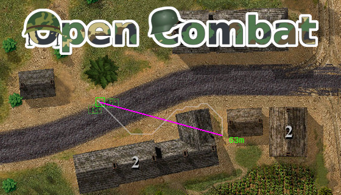
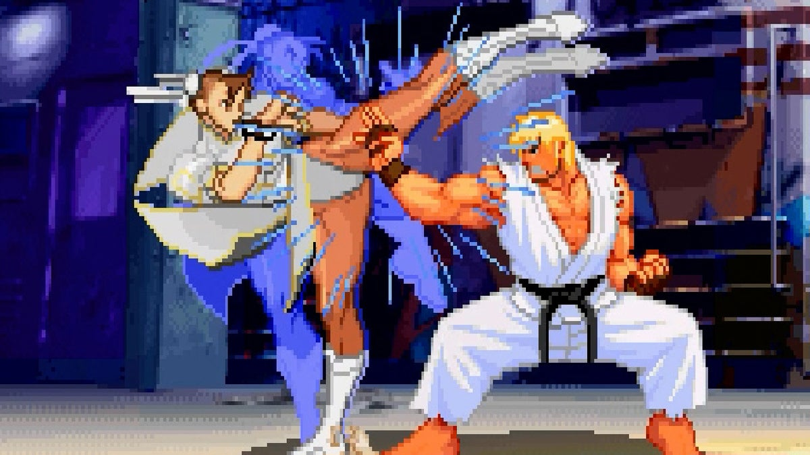

+++
title = "This Month in Rust GameDev #23 - June 2021"
date = 2021-07-01
transparent = true
draft = true
+++

<!-- Check the post with markdownlint-->

Welcome to the {TODO}th issue of the Rust GameDev Workgroup's
monthly newsletter.
[Rust] is a systems language pursuing the trifecta:
safety, concurrency, and speed.
These goals are well-aligned with game development.
We hope to build an inviting ecosystem for anyone wishing
to use Rust in their development process!
Want to get involved? [Join the Rust GameDev working group!][join]

You can follow the newsletter creation process
by watching [the coordination issues][coordination].
Want something mentioned in the next newsletter?
[Send us a pull request][pr].
Feel free to send PRs about your own projects!

[Rust]: https://rust-lang.org
[join]: https://github.com/rust-gamedev/wg#join-the-fun
[pr]: https://github.com/rust-gamedev/rust-gamedev.github.io
[coordination]: https://github.com/rust-gamedev/rust-gamedev.github.io/issues?q=label%3Acoordination

[Rust]: https://rust-lang.org
[join]: https://github.com/rust-gamedev/wg#join-the-fun

- [Game Updates](#game-updates)
- [Learning Material Updates](#learning-material-updates)
- [Engine Updates](#engine-updates)
- [Library & Tooling Updates](#library-tooling-updates)
- [Popular Workgroup Issues in Github](#popular-workgroup-issues-in-github)
- [Meeting Minutes](#meeting-minutes)
- [Requests for Contribution](#requests-for-contribution)
- [Jobs](#jobs)
- [Bonus](#bonus)

<!--
Ideal section structure is:

```
### [Title]


_image caption_

A paragraph or two with a summary and [useful links].

_Discussions:
[/r/rust](https://reddit.com/r/rust/todo),
[twitter](https://twitter.com/todo/status/123456)_

[Title]: https://first.link
[useful links]: https://other.link
```

If needed, a section can be split into subsections with a "------" delimiter.
-->

## Game Updates

### [Open Combat][opencombat]



[Open Combat][opencombat]
([/r/OpenCombatGame](https://reddit.com/r/OpenCombatGame),
[Discord](https://discord.gg/YD2V7XsBQZ),
[Forum](https://discourse.opencombat.bux.fr/))
is a real time tactical game directly inspired from
[Close Combat Series](https://en.wikipedia.org/wiki/Close_Combat_(series)).
The player takes control of soldier units and orders them to win the battles
from a top down 2D view.

The project recently started with Rust language after a Python language proof of
concept in 2017. More info is available at [opencombat.bux.fr][opencombat],
and you can find a
[presentation](https://youtube.com/watch?v=pxVgjBKXlIw) video and a game
making of [video](https://youtube.com/watch?v=3TOEZ7krhvI) on YouTube.

[opencombat]: https://opencombat.bux.fr

## Engine Updates

## Learning Material Updates

## Library & Tooling Updates

### [backroll-rs] and [GGRS]

[backroll-rs] ([Discord](https://discord.gg/VuZhs9V), 
[crates.io](https://crates.io/crates/backroll)) by [@james7132] and 
[GGRS]([crates.io](https://crates.io/crates/ggrs)) by [@g_schup] are pure 
Rust implementations of the [GGPO] rollback networking library.


_[Evo Moment 37](https://www.youtube.com/watch?v=JzS96auqau0): 
Only offline or with rollback!_

Rollback networking is a peer-to-peer network technique designed to hide 
network latency in fast-paced games with precise inputs. Traditional techniques 
account for network transmission time by delaying the game execution, resulting 
in a sluggish game-feel. Rollback uses input prediction and speculative 
execution instead. Upon receiving inputs from remote clients, resimulation of 
incorrect game states occurs. This allows for gameplay that "feels just 
like offline". The open source standard for rollback netcode [GGPO] is used 
in successful games like Skullgirls, Guilty Gear XX Accent Core +R or 
Fightcade. For further explanation about rollback, 
[click here](https://ki.infil.net/w02-netcode.html).

Two projects in Rust were independently created to provide a working 
implementation as well as helpful resources for developers. 
backroll-rs features an added abstraction for the transportation layer and 
also provides a bevy plugin, [bevy-backroll]. GGRS replaces the 
C-style callback API of GGPO with a simpler, more understandable control flow. 
The authors of both libraries recommend backroll-rs, as it is currently 
more actively collaborated on. GGRS is recommended as a learning recource 
and entry point, with a plethora of internal documentation and explanation.

The main requirement to make use of both presented libraries is determinism 
in your game exection. Resimulation requires that the result of progressing 
the game state depending on the given inputs yield the exact same results 
every time. Additionally, you need to be able to load, save and progress 
your gamestate without rendering the outcome.

If you are interested in integrating rollback networking into your game or 
just want to chat with other rollback developers (not limited to Rust), 
check out the [GGPO Developers Discord]!

[backroll-rs]: https://github.com/HouraiTeahouse/backroll-rs
[bevy-backroll]: https://github.com/HouraiTeahouse/backroll-rs/tree/main/bevy_backroll
[GGPO Developers Discord]: https://discord.gg/8FKKhCRCCE
[GGRS]: https://github.com/gschup/ggrs
[GGPO]: https://www.ggpo.net/
[@g_schup]: https://twitter.com/
[@james7132]: https://twitter.com/james7132

### [erupt]


[erupt] by [@Friz64] provides bindings to the Vulkan API.

Since being last mentioned in the newsletter shortly after its release, erupt
has undergone significant development. The generator, erupt's heart, has been
rewritten from scratch with the aim to improve maintainability. On top of that,
many bugs were fixed, the function loader was rewritten and usability was
improved while always keeping up to date with the latest Vulkan Headers as best
as possible.

The ecosystem has gained traction, with many people using the crate for their
projects. Pure Rust Vulkan allocators with support for erupt have been released.

[erupt]: https://gitlab.com/Friz64/erupt
[@Friz64]: https://blog.friz64.de/about


## Popular Workgroup Issues in Github

<!-- Up to 10 links to interesting issues -->

## Meeting Minutes

<!-- Up to 10 most important notes + a link to the full details -->

[See all meeting issues][label_meeting] including full text notes
or [join the next meeting][join].

[label_meeting]: https://github.com/rust-gamedev/wg/issues?q=label%3Ameeting

## Requests for Contribution

<!-- Links to "good first issue"-labels or direct links to specific tasks -->

## Jobs

<!-- An optional section for new jobs related to Rust gamedev -->

## Bonus

<!-- Bonus section to make the newsletter more interesting
and highlight events from the past. -->

------

That's all news for today, thanks for reading!

Want something mentioned in the next newsletter?
[Send us a pull request][pr].

Also, subscribe to [@rust_gamedev on Twitter][@rust_gamedev]
or [/r/rust_gamedev subreddit][/r/rust_gamedev] if you want to receive fresh news!

<!--
TODO: Add real links and un-comment once this post is published
**Discussions of this post**:
[/r/rust](TODO),
[twitter](TODO).
-->

[/r/rust_gamedev]: https://reddit.com/r/rust_gamedev
[@rust_gamedev]: https://twitter.com/rust_gamedev
[pr]: https://github.com/rust-gamedev/rust-gamedev.github.io
