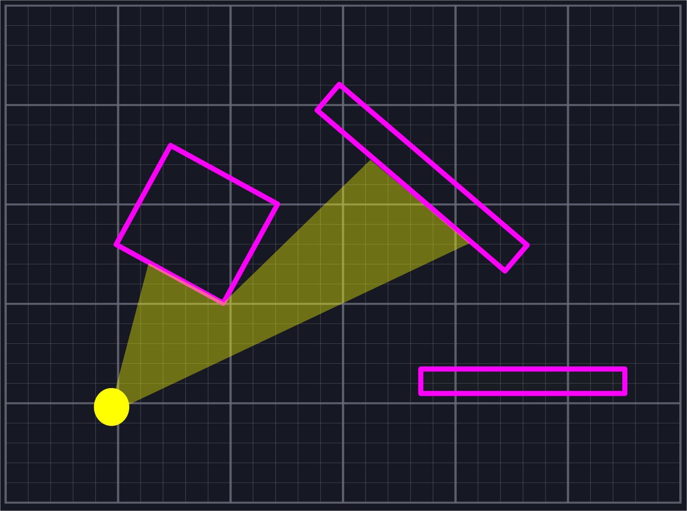

+++
title = "This Month in Rust GameDev #23 - June 2021"
date = 2021-07-01
transparent = true
draft = true
+++

<!-- Check the post with markdownlint-->

Welcome to the {TODO}th issue of the Rust GameDev Workgroup's
monthly newsletter.
[Rust] is a systems language pursuing the trifecta:
safety, concurrency, and speed.
These goals are well-aligned with game development.
We hope to build an inviting ecosystem for anyone wishing
to use Rust in their development process!
Want to get involved? [Join the Rust GameDev working group!][join]

You can follow the newsletter creation process
by watching [the coordination issues][coordination].
Want something mentioned in the next newsletter?
[Send us a pull request][pr].
Feel free to send PRs about your own projects!

[Rust]: https://rust-lang.org
[join]: https://github.com/rust-gamedev/wg#join-the-fun
[pr]: https://github.com/rust-gamedev/rust-gamedev.github.io
[coordination]: https://github.com/rust-gamedev/rust-gamedev.github.io/issues?q=label%3Acoordination

[Rust]: https://rust-lang.org
[join]: https://github.com/rust-gamedev/wg#join-the-fun

<!-- no toc -->
- [Game Updates](#game-updates)
- [Learning Material Updates](#learning-material-updates)
- [Engine Updates](#engine-updates)
- [Library & Tooling Updates](#library-tooling-updates)
- [Popular Workgroup Issues in Github](#popular-workgroup-issues-in-github)
- [Meeting Minutes](#meeting-minutes)
- [Requests for Contribution](#requests-for-contribution)
- [Jobs](#jobs)
- [Bonus](#bonus)

<!--
Ideal section structure is:

```
### [Title]


_image caption_

A paragraph or two with a summary and [useful links].

_Discussions:
[/r/rust](https://reddit.com/r/rust/todo),
[twitter](https://twitter.com/todo/status/123456)_

[Title]: https://first.link
[useful links]: https://other.link
```

If needed, a section can be split into subsections with a "------" delimiter.
-->

## Game Updates

### [Egregoria]


[Egregoria] ([GitHub][Egregoria], [Discord][egregoria-discord])
by [@Uriopass]
is a simulation oriented city builder that tries
to replicate modern society as well as possible.

It recently upgraded from a 2D top-down view to a
3D third-person camera as seen in the screenshot above.

Elevated roads and bridges are now possible, allowing to build
[complex highway interchanges][highway-screenshot].

Some technical details around the renderer with more screenshots,
along with an architectural overview of the project can be read in the
[9th devlog][egregoria-blog-post].

[Egregoria]: https://github.com/Uriopass/Egregoria
[@Uriopass]: https://github.com/Uriopass
[egregoria-blog-post]: https://douady.paris/blog/egregoria_9.html
[egregoria-discord]: https://discord.gg/CAaZhUJ
[highway-screenshot]: http://douady.paris/blog/img/blog_9/interchange.jpg

### [Open Combat][opencombat]


[Open Combat][opencombat]
([/r/OpenCombatGame](https://reddit.com/r/OpenCombatGame),
[Discord](https://discord.gg/YD2V7XsBQZ),
[Forum](https://discourse.opencombat.bux.fr/))
is a real time tactical game directly inspired from
[Close Combat Series](https://en.wikipedia.org/wiki/Close_Combat_(series)).
The player takes control of soldier units and orders them to win the battles
from a top down 2D view.

The project recently started with Rust language after a Python language proof of
concept in 2017. More info is available at [opencombat.bux.fr][opencombat],
and you can find a
[presentation](https://youtube.com/watch?v=pxVgjBKXlIw) video and a game
making of [video](https://youtube.com/watch?v=3TOEZ7krhvI) on YouTube.

[opencombat]: https://opencombat.bux.fr

### [Blightmud][blightmud]


[Blightmud][blightmud] ([Discord](https://discord.gg/qnxgUC5)) is a mud client
for the terminal inspired by [tintin++][tintin] and [tinyfugue][tinyfugue]
allowing users to connect and get immersed in the worlds offered by text based
online multi user dungeons known as muds.

The project was birthed in April of 2020 and has come a long way since.  It now
offers granular scripting access using [lua][lua], plugin handling, built in
text-to-speech (via [Speech dispatcher][speechd]), split view scrolling, modern
telnet protocols and TLS connections to name a few.

[blightmud]: https://github.com/Blightmud/Blightmud
[tintin]: https://tintin.mudhalla.net/
[tinyfugue]: http://tinyfugue.sourceforge.net/
[lua]: https://www.lua.org/
[speechd]: https://freebsoft.org/speechd

### [The Hat Chooses the Wizard][hatchooseswizard]


_Runs on real hardware!_

The Hat Chooses the Wizard is a 2D platformer for the Game Boy Advance.

It was made for this year's Game Maker's Toolkit (GMTK) game jam with the theme
joined together and came in the top 25% of over 5800 entries. The game plays
over 12 levels with the core mechanic being to throw your hat and then
accelerate towards it. You can play it on a web based emulator embedded on the
[itch][hatchooseswizard] page.

The game is written in pure Rust and uses [agb][agblibrary] to
interface with the hardware. The library is designed to allow you to write games
without needing a detailed understanding of the hardware while still giving full
access to all of its capabilities. It is under active development with
plenty more features on the way.

You can find the source code for the game [here][hatchooseswizardsource] and all
feedback is welcome.

[hatchooseswizard]: https://lostimmortal.itch.io/the-hat-chooses-the-wizard
[hatchooseswizardsource]: https://github.com/corwinkuiper/joinedtogether
[agblibrary]: https://github.com/corwinkuiper/agb

### [Themengi]


_Demonstration of natural language parser with temporary words and grammar._

[Themengi] ([Discord][themengi-discord], [Twitter][themengi-twitter])
is a puzzle adventure game where you learn an alien language,
with completely unknown words and grammar, to navigate the world
and find your way home.

This month the [first devlog][themengi-video] for
Themengi was published, discussing its natural language parser using
Head-Driven Phrase Structure Grammar, the choice to use Bevy, a texture
upscaling technique for faithful pixel art rendering, and implementing an
outline shader in the Bevy render pipeline.

[Themengi]: https://vgel.me/themengi
[themengi-discord]: https://discord.gg/GpparbnXPC
[themengi-twitter]: https://twitter.com/voooooogel
[themengi-video]: https://youtube.com/watch?v=gtIphiK7tMs

## Engine Updates

## Learning Material Updates

### [A Trig-less Line of Sight Algorithm for 2D Games][lineofsight]



[@basstabs] published a tutorial which explains how to write a
line of sight algorithm for 2D games in Rust without using trigonometry or
square roots. It includes vector diagrams and typeset math to explain the ideas
behind each stage of the algorithm, source code for each step, tests to verify
accuracy of the methods, and suggestions for further improvements.
Additionally, the
[repository](https://github.com/basstabs/2d-line-of-sight) contains benchmarks
and a sample application written in [ggez](https://crates.io/crates/ggez).

_Discussions: [/r/rust_gamedev](
https://www.reddit.com/r/rust\_gamedev/comments/nx79kq/)_

[lineofsight]: https://basstabs.github.io/2d-line-of-sight/
[@basstabs]: https://github.com/basstabs

## Library & Tooling Updates

### [erupt]


[erupt] by [@Friz64] provides bindings to the Vulkan API.

Since being last mentioned in the newsletter shortly after its release, erupt
has undergone significant development. The generator, erupt's heart, has been
rewritten from scratch with the aim to improve maintainability. On top of that,
many bugs were fixed, the function loader was rewritten and usability was
improved while always keeping up to date with the latest Vulkan Headers as best
as possible.

The ecosystem has gained traction, with many people using the crate for their
projects. Pure Rust Vulkan allocators with support for erupt have been released.

[erupt]: https://gitlab.com/Friz64/erupt
[@Friz64]: https://blog.friz64.de/about

### [wgpu] family re-union


[wgpu] is a [WebGPU] implementation in Rust. It is safe, efficient,
and portable: it can target both native and the Web.

[Family reunion] is by far the biggest change in `wgpu` project since
the inception. First, the Rust API of [wgpu-rs] was moved to the main
[wgpu] repository. Second, the whole base was relicensed under MIT/Apache2.

[gfx-hal] - the Vulkan Portability-like graphics API abstraction -
was detached from the project. Instead `wgpu` got its own in-house unsafe
abstraction called "wgpu-hal" developed within the [wgpu] repository.

The team released [wgpu-0.9] right before this transition, to give the new
graphics infrastructure more time to take shape. At the time of writing,
supported backends on the new HAL include Vulkan, Metal, and OpenGL ES3.

Finally, the testing infrastructure received a major upgrade. It started
rendering the examples on the available adapters and compraring the results
with reference images.
This includes automatic testing using software adapters on CI.

[wgpu]: https://github.com/gfx-rs/wgpu
[wgpu-rs]: https://github.com/gfx-rs/wgpu-rs
[gfx-hal]: https://github.com/gfx-rs/gfx
[wgpu-0.9]: https://crates.io/crates/wgpu/0.9.0
[Family reunion]: https://github.com/gfx-rs/wgpu/milestone/9?closed=1

### [bevy_midi]


[bevy_midi] by [@BlackPhlox] is a new bevy plugin that uses
[midir] to interact with the bevy game engine.

It started out with [bevy_osc] as a
proof-of-concept interfacing with
[nannou_osc]
and using other osc software to communicate with bevy.
Soon, realizing that nannou_osc is not that different
how you interfaces with midi, bevy_midi was born.

Here is one of the examples which you can use a midi controller
to play piano with [demo_audio].

The plugins is still in its infancy.
So it still has some performance issues, so
any feedback and contributions is highly appreciated.

[bevy_midi]: https://github.com/BlackPhlox/bevy_midi
[bevy_osc]: https://github.com/BlackPhlox/bevy_osc
[nannou_osc]: https://github.com/nannou-org/nannou_osc
[midir]: https://github.com/Boddlnagg/midir
[demo_audio]: https://discord.com/channels/691052431525675048/692648638823923732/857177113923682304
[@BlackPhlox]: https://github.com/BlackPhlox

### [bevy_config_cam]


[bevy_config_cam] by [@BlackPhlox]
is an all-in-one purpose camera/player controller for bevy. 

With focus on plug-and-play,flexibility and ease of use, this bevy plugin is
for anyone who is prototyping in 3D and doesn't want the hassle of programming
a player-controller from scratch.Instantly switch between camera modes such as
Tracking to Topdown, Follow Behind, FPS and Free and more.

The plugins is very new.
So any feedback and contributions is highly appreciated.

[bevy_config_cam]: https://github.com/BlackPhlox/bevy_config_cam
[@BlackPhlox]: https://github.com/BlackPhlox

## Popular Workgroup Issues in Github

<!-- Up to 10 links to interesting issues -->

## Meeting Minutes

<!-- Up to 10 most important notes + a link to the full details -->

[See all meeting issues][label_meeting] including full text notes
or [join the next meeting][join].

[label_meeting]: https://github.com/rust-gamedev/wg/issues?q=label%3Ameeting

## Requests for Contribution

<!-- Links to "good first issue"-labels or direct links to specific tasks -->

## Jobs

<!-- An optional section for new jobs related to Rust gamedev -->

## Bonus

<!-- Bonus section to make the newsletter more interesting
and highlight events from the past. -->

------

That's all news for today, thanks for reading!

Want something mentioned in the next newsletter?
[Send us a pull request][pr].

Also, subscribe to [@rust_gamedev on Twitter][@rust_gamedev]
or [/r/rust_gamedev subreddit][/r/rust_gamedev] if you want to receive fresh news!

<!--
TODO: Add real links and un-comment once this post is published
**Discussions of this post**:
[/r/rust](TODO),
[twitter](TODO).
-->

[/r/rust_gamedev]: https://reddit.com/r/rust_gamedev
[@rust_gamedev]: https://twitter.com/rust_gamedev
[pr]: https://github.com/rust-gamedev/rust-gamedev.github.io
