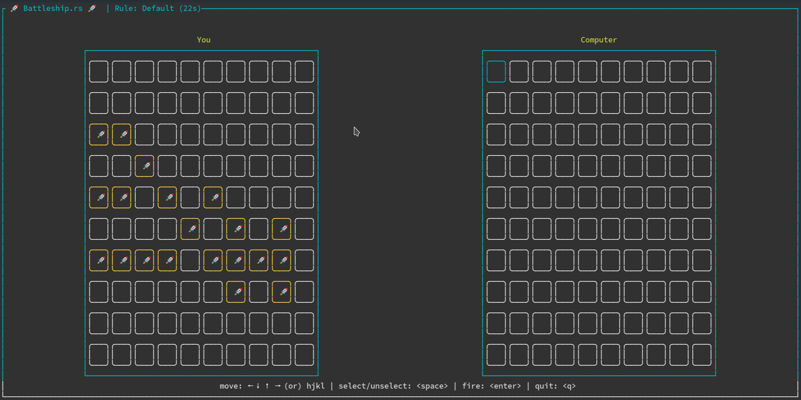
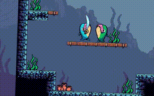
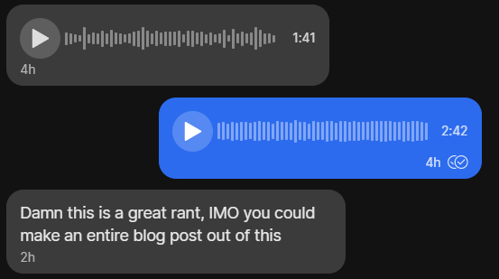

+++
title = "This Month in Rust GameDev #23 - June 2021"
date = 2021-07-08
transparent = true
draft = false
+++

Welcome to the 23rd issue of the Rust GameDev Workgroup's
monthly newsletter.
[Rust] is a systems language pursuing the trifecta:
safety, concurrency, and speed.
These goals are well-aligned with game development.
We hope to build an inviting ecosystem for anyone wishing
to use Rust in their development process!
Want to get involved? [Join the Rust GameDev working group!][join]

You can follow the newsletter creation process
by watching [the coordination issues][coordination].
Want something mentioned in the next newsletter?
[Send us a pull request][pr].
Feel free to send PRs about your own projects!

[Rust]: https://rust-lang.org
[join]: https://github.com/rust-gamedev/wg#join-the-fun
[pr]: https://github.com/rust-gamedev/rust-gamedev.github.io
[coordination]: https://github.com/rust-gamedev/rust-gamedev.github.io/issues?q=label%3Acoordination

[Rust]: https://rust-lang.org
[join]: https://github.com/rust-gamedev/wg#join-the-fun

<!-- no toc -->
- [Game Updates](#game-updates)
- [Learning Material Updates](#learning-material-updates)
- [Engine Updates](#engine-updates)
- [Tooling Updates](#tooling-updates)
- [Library Updates](#library-updates)
- [Requests for Contribution](#requests-for-contribution)

<!--
Ideal section structure is:

```
### [Title]


_image caption_

A paragraph or two with a summary and [useful links].

_Discussions:
[/r/rust](https://reddit.com/r/rust/todo),
[twitter](https://twitter.com/todo/status/123456)_

[Title]: https://first.link
[useful links]: https://other.link
```

If needed, a section can be split into subsections with a "------" delimiter.
-->

## Rust GameDev Meetup


The sixth Rust Gamedev Meetup happened in June. You can watch the recording of
the meetup [here on Youtube][gamedev-meetup-video]. The meetups take place on
the second Saturday every month via the [Rust Gamedev Discord
server][rust-gamedev-discord], and are also [streamed on
Twitch][rust-gamedev-twitch]. If you would like to show off what you've been
working on in a future meetup, fill out [this form][gamedev-meetup-form].

[gamedev-meetup-form]: https://forms.gle/BS1zCyZaiUFSUHxe6
[gamedev-meetup-video]: https://www.youtube.com/watch?v=Wuwxh958P6I
[rust-gamedev-discord]: https://discord.gg/yNtPTb2
[rust-gamedev-twitch]: https://twitch.tv/rustgamedevmeetup

## Game Updates

### taileater


taileater ([itch.io](https://szunami.itch.io/taileater),
[GitHub](https://github.com/szunami/taileater/)) is a open source puzzle game
in which you eat your own tail to win.

The game is programmed in Rust using the Bevy engine.

### [Egregoria]


[Egregoria] ([GitHub][Egregoria], [Discord][egregoria-discord])
by [@Uriopass]
is a simulation oriented city builder that tries
to replicate modern society as well as possible.

It recently upgraded from a 2D top-down view to a
3D third-person camera as seen in the screenshot above.

Elevated roads and bridges are now possible, allowing to build
[complex highway interchanges][highway-screenshot].

Some technical details around the renderer with more screenshots,
along with an architectural overview of the project can be read in the
[9th devlog][egregoria-blog-post].

[Egregoria]: https://github.com/Uriopass/Egregoria
[@Uriopass]: https://github.com/Uriopass
[egregoria-blog-post]: https://douady.paris/blog/egregoria_9.html
[egregoria-discord]: https://discord.gg/CAaZhUJ
[highway-screenshot]: http://douady.paris/blog/img/blog_9/interchange.jpg

### [Open Combat][opencombat]


[Open Combat][opencombat]
([/r/OpenCombatGame](https://reddit.com/r/OpenCombatGame),
[Discord](https://discord.gg/YD2V7XsBQZ),
[Forum](https://discourse.opencombat.bux.fr/))
is a real time tactical game directly inspired by
[Close Combat Series](https://en.wikipedia.org/wiki/Close_Combat_(series)).
The player takes control of soldier units and orders them to win the battles
from a top down 2D view.

The project recently started with Rust language after a Python language proof of
concept in 2017. More info is available at [opencombat.bux.fr][opencombat],
and you can find a
[presentation](https://youtube.com/watch?v=pxVgjBKXlIw) video and a game
making of [video](https://youtube.com/watch?v=3TOEZ7krhvI) on YouTube.

[opencombat]: https://opencombat.bux.fr

### [Battleship.rs](https://github.com/deepu105/battleship-rs)



[Battleship.rs](https://github.com/deepu105/battleship-rs) by
[Deepu](https://twitter.com/deepu105) is an open source Battleship game for
the terminal built in Rust using the [tui-rs](https://github.com/fdehau/tui-rs)
crate.

The game uses different ship shapes, unlike the traditional vertical/horizontal
shapes, and has multiple game rules to choose from. There are two difficulty
levels as well. The game is supported in Linux, Mac and Docker.

If you have docker installed, you can play the game instantly by running

```bash
docker run --rm -it deepu105/battleship:main
```

The next iteration would be to support a WebAssembly version of the same.

### [Blightmud][blightmud]


[Blightmud][blightmud] ([Discord](https://discord.gg/qnxgUC5)) is a mud client
for the terminal inspired by [tintin++][tintin] and [tinyfugue][tinyfugue]
allowing users to connect and get immersed in the worlds offered by text based
online multi user dungeons known as muds.

The project was birthed in April of 2020 and has come a long way since.  It now
offers granular scripting access using [lua][lua], plugin handling, built in
text-to-speech (via [Speech dispatcher][speechd]), split view scrolling, modern
telnet protocols, and TLS connections to name a few.

[blightmud]: https://github.com/Blightmud/Blightmud
[tintin]: https://tintin.mudhalla.net/
[tinyfugue]: http://tinyfugue.sourceforge.net/
[lua]: https://www.lua.org/
[speechd]: https://freebsoft.org/speechd

### [The Hat Chooses the Wizard][hatchooseswizard]


_Runs on real hardware!_

The Hat Chooses the Wizard is a 2D platformer for the Game Boy Advance.

It was made for this year's Game Maker's Toolkit (GMTK) game jam with the theme
joined together and came in the top 25% of over 5800 entries. The game plays
over 12 levels with the core mechanic being to throw your hat and then
accelerate towards it. You can play it on a web-based emulator embedded on the
[itch][hatchooseswizard] page.

The game is written in pure Rust and uses [agb][agblibrary] to
interface with the hardware. The library is designed to allow you to write games
without needing a detailed understanding of the hardware while still giving full
access to all of its capabilities. It is under active development with
plenty more features on the way.

You can find the source code for the game [here][hatchooseswizardsource] and all
feedback is welcome.

[hatchooseswizard]: https://lostimmortal.itch.io/the-hat-chooses-the-wizard
[hatchooseswizardsource]: https://github.com/corwinkuiper/joinedtogether
[agblibrary]: https://github.com/corwinkuiper/agb

### [Themengi]


_Demonstration of natural language parser with temporary words and grammar._

[Themengi] ([Discord][themengi-discord], [Twitter][themengi-twitter])
is a puzzle adventure game where you learn an alien language,
with completely unknown words and grammar, to navigate the world
and find your way home.

This month the [first devlog][themengi-video] for
Themengi was published, discussing its natural language parser using
Head-Driven Phrase Structure Grammar, the choice to use Bevy, a texture
upscaling technique for faithful pixel art rendering, and implementing an
outline shader in the Bevy render pipeline.

[Themengi]: https://vgel.me/themengi
[themengi-discord]: https://discord.gg/GpparbnXPC
[themengi-twitter]: https://twitter.com/voooooogel
[themengi-video]: https://youtube.com/watch?v=gtIphiK7tMs

### [Dango]

[][Dango]
_Cute rice dumplings_

[Dango] ([GitHub][dango-github]) is a little multiplayer blob physics sandbox
made by [@ErnWong] as a tribute to the [Dango Daikazoku][dango-daikazoku] from
[Clannad]. It was made using various libraries from the Rust community,
including the [Bevy] game engine, the [NPhysics] physics engine, and the
[CrystalOrb] networking library. To avoid the costs of running a server, Dango
currently runs the server in the browser and generates a unique URL that lets
other players to join using WebRTC.

[Dango]: http://ernestwong.nz/dango-tribute/server/
[dango-github]: https://github.com/ErnWong/dango-tribute
[@ErnWong]: https://github.com/ErnWong
[dango-daikazoku]: https://www.youtube.com/watch?v=XXDxZ0YGWG8
[Clannad]: https://en.wikipedia.org/wiki/List_of_Clannad_episodes
[Bevy]: https://bevyengine.org/
[NPhysics]: https://nphysics.org/
[CrystalOrb]: https://github.com/ErnWong/crystalorb

### [FishGame][fishgame-itch]



[FishGame][fishgame-itch] is a multiplayer brawler game made in [macroquad].

FishGame started as a [nakama-rs] showcase, but now it's getting more life as
an independent game. To make a transition from a tech demo to a real game,
lots of playtesting and fine-tuning happened this month. Most noticeable
improvements: a new physics system with throwable everything and a new
zoom-to-fit camera system.

[fishgame-itch]: https://fedorgames.itch.io/fish-game
[macroquad]: https://github.com/not-fl3/macroquad
[nakama-rs]: https://github.com/heroiclabs/nakama-rs

### [Hyper Farmer][hyperfarmer-itch]


The dubiously named [Hyper Farmer][hyperfarmer-itch] was made for the GMTK Game Jam
using the Bevy engine. For some reason, the player has to pick up all the hay from
their fields using a giant laser slung between two tractors. Apart from the
[bevy_game_template][bevy_game_template], all the artwork, music, and code was
made over about 24 hours. The game can be played in the
[browser][hyperfarmer-itch], and native builds are available
on [github releases][hyperfarmer].

[bevy_game_template]: https://github.com/NiklasEi/bevy_game_template
[hyperfarmer]: https://github.com/will-hart/cloud-surfer
[hyperfarmer-itch]: https://wilsk.itch.io/hyper-farmer

### [Way of Rhea][wor]

[][wor]

[Way of Rhea][wor] is a picturesque puzzle platformer-without the platforming.
Solve mind-bending color puzzles, unlock new areas of a vibrant hub world, and
talk to NPCs to unravel the mysteries of a world you left behind!

Way of Rhea is being produced by [@masonremaley][mason-remaley]. Latest Way of
Rhea developments:

- Most biomes now have narrative arcs, experienced in part through the
  [new dialogue system][wor-speech-bubble].
- [@masonremaley][mason-remaley] published
  [a blog post, *When to Rewrite*][wor-when-to-rewrite] outlining how he views the
  rewrite vs improve tradeoff in the Way of Rhea engine.
- Controller support was added, controls glyphs shown in game automatically
  reflect the most recently used input device.
- Fixes a player reported bug where undo/redo resulted in a temporary slowdown
  due to a lack of communication with the sleep system.
- More puzzles!

[wor]: https://store.steampowered.com/app/1110620
[wor-when-to-rewrite]: https://www.anthropicstudios.com/2021/06/25/when-to-rewrite/
[wor-speech-bubble]: https://twitter.com/masonremaley/status/1400189924889042944
[mason-remaley]: https://twitter.com/masonremaley

### [Weegames][weegames-itch]


[Weegames][weegames-itch] is a fast-paced minigame collection.
The web version now has a counter which tells you how many
of the 41 minigames you've played. Also, the game shows
a newly-added loading screen while downloading the
initial assets.

Note: These updates have not yet been rolled out to the
downloadable Windows version.

[weegames-itch]: https://yeahross.itch.io/weegames

### Flesh


_demo build_

Flesh by [@im_oab] is a 2D-horizontal shmup game with hand-drawn animation and
organic/fleshy theme. It is implemented using [Tetra]. This month, an internal
demo build was released, with a development journal available on
[Google Drive][flesh-gdrive].

[@im_oab]: https://twitter.com/im_oab
[Tetra]: https://github.com/17cupsofcoffee/tetra
[flesh-gdrive]: https://drive.google.com/drive/folders/1CppHsiteHDNofsVo2wHNNz_3E9YuK4Ay

### [Veloren][veloren]

 _Turns out the cave wasn't empty_

[Veloren][veloren] is an open world, open-source voxel RPG inspired by Dwarf
Fortress and Cube World.

In June, Veloren released 0.10. During the release party, some of the developers
joined a voice call to stream the game and answer some questions about
development. You can watch that stream [here][veloren-stream]. A lot of metrics
were recorded during the launch, and you can read about them in
[blog #124][veloren-124]. At peak, 118 players were playing at the same
time during the launch.

The plugins system received a tutorial about how to get started. Caves were
overhauled with lots of new content. Veloren has officially moved fully over to
wgpu, which you can read all about in [blog #125][veloren-125]. Work has been
done on hot reloading for easier access of assets in game. Lots of new models
were added to the game, and bosses in dungeons are being overhauled with more
skills to diversify combat.

June's full weekly devlogs: "This Week In Veloren...":
[#123][veloren-123],
[#124][veloren-124],
[#125][veloren-125],
[#126][veloren-126].

[veloren]: https://veloren.net
[veloren-stream]: https://www.youtube.com/watch?v=NMvEhymkqUw
[veloren-123]: https://veloren.net/devblog-123
[veloren-124]: https://veloren.net/devblog-124
[veloren-125]: https://veloren.net/devblog-125
[veloren-126]: https://veloren.net/devblog-126

### [Projectris][projectris]


[Projectris][projectris] is like Tetris, but in 2D and 3D at the same time.
As the 3D piece falls, you can manipulate it, but all that matters
are the shadows it casts on the 2D game boards on either side,
each of which is played independently.

While the full concept is already prototyped, there are still many features to
implement before this is a real game:
scoreboard, increasing fall speed, game over, JUICE.

[@bonsairobo] is not actively working on this, but is
[happy to accept PRs][projectris].

[projectris]: https://github.com/bonsairobo/projectris

### [The Process]


_Building the world, one voxel at a time_

[The Process] by @setzer22 is an upcoming game about factory building,
process management, and carrot production,
built with Rust using the Godot game engine!

In this month, the main focus has been towards the addition of a new terrain
editor to speed up the creation of game levels. Terrain meshes are built using
smooth voxels using the implementation in the [building
blocks](https://docs.rs/building_blocks_core) crate.

This month has seen the following changes and improvements:

- The new [terrain
  editor](https://twitter.com/PlayTheProcess/status/1406707803637551107), with a
  minimalistic GUI built in Godot itself.
- A new [island](https://gfycat.com/talkativeneatcatfish), fully made and
  procedurally textured with the new editor
- Implemented random factory maintenance
  [events](https://twitter.com/PlayTheProcess/status/1403986026402619393).
- Migration of several old GDScript code into Rust, using the ECS pattern, like
  the system for character
  [movement](https://twitter.com/PlayTheProcess/status/1411410261651738635).

_Discussions:
[/r/rust_gamedev](https://reddit.com/r/rust_gamedev/comments/o3o8d0/experimenting_with_the_building_blocks_crate)_

[The Process]: https://twitter.com/PlayTheProcess

### [Not Snake][not-snake]


[Not Snake][not-snake] is a snake game in 3D with a twist:
you're the snake's food!

Check out the web version on the [game's itch.io page][not-snake].

[not-snake]: https://ramirezmike2.itch.io/not-snake

### [Space:CAKES][cakes]


[Space:CAKES][cakes] is a sliding, repeating and funky puzzler
about reaching the delicious cupcake across your spaceship.
Made for the GMTK Game Jam.

> You play as a cute alien, who has a limited amount of steps.
> He turns green when he can walk freely, but once he runs out of steps,
> he becomes red and can only push on crates.
> Luckily, some crates contain +1 or +2 steps for him,
> as long as he can push one into a laser.

[cakes]: https://noxim.itch.io/spacecakes

### [sokoban-sokoban]


[sokoban-sokoban] ([source code][sokoban-sokoban-src]) by [@trouv]
is a sokoban-like puzzle game made in 48 hours for the GMTK 2021 game jam.

> Somebody messed up the graveyard! You can fix it, but your movements
> are joined together.
> More specifically, the location of the gravestones in the level's movement
> table determines which movements are joined to which.
> When two movements are "joined", the associated input performs BOTH movements!

[sokoban-sokoban]: https://trouv.itch.io/sokoban-sokoban
[sokoban-sokoban-src]: https://github.com/Trouv/sokoban-sokoban
[@trouv]: https://trouv.itch.io

## Engine Updates

### thRustEngine - with simple shooter game demo


This is a simple descent/quake style shooter written to demo
[thRustEngine]. The current repo is a placeholder.

It loads wavefront.OBJ, and Quake1/Quake3 BSP worlds, converted to
an internal format for collision and rendering. It uses clustered
forward+ dynamic lighting and normal maps, and loads textures
asynchronously.

The future direction depends on community feedback (a public shared
crate is planned). The current intention is to find a few close
collaborators.

Demo videos: [free quake map demo], [custom map demo].

_Discussions:
[/r/rust_gamedev](https://reddit.com/r/rust_gamedev/comments/obj38y/rust_shooter_another_little_update)_

[thrustEngine]: https://github.com/experiment9123/thrustengine
[free quake map demo]: https://vimeo.com/569777592
[custom map demo]: https://vimeo.com/572436649

### [rg3d]


[rg3d] ([Discord][rg3d_discord], [Twitter][rg3d_twitter]) is a game engine that
aims to be easy to use and provide a large set of out-of-box features. Some of
the recent engine updates:

- Initial support for custom rendering techniques.
- Word-based wrapping for FormattedText.
- Ability to specify material search options when loading a model.
- Render sky box in a single draw call.
- Fix for resource management issues.
- Fix for FBX loader in case of invalid mappings.
- Fix for triangulator.
- Physics for terrains.
- Heightfield visualization.
- Ability to pause sound contexts.
- `editable` flag for text boxes.
- Various bug fixes and small improvements.

rusty-editor updates:

- Ability to add/remove/edit sound sources
- Model import dialog window.
- Embed and fonts icons in the binary, which makes package distribution
  easier.
- `.deb` and `.rpm` packages for Linux
- Camera fix + ability to preview scene cameras
- Icons for "shapeless" (lights, sound sources) objects in the scene.

[rg3d]: https://github.com/mrDIMAS/rg3d
[rg3d_discord]: https://discord.gg/xENF5Uh
[rg3d_twitter]: https://twitter.com/DmitryNStepanov

## Learning Material Updates

### [A Trig-less Line of Sight Algorithm for 2D Games][lineofsight]


[@basstabs] published a tutorial that explains how to write a
line of sight algorithm for 2D games in Rust without using trigonometry or
square roots. It includes vector diagrams and typeset math to explain the ideas
behind each stage of the algorithm, source code for each step, tests to verify
the accuracy of the methods, and suggestions for further improvements.
Additionally, the
[repository](https://github.com/basstabs/2d-line-of-sight) contains benchmarks
and a sample application written in [ggez](https://crates.io/crates/ggez).

_Discussions:
[/r/rust_gamedev](https://reddit.com/r/rust_gamedev/comments/nx79kq/)_

[lineofsight]: https://basstabs.github.io/2d-line-of-sight/
[@basstabs]: https://github.com/basstabs

### [When to Rewrite][when-to-rewrite]

[][when-to-rewrite]

[@masonremaley][mason-remaley] wrote [a blog post][when-to-rewrite] offering an
opinion on rewrites vs incremental migrations informed by his work on the
[Way of Rhea][wor] engine.

> A working system is a valuable asset. It works. It lets you test new ideas
> cheaply. Don't take that for granted.

_Discussions:
[/r/rust_gamedev](https://reddit.com/r/rust_gamedev/comments/o8dy0r/when_to_rewrite)_

[when-to-rewrite]: https://www.anthropicstudios.com/2021/06/25/when-to-rewrite/
[mason-remaley]: https://twitter.com/masonremaley
[wor]: https://store.steampowered.com/app/1110620

### [Writing the Bevy Retro Renderer][bevy_retro_renderer]

[@katharostech] published an article about their experiences writing the render
for [Bevy Retro][bevy_retro]. They walk through the different strategies and APIs
they tried and explain why they wrote their own renderer in the first place.

[bevy_retro_renderer]: https://katharostech.com/post/writing-bevy-retros-renderer
[bevy_retro]: https://github.com/katharostech/bevy_retrograde
[@katharostech]: https://github.com/katharostech

### [Game Development with Rust][medium_rust_gamedev]

[@thebracket] published an article on the current state of Rust Game
Development. It covers a few games and engines made in Rust, links to some
resources for integrating Rust into major game engines (Unity and Unreal).
The article then links to some tutorials and resources for learning Rust
game development at different skill and experience levels.

[medium_rust_gamedev]: https://medium.com/pragmatic-programmers/game-development-with-rust-31147f7b6096
[@thebracket]: https://github.com/thebracket/

### [How to make plugins system with Rust and WebAssembly][devblog.arcana.rs]

[@zakarumych] published an article about their experience creating
a fully safe plugins system using plugins compiled to WebAssembly.
It provides reasoning for choosing WASM in specific scenario
and contains strategies for interacting with WASM modules embedded
into an application,
including dealing with dynamic memory of the module,
string and array operations, function pointers, etc.

[devblog.arcana.rs]: https://devblog.arcana.rs/how-to-make-plugins-system-with-rust-and-webassembly
[@zakarumych]: https://github.com/zakarumych/

### [Getting Started with ECS using Planck ECS][planck-tutorial]


[planck_ecs] by [@jojolepro] is a minimalist and safe ECS library.

This month [@jojolepro] released a [tutorial][planck-tutorial]
that describes how to use ECSes in general and [planck_ecs] specifically.

[planck-tutorial]: https://jojolepro.com/blog/2021-06-01_getting_started_with_ecs
[planck_ecs]: https://github.com/jojolepro/planck_ecs
[@jojolepro]: https://patreon.com/jojolepro

## Tooling Updates

### [Sugarcubes]


[Sugarcubes] by [@henryksloan] is a tool for designing and testing automata.

Sugarcubes allows for easy creation of models used in the theory of computing.
It is designed to be a more intuitive and useful alternative to JFLAP,
the most popular tool for designing automata and formal languages.
It uses macroquad for the editor, and egui for the toolbars. Sugarcubes
currently features a fully functional finite automaton editor and simulator,
and many other models, editing features and simulations are planned.

You can check out a [live WASM demo here][Sugarcubes],
or the [source code on Github][Sugarcubes source].

[Sugarcubes]: https://henryksloan.github.io/sugarcubes/
[Sugarcubes source]: https://github.com/henryksloan/sugarcubes
[@henryksloan]: https://github.com/henryksloan

### [Rusty Slider]


_Supports syntax highlighting of code blocks_

[Rusty Slider] by [@ollej] is a markdown slideshow viewer
written with macroquad.

The game engine Macroquad can be used for more than just games. It’s also a
great way to quickly build multi-platform tools with graphics.

It’s possible to write presentations in plain text using Markdown. The
application runs natively on all major platforms, and can also be used within
a browser.

- Supports headers, bold/italic, blockquotes, lists, and code blocks with
  syntax highlighting.
- Automatically change slides.
- Themes separated from content.
- Toggle a CRT shader.

The latest feature added was to execute bash code blocks. The output of the
execution will be shown below the code block. This is meant to be used for
demo purposes, to show actual results of commands.

[Rusty Slider]: https://ollej.github.io/rusty-slider
[@ollej]: https://twitter.com/ollej

### [Graphite][graphite-repo]


_Geometric cherry tree artwork by BillyDM, winner of last month's first
Graphite art contest_

Graphite ([GitHub][graphite-repo], [Discord][graphite-discord],
[Twitter](https://twitter.com/GraphiteEditor)) is an in-development vector and
raster graphics editor built on a non-destructive node-based workflow.

Since last newsletter, the editor has received the ability to select layers via
the layer panel and by clicking or dragging a box selection in the
viewport. Selected layers can be deleted, duplicated, and copy/pasted.

It is now possible to create, edit, and close multiple documents in their own
editor tabs. Additional frontend cleanup and polish has also improved many
parts of the editor experience.

Lastly, support for transforms was added to the layers and document, paving
the way for moving/scaling/rotating layers and the whole document within the
viewport.

[Try it right now in your browser.][graphite-live-demo] Graphite is making
rapid progress towards becoming a non-destructive, procedural graphics editor
suitable of replacing traditional 2D DCC applications. Please
[join the Discord][graphite-discord] - and consider asking for a tour of the
code and how you can help!

[graphite-repo]: https://github.com/GraphiteEditor/Graphite
[graphite-discord]: https://discord.graphite.design
[graphite-twitter]: https://twitter.com/GraphiteEditor
[graphite-live-demo]: https://editor.graphite.design

### [texture_generator] v0.5


_An depth image example_

[texture_generator] by [Orchaldir] is a library to generate textures,
and a library to use those textures to render tilemaps.

This month the v0.5 version was released. Some of the updates:

- The editor was switched to [Iced].
- Layered textures.
- Door handles.
- More options for depth calculation: depth gradient along X or Y
  and barrel shape.
- Furniture can now have a fixed size or fill the selected area

_Discussions:
[/r/rust_gamedev](https://reddit.com/r/rust_gamedev/comments/nz5ban/i_switched_my_tilemap_editor_to_iced)_

[texture_generator]: https://github.com/Orchaldir/texture_generator
[Orchaldir]: https://github.com/Orchaldir
[texgen-v0-5]: https://github.com/Orchaldir/texture_generator/releases/tag/v0.5.0
[Iced]: https://github.com/hecrj/iced

## Library Updates

### [backroll-rs] and [GGRS]

[backroll-rs] ([Discord](https://discord.gg/VuZhs9V),
[crates.io](https://crates.io/crates/backroll)) by [@james7132] and
[GGRS]([crates.io](https://crates.io/crates/ggrs)) by [@g_schup] are pure
Rust implementations of the [GGPO] rollback networking library.


_[Evo Moment 37](https://www.youtube.com/watch?v=JzS96auqau0):
Only offline or with rollback!_

Rollback networking is a peer-to-peer network technique designed to hide
network latency in fast-paced games with precise inputs. Traditional techniques
account for network transmission time by delaying the game execution, resulting
in a sluggish game-feel. Rollback uses input prediction and speculative
execution instead. Upon receiving inputs from remote clients, resimulation of
incorrect game states occurs. This allows for gameplay that "feels just
like offline". The open source standard for rollback netcode [GGPO] is used
in successful games like Skullgirls, Guilty Gear XX Accent Core +R or
Fightcade. For further explanation about rollback,
[click here](https://ki.infil.net/w02-netcode.html).

Two projects in Rust were independently created to provide a working
implementation as well as helpful resources for developers.
backroll-rs features an added abstraction for the transportation layer and
also provides a bevy plugin, [bevy-backroll]. GGRS replaces the
C-style callback API of GGPO with a simpler, more understandable control flow.
The authors of both libraries recommend backroll-rs for development,
as it is currently more actively collaborated on.
GGRS is recommended as a learning resource and entry point,
with a plethora of internal documentation and explanation.

The main requirement to make use of both presented libraries is determinism
in your game execution. Resimulation requires that the result of progressing
the game state depending on the given inputs yield the exact same results
every time. Additionally, you need to be able to load, save and progress
your gamestate without rendering the outcome.

If you are interested in integrating rollback networking into your game or
just want to chat with other rollback developers (not limited to Rust),
check out the [GGPO Developers Discord]!

[backroll-rs]: https://github.com/HouraiTeahouse/backroll-rs
[bevy-backroll]: https://github.com/HouraiTeahouse/backroll-rs/tree/main/bevy_backroll
[GGPO Developers Discord]: https://discord.gg/8FKKhCRCCE
[GGRS]: https://github.com/gschup/ggrs
[GGPO]: https://www.ggpo.net/
[@g_schup]: https://twitter.com/g_schup
[@james7132]: https://twitter.com/james7132

### [CrystalOrb]

[][crystalorb-demo]
_Interactive [demo][crystalorb-demo] that uses the [Rapier] physics engine._

[CrystalOrb] by [@ErnWong] is a new networking library that aims to help
fast-paced client-server games synchronize their game state across multiple
clients. Just like [backroll-rs] and [GGRS], each CrystalOrb client predicts
the next game state without waiting for other remote players' inputs to arrive.
Unlike backroll-rs's and GGRS's peer-to-peer approach which only send input
data between its peers, CrystalOrb relies on having a server to send
authoritative snapshots of the entire game state to each client. In response,
each client unconditionally rolls-back to that snapshot. Although this may lead
to higher network and memory usage, it means that CrystalOrb clients can join
and leave at any time, and games that cannot guarantee full-determinism can
still work with CrystalOrb.

This library was written as a learning exercise for the author, and as such,
the author warns that this library may not be suitable for serious games.

There is an [interactive demo][crystalorb-demo] of CrystalOrb that features the
[Rapier] physics engine.

[CrystalOrb]: https://github.com/ErnWong/crystalorb
[@ErnWong]: https://github.com/ErnWong
[crystalorb-demo]: https://ernestwong.nz/crystalorb/demo
[backroll-rs]: https://github.com/HouraiTeahouse/backroll-rs
[GGRS]: https://github.com/gschup/ggrs
[Rapier]: https://rapier.rs

### [glutin] (and [winit])


_This cursor may be waiting [in vain], but your patience shall be rewarded._

[glutin] is a low-level library for OpenGL context creation, written in pure Rust.
[glutin] uses and re-exports [winit], which handles window creation and management,
as well as various input devices.

This month, glutin 0.27.0 was released, which makes glutin use the latest version
of winit (0.25.0), which was released around a month prior to glutin 0.27.0. Usually,
we try to keep glutin synced with winit, but we couldn't quite manage to do it this
time since the person who'd usually take responsibility for releasing a new version
of glutin was unavailable, and no-one had the role of "back-up releaser".
[@maroider] has offered to fill this role for now.

The upgrade to winit 0.25.0 brings with it a slew of bugfixes, a couple of new
features, and a single breaking change to
[WindowBuilderExtMacOS::with_activation_policy], which has been replaced by
[EventLoopExtMacOS::set_activation_policy]. For a full list of changes, refer
to [winit's changelog].

The departure and disappearance of a couple of maintainers has left winit in need
of someone knowledgeable with X11 in order to review pull requests and address
various issues. Other backends also need some more love, but X11 is the most
pressing.

The project could also use more helping hands in general, in anything from
mapping out platform differences and triaging bugs to reviewing PRs
and tackling outstanding issues.
The current maintainers would also be happy to have you even if
all you do is answer platform-specific questions for them.
If you're interested, come say hi in their [matrix] channel or on
any of the [other services] bridged with matrix.

[in vain]: https://github.com/rust-windowing/winit/issues/1682
[glutin]: https://github.com/rust-windowing/glutin
[winit]: https://github.com/rust-windowing/winit
[@maroider]: https://github.com/maroider
[WindowBuilderExtMacOS::with_activation_policy]: https://docs.rs/winit/0.24.0/x86_64-apple-darwin/winit/platform/macos/trait.WindowBuilderExtMacOS.html#tymethod.with_activation_policy
[EventLoopExtMacOS::set_activation_policy]: https://docs.rs/winit/0.25.0/x86_64-apple-darwin/winit/platform/macos/trait.EventLoopExtMacOS.html#tymethod.set_activation_policy
[winit's changelog]: https://github.com/rust-windowing/winit/blob/master/CHANGELOG.md#0250-2021-05-15
[matrix]: https://matrix.to/#/#Glutin:matrix.org
[other services]: https://github.com/rust-windowing/winit#contact-us

### [egui]


[egui] by [@emilk] is an easy-to-use immediate mode GUI library in pure Rust.

This month [version 0.13] of egui was released, with a new visual style,
resizable panels, more powerful plots, and more.

You can try out egui in the [online demo].

_Discussions:
[/r/rust](https://reddit.com/r/rust/comments/o76y9x/announcing_egui_013)_

[egui]: https://github.com/emilk/egui
[online demo]: https://emilk.github.io/egui
[version 0.13]: https://github.com/emilk/egui/blob/master/CHANGELOG.md
[@emilk]: https://twitter.com/ernerfeldt

### [erupt]


[erupt] by [@Friz64] provides bindings to the Vulkan API.

Since being last mentioned in the newsletter shortly after its release, erupt
has undergone significant development. The generator, erupt's heart, has been
rewritten from scratch with the aim to improve maintainability. On top of that,
many bugs were fixed, the function loader was rewritten and usability was
improved while always keeping up to date with the latest Vulkan Headers as best
as possible.

The ecosystem has gained traction, with many people using the crate for their
projects. Pure Rust Vulkan allocators with support for erupt have been released.

[erupt]: https://gitlab.com/Friz64/erupt
[@Friz64]: https://blog.friz64.de/about

### [smooth-bevy-cameras]

[smooth-bevy-cameras] by [@bonsairobo] is a small plugin for Bevy Engine that
makes it simple to have [exponentially smoothed] camera transforms in your game.
Just add a new bundle to your camera entity,
and rather than updating a `Transform` directly, you can just update the `eye`
and `target` values of a `LookTransform`, which will be automatically
synchronized to the `Transform`.

Several example controllers are provided as well:

- First Person
- Orbit
- Unreal Engine Viewport

[smooth-bevy-cameras]: https://github.com/bonsairobo/smooth-bevy-cameras
[@bonsairobo]: https://github.com/bonsairobo
[exponentially smoothed]: https://en.wikipedia.org/wiki/Exponential_smoothing

### [wgpu] family re-union


[wgpu] is a [WebGPU] implementation in Rust. It is safe, efficient,
and portable: it can target both native and the Web.

[Family reunion] is by far the biggest change in wgpu project since
the inception. First, the Rust API of [wgpu-rs] was moved to the main
[wgpu] repository. Second, the whole base was relicensed under MIT/Apache2.

[gfx-hal] - the Vulkan Portability-like graphics API abstraction -
was detached from the project. Instead, wgpu got its own in-house unsafe
abstraction called "wgpu-hal" developed within the [wgpu] repository.

The team released [wgpu-0.9] right before this transition, to give the new
graphics infrastructure more time to take shape. At the time of writing,
supported backends on the new HAL include Vulkan, Metal, and OpenGL ES3.

Finally, the testing infrastructure received a major upgrade. It started
rendering the examples on the available adapters and comparing the results
with reference images.
This includes automatic testing using software adapters on CI.

[wgpu]: https://github.com/gfx-rs/wgpu
[wgpu-rs]: https://github.com/gfx-rs/wgpu-rs
[gfx-hal]: https://github.com/gfx-rs/gfx
[wgpu-0.9]: https://crates.io/crates/wgpu/0.9.0
[Family reunion]: https://github.com/gfx-rs/wgpu/milestone/9?closed=1
[WebGPU]: https://www.w3.org/TR/webgpu/

### [rafx]

[][rafx-youtube-video]
_A scene exported via blender with animated camera motion, [watch the demo on youtube][rafx-youtube-video]!_

[Rafx][rafx] is a multi-backend renderer that optionally integrates with the
[distill][rafx-distill] asset pipeline.

This month, the asset pipeline received almost all the attention. A custom
blender add-on was prototyped, and several project layouts were tested to
decide on "best practices" to recommend for anyone that wants to use `rafx`
with 3d assets.

Using a custom add-on will enable a workflow that supports large scenes with
many assets. The add-on currently exports textures, materials, meshes, models
(a collection of meshes of varying LOD levels), and prefabs (a list of lights,
meshes, etc. to place in the world).

Some commercial art packs with varying art styles and complexity have been
ported to this pipeline, and one of them was loaded into the demo. A
fly-through camera was animated and exported out as json to demonstrate the
scene.

After prototyping is complete, details and lessons learned will be
shared in hopes that it will be helpful to other projects in the rust
community, even if they do not use rafx directly.

[rafx]: https://github.com/aclysma/rafx
[rafx-youtube-video]: https://www.youtube.com/watch?v=HlJsgbGyl0I
[rafx-distill]: https://github.com/amethyst/distill

### [egui-tetra]

[egui-tetra] ([GitHub][egui-github]) by [@tesselode] is a library
that integrates [egui], an immediate mode GUI library,
with [Tetra], a 2D game framework.

egui-tetra provides helpers for integrating egui with Tetra's event loop and
rendering the GUI.

_Discussions:
[/r/rust](https://reddit.com/r/rust/comments/o8jbmg/eguitetra_v010_egui_integration)_

[egui-tetra]: https://crates.io/crates/egui-tetra
[egui-github]: https://github.com/tesselode/egui-tetra
[@tesselode]: https://twitter.com/tesselode
[egui]: https://crates.io/crates/egui
[Tetra]: https://crates.io/crates/tetra

### [bevy_midi]


[bevy_midi] by [@BlackPhlox] is a new bevy plugin that uses
[midir] to interact with the bevy game engine.

It started out with [bevy_osc] as a
proof-of-concept interfacing with [nannou_osc]
and using other osc software to communicate with bevy.
Soon, realizing that nannou_osc is not that different
from how you interface with midi, bevy_midi was born.

Here is one of the examples which you can use a midi controller
to play piano with [demo_audio].

The plugin is still in its infancy.
So it still has some performance issues, so
any feedback and contributions are highly appreciated.

[bevy_midi]: https://github.com/BlackPhlox/bevy_midi
[bevy_osc]: https://github.com/BlackPhlox/bevy_osc
[nannou_osc]: https://github.com/nannou-org/nannou_osc
[midir]: https://github.com/Boddlnagg/midir
[demo_audio]: https://discord.com/channels/691052431525675048/692648638823923732/857177113923682304
[@BlackPhlox]: https://github.com/BlackPhlox

### [bevy_config_cam]


[bevy_config_cam] by [@BlackPhlox]
is an all-in-one purpose camera/player controller for bevy.

With focus on plug-and-play, flexibility and ease of use, this bevy plugin is
for anyone who is prototyping in 3D and doesn't want the hassle of programming
a player-controller from scratch. Instantly switch between camera modes such as
Tracking to Topdown, Follow Behind, FPS and Free and more.

The plugin is very new.
So any feedback and contributions are highly appreciated.

[bevy_config_cam]: https://github.com/BlackPhlox/bevy_config_cam
[@BlackPhlox]: https://github.com/BlackPhlox

### [assets_manager]

[assets_manager] provides easy file loading and caching, with a focus on
hot-reloading.

In June was released version 0.5.0, which came with many new features.
`assets_manager` has now built-in support for loading sounds and images, and
Zip archive were added as a new source to load assets from. Additionally, the
API around directories was reworked to be more powerful, and performances were
improved a bit.

[assets_manager]: https://github.com/a1phyr/assets_manager

## Requests for Contribution

<!-- Links to "good first issue"-labels or direct links to specific tasks -->

- [winit's "difficulty: easy" issues][winit-issues].
- [Backroll-rs, a new networking library][backroll-rs].
- [Embark's open issues][embark-open-issues] ([embark.rs]).
- [wgpu-rs's "help wanted" issues][wgpu-issues].
- [luminance's "low hanging fruit" issues][luminance-fruits].
- [ggez's "good first issue" issues][ggez-issues].
- [Veloren's "beginner" issues][veloren-beginner].
- [Amethyst's "good first issue" issues][amethyst-issues].
- [A/B Street's "good first issue" issues][abstreet-issues].
- [Mun's "good first issue" issues][mun-issues].
- [SIMple Mechanic's good first issues][simm-issues].
- [Bevy's "good first issue" issues][bevy-issues].

[winit-issues]: https://github.com/rust-windowing/winit/issues?q=is%3Aopen+is%3Aissue+label%3A%22difficulty%3A+easy%22
[backroll-rs]: https://github.com/HouraiTeahouse/backroll-rs/issues
[embark.rs]: https://embark.rs
[embark-open-issues]: https://github.com/search?q=user:EmbarkStudios+state:open
[wgpu-issues]: https://github.com/gfx-rs/wgpu/issues?q=is%3Aissue+is%3Aopen+label%3A%22help+wanted%22
[luminance-fruits]: https://github.com/phaazon/luminance-rs/issues?q=is%3Aissue+is%3Aopen+label%3A%22low+hanging+fruit%22
[ggez-issues]: https://github.com/ggez/ggez/labels/%2AGOOD%20FIRST%20ISSUE%2A
[veloren-beginner]: https://gitlab.com/veloren/veloren/issues?label_name=beginner
[amethyst-issues]: https://github.com/amethyst/amethyst/issues?q=is%3Aissue+is%3Aopen+label%3A%22good+first+issue%22
[abstreet-issues]: https://github.com/a-b-street/abstreet/issues?q=is%3Aissue+is%3Aopen+label%3A%22good+first+issue%22
[mun-issues]: https://github.com/mun-lang/mun/labels/good%20first%20issue
[simm-issues]: https://github.com/mkhan45/SIMple-Mechanics/labels/good%20first%20issue
[bevy-issues]: https://github.com/bevyengine/bevy/labels/good%20first%20issue

------

That's all news for today, thanks for reading!

Want something mentioned in the next newsletter?
[Send us a pull request][pr].

Also, subscribe to [@rust_gamedev on Twitter][@rust_gamedev]
or [/r/rust_gamedev subreddit][/r/rust_gamedev] if you want to receive fresh news!

**Discuss this post on**:
[/r/rust_gamedev](https://reddit.com/r/rust_gamedev/comments/ogc8qy/this_month_in_rust_gamedev_23_june_2021),
[Twitter](https://twitter.com/rust_gamedev/status/1413193117176565765),
[Discord](https://discord.gg/yNtPTb2).

[/r/rust_gamedev]: https://reddit.com/r/rust_gamedev
[@rust_gamedev]: https://twitter.com/rust_gamedev
[pr]: https://github.com/rust-gamedev/rust-gamedev.github.io
