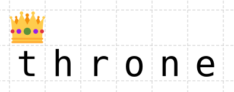

+++
title = "This Month in Rust GameDev #24 - July 2021"
date = 2021-08-01
transparent = true
draft = true
+++

<!-- no toc -->

<!-- Check the post with markdownlint-->

Welcome to the 24th issue of the Rust GameDev Workgroup's
monthly newsletter.
[Rust] is a systems language pursuing the trifecta:
safety, concurrency, and speed.
These goals are well-aligned with game development.
We hope to build an inviting ecosystem for anyone wishing
to use Rust in their development process!
Want to get involved? [Join the Rust GameDev working group!][join]

You can follow the newsletter creation process
by watching [the coordination issues][coordination].
Want something mentioned in the next newsletter?
[Send us a pull request][pr].
Feel free to send PRs about your own projects!

[Rust]: https://rust-lang.org
[join]: https://github.com/rust-gamedev/wg#join-the-fun
[pr]: https://github.com/rust-gamedev/rust-gamedev.github.io
[coordination]: https://github.com/rust-gamedev/rust-gamedev.github.io/issues?q=label%3Acoordination

[Rust]: https://rust-lang.org
[join]: https://github.com/rust-gamedev/wg#join-the-fun

- [Game Updates](#game-updates)
- [Learning Material Updates](#learning-material-updates)
- [Engine Updates](#engine-updates)
- [Tooling Updates](#tooling-updates)
- [Library Updates](#library-updates)
- [Popular Workgroup Issues in Github](#popular-workgroup-issues-in-github)
- [Meeting Minutes](#meeting-minutes)
- [Requests for Contribution](#requests-for-contribution)
- [Jobs](#jobs)
- [Bonus](#bonus)

<!--
Ideal section structure is:

```
### [Title]


_image caption_

A paragraph or two with a summary and [useful links].

_Discussions:
[/r/rust](https://reddit.com/r/rust/todo),
[twitter](https://twitter.com/todo/status/123456)_

[Title]: https://first.link
[useful links]: https://other.link
```

If needed, a section can be split into subsections with a "------" delimiter.
-->

## Game Updates

## Engine Updates

## Learning Material Updates

## Tooling Updates

## Library Updates

### [discord-sdk]

[discord-sdk] is an open source implementation of the [Discord Game SDK] by
[Embark Studios](https://embark.dev).

This month saw the release of the initial [`0.1.0`](https://github.com/EmbarkStudios/discord-sdk/blob/main/CHANGELOG.md#010---2021-07-21)
(and [`0.1.1`](https://github.com/EmbarkStudios/discord-sdk/blob/main/CHANGELOG.md#011---2021-07-28))
version of the crate, which implements initial support for:

- [Activities](https://discord.com/developers/docs/game-sdk/activities)
- [Lobbies](https://discord.com/developers/docs/game-sdk/lobbies)
- [Overlay](https://discord.com/developers/docs/game-sdk/overlay)
- [Relationships](https://discord.com/developers/docs/game-sdk/relationships)
- [Users](https://discord.com/developers/docs/game-sdk/users)
- Application registration (so your game can be launched by Discord)

The API is still rough, but should be in a good enough state to try out!

[discord-sdk]: https://github.com/EmbarkStudios/discord-sdk
[Discord Game SDK]: https://discord.com/developers/docs/game-sdk/sdk-starter-guide

### [Throne]



[Throne] is a new scripting language for game prototyping and story logic. The
language is rule-based, which allows certain types of logic to be expressed more
concisely than using an object-based language, while remaining fast to execute
and easy to embed in an existing engine. Throne can be experimented with in the
web [playground].

[Throne]: https://github.com/t-mw/throne
[playground]: https://t-mw.github.io/throne-playground/

## Popular Workgroup Issues in Github

<!-- Up to 10 links to interesting issues -->

## Meeting Minutes

<!-- Up to 10 most important notes + a link to the full details -->

[See all meeting issues][label_meeting] including full text notes
or [join the next meeting][join].

[label_meeting]: https://github.com/rust-gamedev/wg/issues?q=label%3Ameeting

## Requests for Contribution

<!-- Links to "good first issue"-labels or direct links to specific tasks -->

## Jobs

<!-- An optional section for new jobs related to Rust gamedev -->

## Bonus

<!-- Bonus section to make the newsletter more interesting
and highlight events from the past. -->

------

That's all news for today, thanks for reading!

Want something mentioned in the next newsletter?
[Send us a pull request][pr].

Also, subscribe to [@rust_gamedev on Twitter][@rust_gamedev]
or [/r/rust_gamedev subreddit][/r/rust_gamedev] if you want to receive fresh news!

<!--
TODO: Add real links and un-comment once this post is published
**Discussions of this post**:
[/r/rust](TODO),
[twitter](TODO).
-->

[/r/rust_gamedev]: https://reddit.com/r/rust_gamedev
[@rust_gamedev]: https://twitter.com/rust_gamedev
[pr]: https://github.com/rust-gamedev/rust-gamedev.github.io
