+++
title = "This Month in Rust GameDev #24 - July 2021"
date = 2021-08-08
transparent = true
+++

<!-- no toc -->

<!-- Check the post with markdownlint-->

Welcome to the 24th issue of the Rust GameDev Workgroup's
monthly newsletter.
[Rust] is a systems language pursuing the trifecta:
safety, concurrency, and speed.
These goals are well-aligned with game development.
We hope to build an inviting ecosystem for anyone wishing
to use Rust in their development process!
Want to get involved? [Join the Rust GameDev working group!][join]

You can follow the newsletter creation process
by watching [the coordination issues][coordination].
Want something mentioned in the next newsletter?
[Send us a pull request][pr].
Feel free to send PRs about your own projects!

[Rust]: https://rust-lang.org
[join]: https://github.com/rust-gamedev/wg#join-the-fun
[pr]: https://github.com/rust-gamedev/rust-gamedev.github.io
[coordination]: https://github.com/rust-gamedev/rust-gamedev.github.io/issues?q=label%3Acoordination

[Rust]: https://rust-lang.org
[join]: https://github.com/rust-gamedev/wg#join-the-fun

- [Game Updates](#game-updates)
- [Learning Material Updates](#learning-material-updates)
- [Engine Updates](#engine-updates)
- [Tooling Updates](#tooling-updates)
- [Library Updates](#library-updates)
- [Requests for Contribution](#requests-for-contribution)

<!--
Ideal section structure is:

```
### [Title]


_image caption_

A paragraph or two with a summary and [useful links].

_Discussions:
[/r/rust](https://reddit.com/r/rust/todo),
[twitter](https://twitter.com/todo/status/123456)_

[Title]: https://first.link
[useful links]: https://other.link
```

If needed, a section can be split into subsections with a "------" delimiter.
-->

## Rust GameDev Meetup


The seventh Rust Gamedev Meetup happened in July. You can watch the recording of
the meetup [here on Youtube][gamedev-meetup-video]. The meetups take place on
the second Saturday every month via the [Rust Gamedev Discord
server][rust-gamedev-discord], and are also [streamed on
Twitch][rust-gamedev-twitch]. If you would like to show off what you've been
working on at the next meetup on [August 14th][rust-meetup-august-time], fill
out [this form][gamedev-meetup-form].

[gamedev-meetup-form]: https://forms.gle/BS1zCyZaiUFSUHxe6
[gamedev-meetup-video]: https://www.youtube.com/watch?v=0cefGQyZXH4
[rust-gamedev-discord]: https://discord.gg/yNtPTb2
[rust-gamedev-twitch]: https://twitch.tv/rustgamedevmeetup
[rust-meetup-august-time]: https://everytimezone.com/s/391b6160

## Game Updates

### [Veloren][veloren]

 _Out for a llama ride_

[Veloren][veloren] is an open world, open-source voxel RPG inspired by Dwarf
Fortress and Cube World.

In July, work focused on larger tasks that tend to come up between versions.
Optimizations were made for networking with compression, and message queue
improvements ([devblog #127][veloren-127]). Modular weapons are in the works, which
will allow for much more dynamic ways to choose what you fight with. The project
also hit 300k lines of code.

Many contributors are working on the art and asset front, with lots of new SFX,
models, and UI elements making their way into the game. Caves are also getting a
lot of love, and a bloom feature is being integrated. Some members broke down
what they plan to have done by the 0.11 release at the beginning of September,
and you can read about that in [devblog #130][veloren-130].

July's full weekly devlogs: "This Week In Veloren...":
[#127][veloren-127],
[#128][veloren-128],
[#129][veloren-129],
[#130][veloren-130].

[veloren]: https://veloren.net
[veloren-127]: https://veloren.net/devblog-127
[veloren-128]: https://veloren.net/devblog-128
[veloren-129]: https://veloren.net/devblog-129
[veloren-130]: https://veloren.net/devblog-130

### [Zemeroth]

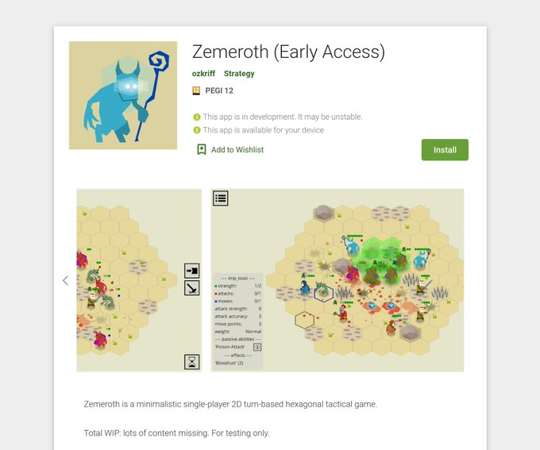

[Zemeroth] is a turn-based hexagonal tactics game, developed by [@ozkriff].

This month, an early access version of the game was released as a free
download on [Google Play][zemeroth-google] - if you have an Android
device, give it a try!

[zemeroth]: https://github.com/ozkriff/zemeroth/
[@ozkriff]: https://twitter.com/ozkriff
[zemeroth-google]: https://play.google.com/store/apps/details?id=rust.zemeroth

### [Harvest Hero Origins](https://store.steampowered.com/app/1651500/Harvest_Hero_Origins/)


Harvest Hero Origins is an arcade wave defense game by [Gemdrop Games][gemdrop],
built in Rust on top of [Emerald]. A [Steam][hho-steam] page has recently been
made and the game is set to release sometime at the end of this summer.

Battle the oncoming waves of enemies with a friend in local co-op, unlock
new playable characters and skins, and make your way to the top of the
leaderboard!

Additionally, HHO will be at [PAXWest](https://west.paxsite.com/)
this year, so come check out their booth
if you'll be there!

[gemdrop]: https://twitter.com/GemdropGames
[hho-steam]: https://store.steampowered.com/app/1651500/Harvest_Hero_Origins/
[Emerald]: https://github.com/Bombfuse/emerald

### [Shroom Kingdom][shroom-kingdom]

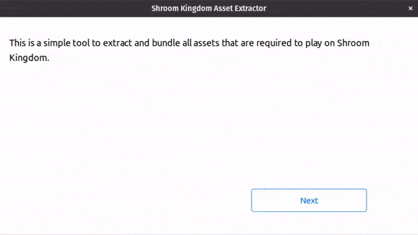
_Extracting the game assets_

Shroom Kingdom ([GitHub][shrm-github], [Discord][shrm-discord], [Twitter][shrm-twitter])
is an upcoming play-to-earn video game built with web technologies
running on the [NEAR Blockchain][near-blockchain].
In a recent [blog post][shrm-blog] you can read the motivation behind this.

You can play with your favorite plumber brothers.
Build your own levels or play levels from others.
Every level built on Shroom Kingdom is stored
on the blockchain as an NFT.

By playing the game you can either actively earn SHRM tokens via participating
in game activities or earn them passively, if other people play or like your levels.
The SHRM token will be used to acquire in-game purchases such as unlocking new
building blocks or increasing level upload limits.

You can either extract existing assets from Super Mario Maker 2 or use
compatible game mod files from e.g. [Gamebanana][gamebanana].
The asset extractor is already working, but support for more file types
needs to be added.

The game will likely be built with [Bevy][bevy]
and [Rapier][rapier] compiled to WebAssembly.
Next steps include developing a Proof of Concept.

[shroom-kingdom]: https://shroomkingdom.net/
[shrm-github]: https://github.com/Shroom-Kingdom
[shrm-discord]: https://discord.gg/SPZsgSe
[shrm-twitter]: https://twitter.com/shrm_kingdom
[shrm-blog]: https://net64-mod.github.io/blog/shroom-kingdom/
[near-blockchain]: https://near.org
[gamebanana]: https://gamebanana.com/
[bevy]: https://bevyengine.org/
[rapier]: https://rapier.rs/

### [Wicked Potions][wicked_potions]

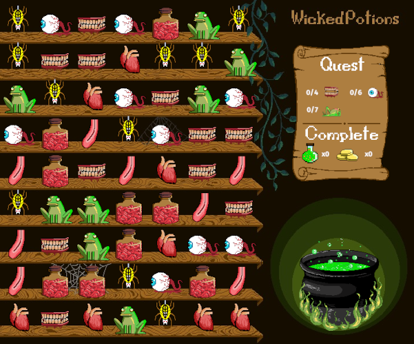
_Match ingredients to brew wicked potions_

[Wicked Potions][wicked_potions] is a match-three game developed by
[@nikl_me] and [jennifervphan] for the [Bored Pixels Jam 8][bored-pixels-jam-8].
They wrote the game using the [Bevy game engine][bevy] and created all of the
textures and audio.

The main focus of the game during the one-week jam period were the assets.
After the voting period, the developers plan to extend the game mechanics
and story a bit more.

[The code for the game is available on GitHub][wicked_potions_repo].

[jennifervphan]: https://itch.io/profile/jennifervphan
[bored-pixels-jam-8]: https://itch.io/jam/bored-pixels-jam-8
[wicked_potions]: https://niklme.itch.io/wicked-potions
[bevy]: https://github.com/bevyengine/bevy
[@nikl_me]: https://twitter.com/nikl_me
[wicked_potions_repo]: https://github.com/NiklasEi/wicked_potions

### [The Process]

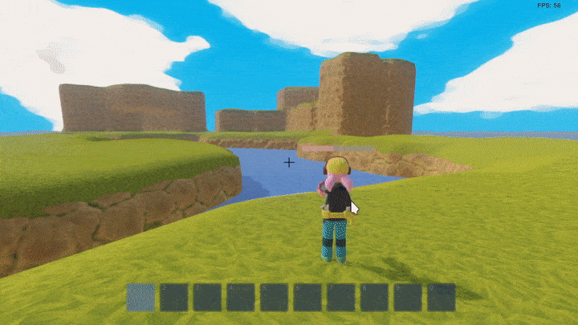
_The godot_egui backend powering a new inventory UI for The Process_

[The Process] by @setzer22 is an upcoming game about factory building,
process management, and carrot production,
built with Rust using the Godot game engine!

Continuing with last month's migration of old GDScript code to ECS in Rust, this
month's main focus has been on porting the GUI code. This has resulted in
the birth of a Godot integration for [egui](https://docs.rs/egui/) that now
powers the game's interface.

This month has seen the following changes and improvements:

- Finished migration of character controller code to ECS style. Now with [300%
  more jumps!](https://twitter.com/PlayTheProcess/status/1413081233396011012)
- Implemented [better ambient
  lighting](https://twitter.com/PlayTheProcess/status/1413943539160031246) and
  enable using different skies for radiance and display. This required a [forked
  godot version](https://github.com/setzer22/godot/tree/feature/cosmetic_sky).
- Implement a [new inventory and
  toolbar](https://twitter.com/PlayTheProcess/status/1417774452012724226)
  interface using egui.
- Integrated the [puffin
  profiler](https://twitter.com/PlayTheProcess/status/1420277428199559174) into
  the game using the godot_egui integration.

[The Process]: https://twitter.com/PlayTheProcess

### [Robo Instructus: 2 Years Old][robo-year]

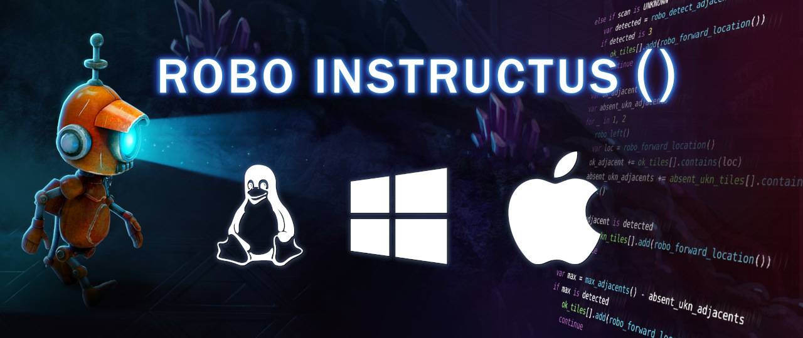

Two years ago [Alex Butler] released the "[Robo Instructus][robo-site]" puzzle game
on [Steam][robo-steam] & [itch.io][robo-itch].

This month Alex released a devlog post ["Robo Instructus: 2 Years Old"][robo-year]
about how well the game did in the last year:
Sales by platform/country/OS, player feedback & reviews, etc.

The game also continues to receive updates, the latest [1.33 version][robo-1-33]
includes full 简体中文 & Español language support.

[Alex Butler]: https://twitter.com/bigabgames
[robo-site]: https://www.roboinstruct.us
[robo-steam]: https://store.steampowered.com/app/1032170/Robo_Instructus
[robo-itch]: https://bigabgames.itch.io/robo-instructus
[robo-year]: https://blog.roboinstruct.us/2021/07/16/2-years-later.html
[robo-1-33]: https://store.steampowered.com/news/app/1032170/view/2998819983294763294

### [Fish Fight][fish-fight]

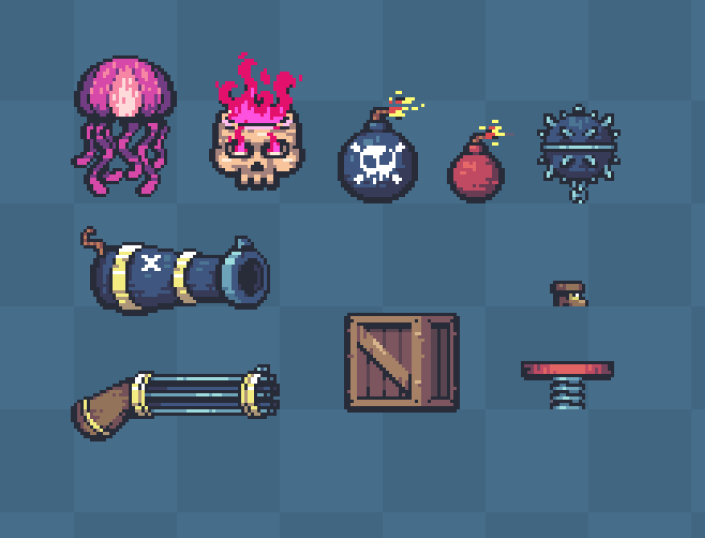

Fish Fight ([Twitter][fish-fight]) is a continuation of the demo project
known as Fish Game - made by the same team of people ([@fedor_games] and
[@erlend_sh]), now operating as independents. Their goal is to make a
published game, written entirely in Rust and developed as openly as
possible. They are hoping to go public with the open source repo
within a month or so.

Changes and improvements from the last month:

- [Pre-alpha trailer released!][twitter-trailer]
- Loads of new weapons added:
  - Mind-controlled Jellyfish
  - Kick-bombs (bomberman-style)
  - Cursed Skull
  - Handcannon
  - Gatling gun
  - Sproingers
  - Pirate Boots
  - ..and more!
- Whole new Environmentals system added for map-wide events (mass-shark attack
  incoming!)
- Physics doc & improvements

[fish-fight]: https://twitter.com/fishfightgame
[@fedor_games]: https://twitter.com/fedor_games
[@erlend_sh]: https://twitter.com/erlend_sh
[twitter-trailer]: https://twitter.com/fishfightgame/status/1424084016467226624

### [Theta Wave]

[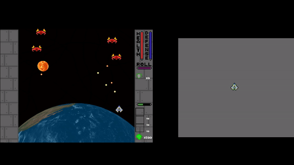][Bevy Theta Wave]
_Left: Theta Wave with Amethyst, Right: Theta Wave with Bevy (so far)_

[Theta Wave] is an open-source space shooter game by developers [@micah_tigley] and
[@carlosupina]. It is one of the showcase games for the [Amethyst Engine]. In
the past month, they finished the ["Organization"] update and
made the decision to start working on porting the game to the Bevy engine. You can
find the Bevy version of Theta Wave [here][Bevy Theta Wave].

Progress on this port is going strong - you can find the GitHub issue for
the port [here][Bevy Port Issue].

[Bevy Port Issue]: https://github.com/thetawavegame/thetawave/issues/2
[Bevy Theta Wave]: https://github.com/thetawavegame/thetawave
[Theta Wave]: https://github.com/amethyst/theta-wave
[@micah_tigley]: https://twitter.com/micah_tigley
[@carlosupina]: https://twitter.com/carlosupina
[Amethyst Engine]: https://amethyst.rs/
["Organization"]: https://github.com/amethyst/theta-wave/projects/5

### [Bounty Bros.][bounty_bros]

[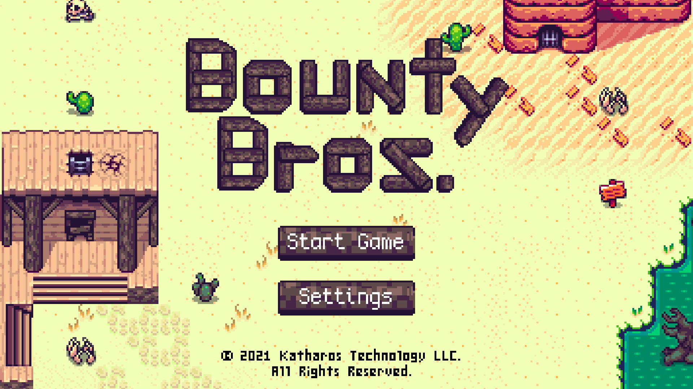][bounty_bros_webgame]
_Click the image to play the game in your browser!_

[Bounty Bros.][bounty_bros] is a prototype, top-down adventure game, developed
by [Katharos Technology][katharostech] as a testing ground for a future
commercial game.

The last two months of development added lots of new features:

- Integrated a new physics system and character controller that allows for smoother
  character movement.
- Added a new damage system and made cactuses hurt the player.
- Added a life bar and a game over screen.
- Added a pause menu and a fullscreen button.
- Started work on enemy pathfinding.

All the new features can be tested in the latest [web demo][bounty_bros_webgame],
and the [blog post][bounty_bros] has the full details of what's new and what's
coming next!

[bounty_bros]: https://katharostech.com/post/bounty-bros-update-4-physics-damage-pathfinding
[bounty_bros_webgame]: https://katharostech.github.io/skipngo_pre-releases/refs/tags/pre-release-2/?asset_url=https://katharostech.github.io/bounty-bros_pre-releases/2
[katharostech]: https://katharostech.com

### [Flesh]


[Flesh] is a 2D horizontal SHMUP by [@Im_Oab], with a hand-drawn animation style
and an organic/fleshy theme.

This month, a [Steam page][flesh] was published for the game - it can now be
wishlisted, ahead of a planned release later this year!

[Flesh]: https://store.steampowered.com/app/1660850/Flesh/
[@Im_Oab]: https://twitter.com/Im_Oab/

## Engine Updates

### [ggez]


`ggez` 0.6 has been released!  `ggez` is a lightweight cross-platform
game framework for making 2D games with minimum friction, with an API
inspired by Love2D.

This release includes many additions, improvements, and bug fixes,
including a `MeshBatch` type for drawing many instances of the same
geometry, improvements to canvas drawing, updated `winit` dependencies
that function more smoothly on Linux under Wayland, better error
handling, and more.  The whole changelog is available
[here](https://github.com/ggez/ggez/blob/0.6.0/CHANGELOG.md).

More importantly, `ggez` is now maintained by a group of volunteers,
with the original maintainer stepping down from active development after
over four years.  The new maintainers are mostly responsible for the 0.6
release, and will hopefully be bringing good ideas and tech to the
library for years to come.  For details, see [this github
issue](https://github.com/ggez/ggez/issues/875).

[ggez]: https://github.com/ggez

### [Macroquad]

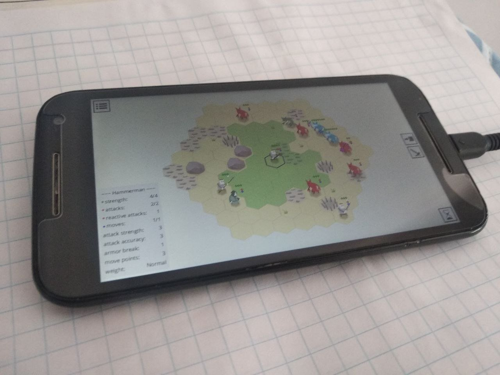
_A Macroquad game ([Zemeroth](#zemeroth)) running on Android!_

[Macroquad] is a cross-platform game framework, inspired heavily by Raylib.

This month, a [new tutorial][macroquad-android] was published on the
Macroquad website, showing how a game written with the framework can be
ported to Android. It details all of the steps, from building to packaging
for a release on Google Play.

In other news, Macroquad used to depend on rodio+cpal for audio on
native platforms and a custom WebAudio implementation for web, with a custom
abstraction on top of both. This month, Macroquad's audio system was
reimplemented on top of raw OS APIs - ALSA, OpenSLES, CoreAudio and WASAPI.
This functionality has now been extracted into a crate: [quad-snd].

[macroquad]: https://github.com/not-fl3/macroquad
[macroquad-android]: https://macroquad.rs/tutorials/android/
[quad-snd]: https://github.com/not-fl3/quad-snd

### [Emerald]


[Emerald] is a 2D portable game engine aiming to export to every
possible target: Windows, Linux, macOS, Android, iOS, Xbox,
Playstation, Nintendo Switch.

In addition to being portable, [Emerald] aims to be easy to use
while providing quality features like built-in physics and
Aseprite integration.

If any of this sounds good to you, and you'd like to be a part of it,
[Emerald] welcomes all contributors to help make an extremely portable
game engine! Join them on their [Discord server][emerald-discord].

[Emerald]: https://github.com/Bombfuse/emerald
[emerald-discord]: https://discord.gg/NHsz38AhkD

### [Starframe]

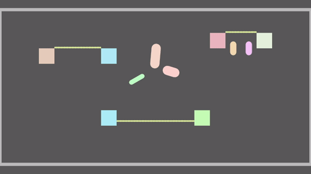

[Starframe] by [@moletrooper] is a work-in-progress game engine for physics-y
sidescrolling 2D games.

This month's noteworthy development was [particle-based ropes][sf-ropes-tweet]
capable of full two-way coupling with rigid bodies, demonstrated above.
Capsule-shaped colliders were also added.

[starframe]: https://github.com/MoleTrooper/starframe/
[@moletrooper]: https://twitter.com/moletrooper
[sf-ropes-tweet]: https://twitter.com/moletrooper/status/1421204030441889792

## Learning Material Updates

### [Hands-on Rust][hands-on-rust]

[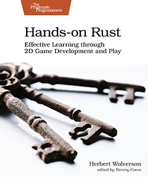][hands-on-rust]

["Hands-on Rust: Effective Learning through 2D Game Development and Play"][hands-on-rust]
by Herbert Wolverson is now in print, as a full color paperback and ebook.
The book teaches Rust through game development examples, and is targeted at
readers who have some experience with writing code in other languages. It
teaches beginner to intermediate-level Rust. Hands-on Rust also teaches
high-level game development concepts, notably Entity-Component System (ECS)
theory.

After walking you through installing Rust, a few simple examples teach the
language basics. Then you put these together to make "Flappy Dragon" - a
simple Flappy Bird clone. The book then changes gear and begins to build a
dungeon crawler (roguelike) with tile graphics.

Outside of the USA, Hands-on Rust is available through [Amazon][hands-on-amazon].

Herbert also published the first ["Hands-on Rust bonus content"][hands-on-flappy].
The bonus content extends Flappy Dragon to include smooth movement and
animated sprites.

[hands-on-rust]: https://pragprog.com/titles/hwrust/hands-on-rust/
[hands-on-amazon]: https://www.amazon.com/dp/1680508164
[hands-on-flappy]: https://medium.com/pragmatic-programmers/flappy-dragon-rust-647e91a34dd4

### [Writing an RPG using rg3d][writing-an-rpg-using-rg3d]

[][rg3d-video]
_[Click here][rg3d-video] to see a video of the character controller in action!_

Dimitry Stepanov (aka @mrDIMAS) published a
[tutorial series][writing-an-rpg-using-rg3d] about
making an RPG in Rust using the rg3d game engine. In part one of the series,
he builds a character controller from scratch. While that may not sound very exciting,
it's still a great way to learn the basics of rg3d and Rust gamedev in general!

[writing-an-rpg-using-rg3d]: https://rg3d.rs/tutorials/2021/07/09/rpg-tutorial1.html
[rg3d-video]: https://www.youtube.com/watch?v=l2ZbDpoIdqk

## Tooling Updates

### [Graphite][graphite-repo]


_A recreation of "The Scream" in Graphite by Norgate_

Graphite ([GitHub][graphite-repo], [Discord][graphite-discord],
[Twitter](https://twitter.com/GraphiteEditor)) is an in-development vector and
raster graphics editor built on a non-destructive node-based workflow.

In the past month, the editor has gained numerous vector editing features,
including moving layers with the keyboard or mouse, filling and copying colors,
flipping and aligning selected layers, and setting blend modes and layer
opacity.

Scrollbars, rulers, and thumbnails are now functional. Full screen support has
been added, along with a hotkey to center the artwork. An options bar with
tool-specific settings and actions has been implemented, currently allowing
the number of sides of a polygon to be selected. The order of layers can now be
changed using hotkeys.

[Try it right now in your browser.][graphite-live-demo] Graphite is making
rapid progress towards becoming a non-destructive, procedural graphics editor
suitable of replacing traditional 2D DCC applications. The release of Graphite
0.1 is anticipated in the coming month; come
[join the Discord][graphite-discord] to help make it happen!

[graphite-repo]: https://github.com/GraphiteEditor/Graphite
[graphite-discord]: https://discord.graphite.design
[graphite-twitter]: https://twitter.com/GraphiteEditor
[graphite-live-demo]: https://editor.graphite.design

## Library Updates

### [discord-sdk]

[discord-sdk] is an open source implementation of the [Discord Game SDK] by
[Embark Studios](https://embark.dev).

This month saw the release of the initial [`0.1.0`](https://github.com/EmbarkStudios/discord-sdk/blob/main/CHANGELOG.md#010---2021-07-21)
(and [`0.1.1`](https://github.com/EmbarkStudios/discord-sdk/blob/main/CHANGELOG.md#011---2021-07-28))
version of the crate, which implements initial support for:

- [Activities](https://discord.com/developers/docs/game-sdk/activities)
- [Lobbies](https://discord.com/developers/docs/game-sdk/lobbies)
- [Overlay](https://discord.com/developers/docs/game-sdk/overlay)
- [Relationships](https://discord.com/developers/docs/game-sdk/relationships)
- [Users](https://discord.com/developers/docs/game-sdk/users)
- Application registration (so your game can be launched by Discord)

The API is still rough, but should be in a good enough state to try out!

[discord-sdk]: https://github.com/EmbarkStudios/discord-sdk
[Discord Game SDK]: https://discord.com/developers/docs/game-sdk/sdk-starter-guide

### [rkyv]

[rkyv] is a zero-copy deserialization framework for Rust. It's an alternative
to serde that makes it easy to quickly and safely load data into memory.

This month, rkyv 0.7 was released with many new features:

- [Endian-agnostic serialization][rkyv_rend]
- [Greatly improved performance][rust_serde_bench]
- Enhanced `no_std` support
- [Wrapper types][rkyv_wrapper_types]
- [A new `BTreeMap` implementation][rkyv_btree_map]
- Reduced dependencies
- Support for some common external crates

The full changelog can be found on the [release page][rkyv_0.7].

[rkyv]: https://github.com/rkyv/rkyv
[rkyv_rend]: https://github.com/rkyv/rend
[rust_serde_bench]: https://github.com/djkoloski/rust_serialization_benchmark
[rkyv_wrapper_types]: https://docs.rs/rkyv/0.7.4/rkyv/with/index.html
[rkyv_btree_map]: https://docs.rs/rkyv/0.7.4/rkyv/collections/btree_map/index.html
[rkyv_0.7]: https://github.com/rkyv/rkyv/releases/tag/v0.7.0

### [Throne]


[Throne] is a new scripting language for game prototyping and story logic. The
language is rule-based, which allows certain types of logic to be expressed more
concisely than using an object-based language, while remaining fast to execute
and easy to embed in an existing engine. Throne can be experimented with in the
web [playground].

[Throne]: https://github.com/t-mw/throne
[playground]: https://t-mw.github.io/throne-playground/

### [godot_egui]


[godot_egui] is an integration of the [egui](https://github.com/emilk/egui)
crate for the Godot engine using Rust, enabling highly dynamic and performant
user interfaces in an immediate-mode style in Godot.

Godot has a great GUI system, so why use `godot_egui` instead? A more in-depth
rationale can be found in the crate's README, but the main reason is to provide
a GUI system for godot-rust games that is closer to Rust's data driven
philosophy.

Unlike other egui integrations, `godot_egui` has the special feature of being
embedded as a custom Godot scene tree node. This effectively allows combining
Godot's retained mode UI and container-based placement with the simplicity of
immediate-mode style GUI code of `egui`, getting the best of both worlds.

The [github repository](https://github.com/setzer22/godot-egui) has an example
project and usage instructions to get you started with immediate-mode GUI
programming with Godot and Rust!

[godot_egui]: https://docs.rs/godot_egui/

### [wgpu]

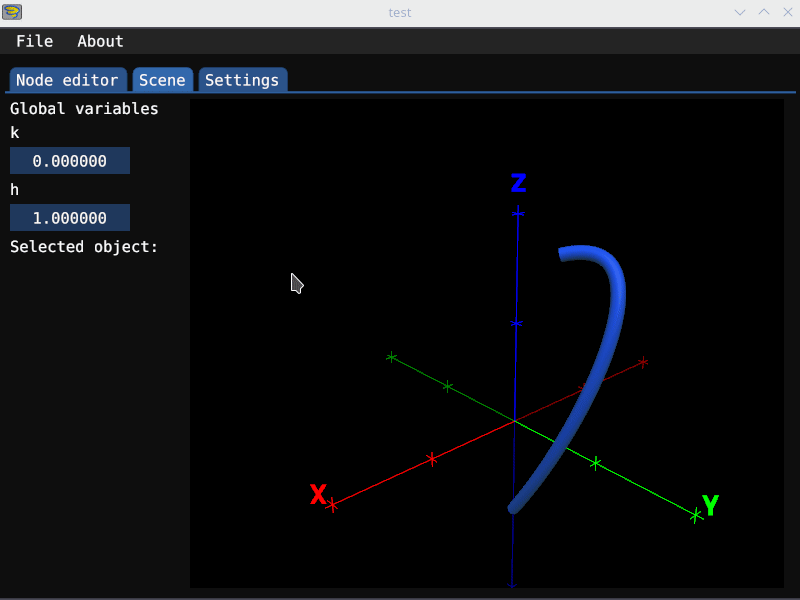

Following the [Family Reunion] initiative, [wgpu] team has been busy rebuilding
the graphics infrastructure. The new D3D12 backend has been merged, which
concludes the trip of moving (or rewriting?) all of the implementation into
Rust. In addition to a "lean and mean" implementation of the host API side,
which turned out to match the WebGPU API very well, the new backend works with
[naga] exclusively for generation of HLSL shaders.
This is in contrast with gfx-backend-dx12, which only supported SPIRV-Cross.

The team also wrote the blog post [Release of v0.9 and the Future of wgpu].
One of the interesting bits is `gfx` repository switching to
maintenance mode.

Last but not the least, Francesco Cattoglio described their adventure
with rewriting [Franzplot] on a new blog hosted by the wgpu team. This blog will
accumulate stories of wgpu users and their interesting projects.

[wgpu]: https://github.com/gfx-rs/wgpu
[naga]: https://github.com/gfx-rs/naga
[Family Reunion]: https://gamedev.rs/news/023/#wgpu-family-re-union
[Release of v0.9 and the Future of wgpu]: https://gfx-rs.github.io/2021/07/16/release-0.9-future.html
[Franzplot]: https://gfx-rs.github.io/stories/franzplot.html

### [GGRS]


[GGRS] by [@g_schup] is a reimagination of the [GGPO] P2P rollback network SDK
written in 100% safe Rust.

The freshly released version 0.4 comes with tons of fixes for P2P sessions with
up to four players and any number of spectators. More importantly, the repository
now features a [tutorial] and full game [examples] for every type of session.

[GGRS]: https://github.com/gschup/ggrs
[GGPO]: https://www.ggpo.net/
[@g_schup]: https://twitter.com/g_schup
[tutorial]: https://gschup.github.io/ggrs/docs/getting-started/quick-start/
[examples]: https://github.com/gschup/ggrs/tree/main/examples

### [Bevy Retrograde][bevy_retrograde]

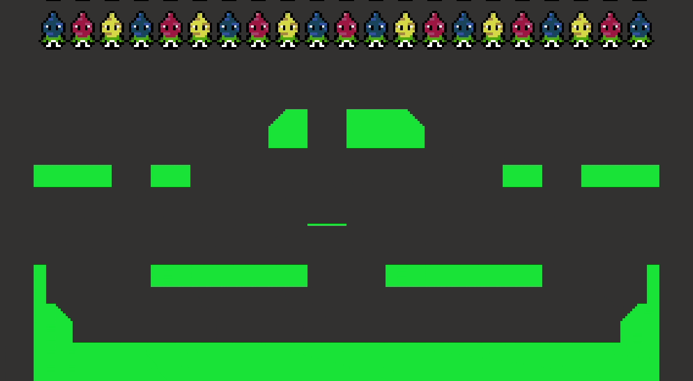
_Bevy Retrograde Physics Map example_

[Bevy Retrograde][bevy_retrograde] (formerly Bevy Retro) is a [Bevy] plugin
designed for making pixel-perfect games as easily as possible.

This project was released under the [Katharos License][katharos_license]. This
license has moral and ethical implications that you may or may not agree with,
so please read it before making use of this project.

In the last two months, Bevy Retrograde has gotten a major update and is also on
crates.io for the first time!

- The transform system was migrated to use Bevy's own transform system.
- The pixel-perfect alignment restriction can now be optionally disabled on a
  per-sprite basis. This makes it possible to do smooth character and projectile
  movement if desired.
- The [Heron] physics engine ( which is powered by Rapier ) was integrated, with
  a custom extension for automatically creating collision shapes from sprite
  outlines.
- It was decided to start work on migrating Bevy Retrograde to use Bevy's own
  rendering abstraction, making it compatible with the larger Bevy rendering
  ecosystem. This will hopefully be finished in the next release.

More information can be found in the Bevy Retrograde
[release notes][bevy_retrograde_release_notes].

You can ask questions or give feedback for Bevy Retrograde
[on GitHub][bevy_retrograde_discussions].

[Heron]: https://github.com/jcornaz/heron
[bounty_bros_blog_post]: https://katharostech.com/post/bounty-bros-update-4-physics-damage-pathfinding
[bevy_retrograde_release_notes]: https://github.com/katharostech/bevy_retrograde/releases/tag/v0.2.0
[bevy_retrograde]: https://github.com/katharostech/bevy_retro
[Bevy]: https://bevyengine.org
[katharos_license]: https://github.com/katharostech/katharos-license
[bevy_retrograde_discussions]: https://github.com/katharostech/bevy_retro/discussions

### [Quilkin]


[Quilkin] is a non-transparent UDP proxy specifically designed for use with
large scale multiplayer dedicated game server deployments, to ensure security,
access control, telemetry data, metrics and more.

This month saw the initial
[0.1.0](https://github.com/googleforgames/quilkin/releases/tag/v0.1.0)
release of the project, as well as announcement blog posts from project
co-founders [Embark Studios] and [Google Cloud]:

- [Embark Studios: Say hi to Quilkin, an open-source UDP proxy][embark-announce]
- [Google Cloud: Introducing Quilkin: open-source UDP proxies built for game server communication][gcp-announce]

Quilkin is being actively developed and would love contributors and feedback.
Please join the [Discord](https://discord.gg/mfBNZjBDnc),
[mailing list](https://groups.google.com/forum/#!forum/quilkin-discuss) or
follow the project on [Twitter](https://twitter.com/quilkindev).

[Quilkin]: https://github.com/googleforgames/quilkin
[Google Cloud]: http://cloud.google.com/gaming
[Embark Studios]:(https://embark.dev)
[embark-announce]: https://medium.com/embarkstudios/say-hi-to-quilkin-an-open-source-udp-proxy-88577c795204
[gcp-announce]: https://cloud.google.com/blog/products/gaming/introducing-quilkin

### [bevy_asset_loader]

[@nikl_me] wrote a [blog post][asset_handling_post] about creating
[bevy_asset_loader], a plugin to simplify asset handling in [Bevy][bevy]
applications. The post outlines how bevy_asset_loader can be used and
discusses future improvements to the crate.

[asset_handling_post]: https://www.nikl.me/blog/2021/asset-handling-in-bevy-apps/
[bevy_asset_loader]: https://github.com/NiklasEi/bevy_asset_loader
[bevy]: https://github.com/bevyengine/bevy
[@nikl_me]: https://twitter.com/nikl_me

## Requests for Contribution

<!-- Links to "good first issue"-labels or direct links to specific tasks -->

- [winit's "difficulty: easy" issues][winit-issues].
- [Backroll-rs, a new networking library][backroll-rs].
- [Embark's open issues][embark-open-issues] ([embark.rs]).
- [wgpu's "help wanted" issues][wgpu-issues].
- [luminance's "low hanging fruit" issues][luminance-fruits].
- [ggez's "good first issue" issues][ggez-issues].
- [Veloren's "beginner" issues][veloren-beginner].
- [Amethyst's "good first issue" issues][amethyst-issues].
- [A/B Street's "good first issue" issues][abstreet-issues].
- [Mun's "good first issue" issues][mun-issues].
- [SIMple Mechanic's good first issues][simm-issues].
- [Bevy's "good first issue" issues][bevy-issues].

[winit-issues]: https://github.com/rust-windowing/winit/issues?q=is%3Aopen+is%3Aissue+label%3A%22difficulty%3A+easy%22
[backroll-rs]: https://github.com/HouraiTeahouse/backroll-rs/issues
[embark.rs]: https://embark.rs
[embark-open-issues]: https://github.com/search?q=user:EmbarkStudios+state:open
[wgpu-issues]: https://github.com/gfx-rs/wgpu/issues?q=is%3Aissue+is%3Aopen+label%3A%22help+wanted%22
[luminance-fruits]: https://github.com/phaazon/luminance-rs/issues?q=is%3Aissue+is%3Aopen+label%3A%22low+hanging+fruit%22
[ggez-issues]: https://github.com/ggez/ggez/labels/%2AGOOD%20FIRST%20ISSUE%2A
[veloren-beginner]: https://gitlab.com/veloren/veloren/issues?label_name=beginner
[amethyst-issues]: https://github.com/amethyst/amethyst/issues?q=is%3Aissue+is%3Aopen+label%3A%22good+first+issue%22
[abstreet-issues]: https://github.com/a-b-street/abstreet/issues?q=is%3Aissue+is%3Aopen+label%3A%22good+first+issue%22
[mun-issues]: https://github.com/mun-lang/mun/labels/good%20first%20issue
[simm-issues]: https://github.com/mkhan45/SIMple-Mechanics/labels/good%20first%20issue
[bevy-issues]: https://github.com/bevyengine/bevy/labels/E-Good-First-Issue

------

That's all news for today, thanks for reading!

Want something mentioned in the next newsletter?
[Send us a pull request][pr].

Also, subscribe to [@rust_gamedev on Twitter][@rust_gamedev]
or [/r/rust_gamedev subreddit][/r/rust_gamedev] if you want to receive fresh news!

<!--
TODO: Add real links and un-comment once this post is published
-->
**Discussions of this post**:
[/r/rust_gamedev](https://www.reddit.com/r/rust_gamedev/comments/p0hgsy/this_month_in_rust_gamedev_24_july_2021/),
[Twitter](https://twitter.com/rust_gamedev/status/1424398304700420102),
[Discord](https://discord.gg/yNtPTb2).

[/r/rust_gamedev]: https://reddit.com/r/rust_gamedev
[@rust_gamedev]: https://twitter.com/rust_gamedev
[pr]: https://github.com/rust-gamedev/rust-gamedev.github.io
