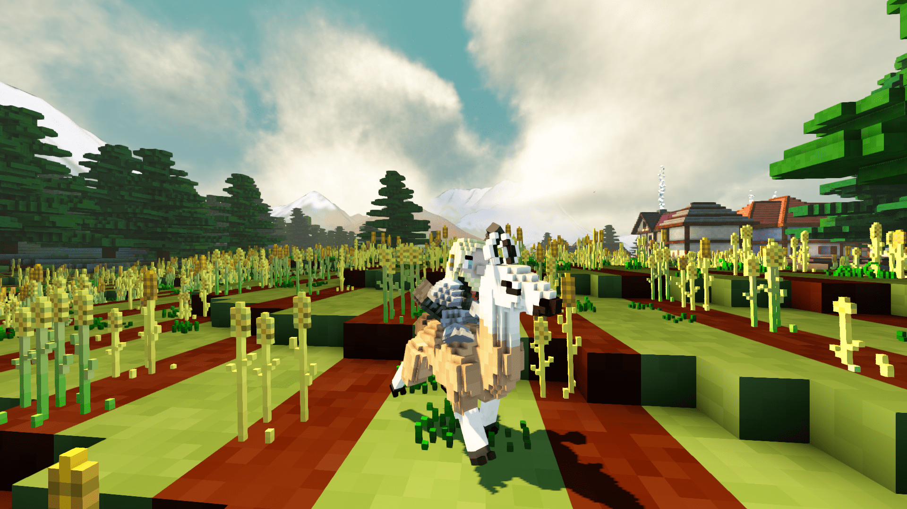
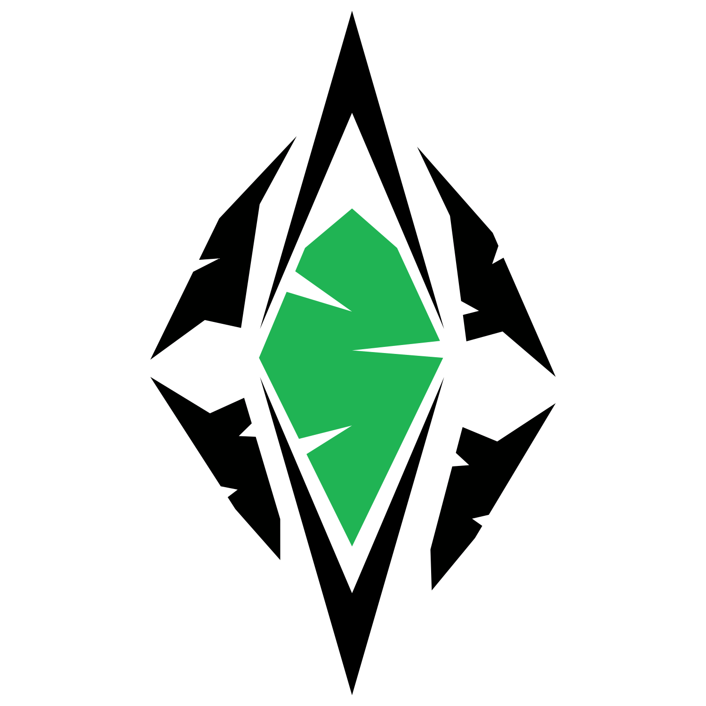

+++
title = "This Month in Rust GameDev #24 - July 2021"
date = 2021-08-01
transparent = true
draft = true
+++

<!-- no toc -->

<!-- Check the post with markdownlint-->

Welcome to the 24th issue of the Rust GameDev Workgroup's
monthly newsletter.
[Rust] is a systems language pursuing the trifecta:
safety, concurrency, and speed.
These goals are well-aligned with game development.
We hope to build an inviting ecosystem for anyone wishing
to use Rust in their development process!
Want to get involved? [Join the Rust GameDev working group!][join]

You can follow the newsletter creation process
by watching [the coordination issues][coordination].
Want something mentioned in the next newsletter?
[Send us a pull request][pr].
Feel free to send PRs about your own projects!

[Rust]: https://rust-lang.org
[join]: https://github.com/rust-gamedev/wg#join-the-fun
[pr]: https://github.com/rust-gamedev/rust-gamedev.github.io
[coordination]: https://github.com/rust-gamedev/rust-gamedev.github.io/issues?q=label%3Acoordination

[Rust]: https://rust-lang.org
[join]: https://github.com/rust-gamedev/wg#join-the-fun

- [Game Updates](#game-updates)
- [Learning Material Updates](#learning-material-updates)
- [Engine Updates](#engine-updates)
- [Tooling Updates](#tooling-updates)
- [Library Updates](#library-updates)
- [Popular Workgroup Issues in Github](#popular-workgroup-issues-in-github)
- [Meeting Minutes](#meeting-minutes)
- [Requests for Contribution](#requests-for-contribution)
- [Jobs](#jobs)
- [Bonus](#bonus)

<!--
Ideal section structure is:

```
### [Title]


_image caption_

A paragraph or two with a summary and [useful links].

_Discussions:
[/r/rust](https://reddit.com/r/rust/todo),
[twitter](https://twitter.com/todo/status/123456)_

[Title]: https://first.link
[useful links]: https://other.link
```

If needed, a section can be split into subsections with a "------" delimiter.
-->

## Game Updates

### [Veloren][veloren]

 _Out for a llama ride_

[Veloren][veloren] is an open world, open-source voxel RPG inspired by Dwarf
Fortress and Cube World.

In July, work focused on larger tasks that tend to come up between versions.
Optimizations were made for networking with compression, and message queue
improvements ([devblog #127][veloren-127]). Modular weapons are in the works, which
will allow for much more dynamic ways to choose what you fight with. The project
also hit 300k lines of code.

Many contributors are working on the art and asset front, with lots of new SFX,
models, and UI elements making their way into the game. Caves are also getting a
lot of love, and a bloom feature is being integrated. Some members broke down
what they plan to have done by the 0.11 release at the beginning of September,
and you can read about that in [devblog #130][veloren-130].

July's full weekly devlogs: "This Week In Veloren...":
[#127][veloren-127],
[#128][veloren-128],
[#129][veloren-129],
[#130][veloren-130].

[veloren]: https://veloren.net
[veloren-127]: https://veloren.net/devblog-127
[veloren-128]: https://veloren.net/devblog-128
[veloren-129]: https://veloren.net/devblog-129
[veloren-130]: https://veloren.net/devblog-130

### [Harvest Hero Origins](https://store.steampowered.com/app/1651500/Harvest_Hero_Origins/)


Harvest Hero Origins is an arcade wave defense game by [Gemdrop Games][gemdrop],
built in Rust on top of [Emerald]. A [Steam][hho-steam] page has recently been
made and the game is set to release sometime at the end of this summer.

Battle the oncoming waves of enemies with a friend in local co-op, unlock
new playable characters and skins, and make your way to the top of the
leaderboard!

Additionally, HHO will be at [PAXWest](https://west.paxsite.com/)
this year, so come check out their booth
if you'll be there!

[gemdrop]: https://twitter.com/GemdropGames
[hho-steam]: https://store.steampowered.com/app/1651500/Harvest_Hero_Origins/
[Emerald]: https://github.com/Bombfuse/emerald

### [Wicked Potions][wicked_potions]


_Match ingredients to brew wicked potions_

[Wicked Potions][wicked_potions] is a match-three game developed by
[@nikl_me] and [jennifervphan] for the [Bored Pixels Jam 8][bored-pixels-jam-8].
They wrote the game using the [Bevy game engine][bevy] and created all of the
textures and audio.

The main focus of the game during the one-week jam period were the assets.
After the voting period, the developers plan to extend the game mechanics
and story a bit more.

[The code for the game is available on GitHub][wicked_potions_repo].

[jennifervphan]: https://itch.io/profile/jennifervphan
[bored-pixels-jam-8]: https://itch.io/jam/bored-pixels-jam-8
[wicked_potions]: https://niklme.itch.io/wicked-potions
[bevy]: https://github.com/bevyengine/bevy
[@nikl_me]: https://twitter.com/nikl_me
[wicked_potions_repo]: https://github.com/NiklasEi/wicked_potions

## Engine Updates

### [Emerald]



[Emerald] is a 2D portable game engine aiming to export to every
possible target: Windows, Linux, macOS, Android, iOS, Xbox,
Playstation, Nintendo Switch.

In addition to being portable, [Emerald] aims to be easy to use
while providing quality features like built-in physics and
Aseprite integration.

If any of this sounds good to you, and you'd like to be a part of it,
[Emerald] welcomes all contributors to help make an extremely portable
game engine! Join them on their [Discord server][emerald-discord].

[Emerald]: https://github.com/Bombfuse/emerald
[emerald-discord]: https://discord.gg/NHsz38AhkD

## Learning Material Updates

## Tooling Updates

## Library Updates

### [discord-sdk]

[discord-sdk] is an open source implementation of the [Discord Game SDK] by
[Embark Studios](https://embark.dev).

This month saw the release of the initial [`0.1.0`](https://github.com/EmbarkStudios/discord-sdk/blob/main/CHANGELOG.md#010---2021-07-21)
(and [`0.1.1`](https://github.com/EmbarkStudios/discord-sdk/blob/main/CHANGELOG.md#011---2021-07-28))
version of the crate, which implements initial support for:

- [Activities](https://discord.com/developers/docs/game-sdk/activities)
- [Lobbies](https://discord.com/developers/docs/game-sdk/lobbies)
- [Overlay](https://discord.com/developers/docs/game-sdk/overlay)
- [Relationships](https://discord.com/developers/docs/game-sdk/relationships)
- [Users](https://discord.com/developers/docs/game-sdk/users)
- Application registration (so your game can be launched by Discord)

The API is still rough, but should be in a good enough state to try out!

[discord-sdk]: https://github.com/EmbarkStudios/discord-sdk
[Discord Game SDK]: https://discord.com/developers/docs/game-sdk/sdk-starter-guide

### [Throne]


[Throne] is a new scripting language for game prototyping and story logic. The
language is rule-based, which allows certain types of logic to be expressed more
concisely than using an object-based language, while remaining fast to execute
and easy to embed in an existing engine. Throne can be experimented with in the
web [playground].

[Throne]: https://github.com/t-mw/throne
[playground]: https://t-mw.github.io/throne-playground/

### [wgpu]


Following the [Family Reunion] initiative, [wgpu] team has been busy rebuilding
the graphics infrastructure. The new D3D12 backend has been merged, which
concludes the trip of moving (or rewriting?) all of the implementation into
Rust. In addition to a "lean and mean" implementation of the host API side,
which turned out to match the WebGPU API very well, the new backend works with
[naga] exclusively for generation of HLSL shaders.
This is in contrast with gfx-backend-dx12, which only supported SPIRV-Cross.

The team wrote the blog post [Release of v0.9 and the Future of wgpu].
One of the interesting bits is `gfx` repository switching to
maintenance mode.

The last but not the least, Francesco Cattoglio described their adventure
with rewriting [Franzplot] on a new blog hosted by wgpu team. This blog will
accumulate stories of wgpu users and their interesting projects.

[wgpu]: https://github.com/gfx-rs/wgpu
[naga]: https://github.com/gfx-rs/naga
[Family Reunion]: https://gamedev.rs/news/023/#wgpu-family-re-union
[Release of v0.9 and the Future of wgpu]: https://gfx-rs.github.io/2021/07/16/release-0.9-future.html
[Franzplot]: https://gfx-rs.github.io/stories/franzplot.html

## Popular Workgroup Issues in Github

<!-- Up to 10 links to interesting issues -->

## Meeting Minutes

<!-- Up to 10 most important notes + a link to the full details -->

[See all meeting issues][label_meeting] including full text notes
or [join the next meeting][join].

[label_meeting]: https://github.com/rust-gamedev/wg/issues?q=label%3Ameeting

## Requests for Contribution

<!-- Links to "good first issue"-labels or direct links to specific tasks -->

## Jobs

<!-- An optional section for new jobs related to Rust gamedev -->

## Bonus

<!-- Bonus section to make the newsletter more interesting
and highlight events from the past. -->

------

That's all news for today, thanks for reading!

Want something mentioned in the next newsletter?
[Send us a pull request][pr].

Also, subscribe to [@rust_gamedev on Twitter][@rust_gamedev]
or [/r/rust_gamedev subreddit][/r/rust_gamedev] if you want to receive fresh news!

<!--
TODO: Add real links and un-comment once this post is published
**Discussions of this post**:
[/r/rust](TODO),
[twitter](TODO).
-->

[/r/rust_gamedev]: https://reddit.com/r/rust_gamedev
[@rust_gamedev]: https://twitter.com/rust_gamedev
[pr]: https://github.com/rust-gamedev/rust-gamedev.github.io
