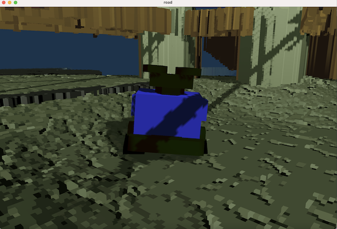
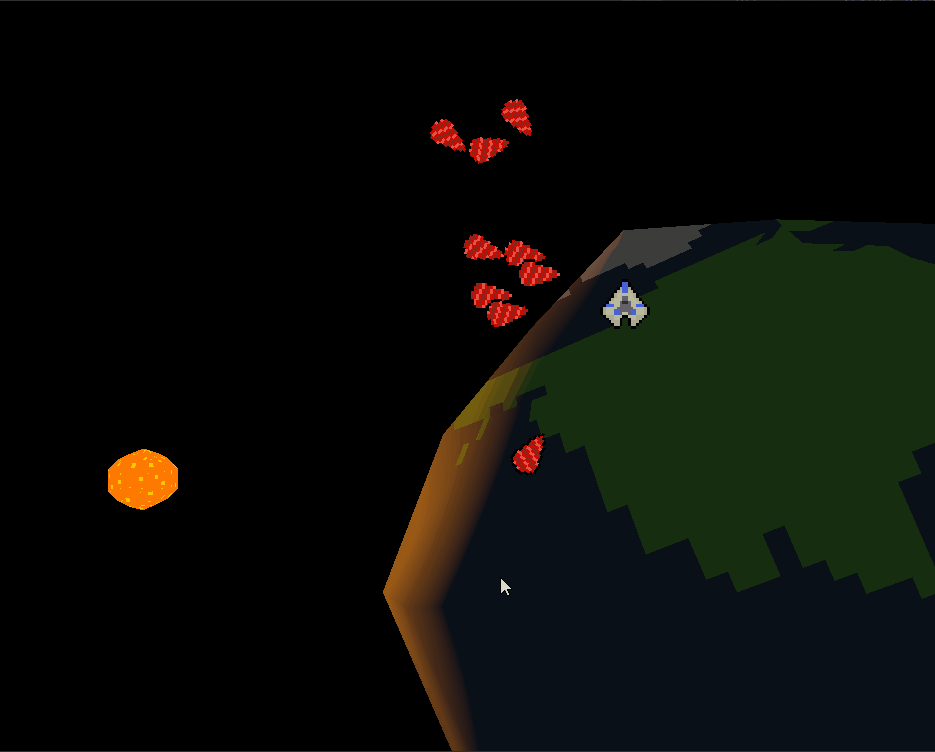
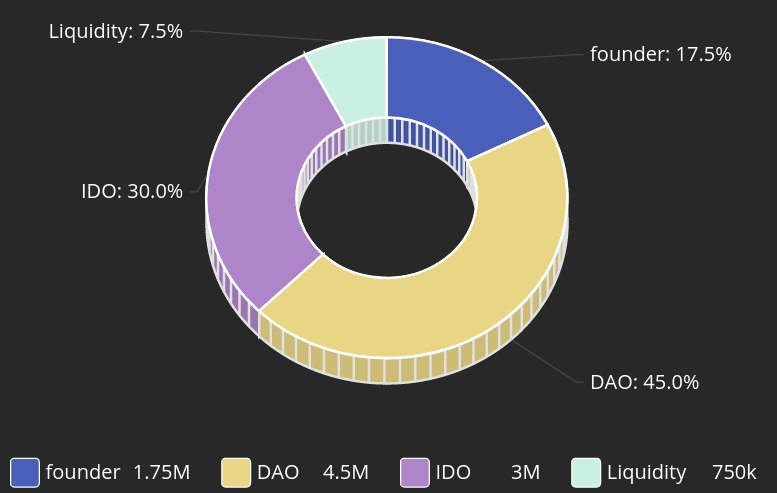

+++
title = "This Month in Rust GameDev #25 - August 2021"
date = 2021-09-01
transparent = true
draft = true
+++

<!-- no toc -->

<!-- Check the post with markdownlint-->

Welcome to the 25th issue of the Rust GameDev Workgroup's
monthly newsletter.
[Rust] is a systems language pursuing the trifecta:
safety, concurrency, and speed.
These goals are well-aligned with game development.
We hope to build an inviting ecosystem for anyone wishing
to use Rust in their development process!
Want to get involved? [Join the Rust GameDev working group!][join]

You can follow the newsletter creation process
by watching [the coordination issues][coordination].
Want something mentioned in the next newsletter?
[Send us a pull request][pr].
Feel free to send PRs about your own projects!

[Rust]: https://rust-lang.org
[join]: https://github.com/rust-gamedev/wg#join-the-fun
[pr]: https://github.com/rust-gamedev/rust-gamedev.github.io
[coordination]: https://github.com/rust-gamedev/rust-gamedev.github.io/issues?q=label%3Acoordination

[Rust]: https://rust-lang.org
[join]: https://github.com/rust-gamedev/wg#join-the-fun

- [Game Updates](#game-updates)
- [Learning Material Updates](#learning-material-updates)
- [Engine Updates](#engine-updates)
- [Tooling Updates](#tooling-updates)
- [Library Updates](#library-updates)
- [Popular Workgroup Issues in Github](#popular-workgroup-issues-in-github)
- [Meeting Minutes](#meeting-minutes)
- [Requests for Contribution](#requests-for-contribution)
- [Jobs](#jobs)
- [Bonus](#bonus)

<!--
Ideal section structure is:

```
### [Title]


_image caption_

A paragraph or two with a summary and [useful links].

_Discussions:
[/r/rust](https://reddit.com/r/rust/todo),
[twitter](https://twitter.com/todo/status/123456)_

[Title]: https://first.link
[useful links]: https://other.link
```

If needed, a section can be split into subsections with a "------" delimiter.
-->

## Rust GameDev Meetup


The eighth Rust Gamedev Meetup happened in August. You can watch the recording of
the meetup [here on Youtube][gamedev-meetup-video]. The meetups take place on
the second Saturday every month via the [Rust Gamedev Discord
server][rust-gamedev-discord], and are also [streamed on
Twitch][rust-gamedev-twitch]. If you would like to show off what you've been
working on at the next meetup on [September 11th][rust-meetup-sept-time], fill
out [this form][gamedev-meetup-form].

[gamedev-meetup-form]: https://forms.gle/BS1zCyZaiUFSUHxe6
[gamedev-meetup-video]: https://www.youtube.com/watch?v=g-QZAVipiuU
[rust-gamedev-discord]: https://discord.gg/yNtPTb2
[rust-gamedev-twitch]: https://twitch.tv/rustgamedevmeetup
[rust-meetup-sept-time]: https://everytimezone.com/s/c603b7e6

## Game Updates

### [Pixie Wrangler]

[][pw-itch]
_Click the image to play the game in your desktop browser!_

Pixie Wrangler ([itch.io][pw-itch], [GitHub][pw-github]) by [@rparrett]
is a puzzle game reminiscent of old school printed circuit board design
software.

Help the Pixies get from their outputs to their inputs while doing battle
with the intentionally less-than-ergonomic circuit design software. Pixie
Wrangler is currently a prototype, but includes 9 complete levels.

Pixie Wrangler was built with [Bevy 0.5] with support from these other great
projects: [bevy_webgl2], [bevy_prototype_lyon], [bevy_asset_ron],
[bevy_easings].

[Pixie Wrangler]: https://euclidean-whale.itch.io/pixie-wrangler
[pw-itch]: https://euclidean-whale.itch.io/pixie-wrangler
[pw-github]: https://github.com/rparrett/pixie_wrangler
[Bevy 0.5]: https://bevyengine.org/
[bevy_webgl2]: https://github.com/mrk-its/bevy_webgl2
[bevy_prototype_lyon]: https://github.com/Nilirad/bevy_prototype_lyon
[bevy_asset_ron]: https://github.com/inodentry/bevy_asset_ron
[bevy_easings]: https://github.com/mockersf/bevy_extra/tree/master/bevy_easings
[@rparrett]: https://github.com/rparrett

### [vange-rs]


_vange-rs on wgpu-0.10_

Vange-rs is a rewrite of the iconic Vangers game from 1998 in Rust,
heavily utilizing GPU for rendering.

The rendering engine has seen a major upgrade. Essential shaders were
rewritten into [WGSL], which streamlined the shader pipelines and culled out
the dependency tree.
Code was ported on the latest [wgpu]-0.10 release and helped identify a few issues.
Most importantly, this change made the game able to finally be distributed,
and maybe even compiled for the Web in the future.
Read more on the [WGSL-related blog post].

In order to make advantage of the new superpowers,
the [Rusty Vangers] game (the new working title) was published on Itch.io.

[vange-rs]: https://github.com/kvark/vange-rs
[WGSL-related blog post]: https://vange.rs/2021/08/25/pure-rust.html
[Rusty Vangers]: https://kvark.itch.io/vangers

### [RecWars]

[][rec-wars-web]
_Click the image to play in your browser_

[RecWars] by @martin-t is a free and open source Rust clone of [RecWar],
a top down vehicle shooter.

The game is a work-in-progress, this month it gained splitscreen for 2 players
and an in-game console to change cvars - you can edit any
of the configuration variables that define its gameplay balance while playing.

RecWars uses the [macroquad] engine so it can be played on the desktop
as well as [in the browser][rec-wars-web].

[RecWars]: https://github.com/martin-t/rec-wars
[RecWar]: https://github.com/martin-t/rec-wars#the-original-game
[rec-wars-web]: https://martin-t.gitlab.io/gitlab-pages/rec-wars/macroquad.html
[macroquad]: https://github.com/not-fl3/macroquad

### [Vehicle Evolver Deluxe]


_Vehicle Evolver Deluxe in action!_

[Vehicle Evolver Deluxe]
([GitHub](https://github.com/Bauxitedev/vehicle_evolver_deluxe),
[Twitter](https://twitter.com/bauxitedev/status/1423916614651678722)) by
[@bauxitedev] is a simulation that runs in your browser, using AI (to be
specific: [genetic algorithms](https://en.wikipedia.org/wiki/Genetic_algorithm))
to try to build better and better vehicles. The vehicles have to overcome an
obstacle course, starting with some slight hills, followed by steeper hills, and
finally some jumps. The vehicles are made out of panels and wheels, connected
together, similar to the game
[Besiege](https://store.steampowered.com/app/346010/Besiege/), except in 2D. It
was built using Rust and the Bevy game engine.

[Try the live web demo
here.](https://bauxitedev.github.io/vehicle_evolver_deluxe/index.html) (It needs
a relatively fast computer, on mobile browsers it'll run really slow.)

[There is also an in-depth explanation available on how it works internally, in
the form of an educational video.](https://www.youtube.com/watch?v=DlRNdCCSSyo)

_Discussions:
[/r/rust](http://redd.it/ozpa6q),
[Twitter](https://twitter.com/bauxitedev/status/1423916614651678722)_

[Vehicle Evolver Deluxe]:
https://bauxitedev.github.io/vehicle_evolver_deluxe/index.html
[@bauxitedev]:
https://twitter.com/bauxitedev

### Liminal Lab 000

[][ll000-live]
_Click the image to play the game in your desktop browser!_

Liminal Lab 000 ([live version][ll000-live]) by [@pebaz] is a tiny,
minimalistic puzzle game with 1 puzzle designed around the concept of
[Liminal Spaces][liminality]. Liminal Spaces are usually abandoned,
transitional places where life once thrived. These spaces are somehow familiar
to the viewer but the viewer has never been there. The unsettling feeling of
being alone comes from the realization that the viewer does not belong in that
space but is merely passing through it.

Liminal Lab 000 was built using [Macroquad][macroquad], utilizes voxel
rendering with 8x8x8 chunks, and is hosted on Google Firebase Hosting.

_Discussions: [/r/rust_gamedev][liminal-reddit]_

[ll000-live]: https://pebazium.web.app/
[@pebaz]: https://github.com/Pebaz
[liminality]: https://aesthetics.fandom.com/wiki/Liminal_Space
[macroquad]: https://github.com/not-fl3/macroquad
[liminal-reddit]: https://www.reddit.com/r/rust_gamedev/comments/ouu7xk/liminal_lab_000_my_first_ever_3d_game/

### [Not Snake][not-snake]


Not Snake ([GitHub][notsnakegit], [Itch][not-snake]) by [Michael Ramirez]
is a 3D snake game where you don't play as the snake.

Not Snake was developed using the [Bevy game engine][bevy-notsnake]. It was
completed and [released for free][not-snake] in August and can be played on
Windows, Linux, MacOS and in browser (Chrome recommended) although there are
fewer audio/performance issues running the executables versus the browser
version.

There have been several large changes since the last update in June including
adding new levels, new music and adding a narrator who does an OK job of keeping
score.

_Discussions:
[/r/rust_gamedev](https://www.reddit.com/p8fdfn),
[/r/indiegames](https://www.reddit.com/p9cx15)_

[not-snake]: https://ramirezmike2.itch.io/not-snake
[Michael Ramirez]: https://github.com/ramirezmike
[bevy-notsnake]: https://bevyengine.org
[notsnakegit]: https://github.com/ramirezmike/not_snake_game

### [A Day at the Movies][dayatmovies]


_The kids getting ready to sneak into a movie_

"A Day at the Movies" ([GitHub][dayatmoviesgit], [Itch][dayatmovies]) by
[Michael Ramirez] is a short game about stealth, movies and friendship.

"A Day at the Movies" was made using the [Bevy game engine][bevy-movieday] in 7
days as part of the Rusty Jam. Despite the placeholder art and lack of audio, it
can be played from start-to-finish and is literally guaranteed to bring a smile
to all who play it. Just make sure to follow the instructions on how to get into
the "Ferris the Crab" movie room.

It's playable in browser on [itch][dayatmovies] and the code can be viewed on
[GitHub][dayatmoviesgit].

[dayatmovies]: https://ramirezmike2.itch.io/a-day-at-the-movies
[dayatmoviesgit]: https://github.com/ramirezmike/rust_gamejam_0821
[bevy-movieday]: https://bevyengine.org

### [Sombervale]


Sombervale ([GitHub][sv-gh], [itch.io][sv-itch], [Twitch][sv-twitch]) by
[@blipjoy] is a game built in seven days for Rusty Jam. It is styled like an
old handheld game with a 160x128 screen resolution and 16-color palette.

The top 3 things that went well for this project were the art, tilemap support,
and ECS. On the art side, the silhouettes in the background turned out better
than expected. The back lighting (or at least the impression of back lighting)
looks quite nice, even in motion. Tilemap support was added near the end of the
jam built on [tiled]. It catapulted development progress from seeing major
changes every day to making major changes every hour. [shipyard] is the Entity
Component System crate used in Sombervale. This had a tricky learning curve, but
simplified complex interactions between entities.

Something that went poorly was choosing a scope that couldn't possibly be
completed on time. As usual, everything turned into a stretch goal! Secondly, a
lot of time was allocated to features that didn't make the cut. Much of this
was a result of trying to be perfect instead of efficient. It's a good game jam
lesson that often has to be relearned the hard way.

[Sombervale]: https://blipjoy.itch.io/sombervale
[sv-gh]: https://github.com/blipjoy/sombervale
[sv-itch]: https://blipjoy.itch.io/sombervale
[sv-twitch]: https://www.twitch.tv/blipjoy
[@blipjoy]: https://github.com/blipjoy
[tiled]: https://crates.io/crates/tiled
[shipyard]: https://crates.io/crates/shipyard

### Shattersong Online


Shattersong Online is an online sandbox game written in Rust, with the goal of
supporting thousands of players in a shared universe, with hundreds of players
per shard. In game portals let players travel between shards hosted on separate
physical servers.

Since the initial announcement in July we have worked on restructuring large
parts of the codebase to make adding new content more ergonomic. We tested
out the new organization by adding a new monster type from scratch (pictured
above).

Read the [dev blog][triplehex-blog] for more info, follow
[@triplehex][triplehex-twitter] on twitter for updates, and join the
[shattersong discord][shattersong-discord] for questions!

[triplehex-blog]: https://triplehex.dev/shattersong-online/
[triplehex-twitter]: https://twitter.com/triplehexdev
[shattersong-discord]: https://discord.gg/K5RHxVEK6F

### [The Process]

 _A
smelter factory setup in The Process_

[The Process] by @setzer22 is an upcoming game about factory building, process
management, and carrot production, built with Rust using the Godot game engine!

This month has seen a lot of activity: More improvements to the level editor,
in-game assets and general gameplay improvements. But the main focus has been on
a new building system with improved ergonomics. The game is now approaching a
point where all the core mechanics for the factory simulation are in place, but
more in-game content and assets are still required reaching the first playable
demo.

This month the game has seen the following changes and improvements:

- New assets like
  [wooden planks](https://twitter.com/PlayTheProcess/status/1423712530267054086),
  [machine parts](https://twitter.com/PlayTheProcess/status/1433160712231297027)
  and
  [mashed carrot cans](https://twitter.com/PlayTheProcess/status/1434466387787923456),
  with their in-game recipes.
- A new machine, the
  [centrifuge](https://twitter.com/PlayTheProcess/status/1430923976574910466)
- A new system to tweak properties with
  [OSD sliders](https://twitter.com/PlayTheProcess/status/1424638751041536001)
  to speed-up iteration times. Short explanation
  [here](https://twitter.com/PlayTheProcess/status/1424638756246675459).
- A new egui-powered
  [main menu](https://twitter.com/PlayTheProcess/status/1425785805453373444)
  for the main game screen.
- Improvements to the building system:
  [ghost markers](https://twitter.com/PlayTheProcess/status/1427560636289069059),
  [ramps](https://twitter.com/PlayTheProcess/status/1428300028712558595),
  [walls](https://twitter.com/PlayTheProcess/status/1429391914130882564),
  [machines](https://twitter.com/PlayTheProcess/status/1430229400923119621)
  and
  [conveyor belts](https://twitter.com/PlayTheProcess/status/1430479444213485574)!

_Discussions:
[/r/rust_gamedev](https://www.reddit.com/r/rust_gamedev/comments/p7ccad/a_3d_building_system_overhaul_for_the_process/)_

[The Process]: https://twitter.com/PlayTheProcess

### [Murder-User Dungeon][murder-user-dungeon]


Murder-User Dungeon (MUD) ([GitHub](mud-github), [Itch](mud-itch)) by
[@Nightlyside](nightlyside), [@cdsupina](cdsupina), [@Shippyhead](sheepyhead)
is a 2D game made for the [Rusty Jam 21](rusty-jam-21) in just one week with the
theme "*Illusion of Security*".

> Tony is a young man. Finally having his own apartment is a good thing! He will
> learn how to live by himself and how to enjoy the small things in life like
> playing on his old retro computer: the Astaria 3600 running SafeOS 3.1.
>
> However, you will quickly realize that the internet is not so friendly. You will
> meet new people in the Labyrinth(TM) game, and not being friendly to them can have
> a serious impact on your real life!
>
> In Murder-User Dungeon you will juggle between exploring the Labyrinth(TM) game
> in your console, hiding from vengeful gamers, and making sure you fulfill your
> human needs.
>
> To win the game, you must reach the end of the Labyrinth(TM)!

The developers aimed to make the player feel that they were safe in their apartment
atfirst - however as the game goes on and the player makes enemies of other gamers
in the Labyrinth, they risk them coming to their apartment to get revenge.

The team split development of the game, so that each member could work
independently on seperate features. While [@cdsupina](cdsupina) worked on the
needs system and the graphics, [@Sheepyhead](sheepyhead) worked on the UI and
menus, and [@Nightlyside](nightlyside) worked on the console and Labyrinth gameplay.

MUD was developed using the [Bevy game engine](bevy-engine), Rapier2D for collisions,
Aseprite for the graphics, and a lot of free assets from the internet (which are
credited at the end of the game's description).

Linux and Windows builds are available on the Itch page, and feedback is welcomed!

_Discussions:
[r/rust_gamedev](https://www.reddit.com/r/rust_gamedev/comments/pddreu/rusty_jam_submission_murderuser_dungeon/),
[r/rust](https://www.reddit.com/r/rust/comments/pddyv5/rusty_jam_submission_murderuser_dungeon/),
[Rusty Jam Discord](https://discord.gg/KkeMUu5kxH)_

[murder-user-dungeon]: https://sheepyhead.itch.io/murder-user-dungeon
[bevy-engine]: https://bevyengine.org/
[rusty-jam-21]: https://itch.io/jam/rusty-jam
[mud-itch]: https://sheepyhead.itch.io/murder-user-dungeon
[mud-github]: https://github.com/TheRealTeamFReSh/MurderUserDungeon
[nightlyside]: https://nightlyside.github.io/
[cdsupina]: https://github.com/cdsupina
[sheepyhead]: https://github.com/Sheepyhead

### [Theta Wave]

[][Theta Wave]
_All mobs ported to Bevy Theta Wave_

[Theta Wave] is an open-source space shooter game by developers [@micah_tigley] and
[@carlosupina]. In the past month, they have been working towards porting Theta
Wave to the Bevy Engine. Most of the work this month has been focused
on implementing all of the existing mobs in Bevy and Rapier.

Progress on this port is going strong - you can find the GitHub issue for
the port [here][Bevy Port Issue].

_Discussions:
[Twitter](https://twitter.com/carlosupina/status/1432039838463705090)_  

[Bevy Port Issue]: https://github.com/thetawavegame/thetawave/issues/2
[Theta Wave]: https://github.com/thetawavegame/thetawave
[@micah_tigley]: https://twitter.com/micah_tigley
[@carlosupina]: https://twitter.com/carlosupina

### [Shroom Kingdom][shroom-kingdom]


_SHRM token distribution_

Shroom Kingdom ([GitHub][shrm-github], [Discord][shrm-discord], [Twitter][shrm-twitter])
is an upcoming play-to-earn video game built with web technologies
running on the [NEAR Blockchain][near-blockchain].

This month the [whitepaper draft][shrm-whitepaper] has been published and a lot
of thoughts have been put into the token economics and how to integrate the game
with the blockchain. The Shroom Kingdom DAO (Decentralised Autonomous
Organization) is looking for self motivated people, who want to help build the
project. DAO members will be rewarded with the $SHRM token, which will soon be
launched on the NEAR mainnet after the final feedback round from NEAR core team
members.

A Proof of Concept has also been published for the app, which will be built with
Bevy and Rapier compiled to WebAssembly and which uses React for the GUI.

To incentivise early adoption of the project, an [NFT airdrop][shrm-nft-airdrop]
has been announced. The NFT will only be acquirable for a limited amount of time.

[shroom-kingdom]: https://shroomkingdom.net/
[shrm-github]: https://github.com/Shroom-Kingdom
[shrm-discord]: https://discord.gg/SPZsgSe
[shrm-twitter]: https://twitter.com/shrm_kingdom
[shrm-whitepaper]: https://whitepaper.shroomkingdom.net/
[shrm-nft-airdrop]: https://shroomkingdom.net/blog/nft-airdrop/
[near-blockchain]: https://near.org

### Fish Fight


[As promised](https://fishfight.itch.io/ff/devlog/281554/fish-fight-reloaded),
after months of private prototyping of early invitees, the Fish Fight devs are
finally ready to make their code and community channels available to the
general public. They also launched their website!

- [Announcement post][fish-announce]
- [GitHub repo][fish-github] (MIT/Apache)
- [Discord server][fish-discord]
- [Design doc][fish-designdoc]
- [fishfight.org][fish-website]

[fish-announce]: https://fishfight.itch.io/ff/devlog/291737/fish-fight-is-open-source
[fish-github]: https://github.com/fishfight/FishFight
[fish-discord]: https://discord.gg/4smxjcheE5
[fish-designdoc]: https://www.notion.so/erlendsh/Fish-Fight-1647ed74217e4e38a59bd28f4f5bc81a
[fish-website]: https://fishfight.org/

## Engine Updates

## Learning Material Updates

### [Rewriting my mobile game in Rust targeting WASM][panda-doodle-blog-post]


[@lucamoller][@lucamoller] published [a blog post][panda-doodle-blog-post]
describing his experience trying to learn Rust by working on a hobby project to
migrate his mobile game from a native C++ implementation to a Rust-based one
targetting WASM.

The post is written in a storytelling manner going through the author's
motivations to work on this project and the main challenges they faced while
learning Rust and implementing a game using WASM.

The resulting game, [Panda Doodle][panda-doodle-game], runs smoothly on mobile
device browsers, and the [source code][panda-doodle-source-code] was open
sourced to help inspire other developers that wish to venture into implementing
WASM-based games in Rust.

_Discussions:
[/r/rust](https://www.reddit.com/r/rust/comments/oxqofv/show_rrust_rewriting_my_mobile_game_in_rust/)_

[panda-doodle-blog-post]: https://lucamoller.medium.com/rewriting-my-mobile-game-in-rust-targeting-wasm-1f9f82751830
[panda-doodle-game]: https://pandadoodle.lucamoller.com/
[panda-doodle-source-code]: https://github.com/lucamoller/pandadoodle-rust-wasm
[@lucamoller]: https://github.com/lucamoller

## Tooling Updates

### [Graphite][graphite-repo]


_Graphite Alpha - Coming very soon_

Graphite ([GitHub][graphite-repo], [Discord][graphite-discord],
[Twitter](https://twitter.com/GraphiteEditor)) is an in-development vector and
raster graphics editor built on a non-destructive node-based workflow.

Work has progressed on features for the imminent Alpha release. A project
website has been designed and will launch this month. Crucial user-facing
features have been added: saving/opening documents; a bug report dialog for
panics; an auto-generated list of dependency license notices; and a new
undo/redo system.

The new Path Tool shows Bézier anchor/control points (soon to be draggable).
Rendering performance is much better and scrollbars now work with the infinite
canvas. There's a new bounding box around selected shapes that are
transformable with Blender-inspired [G]/[R]/[S] keys.

[Try it right now in your browser.][graphite-live-demo] Graphite is making
rapid progress towards becoming a non-destructive, procedural graphics editor
suitable of replacing traditional 2D DCC applications. The public alpha release
is coming very soon. [Join the Discord][graphite-discord] and get involved!

[graphite-repo]: https://github.com/GraphiteEditor/Graphite
[graphite-discord]: https://discord.graphite.design
[graphite-twitter]: https://twitter.com/GraphiteEditor
[graphite-live-demo]: https://editor.graphite.design

## Library Updates

### [GGRS]


[GGRS] by [@g_schup] is a reimagination of the [GGPO] P2P rollback network SDK
written in 100% safe Rust.

Since the last update, GGRS has released version 0.4.4 and received
performance updates and fixes, such as a
[sparse saving feature](https://gschup.github.io/ggrs/blog/sparse-saving/).
The authors also proudly present [bevy_GGRS]!

bevy_GGRS is a plugin to integrate GGRS easily into the popular game engine
[bevy]. It features autmatic saving and loading of components and resources
defined by the user through bevy's reflection tools.
The plugin is currently in development and uses features that have not
been released in bevy 0.5. With bevy 0.6 on the horizon, bevy_GGRS is
planning to publish to [crates.io](https://crates.io), as well.

If you are interested in developing with GGRS, check the following resources:

- [quick start guide](https://gschup.github.io/ggrs/docs/getting-started/quick-start/)
- [GGRS examples](https://github.com/gschup/ggrs/tree/main/examples)
- [bevy_GGRS examples](https://github.com/gschup/bevy_ggrs/tree/main/examples)

[GGRS]: https://github.com/gschup/ggrs
[bevy_ggrs]: https://github.com/gschup/bevy_ggrs
[bevy]: https://bevyengine.org/
[GGPO]: https://www.ggpo.net/
[@g_schup]: https://twitter.com/g_schup

### [wgpu]-0.10


_unannounced engine on wgpu-0.10_

The team has released wgpu-0.10 with a fully rewritten graphics abstraction
("wgpu-hal" instead of "gfx-hal"), as well as [naga] version 0.6.
Read more in [Release of a Pure-Rust v0.10 and a Call For Testing].

There were a few issues spotted, but overall it went smooth for such a big change.
User libraries were quick to update: [iced#1000], [kas#241], [pixels#187], and others.

On the shader side, in addition to improved validation, hundreds of fixes to the
produced outputs, the atomic operations are now supported when using [WGSL] sources.

The release comes at a cost of DX11 backend, which isn't there comparing to wgpu-0.9.
On the plus side, the new GL backend performs much better. It runs most of the examples,
and has been successfully tested on Raspberry Pi-3.
Still more work ahead to make it solid, and to support WebGL2 properly.

[wgpu]: https://github.com/gfx-rs/wgpu
[naga]: https://github.com/gfx-rs/naga
[Release of a Pure-Rust v0.10 and a Call For Testing]: https://gfx-rs.github.io/2021/08/18/release-0.10.html
[iced#1000]: https://github.com/hecrj/iced/pull/1000
[kas#241]: https://github.com/kas-gui/kas/pull/241
[pixels#187]: https://github.com/parasyte/pixels/pull/187
[WGSL]: https://gpuweb.github.io/gpuweb/wgsl/

### [godot-egui]-0.1.8


_You can now use egui to make Godot editor extensions!_

The [egui](https://github.com/emilk/egui) backend for
[godot-rust](https://github.com/godot-rust/godot-rust) is improving fast. Some
bugs have been ironed out during this past month, and the integration has got
several features:

- The repository now includes an example of how to setup egui to create
  [Godot editor plugins](https://twitter.com/PlayTheProcess/status/1431660162587275267).
  Contribution by @jacobsky.
- Custom font support by drag & dropping font files right from Godot editor.
- Updated crate to match latest egui 0.14.2
- Configurable texture filtering.
- Several bugfixes and improvements.

Additionally, a new [theme
editor](https://github.com/setzer22/godot-egui/issues/5) is in the works, which
hopefully will be helpful to other egui backends as well!

[godot-egui]: https://github.com/setzer22/godot-egui

## Popular Workgroup Issues in Github

<!-- Up to 10 links to interesting issues -->

## Meeting Minutes

<!-- Up to 10 most important notes + a link to the full details -->

[See all meeting issues][label_meeting] including full text notes
or [join the next meeting][join].

[label_meeting]: https://github.com/rust-gamedev/wg/issues?q=label%3Ameeting

## Requests for Contribution

<!-- Links to "good first issue"-labels or direct links to specific tasks -->

## Jobs

<!-- An optional section for new jobs related to Rust gamedev -->

## Bonus

<!-- Bonus section to make the newsletter more interesting
and highlight events from the past. -->

------

That's all news for today, thanks for reading!

Want something mentioned in the next newsletter?
[Send us a pull request][pr].

Also, subscribe to [@rust_gamedev on Twitter][@rust_gamedev]
or [/r/rust_gamedev subreddit][/r/rust_gamedev] if you want to receive fresh news!

<!--
TODO: Add real links and un-comment once this post is published
**Discussions of this post**:
[/r/rust_gamedev](TODO),
[Twitter](TODO),
[Discord](https://discord.gg/yNtPTb2).
-->

[/r/rust_gamedev]: https://reddit.com/r/rust_gamedev
[@rust_gamedev]: https://twitter.com/rust_gamedev
[pr]: https://github.com/rust-gamedev/rust-gamedev.github.io
