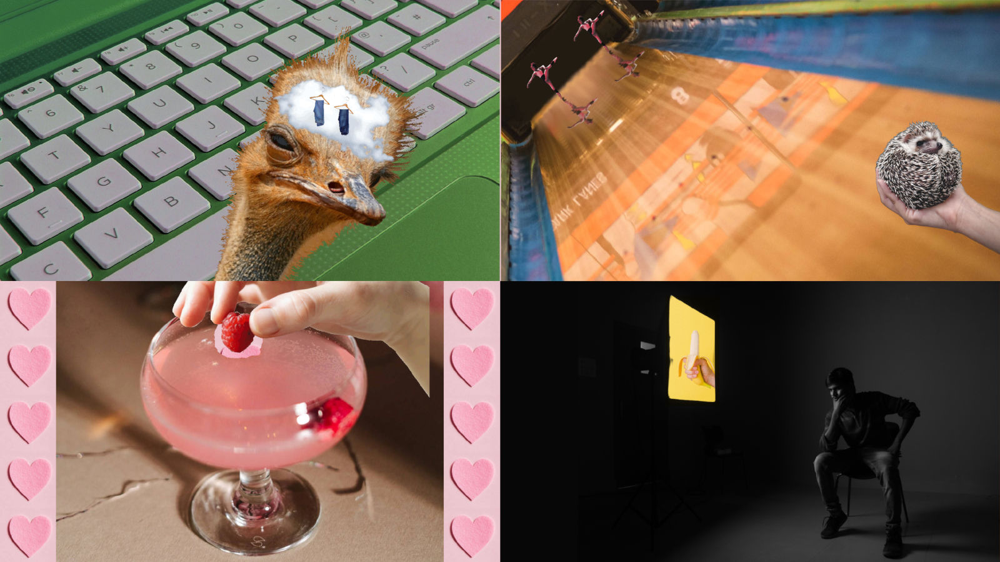
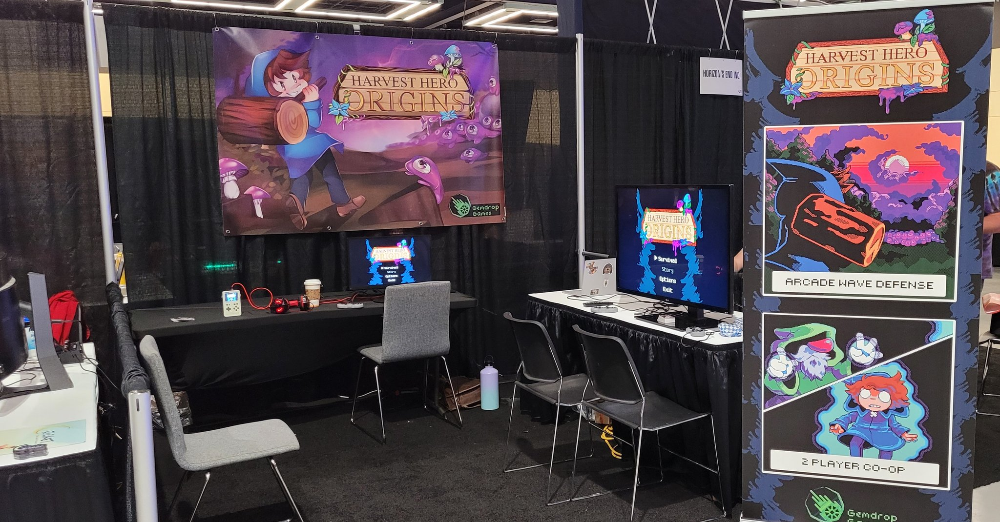
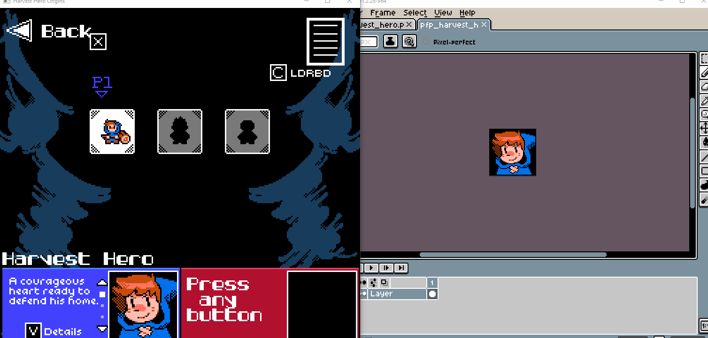

+++
title = "This Month in Rust GameDev #26 - September 2021"
transparent = true
date = 2021-10-04
draft = true
+++

<!-- no toc -->

<!-- Check the post with markdownlint-->

Welcome to the 26th issue of the Rust GameDev Workgroup's
monthly newsletter.
[Rust] is a systems language pursuing the trifecta:
safety, concurrency, and speed.
These goals are well-aligned with game development.
We hope to build an inviting ecosystem for anyone wishing
to use Rust in their development process!
Want to get involved? [Join the Rust GameDev working group!][join]

You can follow the newsletter creation process
by watching [the coordination issues][coordination].
Want something mentioned in the next newsletter?
[Send us a pull request][pr].
Feel free to send PRs about your own projects!

[Rust]: https://rust-lang.org
[join]: https://github.com/rust-gamedev/wg#join-the-fun
[pr]: https://github.com/rust-gamedev/rust-gamedev.github.io
[coordination]: https://github.com/rust-gamedev/rust-gamedev.github.io/issues?q=label%3Acoordination

[Rust]: https://rust-lang.org
[join]: https://github.com/rust-gamedev/wg#join-the-fun

- [Game Updates](#game-updates)
- [Learning Material Updates](#learning-material-updates)
- [Engine Updates](#engine-updates)
- [Tooling Updates](#tooling-updates)
- [Library Updates](#library-updates)
- [Popular Workgroup Issues in Github](#popular-workgroup-issues-in-github)
- [Meeting Minutes](#meeting-minutes)
- [Requests for Contribution](#requests-for-contribution)
- [Jobs](#jobs)
- [Bonus](#bonus)

<!--
Ideal section structure is:

```
### [Title]


_image caption_

A paragraph or two with a summary and [useful links].

_Discussions:
[/r/rust](https://reddit.com/r/rust/todo),
[twitter](https://twitter.com/todo/status/123456)_

[Title]: https://first.link
[useful links]: https://other.link
```

If needed, a section can be split into subsections with a "------" delimiter.
-->

## Rust GameDev Meetup


The ninth Rust Gamedev Meetup happened in September. You can watch the recording
of the meetup [here on Youtube][gamedev-meetup-video]. The meetups take place on
the second Saturday every month via the [Rust Gamedev Discord
server][rust-gamedev-discord] and are also [streamed on
Twitch][rust-gamedev-twitch]. If you would like to show off what you've been
working on at the next meetup on [October 9th][rust-meetup-oct-time], fill out
[this form][gamedev-meetup-form].

[gamedev-meetup-form]: https://forms.gle/BS1zCyZaiUFSUHxe6
[gamedev-meetup-video]: https://youtu.be/TH3AErcNcTY
[rust-gamedev-discord]: https://discord.gg/yNtPTb2
[rust-gamedev-twitch]: https://twitch.tv/rustgamedev
[rust-meetup-oct-time]: https://everytimezone.com/s/aa44ac42

## Game Updates

### [Weegames][weegames-itch]



[Weegames][weegames-itch] is a fast-paced minigame collection.
The Windows version of the game has been rewritten to use Macroquad,
so now the web and downloadable versions of the game share the same codebase.
Development for the web version has moved to the
[Weegames Github][weegames-github] repository.

[weegames-itch]: https://yeahross.itch.io/weegames
[weegames-github]: https://github.com/yeahross0/weegames

### [Veloren][veloren]

 _An odd structure in the woods_

[Veloren][veloren] is an open world, open-source voxel RPG inspired by Dwarf
Fortress and Cube World.

In September, Veloren hosted its larges release party ever! At peak, 181 players
were playing on the server together. You can read about all the changes to 0.11
in [the release blog][veloren-011-release-blog], and be sure to watch the
[release trailer][veloren-011-trailer]! During the release party, several devs
spoke about the changes, which you can watch [here][veloren-011-dev-chats]. This
release party was the first one to handle the high player load with no issues,
and give hope for much larger servers in the future.

Shaderc was replaced with Naga early on in the month. This was the result of
over a year of work. Hitboxes are in the process of being overhauled to handle
non-cylidrical targets better. Improvements were made to how the cursor selects
objects in game. As always, lots of experiemental work is being done to the
economic system. Cultist raiders were added, which mean that raiding parties
will now attack nearby settlements. This is a great example of how the realtime
simulation is starting to become more visible to players.

September's full weekly devlogs: "This Week In Veloren...":
[#136][veloren-136],
[#137][veloren-137],
[#138][veloren-138],
[#139][veloren-139].

[veloren]: https://veloren.net
[veloren-136]: https://veloren.net/devblog-136
[veloren-137]: https://veloren.net/devblog-137
[veloren-138]: https://veloren.net/devblog-138
[veloren-139]: https://veloren.net/devblog-139
[veloren-011-trailer]: https://www.youtube.com/watch?v=l1oOjvaWJlw
[veloren-011-dev-chats]:https://www.youtube.com/watch?v=J5Xz-vbE27Q
[veloren-011-release-blog]: https://veloren.net/release-0-11/

### [Harvest Hero Origins][hho] @ PAX West 2021


_Gemdrop Games booth at PAX West 2021_

[Harvest Hero Origins][hho]
([Discord](https://discord.gg/CJRbxQn3d9),
[Twitter](https://twitter.com/GemdropGames))
is an arcade wave defense game by [Gemdrop Games][gemdrop],
built in Rust on top of [Emerald].

Gemdrop Games recently took Harvest Hero Origins to [PAX West 2021][hho_pax]
and had a very positive response from most of the players!
Being able to watch people play the game was extremely valuable,
the developers were able to see pain points in UI/UX design
and can now fix them without worry.
They were also able to see what players find fun about controlling each hero,
which helps with the next hero planning in the full release of the game.

Harvest Hero Origins is still planned to release by the end of 2021,
please wishlist it on [Steam][hho]!

[Emerald]: https://github.com/Bombfuse/emerald
[gemdrop]: https://twitter.com/GemdropGames
[hho]: https://store.steampowered.com/app/1651500/Harvest_Hero_Origins
[hho_pax]: https://twitter.com/GemdropGames/status/1433819047481659394

## Engine Updates

### [good-web-game]


[`good-web-game`] has been released on crates.io, together with [`ggez`] 0.6.1!
`ggez` is a lightweight cross-platform game framework for making 2D games
with minimum friction, with an API inspired by Love2D. `good-web-game` is a
subset of ggez, which is based upon [`miniquad`] and can therefore run natively
on the web, mobile and of course desktop as well.

`good-web-game` was originally created to run [Zemeroth] on the web. However,
as Zemeroth switched from using `ggez` to [`macroquad`] the project was
discontinued, until recently. In search of [a new graphics backend for ggez]
the ggez team now picked up development again and released a massive update,
updating `good-web-game` for compatability to `ggez` 0.6, expanding its
functionality.

With only [a single change in boilerplate code] many `ggez` 0.6 games can now be
directly ported to `good-web-game`. Yet, it's no drop in replacement for `ggez`
as [several key differences remain].

[good-web-game]: https://github.com/ggez/good-web-game
[`good-web-game`]: https://github.com/ggez/good-web-game
[`ggez`]: https://github.com/ggez/ggez
[`miniquad`]: https://github.com/not-fl3/miniquad
[Zemeroth]: https://ozkriff.itch.io/zemeroth
[`macroquad`]: https://github.com/not-fl3/macroquad/
[a new graphics backend for ggez]: https://github.com/ggez/ggez/issues/962
[a single change in boilerplate code]: https://github.com/PSteinhaus/PSteinhaus.github.io/blob/main/ggez/web-examples/README.md#ggez-animation-example
[several key differences remain]: https://github.com/ggez/good-web-game#differences

### [godot-rust](https://github.com/godot-rust/godot-rust)


godot-rust ([GitHub][gd-github], [Discord][gd-discord], [Twitter][gd-twitter])
is a Rust library that provides bindings for the Godot game engine.

In the last month, a lot of documentation has been added to the book. The new
entries in [FAQ][gd-faq], [Recipes][gd-recipes] and [Game Architecture][gd-arch]
don't focus on specific APIs, but put them into a bigger context and highlight
typical challenges encountered in practice.

Besides smaller bugfixes, the library itself added support for `serde`
serialization of core types ([#743][gd-743], thanks to Waridley).

In terms of automation and tooling, September was a very productive month:

- Translation of Godot's documentation based on `[bbcode]` to RustDoc with
  intra-doc links, making Godot APIs much more readable and discoverable.

- Refactoring of GitHub Actions CI, allowing quick and precise feedback for
  contributors.

- Automation of latest documentation, now hosted under
  [godot-rust.github.io/docs][gd-docs].

As the godot-rust community keeps growing, the project can now be found
[on Twitter][gd-twitter] with the GodotRust handle.

[gd-faq]: https://godot-rust.github.io/book/faq.html
[gd-recipes]: https://godot-rust.github.io/book/recipes.html
[gd-arch]: https://godot-rust.github.io/book/gdnative-overview/architecture.html
[gd-743]: https://github.com/godot-rust/godot-rust/pull/743
[gd-docs]: https://godot-rust.github.io/docs
[gd-github]: https://github.com/godot-rust/godot-rust
[gd-discord]: https://discord.com/invite/FNudpBD
[gd-twitter]: https://twitter.com/GodotRust

### [Emerald]


_Built in texture hot reloading, just call `emd.loader().hotreload()`_

[Emerald] by [@bombfuse][bombfuse_twi]
is a 2D game engine focused on being super portable and easy-to-use.

Currently supported platforms are:
Windows, Linux (WIP gamepad support), macOS (WIP gamepad support),
Web, Android (WIP audio, gamepad Support),
[GameShell](http://imgur.com/a/8cWxOPs),
and even [WearOS](https://twitter.com/bombfuse_dev/status/1444100458260299778)!

Recently added features include:

- Texture hot reloading (sound hot reloading is coming soon!).
- Cross-platform file saving/loading.
  This is essential for games, basically allows the user to save
  their files to the platform specific save directory.

[Emerald] has slowly been growing, both in contributor size and feature sets
recently. If any of this interests you and you'd like to contribute,
[feel free to grab a task](https://github.com/Bombfuse/emerald/issues),
fork and PR!

[Emerald]: https://github.com/Bombfuse/emerald
[bombfuse_twi]: https://twitter.com/bombfuse_dev

## Learning Material Updates

## Tooling Updates

## Library Updates

### [imgui-rs][imgui-rs]

[imgui-rs][imgui-rs] is the Rust bindings for the Dear ImGui framework,
allowing users to easily build up complex debug widgets and tools.

In [v0.8.0][v0.8.0], the library's API continued its overhaul to both be more
similar to the C++ API while feeling like native Rust. Specifically,
the odious `im_str!` macro was deprecated -- using inline strings directly
(and anything `AsRef<str>`) simply works. Most functions also make extensive
use of RAII-style drop tokens to track `begin`/`end` calls.
Lastly, it was updated to use current Dear ImGui v1.84, and bound to
the new APIs, including the new Tables API.

[imgui-rs]: https://github.com/imgui-rs/imgui-rs
[v0.8.0]: https://github.com/imgui-rs/imgui-rs/releases/tag/v0.8.0

## Popular Workgroup Issues in Github

<!-- Up to 10 links to interesting issues -->

## Meeting Minutes

<!-- Up to 10 most important notes + a link to the full details -->

[See all meeting issues][label_meeting] including full text notes
or [join the next meeting][join].

[label_meeting]: https://github.com/rust-gamedev/wg/issues?q=label%3Ameeting

## Requests for Contribution

<!-- Links to "good first issue"-labels or direct links to specific tasks -->

## Jobs

<!-- An optional section for new jobs related to Rust gamedev -->

## Bonus

<!-- Bonus section to make the newsletter more interesting
and highlight events from the past. -->

<!-- TODO: browse previous newsletter coord-issues and select some cool section
that wasn't written. -->

------

That's all news for today, thanks for reading!

Want something mentioned in the next newsletter?
[Send us a pull request][pr].

Also, subscribe to [@rust_gamedev on Twitter][@rust_gamedev]
or [/r/rust_gamedev subreddit][/r/rust_gamedev] if you want to receive fresh news!

<!--
TODO: Add real links and un-comment once this post is published
**Discuss this post on**:
[/r/rust_gamedev](TODO),
[Twitter](TODO),
[Discord](https://discord.gg/yNtPTb2).
-->

[/r/rust_gamedev]: https://reddit.com/r/rust_gamedev
[@rust_gamedev]: https://twitter.com/rust_gamedev
[pr]: https://github.com/rust-gamedev/rust-gamedev.github.io
