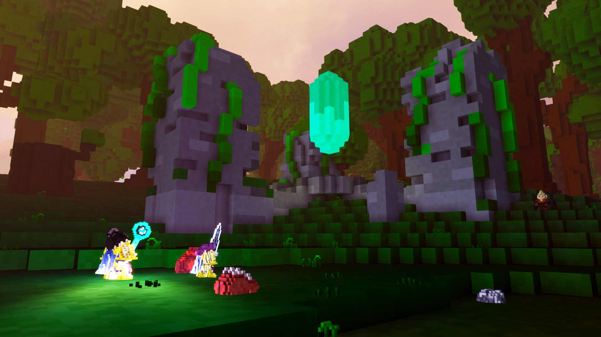
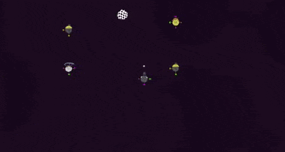

+++
title = "This Month in Rust GameDev #26 - September 2021"
transparent = true
date = 2021-10-10
+++

<!-- no toc -->

Welcome to the 26th issue of the Rust GameDev Workgroup's
monthly newsletter.
[Rust] is a systems language pursuing the trifecta:
safety, concurrency, and speed.
These goals are well-aligned with game development.
We hope to build an inviting ecosystem for anyone wishing
to use Rust in their development process!
Want to get involved? [Join the Rust GameDev working group!][join]

You can follow the newsletter creation process
by watching [the coordination issues][coordination].
Want something mentioned in the next newsletter?
[Send us a pull request][pr].
Feel free to send PRs about your own projects!

[Rust]: https://rust-lang.org
[join]: https://github.com/rust-gamedev/wg#join-the-fun
[pr]: https://github.com/rust-gamedev/rust-gamedev.github.io
[coordination]: https://github.com/rust-gamedev/rust-gamedev.github.io/issues?q=label%3Acoordination

[Rust]: https://rust-lang.org
[join]: https://github.com/rust-gamedev/wg#join-the-fun

- [Rust GameDev Meetup](#rust-gamedev-meetup)
- [Rust Graphics Meetup \#1](#rust-graphics-meetup-1)
- [Rust GameDev Podcast \#6](#rust-gamedev-podcast-6)
- [Game Updates](#game-updates)
- [Learning Material Updates](#learning-material-updates)
- [Engine Updates](#engine-updates)
- [Tooling Updates](#tooling-updates)
- [Library Updates](#library-updates)
- [Popular Workgroup Issues in Github](#popular-workgroup-issues-in-github)
- [Requests for Contribution](#requests-for-contribution)
- [Discussions](#discussions)

<!--
Ideal section structure is:

```
### [Title]


_image caption_

A paragraph or two with a summary and [useful links].

_Discussions:
[/r/rust](https://reddit.com/r/rust/todo),
[twitter](https://twitter.com/todo/status/123456)_

[Title]: https://first.link
[useful links]: https://other.link
```

If needed, a section can be split into subsections with a "------" delimiter.
-->

## Rust GameDev Meetup


The ninth Rust Gamedev Meetup happened in September. You can watch the recording
of the meetup [here on Youtube][gamedev-meetup-video]. The meetups take place on
the second Saturday every month via the [Rust Gamedev Discord
server][rust-gamedev-discord] and are also [streamed on
Twitch][rust-gamedev-twitch].

[gamedev-meetup-video]: https://youtu.be/TH3AErcNcTY
[rust-gamedev-discord]: https://discord.gg/yNtPTb2
[rust-gamedev-twitch]: https://twitch.tv/rustgamedev

## Rust Graphics Meetup \#1


The Rust Graphics Meetup is an online gathering where rustaceans share
technical details of their work related to graphics and compute,
not affiliated to any particular stack.
The pilot edition has happened on Oct 2nd! Check out the talks:

- [gfx-rs Lessons Learned][rgm1-video] - [@kvark], [slides][rgm1-slides].
- [rend3 Architecture: Efficient, Customizable Rendering][rgm2-video] -
  [@cwfitzgerald], [slides][rgm2-slides].
- [Blub - Interactive GPU Fluid Solver][rgm3-video] - [@wumpf], [slides][rgm3-slides].

Learn more at the [gfx meetup repo].
Thanks everyone for tuning in and helping to make this happen!

_Discussions:
[/r/rust](https://reddit.com/r/rust/comments/q08byh/videos_from_rust_graphics_meetup_1),
[Twitter](https://twitter.com/rust_gamedev/status/1444326130035666953)_

[rgm1-video]: https://youtube.com/watch?v=m0JgF5Wb-dA
[rgm1-slides]: https://github.com/gfx-rs/meetup/blob/main/Meeting01/GfxLessonsLearned.pdf
[rgm2-video]: https://youtube.com/watch?v=F0wGz5UJTrY
[rgm2-slides]: https://github.com/gfx-rs/meetup/blob/main/Meeting01/rend3s_Architecture_-_Efficient_Customizable_Rendering.pdf
[rgm3-video]: https://youtube.com/watch?v=Yzr9va5UtiE
[rgm3-slides]: https://github.com/gfx-rs/meetup/blob/main/Meeting01/Blub_-_Quick_tour_through_a_GPU_fluid_solver.pdf
[gfx meetup repo]: https://github.com/gfx-rs/meetup
[@kvark]: https://github.com/kvark
[@cwfitzgerald]: https://github.com/cwfitzgerald
[@wumpf]: https://github.com/wumpf

## [Rust GameDev Podcast #6][podcast-6]


[The sixth episode][podcast-6] is an interview with Remco and Basz, creators of
[Mun][mun]. Programming language creation is discussed, along with challenges
and what future developments are incoming from the [Mun project][mun].

Listen and Subscribe from the following platforms:
[Rust GameDev Podcast (simplecast)][gamedev-podcast-site],
[Apple Podcasts][gamedev-podcast-apple],
[Spotify][gamedev-podcast-spotify],
[RSS Feed][gamedev-podcast-rss],
[Google Podcasts][gamedev-podcast-google].

[podcast-6]: https://rustgamedev.com/episodes/interview-with-remco-and-basz
[mun]: https://mun-lang.org/
[gamedev-podcast-site]: https://rustgamedev.com/
[gamedev-podcast-apple]: https://podcasts.apple.com/gb/podcast/rust-game-dev/id1526304768
[gamedev-podcast-spotify]: https://open.spotify.com/show/7HRfGnTcXkLkQd9fxJbDGj
[gamedev-podcast-rss]: https://feeds.simplecast.com/C6NQglnL
[gamedev-podcast-google]: https://podcasts.google.com/feed/aHR0cHM6Ly9mZWVkcy5zaW1wbGVjYXN0LmNvbS9DNk5RZ2xuTA

## Game Updates

### [BITGUN][bitgun-steam]

[][bitgun-steam]

BITGUN ([Steam][bitgun-steam], [Twitter][bitgun-twitter],
[Discord][bitgun-discord]) by [@LogLogGames][bitgun-twitter] is an action
roguelike zombie shooter with lots of blood and guns, similar to games like
Hotline Miami, Nuclear Throne, and Heat Signature. The game is built using Godot
and Rust (via [godot-rust][bitgun-godot-rust]).

They recently re-worked the in-game UI using [egui][bitgun-egui] with
[godot-egui][bitgun-godot-egui], allowing much easier custom widgets such as
[drag & drop on items between inventory slots][bitgun-inventory].

_Discussions: [Twitter][bitgun-inventory]_

[bitgun-steam]: https://store.steampowered.com/app/1673940/BITGUN/
[bitgun-twitter]: https://twitter.com/logloggames
[bitgun-discord]: https://discord.gg/XrGZQkq
[bitgun-godot-rust]: https://godot-rust.github.io/
[bitgun-egui]: https://github.com/emilk/egui
[bitgun-godot-egui]: https://github.com/setzer22/godot-egui
[bitgun-inventory]: https://twitter.com/LogLogGames/status/1444072221681635333

### [Weegames][weegames-itch]


[Weegames][weegames-itch] is a fast-paced minigame collection.
The Windows version of the game has been rewritten to use Macroquad,
so now the web and downloadable versions of the game share the same codebase.
Development for the web version has moved to the
[Weegames Github][weegames-github] repository.

[weegames-itch]: https://yeahross.itch.io/weegames
[weegames-github]: https://github.com/yeahross0/weegames

### [Veloren][veloren]

 _An odd structure in the woods_

[Veloren][veloren] is an open world, open-source voxel RPG inspired by Dwarf
Fortress and Cube World.

In September, Veloren hosted its largest release party ever! At peak, 181 players
were playing on the server together. You can read about all the changes to 0.11
in [the release blog][veloren-011-release-blog], and be sure to watch the
[release trailer][veloren-011-trailer]! During the release party, several devs
spoke about the changes, which you can watch [here][veloren-011-dev-chats]. This
release party was the first one to handle the high player load with no issues,
and give hope for much larger servers in the future.

Shaderc was replaced with Naga early on in the month. This was the result of
over a year of work. Hitboxes are in the process of being overhauled to handle
non-cylindrical targets better. Improvements were made to how the cursor selects
objects in game. As always, lots of experimental work is being done to the
economic system. Cultist raiders were added, which means that raiding parties
will now attack nearby settlements. This is a great example of how the realtime
simulation is starting to become more visible to players.

September's full weekly devlogs: "This Week In Veloren...":
[#136][veloren-136],
[#137][veloren-137],
[#138][veloren-138],
[#139][veloren-139].

[veloren]: https://veloren.net
[veloren-136]: https://veloren.net/devblog-136
[veloren-137]: https://veloren.net/devblog-137
[veloren-138]: https://veloren.net/devblog-138
[veloren-139]: https://veloren.net/devblog-139
[veloren-011-trailer]: https://www.youtube.com/watch?v=l1oOjvaWJlw
[veloren-011-dev-chats]:https://www.youtube.com/watch?v=J5Xz-vbE27Q
[veloren-011-release-blog]: https://veloren.net/release-0-11/

### [Harvest Hero Origins][hho] @ PAX West 2021


_Gemdrop Games booth at PAX West 2021_

[Harvest Hero Origins][hho]
([Discord](https://discord.gg/CJRbxQn3d9),
[Twitter](https://twitter.com/GemdropGames))
is an arcade wave defense game by [Gemdrop Games][gemdrop],
built in Rust on top of [Emerald].

Gemdrop Games recently took Harvest Hero Origins to [PAX West 2021][hho_pax]
and had a very positive response from most of the players!
Being able to watch people play the game was extremely valuable,
the developers were able to see pain points in UI/UX design
and can now fix them without worry.
They were also able to see what players find fun about controlling each hero,
which helps with the next hero planning in the full release of the game.

Harvest Hero Origins is still planned to release by the end of 2021,
please wishlist it on [Steam][hho]!

[Emerald]: https://github.com/Bombfuse/emerald
[gemdrop]: https://twitter.com/GemdropGames
[hho]: https://store.steampowered.com/app/1651500/Harvest_Hero_Origins
[hho_pax]: https://twitter.com/GemdropGames/status/1433819047481659394

### Molecoole



Molecoole is a topdown action roguelite where you connect with different atoms
to create the strongest Molecoole to defeat the baddies! Molecoole was created
by two brothers: [Márton] and [Dániel].

In Molecoole the strongest focus is about making different combos by connecting
atoms. The original version was made in Unity for a game jam, but they decided
to make an actual game out of it using the Bevy engine. It currently includes
their own implementation for 2D animation, collision detection, and particles.
In September, one of the main development areas was making the game nicer to
play, so they introduced the [ezing] crate and also implemented slowing the
[game time]. They are using the [LDtk] editor to make the level sections for the
procedural generation.

[Márton]: https://twitter.com/kiss_mrton
[Dániel]: https://twitter.com/FrenetiqDan
[ezing]: https://github.com/michaelfairley/ezing
[game time]: https://twitter.com/kiss_mrton/status/1434189320865341444
[LDtk]: https://ldtk.io

### [Circle Race]


Circle Race was made by [@kuviman] for [TriJam 135], where you needed to create
a game in three hours. The theme was "Circles". You are a circle, connected with
two other "thruster" circles. You play inside a circle, consisting of "tire"
circles. Circle around it to find your best circle time!

Made using [@kuviman]'s own engine [geng].

_Discussions:
[/r/rust_gamedev](https://www.reddit.com/r/rust_gamedev/comments/phyn7z/circle_race_game_made_in_3_hours_for_trijam/)_

[Circle Race]: https://kuviman.itch.io/circle-race
[@kuviman]: https://github.com/kuviman
[TriJam 135]: https://itch.io/jam/trijam-135
[geng]: https://github.com/kuviman/geng/

### [Monke Pizza]


Game made by [@kuviman] for [VimJam 2]. The theme for this jam was "Boss" and
the limitation was "On The Edge".

Monke Pizza is an online multiplayer monke pizza restaurant simulator. You are
always on the edge of being fired. That is *if* you work here. Otherwise, you are
on the edge of being hired. Because that is how BOSS is bossing.

Made using [@kuviman]'s own engine [geng].

[Monke Pizza]: https://kuviman.itch.io/monke-pizza
[VimJam 2]: https://itch.io/jam/vimjam2

### Idu


Idu ([Discord][idu-discord]) by [@logicsoup] and [@epcc10]
is an upcoming game centered around growing realistic plants.

In September, the project previously codenamed "garden" has been renamed to
"idu"! In Idu, every plant is continuously formed by the simulation. There are
unique responses from a plant's surroundings and your care. Simulated leaves and
shoots grow into plants with a mind of their own. Here is the changelog of Demo Version
4:

- Fixed freezing when help menu was displayed
- Added support for all older Ubuntu versions from 16.04
- Fixed crashing when roots extended over the world border
- Pressing ESC in menus acts as a back button
- Fixed the issue where pruning didn't work on the first day after loading the game
- Fixed the game choosing integrated GPU even when a discrete one was available

A playable alpha demo has been released and is freely available
at [Idu's Discord server's #demo-download channel][idu-discord]!

[@logicsoup]: https://twitter.com/logicsoup
[@epcc10]: https://twitter.com/epcc10
[idu-discord]: https://discord.gg/PR3GgYYkym

### [Antorum Online]


_It's a good day for fishing..._

[Antorum Online] is a micro-multiplayer online role-playing game by [@dooskington].
The game server is written in Rust, and the official client is being developed
in Unity.

A few new features and lots of fixes were released to players this month, including
item enchantments and the mining skill! Crafting has been expanded as well, and
there are a ton of new monsters to fight and gear pieces to create.

- [#36: Item Enchantments](https://ratwizard.dev/dev-log/antorum/36)
- [#37: Audio Sources And Other Stuff](https://ratwizard.dev/dev-log/antorum/37)
- [#38: Mining](https://ratwizard.dev/dev-log/antorum/38)

[Antorum Online]: https://ratwizard.dev/dev-log/antorum
[@dooskington]: https://twitter.com/dooskington

### [rpg-cli] v1.0


[rpg-cli] by [@facundoolano] is a minimalist computer RPG written in Rust.
Its command-line interface can be used as a cd replacement
where you randomly encounter enemies as you change directories.

This month, the v1.0 version was released.
Some of the [updates][rpg-cli-releases]:

- New magic rings.
- A bunch of new quests including ring-related ones.
- Stat increasing stones.
- Sorcerer enemy class.

[rpg-cli]: https://github.com/facundoolano/rpg-cli
[rpg-cli-releases]: https://github.com/facundoolano/rpg-cli/releases
[@facundoolano]: https://github.com/facundoolano

## Engine Updates

### [good-web-game]


[good-web-game] has been released on crates.io, together with [ggez] 0.6.1!
ggez is a lightweight cross-platform game framework for making 2D games
with minimum friction, with an API inspired by Love2D. good-web-game is a
subset of ggez, which is based upon [miniquad] and can therefore run natively
on the web, mobile and of course desktop as well.

good-web-game was originally created to run [Zemeroth] on the web. However,
as Zemeroth switched from using ggez to [macroquad] the project was
discontinued, until recently. In search of [a new graphics backend for ggez]
the ggez team now picked up development again and released a massive update,
updating good-web-game for compatability to ggez 0.6, expanding its
functionality.

With only [a single change in boilerplate code] many ggez 0.6 games can now be
directly ported to good-web-game. Yet, it's no drop in replacement for ggez
as [several key differences remain].

[good-web-game]: https://github.com/ggez/good-web-game
[ggez]: https://github.com/ggez/ggez
[miniquad]: https://github.com/not-fl3/miniquad
[Zemeroth]: https://ozkriff.itch.io/zemeroth
[macroquad]: https://github.com/not-fl3/macroquad/
[a new graphics backend for ggez]: https://github.com/ggez/ggez/issues/962
[a single change in boilerplate code]: https://github.com/PSteinhaus/PSteinhaus.github.io/blob/main/ggez/web-examples/README.md#ggez-animation-example
[several key differences remain]: https://github.com/ggez/good-web-game#differences

### [godot-rust](https://github.com/godot-rust/godot-rust)


godot-rust ([GitHub][gd-github], [Discord][gd-discord], [Twitter][gd-twitter])
is a Rust library that provides bindings for the Godot game engine.

In the last month, a lot of documentation has been added to the book. The new
entries in [FAQ][gd-faq], [Recipes][gd-recipes] and [Game Architecture][gd-arch]
don't focus on specific APIs, but put them into a bigger context and highlight
typical challenges encountered in practice.

Besides smaller bugfixes, the library itself added support for `serde`
serialization of core types ([#743][gd-743], thanks to Waridley).

In terms of automation and tooling, September was a very productive month:

- Translation of Godot's documentation based on `[bbcode]` to RustDoc with
  intra-doc links, making Godot APIs much more readable and discoverable.

- Refactoring of GitHub Actions CI, allowing quick and precise feedback for
  contributors.

- Automation of latest documentation, now hosted under
  [godot-rust.github.io/docs][gd-docs].

As the godot-rust community keeps growing, the project can now be found
[on Twitter][gd-twitter] with the GodotRust handle.

[gd-faq]: https://godot-rust.github.io/book/faq.html
[gd-recipes]: https://godot-rust.github.io/book/recipes.html
[gd-arch]: https://godot-rust.github.io/book/gdnative-overview/architecture.html
[gd-743]: https://github.com/godot-rust/godot-rust/pull/743
[gd-docs]: https://godot-rust.github.io/docs
[gd-github]: https://github.com/godot-rust/godot-rust
[gd-discord]: https://discord.com/invite/FNudpBD
[gd-twitter]: https://twitter.com/GodotRust

### [Emerald]


_Built in texture hot reloading, just call `emd.loader().hotreload()`_

[Emerald] by [@bombfuse][bombfuse_twi]
is a 2D game engine focused on being super portable and easy-to-use.

Currently supported platforms are:
Windows, Linux (WIP gamepad support), macOS (WIP gamepad support),
Web, Android (WIP audio, gamepad Support),
[GameShell](http://imgur.com/a/8cWxOPs),
and even [WearOS](https://twitter.com/bombfuse_dev/status/1444100458260299778)!

Recently added features include:

- Texture hot reloading (sound hot reloading is coming soon!).
- Cross-platform file saving/loading.
  This is essential for games, basically allows the user to save
  their files to the platform specific save directory.

[Emerald] has slowly been growing, both in contributor size and feature sets
recently. If any of this interests you and you'd like to contribute,
[feel free to grab a task](https://github.com/Bombfuse/emerald/issues),
fork and PR!

[Emerald]: https://github.com/Bombfuse/emerald
[bombfuse_twi]: https://twitter.com/bombfuse_dev

### [Starframe]


_Grouping bodies into disjoint "islands"_

[Starframe] by [@moletrooper] is a work-in-progress game engine for physics-y
sidescrolling 2D games.

This month, a lot of work was done on optimizing the physics engine.
Most importantly, [spatial partitioning was added][sf-grid-tweet] to speed up
collision detection. Also notably, [a graph algorithm was
implemented][sf-island-tweet] to divide the world into disjoint islands,
enabling some parallelism and skipping of computations.

Starframe's physics is now very close to game-ready, and it no longer makes
sense to work on the engine without a concrete project to use it.
Thus, work has begun on a platformer based around connecting things with ropes.
More details to be shown soonish!

[Starframe]: https://github.com/MoleTrooper/starframe/
[@moletrooper]: https://twitter.com/moletrooper
[sf-grid-tweet]: https://twitter.com/moletrooper/status/1432441648890449920
[sf-island-tweet]: https://twitter.com/moletrooper/status/1438877808412008450

### [Arcana]


_Two clients connected to the same server_

[Arcana] is ECS based game engine focused on simplicity and performance.

It recently got huge progress towards multiplayer support.
Traditional client-server systems were added and used in the ["Tanks" example][arcana-tanks].

Clients send only command queue to the server and server sends game world updates
to the clients. Engine supports multiple players per client.
For example, players may be added for each active input device.

To allow wide variety of genres player is not attached to one specific entity
and may control many.
In RTS player may control all their units and will send commands for each one.

Gameplay system that consumes commands doesn't even need to be aware of netcode.
Either way, it just drains command queue of an entity and utilizes them.
That system must not be run on clients at all.

[Arcana] is very early work-in-progress and may not always work
out-of-the-box atm, but stability improvements are expected next month.

[Arcana]: https://github.com/zakarumych/arcana
[arcana-tanks]: https://github.com/zakarumych/arcana/tree/master/examples/tanks

### [rg3d] v0.23

[][rg3d_0_23_video]
_A feature highlights [video][rg3d_0_23_video]_

[rg3d] ([Discord][rg3d_discord], [Twitter][rg3d_twitter], [Patreon][rg3d_patreon])
is a game engine that aims to be easy to use and provide a large
set of out-of-the-box features.
This month [v0.23 was released][rg3d_0_23_post]. Some of the updates:

- Physically based rendering (PBR) with metallic workflow.
- High dynamic range (HDR) rendering pipeline & textures.
- Custom shaders and materials.
- Emission maps - allows you to define glowing parts using emission map.
- Gamma correction, manual/auto exposure, and color grading.
- Lots of the editor's improvements: material editor,
  unified material pipeline for terrains, improved inspector, etc.

Check out the [blog post][rg3d_0_23_post] or
the [feature highlights video][rg3d_0_23_video] for more info.

[rg3d]: https://github.com/mrDIMAS/rg3d
[rg3d_discord]: https://discord.gg/xENF5Uh
[rg3d_twitter]: https://twitter.com/DmitryNStepanov
[rg3d_patreon]: https://www.patreon.com/mrdimas
[rg3d_0_23_post]: https://rg3d.rs/general/2021/09/13/0.23-feature-highlights.html
[rg3d_0_23_video]: https://youtube.com/watch?v=3tOdwmRWLKw

_Discussions: [/r/rust](https://reddit.com/r/rust/comments/pnhbe4/media_rg3d_023)_

### [Rust RPG Toolkit][rpg_rk]


_[Capstone] - a WIP game that uses Rust RPG Toolkit_

[Rust RPG Toolkit][rpg_rk] by [@olefasting] is an engine for creating
highly customizable and user modable action 2D action RPG's using Rust amd JSON.

The project started out as a part of the [Capstone] game but was separated
as it grew in scope.
It uses JSON files for most of its game data and resources specification
so that games can be created with very little interaction with the Rust code.
This has the benefit of making the end product very easy to modify,
both for non-developers involved in the development process, and by end users.
Modification can be done either by modifying a game's data files directly,
or by creating user modules, which are supported out-of-the-box.

Note that this is in early and very heavy development: the API is subject to
constant change, as it has newly transitioned from being a game project
to a library.

_Discussions:
[/r/rust_gamedev](https://reddit.com/r/rust_gamedev/comments/pcrddz/rpg_toolkit)_

[rpg_rk]: https://github.com/olefasting/rust_rpg_toolkit
[@olefasting]: https://github.com/olefasting
[Capstone]: https://www.reddit.com/r/rust_gamedev/comments/paz35s/capstone

## Learning Material Updates

### GDC: Rust for Game Tooling by [Dan Olson][dan-olson-twitter]


[Dan Olson][dan-olson-twitter] gave a talk at the Game Developers Conference in
July about using Rust for game tooling. The talk describes how Rust is being
integrated at Treyarch. Dan gives a "sales pitch" about several Rust benefits,
and goes over several case studies about where it is used. It makes appearances
in the Treyarch image packer, and is used in 3 major tools, and around 20
smaller one-off tools. Around 120k lines of Rust code have been written for the
projects.

If you have a GDC Vault account, you can watch [the video][gdc-vault-video].
If you don't, you can still read [the slides][dan-olson-slides].

[dan-olson-twitter]: https://twitter.com/olson_dan/status/1438600242962698256
[gdc-vault-video]: https://gdcvault.com/play/1027315
[dan-olson-slides]: https://research.activision.com/publications/2021/09/the-rust-programming-language-for-game-tooling

### [Learn Wgpu][learn-wgpu] Updated: No More Swap Chains!

As part of the update to 0.10, the wgpu team removed the `SwapChain` from the
API. The `Surface` will now be used to retrieve textures to render to wrapped
in `SurfaceTexture`s. You configure the `Surface` in a similar way to how you
would configure the `SwapChain`, except the struct is now called
`SurfaceConfiguration` instead of `SwapChainDescriptor`.

If you want to know more, you can check [the tutorial's news page][learn-wgpu-news].

[learn-wgpu]: https://sotrh.github.io/learn-wgpu
[learn-wgpu-news]: https://sotrh.github.io/learn-wgpu/news

## Tooling Updates

### [Borderlands 3 Save Editor][borderlands-save-github]


The [Borderlands 3 Save Editor][borderlands-save-github] by [ZakisM]
is a tool to help you modify your Borderlands 3 Saves and Profiles
written using [Iced]. Currently, it runs on Windows, Mac OS and Linux.
It supports modifying PC saves as well as decrypted PS4 saves
(and converting between them).

[ZakisM]: https://github.com/ZakisM
[borderlands-save-github]: https://github.com/ZakisM/bl3_save_edit
[Iced]: https://github.com/iced-rs/iced

## Library Updates

### [wgpu]


_deno-wgpu_

[wgpu] is a cross-platform, safe, pure-rust graphics API that runs natively
on Vulkan, Metal, D3D12, D3D11, and OpenGLES; and on top of WebGPU on wasm.

wgpu has set up the infrastructure to run WebGPU proper tests on its CI,
via [Deno]. This will ensure correctness down the road when we reach a
decent level of coverage. Read more on [gfx-rs blog].

Aside from that, wgpu team has been pumping out patches. In fact, wgpu-0.10 is
easily the most patched release of all!

_Discussions:
[/r/rust](https://reddit.com/r/rust/comments/ppgb2l/wgpu_alliance_with_deno),
[Twitter](https://twitter.com/deno_land/status/1438573126670028801)_

[wgpu]: https://github.com/gfx-rs/wgpu
[Deno]: https://github.com/denoland/deno
[gfx-rs blog]: https://gfx-rs.github.io/2021/09/16/deno-webgpu.html

### [Matchbox]


Matchbox by [@jkhelsing] is a new peer-to-peer networking project for
establishing unreliable, unordered connections between peers on the internet.
The goal is to enable low-latency multiplayer games written in Rust WASM.

Matchbox consists of:

- A tiny signaling server, [`matchbox_server`], which acts as a rendezvous
  point. It helps peers discover each other and deal with NAT traversal in order
  to establish more direct ways of communication.
- A crate, [`matchbox_socket`], which handles connecting to a signalling server
  and establishing a WebRTC data channel between each connected peer.
- A [demo/template project][matchbox_demo] using [Bevy](https://bevyengine.org)
  and [GGRS] to implement a web game with peer-to-peer rollback netcode. A live
  version is hosted [here][helsing_box_game].

More info is available in the [repository][Matchbox] and
[introductory blog post][matchbox_intro].

_Discussions:
[/r/rust](https://reddit.com/r/rust/comments/pmsynh/introducing_matchbox_painless_peertopeer_webrtc),
[twitter](https://twitter.com/jkhelsing/status/1437044006068830215)_

[Matchbox]: https://github.com/johanhelsing/matchbox
[matchbox_intro]: https://johanhelsing.studio/posts/introducing-matchbox
[`matchbox_socket`]: https://crates.io/crates/matchbox_socket
[`matchbox_server`]: https://crates.io/crates/matchbox_server
[matchbox_demo]: https://github.com/johanhelsing/matchbox/tree/main/matchbox_demo
[helsing_box_game]: https://helsing.studio/box_game
[@jkhelsing]: https://twitter.com/jkhelsing
[GGRS]: https://gschup.github.io/ggrs

### [Sparsey]

[Sparsey] by [@LechintanTudor] is a new sparse set-based Entity Component System
(ECS) with component storage grouping, granular component change detection,
fallible systems and beautiful syntax.

The goal of [Sparsey] is to provide a sparse set-based ECS which fully takes
advantage of its core data structure. An example of this is component storage
grouping, a feature which allows getting the best performance possible when
iterating over queries that match certain patterns described by the user, at
the cost of a performance penalty when inserting or removing components from
these storages.

To get started with [Sparsey], check out the [Sparsey Cheat Sheet] and the
[examples on GitHub]!

[Sparsey]: https://github.com/LechintanTudor/sparsey
[@LechintanTudor]: https://github.com/LechintanTudor
[Sparsey Cheat Sheet]: https://github.com/LechintanTudor/sparsey/blob/master/guides/cheat_sheet.md
[examples on GitHub]: https://github.com/LechintanTudor/sparsey/tree/master/examples

### [bevy_verlet]


[bevy_verlet] is a lib for projects using [Bevy Engine][bv_bevy]
providing a plugin to use [verlet Integration][bv_wikipedia]
physics. Very useful for Cloth simulation and joints, and less expensive than
complex physics engine, it is a nice addition to 2D or 3D projects. Making good
use of the Entity-Component-System architecture of the bevy engine, any entity
can become a `VerletPoint` and have physics applied to it.

The crate also provides *sticks* which constrains the points in order to create
strings or cloth. With its modularity, you may customize the physics precision
(iterations), the gravity, and the physics time step to use.

Not yet available on crates.io, the lib will be released after a few missing
features are provided:

- Primitive collision
- Object batching (optimization)
- Global documentation

You may contact the author on Twitter [@ManevilleF][ManevilleF] or join the
[discussion][bv_discussion].

[bevy_verlet]: https://github.com/ManevilleF/bevy_verlet
[bv_discussion]: https://twitter.com/ManevilleF/status/1437350669858611202?s=20
[ManevilleF]: https://twitter.com/ManevilleF
[bv_bevy]: https://bevyengine.org/
[bv_wikipedia]: https://en.wikipedia.org/wiki/Verlet_integration

### [hecs]

[hecs] is a fast, lightweight, and unopinionated archetypal ECS library.

Version 0.6 introduces `PreparedQuery`, allowing query set-up cost to be
amortized across multiple invocations. `EntityRef`'s API was expanded to include
a single-entity `query` method, and now exposes the referenced entity's
handle. Finally, `World::spawn_batch` and `reserve` were optimized for better
performance when called repeatedly.

[hecs]: https://github.com/Ralith/hecs

### [ktx2][ktx2-github]

A revamped and refactored version of @F3kilo's ktx2-reader,
this serves as a parsing library for the texture container format
of ktx2. This format allows you to store textures in formats that
GPU apis directly accept, without decoding costs. For more information,
[read the docs][ktx2-docs].

ktx2 writing support will come a future release.

[ktx2-github]: https://github.com/BVE-Reborn/ktx2
[ktx2-docs]: https://docs.rs/ktx2

### [rend3][rend3-github]


_rend3 rendering a complex scene_

rend3 is a new 3D rendering library that focuses on having an easy
to user interface without sacrificing performance or customizability.
It comes with PBR materials and render routine out of the box and utilizes
GPU culling to enable incredible performance with such a simple API.

There're many fun things in the pipeline including a full custom shader
system, both cpu and gpu side optimization, and more rendering features.

The [v0.1 version][rend3-crates] was published on crates.io
([docs][rend3-docs] and [examples][rend3-examples]) and v0.2 is going
to be coming out very soon.

[rend3-docs]: https://docs.rs/rend3
[rend3-examples]: https://github.com/BVE-Reborn/rend3/tree/v0.1.2/examples
[rend3-github]: https://github.com/BVE-Reborn/rend3
[rend3-crates]: https://crates.io/crates/rend3

### [imgui-rs][imgui-rs] v0.8

[imgui-rs][imgui-rs] is the Rust bindings for the Dear ImGui framework,
allowing users to easily build up complex debug widgets and tools.

In [v0.8.0][v0.8.0], the library's API continued its overhaul to both be more
similar to the C++ API while feeling like native Rust. Specifically,
the odious `im_str!` macro was deprecated -- using inline strings directly
(and anything `AsRef<str>`) simply works. Most functions also make extensive
use of RAII-style drop tokens to track `begin`/`end` calls.
Lastly, it was updated to use current Dear ImGui v1.84, and bound to
the new APIs, including the new Tables API.

[imgui-rs]: https://github.com/imgui-rs/imgui-rs
[v0.8.0]: https://github.com/imgui-rs/imgui-rs/releases/tag/v0.8.0

### [Emergent AI][emergent-git]


_Example of game behavior using Utility AI_

[Emergent AI][emergent-git] by [@PsichiX][psichix-twitter] is a new crate designed
to provide modern AI solutions for games written in Rust. Its highly modularized
and hierarchical architecture allows users to express a wide range of AI behaviors
complexity, from small scale, to big scale, allowing user to pick proper solution
to each AI problem using smaller building blocks.

Along with the library, there is an
["Emergent AI - Smart agents and events for games"][emergent-book] book being
written with goal to explain in-depth to readers how modern AI systems works and
showing step by step process of how one could build them on their own.

[psichix-twitter]: https://twitter.com/psichix
[emergent-git]: https://github.com/PsichiX/emergent/
[emergent-book]: https://psichix.github.io/emergent/

### [hexagonal_pathfinding_astar]

```plain
                                        _______
                                       /   E   \
                               _______/  (4,3)  \
                              /       \   W:3   /
                      _______/  (3,2)  \_______/
                     /       \   W:1   /
                    /  (2,2)  \_______/
                    \   W:3   /
                     \_______/
                     /       \
             _______/  (2,1)  \
            /       \   W:3   /
    _______/  (1,0)  \_______/
   /   S   \   W:4   /
  /  (0,0)  \_______/
  \   W:6   /
   \_______/
```

[hexagonal_pathfinding_astar] is an implementation of the A-Star pathfinding algorithm
tailored for traversing a bespoke collection of weighted hexagons.
It's intended to calculate the most optimal path to a target hexagon where you're
traversing from the centre of one hexagon to the next along a line orthogonal
to a hexagon edge.
Check out the project's [README][hexagonal_pathfinding_astar] for more info.

[hexagonal_pathfinding_astar]: https://github.com/BlondeBurrito/hexagonal_pathfinding_astar

### [pixels] v0.6


[pixels] by [@parasyte] is a tiny hardware-accelerated pixel frame buffer
based on wgpu. It gives you a pixel buffer and you can poke colors into it
(on the CPU side). The buffer is uploaded to the GPU as a texture,
and all scaling and clipping is handled by a default shader.
For additional control, you can add your own custom shaders for pre- and post-processing.

The v0.6 release adds support for wgpu 0.10 which is a huge improvement.
The only breaking changes are reexports and an error variant name change.
In most cases, this upgrade is a drop-in replacement.

_Discussions:
[/r/rust](https://reddit.com/r/rust/comments/pganne/pixels_060_release_announcement)_

[pixels]: https://github.com/parasyte/pixels
[@parasyte]: https://github.com/parasyte

### [KAS] GUI v0.10


_Widget gallery demo_

[KAS] by [@dhardy] is a general-purpose retained UI toolkit.
This month v0.10 was released:

- KAS now supports dynamic linking, allowing faster builds.
  Additionally using a faster linker (lld or mold) allows 6x improvement
  on re-build speed for the Gallery example.
- Keyboard navigation has been revised to match standard desktop GUIs.
- Themes have been improved, with (better) shadows under pop-up menus
  and (on one theme) under buttons.
- Crates have been reshuffled so that now (most) users only depend on kas.
- OpenGL on Linux is supported (mostly thanks to WGPU improvements).
- KAS-text now exposes its `fontdb::Database`, allowing text in SVGs.

Also, the author notes that this may be the last release of [KAS]
because of the lack of interest to the project.

_Discussions: [/r/rust](https://reddit.com/r/rust/comments/pjlb92/kas_gui_v010)_

[KAS]: https://github.com/kas-gui/kas
[@dhardy]: https://github.com/dhardy

## Popular Workgroup Issues in Github

<!-- Up to 10 links to interesting issues -->

- [rust-gamedev/rust-gamedev.github.io](https://github.com/rust-gamedev/rust-gamedev.github.io):
  - [#636 "Better solution for hosting images (or the site as a whole)?"](https://github.com/rust-gamedev/rust-gamedev.github.io/issues/636);
  - [#785 "Discussions section"](https://github.com/rust-gamedev/rust-gamedev.github.io/issues/785).
- [rust-gamedev/wg](https://github.com/rust-gamedev/wg):
  - [#90 "Rust on Consoles"](https://github.com/rust-gamedev/wg/issues/90);
  - [#113 "Rust GameDev Community Assets Store"](https://github.com/rust-gamedev/wg/discussions/113);
  - [#115 "Official WG meeting"](https://github.com/rust-gamedev/wg/discussions/115).

## Discussions

- [/r/rust_gamedev](https://reddit.com/r/rust_gamedev):
  - ["Is WGSL a good choice?"](https://reddit.com/r/rust_gamedev/comments/pvbv50/is_wgsl_a_good_choice).
  - ["Unity files patent for ECS in game engines that would probably affect
    many Rust ECS crates, including Bevy's"](https://reddit.com/r/rust/comments/pjtpkj/unity_files_patent_for_ecs).

## Requests for Contribution

<!-- Links to "good first issue"-labels or direct links to specific tasks -->

- [Graphite is looking for contributors][graphite-contribute] to help reach
  the 0.1 Alpha release and are participating as a [Hacktoberfest] project.
- [winit's "difficulty: easy" issues][winit-issues].
- [Backroll-rs, a new networking library][backroll-rs].
- [Embark's open issues][embark-open-issues] ([embark.rs]).
- [wgpu's "help wanted" issues][wgpu-issues].
- [luminance's "low hanging fruit" issues][luminance-fruits].
- [ggez's "good first issue" issues][ggez-issues].
- [Veloren's "beginner" issues][veloren-beginner].
- [Amethyst's "good first issue" issues][amethyst-issues].
- [A/B Street's "good first issue" issues][abstreet-issues].
- [Mun's "good first issue" issues][mun-issues].
- [SIMple Mechanic's good first issues][simm-issues].
- [Bevy's "good first issue" issues][bevy-issues].

[graphite-contribute]: https://github.com/GraphiteEditor/Graphite/issues/202
[winit-issues]: https://github.com/rust-windowing/winit/issues?q=is%3Aopen+is%3Aissue+label%3A%22difficulty%3A+easy%22
[backroll-rs]: https://github.com/HouraiTeahouse/backroll-rs/issues
[embark.rs]: https://embark.rs
[embark-open-issues]: https://github.com/search?q=user:EmbarkStudios+state:open
[wgpu-issues]: https://github.com/gfx-rs/wgpu/issues?q=is%3Aissue+is%3Aopen+label%3A%22help+wanted%22
[luminance-fruits]: https://github.com/phaazon/luminance-rs/issues?q=is%3Aissue+is%3Aopen+label%3A%22low+hanging+fruit%22
[ggez-issues]: https://github.com/ggez/ggez/labels/%2AGOOD%20FIRST%20ISSUE%2A
[veloren-beginner]: https://gitlab.com/veloren/veloren/issues?label_name=beginner
[amethyst-issues]: https://github.com/amethyst/amethyst/issues?q=is%3Aissue+is%3Aopen+label%3A%22good+first+issue%22
[abstreet-issues]: https://github.com/a-b-street/abstreet/issues?q=is%3Aissue+is%3Aopen+label%3A%22good+first+issue%22
[mun-issues]: https://github.com/mun-lang/mun/labels/good%20first%20issue
[simm-issues]: https://github.com/mkhan45/SIMple-Mechanics/labels/good%20first%20issue
[bevy-issues]: https://github.com/bevyengine/bevy/labels/E-Good-First-Issue
[Hacktoberfest]: https://hacktoberfest.digitalocean.com/

------

That's all news for today, thanks for reading!

Want something mentioned in the next newsletter?
[Send us a pull request][pr].

Also, subscribe to [@rust_gamedev on Twitter][@rust_gamedev]
or [/r/rust_gamedev subreddit][/r/rust_gamedev] if you want to receive fresh news!

**Discuss this post on**:
[/r/rust_gamedev](https://reddit.com/r/rust_gamedev/comments/q5fjyk/this_month_in_rust_gamedev_26),
[Twitter](https://twitter.com/rust_gamedev/status/1447294414607556613),
[Discord](https://discord.gg/yNtPTb2).

[/r/rust_gamedev]: https://reddit.com/r/rust_gamedev
[@rust_gamedev]: https://twitter.com/rust_gamedev
[pr]: https://github.com/rust-gamedev/rust-gamedev.github.io
