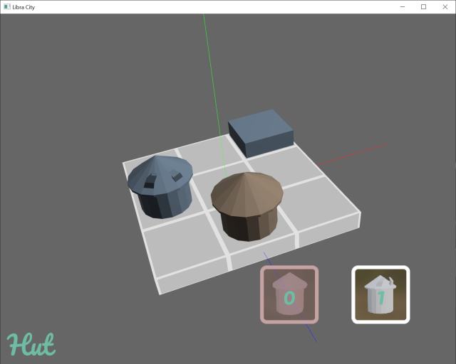
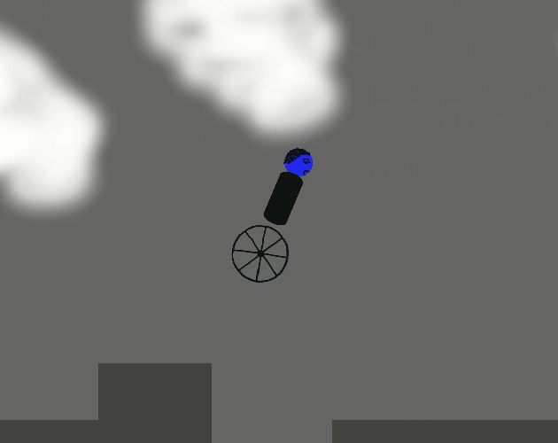

+++
title = "This Month in Rust GameDev #27 - October 2021"
transparent = true
date = 2021-11-04
draft = true
+++

<!-- no toc -->

<!-- Check the post with markdownlint-->

Welcome to the 27th issue of the Rust GameDev Workgroup's
monthly newsletter.
[Rust] is a systems language pursuing the trifecta:
safety, concurrency, and speed.
These goals are well-aligned with game development.
We hope to build an inviting ecosystem for anyone wishing
to use Rust in their development process!
Want to get involved? [Join the Rust GameDev working group!][join]

You can follow the newsletter creation process
by watching [the coordination issues][coordination].
Want something mentioned in the next newsletter?
[Send us a pull request][pr].
Feel free to send PRs about your own projects!

[Rust]: https://rust-lang.org
[join]: https://github.com/rust-gamedev/wg#join-the-fun
[pr]: https://github.com/rust-gamedev/rust-gamedev.github.io
[coordination]: https://github.com/rust-gamedev/rust-gamedev.github.io/issues?q=label%3Acoordination

[Rust]: https://rust-lang.org
[join]: https://github.com/rust-gamedev/wg#join-the-fun

- [Game Updates](#game-updates)
- [Learning Material Updates](#learning-material-updates)
- [Engine Updates](#engine-updates)
- [Tooling Updates](#tooling-updates)
- [Library Updates](#library-updates)
- [Popular Workgroup Issues in Github](#popular-workgroup-issues-in-github)
- [Meeting Minutes](#meeting-minutes)
- [Discussions](#discussions)
- [Requests for Contribution](#requests-for-contribution)
- [Jobs](#jobs)
- [Bonus](#bonus)

<!--
Ideal section structure is:

```
### [Title]


_image caption_

A paragraph or two with a summary and [useful links].

_Discussions:
[/r/rust](https://reddit.com/r/rust/todo),
[twitter](https://twitter.com/todo/status/123456)_

[Title]: https://first.link
[useful links]: https://other.link
```

If needed, a section can be split into subsections with a "------" delimiter.
-->

## Game Updates

### [The Process]


_Firing Carrockets™!_

[The Process] by @setzer22 is an upcoming game about factory building, process
management, and carrot production, built with Rust using the Godot game engine!

For the past two months the project has seen some slow but steady progress. Work
has started towards a simple combat system that will have the engineers fighting
hordes of robots to defend their factories.

This month the game has seen the following changes and improvements:

- New assets like
  [a robot enemy](https://twitter.com/PlayTheProcess/status/1436722776186966023)
  (concept by @Kath_Art_ic, modelling by @mkdirsrc),
  [a shoulder mounted gun](https://twitter.com/PlayTheProcess/status/1439970905220960259)
  and
  [new machine icons](https://twitter.com/PlayTheProcess/status/1455232744573788162).
- A new system to attach armor-like models to in-game characters.
- Foundations of a combat system.
- Carrockets™! 🥕🚀 [(1)](https://twitter.com/PlayTheProcess/status/1445098719326658562)
  and
  [(2)](https://twitter.com/PlayTheProcess/status/1454787650657951745)

[The Process]: https://twitter.com/PlayTheProcess

### [LibraCity] - city planning on a needle!



[LibraCity] is a puzzle city planning game by [@djeedai] where you need to build
a city while balancing it on a needle (the center of the board). It was built for
[Ludum Dare 49] using the [Bevy Engine], and is a first-time use of the engine.

Post-jam, a webassembly version was added and published, which now allows
[playing the game online](https://djeedai.github.io/libracity/).

The code source is freely [available on GitHub](https://github.com/djeedai/libracity).

[LibraCity]: https://djeedai.github.io/libracity/
[Ludum Dare 49]: https://ldjam.com/events/ludum-dare/49/libra-city
[@djeedai]: https://twitter.com/djeedai
[Bevy Engine]: https://bevyengine.org/

### [Berry Run]


[Berry Run] is a bad game by [@bombfuse_dev] built on top of
[Emerald Engine], follow them on twitter, they're cool.

"Dodge the babies (no kids, no babies), evade the grannies
(they're heading to the grand canyon),
and don't touch belf (belf is sacred).
Also a bunch of dunces left their logs and rocks lying around,
better not to touch those, it would be rude to touch someone's logs and rocks."

[Berry Run]: https://bombfuse.itch.io/berry-run/
[Emerald Engine]: https://github.com/Bombfuse/emerald
[@bombfuse_dev]: https://twitter.com/bombfuse_dev

### [Me And My Unicycle]


_Can you handle this unstable ride?_

[Me And My Unicycle] is a 2D physics game by [@nikl_me] submitted to Ludum
Dare 49. It is build with [Bevy] and [the code can be found on GitHub][mamu-source].

Following the LD49 theme "unstable", the game is about riding a unicycle
with challenging controls. Try making it through each level without falling.

All assets are self-made. The developer had a lot of fun recording audio and
sound effects!

[Me And My Unicycle]: https://niklme.itch.io/me-and-my-unicycle
[Bevy]: https://github.com/bevyengine/bevy
[@nikl_me]: https://twitter.com/nikl_me
[mamu-source]: https://github.com/NiklasEi/me_and_my_unicycle

### [Lonely Star]


[Lonely Star] is a 2D 'endless runner' game by [@17cupsofcoffee], featuring
simple generative music. It was built with [Tetra] back in February 2020,
for Weekly Game Jam 135.

This month, it was made [open-source][lonely-star-source], and received a
small update to improve the UI and fix a few bugs.

[Lonely Star]: https://17cupsofcoffee.itch.io/lonely-star
[Tetra]: https://github.com/17cupsofcoffee/tetra
[@17cupsofcoffee]: https://twitter.com/17cupsofcoffee
[lonely-star-source]: https://github.com/17cupsofcoffee/lonely-star

### [Soldank]


[Soldank] ([GitHub](https://github.com/smokku/soldank),
[Discord](https://discord.gg/cTaC4UtqE6)) by [@smokku](https://twitter.com/smokkku)
is an open source clone of [Soldat] engine. It aims for full compatibility
with original game files, mods and gameplay with modernized
graphics engine and multiplayer networking code.

Recent developments include:

- Engine/game code split
- Command Line Interface
- [Rhai] scripting
- `hecs_rapier` integration
- Key/mouse-binding support
- Soldat's `.cfg` files support
- Custom debug shapes rendering
- Performance degradation fix
- Refactored code to build on `hecs` ECS
- ECS entities debug UI

The developer have also written a blog post:
'_[Engine and scripting](https://abadcafe.wordpress.com/2021/11/01/engine-and-scripting/)_'

[Soldank]: https://github.com/smokku/soldank
[Soldat]: http://soldat.pl/
[Rhai]: http://rhai.rs/

### [Graph Game]


_Navigating the graph map can be stressful_

[Graph Game] ([GitHub][graph-game-github])
uses [Bevy](https://bevyengine.org/) as its engine. You can play it from your
[browser](https://vrixyz.github.io/graph_nav/) - click on colored triangles,
guess the rules and survive as long as possible!

Development has just begun, and the future of the project is not clear -
the developer welcomes you to come and discuss next steps on the game's
[Discord server][graph-game-discord].

[Graph Game]: https://vrixyz.github.io/graph_nav/
[graph-game-github]: https://github.com/Vrixyz/graph_nav
[graph-game-discord]: https://discord.gg/ZeRkj8pD4n

### [Way of Rhea][wor]


[Way of Rhea][wor] is a puzzle adventure with hard puzzles and forgiving
mechanics. It is being produced by [@masonremaley][wor-mason-remaley].

Latest developments:

- Way of Rhea now has a [free demo available on Steam][wor]
- Way of Rhea was shown at [PAX West][wor-pax-west] this year (as were a couple
 other Rust games!), and will also be showcased at [MAGWest][wor-magwest]
- A new trailer showing off new level art [was published][wor-trailer]
- Additional animation work, [visuals][wor-wildlife], and puzzles have been
added to the game
- Improvements were made to the undo system, the tutorial level, and the
dialogue system in response to user feedback
- Some Proton compatibility problems were fixed, some visual glitches were
fixed, and support was added for adaptvie vsync

You can stay up to date on the latest developments of Way of Rhea by
[following it on Steam][wor], or signing up for
[the mailing list.][wor-newsletter]

[wor]: https://store.steampowered.com/app/1110620/Way_of_Rhea/?utm_campaign=tmirgd&utm_source=n27
[wor-mason-remaley]: https://twitter.com/masonremaley
[wor-pax-west]: https://west.paxsite.com/
[wor-magwest]: https://www.magwest.org/
[wor-trailer]: https://www.youtube.com/watch?v=46ELQYaH0uw
[wor-wildlife]: https://twitter.com/AnthropicSt/status/1448056148138119169
[wor-newsletter]: https://www.anthropicstudios.com/newsletter/signup

## Engine Updates

### [All is Cubes][All is Cubes] 0.3.0

[![Screenshot of All is Cubes][all-is-cubes-screen]][all-is-cubes-screen]

All is Cubes ([GitHub][All is Cubes], [Crates.io][all-is-cubes-cr]) by [kpreid]
is a game/engine for worlds made of blocks made of voxels. It is intended to be
usable both as an engine or rendering library, or as a game with built-in
editor/programming functionality (genre(s) to be determined). While the project
is still highly incomplete and API-unstable, the 0.3.0 release marks a lot of
now-usable functionality ([changelog][all-is-cubes-changelog]):

- UI: mouselook, multiple example scenes, inventory with stacks, and rendering
  to image files.
- Simulation/mechanics: character collision against arbitrary voxel shapes,
  much-improved light propagation, transactional state updates (all-or-nothing,
  internally order-independent), and “behaviors” attached to game objects for
  scripting/animation.
- Rendering: high-voxel-count blocks (incomplete, but usable for text as seen in
  the above screenshot), “smooth lighting” (interpolated across faces), frustum
  culling, and correct sRGB-versus-linear color handling.

The next planned milestone is saving/loading.

[All is Cubes]: https://github.com/kpreid/all-is-cubes/
[all-is-cubes-cr]: https://crates.io/crates/all-is-cubes
[all-is-cubes-screen]: all-is-cubes.jpg
[all-is-cubes-changelog]: https://github.com/kpreid/all-is-cubes/blob/main/CHANGELOG.md#030-2021-10-09
[kpreid]: https://github.com/kpreid

### [Tetra] 0.6.6

[Tetra] is a simple 2D game framework, inspired by XNA, Love2D, and Raylib. After
a few quiet months, version 0.6.6 has been released, featuring:

- A big overhaul of the keyboard API, with better support for international
  layouts
- Lots of new functions for manipulating the game window
- A long-requested [ECS example][tetra-ecs]
- Bugfixes and docs improvements

For more details, see the [changelog][tetra-changelog].

[Tetra]: https://github.com/17cupsofcoffee/tetra
[tetra-changelog]: https://github.com/17cupsofcoffee/tetra/blob/main/CHANGELOG.md
[tetra-ecs]: https://github.com/17cupsofcoffee/tetra/blob/main/examples/ecs.rs

## Learning Material Updates

## Tooling Updates

### [SPV]


[SPV] by [Albin Sjögren]
is a calculator utility for working with astronomical position and velocity data.

What was added for the first alpha release:

- A new UI
- Corrected vector normalizing
- JSON and TXT exporting

The primary features that are being worked on:

- A crate version
- Output file structure
- Batch processing

For any feature requests, reach out to the developer on [Discord][spv-discord]
or [GitHub][spv].

[SPV]: https://github.com/AlbinSjoegren/SPV
[spv-discord]: https://discordapp.com/users/258254056185659392
[Albin Sjögren]: https://github.com/AlbinSjoegren

## Library Updates

### [wgpu]-0.11 release


_experimental Bevy branch running on WebGL2 via wgpu_

The team is happy to announce the release of wgpu-0.11 and naga-0.7.
Details can be found on the [gfx-rs blog]. The most exciting feature
is WebGL2 support. With some caveats, users no longer need to wait for
WebGPU in the browsers in order to deploy on the Web. Support is still
a bit rough, and patches come out regularly, but most examples work.

@kvark also visited [Rust LA Meetup] to [talk about Naga]
and the history of processing shaders with Rust.

[wgpu]: https://github.com/gfx-rs/wgpu
[gfx-rs blog]: https://gfx-rs.github.io/2021/10/07/release-0.11.html
[Rust LA Meetup]: https://rustlang.la/
[talk about Naga]: https://vimeo.com/632377558

### [hecs_rapier] 0.11.0

[hecs_rapier] is a physics engine for hecs ECS.
It is a direct port of [bevy_rapier2d].

Recent development added joints and physics_hooks support.
This makes `hecs_rapier` feature complete, with `bevy_rapier2d` feature parity.

[hecs_rapier]: https://github.com/smokku/hecs_rapier
[bevy_rapier2d]: https://github.com/dimforge/bevy_rapier

### [bevy_kira_audio]

[bevy_kira_audio] is a [Bevy] plugin that integrates the audio library [Kira]
into [Bevy] applications.

In the latest version `0.6.0`, you can load files with custom semantic
durations and play looped audio with an intro. The plugin now also cleans up
old sound instances. Following Bevy, [bevy_kira_audio] is now licensed under
dual MIT + Apache 2.0, and the library will no longer crash on systems without
an audio device.

[bevy_kira_audio]: https://github.com/NiklasEi/bevy_kira_audio
[Bevy]: https://github.com/bevyengine/bevy
[Kira]: https://github.com/tesselode/kira

### [bevy_verlet]


[bevy_verlet] is a lib for projects using [Bevy Engine][bv_bevy]
providing a plugin to use [verlet integration][bv_wikipedia]
physics. Very useful for cloth simulation and joints, and less expensive than
complex physics engine, it is a nice addition to 2D or 3D projects. Making good
use of the Entity-Component-System architecture of the bevy engine, any entity
can become a `VerletPoint` and have physics applied to it.

The crate also provides *sticks* which constrains the points in order to create
strings or cloth. With its modularity, you may customize the physics precision
(iterations), the gravity, and the physics time step to use.

New features:

- Query parallel batching and custom batching size
- Global documentation
- Fixed issues with timesteps
- Improved examples

You may contact the author on Twitter at [@ManevilleF][ManevilleF] or join the
[discussion][bv_discussion].

[bevy_verlet]: https://github.com/ManevilleF/bevy_verlet
[bv_discussion]: https://twitter.com/ManevilleF/status/1437350669858611202?s=20
[ManevilleF]: https://twitter.com/ManevilleF
[bv_bevy]: https://bevyengine.org/
[bv_wikipedia]: https://en.wikipedia.org/wiki/Verlet_integration

### [Bevy Pen Tool][bevy-pen-tool]


Bevy Pen Tool is a plugin that helps developers make 2D paths using
Bezier curves. Its user interface provides functionality for:

- spawning Bezier curves,
- moving end points and control points of Bezier curves,
- linking individual Bezier curves to each other,
- grouping curves,
- saving and loading paths as look-up tables
    (typically for animations and agent movement),
- generating arbitrary 2D meshes that fill the interior of a path
    using the Lyon crate,
- generating a mesh that follows a path like a road,
- saving meshes and roads in ".obj" format,

A stable version of Bevy Pen Tool should come out as a crate shortly
after Bevy 0.6 shows up. Here is a link to the [repo for more
information][bevy-pen-tool].

[bevy-pen-tool]: https://github.com/eliotbo/bevy_pen_tool

### [godot-rust](https://github.com/godot-rust/godot-rust)


godot-rust ([GitHub][gd-github], [Discord][gd-discord], [Twitter][gd-twitter])
is a Rust library that provides bindings for the Godot game engine.

Recent developments have added [foundational support to async][gd-async]
that enables users to make use of the Rust async runtimes with the Godot Engine
(thanks to chitoyuu for the PR).

In addition to the foundational support, lyonbeckers was kind enough to
include a [new recipe in the User Guide][gd-async-recipe] that covers
how to configure async with `tokio`.

The team also merged several smaller bug fixes in [#791][gd-791], [#795][gd-795],
and [#800][gd-800] and is making steady progress towards version 0.10.0.

Finally, the team has recently added a [third party project][gd-book-projects]
section in the book to help promote games, applications, and libraries/tools
that are working with godot-rust. If you have a project that you would like to
be included, please feel free to reach out to the godot-rust team.

[gd-async]: https://github.com/godot-rust/godot-rust/pull/804
[gd-async-recipe]: https://github.com/godot-rust/book/pull/44

[gd-800]: https://github.com/godot-rust/godot-rust/pull/800
[gd-795]: https://github.com/godot-rust/godot-rust/pull/795
[gd-791]: https://github.com/godot-rust/godot-rust/pull/791
[gd-788]: https://github.com/godot-rust/godot-rust/pull/788

[gd-book-projects]: https://godot-rust.github.io/book/projects.html

[gd-docs]: https://godot-rust.github.io/docs
[gd-github]: https://github.com/godot-rust/godot-rust
[gd-discord]: https://discord.com/invite/FNudpBD
[gd-twitter]: https://twitter.com/GodotRust

## Popular Workgroup Issues in Github

<!-- Up to 10 links to interesting issues -->

## Meeting Minutes

<!-- Up to 10 most important notes + a link to the full details -->

[See all meeting issues][label_meeting] including full text notes
or [join the next meeting][join].

[label_meeting]: https://github.com/rust-gamedev/wg/issues?q=label%3Ameeting

## Discussions

<!-- Links to handpicked reddit/twitter/urlo/etc threads that provide
useful information -->

## Requests for Contribution

<!-- Links to "good first issue"-labels or direct links to specific tasks -->

## Jobs

<!-- An optional section for new jobs related to Rust gamedev -->

## Bonus

<!-- Bonus section to make the newsletter more interesting
and highlight events from the past. -->

------

That's all news for today, thanks for reading!

Want something mentioned in the next newsletter?
[Send us a pull request][pr].

Also, subscribe to [@rust_gamedev on Twitter][@rust_gamedev]
or [/r/rust_gamedev subreddit][/r/rust_gamedev] if you want to receive fresh news!

<!--
TODO: Add real links and un-comment once this post is published
**Discuss this post on**:
[/r/rust_gamedev](TODO),
[Twitter](TODO),
[Discord](https://discord.gg/yNtPTb2).
-->

[/r/rust_gamedev]: https://reddit.com/r/rust_gamedev
[@rust_gamedev]: https://twitter.com/rust_gamedev
[pr]: https://github.com/rust-gamedev/rust-gamedev.github.io
