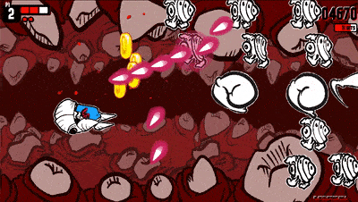
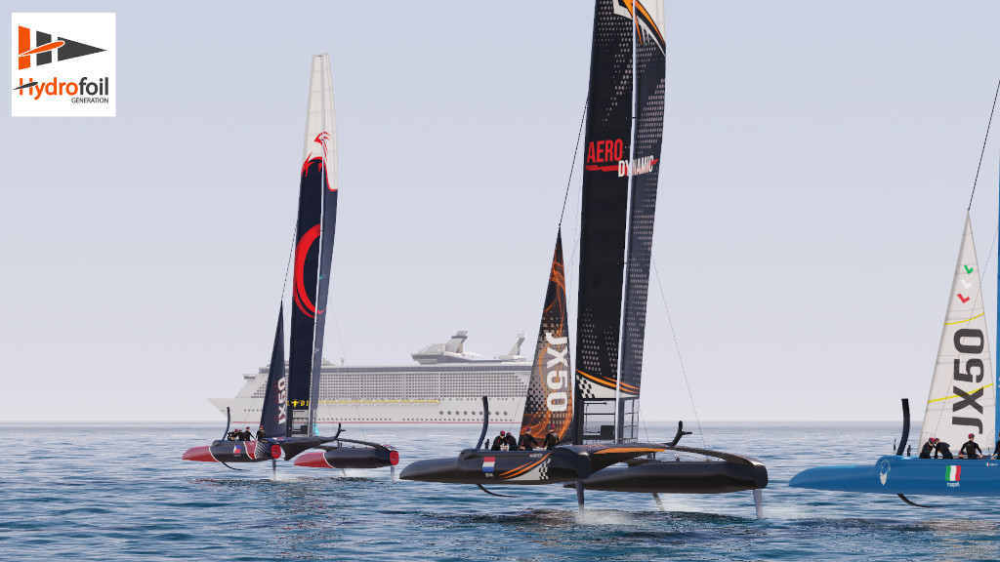

+++
title = "This Month in Rust GameDev #28 - November 2021"
transparent = true
date = 2021-12-08
+++

<!-- no toc -->

<!-- Check the post with markdownlint-->

Welcome to the 28th issue of the Rust GameDev Workgroup's monthly newsletter.
[Rust] is a systems language pursuing the trifecta: safety, concurrency, and
speed. These goals are well-aligned with game development. We hope to build an
inviting ecosystem for anyone wishing to use Rust in their development process!
Want to get involved? [Join the Rust GameDev working group!][join]

You can follow the newsletter creation process by watching [the coordination
issues][coordination]. Want something mentioned in the next newsletter? [Send us
a pull request][pr]. Feel free to send PRs about your own projects!

[Rust]: https://rust-lang.org
[join]: https://github.com/rust-gamedev/wg#join-the-fun
[pr]: https://github.com/rust-gamedev/rust-gamedev.github.io
[coordination]: https://github.com/rust-gamedev/rust-gamedev.github.io/issues?q=label%3Acoordination
[Rust]: https://rust-lang.org
[join]: https://github.com/rust-gamedev/wg#join-the-fun

- [Game Updates](#game-updates)
- [Learning Material Updates](#learning-material-updates)
- [Engine Updates](#engine-updates)
- [Tooling Updates](#tooling-updates)
- [Library Updates](#library-updates)
- [Popular Workgroup Issues in Github](#popular-workgroup-issues-in-github)
- [Meeting Minutes](#meeting-minutes)
- [Discussions](#discussions)
- [Requests for Contribution](#requests-for-contribution)
- [Jobs](#jobs)
- [Bonus](#bonus)

<!--
Ideal section structure is:

```
### [Title]


_image caption_

A paragraph or two with a summary and [useful links].

_Discussions:
[/r/rust](https://reddit.com/r/rust/todo),
[twitter](https://twitter.com/todo/status/123456)_

[Title]: https://first.link
[useful links]: https://other.link
```

If needed, a section can be split into subsections with a "------" delimiter.
-->

## Rust GameDev Meetup


The eleventh Rust Gamedev Meetup happened in November. You can watch the
recording of the meetup [here on Youtube][gamedev-meetup-video]. The meetups
take place on the second Saturday every month via the [Rust Gamedev Discord
server][rust-gamedev-discord] and are also [streamed on
Twitch][rust-gamedev-twitch]. If you would like to show off what you've been
working on at the next meetup on [December 11th][rust-meetup-dec-time], fill out
[this form][gamedev-meetup-form].

[gamedev-meetup-video]: https://youtu.be/nLyiLnC5mn4
[rust-gamedev-discord]: https://discord.gg/yNtPTb2
[rust-gamedev-twitch]: https://twitch.tv/rustgamedev
[gamedev-meetup-form]: https://forms.gle/BS1zCyZaiUFSUHxe6
[rust-meetup-dec-time]: https://everytimezone.com/s/bb9cdaec

## Game Updates

### Flesh


_The melee weapon in action_

[Flesh] by [@im_oab] is a 2D-horizontal shmup game with hand-drawn animation and
organic/fleshy theme. It is implemented using [Tetra]. This month's updates
include:

- Support different types of ships that players can choose.
- Add a melee weapon.

[Flesh]: https://store.steampowered.com/app/1660850/Flesh/
[@im_oab]: https://twitter.com/im_oab
[Tetra]: https://github.com/17cupsofcoffee/tetra

### [One-Click Ninja]


_Screenshot of One-Click Ninja_

One-Click Ninja is a rhythm game made in 10 days for [1-Button Jam 2021],
written in Rust using the [Bevy] engine.

The source is available MIT licensed on [GitHub][One-Click Ninja], and you can
[play in your browser on itch.io][One-Click Ninja itch.io].

[One-Click Ninja]: https://github.com/fluffysquirrels/one-click-ninja
[One-Click Ninja itch.io]: https://fluffysquirrels.itch.io/one-click-ninja
[1-Button Jam 2021]: https://itch.io/jam/1-button-jam-2021
[Bevy]: https://bevyengine.org

### [Fish Fight: The Prequel][fishfight-steam]

[][fishfight-steam]

Fish Fight is a fast-paced 2D brawler game, played by 1-4 players online or on a
shared screen, built with [macroquad] game engine.

This month it got a trailer, and the game is now available to wishlist on
[Steam][fishfight-steam]!

[macroquad]: https://github.com/not-fl3/macroquad
[fishfight-github]: https://github.com/FishFight/FishFightThePrequel
[fishfight-steam]: https://store.steampowered.com/app/1771640/Fish_Fight_The_Prequel/

### [BITGUN][bitgun-steam]

[][bitgun-steam]

BITGUN ([Steam][bitgun-steam], [Twitter][bitgun-twitter],
[Discord][bitgun-discord]) by [@LogLogGames][bitgun-twitter] is an action
roguelike zombie shooter with lots of blood. The game is built using Godot and
Rust (via [godot-rust][bitgun-godot-rust]).

They recently implemented a mission system, where you can select one of [three
types of missions][bitgun-missions] to go to from the central camp. One is to
defend supplies from horde of zombies, second is to search a facility for some
object or clear all the zombies and the last one is to fight your way through a
tunnel full of spiders and other enemies! They also worked on a
[tutorial][bitgun-tutorial].

[bitgun-steam]: https://store.steampowered.com/app/1673940/BITGUN/
[bitgun-twitter]: https://twitter.com/logloggames
[bitgun-discord]: https://discord.gg/XrGZQkq
[bitgun-godot-rust]: https://godot-rust.github.io/
[bitgun-missions]: https://twitter.com/LogLogGames/status/1464009563976392713?s=20
[bitgun-tutorial]: https://twitter.com/LogLogGames/status/1461898845810348033?s=20

### [Halloween Mahjong Solitaire][mahjong-github]


_Screenshot of Halloween Mahjong Solitaire_

Halloween Mahjong Solitaire ([GitHub][mahjong-github]) by
[@Syn-Nine][synnine-twitter] is a game created by Syn9 for [Game Developers
Refuge 4x4x4 Challenge], October 2021.

The challenge was to create a Halloween themed game based on four emojis. In
this case the chosen emoji combination was: skull_and_crossbones, bat, game_die,
and shinto_shrine (☠️ 🦇 🎲 ⛩️).

The game is part of an open source repository of several mini-games that use
Syn9's [Rust Mini Game Framework][mgfw].

[mahjong-github]: https://github.com/Syn-Nine/rust-mini-games/tree/main/2d-games/mahjong
[synnine-twitter]: https://twitter.com/Syn9Dev
[Game Developers Refuge 4x4x4 Challenge]: http://noop.rocks/gdr/viewtopic.php?f=2&t=70
[mgfw]: https://github.com/Syn-Nine/mgfw

### Country Slice


[Country Slice][country-slice-github] is
[@anastasiaopara][country-slice-twitter]'s hobby project, where users can draw a
small scene, and their input is amplified with real-time procedural geometry
generation.

Country Slice uses [Bevy Engine][bevy-link] for entity management, and has
recently [been ported to OpenGL][country-slice-twitter-opengl] (using
[gl-rs][gl-rs-link] and [glutin][glutin-link]). It is being developed openly on
[GitHub][country-slice-github].

You can follow the development of Country Slice on
[Twitter][country-slice-twitter].

[country-slice-github]: https://github.com/anopara/country-slice
[country-slice-twitter]: https://twitter.com/anastasiaopara/
[country-slice-twitter-opengl]: https://twitter.com/anastasiaopara/status/1464304076074672144?s=20
[bevy-link]: https://github.com/bevyengine/bevy
[gl-rs-link]: https://github.com/brendanzab/gl-rs/tree/master/gl
[glutin-link]: https://github.com/rust-windowing/glutin

### [Veloren][veloren]


_A merchant paused in their travels_

[Veloren][veloren] is an open world, open-source voxel RPG inspired by Dwarf
Fortress and Cube World.

In November, Veloren started a new initiative to help new developers learn more
about the codebase; the Veloren Reading Club. You can watch the
[first][veloren-reading-club-1] and [second][veloren-reading-club-2] sessions
now. Hats were merged, and a major rewrite of the server-hosting section of the
book happened. New textures were made for item drops. Some concept art was
created for what massive cities could look like. Dynamic weather was added, and
you can [watch that in action][veloren-rain-storm].

Experience sharing went through a large overhaul to evenly distribute EXP gained
across groups. The difficulty of dungeons was adjusted to be more balanced for
new players. Persistence was added to skills, and measures were put in place to
help with future migrations to new skill trees. Work was done on site2, the
system that is used to generate structures in a procedural way. This will help
make the variance more dynamic by adding more parameters that can be adjusted.
In December, Veloren will release 0.12, hopefully with some holiday spirit!

November's full weekly devlogs: "This Week In Veloren...":
[#144][veloren-144],
[#145][veloren-145],
[#146][veloren-146],
[#147][veloren-147],
[#148][veloren-148].

[veloren]: https://veloren.net
[veloren-144]: https://veloren.net/devblog-144
[veloren-145]: https://veloren.net/devblog-145
[veloren-146]: https://veloren.net/devblog-146
[veloren-147]: https://veloren.net/devblog-147
[veloren-148]: https://veloren.net/devblog-148
[veloren-reading-club-1]: https://www.youtube.com/watch?v=DpXwYEe_LWo
[veloren-reading-club-2]: https://www.youtube.com/watch?v=n8XayRvVBEs
[veloren-rain-storm]: https://www.youtube.com/watch?v=MZwfaohynvc

### [BENDYWORM]

 _Watch out! The entire world bends around you!_

BENDYWORM ([GitHub][BENDYWORM-github], [Twitter][BENDYWORM-twitter], by
[@bauxitedev][BENDYWORM-bauxitedev]) is a platformer with a twist: the entire
world bends and twists around you as your progress through the level. Why?
Because you're inside of a gigantic worm, and worms are bendy.

The game was made for GitHub Game Off 2021, and uses `godot-rust` behind the
scenes.

The game is available for free on [itch.io][BENDYWORM-itch.io], and the source
code is available on [GitHub][BENDYWORM-github].  (Windows only for now, Linux
build available soon)

_Discussions:
[/r/rust/][BENDYWORM-reddit],
[Twitter][BENDYWORM-twitter]_

[BENDYWORM]: https://bauxite.itch.io/bendyworm
[BENDYWORM-bauxitedev]: https://twitter.com/bauxitedev
[BENDYWORM-twitter]: https://twitter.com/bauxitedev/status/1466034866122891266
[BENDYWORM-itch.io]: https://bauxite.itch.io/bendyworm
[BENDYWORM-github]: https://github.com/Bauxitedev/bendyworm
[BENDYWORM-reddit]: https://www.reddit.com/r/rust/comments/r742z1/

### [Molecoole][molecoole-steam]

[][molecoole-steam]

Molecoole is a top-down shooter roguelike where you build your character from
different atoms. Each atom has a unique ability providing tons of variety
between playthroughs. It's made using the [Bevy
Engine](https://github.com/bevyengine/bevy).

This month Molecoole launched its [Steam page][molecoole-steam]! They also added
[new weapons][weapon-twitter] and new [bosses][boss-twitter].

In December their main focus will be on audio, and polishing the game.

[molecoole-steam]: https://store.steampowered.com/app/1792170/Molecoole/
[weapon-twitter]: https://twitter.com/kiss_mrton/status/1459567092995403776
[boss-twitter]: https://twitter.com/kiss_mrton/status/1457022034949689351

### [Hydrofoil Generation]



[Hydrofoil Generation] ([Facebook][hgs_facebook], [Discord][hgs_discord]) is a
realistic sailing/foiling inshore simulator in development for PC/Steam that
will put you in the driving seat of modern competitive sailing.

November was dedicated to the launch of the [Steam Store][hgs_steam] page and
associated [trailer][hgs_trailer] showcasing Hydrofoil Generation's custom Rust
engine in motion for the first time. Constant tweaks to the boat behavior and
addition of gameplay features are ongoing as the planned Q2 2022 Steam Early
Access release gets closer and closer.

December 2021 will see an attempt to port the rendering backend of the game from
DirectX 11 to WGPU in order to widen the number of platforms reacheable with a
particular interest in the Steam Deck that seems to offer the perfect controller
layout for such a demanding simulation as Hydrofoil Generation.

You will be able to follow the progress of the port Mondays and Fridays on
[Twitch][hgs_twitch].

[Hydrofoil Generation]: https://hydrofoil-generation.com/
[hgs_facebook]: https://www.facebook.com/HydrofoilGenerationSailing/
[hgs_discord]: https://discord.gg/DtKgt2duAy/
[hgs_steam]: https://store.steampowered.com/app/1448820/Hydrofoil_Generation/
[hgs_trailer]: https://youtu.be/CfmCLr19Hbs
[hgs_twitch]: https://www.twitch.tv/kunosstefano

### Idu


Idu ([Discord][idu-discord]) by [@logicsoup] and [@epcc10] is an upcoming game
centered around growing realistic plants.

In November, a new major update was released that overhauled the automatic
watering system. In addition, an automatic stair builder and a grass cutting
tool was added to reduce the tediousness of these common tasks.

A free playable alpha demo is available at [Idu's Discord server's
#demo-download channel][idu-discord]! Updates are posted to their
[Youtube][idu-youtube] as well.

[@logicsoup]: https://twitter.com/logicsoup
[@epcc10]: https://twitter.com/epcc10
[idu-discord]: https://discord.gg/PR3GgYYkym
[idu-youtube]: https://www.youtube.com/channel/UC1JmPXgbR5R2dCsM_QJGe1w

### [Combine&Conquer][cnc-logs]


Combine&Conquer by [Martin Buck][@I3ck] is a WIP strategy game about automation
similar to Satisfactory or Factorio.

This month Martin finished [writing a detailed devlog][cnc-logs] for the project
from first commit up until now. A few dozens of short posts cover variuos topics
including: simulation of arms and conveyor belts with moving items, blueprints,
testing, rendering, save and load, tech tree and research, and multiplayer.

_Discussions:
[/r/rust_gamedev](https://reddit.com/r/rust_gamedev/comments/qj03ji/cnc)_

[cnc-logs]: https://buckmartin.de/combine-and-conquer.html
[@I3ck]: https://github.com/I3ck

### [PaddlePunks][paddlepunks-itch]

 _One of the
characters can spend super meter to rewind time, this is strong but pretty
situational._

PaddlePunks is a versus tennis game by [Felix Windström][paddlepunks-twitter]
with a diverse cast of characters and playstyles and online play with rollback
netcode.

Latest developments:

- Some engine work to improve performance on laptops with integrated GPUs
- Balance updates to make the skeleton less overbearing
- Presented the game at [Rustfest][paddlepunks-rustfest] in an interactive
  session.

You can download and play the game now on [itch.io][paddlepunks-itch], or join
the [Discord][paddlepunks-discord] to chat with the developer and other players.

[paddlepunks-twitter]: https://twitter.com/sov_gott_games
[paddlepunks-itch]: https://sovgott.itch.io/paddlepunks
[paddlepunks-discord]: https://discord.gg/cpPDeVcWxc
[paddlepunks-rustfest]: https://watch.rustfest.global/

### [Shroom Kingdom][shroom-kingdom]

Shroom Kingdom ([GitHub][shrm-github], [Discord][shrm-discord],
[Twitter][shrm-twitter]) is an upcoming play-to-earn video game built with web
technologies running on the [NEAR Blockchain][near-blockchain]. It is a 2D
platformer, where players can also build their own levels and share them with
others.

Currently a prototype of the game is in development. The game is written with
the [Bevy game engine][bevy] and the [Rapier physics engine][rapier] and is
compiled to WebAssembly. The prototype is still very basic, but you can already
place and remove blocks and have a feeling about the physics recreation of the
original games.

In the past months there also has been the SHRM token launch and a [token
airdrop][shrm-airdrop] for NEAR early adopters. The [Shroom Kingdom
DAO][shrm-dao] is looking for people, who want to become involved and get paid
with their very own token.

To onboard new users to blockchain gaming, a [linkdrop campaign][shrm-linkdrop]
is currently in development, where people can claim a small amount of NEAR token
to create their own wallet.

[shroom-kingdom]: https://shroomkingdom.net/
[shrm-github]: https://github.com/Shroom-Kingdom
[shrm-discord]: https://discord.gg/SPZsgSe
[shrm-twitter]: https://twitter.com/shrm_kingdom
[near-blockchain]: https://near.org
[bevy]: https://bevyengine.org/
[rapier]: https://rapier.rs/
[shrm-airdrop]: https://twitter.com/shrm_kingdom/status/1450362543608901634?s=20
[shrm-dao]: https://whitepaper.shroomkingdom.net/8_DAO.html
[shrm-linkdrop]: https://linkdrop.shroomkingdom.net/

## Engine Updates

### [Tetra] 0.6.7

[Tetra] is a simple 2D game framework, inspired by XNA, Love2D, and Raylib. This
month, version 0.6.7 was released, featuring:

- Updates to the gamepad backend, adding rumble support for a much wider variety
  of controllers (including DualShock 4s)
- Various bugfixes and docs improvements

For more details, see the [changelog][tetra-changelog].

Additionally, development has begun on version 0.7 - check out [the planned
features and changes][tetra-07], and feel free to suggest more!

[Tetra]: https://github.com/17cupsofcoffee/tetra
[tetra-changelog]: https://github.com/17cupsofcoffee/tetra/blob/main/CHANGELOG.md
[tetra-07]: https://github.com/17cupsofcoffee/tetra/issues/297

### [Oxygengine] v0.24.0


The hottest HTML5 + WASM game engine for games written in Rust with web-sys.

[@PsichiX], the creator of [Oxygengine], spent last two months on making:

- First few chapters of the book explaining how Oxygengine works in: [Oxygengine
  Essentials Book][oxygengine-book].
- New hardware-accelerated renderer based on Material Graphs (to allow making
  faster and better quality game visuals - more about that in [Material Graph
  based rendering][oxygengine-material-graph] chapter).
- New Overworld game module (which aims to provide all essential features needed
  by RPG game developers, to let them focus on making an actual game).
- New AI feature module (WIP) that integrates [Emergent AI][emergent] crate with
  the engine.
- Plugin-based asset pipeline as well as support for LDtk software projects.

All these changes marks the beginning of stabilizing phase of the engine. The
API more or less won't change much - now the focus is put entirely on the
features that will push progress towards the Ignite visual game editor for
artists and game designers to use.

[Oxygengine]: https://github.com/PsichiX/Oxygengine
[@PsichiX]: https://twitter.com/PsichiX
[oxygengine-book]: https://psichix.github.io/Oxygengine/
[oxygengine-material-graph]: https://psichix.github.io/Oxygengine/concepts/ha-renderer/introduction.html#material-graph-based-rendering
[emergent]: https://github.com/PsichiX/emergent

## Learning Material Updates

### [The Raytracer Challenge][raytracer-challenge-github]


[The Raytracer Challenge][raytracer-challenge-github] is a project with the goal
to write a raytracer from scratch in Rust, while showing each step of the way
[as a weekly live coding session][raytracer-challenge-playlist]. Everything is
documented, starting with implementing [Vectors][raytracer-challenge-vector] and
[Matrices][raytracer-challenge-matrix] all the way to creating [Phong
Lighting][raytracer-challenge-phong].

November has been a busy month for the project with lots of visual changes in
the raytraced results:

- A [camera][raytracer-challenge-camera] was added to allow arbitrary views on
  the [World][raytracer-challenge-world].

- [Basic animation support][raytracer-challenge-animation] came along allowing
  the easy creation of video sequences.

- More realistic and life-like scenes due to [Shadow
  Casting][raytracer-challenge-shadows].

- As a new basic body type [Planes][raytracer-challenge-planes] came to life.

[raytracer-challenge-github]: https://github.com/jakobwesthoff/the_ray_tracer_challenge_in_rust
[raytracer-challenge-playlist]: https://www.youtube.com/playlist?list=PLy68GuC77sUTyOUvDhVboQoOlHoa4XrSO
[raytracer-challenge-vector]: https://youtu.be/xGEDQXBMdV4
[raytracer-challenge-matrix]: https://youtu.be/RYALPW0pJr4
[raytracer-challenge-phong]: https://youtu.be/HSgS_NQob2I
[raytracer-challenge-camera]: https://youtu.be/izzp4xZfcHI
[raytracer-challenge-world]: https://youtu.be/1l54RUGigtk
[raytracer-challenge-animation]: https://youtu.be/3LinpB7ns60
[raytracer-challenge-shadows]: https://youtu.be/agqAUa1qgGo
[raytracer-challenge-planes]: https://youtu.be/4y1aRPiH9Ko

### [Rustacean Station 48][rustacean-station-48]


The [Rustacean Station][rustacean-station] is a podcast about the Rust language.

In November, [Herbert Wolverson][herbert-wolverson] [was
interviewed][rustacean-station-48] about game development in Rust. In this
episode, lots is discussed about existing game development engines, and how Rust
is breaking into this space with engines like Bevy, Amethyst, and RG3D. There is
also a discussion on the Entity Component System paradigm in comparison to
Object Oriented Programming.

[herbert-wolverson]: https://twitter.com/herberticus
[rustacean-station]: https://rustacean-station.org/
[rustacean-station-48]: https://rustacean-station.org/episode/048-herbert-wolverson/

### [Rust on the GPU][raph-blog-post]

In [this blog post][raph-blog-post], [Raph Levien] describes the current state
of coding on a graphics card. The post describes how going about writing custom
code still induces many issues in this day and age, and what modern technologies
can be used to help make this easier. [Rust-gpu] is mentioned as a possible way
to write compute shaders in a "real language".

[Rust-gpu]: https://github.com/EmbarkStudios/rust-gpu
[Raph Levien]: https://levien.com/
[raph-blog-post]: https://raphlinus.github.io/gpu/2021/11/17/prefix-sum-portable.html

### [Rust Roguelike Tutorial][rl-tut]


_A nasty demon monster at the exit to Abyss_

[The Roguelike Tutorial][rl-tut] by [@herberticus] got a [new 75th (!)
chapter][rl-tut-new] that shows how to generate a chaotic Voronoi-based city
plaza inhabited by dark elves and adds a new big demon enemy to guard the Abyss
portal.

> You can battle your way down to the Dark Elf Plaza,
> and find the gateway to Abyss - but only if you can evade a hulking demon
> and a horde of elves---with very little in the way of help offered.
> Next up, we'll begin to build the Abyss.

[@herberticus]: https://twitter.com/herberticus
[rl-tut]: http://bfnightly.bracketproductions.com/rustbook
[rl-tut-new]: http://bfnightly.bracketproductions.com/rustbook/chapter_75.html

### [Hands-on Rust][hor]


_A Dungeon Crawler running in a browser_

Another update from [@herberticus] is a bonus article for the [Hands-on
Rust][hor] book: ["Run Your Rust Games in a Browser"][hor-bonus] that guides the
reader though the basics of building and publishing [bracket-lib] games in
WebAssembly.

[hor-bonus]: https://hands-on-rust.com/2021/11/06/run-your-rust-games-in-a-browser-hands-on-rust-bonus-content/
[hor]: https://hands-on-rust.com
[bracket-lib]: https://github.com/amethyst/bracket-lib

## Tooling Updates

### [SPV]


[SPV] by [Albin Sjögren] is a calculator utility for working with astronomical
position and velocity data.

In the last month, a relative position and velocity calculation system has been
added. This is due to the inaccuracy of astronomic data. With this new method
that relies on the orbital elements of two body systems getting data for
multibody simulation is now possible.

Apart from this new equation set, [SPV] now also has a more standard color
scheme based on the one GitHub uses. This month also came with numerous bug
fixes and a more concrete plan for future development.

For any feature requests, reach out to the developer on [Discord][spv-discord]
or [GitHub][spv].

[SPV]: https://github.com/AlbinSjoegren/SPV
[spv-discord]: https://discordapp.com/users/258254056185659392
[Albin Sjögren]: https://github.com/AlbinSjoegren

### [PickPicPack] 0.1.6


[PickPicPack] ([GitHub][PPP_github], [Gumroad][PPP_gumroad]) by
[@p4ymak][p4ymak_www] is a tiny yet powerful utility for packing images into
rectangles with arbitrary aspect ratio.

It is useful for creating mood boards, daily art reports, presentations and
other collages.

Features so far:

- Interactive loading
- Scaling images to equal size
- Optional Margin between images
- Custom Aspect Ratio - now you can set aspect ratio by text in any form
- CLI - You can use it without GUI and embed to your project manager tool

[PickPicPack]: http://www.p43d.com/pickpicpack
[PPP_github]: https://github.com/p4ymak/pickpicpack
[PPP_gumroad]: https://p4ymak.gumroad.com/l/pickpicpack
[p4ymak_www]: http://www.p43d.com/p4ymak

### [Graphite][graphite-repo]


Graphite ([GitHub][graphite-repo], [Discord][graphite-discord],
[Twitter][graphite-twitter]) is an in-development vector and raster graphics
editor built on a non-destructive node-based workflow.

The previously announced Alpha release was delayed as core devs returned to
school— January is the new goal. Development now continues to pick up speed.
Design of the project website has continued for its launch soon, alongside the
Alpha release.

The project upgraded to the Rust 2021 edition and made big improvements to the
frontend TypeScript and web infrastructure. The editor UI is now fully
responsive at small window sizes. Unsaved document tabs display an `*` and warn
before closing the window. Ruler measurements now move and scale with the
document. And the new snapping system helps draw/move shapes aligned with
others.

[Try it right now in your browser.][graphite-live-demo] Graphite is making
steady progress towards becoming a non-destructive, procedural graphics editor
suitable for replacing traditional 2D DCC applications. [Join the
Discord][graphite-discord] and get involved!

[graphite-repo]: https://github.com/GraphiteEditor/Graphite
[graphite-discord]: https://discord.graphite.design
[graphite-twitter]: https://twitter.com/GraphiteEditor
[graphite-live-demo]: https://editor.graphite.design

### [Solid Editor][solid]

[][solid-video]
_A [demo video][solid-video] of using the editor_

[Solid Editor][solid] is [Solid Engine][solid-engine]'s custom built voxel
graphics editor. It is designed to be a key part of the engine's asset pipeline,
enabling creation of game-ready voxel graphics assets. Since the engine part is
pretty far from being done, the author decided to release this editor as a
standalone application.

> Besides being natively compatible with Solid Engine, the editor sports some
> generally interesting and unique features.
>
> - True WYSIWYG editing. The editor scene is rendered using Solid Engine's path
>   tracer in real time, yielding realistic lighting while editing.
> - The possibility to edit voxels directly in 3D, by using any brightly colored
>   ball as a 3D pointing device. Read more about the [Ball
>   Pointer][solid-ball].
> - A novel approach to editor tools. Instead of many different tools with
>   overlapping functionality (e.g. "draw square" vs. "select square", or
>   "bucket fill" vs. "magic wand") there is only one, a versatile Selection
>   tool. Different effects can be applied to the selected voxels, producing the
>   same results as regular editor tools. Combined with real-time effect
>   preview, the user experience is very similar to that of classic graphics
>   editors, with the added benefit of being able to tweak every edit before
>   applying it.

_Discussions:
[/r/rust_gamedev](https://reddit.com/r/rust_gamedev/comments/qrsu1n/solid_editor_a_voxel_editor)_

[solid]: https://solidengine.org/solid-editor
[solid-engine]: https://solidengine.org
[solid-video]: https://youtube.com/watch?v=GuVM3W9Pfdg
[solid-ball]: https://solidengine.org/ball-pointer

## Library Updates

### [Pixels] 0.8.0 👾

[Pixels] is a tiny hardware-accelerated pixel framebuffer. Its goals include
pixel-perfect rendering and custom shader pipelines for textures with direct
pixel access. It's perfect for making 2D animations, games, and emulators.

Version 0.8.0 was released this month, bringing highly anticipated support for
WASM targets, as well as support for Raspberry Pi 4. A [minimal example for web
browsers][pixels-web] is included to get you started. Full details are available
in the [release notes][pixels-changelog].

[pixels]: https://github.com/parasyte/pixels
[pixels-changelog]: https://github.com/parasyte/pixels/releases/tag/0.8.0
[pixels-web]: https://github.com/parasyte/pixels/tree/0.8.0/examples/minimal-web

### [Quinn]

[Quinn] is an async-enabled implementation of the state-of-the-art IETF QUIC
transport protocol, a robust foundation for real-time networking.

[Quinn 0.8][quinn_release] introduces support for the final QUIC 1 specification
defined in [RFC 9000][RFC9000]. Other highlights include an improved CUBIC
congestion controller, a more ergonomic configuration API, and numerous
performance and robustness improvements.

[Quinn]: https://github.com/quinn-rs/quinn
[RFC9000]: https://www.rfc-editor.org/rfc/rfc9000.html
[quinn_release]: https://github.com/quinn-rs/quinn/releases/tag/0.8.0

### [hecs]

[hecs] is a fast, lightweight, and unopinionated archetypal ECS library.

[Version 0.7][hecs-changelog] introduces several new features, including two new
query combinators, a `CommandBuffer` for recording operations to be applied to a
`World` at a future time, accessors for efficient random access within columns,
and a variant of `EntityBuilder` that clones its components and can therefore be
spawned from repeatedly. Other improvements include compatibility with 32-bit
MIPS and PPC, and introduction of a niche to `Entity` so that e.g.
`Option<Entity>` will not consume additional space.

[hecs]: https://github.com/Ralith/hecs
[hecs-changelog]: https://github.com/Ralith/hecs/blob/master/CHANGELOG.md#071

### [godot-rust](https://github.com/godot-rust/godot-rust)


godot-rust ([GitHub][gd-github], [Discord][gd-discord], [Twitter][gd-twitter])
is a Rust library that provides bindings for the Godot game engine.

November has been a month of refactoring for godot-rust. The API was cleaned up
across different locations, reducing confusion and making the library more
accessible:

- The module simplification ([#811][gd-811]) continued initial efforts on the
  module structure, such as shorter paths and avoidance of redundant re-exports.
  Some differences between v0.9.3 and now can be seen in the above picture.
- Several core symbols were renamed for consistency ([#815][gd-815]):
  `RefInstance` -> `TInstance` and `TypedArray` -> `PoolArray`, among others.
- Another refactoring affects the `Variant` conversion methods ([#819][gd-819]).
  Instead of `Variant::to_i64()` which may silently fail and return a default
  value (Godot behavior), the recommended method is now `Variant::to<T>()`. This
  enables genericity and is more idiomatic in Rust, returning an `Option` to
  indicate success or failure.

As a binding to a C++ library, one topic godot-rust has to deal with is the use
of `unsafe`, which sometimes boils down to a trade-off between safety and
ease-of-use. Even though Rust provides basic guidelines, there are different
philosophies on their execution, see [The CXX Debate][gd-cxx] for an example. To
discuss how APIs interacting with Godot can as ergonomic as possible while
preserving safety, [issue #808][gd-808] was opened.

[gd-808]: https://github.com/godot-rust/godot-rust/pull/808
[gd-811]: https://github.com/godot-rust/godot-rust/pull/811
[gd-815]: https://github.com/godot-rust/godot-rust/pull/815
[gd-819]: https://github.com/godot-rust/godot-rust/pull/819

[gd-cxx]: https://steveklabnik.com/writing/the-cxx-debate

[gd-github]: https://github.com/godot-rust/godot-rust
[gd-discord]: https://discord.com/invite/FNudpBD
[gd-twitter]: https://twitter.com/GodotRust

### [NavMesh] v0.12.1

NavMesh crate is a path finding library for 2D and 3D games.

This month changes by [@PsichiX]:

- Added NavGrid structure to find paths on grids.
- Added NavFreeGrid structure to find paths on cells put in free layout manner
  (used for example on clusters of cells rather than condensed grid).
- Added NavIslands structure to allow hierarchical path finding (used for
  example with streamed navigation islands, such as other path finding
  structures).

[NavMesh]: https://github.com/PsichiX/navmesh

### [Rust CUDA][rust-cuda-github]

[Rust CUDA][rust-cuda-github] by [Riccardo D'Ambrosio] is a [newly-released
project][rust-cuda-announcement] with the goal of making Rust a Tier-1 language
for fast GPU computing. There are still many bugs, and it's in an early stage.

With this release comes a few crates. [rustc_codegen_nvvm] for compiling Rust to
CUDA PTX code using rustc's custom codegen mechanisms and the libnvvm CUDA
library. [cust] for actually executing the PTX is a high-level wrapper for the
CUDA Driver API. [cuda_builder] for easily building GPU crates. [cuda_std] is
the GPU-side standard library which complements rustc_codegen_nvvm. [gpu_rand]
is a GPU-friendly random number generation. [nvvm] is high-level bindings to
libnvvm, and [ptx_compiler] is high-level bindings to the PTX compiler APIs,
which are currently incomplete. [find_cuda_helper] is for finding CUDA on the
system. There are many other works in progress.

[rustc_codegen_nvvm]: https://crates.io/crates/rustc_codegen_nvvm
[cust]: https://crates.io/crates/cust
[cuda_builder]: https://crates.io/crates/cuda_builder
[cuda_std]: https://crates.io/crates/cuda_std
[gpu_rand]: https://crates.io/crates/gpu_rand
[nvvm]: https://crates.io/crates/nvvm
[ptx_compiler]: https://crates.io/crates/ptx_compiler
[find_cuda_helper]: https://crates.io/crates/find_cuda_helper
[Riccardo D'Ambrosio]: https://github.com/RDambrosio016
[rust-cuda-github]: https://github.com/Rust-GPU/Rust-CUDA
[rust-cuda-announcement]: https://www.reddit.com/r/rust/comments/qzv428/announcing_the_rust_cuda_project_an_ecosystem_of/

## Other News

<!-- One-liners for plan items that haven't got their own sections. -->

- Other game updates:
  - [Rust Shooter] is a first person shooter.
  - [Way of Rhea] is a puzzle platformer with a focus on the puzzle side.
  - [Necrophaser] is a recently alpha-released Top-Down Shooter made with Bevy
  - [Stellary 2] is space game made in a custom engine
  - [Endless Trial] is a 2D bullet-hell game made in Tetra
- Other learning material updates:
  - [GBA From Scratch] is a tutorial on how to code for the Game Boy Advance using Rust.
  - [Ping Pong Tutorial] is a walkthrough on creating a ping pong game in Rust.
- Other engine updates:
  - [rg3d] is a 3D game engine.
  - [mini/macroquad] is a game engine.
- Other library updates:
  - [natura] is a spring animation library.

[Rust Shooter]: https://reddit.com/r/rust_gamedev/comments/r06n8o/rust_shooter_another_update
[Way of Rhea]: https://twitter.com/AnthropicSt
[Necrophaser]: https://reddit.com/r/rust_gamedev/comments/ql65sw/alpha_release_of_necrophaser
[Stellary 2]: https://twitter.com/CoffeJunkStudio/status/1459493244648280071
[Endless Trial]: https://reddit.com/r/rust_gamedev/comments/qw5e36/endless_trial_simple_2d_bullethell_game
[GBA From Scratch]: https://lokathor.github.io/gba-from-scratch/introduction.html
[Ping Pong Tutorial]: https://phychic-owl.medium.com/rust-project-ping-pong-game-665766cc45ed
[rg3d]: https://twitter.com/DmitryNStepanov/status/1456338636790697986
[mini/macroquad]: https://twitter.com/fedor_games/status/1462804219719831552
[natura]: https://github.com/ziyasal/natura

## Discussions

<!-- Links to handpicked reddit/twitter/urlo/etc threads that provide
useful information -->

- [/r/rust_gamedev](https://reddit.com/r/rust_gamedev):
  - ["Using an ECS as a general-purpose storage container?"](
    https://reddit.com/r/rust_gamedev/comments/qkb77k/ecs_as_general_container)
  - ["Where to start?"](https://reddit.com/r/rust_gamedev/comments/qmdw2a/where_to_start)
  - ["status of wasm32 support in existing game frameworks/engines"](
    https://reddit.com/r/rust_gamedev/comments/qzhx8u/status_of_wasm32_support)
  - ["Can Rust do what any C++ game server can at a similar speed?"](
    https://reddit.com/r/rust_gamedev/comments/qze1v0/can_rust_do_what_c_server_can)
  - ["Developing a cross-platform game for browser, Ios, and Android using rust?"](
    https://reddit.com/r/rust_gamedev/comments/r0yia7/crossplatform_game_browser_ios)

## Requests for Contribution

- [Graphite is looking for contributors][graphite-contribute] to help reach
  the 0.1 Alpha release.
- [winit's "difficulty: easy" issues][winit-issues].
- [Backroll-rs, a new networking library][backroll-rs].
- [Embark's open issues][embark-open-issues] ([embark.rs]).
- [wgpu's "help wanted" issues][wgpu-issues].
- [luminance's "low hanging fruit" issues][luminance-fruits].
- [ggez's "good first issue" issues][ggez-issues].
- [Veloren's "beginner" issues][veloren-beginner].
- [Amethyst's "good first issue" issues][amethyst-issues].
- [A/B Street's "good first issue" issues][abstreet-issues].
- [Mun's "good first issue" issues][mun-issues].
- [SIMple Mechanic's good first issues][simm-issues].
- [Bevy's "good first issue" issues][bevy-issues].

[graphite-contribute]: https://github.com/GraphiteEditor/Graphite/issues/202
[winit-issues]: https://github.com/rust-windowing/winit/issues?q=is%3Aopen+is%3Aissue+label%3A%22difficulty%3A+easy%22
[backroll-rs]: https://github.com/HouraiTeahouse/backroll-rs/issues
[embark.rs]: https://embark.rs
[embark-open-issues]: https://github.com/search?q=user:EmbarkStudios+state:open
[wgpu-issues]: https://github.com/gfx-rs/wgpu/issues?q=is%3Aissue+is%3Aopen+label%3A%22help+wanted%22
[luminance-fruits]: https://github.com/phaazon/luminance-rs/issues?q=is%3Aissue+is%3Aopen+label%3A%22low+hanging+fruit%22
[ggez-issues]: https://github.com/ggez/ggez/labels/%2AGOOD%20FIRST%20ISSUE%2A
[veloren-beginner]: https://gitlab.com/veloren/veloren/issues?label_name=beginner
[amethyst-issues]: https://github.com/amethyst/amethyst/issues?q=is%3Aissue+is%3Aopen+label%3A%22good+first+issue%22
[abstreet-issues]: https://github.com/a-b-street/abstreet/issues?q=is%3Aissue+is%3Aopen+label%3A%22good+first+issue%22
[mun-issues]: https://github.com/mun-lang/mun/labels/good%20first%20issue
[simm-issues]: https://github.com/mkhan45/SIMple-Mechanics/labels/good%20first%20issue
[bevy-issues]: https://github.com/bevyengine/bevy/labels/E-Good-First-Issue

------

That's all news for today, thanks for reading!

Want something mentioned in the next newsletter?
[Send us a pull request][pr].

Also, subscribe to [@rust_gamedev on Twitter][@rust_gamedev]
or [/r/rust_gamedev subreddit][/r/rust_gamedev] if you want to receive fresh news!

<!--
TODO: Add real links and un-comment once this post is published
**Discuss this post on**:
[/r/rust_gamedev](TODO),
[Twitter](TODO),
[Discord](https://discord.gg/yNtPTb2).
-->

[/r/rust_gamedev]: https://reddit.com/r/rust_gamedev
[@rust_gamedev]: https://twitter.com/rust_gamedev
[pr]: https://github.com/rust-gamedev/rust-gamedev.github.io
