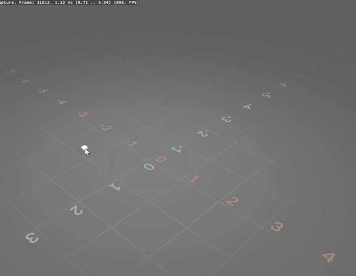
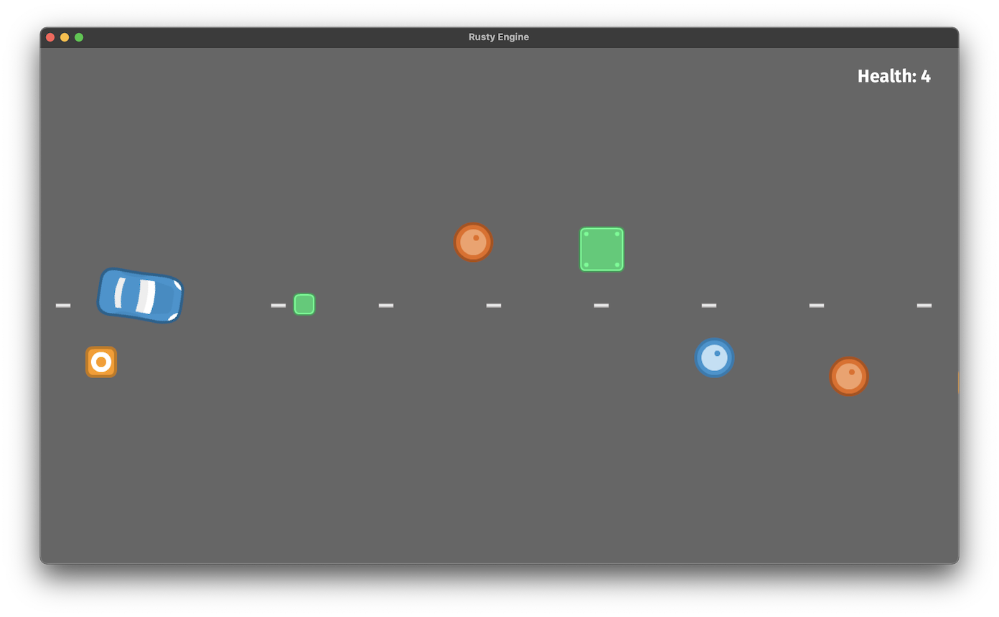
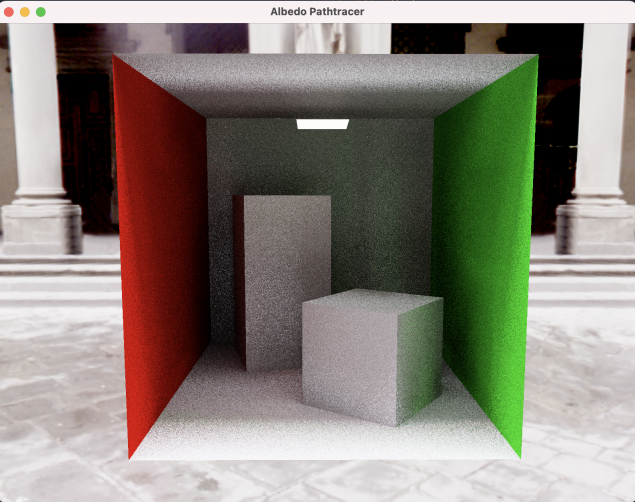

+++
title = "This Month in Rust GameDev #29 - December 2021"
transparent = true
draft = true
+++

<!-- no toc -->

<!-- Check the post with markdownlint-->

Welcome to the 29th issue of the Rust GameDev Workgroup's
monthly newsletter.
[Rust] is a systems language pursuing the trifecta:
safety, concurrency, and speed.
These goals are well-aligned with game development.
We hope to build an inviting ecosystem for anyone wishing
to use Rust in their development process!
Want to get involved? [Join the Rust GameDev working group!][join]

You can follow the newsletter creation process
by watching [the coordination issues][coordination].
Want something mentioned in the next newsletter?
[Send us a pull request][pr].
Feel free to send PRs about your own projects!

[Rust]: https://rust-lang.org
[join]: https://github.com/rust-gamedev/wg#join-the-fun
[pr]: https://github.com/rust-gamedev/rust-gamedev.github.io
[coordination]: https://github.com/rust-gamedev/rust-gamedev.github.io/issues?q=label%3Acoordination
[Rust]: https://rust-lang.org
[join]: https://github.com/rust-gamedev/wg#join-the-fun

- [Game Updates](#game-updates)
- [Learning Material Updates](#learning-material-updates)
- [Engine Updates](#engine-updates)
- [Tooling Updates](#tooling-updates)
- [Library Updates](#library-updates)
- [Other News](#other-news)
- [Popular Workgroup Issues in Github](#popular-workgroup-issues-in-github)
- [Meeting Minutes](#meeting-minutes)
- [Discussions](#discussions)
- [Requests for Contribution](#requests-for-contribution)
- [Jobs](#jobs)
- [Bonus](#bonus)

<!--
Ideal section structure is:

```
### [Title]


_image caption_

A paragraph or two with a summary and [useful links].

_Discussions:
[/r/rust](https://reddit.com/r/rust/todo),
[twitter](https://twitter.com/todo/status/123456)_

[Title]: https://first.link
[useful links]: https://other.link
```

If needed, a section can be split into subsections with a "------" delimiter.
-->

## Game Updates

### [Tet-Rust][tetrust-github]


_Screenshot of Tet-Rust_

Tet-Rust ([GitHub][tetrust-github]) by
[@Syn-Nine][synnine-twitter] is a mini game based on the famous falling puzzle
block game.

The game was created to exercise Syn9's [Rust Mini Game Framework][mgfw] and is
part of an open source [repository][s9-minigame-repo] of several mini-games
that use this framework.

[tetrust-github]: https://github.com/Syn-Nine/rust-mini-games/tree/main/2d-games/tet-rust
[synnine-twitter]: https://twitter.com/Syn9Dev
[mgfw]: https://github.com/Syn-Nine/mgfw
[s9-minigame-repo]: https://github.com/Syn-Nine/rust-mini-games/

### The Beast of Monte Carlo


_Screenshot of The Beast of Monte Carlo_

The Beast of Monte Carlo by [@Syn-Nine][synnine-twitter] is a mini role-playing
game in development to help work out new features for Syn9's
[Rust Mini Game Framework][mgfw].

This month's progress included:

- prototyping tilemap and frame-based animation to make a simple walkaround
engine
- creating a general purpose maze generation algorithm and porting random world
map generation from C++ to Rust
- creating new sprite artwork and animation, as well as mocking up the battle
system

The gameplay and art is influenced by games such as Final Fantasy VI and Lufia
II with a heavy focus on procedural content generation.

### Country Slice



[Country Slice][country-slice-github] is
[@anastasiaopara][country-slice-twitter]'s hobby project, where users can draw a
small scene, and their input is amplified with real-time procedural
generation.

This month's biggest update was adding an ability to draw
paths that, if intersected with walls, automatically generate arches. You can
read a twitter thread that brifly covers how it 
[was optimized to run in 1-2ms][country-slice-twitter-opt].

[country-slice-github]: https://github.com/anopara/country-slice
[country-slice-twitter]: https://twitter.com/anastasiaopara/
[country-slice-twitter-opt]: https://twitter.com/anastasiaopara/status/1472627194409230343?s=20

## Engine Updates

### [Rusty Engine 3.0]


_The "Road Race" game prototype running under Rusty Engine 3.0_

[Rusty Engine] by [Nathan Stocks] is a game engine for people who are learning Rust.

Version 3.0 is a large release with many breaking changes. Notable new features
include: [a full tutorial], custom asset loading (sprites, sounds, fonts),
customizable game state, an interactive collider creator, and much more.
See [the changelog for 3.0] for the full details.

_Discussions:
[/r/rust](https://www.reddit.com/r/rust/comments/rwyrqx/rusty_engine_30/),
[twitter](https://twitter.com/nathanstocks/status/1476724623903367168)_

[Rusty Engine 3.0]: https://github.com/CleanCut/rusty_engine/blob/main/CHANGELOG.md#300---2021-12-30
[Rusty Engine]: https://github.com/CleanCut/rusty_engine
[a full tutorial]: https://cleancut.github.io/rusty_engine/
[the changelog for 3.0]: https://github.com/CleanCut/rusty_engine/blob/main/CHANGELOG.md#300---2021-12-30
[Nathan Stocks]: https://github.com/CleanCut

## Learning Material Updates

## Tooling Updates

## Library Updates

### [assets_manager]

[assets_manager] provides a high-level API to load and cache external resources
with a focus on performance and hot-reloading.

In addition to built-in support for new formats like WebP, glTF and fonts,
[version 0.7] brings a few quality of life improvements. Additionnally,
hot-reloading is now supported for custom asset sources.

These features led to a new crate: [ggez-assets_manager], whose goal is to ease
use of assets_manager with ggez engine!

[assets_manager]: https://github.com/a1phyr/assets_manager/
[version 0.7]: https://github.com/a1phyr/assets_manager/releases/tag/0.7.0
[ggez-assets_manager]: https://github.com/a1phyr/ggez-assets_manager/

### [wgpu]-0.12 release


_experimental pathtracer on wgpu from @llamajestic_

The team concluded 2021 with the release of wgpu-0.12 and naga-0.8.
Details can be found on the [gfx-rs blog] and [wgpu reddit discussion].
Lots of fixes are shipped alongside one much-awaited improvement:
the error messages from validating shaders were finally made readable:

```rust
   ┌─ interpolate.wgsl:21:25
   │
21 │    out.linear_centroid = vec2<f32>(64.0, 125.0, 1.0);
   │                         ^^^^^^^^^^^^^^^^^^^^^^^^^^^^ naga::Expression [16]

Entry point vert_main at Vertex is invalid: 
        Expression [16] is invalid
        Composing expects 2 components but 3 were given
```

[wgpu]: https://github.com/gfx-rs/wgpu
[gfx-rs blog]: https://gfx-rs.github.io/2021/12/25/this-year.html
[wgpu reddit discussion]: https://www.reddit.com/r/rust_gamedev/comments/rjci2n/wgpu012_is_released/

### [Pixels] 0.9.0 👾

[Pixels] is a tiny hardware-accelerated pixel frame buffer. It is popularly
used for emulators, software renderers, 2D pixel art games, and desktop
utilities.

Version 0.9.0 brings a few breaking changes. Notably `wgpu` was updated to
0.12 and it now requires Edition 2021. Full details are available in the
[release notes][pixels-changelog].

[pixels]: https://github.com/parasyte/pixels
[pixels-changelog]: https://github.com/parasyte/pixels/releases/tag/0.9.0

## Popular Workgroup Issues in Github

<!-- Up to 10 links to interesting issues -->

## Other News

<!-- One-liners for plan items that haven't got their own sections. -->

## Meeting Minutes

<!-- Up to 10 most important notes + a link to the full details -->

[See all meeting issues][label_meeting] including full text notes
or [join the next meeting][join].

[label_meeting]: https://github.com/rust-gamedev/wg/issues?q=label%3Ameeting

## Discussions

<!-- Links to handpicked reddit/twitter/urlo/etc threads that provide
useful information -->

## Requests for Contribution

<!-- Links to "good first issue"-labels or direct links to specific tasks -->

## Jobs

<!-- An optional section for new jobs related to Rust gamedev -->

## Bonus

<!-- Bonus section to make the newsletter more interesting
and highlight events from the past. -->

------

That's all news for today, thanks for reading!

Want something mentioned in the next newsletter?
[Send us a pull request][pr].

Also, subscribe to [@rust_gamedev on Twitter][@rust_gamedev]
or [/r/rust_gamedev subreddit][/r/rust_gamedev] if you want to receive fresh news!

<!--
TODO: Add real links and un-comment once this post is published
**Discuss this post on**:
[/r/rust_gamedev](TODO),
[Twitter](TODO),
[Discord](https://discord.gg/yNtPTb2).
-->

[/r/rust_gamedev]: https://reddit.com/r/rust_gamedev
[@rust_gamedev]: https://twitter.com/rust_gamedev
[pr]: https://github.com/rust-gamedev/rust-gamedev.github.io
