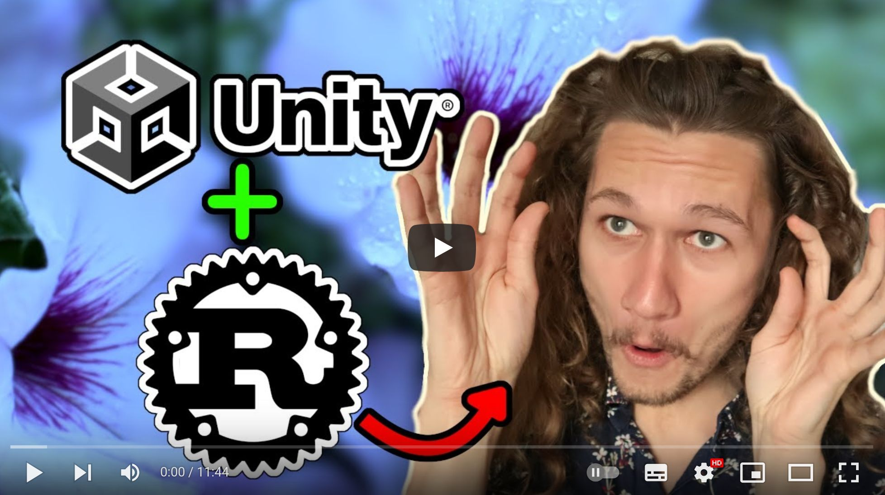

+++
title = "This Month in Rust GameDev #29 - December 2021"
transparent = true
date = 2022-01-19
+++

<!-- no toc -->

<!-- Check the post with markdownlint-->

Welcome to the 29th issue of the Rust GameDev Workgroup's
monthly newsletter.
[Rust] is a systems language pursuing the trifecta:
safety, concurrency, and speed.
These goals are well-aligned with game development.
We hope to build an inviting ecosystem for anyone wishing
to use Rust in their development process!
Want to get involved? [Join the Rust GameDev working group!][join]

You can follow the newsletter creation process
by watching [the coordination issues][coordination].
Want something mentioned in the next newsletter?
[Send us a pull request][pr].
Feel free to send PRs about your own projects!

[Rust]: https://rust-lang.org
[join]: https://github.com/rust-gamedev/wg#join-the-fun
[pr]: https://github.com/rust-gamedev/rust-gamedev.github.io
[coordination]: https://github.com/rust-gamedev/rust-gamedev.github.io/issues?q=label%3Acoordination
[Rust]: https://rust-lang.org
[join]: https://github.com/rust-gamedev/wg#join-the-fun

- [Rust GameDev Meetup](#rust-gamedev-meetup)
- [Game Updates](#game-updates)
- [Learning Material Updates](#learning-material-updates)
- [Engine Updates](#engine-updates)
- [Tooling Updates](#tooling-updates)
- [Library Updates](#library-updates)
- [Other News](#other-news)
- [Discussions](#discussions)
- [Requests for Contribution](#requests-for-contribution)

<!--
Ideal section structure is:

```
### [Title]


_image caption_

A paragraph or two with a summary and [useful links].

_Discussions:
[/r/rust](https://reddit.com/r/rust/todo),
[twitter](https://twitter.com/todo/status/123456)_

[Title]: https://first.link
[useful links]: https://other.link
```

If needed, a section can be split into subsections with a "------" delimiter.
-->

## Rust GameDev Meetup


The thirteenth Rust Gamedev Meetup happened in December. You can watch the
recording of the meetup [here on Youtube][gamedev-meetup-video]. The meetups
take place on the second Saturday every month via the [Rust Gamedev Discord
server][rust-gamedev-discord] and are also [streamed on
Twitch][rust-gamedev-twitch].

[gamedev-meetup-video]: https://youtu.be/S7aoi_4a2uE
[rust-gamedev-discord]: https://discord.gg/yNtPTb2
[rust-gamedev-twitch]: https://twitch.tv/rustgamedev

## Game Updates

### [Tet-Rust][tetrust-github]


_Screenshot of Tet-Rust_

Tet-Rust ([GitHub][tetrust-github]) by
[@Syn-Nine][synnine-twitter] is a mini game based on the famous falling puzzle
block game.

The game was created to exercise Syn9's [Rust Mini Game Framework][mgfw] and is
part of an open source [repository][s9-minigame-repo] of several mini-games
that use this framework.

[tetrust-github]: https://github.com/Syn-Nine/rust-mini-games/tree/main/2d-games/tet-rust
[synnine-twitter]: https://twitter.com/Syn9Dev
[mgfw]: https://github.com/Syn-Nine/mgfw
[s9-minigame-repo]: https://github.com/Syn-Nine/rust-mini-games/

### The Beast of Monte Carlo


_Screenshot of The Beast of Monte Carlo_

The Beast of Monte Carlo by [@Syn-Nine][synnine-twitter] is a mini role-playing
game in development to help work out new features for Syn9's
[Rust Mini Game Framework][mgfw].

This month's progress included:

- prototyping tilemap and frame-based animation to make a simple walkaround
engine
- creating a general purpose maze generation algorithm and porting random world
map generation from C++ to Rust
- creating new sprite artwork and animation, as well as mocking up the battle
system

The gameplay and art are influenced by games such as Final Fantasy VI and Lufia
II with a heavy focus on procedural content generation.

### [10x Sprint Master]


[10x Sprint Master] ([GitHub][10xsprintmaster-github]) by [@E_net4]
is a simulation game where you play the role of
a software development lead engineer.
Write tasks, coordinate a team of developers,
fix bugs and manage feature delivery,
while trying to mitigate the torments of technical debt.

The game was submitted to GitHub Game Off 2021,
and was written using [Yew] with graphics done in pure HTML and CSS.

The author also published a [blog post on Dev.to][10xsprintmaster-dev]
about the game's technical and social dimensions.

[10xsprintmaster-github]: https://github.com/Enet4/10xSprintMaster
[10x Sprint Master]: https://e-net4.itch.io/10x-sprint-master
[Yew]: https://yew.rs
[@E_net4]: https://twitter.com/E_net4
[10xsprintmaster-dev]: https://dev.to/e_net4/10x-sprint-master-a-technical-and-social-experiment-ahp

### [Molecoole][molecoole-steam]

[][molecoole-steam]

Molecoole is a top-down shooter roguelike where you build your character
from different atoms. Each atom has a unique ability providing
tons of variety between playthroughs.
It's made using the [Bevy Engine][bevy].

This month Molecoole devs focused on
adding more [variety][variety-twitter]: different enemies, atoms etc...

They also launched their first teaser [video][teaser-twitter],
it gives us a glimpse into 3 different bioms, bosses, enemies and more.

[molecoole-steam]: https://store.steampowered.com/app/1792170/Molecoole/
[variety-twitter]: https://twitter.com/kiss_mrton/status/1473725282918014977
[teaser-twitter]: https://twitter.com/kiss_mrton/status/1467242884927614976
[bevy]: https://github.com/bevyengine/bevy

### [Veloren][veloren]


_A peaceful winter night_

[Veloren][veloren] is an open world, open-source voxel RPG inspired by Dwarf
Fortress and Cube World.

In December, Veloren ran a Christmas week. From the 20th to the 30th of
December, there were several winter-themed changes on the main server. Snow was
everywhere, decorations were added to locations, and NPC wore Christmas hats!
The 150th Veloren blog was also released in December. An experimental new
section of the newsletter gives video recaps of the last week's blog post.

The ability to edit the appearance of characters was added to the game. Work was
done on armor tooltips to make them more clear. Skiing is in the works, with
some work to still be done on animations and physics. New images were created
for item displays, which are now stored as .vox files.

December's full weekly devlogs: "This Week In Veloren...":
[#149][veloren-149],
[#150][veloren-150],
[#151][veloren-151],
[#152][veloren-152].

[veloren]: https://veloren.net
[veloren-149]: https://veloren.net/devblog-149
[veloren-150]: https://veloren.net/devblog-150
[veloren-151]: https://veloren.net/devblog-151
[veloren-152]: https://veloren.net/devblog-152

### Country Slice


[Country Slice][country-slice-github] is
[@anastasiaopara][country-slice-twitter]'s hobby project, where users can draw a
small scene, and their input is amplified with real-time procedural
generation.

This month's biggest update was adding an ability to draw
paths that, if intersected with walls, automatically generate arches. You can
read a Twitter thread that briefly covers how it
[was optimized to run in 1-2ms][country-slice-twitter-opt].

[country-slice-github]: https://github.com/anopara/country-slice
[country-slice-twitter]: https://twitter.com/anastasiaopara/
[country-slice-twitter-opt]: https://twitter.com/anastasiaopara/status/1472627194409230343

### Fish Fight


Fish Fight ([GitHub][fish-github], [Discord][fish-discord],
[website][fish-website])

Fish Fight is a tactical 2D shooter, played by up to 4 players.
It is also a 2D-pixels-platformer game engine optimized for modding.

In-game level editor was [released][fish-editor], along with an [editor tutorial][fish-tutorial].
A retrospective devlog was posted: [Fish Fight's past, present, and future][fish-announce].

[fish-github]: https://github.com/fishfight/FishFight
[fish-discord]: https://discord.gg/4smxjcheE5
[fish-website]: https://fishfight.org/
[duck-game]: https://store.steampowered.com/app/312530/Duck_Game/
[fish-editor]: https://github.com/fishfight/FishFight/releases/tag/v0.3
[fish-tutorial]: https://fishfight.github.io/FishFight/editor.html
[fish-announce]: https://spicylobster.itch.io/fishfight/devlog/332434/fish-fights-past-present-and-future

### [BITGUN][bitgun-steam]

[][bitgun-steam]

BITGUN ([Steam][bitgun-steam], [Twitter][bitgun-twitter],
[Discord][bitgun-discord]) by [@LogLogGames][bitgun-twitter] is an action
roguelike zombie shooter with lots of blood. The game is built using Godot
and Rust (via [godot-rust][bitgun-godot-rust]).

They are now heading to a public playtest via Steam and you can signup
[here][bitgun-signup] to play the game for free in exchange for a short feedback.
They recently added [cutscenes][bitgun-cutscenes], which are telling a bit more
story about this post-apocalyptic zombie world where people are scared of getting
infected and supplies are rare. They also launched a project [Name your zombie][bitgun-name]
where you can get your Twitter or TikTok username as a name of a random zombie
and a tombstone in the game!

[bitgun-steam]: https://store.steampowered.com/app/1673940/BITGUN/
[bitgun-twitter]: https://twitter.com/logloggames
[bitgun-discord]: https://discord.gg/XrGZQkq
[bitgun-godot-rust]: https://godot-rust.github.io/
[bitgun-signup]: https://airtable.com/shrMUw2Xz98tdj8gW
[bitgun-cutscenes]: https://twitter.com/LogLogGames/status/1479752293306273792
[bitgun-name]: https://loglog.games/pages/name-your-zombie/

### [vange-rs WebAssembly Port][vangers-wasm-post]


[vange.rs] is the project of re-implementing the [Vangers] game (from 1998)
in Rust using modern development practices, parallel computations, and GPU.

This month [@caiiiycuk] ported it to the "wasm32-unknown-emscripten" target
via wgpu's GLES3 backend and [posted an article][vangers-wasm-post]
about the process and observations.

The web version of vange-rs can be [played online here][vangers-wasm-play].

_Discussions:
[/r/rust_gamedev](https://reddit.com/r/rust_gamedev/comments/rdbl7u/vangers_running_on_webgl)_

[Vangers]: https://en.wikipedia.org/wiki/Vangers
[vangers-wasm-post]: https://caiiiycuk.medium.com/vange-rs-webassembly-in-rust-498e2f960a04
[vangers-wasm-play]: https://caiiiycuk.github.io/vangers-web/vange-rs/
[@caiiiycuk]: https://twitter.com/caiiiycuk
[vange.rs]: https://vange.rs

### [Bevy Combat][bevy_combat]


[Bevy Combat][bevy_combat] by [@ElliotB256] is
a WIP sci-fi battle simulation written using Bevy.

Some of the current features:

- Combat and targetting AI;
- Simple weapons (instant hit), damage, health, shields, and mortality;
- Death animations and explosions;

Check out the [web demo here][bevy-combat-web].

[bevy_combat]: https://github.com/ElliotB256/bevy_combat
[@ElliotB256]: https://github.com/ElliotB256
[bevy-combat-web]: https://elliotb256.github.io/bevy_combat

### Rust City


[@oliviff] is working on a city building game.
Some of [this month's updates][rust-city-updates]:

- Basic zoning placeholders when building roads.
- Advanced zoning for residential, commercial, and industry.
- Populating zoned areas based on demand.
- Buildings don't function unless they have utilities.
- Finances and transactions
- Population tracker.
- pipes required for a house to receive water.
- cables required for a house to receive electricity.
- build mode for pipes and cables.
- UI to toggle different layers visibility.

[@oliviff]: https://twitter.com/oliviff
[rust-city-updates]: https://twitter.com/oliviff/status/1473266319881654274

### Antorum Isles (pka Antorum Online)


[Antorum Isles][antorum-play] is a micro-multiplayer online role-playing game
by [@dooskington].
The game server is written in Rust, and the client is Unity-based.

Main highlights of the latest [@dooskington's devlog][antorum-post]:

- [Now you can download the client and play the game][antorum-play]!
- The project is mostly finished, it won't receive more major new features
  or updates.
- The editor and the dedicated server binaries should be released soon.

[@dooskington]: https://twitter.com/dooskington
[antorum-play]: https://antorum.ratwizard.dev
[antorum-post]: https://ratwizard.dev/dev-log/antorum/39

## Engine Updates

### [Rusty Engine 3.0]


_The "Road Race" game prototype running under Rusty Engine 3.0_

[Rusty Engine] by [Nathan Stocks] is a game engine built on top of Bevy
for people who are learning Rust.

Version 3.0 is a large release with many breaking changes. Notable new features
include: [a full tutorial], custom asset loading (sprites, sounds, fonts),
customizable game state, an interactive collider creator, and much more.
See [the changelog for 3.0] for the full details.

_Discussions:
[/r/rust](https://reddit.com/r/rust/comments/rwyrqx/rusty_engine_30),
[twitter](https://twitter.com/nathanstocks/status/1476724623903367168)_

[Rusty Engine 3.0]: https://github.com/CleanCut/rusty_engine/blob/main/CHANGELOG.md#300---2021-12-30
[Rusty Engine]: https://github.com/CleanCut/rusty_engine
[a full tutorial]: https://cleancut.github.io/rusty_engine/
[the changelog for 3.0]: https://github.com/CleanCut/rusty_engine/blob/main/CHANGELOG.md#300---2021-12-30
[Nathan Stocks]: https://github.com/CleanCut

### [Pyxel]


[Pyxel] ([Discord][pyxel-discord]) by [@kitao] is a retro game engine
(inspired by [PICO-8] and [TIC-80]) that uses Python for scripting:

- 16 color palette,
- 256x256 sized 3 image banks,
- 256x256 sized 8 tilemaps,
- 4 channels with 64 definable sounds,
- 8 peces of music which can combine arbitrary sounds,
- Image and sound editor,
- Keyboard, mouse, and gamepad inputs.

Check out the [official][pyxel-examples1]
and [user-provided][pyxel-examples2] examples.

[Pyxel]: https://github.com/kitao/pyxel
[@kitao]: https://twitter.com/kitao
[PICO-8]: https://lexaloffle.com/pico-8.php
[TIC-80]: https://tic80.com
[pyxel-discord]: https://discord.gg/FC7kUZJ
[pyxel-examples1]: https://github.com/kitao/pyxel#try-pyxel-examples
[pyxel-examples2]: https://github.com/kitao/pyxel/wiki/Pyxel-User-Examples

## Learning Material Updates

### [Rust SFML Windows Setup][sfml-video]

[][sfml-video]

[@TheFern2] published a [video tutorial][sfml-video] on how to
set up Rust with [SFML bindings][sfml] for Windows users (using MSVC C++).

rust-sfml's [wiki page with instructions for Windows][sfml-wiki-win] was also updated.

[sfml-video]: https://youtube.com/watch?v=nnojR-8PT4M
[@TheFern2]: https://github.com/TheFern2
[sfml]: https://lib.rs/sfml
[sfml-wiki-win]: https://github.com/jeremyletang/rust-sfml/wiki/Windows

### [Rust and Unity Game Development][runity-video]

[][runity-video]

[@TanTanDev] published a [video][runity-video] about the process of adding Rust
support for the Unity game engine.

> Is it really possible? YES it is! I managed to make a game 100% coded in Rust,
> but using Unity as editor and runtime.
> This has to be one of my craziest projects yet!
>
> I utilized a library called Bevy game framework/engine,
> to handle the gameplay programming. Utilizing Bevy systems I was able
> to hide the FFI code from the gameplay code.

The resulting source code [can be found here][runity-source].

[runity-video]: https://youtu.be/L7M_vbo1N2g
[runity-source]: https://github.com/TanTanDev/runity
[@TanTanDev]: https://twitter.com/TanTanDev

### [Tetris Livecoding][tetris-playlist]

[][tetris-playlist]

["Tetris in Rust from scratch"][tetris-playlist] is a series of livestreams
by [Over Developed] that showcases beginner/intermediate Rust concepts
using Tetris as an example.
Episodes:

> - [In the first episode](https://youtube.com/watch?v=74UYWFNfR64),
>   we lay the groundwork for the project, creating the overall structure
>   and some of the primitives that will be used by the game engine.
> - [In the second episode](https://youtube.com/watch?v=ZBO99zuD3HQ),
>   we flesh out some more behavior in the game engine, and fix some bugs
>   that were introduced in the previous session.
> - [In the third episode](https://youtube.com/watch?v=Ro-aPSb96RM),
>   we start writing the interface code for rendering the GUI.
> - [In this episode](https://youtube.com/watch?v=QLA0LqfhaoE),
>   we connect the game logic to the GUI and finally see some interactivity.

_Discussions:
[/r/rust](https://reddit.com/r/rust/comments/rk8zv5/livecoding_tetris_clone)_

[tetris-playlist]: https://youtube.com/playlist?list=PLBNbqulT6FWw9C39_WIT_dcCIj1AdxiAy

[Over Developed]: https://youtube.com/channel/UCROob9baB-fRBDSyNq_8i4g

## Tooling Updates

### [Blackjack]


[Blackjack] by @setzer22 is a new procedural modeling application made in Rust,
using rend3, wgpu and egui. It follows the steps of applications like
Houdini, or Blender's geometry nodes project and provides a node-based
environment to compose procedural recipes to create 3d models.

The project was recently announced, and an official open-source release is
planned during the following month. Here's a highlight of the upcoming features:

- A node-based editor to compose operations like 3d math, vertex/edge/face
  selections and mesh edit operations.
- Several polygon edit operations like bevel, chamfer and extrude.
- Viewport display with support for displaying primitive ids and triangle
  half-edge winding.

_Discussions:
[/r/rust_gamedev](https://reddit.com/r/rust_gamedev/comments/rufvlc/meet_blackjack),
[/r/rust](https://reddit.com/r/rust/comments/rug24x/media_meet_blackjack)_

[Blackjack]: https://github.com/setzer22/blackjack

### [Graphite][graphite-repo]


Graphite ([GitHub][graphite-repo], [Discord][graphite-discord],
[Twitter][graphite-twitter]) is an in-development vector and raster graphics
editor built on a non-destructive node-based workflow.

The completion of [Sprint 10][graphite-sprint-10] wraps up a productive month
of features and stability improvements. Documents persist page reloads via
IndexedDB browser storage. The layer panel got some love. Vector anchor points
can be dragged (beginnings of the Path/Pen Tools). Per-tool footer bar hints
teach possible user input actions. And a big code cleanup/refactor took place
behind the scenes.

Additional new features and QoL improvements: artboards, panel resizing, the
Navigate Tool, outline view mode, support for touch input and non-Latin
keyboards, an *About Graphite* dialog with version info, plus dozens of bugs
and crashes were resolved.

[Try it right now in your browser.][graphite-live-demo] Graphite is making
steady progress towards becoming a non-destructive, procedural graphics editor
suitable for replacing traditional 2D DCC applications. [Join the
Discord][graphite-discord] and get involved!

[graphite-repo]: https://github.com/GraphiteEditor/Graphite
[graphite-discord]: https://discord.graphite.design
[graphite-twitter]: https://twitter.com/GraphiteEditor
[graphite-live-demo]: https://editor.graphite.design
[graphite-sprint-10]: https://github.com/GraphiteEditor/Graphite/milestone/10?closed=1

### [Fun Notation][notation-fun]


[Fun Notation][notation-fun] ([GitHub][notation-fun-github]) is [@yjpark]'s
experimentation on musical notations built on top of Bevy.
The idea is to help with music visualization, practicing,
and provide a nicer way to show scores or tabs.

Some of current ideas tried in the app:

- colors for notes (based on the relative notation),
- color and shapes for chords,
- guitar tabs to show both pitch and durations for notes.

_Discussions:
[/r/rust_gamedev](https://reddit.com/r/rust_gamedev/comments/r9erd2/guitar_tab_viewer_bevy)_

[notation-fun]: https://notation.fun
[notation-fun-github]: https://github.com/notation-fun/notation
[@yjpark]: https://github.com/yjpark

## Library Updates

### [assets_manager]

[assets_manager] provides a high-level API to load and cache external resources
with a focus on performance and hot-reloading.

In addition to built-in support for new formats like WebP, glTF and fonts,
[version 0.7] brings a few quality of life improvements. Additionally,
hot-reloading is now supported for custom asset sources.

These features led to a new crate: [ggez-assets_manager], whose goal is to ease
use of assets_manager with ggez engine!

[assets_manager]: https://github.com/a1phyr/assets_manager/
[version 0.7]: https://github.com/a1phyr/assets_manager/releases/tag/0.7.0
[ggez-assets_manager]: https://github.com/a1phyr/ggez-assets_manager/

### [wgpu]-0.12 release


_experimental pathtracer on wgpu from @llamajestic_

The team concluded 2021 with the release of wgpu-0.12 and naga-0.8.
Details can be found on the [gfx-rs blog] and [wgpu reddit discussion].
Lots of fixes are shipped alongside one much-awaited improvement:
the error messages from validating shaders were finally made readable:

```rust
   ┌─ interpolate.wgsl:21:25
   │
21 │    out.linear_centroid = vec2<f32>(64.0, 125.0, 1.0);
   │                         ^^^^^^^^^^^^^^^^^^^^^^^^^^^^ naga::Expression [16]

Entry point vert_main at Vertex is invalid: 
        Expression [16] is invalid
        Composing expects 2 components but 3 were given
```

[wgpu]: https://github.com/gfx-rs/wgpu
[gfx-rs blog]: https://gfx-rs.github.io/2021/12/25/this-year.html
[wgpu reddit discussion]: https://reddit.com/r/rust_gamedev/comments/rjci2n/wgpu012_is_released/

### [Pixels] 0.9.0 👾

[Pixels] is a tiny hardware-accelerated pixel frame buffer. It is popularly
used for emulators, software renderers, 2D pixel art games, and desktop
utilities.

Version 0.9.0 brings a few breaking changes. Notably, wgpu was updated to
0.12 and it now requires Edition 2021. Full details are available in the
[release notes][pixels-changelog].

[pixels]: https://github.com/parasyte/pixels
[pixels-changelog]: https://github.com/parasyte/pixels/releases/tag/0.9.0

### [bevy_proto]


[bevy_proto] is a small plugin for the [Bevy] game engine, allowing entities to
be defined in their own config files (called "Prototypes"). These config files
are then read into a resource that you can use to spawn their pre-defined
entities from within any Bevy system.

The recently released 0.2 version, adds a templating feature (as suggested
by [@chrisburnor](https://github.com/chrisburnor)). This new feature allows any
entity prototype to define one or more templates, from which it will inherit
additional component definitions (including those from a template's templates).

This makes defining many entities with common functionality (such as enemy types
or weapons) much easier and reduces code duplication for an overall better
experience.

For more info, check out
the [original PR](https://github.com/MrGVSV/bevy_proto/pull/2), or explore
the [assets](https://github.com/MrGVSV/bevy_proto/tree/main/assets)
and [examples](https://github.com/MrGVSV/bevy_proto/tree/main/examples) folders.

[bevy_proto]: https://github.com/MrGVSV/bevy_proto
[Bevy]: https://github.com/bevyengine/bevy

### [bevy-remote-devtools]


[bevy-remote-devtools] is a plugin and UI application for the [Bevy] game
engine allowing to view entities and their components, asset resources
like meshes, events from the [tracing] crate and system timings using a
very basic profiler. It also supports all of that over network so
debugging can be done from any remote machine and vice versa.

The first release of the 0.1 version comes with basic support for the
aforementioned features. It contains a plugin for [Bevy] that will extend
you application with a small REST HTTP API that can be consumed by the
included [Tauri] based UI application.

[bevy-remote-devtools]: https://github.com/reneeichhorn/bevy-remote-devtools
[Bevy]: https://github.com/bevyengine/bevy
[tracing]: https://github.com/tokio-rs/tracing
[Tauri]: https://tauri.studio/en/

### [kajiya]


[kajiya] ([Discord][kajiya_discord])
by [@h3r2tic] is an experimental real-time global illumination
renderer made with Vulkan, and utilizing [rust-gpu][rust-gpu].

Last month the project was released into open source along with
a tiny sample: [Cornell McRay t'Racing][cornell-mcray].

The renderer is permissively licensed, and includes several cutting-edge
algorithms, including ray-traced effects.
It isn’t built to ship games (yet), but serves as a convenient
platform for learning and research.

_Discussions:
[medium](https://medium.com/embarkstudios/homegrown-rendering-with-rust-1e39068e56a7),
[/r/rust](https://reddit.com/r/rust/comments/rkqmk3/homegrown_rendering_with_rust),
[twitter (kajiya)](https://twitter.com/h3r2tic/status/1472957370972127233),
[twitter (cornell-mcray)](https://twitter.com/h3r2tic/status/1473856011941425155)._

[kajiya_discord]: https://discord.gg/dAuKfZS
[cornell-mcray]: https://github.com/h3r2tic/cornell-mcray/
[kajiya]: https://github.com/EmbarkStudios/kajiya/
[rust-gpu]: https://github.com/EmbarkStudios/rust-gpu
[@h3r2tic]: https://github.com/h3r2tic

### [Shard]

[Shard] by @HindrikStegenga is an Archetype-based Entity Component System.

Version 0.2 is a complete rewrite of the ECS, with the main new feature
that it supports no_std environments.

_Discussions: [/r/rust](https://reddit.com/r/rust/comments/r6mn0g/shard_020)_

[Shard]: https://github.com/HindrikStegenga/Shard

### [rapid-qoi]

[rapid-qoi] by @zakarumych is an implementation of QOI format written in Rust.

QOI format can fit nicely as a replacement for PNG
and other common loseless image formats
for game engines given its simplicity and blazing fast encoding and decoding.

[rapid-qoi] has a simple API, zero unsafe, zero dependencies,
fast build times and high performance.
It is compatible with finalized QOI spec published in December.

[rapid-qoi]: https://github.com/zakarumych/rapid-qoi

### [ash] v0.34

[ash] is lightweight wrapper around Vulkan.

This month [v0.34 was released][ash-0-3-4]. Highlights include:

- Now ash defaults to linking Vulkan directly, which saves the libloading dep
  and is more idiomatic for apps that don't have a fallback.
- Debug impls can be disabled for a faster build.
- More extensions and lots of miscellaneous API cleanup.

[ash]: https://github.com/MaikKlein/ash
[ash-0-3-4]: https://github.com/MaikKlein/ash/releases/tag/0.34.0

## Other News

<!-- One-liners for plan items that haven't got their own sections. -->

- Other game updates:
  - [BENDYWORM] now [runs on Linux natively](
    https://twitter.com/bauxitedev/status/1467817606111498240).
  - [Rust Shooter progress report][rust-shooter]:
    enemies are proper player entities with rudimentry AI now,
    new indoor environment.
  - [aous] is a Game Off'21 game about the survival of a mutating ant colony.
  - [Embark's Arc Raiders game is using some Rust on the server side](
    https://twitter.com/repi/status/1469324284619337728).
- Other engine updates:
  - [@DmitryNStepanov] did a few more [rg3d] live-coding streams, here're
    the recordings: [second](https://youtube.com/watch?v=TQaCyC_tGko),
    [third](https://youtube.com/watch?v=OsZCusri1Nw),
    [fourth](https://youtube.com/watch?v=FGi8evJFdnw).
  - [godot-rust was upgraded][godo-rust-dec] to support Godot 3.4 out of the box,
    so the manual api.json is not needed.
  - [Oxygengine] v0.26 brings: different image types (2D, 2D Array, 3D),
    samplers instead of textures, render target fixes,
    and also an [RPG template][oxygengine-rpg].
- Other library updates:
  - [bevy_midi] v0.2 is now using crossbeam-channels meaning
    it is more responsive.
  - [egui 0.16](https://reddit.com/r/rust/comments/rrantt/egui_016) brings:
    context menus, rich text (colors, underline, etc) in all widgets,
    bar charts and box plots.

[bevy_midi]: https://github.com/BlackPhlox/bevy_midi
[godo-rust-dec]: https://twitter.com/GodotRust/status/1472269798641971200
[Oxygengine]: https://github.com/PsichiX/Oxygengine
[oxygengine-rpg]: https://reddit.com/r/rust_gamedev/comments/r5xobe/oxygengine_rpg_game_template
[@DmitryNStepanov]: https://twitter.com/DmitryNStepanov
[rg3d]: https://github.com/mrDIMAS/rg3d
[BENDYWORM]: https://bauxite.itch.io/bendyworm
[rust-shooter]: https://reddit.com/r/rust_gamedev/comments/rj5lut/rust_shooter_another_update
[aous]: https://vleue.itch.io/aous

## Discussions

<!-- Links to handpicked reddit/twitter/urlo/etc threads that provide
useful information -->

- [/r/rust_gamedev](https://reddit.com/r/rust_gamedev):
  - ["Should I use a sync/await, threads, or both to make a game server?"](
    https://reddit.com/r/rust_gamedev/comments/r8jh5z/should_i_use_a_syncawait_threads_or_both_to_make_server)
  - ["Rust server for Unreal Engine Client? Is this a bad idea for any reason?"](
    https://reddit.com/r/rust_gamedev/comments/rhd8ou/rust_server_for_unreal_engine_client)

## Requests for Contribution

<!-- Links to "good first issue"-labels or direct links to specific tasks -->

- [Graphite is looking for contributors][graphite-contribute] to help reach
  the 0.1 Alpha release.
- [winit's "difficulty: easy" issues][winit-issues].
- [Backroll-rs, a new networking library][backroll-rs].
- [Embark's open issues][embark-open-issues] ([embark.rs]).
- [wgpu's "help wanted" issues][wgpu-issues].
- [luminance's "low hanging fruit" issues][luminance-fruits].
- [ggez's "good first issue" issues][ggez-issues].
- [Veloren's "beginner" issues][veloren-beginner].
- [Amethyst's "good first issue" issues][amethyst-issues].
- [A/B Street's "good first issue" issues][abstreet-issues].
- [Mun's "good first issue" issues][mun-issues].
- [SIMple Mechanic's good first issues][simm-issues].
- [Bevy's "good first issue" issues][bevy-issues].

[graphite-contribute]: https://github.com/GraphiteEditor/Graphite/issues/202
[winit-issues]: https://github.com/rust-windowing/winit/issues?q=is%3Aopen+is%3Aissue+label%3A%22difficulty%3A+easy%22
[backroll-rs]: https://github.com/HouraiTeahouse/backroll-rs/issues
[embark.rs]: https://embark.rs
[embark-open-issues]: https://github.com/search?q=user:EmbarkStudios+state:open
[wgpu-issues]: https://github.com/gfx-rs/wgpu/issues?q=is%3Aissue+is%3Aopen+label%3A%22help+wanted%22
[luminance-fruits]: https://github.com/phaazon/luminance-rs/issues?q=is%3Aissue+is%3Aopen+label%3A%22low+hanging+fruit%22
[ggez-issues]: https://github.com/ggez/ggez/labels/%2AGOOD%20FIRST%20ISSUE%2A
[veloren-beginner]: https://gitlab.com/veloren/veloren/issues?label_name=beginner
[amethyst-issues]: https://github.com/amethyst/amethyst/issues?q=is%3Aissue+is%3Aopen+label%3A%22good+first+issue%22
[abstreet-issues]: https://github.com/a-b-street/abstreet/issues?q=is%3Aissue+is%3Aopen+label%3A%22good+first+issue%22
[mun-issues]: https://github.com/mun-lang/mun/labels/good%20first%20issue
[simm-issues]: https://github.com/mkhan45/SIMple-Mechanics/labels/good%20first%20issue
[bevy-issues]: https://github.com/bevyengine/bevy/labels/E-Good-First-Issue

------

That's all news for today, thanks for reading!

Want something mentioned in the next newsletter?
[Send us a pull request][pr].

Also, subscribe to [@rust_gamedev on Twitter][@rust_gamedev]
or [/r/rust_gamedev subreddit][/r/rust_gamedev] if you want to receive fresh news!

**Discuss this post on**:
[/r/rust_gamedev](https://reddit.com/r/rust_gamedev/comments/s82gcd/this_month_in_rust_gamedev_29_december_2021),
[Twitter](https://twitter.com/rust_gamedev/status/1483927872532271107),
[Discord](https://discord.gg/yNtPTb2).

[/r/rust_gamedev]: https://reddit.com/r/rust_gamedev
[@rust_gamedev]: https://twitter.com/rust_gamedev
[pr]: https://github.com/rust-gamedev/rust-gamedev.github.io
