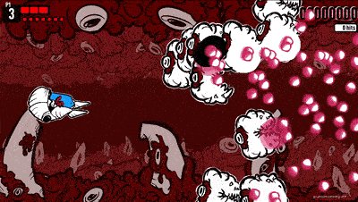
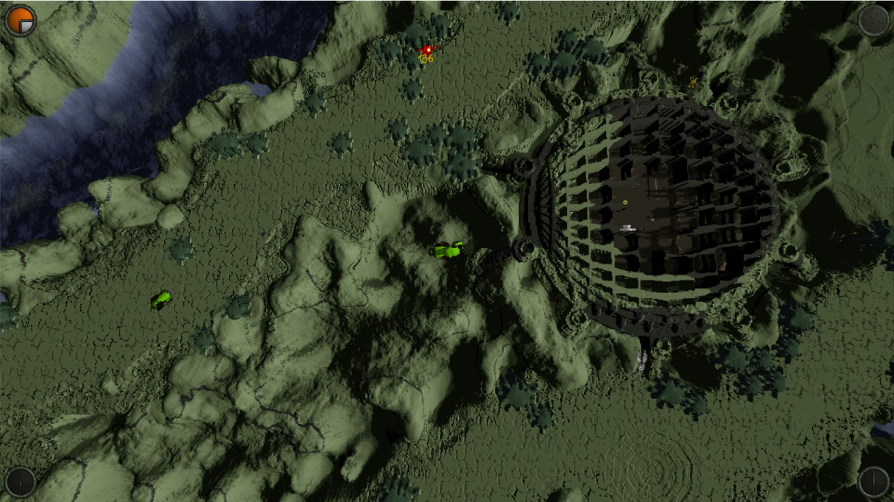
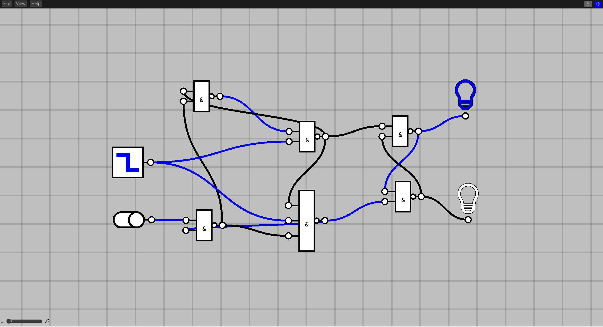

+++
title = "This Month in Rust GameDev #30 - January 2022"
transparent = true
date = 2022-02-01
draft = true
+++

<!-- no toc -->

<!-- Check the post with markdownlint-->

Welcome to the 30th issue of the Rust GameDev Workgroup's
monthly newsletter.
[Rust] is a systems language pursuing the trifecta:
safety, concurrency, and speed.
These goals are well-aligned with game development.
We hope to build an inviting ecosystem for anyone wishing
to use Rust in their development process!
Want to get involved? [Join the Rust GameDev working group!][join]

You can follow the newsletter creation process
by watching [the coordination issues][coordination].
Want something mentioned in the next newsletter?
[Send us a pull request][pr].
Feel free to send PRs about your own projects!

[Rust]: https://rust-lang.org
[join]: https://github.com/rust-gamedev/wg#join-the-fun
[pr]: https://github.com/rust-gamedev/rust-gamedev.github.io
[coordination]: https://github.com/rust-gamedev/rust-gamedev.github.io/issues?q=label%3Acoordination
[Rust]: https://rust-lang.org
[join]: https://github.com/rust-gamedev/wg#join-the-fun

- [Game Updates](#game-updates)
- [Learning Material Updates](#learning-material-updates)
- [Engine Updates](#engine-updates)
- [Tooling Updates](#tooling-updates)
- [Library Updates](#library-updates)
- [Other News](#other-news)
- [Popular Workgroup Issues in Github](#popular-workgroup-issues-in-github)
- [Meeting Minutes](#meeting-minutes)
- [Discussions](#discussions)
- [Requests for Contribution](#requests-for-contribution)
- [Jobs](#jobs)
- [Bonus](#bonus)

<!--
Ideal section structure is:

```
### [Title]


_image caption_

A paragraph or two with a summary and [useful links].

_Discussions:
[/r/rust](https://reddit.com/r/rust/todo),
[twitter](https://twitter.com/todo/status/123456)_

[Title]: https://first.link
[useful links]: https://other.link
```

If needed, a section can be split into subsections with a "------" delimiter.
-->

## Game Updates

### Flesh


_the second level's background + new enemy_

[Flesh] by [@im_oab] is a 2D-horizontal shmup game with hand-drawn animation and
an organic/fleshy theme. It is implemented using [Tetra]. This month's updates
include:

- The completed first level, with a mid-boss and main boss.
- The second level of the game with new enemies.

[Flesh]: https://store.steampowered.com/app/1660850/Flesh/
[@im_oab]: https://twitter.com/im_oab
[Tetra]: https://github.com/17cupsofcoffee/tetra

### [Rusty Vangers]


_Rusty Vangers engine in action within the original game_

[Rusty Vangers] by [@kvark] is a modern re-implementation of the original
[Vangers] game from the last century.
It's in Rust, and uses GPU and multiple threads heavily.

Something incredible has been brewing within the small by dedicated community
of the original game. They prototyped a pluggable rendering interface in order
to support rendering the game via [Rusty Vangers] instead of the default
CPU-based rasterizer. The plugin is made as a static library sub-crate with a
bunch of C-exported functions.
Basic concept worked on the terrain, and the mini working group transitioned
to moving more visual features off the old path and into the Rust-based plugin.

At the same time, [Rusty Vangers] engine got a number of important
fixes and additions:

- water is rendered fair as transparent surfaces
- lighting evaluation on the second layer is fixed
- dynamic terrain and palette modification is supported
- custom viewport support
- can render menu screens, not just the game levels

[Rusty Vangers]: https://vange.rs
[Vangers]: https://www.gog.com/en/game/vangers
[@kvark]: https://github.com/kvark/

## Engine Updates

### [godot-rust][gd-github]

godot-rust ([GitHub][gd-github], [Discord][gd-discord], [Twitter][gd-twitter])
is a Rust library that provides bindings for the Godot game engine.

The start of 2022 is a good opportunity to showcase a few godot-rust games
in development. More info is available in [the book][gd-book-games].


Using custom builds of the Godot engine involved quite a bit of ceremony
in the past: manual CLI invocations, code replacement and re-wiring
of the `gdnative-bindings` subcrate. The approach has been fundamentally
overhauled, and is now as simple as specifying the crate feature `custom-godot`
([#833][gd-833]). The library will automatically look for a `godot` executable
in the system path (or a `GODOT_BIN` environment variable), and regenerate
`api.json`. This makes using older or module-extended Godot versions a breeze.

Latest `master` branch has now been updated to support Godot 3.4 out of the box
([#829][gd-829]).

Upcoming godot-rust version 0.10 seems to be finally on the horizon, with only
a handful of tasks left ([#842][gd-842]). A changelog since v0.9.3 is now
available. The continous stream of small improvements here and there has led
to a sizable list! ([#845][gd-845])

[gd-833]: https://github.com/godot-rust/godot-rust/pull/833
[gd-829]: https://github.com/godot-rust/godot-rust/pull/829
[gd-842]: https://github.com/godot-rust/godot-rust/issues/842
[gd-845]: https://github.com/godot-rust/godot-rust/pull/845
[gd-github]: https://github.com/godot-rust/godot-rust
[gd-discord]: https://discord.com/invite/FNudpBD
[gd-twitter]: https://twitter.com/GodotRust
[gd-book-games]: https://godot-rust.github.io/book/projects/games.html

## Learning Material Updates

## Tooling Updates

### [Nodus][nodus-github]



Nodus ([GitHub][nodus-github]) by [@r4gus] is a digital circuit simulator
built with the Bevy game engine. The project is in an early stage of
development but, most of the basic features are implemented. That includes:

- Insert components like gates, switches, clocks, or light bulbs into
  the world using a radial context menu.
- Build digital circuits by connecting inputs and outputs of components
  with each other.
- Save projects to a .ron file and reload them later.

[nodus-github]: https://github.com/r4gus/nodus
[@r4gus]: https://github.com/r4gus

## Library Updates

### leafwing-input-manager

`leafwing-input-manager` ([GitHub](https://github.com/Leafwing-Studios/leafwing-input-manager),
[crates.io](https://crates.io/crates/leafwing-input-manager)) by [@alice-i-cecile](https://twitter.com/AliceICecile)
is an ergonomic, featureful and fully documented Bevy library
for expressively abstracting over user input.

Supports local multiplayer, enables input rebinding, integrates with `bevy_ui`,
and handles chords!

## Popular Workgroup Issues in Github

<!-- Up to 10 links to interesting issues -->

## Other News

<!-- One-liners for plan items that haven't got their own sections. -->

## Meeting Minutes

<!-- Up to 10 most important notes + a link to the full details -->

[See all meeting issues][label_meeting] including full text notes
or [join the next meeting][join].

[label_meeting]: https://github.com/rust-gamedev/wg/issues?q=label%3Ameeting

## Discussions

<!-- Links to handpicked reddit/twitter/urlo/etc threads that provide
useful information -->

## Requests for Contribution

<!-- Links to "good first issue"-labels or direct links to specific tasks -->

## Jobs

<!-- An optional section for new jobs related to Rust gamedev -->

## Bonus

<!-- Bonus section to make the newsletter more interesting
and highlight events from the past. -->

------

That's all news for today, thanks for reading!

Want something mentioned in the next newsletter?
[Send us a pull request][pr].

Also, subscribe to [@rust_gamedev on Twitter][@rust_gamedev]
or [/r/rust_gamedev subreddit][/r/rust_gamedev] if you want to receive fresh news!

<!--
TODO: Add real links and un-comment once this post is published
**Discuss this post on**:
[/r/rust_gamedev](TODO),
[Twitter](TODO),
[Discord](https://discord.gg/yNtPTb2).
-->

[/r/rust_gamedev]: https://reddit.com/r/rust_gamedev
[@rust_gamedev]: https://twitter.com/rust_gamedev
[pr]: https://github.com/rust-gamedev/rust-gamedev.github.io
