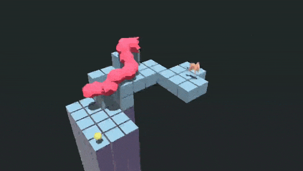
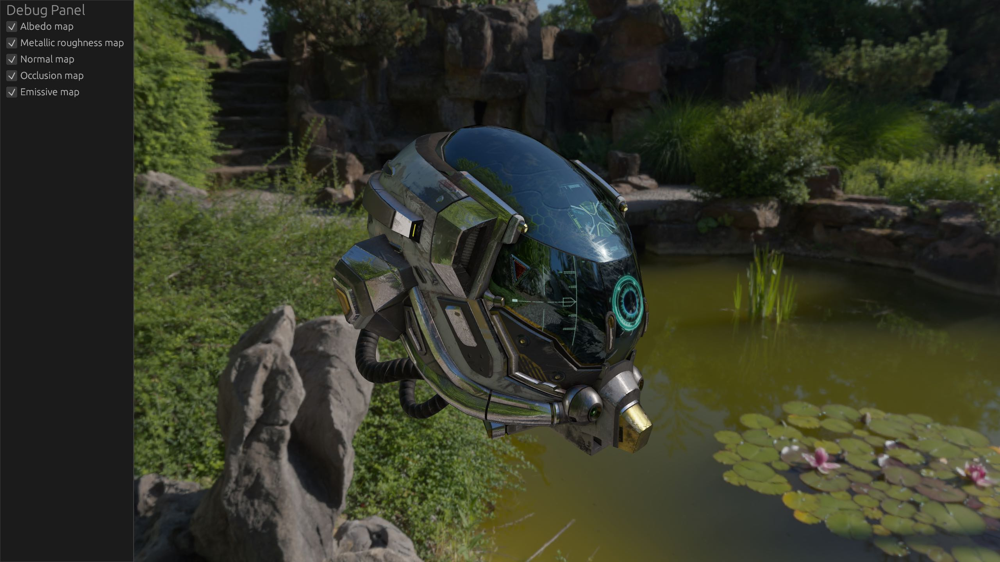
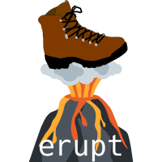

+++
title = "This Month in Rust GameDev #30 - January 2022"
transparent = true
date = 2022-02-01
draft = true
+++

<!-- no toc -->

<!-- Check the post with markdownlint-->

Welcome to the 30th issue of the Rust GameDev Workgroup's
monthly newsletter.
[Rust] is a systems language pursuing the trifecta:
safety, concurrency, and speed.
These goals are well-aligned with game development.
We hope to build an inviting ecosystem for anyone wishing
to use Rust in their development process!
Want to get involved? [Join the Rust GameDev working group!][join]

You can follow the newsletter creation process
by watching [the coordination issues][coordination].
Want something mentioned in the next newsletter?
[Send us a pull request][pr].
Feel free to send PRs about your own projects!

[Rust]: https://rust-lang.org
[join]: https://github.com/rust-gamedev/wg#join-the-fun
[pr]: https://github.com/rust-gamedev/rust-gamedev.github.io
[coordination]: https://github.com/rust-gamedev/rust-gamedev.github.io/issues?q=label%3Acoordination
[Rust]: https://rust-lang.org
[join]: https://github.com/rust-gamedev/wg#join-the-fun

- [Rust GameDev Meetup](#rust-gamedev-meetup)
- [Game Updates](#game-updates)
- [Learning Material Updates](#learning-material-updates)
- [Engine Updates](#engine-updates)
- [Tooling Updates](#tooling-updates)
- [Library Updates](#library-updates)
- [Other News](#other-news)
- [Popular Workgroup Issues in Github](#popular-workgroup-issues-in-github)
- [Meeting Minutes](#meeting-minutes)
- [Discussions](#discussions)
- [Requests for Contribution](#requests-for-contribution)
- [Jobs](#jobs)
- [Bonus](#bonus)

<!--
Ideal section structure is:

```
### [Title]


_image caption_

A paragraph or two with a summary and [useful links].

_Discussions:
[/r/rust](https://reddit.com/r/rust/todo),
[twitter](https://twitter.com/todo/status/123456)_

[Title]: https://first.link
[useful links]: https://other.link
```

If needed, a section can be split into subsections with a "------" delimiter.
-->

## Rust GameDev Meetup


The twelfth Rust Gamedev Meetup happened in January. You can watch the
recording of the meetup [here on Youtube][gamedev-meetup-video]. The meetups
take place on the second Saturday every month via the [Rust Gamedev Discord
server][rust-gamedev-discord] and are also [streamed on
Twitch][rust-gamedev-twitch].

[gamedev-meetup-video]: https://youtu.be/BIMsBFbPV-c
[rust-gamedev-discord]: https://discord.gg/yNtPTb2
[rust-gamedev-twitch]: https://twitch.tv/rustgamedev
[gamedev-meetup-form]: https://forms.gle/BS1zCyZaiUFSUHxe6
[rust-meetup-feb-time]: https://everytimezone.com/s/48bc48be

## Game Updates

### [Harvest Hero Origins] is now available


[Harvest Hero Origins] is an Arcade Wave Defense game that has been
in development by [@Gemdrop Games] for the past 10 months.

It is the studios first commercial release, developed in
the [Emerald] game engine.

The game is available now on Windows and Linux for $2.99 with
a launch discount of 10%!

The studio plans to provide free updates for a period of time,
before moving on to focusing 100% of their efforts on the sequel,
Harvest Hero.

Features

- Story Mode
- Survival Mode
  - Competitive Leaderboards
  - Infinitely Replayable
  - 3 unique heroes
  - 3 skins per hero
  - Local co-op (online through steam remote play)

[Harvest Hero Origins]: https://store.steampowered.com/app/1651500/Harvest_Hero_Origins/
[Emerald]: https://github.com/Bombfuse/emerald
[@Gemdrop Games]: https://twitter.com/gemdropgames

### Flesh


_the second level's background + new enemy_

[Flesh] by [@im_oab] is a 2D-horizontal shmup game with hand-drawn animation and
an organic/fleshy theme. It is implemented using [Tetra]. This month's updates
include:

- The completed first level, with a mid-boss and main boss.
- The second level of the game with new enemies.

[Flesh]: https://store.steampowered.com/app/1660850/Flesh/
[@im_oab]: https://twitter.com/im_oab
[Tetra]: https://github.com/17cupsofcoffee/tetra

### [Rusty Vangers]


_Rusty Vangers engine in action within the original game_

[Rusty Vangers] by [@kvark] is a modern re-implementation of the original
[Vangers] game from the last century.
It's in Rust, and uses GPU and multiple threads heavily.

Something incredible has been brewing within the small by dedicated community
of the original game. They prototyped a pluggable rendering interface in order
to support rendering the game via [Rusty Vangers] instead of the default
CPU-based rasterizer. The plugin is made as a static library sub-crate with a
bunch of C-exported functions.
Basic concept worked on the terrain, and the mini working group transitioned
to moving more visual features off the old path and into the Rust-based plugin.

At the same time, [Rusty Vangers] engine got a number of important
fixes and additions:

- water is rendered fair as transparent surfaces
- lighting evaluation on the second layer is fixed
- dynamic terrain and palette modification is supported
- custom viewport support
- can render menu screens, not just the game levels

[Rusty Vangers]: https://vange.rs
[Vangers]: https://www.gog.com/en/game/vangers
[@kvark]: https://github.com/kvark/

### [Way of Rhea][wor]


[Way of Rhea][wor] is a puzzle adventure with hard puzzles and forgiving
mechanics being produced by [@masonremaley][wor-mason-remaley] in a custom Rust
engine. It has a demo available [on Steam][wor].

Latest developments:

- [Making Your Game Go Fast by Asking Windows Nicely][wor-fast] was published,
  discussing Windows specific performance tweaks in Way of Rhea's engine
- Work started on the Snowcrab + Teleporter puzzles, completing nearly all the
  puzzles in the main game
- Work began on art for The Professor (pictured left), Shrew, and Hermes
- Work began on artwork for the Mushroom Biome, and continued on the Hub World
- The narrative was reworked, and the dialogue system was improved
- The main menu, pause menu, and option screen UIs were replaced

You can stay up to date with the latest Way of Rhea developments by
[following it on Steam][wor], signing up for [their mailing list][wor-newsletter],
or joining [their Discord][wor-discord].

[wor]: https://store.steampowered.com/app/1110620/Way_of_Rhea/?utm_campaign=tmirgd&utm_source=n30
[wor-mason-remaley]: https://twitter.com/masonremaley
[wor-newsletter]: https://www.anthropicstudios.com/newsletter/signup
[wor-fast]: https://www.anthropicstudios.com/2022/01/13/asking-windows-nicely/
[wor-discord]: https://discord.gg/JGeVt5XwPP

### [Kataster]


[Kataster] by [@Bobox214] is a single-screen space shooter mini-game,
using [bevy] and [heron] (powered by [rapier]).

Its goal is to be a simple demonstration game for [bevy], and provide newcomers
another example to look into when they begin their journey with the engine.

The latest version includes:

- Support for [bevy] 0.6
- A new shader background to showcase integration with the new renderer.

[Kataster]: https://github.com/Bobox214/Kataster
[bevy]: https://bevyengine.org/
[rapier]: https://rapier.rs
[heron]: https://github.com/jcornaz/heron
[@Bobox214]: https://github.com/Bobox214

### [Garden of the Centaur][centaur-github]


_Screenshot of Garden of the Centaur_

Garden of the Centaur ([GitHub][centaur-github]) by
[@Syn-Nine][synnine-twitter] is an action-puzzle mini game where you navigate a
garden maze and steal the Centaur's gems. Getting caught spells certain doom.

The game was created using Syn9's [Rust Mini Game Framework][mgfw] and is
part of an open source [repository][s9-minigame-repo] of several mini-games
that use this framework.

[centaur-github]: https://github.com/Syn-Nine/rust-mini-games/tree/main/2d-games/centaur
[synnine-twitter]: https://twitter.com/Syn9Dev
[mgfw]: https://github.com/Syn-Nine/mgfw
[s9-minigame-repo]: https://github.com/Syn-Nine/rust-mini-games/

### [Veloren][veloren]


_A light to keep the night away_

[Veloren][veloren] is an open world, open-source voxel RPG inspired by Dwarf
Fortress and Cube World.

In January, another [Veloren Reading Club was
recorded]([veloren-reading-club-4])!. The `entity_sync` system was refactored to
be parallel. This was the largest bottleneck during the last release party, and
this fix will allow us to more easily surpass the 200 player mark on the server.
Work has been done to improve dagger animations. Sounds for flowing rivers are
now more bubbly sounding. Work is happening to get the OpenGL renderer to work
with WGPU for Veloren, as the project transitioned to Vulkan, but wants to keep
backward compatibility for older GPUs.

Skiing and ice skating have gotten to a playable state. The mounts system was
overhauled to make it more ergonomic to work with, you can [watch a video of
that here][veloren-mounts]. Several shaders experimental shaders have been
added, along with a "point glow" which help lanterns look better. With these new
shaders, swimming underwater is a whole new experience! A tracking issue was
created for worldgen issues that will help coordinate direction for some large
systems in the future.

January's full weekly devlogs: "This Week In Veloren...":
[#152][veloren-152],
[#153][veloren-153],
[#154][veloren-154],
[#155][veloren-155],
[#156][veloren-156].

[veloren]: https://veloren.net
[veloren-mounts]: https://www.youtube.com/watch?v=fJpeOJT78TI
[veloren-reading-club-4]: https://www.youtube.com/watch?v=nR2WDBMjkh8

[veloren-152]: https://veloren.net/devblog-152
[veloren-153]: https://veloren.net/devblog-153
[veloren-154]: https://veloren.net/devblog-154
[veloren-155]: https://veloren.net/devblog-155
[veloren-156]: https://veloren.net/devblog-156

### [Not Snake][notsnake]



Not Snake ([GitHub][notsnakegit], [Itch][notsnake]) by [Michael Ramirez] is a
3D snake game where you don't play as the snake.

Not Snake is being developed using the [Bevy game engine][notsnakebevy]. The
first version can be played [here][notsnake]. An updated version
is now being worked on since the 0.6 release of [Bevy][notsnakebevy].

The bulk of the work this month was spent on creating a level editor
using the [egui][notsnakeegui] and [bevy_mod_picking][notsnakepick] crates to
make it easier to add new features/modes to the game.

Current features include:

- Able to create, customize, and delete game entities
- Multi-select entities for bulk changes
- Can play-test levels in the editor
- Camera controls
- Save/Load levels

More details on the initial editor work and a retrospective of the first
version of the game can be read [here][notsnakepost] and a video of
the save/load feature can be seen [here][notsnakeyt].

[notsnake]: https://ramirezmike2.itch.io/not-snake
[notsnakepost]: https://ramirezmike2.itch.io/not-snake/devlog/333283/retrospective-working-on-new-features
[Michael Ramirez]: https://github.com/ramirezmike
[notsnakebevy]: https://bevyengine.org
[notsnakegit]: https://github.com/ramirezmike/not_snake_game
[notsnakeyt]: https://www.youtube.com/watch?v=cwI00pXDc6Q
[notsnakepick]: https://github.com/aevyrie/bevy_mod_picking
[notsnakeegui]: https://github.com/emilk/egui

## Engine Updates

### [Rusty Engine 4.0]


_The updated collider visualization (white outlines) in Rusty Engine 4.0_

[Rusty Engine] by [Nathan Stocks] is a game engine built on top of Bevy
for people who are learning Rust.

Notable new features in Version 4.0 include: no need for an `init!` macro, new
collider visualization, text can now be rotated and scaled, and an updated
[online tutorial]. See [the changelog for 4.0] for the full details. On the
back end Bevy has been updated to 0.6 and `bevy_prototype_debug_lines` was
replaced with `bevy_prototype_lyon`.

_Discussions:
[/r/rust](https://www.reddit.com/r/rust_gamedev/comments/sg2cdg/rusty_engine_40/),
[twitter](https://twitter.com/nathanstocks/status/1487667704118988803)_

[Rusty Engine 4.0]: https://github.com/CleanCut/rusty_engine/blob/main/CHANGELOG.md#400---2022-01-29
[Rusty Engine]: https://github.com/CleanCut/rusty_engine
[online tutorial]: https://cleancut.github.io/rusty_engine/
[the changelog for 4.0]: https://github.com/CleanCut/rusty_engine/blob/main/CHANGELOG.md#400---2022-01-29
[Nathan Stocks]: https://github.com/CleanCut

### [godot-rust][gd-github]

godot-rust ([GitHub][gd-github], [Discord][gd-discord], [Twitter][gd-twitter])
is a Rust library that provides bindings for the Godot game engine.

The start of 2022 is a good opportunity to showcase a few godot-rust games
in development. More info is available in [the book][gd-book-games].


Using custom builds of the Godot engine involved quite a bit of ceremony
in the past: manual CLI invocations, code replacement and re-wiring
of the `gdnative-bindings` subcrate. The approach has been fundamentally
overhauled, and is now as simple as specifying the crate feature `custom-godot`
([#833][gd-833]). The library will automatically look for a `godot` executable
in the system path (or a `GODOT_BIN` environment variable), and regenerate
`api.json`. This makes using older or module-extended Godot versions a breeze.

Latest `master` branch has now been updated to support Godot 3.4 out of the box
([#829][gd-829]).

Upcoming godot-rust version 0.10 seems to be finally on the horizon, with only
a handful of tasks left ([#842][gd-842]). A changelog since v0.9.3 is now
available. The continous stream of small improvements here and there has led
to a sizable list! ([#845][gd-845])

[gd-833]: https://github.com/godot-rust/godot-rust/pull/833
[gd-829]: https://github.com/godot-rust/godot-rust/pull/829
[gd-842]: https://github.com/godot-rust/godot-rust/issues/842
[gd-845]: https://github.com/godot-rust/godot-rust/pull/845
[gd-github]: https://github.com/godot-rust/godot-rust
[gd-discord]: https://discord.com/invite/FNudpBD
[gd-twitter]: https://twitter.com/GodotRust
[gd-book-games]: https://godot-rust.github.io/book/projects/games.html

### [Bevy v0.6][bevy-blog]


_The Lumberyard Bistro scene rendered in the new Bevy Renderer._

[Bevy][bevy] is a refreshingly simple data-driven game engine built in Rust. It is
[free and open source][bevy-git] forever!

Bevy 0.6 was a massive community effort. You can check out the
[full release blog post here][bevy-blog], but here are some highlights:

- [A brand new modern renderer that is prettier, faster, and simpler to extend][bevy-renderer]
- [Directional and point light shadows][bevy-shadows]
- [Clustered forward rendering][bevy-clustered]
- [Frustum culling][bevy-frustum-culling]
- [Significantly faster sprite rendering with less boilerplate][bevy-sprites]
- [Native WebGL2 support][bevy-webgl2]. You can test this out by running the
  [Bevy Examples in your browser][bevy-web-examples]!
- [High level custom Materials][bevy-materials]
- [More powerful shaders: preprocessors, imports, WGSL support][bevy-shaders]
- [Bevy ECS ergonomics and performance improvements. No more .system()!][bevy-ecs]

_Discussions:
[/r/rust](https://www.reddit.com/r/rust/comments/rz612l/bevy_06/),
[Hacker News](https://news.ycombinator.com/item?id=29854416),
[Twitter](https://twitter.com/cart_cart/status/1479879242347270145)_

[bevy]: https://bevyengine.org
[bevy-git]: https://github.com/bevyengine/bevy
[bevy-blog]: https://bevyengine.org/news/bevy-0-6
[bevy-renderer]: https://bevyengine.org/news/bevy-0-6/#the-new-bevy-renderer
[bevy-shadows]: https://bevyengine.org/news/bevy-0-6/#directional-shadows
[bevy-clustered]: https://bevyengine.org/news/bevy-0-6/#clustered-forward-rendering
[bevy-sprites]: https://bevyengine.org/news/bevy-0-6/#sprite-batching
[bevy-webgl2]: https://bevyengine.org/news/bevy-0-6/#webgl2-support
[bevy-web-examples]: https://bevyengine.org/examples
[bevy-ecs]: https://bevyengine.org/news/bevy-0-6/#bevy-ecs
[bevy-materials]: https://bevyengine.org/news/bevy-0-6/#materials
[bevy-frustum-culling]: https://bevyengine.org/news/bevy-0-6/#visibility-and-frustum-culling
[bevy-shaders]: https://bevyengine.org/news/bevy-0-6/#wgsl-shaders

### [`three-d` 0.10][three-d]


_Environment lighting example_

[`three-d`][three-d]
is a 2D/3D renderer targeting both desktop and web
that aims to make rendering simple and give the user full control.

`three-d` 0.10 has been released featuring:

- Environment lighting (image-based lighting)
- HDR environment map
- Headless graphics context
- Tangent vertex atributes
- Texture transform
- Cube map render targets
- f16 and u16 texture data types
- and more..

See [this Twitter thread][three-d-twitter] for videos.

[three-d]: https://github.com/asny/three-d
[three-d-twitter]: https://twitter.com/AsgerNyman/status/1482711259673944067

### [Tetra]

[Tetra] is a simple 2D game framework, inspired by XNA, Love2D, and Raylib. This
month, an alpha version of Tetra 0.7 was released, featuring:

- Support for a wider variety of texture formats
- A more powerful API for blending
- Lots of bug fixes, cleanups and improvements

For more details, see the [changelog][tetra-changelog].

Alongside the release of this version, it was also [announced][tetra-twitter]
that Tetra is no longer under active development. The developer
has written a [retrospective blog post][tetra-retro], explaining what went well
and what didn't go so well with the engine's development, and giving some
rationale for why they decided to move on from the project.

[Tetra]: https://github.com/17cupsofcoffee/tetra
[tetra-changelog]: https://github.com/17cupsofcoffee/tetra/blob/main/CHANGELOG.md
[tetra-twitter]: https://twitter.com/17cupsofcoffee/status/1479601522661109764
[tetra-retro]: https://www.seventeencups.net/posts/three-years-of-tetra/

## Learning Material Updates

### [Making Your Game Go Fast by Asking Windows Nicely][awn-post]

[][awn-post]

[Mason Remaley][awn-mason-remaley] published [a blog post][awn-post] covering
Windows specific performance tweaks employed in his Rust game engine:

> Normally, to make your software go faster, it has to do less work. This
> usually involves improving your algorithms, skipping work the user won't see,
> factoring your target hardware into the design process, or modifying your
> game's content.
>
> We're not talking about any of that today. This post is a list of ways to make
> your game run faster on Windows–without making any major changes to your
> game's content, code, or algorithms.

You can read more [here][awn-post].

_Discussions:
[/r/rust_gamedev][awn-rust-gamedev]_

[awn-mason-remaley]: https://twitter.com/masonremaley
[awn-post]: https://www.anthropicstudios.com/2022/01/13/asking-windows-nicely/
[awn-rust-gamedev]: https://www.reddit.com/r/rust_gamedev/comments/s393sx/making_your_game_go_fast_by_asking_windows_nicely/

### [Refactoring from Legion to Bevy][rflb-post]

[Justin Hurstwright][justin_rhw] published a [blog post][rflb-post] describing
how to migrate from Legion ECS into Bevy ECS without giving up on
the other frameworks one might rely on.

You can read it [here][rflb-post].

[justin_rhw]: https://twitter.com/justin_rhw
[rflb-post]: https://justinryanh.github.io/post/refactoring_from_legion_to_bevy/

### [Writing an AH Scanner in Rust][trimoq-post]

[][trimoq-post]

Trimoq ([Github][trimoq-github], [Twitter][trimoq-twitter]) wrote [a blog
post][trimoq-post] about writing a game client for a popular MMORPG. It
focuses on some negative parts of Rust and its ecosystem. There are three key
takeaways from this post:

- Stay away from low-level libraries if you are not aware of how deep the rabbit
  hole goes.
- Evaluate the library ecosystem of Rust thoroughly before using it for a
  project that requires somewhat exotic functionality.
- Rust forces you to care about the details, regardless whether you want to.

The remainder of the article goes into depth on these three points.

[trimoq-github]: https://github.com/trimoq
[trimoq-twitter]: https://twitter.com/amann_dev
[trimoq-post]: https://medium.com/digitalfrontiers/taking-rust-for-a-ride-to-azeroth-what-writing-an-ah-scanner-in-rust-taught-me-58edc936cbb

## Tooling Updates

### [Nodus][nodus-github]


Nodus ([GitHub][nodus-github]) by [@r4gus] is a digital circuit simulator
built with the Bevy game engine. The project is in an early stage of
development but, most of the basic features are implemented. That includes:

- Insert components like gates, switches, clocks, or light bulbs into
  the world using a radial context menu.
- Build digital circuits by connecting inputs and outputs of components
  with each other.
- Save projects to a .ron file and reload them later.

[nodus-github]: https://github.com/r4gus/nodus
[@r4gus]: https://github.com/r4gus

## Library Updates

### [erupt-bootstrap]



[erupt-bootstrap] by [@Friz64] is a Vulkan Bootstrapping library for Rust.

When starting a new Vulkan project, there's always the struggle of writing a
whole bunch of boilerplate code in order to, e.g., get your first triangle on
the screen. You have to create an `VkInstance`, with the validation layers
set up and working for development. Then select the best suited
`VkPhysicalDevice` for your app's requirements. Use that to create a `VkDevice`
with the appropriate queue families chosen. Oh, and after that, you need
to struggle with managing and resizing a Vulkan swapchain.

That's no fun — and this is where [erupt-bootstrap] comes in. It aims to
abstract over all of this to get you up and running in no time. It's inspired by
the excellent [vk-bootstrap] library for C++.

[vk-bootstrap]: https://github.com/charles-lunarg/vk-bootstrap
[erupt-bootstrap]: https://gitlab.com/Friz64/erupt-bootstrap
[@Friz64]: https://blog.friz64.de/about

### leafwing-input-manager

`leafwing-input-manager` ([GitHub](https://github.com/Leafwing-Studios/leafwing-input-manager),
[crates.io](https://crates.io/crates/leafwing-input-manager)) by [@alice-i-cecile](https://twitter.com/AliceICecile)
is an ergonomic, featureful and fully documented Bevy library
for expressively abstracting over user input.

Supports local multiplayer, enables input rebinding, integrates with `bevy_ui`,
and handles chords!

### [Edict]

New archetypes based ECS implementation by [@zakarumych](https://github.com/zakarumych).

The novel feature of [Edict] is entity ownership implemented via reference counting.
This optional feature allows creating owned kind of `Entity` "reference",
that ensures entity is alive and despawns it on drop.
Storing owning `Entity` in the component of another entity
creates ownership relation between those entities.
Even though `Entity` is an owning reference,
components of the entity are can be queried from `World` as usual.
Shared ownership is also available.

Optimized for both high density `World`s with thousands of entities
and also for `World`s with lower number of entities spread among many archetypes.
[Edict] is aimed for wide range of game genres and use cases outside of games.

Built-in change detection with epochs allows systems to query for components
that were updated since last run of that query,
or since any other epoch as defined by `Tracks` argument.
This opens possibility to have multiple POV on changes even in single system.
For example server-side netcode can track changes individually
for each client and query for changes since last ACK.
[Edict] optimizes iteration significantly when entities
with modified components are queried.

Although ECS abbreviation implies, [Edict] does not come
with predefined `System` trait and systems scheduler.
We can call it ECQ (Entity-Component-Query) as an alternative to ECS.

[Edict] is added to [ecs_bench_suite](https://github.com/rust-gamedev/ecs_bench_suite)
so anyone can compare performance in some trivial examples with other ECS.

Development focus for February is making more public API, including unsafe parts,
to allow writing custom queries, implement schedulers with parallel execution etc.

[Edict]: https://github.com/zakarumych/edict

### [rafx]

[][rafx-youtube-video]
_Sci-fi base demo scene, [watch TAA demo on youtube][rafx-youtube-video]!_

[Rafx][rafx] is a multi-backend renderer that optionally integrates with the
[distill][rafx-distill] asset pipeline.

Since the previous rafx update in this newsletter (6 months ago!), many new
features have been introduced to improve performance and image quality. The
main rendering pipeline has also been split into "modern" and "basic"
pipelines. Unlike the basic pipeline which focusses on wide compatibility,
the modern pipeline uses forward-clustered lighting and handles hundreds
of shadow-casting lights. It is targeting compute shaders and will be adding
bindless and GPU-driven rendering soon.

Since the last update, the modern pipeline adds GPU-accelierated light binning,
SSAO, shadow map atlasing/caching, TAA with sharpening, and auto-exposure/HDR.
In addition, both modern and basic pipelines now support transparency. A
[video demonstrating TAA](rafx-youtube-video) (temporal anti-aliasing) is
available on youtube.

With these performance improvements, `rafx` is now able to render challenging
scenes with photorealistic style at 60FPS/1440p on modern, mid-range GPUs.

[rafx]: https://github.com/aclysma/rafx
[rafx-youtube-video]: https://www.youtube.com/watch?v=iWYpX7RGUSA
[rafx-distill]: https://github.com/amethyst/distill

## Popular Workgroup Issues in Github

<!-- Up to 10 links to interesting issues -->

## Other News

<!-- One-liners for plan items that haven't got their own sections. -->

## Meeting Minutes

<!-- Up to 10 most important notes + a link to the full details -->

[See all meeting issues][label_meeting] including full text notes
or [join the next meeting][join].

[label_meeting]: https://github.com/rust-gamedev/wg/issues?q=label%3Ameeting

## Discussions

<!-- Links to handpicked reddit/twitter/urlo/etc threads that provide
useful information -->

- [/r/rust](https://www.reddit.com/r/rust/):
  - ["Rust alternative for PyGame?"](https://reddit.com/r/rust/comments/ru86vu/rust_alternative_for_pygame)

## Requests for Contribution

<!-- Links to "good first issue"-labels or direct links to specific tasks -->

## Jobs

<!-- An optional section for new jobs related to Rust gamedev -->

- [Embark Studios](https://careers.embark-studios.com/jobs)
  (Stockholm/Hybrid Remote) - Various roles

## Bonus

<!-- Bonus section to make the newsletter more interesting
and highlight events from the past. -->

------

That's all news for today, thanks for reading!

Want something mentioned in the next newsletter?
[Send us a pull request][pr].

Also, subscribe to [@rust_gamedev on Twitter][@rust_gamedev]
or [/r/rust_gamedev subreddit][/r/rust_gamedev] if you want to receive fresh news!

<!--
TODO: Add real links and un-comment once this post is published
**Discuss this post on**:
[/r/rust_gamedev](TODO),
[Twitter](TODO),
[Discord](https://discord.gg/yNtPTb2).
-->

[/r/rust_gamedev]: https://reddit.com/r/rust_gamedev
[@rust_gamedev]: https://twitter.com/rust_gamedev
[pr]: https://github.com/rust-gamedev/rust-gamedev.github.io
