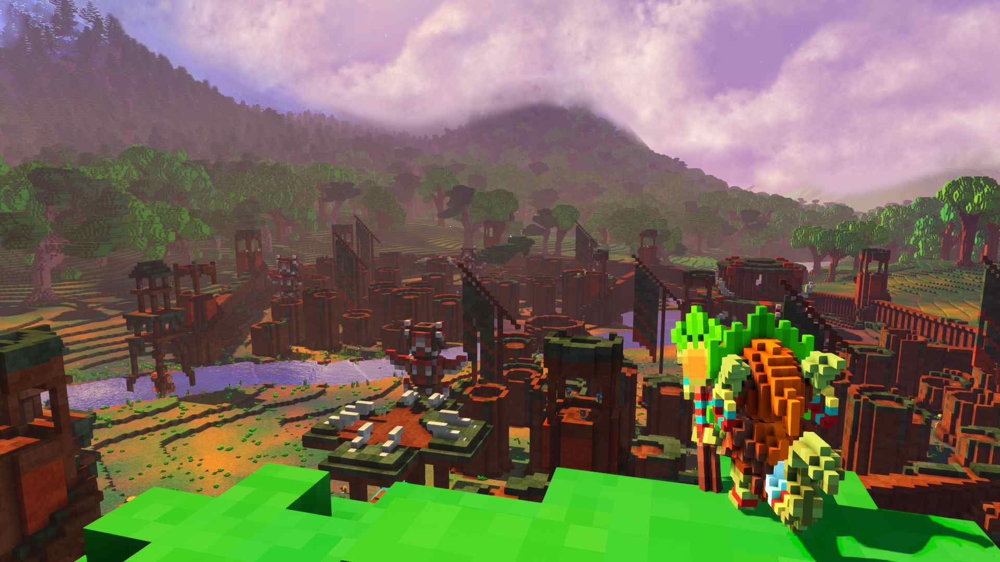
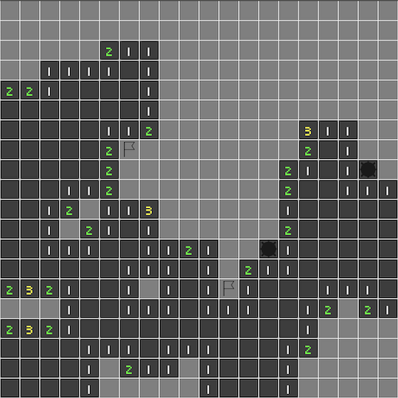

+++
title = "This Month in Rust GameDev #31 - February 2022"
transparent = true
date = 2022-03-01
draft = true
+++

<!-- no toc -->

<!-- Check the post with markdownlint-->

Welcome to the 31st issue of the Rust GameDev Workgroup's
monthly newsletter.
[Rust] is a systems language pursuing the trifecta:
safety, concurrency, and speed.
These goals are well-aligned with game development.
We hope to build an inviting ecosystem for anyone wishing
to use Rust in their development process!
Want to get involved? [Join the Rust GameDev working group!][join]

You can follow the newsletter creation process
by watching [the coordination issues][coordination].
Want something mentioned in the next newsletter?
[Send us a pull request][pr].
Feel free to send PRs about your own projects!

[Rust]: https://rust-lang.org
[join]: https://github.com/rust-gamedev/wg#join-the-fun
[pr]: https://github.com/rust-gamedev/rust-gamedev.github.io
[coordination]: https://github.com/rust-gamedev/rust-gamedev.github.io/issues?q=label%3Acoordination
[Rust]: https://rust-lang.org
[join]: https://github.com/rust-gamedev/wg#join-the-fun

- [Bevy Jam](#bevy-jam-1)
- [Rust GameDev Meetup](#rust-gamedev-meetup)
- [Game Updates](#game-updates)
- [Learning Material Updates](#learning-material-updates)
- [Engine Updates](#engine-updates)
- [Tooling Updates](#tooling-updates)
- [Library Updates](#library-updates)
- [Other News](#other-news)
- [Popular Workgroup Issues in Github](#popular-workgroup-issues-in-github)
- [Meeting Minutes](#meeting-minutes)
- [Discussions](#discussions)
- [Requests for Contribution](#requests-for-contribution)
- [Jobs](#jobs)
- [Bonus](#bonus)

<!--
Ideal section structure is:

```
### [Title]


_image caption_

A paragraph or two with a summary and [useful links].

_Discussions:
[/r/rust](https://reddit.com/r/rust/todo),
[twitter](https://twitter.com/todo/status/123456)_

[Title]: https://first.link
[useful links]: https://other.link
```

If needed, a section can be split into subsections with a "------" delimiter.
-->

## [Bevy Jam #1][bevy-jam]


The first ever [Bevy Jam][bevy-jam] just finished! Bevy Jam is a week long event,
where the goal is to make a game in [Bevy Engine][bevy-engine], the free and open-source
game engine built in Rust.

The theme was Unfair Advantage. 431 people joined the jam and 75 teams submitted
entries. A ten day "voting period" has started, which will end on March 14th.
[Anyone can play and vote on the submissions][bevy-jam-submissions].

The winning team will receive any two items from the [Bevy Merch][bevy-merch] store.

[bevy-jam]: https://itch.io/jam/bevy-jam-1/
[bevy-jam-submissions]: https://itch.io/jam/bevy-jam-1/entries
[bevy-engine]: https://bevyengine.org/
[bevy-merch]: https://merch.bevyengine.org/

## Rust GameDev Meetup


The 13th Rust Gamedev Meetup took place in in February. You can watch the
recording of the meetup [here on Youtube][gamedev-meetup-video]. The meetups
take place on the second Saturday every month via the [Rust Gamedev Discord
server][rust-gamedev-discord] and are also [streamed on
Twitch][rust-gamedev-twitch].

[gamedev-meetup-video]: https://youtu.be/adt63Gqt6yA
[rust-gamedev-discord]: https://discord.gg/yNtPTb2
[rust-gamedev-twitch]: https://twitch.tv/rustgamedev
[gamedev-meetup-form]: https://forms.gle/BS1zCyZaiUFSUHxe6
[rust-meetup-feb-time]: https://everytimezone.com/s/c1b2eb7b

## Game Updates

### [Name Needed][name-needed]


_The player orders a selection of blocks to be broken, and a brick wall to be
built._

[Name Needed][name-needed] by [@DomWilliams0][domwilliams-github] is a one-man
effort to produce an open source, intuitive and high performance Dwarf
Fortress-esque game with a custom engine.

Recent progress has been on procedural terrain generation, the player UI, item
stacks and build jobs. A major refactor of the AI system integrated Rust's
superb `async`/`await` support, which is documented in the most recent devlog.

- [Devlog #5: voxel world goals][name-needed-devlog5]
- [Devlog #6: async activities][name-needed-devlog6]
- [Devlog #7: custom async runtime][name-needed-devlog7]

[name-needed]: https://github.com/DomWilliams0/name-needed
[domwilliams-github]: https://github.com/DomWilliams0
[name-needed-devlog5]: https://domwillia.ms/devlog5/
[name-needed-devlog6]: https://domwillia.ms/devlog6/
[name-needed-devlog7]: https://domwillia.ms/devlog7/

### [This is Fine Sokoban][sokoban-github]


_Screenshot of This is Fine Sokoban_

This is Fine Sokoban ([GitHub][sokoban-github]) by
[@Syn-Nine][synnine-twitter] is a Sokoban game inspired by the This is Fine
meme created for the [Game Developers Refuge 4x4x4 Challenge] in February
2022. Use the arrow keys to push the TPS reports into the file folders while
the room is burning down and you're surrounded by clocks - a metaphor for
the developer's work life.

The 4x4x4 Challenge was to create a game based on four emojis. In
this case the chosen emoji combination was: :nerd_face: :open_file_folder:
:clock830: :fire:

The game is part of an open source repository of several mini-games that use
Syn9's [Rust Mini Game Framework][mgfw].

[sokoban-github]: https://github.com/Syn-Nine/rust-mini-games/tree/main/2d-games/sokoban
[synnine-twitter]: https://twitter.com/Syn9Dev
[Game Developers Refuge 4x4x4 Challenge]: https://noop.rocks/gdr/viewtopic.php?f=2&t=84
[mgfw]: https://github.com/Syn-Nine/mgfw

### [Build A Better Buddy][build-a-better-buddy]

[][build-a-better-buddy]

Build A Better Buddy is a cute auto-battler built by [@cart_cart][cart-cart] using
[Bevy Engine][buddy-bevy-engine] for [Bevy Jam #1][buddy-bevy-jam-1]. The source
code is [available here][buddy-source]. It runs on Windows, Mac, Linux, and
the Web.

[build-a-better-buddy]: https://cart.itch.io/build-a-better-buddy
[cart-cart]: https://twitter.com/cart_cart
[buddy-bevy-jam-1]: https://itch.io/jam/bevy-jam-1/
[buddy-bevy-engine]: https://bevyengine.org/
[buddy-source]: https://github.com/cart/build_a_better_buddy

### [Weegames]


[Weegames] is a fast-paced minigame collection available on web and Windows.
The latest release:

- Uses [quad-storage] on WASM to save high scores
  and a record of how games the player has played
- Fixes bug where the game was being played at an incorrect speed
  when the player's monitor was not 60hz
- Adds 8 more minigames

[Weegames]: https://yeahross.itch.io/weegames
[quad-storage]: https://crates.io/crates/quad-storage

### [Dis-order]


Dis-order by [@jkhelsing] is a short sokoban-esque puzzle game made in 72 hours
for MiniJam 100. In Dis-order you're making chaos instead of order, you win when
there are are no patterns or order in the level.

It's made using [Bevy][dis-order-bevy] and uses [bevy_smud][bevy_smud] for shape
rendering, and a compute pass for the [particle
effects][dis-order-particle-effects]. The levels are made with ldtk and loaded
using [bevy_ecs_ldtk][bevy_ecs_ldtk]. Read more about this in the
[post-mortem][dis-order-post-mortem].

[Download the game on itch.io][Dis-order].

[Dis-order]: https://jhelsing.itch.io/dis-order
[bevy_smud]: https://github.com/johanhelsing/bevy_smud
[dis-order-bevy]: https://bevyengine.org
[bevy_ecs_ldtk]: https://github.com/Trouv/bevy_ecs_ldtk
[dis-order-post-mortem]: https://johanhelsing.studio/posts/dis-order
[dis-order-particle-effects]: https://twitter.com/jkhelsing/status/1495604656164282374
[@jkhelsing]: https://twitter.com/jkhelsing

### [Molecoole][molecoole-steam]

[][molecoole-steam]

Molecoole is a top-down shooter roguelike where you build your character from
different atoms. Each atom has a unique ability to provide tons of variety
between playthroughs. It's made using the [Bevy Engine][bevy-engine].

This month Molecoole launched on [Steam][molecoole-steam], making it the first
game made with Bevy Engine there! It's available on Windows and Linux. You can
check out its gameplay on [youtube][youtube-molecoole], or on the Steam page.

[molecoole-steam]: https://store.steampowered.com/app/1792170/Molecoole/
[youtube-molecoole]: https://www.youtube.com/watch?v=bwbVplq03ew
[bevy-engine]: https://github.com/bevyengine/bevy

### [Veloren][veloren]


_Looking out over the Gnarling fort_

[Veloren][veloren] is an open world, open-source voxel RPG inspired by Dwarf
Fortress and Cube World.

In February, [Veloren 0.12 was released][veloren-012-release-blog]. For the
release, a [trailer with some of the changes][veloren-012-release-trailer] was
posted. This release was 5 months in the making, so the changelog is quite
large. During the release party, the official server reached a cap of 195
players online at once, which is another record for Veloren. Changes were made
to allow server owners to more easily handle IPv4 and IPv6 connections.
Improvements were also made to trading price calculations to properly normalize
loot tables.

Two Veloren Reading Clubs were held in February. [The first
one][veloren-reading-club-5] explored using Git to contribute, and how to add
some new NPC characters. [The second one][veloren-reading-club-6] explored how
some of Git's more intricate features worked, as well as how economy simulations
are done. Work was done to allow species to defend others of the same species,
to allow for more realistic combat in the wild. A [Mastodon
page][veloren-mastodon] was also created for Veloren. Gnarlings forts were also
added, which adds a whole new area for players to fight in.

February's full weekly devlogs: "This Week In Veloren...":
[#158][veloren-158],
[#159][veloren-159],
[#160][veloren-160],
[#161][veloren-161].

[veloren]: https://veloren.net
[veloren-mastodon]: https://mastodon.technology/@veloren
[veloren-012-release-blog]: https://veloren.net/release-0-12/
[veloren-012-release-trailer]: https://www.youtube.com/watch?v=604JC5QdYQE
[veloren-reading-club-5]: https://www.youtube.com/watch?v=f9PXtKEwedQ
[veloren-reading-club-6]: https://www.youtube.com/watch?v=MbiLZvuBLzc

[veloren-158]: https://veloren.net/devblog-158
[veloren-159]: https://veloren.net/devblog-159
[veloren-160]: https://veloren.net/devblog-160
[veloren-161]: https://veloren.net/devblog-161

## Engine Updates

### [DIMS]

[][DIMS-first-look]

@jfnoren ([Twitter][@jfnoren-twitter], [Github][@jfnoren-github]) posted a
[video][DIMS-first-look] about a first look into their engine, DIMS. DIMS allows
you to create open worlds, script gameplay, and mess around with physics. DIMS
has been in the works for several months, but you can now sign up for early
access on [their website][DIMS].

_Discussions: [Reddit][DIMS-reddit-discussion], [Twitter][DIMS-twitter-discussion]_

[@jfnoren-twitter]: https://twitter.com/jfnoren
[@jfnoren-github]: https://github.com/FredrikNoren
[DIMS]: https://www.dims.co/
[DIMS-first-look]: https://www.youtube.com/watch?v=58HS-PN71Mw
[DIMS-reddit-discussion]: https://www.reddit.com/r/rust_gamedev/comments/snhi5u/some_months_into_building_and_wed_never_have/
[DIMS-twitter-discussion]: https://twitter.com/jfnoren/status/1491077331850776576

## Learning Material Updates

### [Bevy Minesweeper]


_Demo Screenshot_

[@ManevilleF] published a 12 step [course][Bevy Minesweeper] on how to make a
simple 2D Minesweeper using [bevy][bevy] 0.6.
A [public repository][bevy_minesweeper_repo] is
available, as well as a live [demo][bevy_minesweeper_demo].

The tutorial showcases:

- essential features of the [bevy][bevy] engine
- important ECS notions for beginners
- WASM build
- and soon, android native apk build

_Discussions: [Twitter][bevy_minesweeper_twitter], [dev.to][Bevy Minesweeper]_

[Bevy Minesweeper]: https://dev.to/qongzi/bevy-minesweeper-introduction-4l7f
[bevy_minesweeper_repo]: https://gitlab.com/qonfucius/minesweeper-tutorial
[bevy_minesweeper_demo]: https://qonfucius.gitlab.io/minesweeper-tutorial/
[bevy]: https://bevyengine.org
[@ManevilleF]: https://github.com/ManevilleF
[bevy_minesweeper_twitter]: https://twitter.com/ManevilleF/status/1495787155280510977?s=20&t=omNFCI2cWgDFNC0MC7NWTg

### [Computing image filters with wgpu-rs]

[@Redwarp] posted a [blog post][Computing image filters with wgpu-rs] that goes
through the process of creating a simple image processing pipeline with compute
shaders, using wgpu-rs. The post takes you through several steps in this
process:

- Wgpu basics
- Loading a texture
- A simple shader
- Bind group
- Workgroup and dispatch

[Computing image filters with wgpu-rs]: https://blog.redwarp.app/image-filters/
[@Redwarp]: https://twitter.com/redwarp

### [Actor Pattern with Async Rust]

@Sorokya ([Twitter][sorokya-twitter], [Github][sorokya-github]) [published a blog
post][Actor Pattern with Async Rust] about how they improved their game server
by switching over to an actor pattern approach. This method allowed the server
to be refactored to be more modular and cleaner.

[Actor Pattern with Async Rust]: https://eo-rs.dev/blog/the-actor-pattern-with-async-rust/
[sorokya-twitter]: https://twitter.com/sorokya
[sorokya-github]: https://github.com/sorokya

### [Godot-Rust to Android without Android Studio][godot-rust-to-android]


_Proof of concept Godot app running on Android_

[@coffeecodechem] published a [blog post][godot-rust-to-android] on how to
export godot-rust as an Android APK on Windows without using Android Studio. It
goes beyond the godot-rust book that specifies "steps are tested and confirmed
to work on Linux only", and details what is needed to make it work on Windows.

The post shows how to set up the JDK and Rust, set up the keystore, and how to
build the required GDNative libraries.

[@coffeecodechem]: https://twitter.com/coffeecodechem
[godot-rust-to-android]: https://coffeecodechem.com/2022/02/exporting-godot-rust-android-apk-windows/

### [Supercharging your Web with Rust and Bevy]

Bruno Lipovac [released a blog post][Supercharging your Web with Rust and Bevy]
that detailed building 3D applications for use on the web with Bevy. It walks
through setting up a Bevy project, and importing some models. It also details
some more fine-detail items, such as lighting and sky. It then shows how to
compile the project and serve it.

[Supercharging your Web with Rust and Bevy]: https://www.barrage.net/blog/technology/how-to-supercharge-your-web-with-3d-capabilities-by

## Tooling Updates

### [Vismut]


[Vismut] ([GitLab][Vismut GitLab], [Zulip][Vismut Zulip]) by
[@lukors][Vismut @lukors]
will be a procedural texturing tool.

This application saw its first public release a month ago, where it added
support for its first use case: manual channel shuffling.

The latest version, [v0.4.0][Vismut v0.4.0], brings an all new interface that's
not only prettier, but also much easier to use thanks to `bevy_egui`!

Upcoming versions will turn it into a fully featured node based procedural
texturing tool. [Read the introduction][Vismut Introduction]
on the author's blog for more information.

[Vismut]: http://vismut.org
[Vismut GitLab]: https://gitlab.com/vismut-org/vismut
[Vismut Zulip]: https://vismut.zulipchat.com
[Vismut @lukors]: https://gitlab.com/lukors
[Vismut v0.4.0]: https://gitlab.com/vismut-org/vismut/-/releases/v0.4.0
[Vismut Introduction]: https://orsvarn.com/introducing-vismut/

### [Blackjack]


[Blackjack] by @setzer22 is a new procedural modeling application made in Rust,
using rend3, wgpu and egui. It follows the steps of applications like
Houdini, or Blender's geometry nodes project and provides a node-based
environment to compose procedural recipes to create 3d models.

The last two months have been quite busy for Blackjack. After an initial open
source release, several new features have been added:

- Added a resizeable viewport system, with node graph pan and zoom.
- Built an initial implementation for a properties inspector and geometry
  spreadsheet panels.
- Added a subdivision node, with a fast catmull-clark subdivision technique
 based on
 [this recent paper][blackjack-paper]
- Separated the node graph functionality into
 [its own crate][blackjack-node-graph-crate]

_Discussions:
[/r/rust_gamedev](https://www.reddit.com/r/rust_gamedev/comments/srgd41/your_rusty_procedural_3d_modeler_blackjack_just/),
[/r/rust](https://www.reddit.com/r/rust/comments/sfqung/media_blackjacks_eguibased_node_graph_now/)_

[Blackjack]: https://github.com/setzer22/blackjack
[blackjack-paper]: https://onrendering.com/data/papers/catmark/HalfedgeCatmullClark.pdf
[blackjack-node-graph-crate]: https://github.com/setzer22/egui_node_graph

### [Graphite][graphite-website]


Graphite is an in-development raster and vector 2D graphics editor that is free
and open source. It will be powered by a node graph compositing engine that
supercharges your layer stack, providing a completely non-destructive editing
experience.

After officially launching the alpha version last month, work has progressed
designing the node graph system. Also, the team has spent this month adding
polish to the application and continuing work on more website content.

A new editor feature is the Gradient tool which makes it possible to add some
colorful pizzazz. This means that finally all vector editing tools are
implemented, but some can still use improvement. (Ask how you can help with
that!) Additional work has gone into visual changes to help aid in clarity and
discoverability for new users.

Check out the [new website][graphite-website], try the
[Graphite editor][graphite-live-demo] right now in your browser, star on
[GitHub][graphite-repo], follow on [Twitter][graphite-twitter], and join the
[Discord][graphite-discord] to chat or get involved!

[graphite-website]: https://graphite.rs
[graphite-live-demo]: https://editor.graphite.rs
[graphite-repo]: https://github.com/GraphiteEditor/Graphite
[graphite-twitter]: https://twitter.com/GraphiteEditor
[graphite-discord]: https://discord.graphite.rs

## Library Updates

### [vach]

[vach] is an archiving file format developed from the ground up for games and
other realtime applications by [@zeskeertwee] and [@sokorototo]. It is
written in pure Rust.

Its primary objectives (in no particular order) are:

- Have a simple, yet complete API.
- Fine control over each individual entry in an archive, i.e. neighbouring
  entries can have vastly different compression schemes.
- Support compression (with multiple compression schemes), encryption,
  and signatures for data authentication
- Efficient fetching of data by avoiding unnecessary traversal of the file.
  Once a file is parsed, locations of every entry are known to the loader.
- Be as compact as possible - the smallest valid archive is only 13 bytes.
- Each entry has some metadata attached to it - this is implemented using
  bitflags and up to 8 bits are free to the user.
- Has mutlithreaded implementations of both the loader and the writer.

A [CLI][vach-cli] is allowing one to use vach as a general purpose archive
format. The CLI is fully multithreaded, allowing for insane un/packing speeds.

Feel free to drop into the [repo][vach] and open an issue, pull request or
drop a star 🌟. It helps maintain momentum in the project.

[vach]: https://github.com/zeskeertwee/vach
[vach-cli]: https://crates.io/crates/vach-cli
[@zeskeertwee]: https://github.com/zeskeertwee
[@sokorototo]: https://github.com/sokorototo

### Sparsey 0.7


[Sparsey] by [@LechintanTudor] is a sparse set-based Entity Component System
with beautiful and concise syntax.

The biggest change in this release was the removal of component change detection
which had a significant impact on performance and memory usage. As a result,
Sparsey performs much better in all benchmarks and the codebase is easier to
maintain.

The systems module received a major overhaul with an improved scheduling
algorithm, allowing more systems to run in parallel, and an important usability
improvement allowing systems to be added to schedules without having to call
`.system()` on the system functions.

[Sparsey]: https://github.com/LechintanTudor/sparsey
[@LechintanTudor]: https://github.com/LechintanTudor

### [Encase]


[Encase] ([docs.rs], [crates.io]) by [@teoxoy] is a new library
that provides a mechanism to lay out data into GPU buffers
according to [WGSL's memory layout] rules.

Features

- supports all WGSL [host-shareable types] + wrapper types
  (`&T`, `&mut T`, `Box<T>`, ...)
- extensible by design; most traits can be easily implemented
  for user defined types via macros (see [design])
- built in support for data types from a multitude of crates
  (enabled via [features])
- covers a wide area of use cases (see [examples])

Example

```rust
use encase::{WgslType, UniformBuffer};

#[derive(WgslType)]
struct AffineTransform2D {
    matrix: glam::Mat2,
    translate: glam::Vec2
}

let transform = AffineTransform2D {
    matrix: glam::Mat2::IDENTITY,
    translate: glam::Vec2::ZERO,
};

let mut buffer = UniformBuffer::new(Vec::new());
buffer.write(&transform).unwrap();
let byte_buffer = buffer.into_inner();

// write byte_buffer to GPU
```

[Encase]: https://github.com/teoxoy/encase
[docs.rs]: https://docs.rs/encase/latest/encase
[crates.io]: https://crates.io/crates/encase
[@teoxoy]: https://github.com/teoxoy
[WGSL's memory layout]: https://gpuweb.github.io/gpuweb/wgsl/#memory-layouts
[host-shareable types]: https://gpuweb.github.io/gpuweb/wgsl/#host-shareable-types
[design]: https://docs.rs/encase/latest/encase/#design
[features]: https://docs.rs/crate/encase/latest/features
[examples]: https://docs.rs/encase/latest/encase/#examples

### [Notan]


The first version of [Notan] was released.
[Notan] aims to be a simple and portable multimedia layer, designed to make
your own multimedia app on top of it without worrying too much about
platform-specific code.

The main goal is to provide a set of APIs and tools that can be used to create
your project in an ergonomic manner without enforcing any structure or pattern,
always trying to stay out of your way. The idea is that you can use it as a
foundation layer or backend for your next app, game engine or game.

This first version comes with windowing, input and rendering support on MacOS,
Linux, Windows and Web. Behind feature flags you can use a fast 2D renderer,
text rendering, and [egui] integration.  

You can try [Notan] by adding it to your `Cargo.toml` -> `notan = "0.1.0"` or
checking the [online demos].

[Notan]: https://github.com/Nazariglez/notan
[online demos]: https://nazariglez.github.io/notan-web/
[egui]: https://github.com/emilk/egui

### [bevy_asset_loader]


[bevy_asset_loader] by [@nikl_me] is a [Bevy] plugin that aims to reduce boilerplate for asset handling in Bevy apps. 

Last month saw the release of version `0.6` which added support for loading asset configurations from `.ron` files like the one shown above. This allows for resolving asset configurations like their file path or sprite sheet dimensions at run time. The feature is called "dynamic assets" and enables use cases like internationalised assets.

[@nikl_me] wrote a [blog post][dynamic_assets_post] about dynamic assets in
[bevy_asset_loader]. The post outlines the idea of the feature and describes current and planned functionality.

[dynamic_assets_post]: https://www.nikl.me/blog/2022/dynamic-assets-in-bevy_asset_loader/
[bevy_asset_loader]: https://github.com/NiklasEi/bevy_asset_loader
[bevy]: https://github.com/bevyengine/bevy
[@nikl_me]: https://twitter.com/nikl_me

## Popular Workgroup Issues in Github

<!-- Up to 10 links to interesting issues -->

## Other News

<!-- One-liners for plan items that haven't got their own sections. -->

## Meeting Minutes

<!-- Up to 10 most important notes + a link to the full details -->

[See all meeting issues][label_meeting] including full text notes
or [join the next meeting][join].

[label_meeting]: https://github.com/rust-gamedev/wg/issues?q=label%3Ameeting

## Discussions

<!-- Links to handpicked reddit/twitter/urlo/etc threads that provide
useful information -->

## Requests for Contribution

<!-- Links to "good first issue"-labels or direct links to specific tasks -->

## Jobs

<!-- An optional section for new jobs related to Rust gamedev -->

## Bonus

<!-- Bonus section to make the newsletter more interesting
and highlight events from the past. -->

------

That's all news for today, thanks for reading!

Want something mentioned in the next newsletter?
[Send us a pull request][pr].

Also, subscribe to [@rust_gamedev on Twitter][@rust_gamedev]
or [/r/rust_gamedev subreddit][/r/rust_gamedev] if you want to receive fresh news!

<!--
TODO: Add real links and un-comment once this post is published
**Discuss this post on**:
[/r/rust_gamedev](TODO),
[Twitter](TODO),
[Discord](https://discord.gg/yNtPTb2).
-->

[/r/rust_gamedev]: https://reddit.com/r/rust_gamedev
[@rust_gamedev]: https://twitter.com/rust_gamedev
[pr]: https://github.com/rust-gamedev/rust-gamedev.github.io
