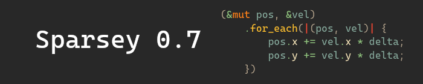

+++
title = "This Month in Rust GameDev #31 - February 2022"
transparent = true
date = 2022-03-01
draft = true
+++

<!-- no toc -->

<!-- Check the post with markdownlint-->

Welcome to the 31st issue of the Rust GameDev Workgroup's
monthly newsletter.
[Rust] is a systems language pursuing the trifecta:
safety, concurrency, and speed.
These goals are well-aligned with game development.
We hope to build an inviting ecosystem for anyone wishing
to use Rust in their development process!
Want to get involved? [Join the Rust GameDev working group!][join]

You can follow the newsletter creation process
by watching [the coordination issues][coordination].
Want something mentioned in the next newsletter?
[Send us a pull request][pr].
Feel free to send PRs about your own projects!

[Rust]: https://rust-lang.org
[join]: https://github.com/rust-gamedev/wg#join-the-fun
[pr]: https://github.com/rust-gamedev/rust-gamedev.github.io
[coordination]: https://github.com/rust-gamedev/rust-gamedev.github.io/issues?q=label%3Acoordination
[Rust]: https://rust-lang.org
[join]: https://github.com/rust-gamedev/wg#join-the-fun

- [Game Updates](#game-updates)
- [Learning Material Updates](#learning-material-updates)
- [Engine Updates](#engine-updates)
- [Tooling Updates](#tooling-updates)
- [Library Updates](#library-updates)
- [Other News](#other-news)
- [Popular Workgroup Issues in Github](#popular-workgroup-issues-in-github)
- [Meeting Minutes](#meeting-minutes)
- [Discussions](#discussions)
- [Requests for Contribution](#requests-for-contribution)
- [Jobs](#jobs)
- [Bonus](#bonus)

<!--
Ideal section structure is:

```
### [Title]


_image caption_

A paragraph or two with a summary and [useful links].

_Discussions:
[/r/rust](https://reddit.com/r/rust/todo),
[twitter](https://twitter.com/todo/status/123456)_

[Title]: https://first.link
[useful links]: https://other.link
```

If needed, a section can be split into subsections with a "------" delimiter.
-->

## Game Updates

### [Name Needed][name-needed]


_The player orders a selection of blocks to be broken, and a brick wall to be
built._

[Name Needed][name-needed] by [@DomWilliams0][domwilliams-github] is a one-man
effort to produce an open source, intuitive and high performance Dwarf
Fortress-esque game with a custom engine.

Recent progress has been on procedural terrain generation, the player UI, item
stacks and build jobs. A major refactor of the AI system integrated Rust's
superb `async`/`await` support, which is documented in the most recent devlog.

- [Devlog #5: voxel world goals][name-needed-devlog5]
- [Devlog #6: async activities][name-needed-devlog6]
- [Devlog #7: custom async runtime][name-needed-devlog7]

[name-needed]: https://github.com/DomWilliams0/name-needed
[domwilliams-github]: https://github.com/DomWilliams0
[name-needed-devlog5]: https://domwillia.ms/devlog5/
[name-needed-devlog6]: https://domwillia.ms/devlog6/
[name-needed-devlog7]: https://domwillia.ms/devlog7/

### [This is Fine Sokoban][sokoban-github]


_Screenshot of This is Fine Sokoban_

This is Fine Sokoban ([GitHub][sokoban-github]) by
[@Syn-Nine][synnine-twitter] is a Sokoban game inspired by the This is Fine
meme created for the [Game Developers Refuge 4x4x4 Challenge] in February
2022. Use the arrow keys to push the TPS reports into the file folders while
the room is burning down and you're surrounded by clocks - a metaphor for
the developer's work life.

The 4x4x4 Challenge was to create a game based on four emojis. In
this case the chosen emoji combination was: :nerd_face: :open_file_folder:
:clock830: :fire:

The game is part of an open source repository of several mini-games that use
Syn9's [Rust Mini Game Framework][mgfw].

[sokoban-github]: https://github.com/Syn-Nine/rust-mini-games/tree/main/2d-games/sokoban
[synnine-twitter]: https://twitter.com/Syn9Dev
[Game Developers Refuge 4x4x4 Challenge]: https://noop.rocks/gdr/viewtopic.php?f=2&t=84
[mgfw]: https://github.com/Syn-Nine/mgfw

### [Build A Better Buddy][build-a-better-buddy]

[][build-a-better-buddy]

Build A Better Buddy is a cute auto-battler built by [@cart_cart][cart-cart] using
[Bevy Engine][buddy-bevy-engine] for [Bevy Jam #1][buddy-bevy-jam-1]. The source
code is [available here][buddy-source]. It runs on Windows, Mac, Linux, and
the Web.

[build-a-better-buddy]: https://cart.itch.io/build-a-better-buddy
[cart-cart]: https://twitter.com/cart_cart
[buddy-bevy-jam-1]: https://itch.io/jam/bevy-jam-1/
[buddy-bevy-engine]: https://bevyengine.org/
[buddy-source]: https://github.com/cart/build_a_better_buddy

### [Weegames]


[Weegames] is a fast-paced minigame collection available on web and Windows.
The latest release:

- Uses [quad-storage] on WASM to save high scores
  and a record of how games the player has played
- Fixes bug where the game was being played at an incorrect speed
  when the player's monitor was not 60hz
- Adds 8 more minigames

[Weegames]: https://yeahross.itch.io/weegames
[quad-storage]: https://crates.io/crates/quad-storage

## Engine Updates

## Learning Material Updates

## Tooling Updates

### [Vismut]


[Vismut] ([GitLab][Vismut GitLab], [Zulip][Vismut Zulip]) by
[@lukors][Vismut @lukors]
will be a procedural texturing tool.

This application saw its first public release a month ago, where it added
support for its first use case: manual channel shuffling.

The latest version, [v0.4.0][Vismut v0.4.0], brings an all new interface that's
not only prettier, but also much easier to use thanks to `bevy_egui`!

Upcoming versions will turn it into a fully featured node based procedural
texturing tool. [Read the introduction][Vismut Introduction]
on the author's blog for more information.

[Vismut]: http://vismut.org
[Vismut GitLab]: https://gitlab.com/vismut-org/vismut
[Vismut Zulip]: https://vismut.zulipchat.com
[Vismut @lukors]: https://gitlab.com/lukors
[Vismut v0.4.0]: https://gitlab.com/vismut-org/vismut/-/releases/v0.4.0
[Vismut Introduction]: https://orsvarn.com/introducing-vismut/

## Library Updates

### [vach]

[vach] is an archiving file format developed from the ground up for games and
other realtime applications by [@zeskeertwee] and [@sokorototo]. It is
written in pure Rust.

Its primary objectives (in no particular order) are:

- Have a simple, yet complete API.
- Fine control over each individual entry in an archive, i.e. neighbouring
  entries can have vastly different compression schemes.
- Support compression (with multiple compression schemes), encryption,
  and signatures for data authentication
- Efficient fetching of data by avoiding unnecessary traversal of the file.
  Once a file is parsed, locations of every entry are known to the loader.
- Be as compact as possible - the smallest valid archive is only 13 bytes.
- Each entry has some metadata attached to it - this is implemented using
  bitflags and up to 8 bits are free to the user.
- Has mutlithreaded implementations of both the loader and the writer.

A [CLI][vach-cli] is allowing one to use vach as a general purpose archive
format. The CLI is fully multithreaded, allowing for insane un/packing speeds.

Feel free to drop into the [repo][vach] and open an issue, pull request or
drop a star 🌟. It helps maintain momentum in the project.

[vach]: https://github.com/zeskeertwee/vach
[vach-cli]: https://crates.io/crates/vach-cli
[@zeskeertwee]: https://github.com/zeskeertwee
[@sokorototo]: https://github.com/sokorototo

### Sparsey 0.7



[Sparsey] by [@LechintanTudor] is a sparse set-based Entity Component System
with beautiful and concise syntax.

The biggest change in this release was the removal of component change detection
which had a significant impact on performance and memory usage. As a result,
Sparsey performs much better in all benchmarks and the codebase is easier to
maintain.

The systems module received a major overhaul with an improved scheduling
algorithm, allowing more systems to run in parallel, and an important usability
improvement allowing systems to be added to schedules without having to call
`.system()` on the system functions.

[Sparsey]: https://github.com/LechintanTudor/sparsey
[@LechintanTudor]: https://github.com/LechintanTudor

## Popular Workgroup Issues in Github

<!-- Up to 10 links to interesting issues -->

## Other News

<!-- One-liners for plan items that haven't got their own sections. -->

## Meeting Minutes

<!-- Up to 10 most important notes + a link to the full details -->

[See all meeting issues][label_meeting] including full text notes
or [join the next meeting][join].

[label_meeting]: https://github.com/rust-gamedev/wg/issues?q=label%3Ameeting

## Discussions

<!-- Links to handpicked reddit/twitter/urlo/etc threads that provide
useful information -->

## Requests for Contribution

<!-- Links to "good first issue"-labels or direct links to specific tasks -->

## Jobs

<!-- An optional section for new jobs related to Rust gamedev -->

## Bonus

<!-- Bonus section to make the newsletter more interesting
and highlight events from the past. -->

------

That's all news for today, thanks for reading!

Want something mentioned in the next newsletter?
[Send us a pull request][pr].

Also, subscribe to [@rust_gamedev on Twitter][@rust_gamedev]
or [/r/rust_gamedev subreddit][/r/rust_gamedev] if you want to receive fresh news!

<!--
TODO: Add real links and un-comment once this post is published
**Discuss this post on**:
[/r/rust_gamedev](TODO),
[Twitter](TODO),
[Discord](https://discord.gg/yNtPTb2).
-->

[/r/rust_gamedev]: https://reddit.com/r/rust_gamedev
[@rust_gamedev]: https://twitter.com/rust_gamedev
[pr]: https://github.com/rust-gamedev/rust-gamedev.github.io
