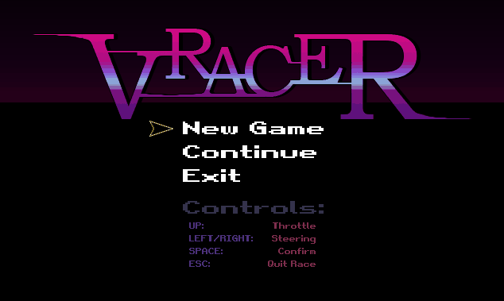
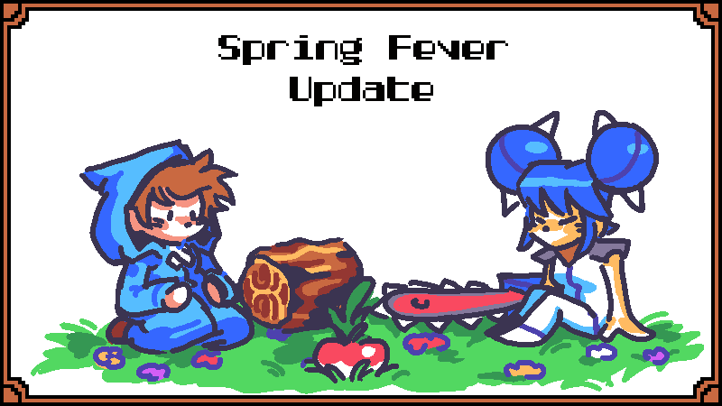

+++
title = "This Month in Rust GameDev #32 - March 2022"
transparent = true
date = 2022-04-01
draft = true
+++

<!-- no toc -->

<!-- Check the post with markdownlint-->

Welcome to the {TODO}th issue of the Rust GameDev Workgroup's
monthly newsletter.
[Rust] is a systems language pursuing the trifecta:
safety, concurrency, and speed.
These goals are well-aligned with game development.
We hope to build an inviting ecosystem for anyone wishing
to use Rust in their development process!
Want to get involved? [Join the Rust GameDev working group!][join]

You can follow the newsletter creation process
by watching [the coordination issues][coordination].
Want something mentioned in the next newsletter?
[Send us a pull request][pr].
Feel free to send PRs about your own projects!

[Rust]: https://rust-lang.org
[join]: https://github.com/rust-gamedev/wg#join-the-fun
[pr]: https://github.com/rust-gamedev/rust-gamedev.github.io
[coordination]: https://github.com/rust-gamedev/rust-gamedev.github.io/issues?q=label%3Acoordination
[Rust]: https://rust-lang.org
[join]: https://github.com/rust-gamedev/wg#join-the-fun

- [Game Updates](#game-updates)
- [Learning Material Updates](#learning-material-updates)
- [Engine Updates](#engine-updates)
- [Tooling Updates](#tooling-updates)
- [Library Updates](#library-updates)
- [Other News](#other-news)
- [Popular Workgroup Issues in Github](#popular-workgroup-issues-in-github)
- [Meeting Minutes](#meeting-minutes)
- [Discussions](#discussions)
- [Requests for Contribution](#requests-for-contribution)
- [Jobs](#jobs)
- [Bonus](#bonus)

<!--
Ideal section structure is:

```
### [Title]


_image caption_

A paragraph or two with a summary and [useful links].

_Discussions:
[/r/rust](https://reddit.com/r/rust/todo),
[twitter](https://twitter.com/todo/status/123456)_

[Title]: https://first.link
[useful links]: https://other.link
```

If needed, a section can be split into subsections with a "------" delimiter.
-->

## Game Updates

### [Bevy Jam][jam-result-page]

TODO

[jam-result-page]: https://itch.io/jam/bevy-jam-1/results

#### [Warlock's Gambit][warlocks-gambit-itchio]


_Screenshot of Warlock's Gambit_

[Warlock's Gambit][warlocks-gambit-itchio] is a puzzle game constructed like a
card game, playable in the browser. You are given a static deck and have to play
your cards carefully to beat your opponent. In keeping with the theme of the
jam, the decks are stacked against you, in fact, it's impossible to win by
default. But you have a trick up your sleeve, literally. You can drag a card in
your sleeve to play it later.

The jam release was limited and confusing, but a post-jam update fixed the
most annoying bugs, clarified the game rules, enabled importing custom decks,
and added great code documentation (including a flow diagram demonstrating the
game state changes).

The game code is licensed under MIT or Apache-2 and is [available on
Github][warlocks-gambit-github].

[warlocks-gambit-itchio]: https://gibonus.itch.io/warlocks-gambit
[warlocks-gambit-github]: https://github.com/team-plover/warlocks-gambit

### [V-Racer][vracer-github]


_Screenshot of V-Racer_

V-Racer ([GitHub][vracer-github]) by
[@Syn-Nine][synnine-twitter] is a retro
drift racing game inspired by Atari
Battlezone and Wipeout created using
Syn9's [Rust Mini Game Framework][mgfw].
The game is part of an open source
[repository][s9-minigame-repo] of several
mini-games that use this framework.

[vracer-github]: https://github.com/Syn-Nine/rust-mini-games/tree/main/2d-games/vracer
[synnine-twitter]: https://twitter.com/Syn9Dev
[mgfw]: https://github.com/Syn-Nine/mgfw
[s9-minigame-repo]: https://github.com/Syn-Nine/rust-mini-games/

### [Harvest Hero Origins - Spring Fever][hho-steam]



Harvest Hero Origins by Gemdrop Games is an Arcade Wave Defense game featuring
a co-op survival mode.

[Gemdrop Games][ggt] collaborated with [Pixadome][pd] to bring
their featured character Blue
from [Chenso Club][cc] to the survival roster. Please go wishlist Chenso Club
to support the developers!

Blue is an android who wields a chainsaw to rip and tear through her enemies.
Slice and dice, then ride through enemies
in the new [Spring Fever expansion][spring-fever]!

[hho-steam]: https://store.steampowered.com/app/1651500/Harvest_Hero_Origins/
[ggt]: https://twitter.com/GemdropGames
[pd]: https://www.pixadome.com/
[cc]: https://store.steampowered.com/app/1454730/Chenso_Club/
[spring-fever]: https://store.steampowered.com/news/app/1651500/view/3112556530755817232

### [Veloren][veloren]


_Veloren on the Steam Deck!_

[Veloren][veloren] is an open world, open-source voxel RPG inspired by Dwarf
Fortress and Cube World.

In March, Veloren was tested game on the SteamDeck, which you can read about in
detail in [the weekly devblog][veloren-steamdeck-section]. Lots of work was done
with Airshipper, Veloren's launcher, including some bug fixes, but mainly the
switch to Github Releases as the download backend. This will make game updates
significantly faster and more reliable for players. Work is also being done to
make use of Github's HTTP range requests to do partial patches where possible.
Audio work was done to improve swimming sounds playing unevenly, and more sounds
to gliding.

Veloren was also mentioned [on Hacker News][veloren-hn], and lots of great
discussions happened in the comment section. In 2021, Veloren spoke at Rust in
Arts, and [the recording has recently been posted][veloren-rust-in-arts]. The
0.13 release map is in the works, with a jungle theme. CliffTowns are being
developed, as a new town located in the mountains. Veloren recorded another
reading club episode, this time about [Tracy and
optimizations][veloren-reading-club-7]. A new series was also started, and the
first [Veloren Code Review was recorded][veloren-code-review-1].

March's full weekly devlogs: "This Week In Veloren...":
[#162][veloren-162],
[#163][veloren-163],
[#164][veloren-164],
[#165][veloren-165].

[veloren]: https://veloren.net
[veloren-reading-club-7]: https://www.youtube.com/watch?v=-w0yTCjsV0k
[veloren-code-review-1]: https://www.youtube.com/watch?v=gomKwQnEGA8
[veloren-steamdeck-section]: https://veloren.net/devblog-162#veloren-on-steamdeck-by-angelonfira
[veloren-hn]: https://news.ycombinator.com/item?id=30667022
[veloren-rust-in-arts]: https://rustfest.global/session/53-directors-commentary-veloren/

[veloren-162]: https://veloren.net/devblog-162
[veloren-163]: https://veloren.net/devblog-163
[veloren-164]: https://veloren.net/devblog-164
[veloren-165]: https://veloren.net/devblog-165

## Engine Updates

## Learning Material Updates

## Tooling Updates

## Library Updates

### [bevy_match3]


[bevy_match3] ([GitHub](https://github.com/Sheepyhead/bevy_match3))
by [@Sheepyhead](https://twitter.com/devsheepy)
is an event-based Bevy crate for handling the logic side of match 3 games so
you can worry about making everything else!

This was recently released in its first public version, so there are several
parts to improve, and it could really use some battle testing.

[bevy_match3]: https://crates.io/crates/bevy_match3

### [dos-like-rs]


[dos-like-rs] by [@E_net4]
provides Rust bindings to Mattias Gustavsson's `dos-like`,
a cross-platform framework for writing modern applications
with the look & feel of MS-DOS programs from the early 90's.

A few technical details about the conception of these bindings
are presented in a [blog post on Dev.to][dos-like-rs-dev].

[dos-like-rs]: https://github.com/Enet4/dos-like-rs
[@E_net4]: https://twitter.com/E_net4
[dos-like-rs-dev]: https://dev.to/e_net4/writing-bindings-to-dos-like-for-rust-some-lessons-learned-2p6k

### [godot-rust](https://github.com/godot-rust/godot-rust)


godot-rust ([GitHub][gd-github], [Discord][gd-discord], [Twitter][gd-twitter])
is a Rust library that provides bindings for the Godot game engine.

We are pleased to announce the release of godot-rust version 0.10.0.
This update brings many new quality-of-life features, such as basic
async and serde support, more flexible exporting of Rust symbols to
Godot, better CI and doc integration, among many more features that
have previously been exclusive to the [GitHub repo][gd-github].

This release also makes the the API much more more user-friendly than
previous versions with more consistent naming, flatter module structure
and fewer redundancies.

Thank you to all of the contributors who made this possible!

A full list of a the changes are available in the [changelog][gd-changelog].

[gd-announcement]: https://godot-rust.github.io/releases/
[gd-changelog]: https://github.com/godot-rust/godot-rust/blob/master/CHANGELOG.md

[gd-docs]: https://godot-rust.github.io/docs
[gd-github]: https://github.com/godot-rust/godot-rust
[gd-discord]: https://discord.com/invite/FNudpBD
[gd-twitter]: https://twitter.com/GodotRust

## Popular Workgroup Issues in Github

<!-- Up to 10 links to interesting issues -->

## Other News

<!-- One-liners for plan items that haven't got their own sections. -->

## Meeting Minutes

<!-- Up to 10 most important notes + a link to the full details -->

[See all meeting issues][label_meeting] including full text notes
or [join the next meeting][join].

[label_meeting]: https://github.com/rust-gamedev/wg/issues?q=label%3Ameeting

## Discussions

<!-- Links to handpicked reddit/twitter/urlo/etc threads that provide
useful information -->

## Requests for Contribution

<!-- Links to "good first issue"-labels or direct links to specific tasks -->

## Jobs

<!-- An optional section for new jobs related to Rust gamedev -->

## Bonus

<!-- Bonus section to make the newsletter more interesting
and highlight events from the past. -->

------

That's all news for today, thanks for reading!

Want something mentioned in the next newsletter?
[Send us a pull request][pr].

Also, subscribe to [@rust_gamedev on Twitter][@rust_gamedev]
or [/r/rust_gamedev subreddit][/r/rust_gamedev] if you want to receive fresh news!

<!--
TODO: Add real links and un-comment once this post is published
**Discuss this post on**:
[/r/rust_gamedev](TODO),
[Twitter](TODO),
[Discord](https://discord.gg/yNtPTb2).
-->

[/r/rust_gamedev]: https://reddit.com/r/rust_gamedev
[@rust_gamedev]: https://twitter.com/rust_gamedev
[pr]: https://github.com/rust-gamedev/rust-gamedev.github.io
