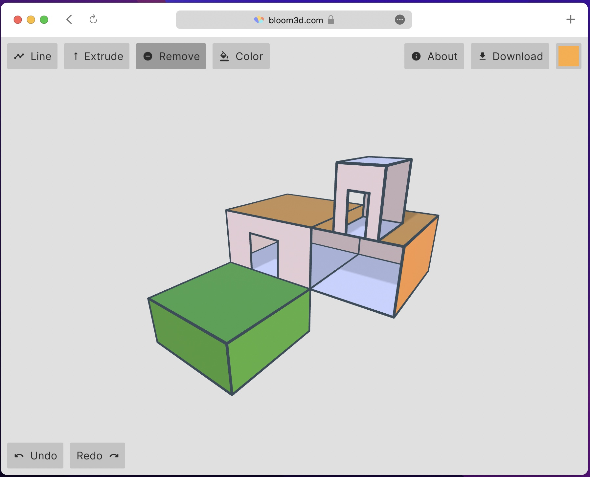

+++
title = "This Month in Rust GameDev #32 - March 2022"
transparent = true
date = 2022-04-01
draft = true
+++

<!-- no toc -->

<!-- Check the post with markdownlint-->

Welcome to the {TODO}th issue of the Rust GameDev Workgroup's
monthly newsletter.
[Rust] is a systems language pursuing the trifecta:
safety, concurrency, and speed.
These goals are well-aligned with game development.
We hope to build an inviting ecosystem for anyone wishing
to use Rust in their development process!
Want to get involved? [Join the Rust GameDev working group!][join]

You can follow the newsletter creation process
by watching [the coordination issues][coordination].
Want something mentioned in the next newsletter?
[Send us a pull request][pr].
Feel free to send PRs about your own projects!

[Rust]: https://rust-lang.org
[join]: https://github.com/rust-gamedev/wg#join-the-fun
[pr]: https://github.com/rust-gamedev/rust-gamedev.github.io
[coordination]: https://github.com/rust-gamedev/rust-gamedev.github.io/issues?q=label%3Acoordination
[Rust]: https://rust-lang.org
[join]: https://github.com/rust-gamedev/wg#join-the-fun

- [Game Updates](#game-updates)
- [Rust GameDev Podcast](#rust-gamedev-podcast)
- [Rust GameDev Meetup](#rust-gamedev-meetup)
- [Learning Material Updates](#learning-material-updates)
- [Engine Updates](#engine-updates)
- [Tooling Updates](#tooling-updates)
- [Library Updates](#library-updates)
- [Other News](#other-news)
- [Popular Workgroup Issues in Github](#popular-workgroup-issues-in-github)
- [Meeting Minutes](#meeting-minutes)
- [Discussions](#discussions)
- [Requests for Contribution](#requests-for-contribution)
- [Jobs](#jobs)
- [Bonus](#bonus)

<!--
Ideal section structure is:

```
### [Title]


_image caption_

A paragraph or two with a summary and [useful links].

_Discussions:
[/r/rust](https://reddit.com/r/rust/todo),
[twitter](https://twitter.com/todo/status/123456)_

[Title]: https://first.link
[useful links]: https://other.link
```

If needed, a section can be split into subsections with a "------" delimiter.
-->

## [Rust GameDev Podcast][gamedev-podcast-site]


The Rust Gamedev Podcast features interviews with indie game developers creating
titles with the Rust programming language. It covers technical topics as well as
the business of open source and commercial indie games development.

In March, two episodes were released:

[The seventh episode][podcast-7] is a chat with Erlend and Ole about
[Fish Fight][fishfight], open source games development, and future game spin-offs.

[In the eighth episode][podcast-8], Forest chats to Dustin about [A/B Street][abstreet].

Listen and Subscribe from the following platforms:
[Rust GameDev Podcast (simplecast)][gamedev-podcast-site],
[Apple Podcasts][gamedev-podcast-apple],
[Spotify][gamedev-podcast-spotify],
[RSS Feed][gamedev-podcast-rss],
or [Google Podcasts][gamedev-podcast-google].

[podcast-7]: https://rustgamedev.com/episodes/interview-with-fish-fight
[podcast-8]: https://rustgamedev.com/episodes/interview-with-dustin-a-b-street
[abstreet]: https://github.com/a-b-street/abstreet
[fishfight]: https://github.com/heroiclabs/fishgame-macroquad
[gamedev-podcast-site]: https://rustgamedev.com/
[gamedev-podcast-apple]: https://podcasts.apple.com/gb/podcast/rust-game-dev/id1526304768
[gamedev-podcast-spotify]: https://open.spotify.com/show/7HRfGnTcXkLkQd9fxJbDGj
[gamedev-podcast-rss]: https://feeds.simplecast.com/C6NQglnL
[gamedev-podcast-google]: https://podcasts.google.com/feed/aHR0cHM6Ly9mZWVkcy5zaW1wbGVjYXN0LmNvbS9DNk5RZ2xuTA

## Rust GameDev Meetup


The 14th Rust Gamedev Meetup took place in March. You can watch the
recording of the meetup [here on Youtube][gamedev-meetup-video]. The meetups
take place on the second Saturday every month via the [Rust Gamedev Discord
server][rust-gamedev-discord] and are also [streamed on
Twitch][rust-gamedev-twitch].

[gamedev-meetup-video]: https://youtu.be/dQPkyjbd36Y
[rust-gamedev-discord]: https://discord.gg/yNtPTb2
[rust-gamedev-twitch]: https://twitch.tv/rustgamedev

## Game Updates

### [Bevy Jam][bevy-jam-results]


Voting on the first-ever [Bevy Jam][bevy-jam] just finished! It was a
week-long event, where the goal was to make a game in
[Bevy Engine][bevy-engine], the free and open-source game engine
built in Rust. The theme was 'Unfair Advantage'.

The [full results can be found on itch.io][bevy-jam-results], and you can read
an [exploration of the entries][bevy-jam-exploration] to find out about how
these entries used different asset formats, crates, and Bevy features.

Here are the top five games:

[bevy-jam]: https://itch.io/jam/bevy-jam-1/
[bevy-jam-results]: https://itch.io/jam/bevy-jam-1/results
[bevy-engine]: https://bevyengine.org/
[bevy-jam-exploration]: https://techgeneral.org/bevy-jam-1-data-exploration/

#### 🥇 First Place: [Petty Party][petty-party]


[Petty Party][petty-party] is a Mario Party inspired board game,
in which you play against the world's worst opponent, who's
actively rigging the game against you.

The game was originally very hard to beat, so the devs balanced
the jam release fairly heavily in the player's favour - however,
if you beat the game, you can unlock the original difficulty
as a 'hard mode'!

The source for the game is available on [GitHub][petty-party-source].

[petty-party]: https://jabuwu.itch.io/petty-party
[petty-party-source]: https://github.com/jabuwu/petty-party

#### 🥈 Second Place: [¿Quién es el MechaBurro?][mechaburro-itchio]


[¿Quién es el MechaBurro?][mechaburro-itchio] is a singleplayer/local
multiplayer game (up to 4 players) with bots (8 total burros)
inspired by twin-stick shooters and aspects of Mario Kart. Players
choose to play as one of the burro piñatas and then attempt to be
the last burro standing in each level of the game. At the start
of each round, one burro is chosen randomly to be upgraded to the
Mechaburro, giving them an unfair advantage.

A postmortem devlog detailing the process of making the game during the
jam can be found [here][mechaburro-postmortem], a trailer for the game is
[viewable on YouTube][mechaburro-youtube] and the source code for the game
is available [on Github][mechaburro-github].

[mechaburro-itchio]: https://ramirezmike2.itch.io/quien-es-el-mechaburro
[mechaburro-github]: https://github.com/ramirezmike/quien_es_el_mechaburro
[mechaburro-youtube]: https://www.youtube.com/watch?v=YQeb2ffm_TI
[mechaburro-postmortem]: https://ramirezmike2.itch.io/quien-es-el-mechaburro/devlog/354715/bevy-jam-1-postmortem

#### 🥉 Third Place: [Chaz]


[Chaz] is a platform racing game, where you have to stay close to your
opponent in order to see where you're going. Beat them to the floating
heart to win - but be warned, once you do, they'll steal your moves!

The source code is available on [GitHub][chaz-source].

[chaz]: https://luizchagasjardim.itch.io/chaz
[chaz-source]: https://github.com/lcjgames/chaz

#### Fourth Place: [Warlock's Gambit][warlocks-gambit-itchio]


[Warlock's Gambit][warlocks-gambit-itchio] is a puzzle game constructed like a
card game, playable in the browser. You are given a static deck and have to play
your cards carefully to beat your opponent. In keeping with the theme of the
jam, the decks are stacked against you, in fact, it's impossible to win by
default. But you have a trick up your sleeve, literally. You can drag a card in
your sleeve to play it later.

The jam release was limited and confusing, but a post-jam update fixed the
most annoying bugs, clarified the game rules, enabled importing custom decks,
and added great code documentation (including a flow diagram demonstrating the
game state changes).

The game code is licensed under MIT or Apache-2 and is [available on
Github][warlocks-gambit-github].

[warlocks-gambit-itchio]: https://gibonus.itch.io/warlocks-gambit
[warlocks-gambit-github]: https://github.com/team-plover/warlocks-gambit

#### Fifth Place: [Cheaters Never Win][cheaters-never-win]


[Cheaters Never Win][cheaters-never-win] is an unfairly difficult
infinite runner set in a cyberpunk world.

Collect keycaps in order to unlock cheat codes, which will give
you access to forbidden powers - like jumping, and moving left!

Since the jam, the team has begun work on a full release for the game.

The source for this game is available on [GitHub][cnw-source].

[cheaters-never-win]: https://cdsupina.itch.io/cheaters-never-win
[cnw-source]: https://github.com/Corrosive-Games/Cheaters-Never-Win

### [V-Racer][vracer-github]


_Screenshot of V-Racer_

V-Racer ([GitHub][vracer-github]) by
[@Syn-Nine][synnine-twitter] is a retro
drift racing game inspired by Atari
Battlezone and Wipeout created using
Syn9's [Rust Mini Game Framework][mgfw].
The game is part of an open source
[repository][s9-minigame-repo] of several
mini-games that use this framework.

[vracer-github]: https://github.com/Syn-Nine/rust-mini-games/tree/main/2d-games/vracer
[synnine-twitter]: https://twitter.com/Syn9Dev
[mgfw]: https://github.com/Syn-Nine/mgfw
[s9-minigame-repo]: https://github.com/Syn-Nine/rust-mini-games/

### [Harvest Hero Origins - Spring Fever][hho-steam]


Harvest Hero Origins by Gemdrop Games is an Arcade Wave Defense game featuring
a co-op survival mode.

[Gemdrop Games][ggt] collaborated with [Pixadome][pd] to bring
their featured character Blue
from [Chenso Club][cc] to the survival roster. Please go wishlist Chenso Club
to support the developers!

Blue is an android who wields a chainsaw to rip and tear through her enemies.
Slice and dice, then ride through enemies
in the new [Spring Fever expansion][spring-fever]!

[hho-steam]: https://store.steampowered.com/app/1651500/Harvest_Hero_Origins/
[ggt]: https://twitter.com/GemdropGames
[pd]: https://www.pixadome.com/
[cc]: https://store.steampowered.com/app/1454730/Chenso_Club/
[spring-fever]: https://store.steampowered.com/news/app/1651500/view/3112556530755817232

### [Veloren][veloren]


_Veloren on the Steam Deck!_

[Veloren][veloren] is an open world, open-source voxel RPG inspired by Dwarf
Fortress and Cube World.

In March, Veloren was tested on the SteamDeck, which you can read about in
detail in [the weekly devblog][veloren-steamdeck-section]. Lots of work was done
with Airshipper, Veloren's launcher, including some bug fixes, but mainly the
switch to Github Releases as the download backend. This will make game updates
significantly faster and more reliable for players. Work is also being done to
make use of Github's HTTP range requests to do partial patches where possible.
Audio work was done to improve swimming sounds playing unevenly, and more sounds
to gliding.

Veloren was also mentioned [on Hacker News][veloren-hn], and lots of great
discussions happened in the comment section. In 2021, Veloren spoke at Rust in
Arts, and [the recording has recently been posted][veloren-rust-in-arts]. The
0.13 release map is in the works, with a jungle theme. CliffTowns are being
developed, as a new town located in the mountains. Veloren recorded another
reading club episode, this time about [Tracy and
optimizations][veloren-reading-club-7]. A new series was also started, and the
first [Veloren Code Review was recorded][veloren-code-review-1].

March's full weekly devlogs: "This Week In Veloren...":
[#162][veloren-162],
[#163][veloren-163],
[#164][veloren-164],
[#165][veloren-165].

[veloren]: https://veloren.net
[veloren-reading-club-7]: https://www.youtube.com/watch?v=-w0yTCjsV0k
[veloren-code-review-1]: https://www.youtube.com/watch?v=gomKwQnEGA8
[veloren-steamdeck-section]: https://veloren.net/devblog-162#veloren-on-steamdeck-by-angelonfira
[veloren-hn]: https://news.ycombinator.com/item?id=30667022
[veloren-rust-in-arts]: https://rustfest.global/session/53-directors-commentary-veloren/

[veloren-162]: https://veloren.net/devblog-162
[veloren-163]: https://veloren.net/devblog-163
[veloren-164]: https://veloren.net/devblog-164
[veloren-165]: https://veloren.net/devblog-165

### [rust-nonogram][rust-nonogram]


Nonograms (AKA Picross) are logic puzzles that involve filling in cells on a
grid. The goal of [rust-nonogram] is to be a quick and engaging time-killer.
Featuring random puzzles and simple controls, it is a great way to have some
fun and test your skills.

[rust-nonogram]: https://github.com/henryksloan/rust-nonogram

### [Terrain Generator][terrain-generator]


"Terrain Generator" is a website made by [@kettlecorn][kettlecorn_twitter] that
generates procedural island landscapes. It uses WebAssembly SIMD and multithreading
via WebWorkers to speed up generation.

The terrain is generated with multi-octave simplex noise using the new
simplex-noise crate [`clatter`][clatter].

Terrain Generator's code is open-sourced on [GitHub][terrain-generator-github].

[terrain-generator]: https://ianjk.com/terrain_generator/
[kettlecorn_twitter]: https://twitter.com/kettlecorn
[clatter]: https://ianjk.com/terrain_generator/
[terrain-generator-github]: https://github.com/kettle11/open_world_game

### [Way of Rhea][wor]


[Way of Rhea][wor] is a puzzle adventure with hard puzzles and forgiving
mechanics being produced by [@masonremaley][wor-mason-remaley] in a custom Rust
engine. It has a demo available [on Steam][wor].

Latest developments:

- A [new demo][wor] was pushed to Steam for PAX East
- The [mushroom biome][wor-mushroom] art was completed
- All puzzles for the main game are complete
- More secrets have been added
- Four out of the five [characters][wor-characters] are now in game
- `SDL_mixer` was replaced with a custom Rust mixer built on top of
[libsoundio][wor-libsoundio]
- Numerous minor bug fixes and quality of life improvements, you can find
[more details here][wor-update]

You can stay up to date with the latest Way of Rhea developments by
[following it on Steam][wor], signing up for [their mailing list][wor-newsletter],
or joining [their Discord][wor-discord].

[wor]: https://store.steampowered.com/app/1110620/Way_of_Rhea/?utm_campaign=tmirgd&utm_source=n32
[wor-update]: https://store.steampowered.com/news/app/1110620/view/3180112431320346739?utm_campaign=tmirgd&utm_source=n32&utm_content=news
[wor-mushroom]: https://cdn.cloudflare.steamstatic.com/steamcommunity/public/images/clans/35599024/f356b295d6d71dcaebf4727eca0317269172b1d7.png
[wor-characters]: https://cdn.cloudflare.steamstatic.com/steamcommunity/public/images/clans/35599024/4dbe4158059559176d25f4d9326280d83ec6c745.png
[wor-mason-remaley]: https://twitter.com/masonremaley
[wor-newsletter]: https://www.anthropicstudios.com/newsletter/signup
[wor-discord]: https://discord.gg/JGeVt5XwPP
[wor-libsoundio]: http://libsound.io/

## Engine Updates

### [godot-rust](https://github.com/godot-rust/godot-rust)


godot-rust ([GitHub][gd-github], [Discord][gd-discord], [Twitter][gd-twitter])
is a Rust library that provides bindings for the Godot game engine.

We are pleased to announce the release of godot-rust version 0.10.0.
This update brings many new quality-of-life features, such as basic
async and serde support, more flexible exporting of Rust symbols to
Godot, better CI and doc integration, among many more features that
have previously been exclusive to the [GitHub repo][gd-github].

This release also makes the the API much more more user-friendly than
previous versions with more consistent naming, flatter module structure
and fewer redundancies.

Thank you to all of the contributors who made this possible!

A full list of a the changes are available in the [changelog][gd-changelog].

[gd-announcement]: https://godot-rust.github.io/releases/
[gd-changelog]: https://github.com/godot-rust/godot-rust/blob/master/CHANGELOG.md

[gd-docs]: https://godot-rust.github.io/docs
[gd-github]: https://github.com/godot-rust/godot-rust
[gd-discord]: https://discord.com/invite/FNudpBD
[gd-twitter]: https://twitter.com/GodotRust

### [Notan v0.2.1][Notan]


[Notan] is a simple and portable layer designed to create your own multimedia
apps on top of it without worrying about platform-specific code.

The main goal is to provide a set of APIs and tools that can be used to create
your project in an ergonomic manner without enforcing any structure or pattern,
always trying to stay out of your way. The idea is that you can use it as a
foundation layer or backend for your next app, game engine, or game.

Version [v0.2.1] improves and adds features focusing on the creation of apps,
like select mouse cursor or lazy loop among other things. The main focus was
improve the integration with [egui] supporting all its features.

[Notan]: https://github.com/Nazariglez/notan
[v0.2.1]: https://github.com/Nazariglez/notan/releases/tag/v0.2.0
[egui]: https://github.com/emilk/egui

### [Tetra] 0.7

[Tetra] is a simple 2D game framework, inspired by XNA, Love2D, and Raylib. This
month, Tetra 0.7 was released, featuring:

- Support for a wider variety of texture formats
- A more powerful API for blending
- Lots of bug fixes, cleanups, and improvements

For more details, see the [changelog][tetra-changelog].

As mentioned in previous newsletters, this is likely to be the final release of
Tetra, as [the developer has decided to move onto other projects][tetra-retro].

[Tetra]: https://github.com/17cupsofcoffee/tetra
[tetra-changelog]: https://github.com/17cupsofcoffee/tetra/blob/main/CHANGELOG.md
[tetra-retro]: https://www.seventeencups.net/posts/three-years-of-tetra/

## Learning Material Updates

### [Intro to Bevy Video Tutorial Series][intro-to-bevy-playlist]


Matthew Bryant ([Youtube][matthew-bryant-youtube],
[Github][matthew-bryant-github]) has been working on a video series on using
Bevy to create a Pokemon-style RPG, and just released four episodes. The goal is
to show and explain all the core features of Bevy while creating a real game
over ten 10-15 minute videos, currently releasing once per week. There is also
an accompanying [blog post][intro-to-bevy-blog] for the first video in the
series.

[intro-to-bevy-playlist]: https://www.youtube.com/watch?v=WnUzWuaMzuM&list=PLT_D88-MTFOPPl75g4WshL1Gx2bnGTUkz&index=1
[intro-to-bevy-blog]: https://www.logicprojects.net/2022/03/
[matthew-bryant-youtube]: https://www.youtube.com/channel/UC7v3YEDa603x_84PgCPytzA
[matthew-bryant-github]: https://github.com/mwbryant

## Tooling Updates

### [Bloom3D][bloom3d]



[Bloom3D][bloom3d] is an extremely minimalist in-browser 3D modeling tool made
by [@kettlecorn](kettlecorn_twitter)
that released earlier this month.

Bloom3D is built completely with Rust from user-interface to core algorithms.
The game engine and many of the libraries powering Bloom3D are open-sourced on [GitHub][koi].

[bloom3d]: https://bloom3d.com
[koi]: https://github.com/kettle11/koi

### [Noumenal][noumenal-website]


[Noumenal][noumenal-website] ([Discord][noumenal-discord],
[Twitter][noumenal-twitter]) by [@HackerFoo][hackerfoo-website] is a beautiful
and fast 3D modeling app for iOS.

Noumenal officially went into [public beta][noumenal-beta] this week, and so was
presented to a larger audience for the first time.

The goals of Noumenal are:

- Enjoyable to use on a mobile device
- Accessible to as many people as possible
- Real time solid modeling with boolean operations
- Non-destructive editing and robustness to prevent data loss
- Intuitive manipulation by projecting from the screen glass into 3D space
- Export to the most widely used formats, such as glTF, USDZ, and STL for 3D
  printing

These goals have lead to an unique interface.

[noumenal-website]: https://noumenal.app
[noumenal-discord]: https://discord.gg/PFeZQE48gG
[noumenal-twitter]: https://twitter.com/noumenal_app
[hackerfoo-website]: https://hackerfoo.com
[noumenal-beta]: https://testflight.apple.com/join/I6x5Yksx

### [Graphite][graphite-website]


Graphite is an in-development raster and vector 2D graphics editor that is free
and open source. It will be powered by a node graph compositing engine that
supercharges your layer stack, providing a completely non-destructive editing
experience.

With the completion of the node graph UX design, work has begun building the
frontend and backend systems for the big leap to node-driven vector editing.
This works by composing groups of Rust functions together at runtime and/or
compile time. [Watch the (brief) talk][graphite-gamedev-nodes-talk] about how
the backend implementation works around challenges imposed by Rust.

New editor features this month include importing bitmap image layers and
customizing stroke styling with dashed lines and rounded or beveled corners.
The [project website][graphite-website] is also now mostly content-complete,
including new node graph mockups.

Check out the [new website][graphite-website], try the
[Graphite editor][graphite-live-demo] right now in your browser, star on
[GitHub][graphite-repo], follow on [Twitter][graphite-twitter], and join the
[Discord][graphite-discord] to chat or get involved!

[graphite-website]: https://graphite.rs
[graphite-gamedev-nodes-talk]: https://youtu.be/okWFrfaaADs?t=4014
[graphite-live-demo]: https://editor.graphite.rs
[graphite-repo]: https://github.com/GraphiteEditor/Graphite
[graphite-twitter]: https://twitter.com/GraphiteEditor
[graphite-discord]: https://discord.graphite.rs

## Library Updates

### [bevy_match3]


[bevy_match3] ([GitHub](https://github.com/Sheepyhead/bevy_match3))
by [@Sheepyhead](https://twitter.com/devsheepy)
is an event-based Bevy crate for handling the logic side of match 3 games so
you can worry about making everything else!

This was recently released in its first public version, so there are several
parts to improve, and it could really use some battle testing.

[bevy_match3]: https://crates.io/crates/bevy_match3

### [dos-like-rs]


[dos-like-rs] by [@E_net4]
provides Rust bindings to Mattias Gustavsson's `dos-like`,
a cross-platform framework for writing modern applications
with the look & feel of MS-DOS programs from the early 90's.

A few technical details about the conception of these bindings
are presented in a [blog post on Dev.to][dos-like-rs-dev].

[dos-like-rs]: https://github.com/Enet4/dos-like-rs
[@E_net4]: https://twitter.com/E_net4
[dos-like-rs-dev]: https://dev.to/e_net4/writing-bindings-to-dos-like-for-rust-some-lessons-learned-2p6k

### [kira v0.6.0](https://github.com/tesselode/kira)

[Kira] by [@tesselode] is a backend-agnostic library to create expressive audio
for games. It provides parameters for smoothly adjusting properties of sounds, a
flexible mixer for applying effects to audio, and a clock system for precisely
timing audio events.

v0.6.0 is a complete rewrite with a more elegant API, support for streaming sounds,
swappable backends, and more flexible mixer routing. See the full [changelog] for
more details.

_Discussions: [/r/rust], [twitter]_

[Kira]: https://github.com/tesselode/kira
[@tesselode]: https://twitter.com/tesselode
[changelog]: https://github.com/tesselode/kira/releases/tag/v0.6.0
[/r/rust]: https://www.reddit.com/r/rust/comments/t984ss/kira_game_audio_library_v060_complete_rewrite
[twitter]: https://twitter.com/tesselode/status/1501213862988849152

### [screen-13 v0.2.1-alpha](https://github.com/attackgoat/screen-13)

[Screen 13] is an easy-to-use 2D/3D rendering engine in the spirit of QBasic. The
library provides a thin Vulkan 1.1 driver using smart pointers and a fully-generic
render graph structure.

Earlier this year [Screen 13] was updated with a dynamic graph pattern, but there
was no good starter documentation and a few bugs. There is a [getting started][s13-getting-started]
guide now! Also, a ton of new features that have been added in the last month:

- ImGui support
- Mac support
- Shader specialization

For more details, see the [changelog][s13-change-log].

[Screen 13]: https://github.com/attackgoat/screen-13
[s13-getting-started]: https://github.com/attackgoat/screen-13/blob/master/examples/getting-started.md
[s13-change-log]: https://github.com/attackgoat/screen-13/blob/master/CHANGELOG.md

## Popular Workgroup Issues in Github

<!-- Up to 10 links to interesting issues -->

## Other News

<!-- One-liners for plan items that haven't got their own sections. -->

## Meeting Minutes

<!-- Up to 10 most important notes + a link to the full details -->

[See all meeting issues][label_meeting] including full text notes
or [join the next meeting][join].

[label_meeting]: https://github.com/rust-gamedev/wg/issues?q=label%3Ameeting

## Discussions

<!-- Links to handpicked reddit/twitter/urlo/etc threads that provide
useful information -->

## Requests for Contribution

<!-- Links to "good first issue"-labels or direct links to specific tasks -->

## Jobs

<!-- An optional section for new jobs related to Rust gamedev -->

## Bonus

<!-- Bonus section to make the newsletter more interesting
and highlight events from the past. -->

------

That's all news for today, thanks for reading!

Want something mentioned in the next newsletter?
[Send us a pull request][pr].

Also, subscribe to [@rust_gamedev on Twitter][@rust_gamedev]
or [/r/rust_gamedev subreddit][/r/rust_gamedev] if you want to receive fresh news!

<!--
TODO: Add real links and un-comment once this post is published
**Discuss this post on**:
[/r/rust_gamedev](TODO),
[Twitter](TODO),
[Discord](https://discord.gg/yNtPTb2).
-->

[/r/rust_gamedev]: https://reddit.com/r/rust_gamedev
[@rust_gamedev]: https://twitter.com/rust_gamedev
[pr]: https://github.com/rust-gamedev/rust-gamedev.github.io
