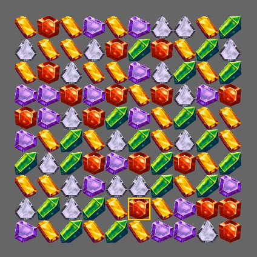

+++
title = "This Month in Rust GameDev #32 - March 2022"
transparent = true
date = 2022-04-01
draft = true
+++

<!-- no toc -->

<!-- Check the post with markdownlint-->

Welcome to the {TODO}th issue of the Rust GameDev Workgroup's
monthly newsletter.
[Rust] is a systems language pursuing the trifecta:
safety, concurrency, and speed.
These goals are well-aligned with game development.
We hope to build an inviting ecosystem for anyone wishing
to use Rust in their development process!
Want to get involved? [Join the Rust GameDev working group!][join]

You can follow the newsletter creation process
by watching [the coordination issues][coordination].
Want something mentioned in the next newsletter?
[Send us a pull request][pr].
Feel free to send PRs about your own projects!

[Rust]: https://rust-lang.org
[join]: https://github.com/rust-gamedev/wg#join-the-fun
[pr]: https://github.com/rust-gamedev/rust-gamedev.github.io
[coordination]: https://github.com/rust-gamedev/rust-gamedev.github.io/issues?q=label%3Acoordination
[Rust]: https://rust-lang.org
[join]: https://github.com/rust-gamedev/wg#join-the-fun

- [Game Updates](#game-updates)
- [Learning Material Updates](#learning-material-updates)
- [Engine Updates](#engine-updates)
- [Tooling Updates](#tooling-updates)
- [Library Updates](#library-updates)
- [Other News](#other-news)
- [Popular Workgroup Issues in Github](#popular-workgroup-issues-in-github)
- [Meeting Minutes](#meeting-minutes)
- [Discussions](#discussions)
- [Requests for Contribution](#requests-for-contribution)
- [Jobs](#jobs)
- [Bonus](#bonus)

<!--
Ideal section structure is:

```
### [Title]


_image caption_

A paragraph or two with a summary and [useful links].

_Discussions:
[/r/rust](https://reddit.com/r/rust/todo),
[twitter](https://twitter.com/todo/status/123456)_

[Title]: https://first.link
[useful links]: https://other.link
```

If needed, a section can be split into subsections with a "------" delimiter.
-->

## Game Updates

### [V-Racer][vracer-github]


_Screenshot of V-Racer_

V-Racer ([GitHub][vracer-github]) by
[@Syn-Nine][synnine-twitter] is a retro
drift racing game inspired by Atari
Battlezone and Wipeout created using
Syn9's [Rust Mini Game Framework][mgfw].
The game is part of an open source
[repository][s9-minigame-repo] of several
mini-games that use this framework.

[vracer-github]: https://github.com/Syn-Nine/rust-mini-games/tree/main/2d-games/vracer
[synnine-twitter]: https://twitter.com/Syn9Dev
[mgfw]: https://github.com/Syn-Nine/mgfw
[s9-minigame-repo]: https://github.com/Syn-Nine/rust-mini-games/

## Engine Updates

## Learning Material Updates

## Tooling Updates

## Library Updates

### [bevy_match3]



[bevy_match3] ([GitHub](https://github.com/Sheepyhead/bevy_match3)) by [@Sheepyhead](https://twitter.com/devsheepy)
is an event-based bevy crate for handling the logic side of match 3 games so you can worry about making everything else!

This was recently released in its first public version, and there are several parts to improve, and it could really use some battle testing.

[bevy_match3]: https://crates.io/crates/bevy_match3

### [dos-like-rs]


[dos-like-rs] by [@E_net4]
provides Rust bindings to Mattias Gustavsson's `dos-like`,
a cross-platform framework for writing modern applications
with the look & feel of MS-DOS programs from the early 90's.

A few technical details about the conception of these bindings
are presented in a [blog post on Dev.to][dos-like-rs-dev].

[dos-like-rs]: https://github.com/Enet4/dos-like-rs
[@E_net4]: https://twitter.com/E_net4
[dos-like-rs-dev]: https://dev.to/e_net4/writing-bindings-to-dos-like-for-rust-some-lessons-learned-2p6k

## Popular Workgroup Issues in Github

<!-- Up to 10 links to interesting issues -->

## Other News

<!-- One-liners for plan items that haven't got their own sections. -->

## Meeting Minutes

<!-- Up to 10 most important notes + a link to the full details -->

[See all meeting issues][label_meeting] including full text notes
or [join the next meeting][join].

[label_meeting]: https://github.com/rust-gamedev/wg/issues?q=label%3Ameeting

## Discussions

<!-- Links to handpicked reddit/twitter/urlo/etc threads that provide
useful information -->

## Requests for Contribution

<!-- Links to "good first issue"-labels or direct links to specific tasks -->

## Jobs

<!-- An optional section for new jobs related to Rust gamedev -->

## Bonus

<!-- Bonus section to make the newsletter more interesting
and highlight events from the past. -->

------

That's all news for today, thanks for reading!

Want something mentioned in the next newsletter?
[Send us a pull request][pr].

Also, subscribe to [@rust_gamedev on Twitter][@rust_gamedev]
or [/r/rust_gamedev subreddit][/r/rust_gamedev] if you want to receive fresh news!

<!--
TODO: Add real links and un-comment once this post is published
**Discuss this post on**:
[/r/rust_gamedev](TODO),
[Twitter](TODO),
[Discord](https://discord.gg/yNtPTb2).
-->

[/r/rust_gamedev]: https://reddit.com/r/rust_gamedev
[@rust_gamedev]: https://twitter.com/rust_gamedev
[pr]: https://github.com/rust-gamedev/rust-gamedev.github.io
