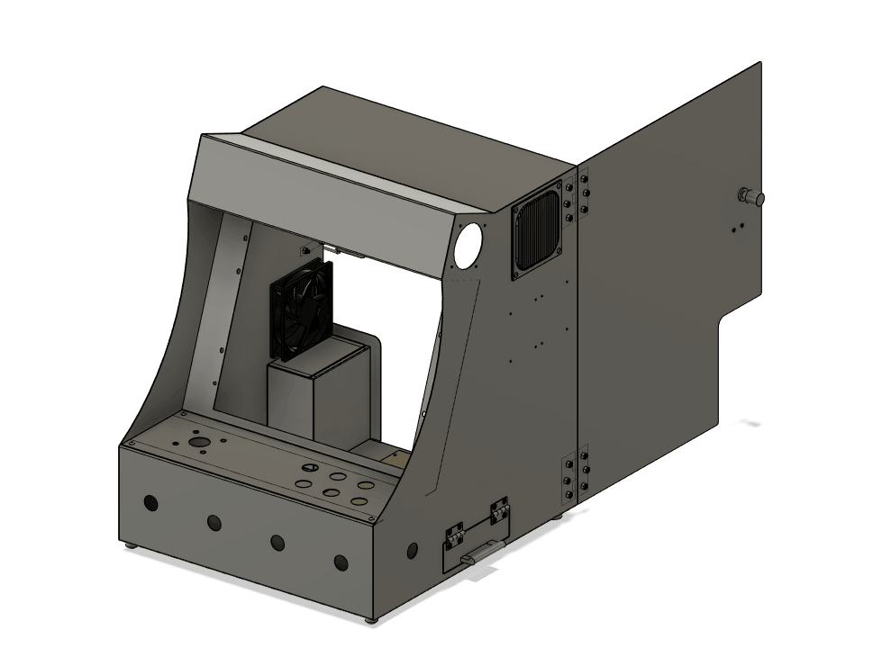

+++
title = "This Month in Rust GameDev #33 - April 2022"
transparent = true
date = 2022-05-12
draft = false
+++

<!-- no toc -->

<!-- Check the post with markdownlint-->

Welcome to the 33rd issue of the Rust GameDev Workgroup's
monthly newsletter.
[Rust] is a systems language pursuing the trifecta:
safety, concurrency, and speed.
These goals are well-aligned with game development.
We hope to build an inviting ecosystem for anyone wishing
to use Rust in their development process!
Want to get involved? [Join the Rust GameDev working group!][join]

You can follow the newsletter creation process
by watching [the coordination issues][coordination].
Want something mentioned in the next newsletter?
[Send us a pull request][pr].
Feel free to send PRs about your own projects!

[Rust]: https://rust-lang.org
[join]: https://github.com/rust-gamedev/wg#join-the-fun
[pr]: https://github.com/rust-gamedev/rust-gamedev.github.io
[coordination]: https://github.com/rust-gamedev/rust-gamedev.github.io/issues?q=label%3Acoordination
[Rust]: https://rust-lang.org
[join]: https://github.com/rust-gamedev/wg#join-the-fun

- [Announcements](#announcements)
- [Game Updates](#game-updates)
- [Engine Updates](#engine-updates)
- [Learning Material Updates](#learning-material-updates)
- [Tooling Updates](#tooling-updates)
- [Library Updates](#library-updates)
- [Other News](#other-news)
- [Requests for Contribution](#requests-for-contribution)
- [Jobs](#jobs)

<!--
Ideal section structure is:

```
### [Title]


_image caption_

A paragraph or two with a summary and [useful links].

_Discussions:
[/r/rust](https://reddit.com/r/rust/todo),
[twitter](https://twitter.com/todo/status/123456)_

[Title]: https://first.link
[useful links]: https://other.link
```

If needed, a section can be split into subsections with a "------" delimiter.
-->

## Announcements

### Rust GameDev Meetup


The 15th Rust Gamedev Meetup took place in April. You can watch the recording of
the meetup [here on Youtube][gamedev-meetup-video]. The meetups take place on
the second Saturday every month via the [Rust Gamedev Discord
server][rust-gamedev-discord] and are also [streamed on
Twitch][rust-gamedev-twitch]. If you would like to show off what you've been
working on at the next meetup on [May 14th][rust-meetup-time], fill out [this
form][gamedev-meetup-form].

[gamedev-meetup-video]: https://youtu.be/okWFrfaaADs
[rust-gamedev-discord]: https://discord.gg/yNtPTb2
[rust-gamedev-twitch]: https://twitch.tv/rustgamedev
[rust-meetup-time]: https://everytimezone.com/s/1baaa280
[gamedev-meetup-form]: https://forms.gle/BS1zCyZaiUFSUHxe6

### Rust Graphics Meetup 2

The 2nd Rust Graphics Meetup will take place on the [21st of May, at 16:00
UTC+0][graphics-meetup-time]. This meetup is a chance to show off what you've
been working on in the graphics community, or see what other people have been
doing!

If you're interested in speaking, please fill out the
[form][graphics-meetup-form]. You can also [watch one of the
talks][rend3-graphics-meetup-talk] from the first meetup.

[graphics-meetup-form]: https://forms.gle/DyvZ4WFZanTaLGGa7
[graphics-meetup-time]: https://everytimezone.com/s/b6ec5c17
[rend3-graphics-meetup-talk]: https://www.youtube.com/watch?v=F0wGz5UJTrY

### RustConf Arcade Cabinet



[Carlo][carlosupina] is building a custom arcade cabinet that will be at
RustConf 2022 in Portland. It is an opportunity for Rust game developers to
share their games with the broader community. If you are interested in getting
your game on the cabinet, read [this Twitter thread][arcade-cabinet-thread] and
fill out the [interest form][arcade-interest-form].

[carlosupina]: https://twitter.com/carlosupina
[arcade-cabinet-thread]: https://twitter.com/carlosupina/status/1523715837726961664
[arcade-interest-form]: https://forms.gle/onFm5fCygdbiArqJ7

## Game Updates

### [Way of Rhea][wor]


[Way of Rhea][wor] is a puzzle adventure with hard puzzles and forgiving
mechanics being produced by [@masonremaley][wor-mason-remaley] in a custom Rust
engine. It has a demo available [on Steam][wor].

Way of Rhea was recently [shown off at PAX East!][wor-pax] A [minor
patch][wor-update] has been released to the demo with post-PAX fixes:

- An issue that made the last puzzle in the third forest level difficult to
navigate with a controller was worked around
- Colliders in the Hermes puzzle were fixed (previously you could land on top of
a gate if you held left while sliding)
- The attract mode that was used at PAX has been merged (not in demo)
- More jungle biome scenery has been placed (not in demo)
- A crash at startup on CPUs that don't support the `andn` instruction was fixed
(part of the BMI extension to x64)
- The game can now generate mini dumps on Windows and Linux in the event that it
crashes and if given consent, forward them to the developer for analysis

You can stay up to date with the latest Way of Rhea developments by [following
it on Steam][wor], signing up for [their mailing list][wor-newsletter], or
joining [their Discord][wor-discord].

[wor]: https://store.steampowered.com/app/1110620/Way_of_Rhea/?utm_campaign=tmirgd&utm_source=n33
[wor-pax]: https://twitter.com/AnthropicSt/status/1517129411790843905
[wor-update]: https://steamcommunity.com/games/1110620/announcements/detail/3175611379276019942?utm_campaign=tmirgd&utm_source=n32&utm_content=news
[wor-mason-remaley]: https://twitter.com/masonremaley
[wor-newsletter]: https://www.anthropicstudios.com/newsletter/signup
[wor-discord]: https://discord.gg/JGeVt5XwPP

### BITGUN


_BITGUN gameplay_

[BITGUN] ([Discord], [Twitter]) by [@darth] and [@shosanna] is an action
roguelite zombie shooter with difficult and satisfying combat you can learn and
master. Guns break quickly and you lose all your gear when you die.

The game was just released on Steam! It has been developed by a programming duo
called LogLog Games. They have been working on it for the past year and it is
their biggest game so far (they also have 2 smaller games). [BITGUN] is written
in Godot Engine but it is using Rust language extensively (it has around 7500
lines of Rust and 4200 lines of GDScript).

The main changes from the demo version of the game:

- New missions added with extra difficulty
- Improved AI which doesn't just chase the player but behaves unpredictably
- New zombie types - ranged zombie, big spider, zombie spawner
- Added comic-book style story
- Improved tutorial and new player experience
- Reworked inventory system with simplified armor

_Discussion: [/r/rust](https://www.reddit.com/r/rust/comments/uepde7/after_working_on_our_godot_rust_game_fulltime_for/)_

[BITGUN]: https://store.steampowered.com/app/1673940/BITGUN/
[Twitter]: https://twitter.com/LogLogGames
[Discord]: https://discord.com/invite/XrGZQkq
[@shosanna]: https://github.com/shosanna
[@darth]: https://github.com/darthdeus

### [Veloren][veloren]


_Out for a ride at night_

[Veloren][veloren] is an open world, open-source voxel RPG inspired by Dwarf
Fortress and Cube World.

For April Fool's day, Veloren made a post about a new direction; [Need for
Voxels: Veloren Cart][veloren-cart]. Enjoy the read! Veloren also participated
in Reddit's /r/place, and got a small place right below /r/rust. Several months
of project finances were processed, and [discussed in a blog
post][veloren-finances]. The [Veloren Reading Club saw its 8th
episode][veloren-reading-club-8], which was on the topic of graphics and
particles. A [second Veloren Code Review session][veloren-code-review-2] was
held, in which two developers went through a merge request that focused on
combat numbers.

Work was done to improve how loadouts work, specifically surrounding inheritance
from other configs. Tweaks were made to arthropods, which should make them more
fun to fight. Work is being done to prepare for the 0.13 release, with a custom
map being built, and a special treasure map being created for the launch party.
Player bank storages are being developed, which will allow players to store
excess items in towns.

April's full weekly devlogs: "This Week In Veloren...":
[#166][veloren-166],
[#167][veloren-167],
[#168][veloren-168],
[#169][veloren-169].

[veloren]: https://veloren.net

[veloren-cart]: https://veloren.net/veloren-direction/
[veloren-finances]: https://veloren.net/devblog-167#finances-by-angelonfira
[veloren-reading-club-8]: https://www.youtube.com/watch?v=ff9EXhCXmFY
[veloren-code-review-2]: https://www.youtube.com/watch?v=keI0VpjkgZg

[veloren-166]: https://veloren.net/devblog-166
[veloren-167]: https://veloren.net/devblog-167
[veloren-168]: https://veloren.net/devblog-168
[veloren-169]: https://veloren.net/devblog-169

### Oasis of Lost Hope


Oasis of Lost Hope is a game where fertile ground is steadily consumed by dark,
barren land called blight. Water helps defend an area from being consumed, but
reserves are finite. The player needs to collect ore to build more irrigation
towers and delay doom for a few more seconds. Yet one thing is certain: the days
of fertile land are counted.

The game is an entry for the Ludum Dare 50 Jam, the theme of which was "Delay
the Inevitable". It has been developed by setzer22 and Bromeon and [open-sourced
on GitHub][oasis-gh]. The game is built on top of godot-rust alongside GDScript.
The Rust language is not exactly known for fast prototyping, but with a slightly
less safety-conservative fork of godot-rust, the game jam experience was
surprisingly smooth. When modeling mechanics such as the expanding blight or the
water pipe network, Rust really showed its strength as a strongly typed and fast
language.

[oasis-gh]: https://github.com/Bromeon/LudumDare50

### [Extremely Extreme Sports][ees-itch]


[Extremely Extreme Sports][ees-itch] ([GitHub][ees-github],
[Discord][ees-discord]) is a multiplayer online downhill racing game [made for
Ludum Dare 50 game jam][ees-ldjam], scored top 3 in fun. Explode the mountain,
and race against the avalanche as well as your friends.

Features:

- Online multiplayer
- Character customization
- Emoting
- A little bit of gameplay

Developed by [@kuviman] using [custom engine][ees-geng]. A [postmortem blog
post][ees-postmortem] was written about the jam experience, and it includes
postjam updates.

_Discussions: [/r/rust_gamedev][ees-reddit]_

[ees-ldjam]: https://ldjam.com/events/ludum-dare/50/extremely-exteme-sports
[ees-itch]: https://kuviman.itch.io/extremely-extreme-sports
[ees-github]: https://github.com/kuviman/extremely-extreme-sports
[ees-geng]: https://github.com/kuviman/geng
[ees-postmortem]: https://kuviman.itch.io/extremely-extreme-sports/devlog/372532/extremely-extreme-sports-postmortem
[ees-reddit]: https://www.reddit.com/r/rust_gamedev/comments/u9zqrc/scored_top_3_in_fun_with_my_ludum_dare_game/
[ees-discord]: https://discord.gg/DZaEMPpANY
[@kuviman]: https://github.com/kuviman

## Engine Updates

### [Bevy v0.7][bevy-blog]


_Creative Commons 'Stylized mushrooms' scene by QumoDone rendered in Bevy._

[Bevy][bevy] is a refreshingly simple data-driven game engine built in Rust. It
is [free and open source][bevy-git] forever!

Bevy 0.7 was a massive community effort. You can check out the [full release
blog post here][bevy-blog], but here are some highlights:

- [Skeletal animation and mesh skinning][bevy-animation]
- [GLTF animation importing][bevy-gltf]
- [Unlimited* point lights in a scene][bevy-unlimited]
- [Improved clustered forward rendering: dynamic/adaptive clustering and faster,
  more accurate cluster assignment][bevy-light-opt]
- [Compressed texture support (KTX2 / DDS / .basis): load more textures in a
  scene, faster][bevy-compressed]
- [Compute shader / pipeline specialization: Bevy's flexible shader system was
  ported to compute shaders, enabling hot-reloading, shader defs, and shader
  imports][bevy-compute]
- [Render to texture: cameras can now be configured to render to a texture
  instead of a window][bevy-render-texture]
- [Flexible mesh vertex layouts in shaders][bevy-vertex]
- [ECS improvements: Order systems using their names, Query::many_mut, use
  conflicting parameters in systems via ParamSets, WorldQuery derives][bevy-ecs]
- [Documentation improvements: better examples, more doc tests, and more
  coverage][bevy-docs]
- [More audio control: pause, volume, speed, and looping][bevy-audio]
- [Power usage options to enable only updating Bevy Apps when input
  occurs][bevy-power]

_Discussions:
[/r/rust](https://www.reddit.com/r/rust/comments/u4e63h/bevy_07/),
[Hacker News](https://news.ycombinator.com/item?id=31043668),
[Twitter](https://twitter.com/cart_cart/status/1515031150313443332)_

[bevy]: https://bevyengine.org
[bevy-git]: https://github.com/bevyengine/bevy
[bevy-blog]: https://bevyengine.org/news/bevy-0-7
[bevy-animation]: https://bevyengine.org/news/bevy-0-7/#skeletal-animation
[bevy-gltf]: https://bevyengine.org/news/bevy-0-7/#gltf-animation-importing
[bevy-unlimited]: https://bevyengine.org/news/bevy-0-7/#unlimited-point-lights
[bevy-light-opt]: https://bevyengine.org/news/bevy-0-7/#light-clustering-features-and-optimizations
[bevy-compressed]: https://bevyengine.org/news/bevy-0-7/#compressed-gpu-textures
[bevy-compute]: https://bevyengine.org/news/bevy-0-7/#bevy-native-compute-shaders
[bevy-render-texture]: https://bevyengine.org/news/bevy-0-7/#render-to-texture
[bevy-vertex]: https://bevyengine.org/news/bevy-0-7/#flexible-mesh-vertex-layouts
[bevy-ecs]: https://bevyengine.org/news/bevy-0-7/#ergonomic-system-ordering
[bevy-docs]: https://bevyengine.org/news/bevy-0-7/#documentation-improvements
[bevy-audio]: https://bevyengine.org/news/bevy-0-7/#audio-control
[bevy-power]: https://bevyengine.org/news/bevy-0-7/#eventloop-power-saving-modes

### Dims


_Foliage rendering in Dims_

Dims is an open-world creation platform.

In their latest [dev log][dims-dev-log] they demonstrate a new foliage rendering
and spawning system, which automatically spawns foliage and trees based on
"habitat rules". This means a user can simply "paint" a world and it will get
populated with plants and rocks automatically.

They are also planning to host a screenshot competition in the next few weeks
for anyone who would like to try out the platform and create their own
landscapes. Sign up for the newsletter on their website to get notified when it
starts!

_Discussions:
[Foliage rendering on reddit][dims-foliage],
[Erosion tool on reddit][dims-erosion-tool]_

[Website]: https://dims.co
[Twitter]: https://twitter.com/DimsWorlds
[Discord]: https://discord.gg/Z5CAVmNE57
[dims-dev-log]: https://www.youtube.com/watch?v=jgkhsY8aZO8
[dims-foliage]: https://www.reddit.com/r/rust_gamedev/comments/ujhr3c/the_start_of_a_tool_that_lets_you_tweak_how_and/
[dims-erosion-tool]: https://www.reddit.com/r/rust_gamedev/comments/tuj9dg/far_from_finished_but_heres_our_terrain_tool/

### [Eldiron]


_Behavior Nodes of Eldiron_

[Eldiron] ([GitHub][eldiron-github], [Discord][eldiron-discord],
[Twitter][eldiron-twitter]) by [@markusmoenig] is a creator for classic role
playing games (RPGs) written in Rust.

Eldiron v0.5 features inbuild tilemaps, a node-based behavior system and region
editors.

Development Updates in April:

- Support for 4 layers of tiles for game regions. This enables transparency and
  support for top-down and isometric views.
- Game regions can now contain named areas.
- Areas can contain behavior nodes to spawn monsters, lay traps, or displace
  tiles (for example to open a door).
- New "Systems" module to create behavior for Combat and soon for Crafting,
  Magic and more. System behavior trees can be called from any character.

Eldiron v1 will be able to create any kind of RPG utilizing square tiles, like
the classical Ultima series.

[Eldiron]: https://www.eldiron.com
[eldiron-github]: https://github.com/markusmoenig/Eldiron
[eldiron-discord]: https://discord.gg/ZrNj6baSZU
[eldiron-twitter]: https://twitter.com/MarkusMoenig
[@markusmoenig]: https://github.com/markusmoenig

### [Hotham][hotham]


_Screenshot from The Station, an upcoming space station simulation game, built
with Hotham_

[Hotham][hotham] is a game engine for standalone VR devices, trying to make VR
development just a little bit less painful.

0.2 has been released with some _breathtaking_ maintenance and performance
improvements that make Hotham marginally easier to use. If you're interested in
Rust and VR and haven't checked out the project already, now is an excellent
time to do so.

A huge thank you to our sponsors and contributors (big hat-tip to @jmgao) and
the wonderful members of the [Hotham discord][hotham-discord].

[hotham]: https://github.com/leetvr/hotham
[hotham-discord]: https://discord.gg/SZEZUX6ZsQ

## Learning Material Updates

### [Game Development with Rust and WebAssembly][wasm-gamedev]


[Game Development with Rust and WebAssembly][wasm-gamedev] by Eric Smith (a.k.a
[@paytonrules][wasm-gamedev-twitter]) was published in April. It takes a
tutorial approach to lead the reader through building an endless runner using
Rust and WebAssembly. You can play the completed game [here][wasm-gamedev-game].

From the summary: This book is an easy-to-follow reference to help you develop
your own games, teaching you all about game development and how to create an
endless runner from scratch. You'll begin by drawing simple graphics in the
browser window, and then learn how to move the main character across the screen.
You'll also create a game loop, a renderer, and more, all written entirely in
Rust. After getting simple shapes onto the screen, you'll scale the challenge by
adding sprites, sounds, and user input. As you advance, you'll discover how to
implement a procedurally generated world. Finally, you'll learn how to keep your
Rust code clean and organized so you can continue to implement new features and
deploy your app on the web.

_Discussions: [Twitter][wasm-gamedev-twitter], [Discord](https://discord.gg/EjAunSbpdV)_

[wasm-gamedev]: https://subscription.packtpub.com/product/game_development/9781801070973
[wasm-gamedev-twitter]: https://www.twitter.com/paytonrules
[wasm-gamedev-game]: https://rust-games-webassembly.netlify.app

### [Why I choose to build my game from scratch][why-article]

[@HeavyRain266] published an article, '[Why I choose to build my game from
scratch][why-article]', a short story about their implementation of the game
'Forbidden Valley' from scratch in Rust. The author aims to show how much you
can learn from building your dream game without the help of any game engine.

_Discussions: [r/rust_gamedev][why-article]_

[@HeavyRain266]: https://github.com/HeavyRain266
[why-article]: https://www.reddit.com/r/rust_gamedev/comments/uewu9h/reasons_why_i_choose_to_build_my_game_from/

### [Brontefy Me][brontefy-me-episode-1]


@hedgein ([Github][hedgein-github], [Twitch][hedgein-twitch]) started a devlog
series called Brontefy Me. This series walks through the development of games in
the [Bevy engine][bevy]. There are two episodes released so far. The [first
episode][brontefy-me-episode-1] focuses on getting up and running with the
engine, and the [second episode][brontefy-me-episode-2] starts expanding into
game mechanics.

[brontefy-me-episode-1]: https://www.youtube.com/watch?v=DdD6VhmEIiU
[brontefy-me-episode-2]: https://www.youtube.com/watch?v=tx31BKX0yIA
[hedgein-github]: https://github.com/hedgein
[hedgein-twitch]: https://twitch.tv/hedgein

## Tooling Updates

### [Vismut 0.5][vismut-0.5]


[Vismut] ([GitLab][Vismut], [Zulip][vismut-zulip]) by [@lukors] will be a
procedural texturing tool.

[Version 0.5][vismut-0.5] contains a brand new backend to create a better base
for future improvements. A [blog post][vismut-blog] describes the differences
between the old and the new architecture.

[@lukors]: https://gitlab.com/lukors
[vismut-0.5]: https://gitlab.com/vismut-org/vismut/-/releases/v0.5.0
[Vismut]: https://gitlab.com/vismut-org/vismut
[vismut-zulip]: https://vismut.zulipchat.com
[vismut-blog]: https://orsvarn.com/vismut-architecture/

### [Graphite][graphite-website]


Graphite ([website][graphite-website], [GitHub][graphite-repo],
[Discord][graphite-discord], [Twitter][graphite-twitter]) is a free
in-development raster and vector 2D graphics editor. It will be powered by a
node graph compositing engine that supercharges your layer stack, providing a
completely non-destructive editing experience.

The past month's Sprint 14 has focused on further editor features and UX
improvements:

- **It's your type:** The Text tool now provides over 1400 fonts with
bold/italic styles from the Google Fonts library.

- **Oh snap!:** A refactor and polish pass on the snapping system provides
better clarity and consistency. And shapes now have outlines on hover and
selection for easier targeting.

- **Have a dialog:** Supported by a refactor that moved dialog layouts into the
Rust backend, users can now create new documents of specified sizes and export
artwork as PNG/JPG with new File menu dialogs.

- **Pack it up:** The web component of the stack was finally upgraded to Webpack
5 which cleans up a mess of outdated dependencies.

[Open the editor][graphite-live-demo] in your browser and give it a try.

[graphite-website]: https://graphite.rs
[graphite-repo]: https://github.com/GraphiteEditor/Graphite
[graphite-discord]: https://discord.graphite.rs
[graphite-twitter]: https://twitter.com/GraphiteEditor
[graphite-live-demo]: https://editor.graphite.rs

## Library Updates

### [Notan v0.3.0][Notan]


[Notan] is a simple and portable layer designed to create your own multimedia
apps on top of it without worrying about platform-specific code.

The main goal is to provide a set of APIs and tools that can be used to create
your project in an ergonomic manner without enforcing any structure or pattern,
always trying to stay out of your way. The idea is that you can use it as a
foundation layer or backend for your next app, game engine, or game.

The latest version [v0.3.0] comes with audio support for all platforms using as
default backend [oddio] and [symphonia].

[Notan]: https://github.com/Nazariglez/notan
[v0.3.0]: https://github.com/Nazariglez/notan/releases/tag/v0.3.0
[oddio]: https://github.com/Ralith/oddio
[symphonia]: https://github.com/pdeljanov/Symphonia

## Other News

<!-- One-liners for plan items that haven't got their own sections. -->

- Other game updates:
  - [Last of the Sky Folk](https://ianjk.com/ld50) is a LD50 a grapple-hook
    based platformer.
  - [Heute Nicht] rythm game is another LD50 submission.
- Other learning material updates
  - PhaestusFox started a [Bevy tutorial servies][PhaestusFox-vid-1] and [0.6 to
    0.7 Migration Guide][PhaestusFox-vid-2] YouTube series.
  - [@TantanDev] released a ["Rust multi-threading code review"][tantan-video]
    video.
- Other library updates:
  - [tween](https://github.com/sanbox-irl/tween) is an std-optional tweening
    library, designed for use in games and animations.
  - [cosync](https://github.com/sanbox-irl/cosync) provides a single-threaded,
    sequential, parameterized async runtime.
  - [SuInput](https://github.com/Sorenon/Action-System) is an input system
    designed to give pancake and XR applications access to a huge range of input
    devices while minimizing the amount of complexity needed to support them.
  - [bevy_blender v0.2] with lots of new features is out.

[Heute Nicht]: https://eira-hx.itch.io/heute-nicht
[PhaestusFox-vid-1]: https://reddit.com/r/rust_gamedev/comments/tz75eb/bevy_game_engine_tutorial_series
[PhaestusFox-vid-2]: https://reddit.com/r/rust_gamedev/comments/u4uhs2/bevy_06_to_07_migration_guide
[@TantanDev]: https://twitter.com/TantanDev
[tantan-video]: https://youtube.com/watch?v=jkHqrkcEHRc
[bevy_blender v0.2]: https://reddit.com/r/rust_gamedev/comments/u7acfc/update_on_bevy_blender_releasing_v02_and_inquiry

## Requests for Contribution

- [Graphite is looking for contributors][graphite-contribute] to help build the
new node graph and 2D rendering systems.
- [winit's "difficulty: easy" issues][winit-issues].
- [Backroll-rs, a new networking library][backroll-rs].
- [Embark's open issues][embark-open-issues] ([embark.rs]).
- [wgpu's "help wanted" issues][wgpu-issues].
- [luminance's "low hanging fruit" issues][luminance-fruits].
- [ggez's "good first issue" issues][ggez-issues].
- [Veloren's "beginner" issues][veloren-beginner].
- [Amethyst's "good first issue" issues][amethyst-issues].
- [A/B Street's "good first issue" issues][abstreet-issues].
- [Mun's "good first issue" issues][mun-issues].
- [SIMple Mechanic's good first issues][simm-issues].
- [Bevy's "good first issue" issues][bevy-issues].

[graphite-contribute]: https://github.com/GraphiteEditor/Graphite/issues/202
[winit-issues]: https://github.com/rust-windowing/winit/issues?q=is%3Aopen+is%3Aissue+label%3A%22difficulty%3A+easy%22
[backroll-rs]: https://github.com/HouraiTeahouse/backroll-rs/issues
[embark.rs]: https://embark.rs
[embark-open-issues]: https://github.com/search?q=user:EmbarkStudios+state:open
[wgpu-issues]: https://github.com/gfx-rs/wgpu/issues?q=is%3Aissue+is%3Aopen+label%3A%22help+wanted%22
[luminance-fruits]: https://github.com/phaazon/luminance-rs/issues?q=is%3Aissue+is%3Aopen+label%3A%22low+hanging+fruit%22
[ggez-issues]: https://github.com/ggez/ggez/labels/%2AGOOD%20FIRST%20ISSUE%2A
[veloren-beginner]: https://gitlab.com/veloren/veloren/issues?label_name=beginner
[amethyst-issues]: https://github.com/amethyst/amethyst/issues?q=is%3Aissue+is%3Aopen+label%3A%22good+first+issue%22
[abstreet-issues]: https://github.com/a-b-street/abstreet/issues?q=is%3Aissue+is%3Aopen+label%3A%22good+first+issue%22
[mun-issues]: https://github.com/mun-lang/mun/labels/good%20first%20issue
[simm-issues]: https://github.com/mkhan45/SIMple-Mechanics/labels/good%20first%20issue
[bevy-issues]: https://github.com/bevyengine/bevy/labels/E-Good-First-Issue

## Jobs

- [DIMS](https://www.dims.co/jobs)
  (Stockholm/Remote)
  - Tools Programmer
  - Internship: Game Design
- [Embark Studios](https://careers.embark-studios.com/jobs)
  (Stockholm/Hybrid Remote)
  - Various roles

------

That's all news for today, thanks for reading!

Want something mentioned in the next newsletter?
[Send us a pull request][pr].

Also, subscribe to [@rust_gamedev on Twitter][@rust_gamedev]
or [/r/rust_gamedev subreddit][/r/rust_gamedev] if you want to receive fresh news!

<!--
TODO: Add real links and un-comment once this post is published
**Discuss this post on**:
[/r/rust_gamedev](TODO),
[Twitter](TODO),
[Discord](https://discord.gg/yNtPTb2).
-->

[/r/rust_gamedev]: https://reddit.com/r/rust_gamedev
[@rust_gamedev]: https://twitter.com/rust_gamedev
[pr]: https://github.com/rust-gamedev/rust-gamedev.github.io
