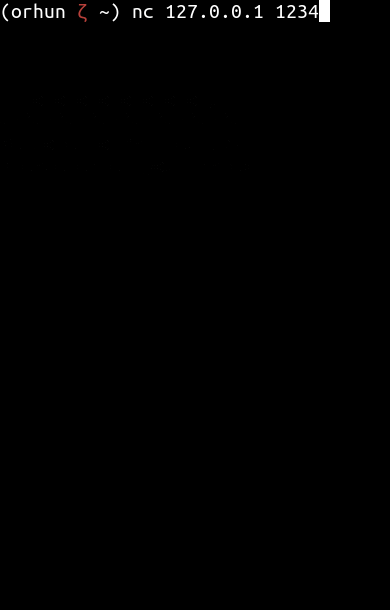
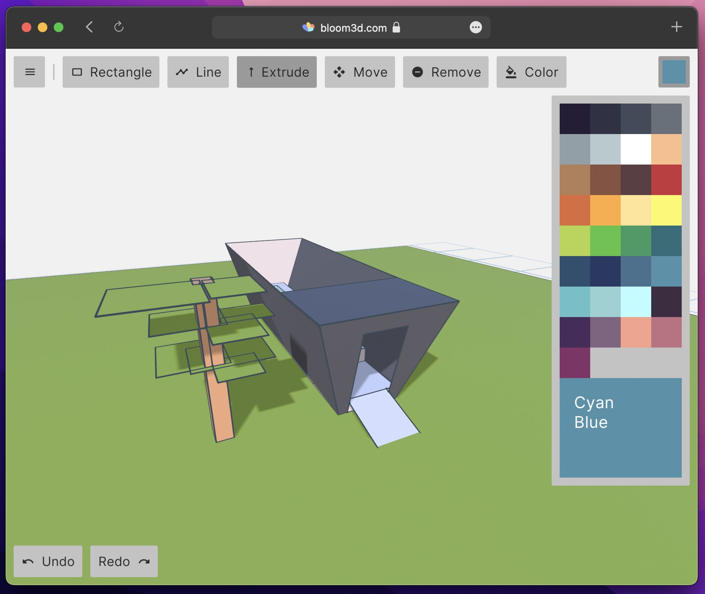

+++
title = "This Month in Rust GameDev #34 - May 2022"
transparent = true
date = 2022-06-02
draft = true
+++

<!-- no toc -->

<!-- Check the post with markdownlint-->

Welcome to the 34th issue of the Rust GameDev Workgroup's
monthly newsletter.
[Rust] is a systems language pursuing the trifecta:
safety, concurrency, and speed.
These goals are well-aligned with game development.
We hope to build an inviting ecosystem for anyone wishing
to use Rust in their development process!
Want to get involved? [Join the Rust GameDev working group!][join]

You can follow the newsletter creation process
by watching [the coordination issues][coordination].
Want something mentioned in the next newsletter?
[Send us a pull request][pr].
Feel free to send PRs about your own projects!

[Rust]: https://rust-lang.org
[join]: https://github.com/rust-gamedev/wg#join-the-fun
[pr]: https://github.com/rust-gamedev/rust-gamedev.github.io
[coordination]: https://github.com/rust-gamedev/rust-gamedev.github.io/issues?q=label%3Acoordination
[Rust]: https://rust-lang.org
[join]: https://github.com/rust-gamedev/wg#join-the-fun

- [Game Updates](#game-updates)
- [Learning Material Updates](#learning-material-updates)
- [Engine Updates](#engine-updates)
- [Tooling Updates](#tooling-updates)
- [Library Updates](#library-updates)
- [Other News](#other-news)
- [Popular Workgroup Issues in Github](#popular-workgroup-issues-in-github)
- [Meeting Minutes](#meeting-minutes)
- [Discussions](#discussions)
- [Requests for Contribution](#requests-for-contribution)
- [Jobs](#jobs)
- [Bonus](#bonus)

<!--
Ideal section structure is:

```
### [Title]


_image caption_

A paragraph or two with a summary and [useful links].

_Discussions:
[/r/rust](https://reddit.com/r/rust/todo),
[twitter](https://twitter.com/todo/status/123456)_

[Title]: https://first.link
[useful links]: https://other.link
```

If needed, a section can be split into subsections with a "------" delimiter.
-->

## Game Updates

### [Battleship]



[Battleship] by [@orhun] is the [battleship game] implemented in Rust.

Features:

- Fully playable between 2 players on the terminal.
- No installation required.
- Works over TCP sockets.
- Very lightweight to host your own server (only has 1 dependency).

[Battleship]: https://github.com/orhun/battleship-rs
[battleship game]: https://en.wikipedia.org/wiki/Battleship_(game)
[@orhun]: https://github.com/orhun/

## Engine Updates

## Learning Material Updates

## Tooling Updates

### [Bloom3D][bloom3d]

[][bloom3d]

[Bloom3D](bloom3d) is a minimalist web app for 3D modeling that's built in Rust.

This month [@kettlecorn][kettlecorn_twitter] released a new version of
[Bloom3D][bloom3d] that adds a variety of new features including a
rectangle tool, move tool, and OBJ export.

Check out the [Twitter announcement thread][bloom_update_twitter] for an overview
and videos of all the new features.

Bloom is powered by a custom game engine called [`koi`](koi) that is open-sourced
on GitHub.

[bloom3d]: https://bloom3d.com
[koi]: https://github.com/kettle11/koi
[kettlecorn_twitter]: https://twitter.com/kettlecorn
[bloom_update_twitter]: https://twitter.com/kettlecorn/status/1529193509462360065

## Library Updates

### [bevy_mod_scripting]


[bevy_mod_scripting] by @makspll is a brand new Bevy plugin
enabling multi-language scripting (currently in Lua and Rhai).

The plugin is in early stages but as of now supports:

- Handling events at multiple points of your stage pipeleine.
- Sending events to specific, or all scripts.
- Setting event priority to order your callbacks.
- Defining custom state and API's at initialization.
- Sending run-time error events (to for example show them in an in-game console).
- One-shot scripts.

General Bevy API support is under-way so stay tuned!

[bevy_mod_scripting]: https://github.com/makspll/bevy_mod_scripting

## Popular Workgroup Issues in Github

<!-- Up to 10 links to interesting issues -->

## Other News

<!-- One-liners for plan items that haven't got their own sections. -->

## Meeting Minutes

<!-- Up to 10 most important notes + a link to the full details -->

[See all meeting issues][label_meeting] including full text notes
or [join the next meeting][join].

[label_meeting]: https://github.com/rust-gamedev/wg/issues?q=label%3Ameeting

## Discussions

<!-- Links to handpicked reddit/twitter/urlo/etc threads that provide
useful information -->

## Requests for Contribution

<!-- Links to "good first issue"-labels or direct links to specific tasks -->

## Jobs

<!-- An optional section for new jobs related to Rust gamedev -->

## Bonus

<!-- Bonus section to make the newsletter more interesting
and highlight events from the past. -->

------

That's all news for today, thanks for reading!

Want something mentioned in the next newsletter?
[Send us a pull request][pr].

Also, subscribe to [@rust_gamedev on Twitter][@rust_gamedev]
or [/r/rust_gamedev subreddit][/r/rust_gamedev] if you want to receive fresh news!

<!--
TODO: Add real links and un-comment once this post is published
**Discuss this post on**:
[/r/rust_gamedev](TODO),
[Twitter](TODO),
[Discord](https://discord.gg/yNtPTb2).
-->

[/r/rust_gamedev]: https://reddit.com/r/rust_gamedev
[@rust_gamedev]: https://twitter.com/rust_gamedev
[pr]: https://github.com/rust-gamedev/rust-gamedev.github.io
