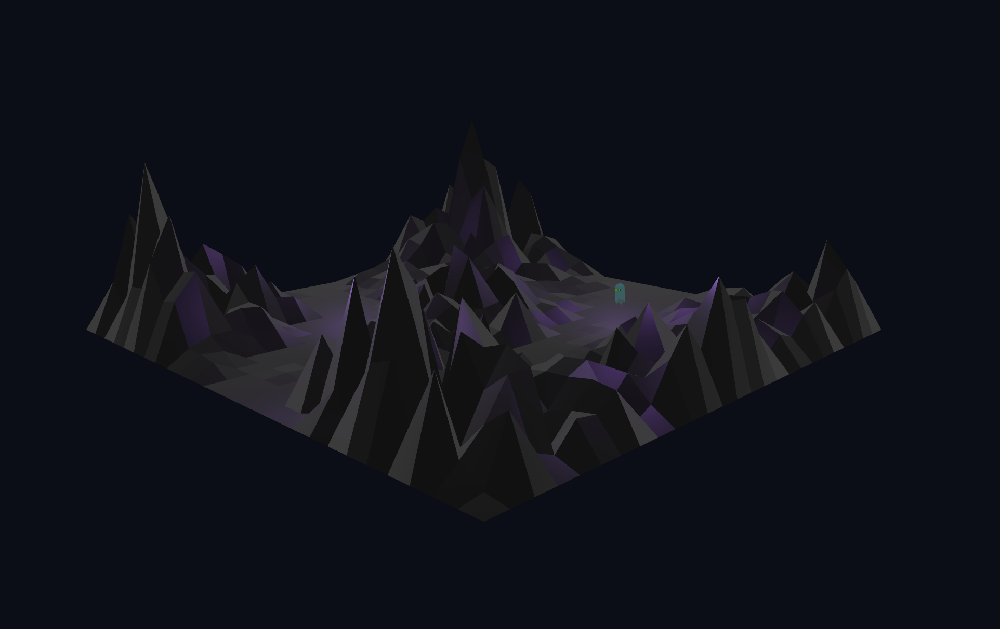

+++
title = "This Month in Rust GameDev #34 - May 2022"
transparent = true
date = 2022-06-02
draft = true
+++

<!-- no toc -->

<!-- Check the post with markdownlint-->

Welcome to the 34th issue of the Rust GameDev Workgroup's
monthly newsletter.
[Rust] is a systems language pursuing the trifecta:
safety, concurrency, and speed.
These goals are well-aligned with game development.
We hope to build an inviting ecosystem for anyone wishing
to use Rust in their development process!
Want to get involved? [Join the Rust GameDev working group!][join]

You can follow the newsletter creation process
by watching [the coordination issues][coordination].
Want something mentioned in the next newsletter?
[Send us a pull request][pr].
Feel free to send PRs about your own projects!

[Rust]: https://rust-lang.org
[join]: https://github.com/rust-gamedev/wg#join-the-fun
[pr]: https://github.com/rust-gamedev/rust-gamedev.github.io
[coordination]: https://github.com/rust-gamedev/rust-gamedev.github.io/issues?q=label%3Acoordination
[Rust]: https://rust-lang.org
[join]: https://github.com/rust-gamedev/wg#join-the-fun

- [Announcements](#announcements)
- [Game Updates](#game-updates)
- [Learning Material Updates](#learning-material-updates)
- [Engine Updates](#engine-updates)
- [Tooling Updates](#tooling-updates)
- [Library Updates](#library-updates)
- [Other News](#other-news)
- [Popular Workgroup Issues in Github](#popular-workgroup-issues-in-github)
- [Meeting Minutes](#meeting-minutes)
- [Discussions](#discussions)
- [Requests for Contribution](#requests-for-contribution)
- [Jobs](#jobs)
- [Bonus](#bonus)

<!--
Ideal section structure is:

```
### [Title]


_image caption_

A paragraph or two with a summary and [useful links].

_Discussions:
[/r/rust](https://reddit.com/r/rust/todo),
[twitter](https://twitter.com/todo/status/123456)_

[Title]: https://first.link
[useful links]: https://other.link
```

If needed, a section can be split into subsections with a "------" delimiter.
-->

## Announcements

### Rust Graphics Meetup 2

[][graphics-meetup-playlist]

The 2nd Rust Graphics Meetup took place on the 21st of May. The videos of the
talks have been released:

- [Vismut][vismut-talk] | [Lukas Orsvärn]
- [Screen-13][screen-10-talk] | [John Wells]
- [Optimizing wgpu with Data Driven Design][wgpu-talk] | [Connor Fitzgerald]

[vismut-talk]: https://www.youtube.com/watch?v=0IsllXP7_pY
[screen-10-talk]: https://www.youtube.com/watch?v=ywZznsCXUjs
[wgpu-talk]: https://www.youtube.com/watch?v=DDG4bcGs7zM

[Lukas Orsvärn]: https://github.com/lukors
[John Wells]: https://github.com/attackgoat/screen-13
[Connor Fitzgerald]: https://github.com/cwfitzgerald

[graphics-meetup-playlist]: https://www.youtube.com/watch?v=DDG4bcGs7zM&list=PLYiOdhpKxxXJwaocrJcOCoBhlV6foaO8F&index=4

### Rust GameDev Meetup


The 16th Rust Gamedev Meetup took place in May. You can watch the recording of
the meetup [here on Youtube][gamedev-meetup-video]. Here was the schedule from
the meetup:

- RustConf Arcade Cabinet - [@carlosupina]
- Puzzle platformer - [@tesselode]
- Veloren - [@AngelOnFira]
- Graphite - [@GraphiteEditor]

The meetups take place on the second Saturday every month via the [Rust Gamedev
Discord server][rust-gamedev-discord] and are also [streamed on
Twitch][rust-gamedev-twitch]. If you would like to show off what you've been
working on at the next meetup on [June 11th][rust-meetup-time], fill out [this
form][gamedev-meetup-form].

[gamedev-meetup-video]: https://youtu.be/XOpZIzmFifk
[rust-gamedev-discord]: https://discord.gg/yNtPTb2
[rust-gamedev-twitch]: https://twitch.tv/rustgamedev
[rust-meetup-time]: https://everytimezone.com/s/ffc60181
[gamedev-meetup-form]: https://forms.gle/BS1zCyZaiUFSUHxe6

[@carlosupina]: https://twitter.com/tesselode
[@tesselode]: https://twitter.com/carlosupina
[@AngelOnFira]: https://twitter.com/AngelOnFira
[@GraphiteEditor]: https://twitter.com/graphiteeditor

### 3D Ferris


[@RayMarch][raymarch-twitter] is
creating a game-ready 3D model of [Ferris the Rustacean][ferris]. These links
provide a more detailed look:

- [360 overview][raymarch-twitter-360]
- [Ferris dancing][raymarch-twitter-dance]

Once the model is finished, it will be published under a permissive license on
[Github][raymarch-github], so you can use it in your 3D game,
rendering demo, v-tuber avatar, you name it!

*Discussions:
[Twitter][raymarch-twitter-dance],
[Discord][raymarch-gamedev-discord]*

[ferris]: https://rustacean.net/
[raymarch-twitter]: https://twitter.com/Ray__March
[raymarch-twitter-dance]: https://twitter.com/Ray__March/status/1523717266730151936
[raymarch-twitter-360]: https://twitter.com/Ray__March/status/1512907700740444163
[raymarch-github]: https://github.com/RayMarch
[raymarch-gamedev-discord]: https://discord.com/channels/676678179678715904/974371568975216700

### RustConf Arcade Cabinet


[Carlo][carlosupina] is building a custom arcade cabinet that will be at
RustConf 2022 in Portland. It is an opportunity for Rust game developers to
share their games with the broader community. If you are interested in getting
your game on the cabinet, read [this Twitter thread][arcade-cabinet-thread] and
fill out the [interest form][arcade-interest-form].
All of the parts for the cabinet are currently in production,
and art for the sides is in progress.
Check out the latest update [here][arcade-cabinet-update-thread].

[carlosupina]: https://twitter.com/carlosupina
[arcade-cabinet-thread]: https://twitter.com/carlosupina/status/1523715837726961664
[arcade-cabinet-update-thread]: https://twitter.com/carlosupina/status/1532717151240323072
[arcade-interest-form]: https://forms.gle/onFm5fCygdbiArqJ7

## Game Updates

### [Battleship]


[Battleship] by [@orhun] is the [battleship game] implemented in Rust.

Features:

- Fully playable between 2 players on the terminal.
- No installation required.
- Works over TCP sockets.
- Very lightweight to host your own server (only has 1 dependency).

[Battleship]: https://github.com/orhun/battleship-rs
[battleship game]: https://en.wikipedia.org/wiki/Battleship_(game)
[@orhun]: https://github.com/orhun/

### [ROOM4DOOM][room4doom]

[][room4doom]

[ROOM4DOOM][room4doom] is a rewrite of the classic Doom engine in Rust with some
modernisation.

[@flukejones][flukejones_twitter] has been very busy in the last 4 months completing
many parts of ROOM4DOOM; rendering, subsystems for menus, statusbar, intermissions,
and of course the actual gameplay - you can now complete Doom 1 in ROOM4DOOM.

A recent Twitter thread has been cleaned up and expanded in to a blog post providing
context to the project and a walk-through of the history.
You can view that [here][room4doom_blog].

[room4doom]: https://gitlab.com/flukejones/room4doom
[flukejones_twitter]: https://twitter.com/flukejones
[room4doom_blog]: https://ljones.dev/blog/room4doom-20220529/

### [limbo_pass]



[limbo_pass] by [@shnewto] is a little 3D walking sim in Bevy that uses
scenes, meshes, and materials exported directly from Blender.

Features include:

- Blender assets exported to glTF
- Collision detection with [bevy_rapier3d]
- Looping audio with [bevy_kira_audio]

For more info, see the [announcement post][limbo_pass_announce] and the
[gameplay video][limbo_pass_gameplay].

[limbo_pass_announce]: https://twitter.com/shnewto/status/1520897809968340992
[limbo_pass_gameplay]: https://youtu.be/gxUesnuTBBI
[limbo_pass]: https://github.com/shnewto/limbo_pass
[@shnewto]: https://github.com/shnewto/
[bevy_rapier3d]: https://github.com/dimforge/bevy_rapier
[bevy_kira_audio]: https://github.com/NiklasEi/bevy_kira_audio

### [Hydrofoil Generation]


[Hydrofoil Generation]
([Steam][hgs_steam], [Facebook][hgs_facebook], [Discord][hgs_discord])
is a realistic sailing/foiling inshore simulator in development for PC/Steam
that will put you in the driving seat of modern competitive sailing.
Hydrofoil Generation is based on a custom made DirectX 11 based engine.

A new [trailer][hgs_trailer] just landed showcasing new animations, the new
Hong Kong location and camera modes.

Meanwhile, private beta-testing is well underway with good feedback regarding
boat controls and physics, netcode and software stability, Rust for sure
delivered on all the promises here.

The first set of Sailing rules has also been implemented and part of the
current beta testing process with more rules to be added in the next months.

Sadly the target Q2 2022 Early Access release on Steam couldn't be hit and
now the team is aiming at a Q4 2022 release.

[Hydrofoil Generation]: https://hydrofoil-generation.com/
[hgs_facebook]: https://www.facebook.com/HydrofoilGenerationSailing/
[hgs_discord]: https://discord.gg/DtKgt2duAy/
[hgs_steam]: https://store.steampowered.com/app/1448820/Hydrofoil_Generation/
[hgs_trailer]: https://youtu.be/oFtFdmnkkSI

### Country Slice


Country Slice (WIP name) is a relaxing building game being made by [@anastasiaopara].

This month, she added an animated undo system. You can find more details in this
[twitter thread][country-slice-twitter], and follow the [newsletter][country-slice-newsletter]
for more updates.

[country-slice-newsletter]: https://dashboard.mailerlite.com/forms/10395/51067704544593017/share
[country-slice-twitter]: https://twitter.com/anastasiaopara/status/1530473522224582656
[@anastasiaopara]: https://twitter.com/anastasiaopara

### [Way of Rhea][wor]

[][wor]

[Way of Rhea][wor] is a puzzle adventure with hard puzzles and forgiving
mechanics being produced by [@masonremaley][wor-mason-remaley] in a custom Rust
engine. You can support development by [wishlisting the game on Steam][wor], and
[giving feedback][wor-forum] on the Steam demo.

Way of Rhea was selected to be part of the Cerebral Puzzle Showcase! The event
is over, you can still find the
[list of games and some of the demos here][wor-cps]. Recent updates:

- More work was done on the [Jungle Biome visuals][wor-jungle]
- Dynamic gradient overlays were added to the engine to give a sense of depth
- Fixed bug where Nvidia drivers would incorrectly trigger the crash dump writer
- Fixed a long running draw call sorting problem that could lead to popping
- Fixed an audio failure when unplugging the active speaker

[wor]: https://store.steampowered.com/app/1110620/Way_of_Rhea/?utm_campaign=tmirgd&utm_source=n34
[wor-mason-remaley]: https://twitter.com/masonremaley
[wor-forum]: https://steamcommunity.com/app/1110620/discussions/0/3275817732933009791/
[wor-cps]: https://store.steampowered.com/sale/CerebralPuzzleShowcase
[wor-jungle]: https://store.steampowered.com/news/app/1110620?emclan=103582791465120432&emgid=3180116240852440293

### [Veloren][veloren]


_A glorious flight to distant lands_

[Veloren][veloren] is an open world, open-source voxel RPG inspired by Dwarf
Fortress and Cube World.

In May, work was done on Wyvern models. Smoke was improved from houses, and now
has different colours and strenghts. A rib cage generator was added, so now
there are large bone structures from ancient times around the world. Level of
detail objects were added, so trees can now be seen on far off mountains. This
makes the world feel significantly more alive. A lot of work was done on the
performance of the game server, as Veloren has been seeing over 100 concurrent
players at peak on the server nearly every day for the past few weeks.

Lots of work was done on balancing items and drop rates. Water caves have been
worked on, which now means that you might need to enter them from underwater.
Modular weapons were merged, which was a change several months in the making.
NPCs are now able to pick up items that are on the ground. Work was done on
taming and mounting various animals. Weather is still in the works, with
improvements to the ambiant SFX system for rain. A new UI concept was created
for what Airshipper might be able to look like in the future.

May's full weekly devlogs: "This Week In Veloren...":
[#170][veloren-170],
[#171][veloren-171],
[#172][veloren-172],
[#173][veloren-173],
[#174][veloren-174].

[veloren]: https://veloren.net

[veloren-170]: https://veloren.net/devblog-170
[veloren-171]: https://veloren.net/devblog-171
[veloren-172]: https://veloren.net/devblog-172
[veloren-173]: https://veloren.net/devblog-173
[veloren-174]: https://veloren.net/devblog-174

## Engine Updates

### [Fyrox]


[Fyrox] ([Discord][fyrox_discord], [Twitter][fyrox_twitter]) is a game engine that
aims to be easy to use and provide a large set of out-of-the-box features. In May
it hit version 0.25 which added a lot of new functionality:

- Static plugin system.
- User-defined scripts.
- Play mode for the editor.
- Animation blending state machine editor.
- Prefab inheritance improvements.
- Layout and render transform support for widgets.
- Shortcuts improvements in the editor.
- UI performance improvements.
- Double click support in `fyrox-ui`
- Better serializer error recovery.
- Tons of small improvements and fixes.

Some time after, the engine hit version 0.26 which was primarily focused on bug fixing,
but also added some interesting features:

- Project template generator.
- Script API improvements.
- Shader cache fixes.
- Skybox validator.

See full list of changes in respective blog posts - [0.25] and [0.26]. Everybody,
who wants to learn how to use the engine should check the new
[2D Platformer Tutorial][platformer_tutorial].

[Fyrox]: https://github.com/FyroxEngine/Fyrox
[0.25]: https://fyrox.rs/blog/post/feature-highlights-0-25/
[0.26]: https://fyrox.rs/blog/post/feature-highlights-0-26/
[fyrox_discord]: https://discord.com/invite/xENF5Uh
[fyrox_twitter]: https://twitter.com/DmitryNStepanov
[platformer_tutorial]: https://fyrox-book.github.io/fyrox/tutorials/platformer/part1.html

### [miniquad]

[][miniquad-pr]

[miniquad] is a pure Rust, cross-platform graphics library.

[The biggest PR in miniquad's history][miniquad-pr] landed this month, finishing
the effort of removing all the `sapp` legacy.

Changes includes:

- No more `sapp-*` crates. Now it's just one crate, miniquad!
  No mess with individual crates any more, no FFI for
  miniquad - sapp communication.
- On Linux, miniquad does not depend/statically link with lib*-dev packages.
  Miniquad can choose between glx/egl, x11/wayland at runtime.
- MacOS implementation does not depend on any Objective C code anymore.

[miniquad]: https://github.com/not-fl3/miniquad/
[miniquad-pr]: https://github.com/not-fl3/miniquad/pull/278

## Learning Material Updates

### [Intro to Material/Shaders in Bevy][bevy-materials-playlist]


[Matthew Bryant][matthew-bryant-youtube] has created
[a series about Bevy's Material abstraction][bevy-materials-playlist],
showing how to use custom WGSL shaders in Bevy.

The series walks through the documention to understand why steps are done in
order to build a clear theoretical understanding of Bevy's high level abstractions.

- The first of the three videos covers the bare minimum needed
  to render a material;
- the second introduces bind groups to use textures and generic data in
  the shader;
- and the final video ties into Bevy's ECS to copy game data onto the
  graphics card every frame.

He will be releasing videos about UI in Bevy and Rapier physics next month.

[bevy-materials-playlist]: https://youtube.com/playlist?list=PLT_D88-MTFOMNRPAC-62Hz096aIjT4Noy
[matthew-bryant-youtube]: https://youtube.com/channel/UC7v3YEDa603x_84PgCPytzA

### [Kubecon 2022, Lightning Talk: Wasmcloud + Bevy ECS][Lightning-Talk-schedule]


[QQparty][alanpoon-qqparty] is a serverless multiplayer game built with Bevy ECS
and [Wasmcloud][wasmcloud_website].

This month, [@rustropy_gaming][alanpoon_twitter] joined Cosmonic to give
a series of Wasmcloud talks in Kubecon 2022 VLC. They demonstrated
how Bevy can be added into Wasmcloud's actors as a serverless
game server.

You can check out a recording of the talk on [YouTube][Lightning-Talk-youtube],
as well as viewing the [slides][Lightning-Talk-pdf]. For updates on QQparty,
follow [@rustropy_gaming][alanpoon_twitter] on Twitter!

[Lightning-Talk-schedule]: https://cloudnativewasmdayeu22.sched.com/event/zgbG/lightning-talk-wasmcloud-bevy-ecs-solution-to-woe-of-indie-game-developers-alan-poon-yong-quan-shopee?iframe=no&w=100%&sidebar=yes&bg=no
[Lightning-Talk-pdf]: https://static.sched.com/hosted_files/cloudnativewasmdayeu22/3c/lightingtalk-alan_pdf.pdf
[Lightning-Talk-youtube]: https://youtube.com/watch?v=8q2sPPX5aXY&list=PLj6h78yzYM2Ni0u-ONljTkv4uOutyjwq9&index=3
[alanpoon-qqparty]: https://github.com/alanpoon/qq_party
[alanpoon_twitter]: https://twitter.com/rustropy_gaming
[wasmcloud_website]: https://wasmcloud.dev/

### [Rusteroids][rusteroids-youtube-playlist]


[Rusteroids][rusteroids-github] is a tutorial recreating a clone of Asteroids
in Rust, using SDL2 and the [Specs][rust-specs-crate] library.

New episodes are released weekly and added to the playlist. Most recently,
collision detection was added to reset the game state when the asteroid
and player collide. The latest episode is [here][rusteroids-latest].

You can subscribe to the [YouTube Channel][electrocat-youtube],
to never miss an episode, or follow [@ecatstudios][ecatstudios-twitter] on
Twitter!

[rusteroids-youtube-playlist]: https://youtube.com/playlist?list=PLFOS-Gn3aXROnSfl26esPExssd-rQw6jD
[rusteroids-github]: https://github.com/filtoid/rusteroids
[rust-specs-crate]: https://docs.rs/specs/latest/specs/
[rusteroids-latest]: https://youtube.com/watch?v=KTDdlWErmYU&list=PLFOS-Gn3aXROnSfl26esPExssd-rQw6jD&index=9
[electrocat-youtube]: https://youtube.com/channel/UC1m6P72nySpB3lKWDYGVipw
[ecatstudios-twitter]: https://twitter.com/ecatstudios

### [Starting a new 2d platformer with Bevy ECS][video-platformer-bevy-ecs]

[][video-platformer-bevy-ecs]

[@chrisbiscardi] published a [video][video-platformer-bevy-ecs]
on setting up a new 2D platformer project using Bevy. The video covers
intergrating with LDTK, Rapier, and becy_ecs_tilemap to get a working
character controller with collisions in a sandbox. It also touches on
staple crates such as bevy_asset_loader and iyes_loopless.

_Discussions:
[/r/rust_gamedev](https://reddit.com/r/rust_gamedev/comments/v0keg2/starting_a_new_2d_platformer_with_bevy_ecs),
[Twitter](https://twitter.com/chrisbiscardi/status/1524008901028421632)_

[@chrisbiscardi]: https://twitter.com/chrisbiscardi
[video-platformer-bevy-ecs]: https://youtube.com/watch?v=gjeEYntkvoY

### [Comparing a Voxel Game in F# and Rust][fsharp-rust-voxel]


[This article][fsharp-rust-voxel] walks through the process of rewritting an F#
game in Rust. It explores the similarities between the languages, and talks
about using simple code constructs where possible. It talks about the Rust
crates used to help with the process. Finally, it goes over a conclusion
comparing the speed of both versions of the games, and the sizes of the
codebases.

[fsharp-rust-voxel]: https://cragwind.com/blog/posts/comparing-voxel-game-fsharp-rust/

## Tooling Updates

### [Bloom3D][bloom3d]

[][bloom3d]

[Bloom3D](bloom3d) is a minimalist web app for 3D modeling that's built in Rust.

This month [@kettlecorn][kettlecorn_twitter] released a new version of
[Bloom3D][bloom3d] that adds a variety of new features including a
rectangle tool, move tool, and OBJ export.

Check out the [Twitter announcement thread][bloom_update_twitter] for an overview
and videos of all the new features.

Bloom is powered by a custom game engine called [`koi`](koi) that is open-sourced
on GitHub.

[bloom3d]: https://bloom3d.com
[koi]: https://github.com/kettle11/koi
[kettlecorn_twitter]: https://twitter.com/kettlecorn
[bloom_update_twitter]: https://twitter.com/kettlecorn/status/1529193509462360065

### [Graphite][graphite-website]


Graphite ([website][graphite-website], [GitHub][graphite-repo],
[Discord][graphite-discord], [Twitter][graphite-twitter]) is a free,
in-development raster and vector 2D graphics editor. It will be powered by a
node graph compositing engine that supercharges your layer stack, providing a
completely non-destructive editing experience.

- Spring cleaning: The past month's Sprint 15 work has focused mostly on
  technical debt cleanup, documentation, and bug fixes around the frontend. That
  continues with the Rust backend next month.

- A Radiant Gradient: The Gradient tool now supports radial styles in
  addition to linear.

- New blog post: [Learn about the plans][graphite-blog-post] for
  distributed computing across many CPUs and GPUs with Graphene, the Rust-based
  node graph engine and renderer that will power Graphite.

Open the [Graphite editor][graphite-live-demo] in your browser to give it a try
and share your creations with `#MadeWithGraphite` on Twitter.

[graphite-website]: https://graphite.rs
[graphite-repo]: https://github.com/GraphiteEditor/Graphite
[graphite-discord]: https://discord.graphite.rs
[graphite-twitter]: https://twitter.com/GraphiteEditor
[graphite-live-demo]: https://editor.graphite.rs
[graphite-blog-post]: https://graphite.rs/blog/distributed-computing-in-the-graphene-runtime/

## Library Updates

### [bevy_mod_scripting]


[bevy_mod_scripting] by @makspll is a brand new Bevy plugin
enabling multi-language scripting (currently in Lua and Rhai).

The plugin is in early stages but as of now supports:

- Handling events at multiple points of your stage pipeleine.
- Sending events to specific, or all scripts.
- Setting event priority to order your callbacks.
- Defining custom state and API's at initialization.
- Sending run-time error events (to for example show them in an in-game console).
- One-shot scripts.

General Bevy API support is under-way so stay tuned!

[bevy_mod_scripting]: https://github.com/makspll/bevy_mod_scripting

### [bevy_silk]


[bevy_silk] by @[ManevilleF] is a cloth physics plugin for Bevy.

Apply cloth physics to any mesh, by adding a single component to your entity!

Features:

- Collision support using [bevy_rapier](https://github.com/dimforge/bevy_rapier)
- Global and per-entity physics customization
- Dynamic smooth and flat normals
- Wind forces
- Custom cloth anchors

The library is fully documented and the repository provides various usage examples.

_Discussions: [Twitter](https://twitter.com/ManevilleF/status/1527313861199527937)_

[bevy_silk]: https://github.com/ManevilleF/bevy_silk
[ManevilleF]: https://twitter.com/ManevilleF

### [bevy_asset_loader]

[bevy_asset_loader] by [@nikl_me] is a Bevy plugin that helps with asset
loading and asset organisation. It greatly reduces boilerplate code for
loading states and can resolve asset configuration at run time.

This month, version `0.11.0` was released. It supports loading lists of files
as `Vec<HandleUntyped>` or `Vec<Handle<T>>`. This is an alternative to loading
folders, which is not supported on the web. You can now track the loading
progress of your assets with [iyes_progress] and build loading bars.
Integrating with [iyes_loopless] gives you some benefits of stageless
scheduling in current Bevy. Additionally, the loading of assets fields
without attributes was improved. It now uses the `FromWorld` trait
instead of `Default`.

More improvements will likely follow for the dynamic asset story. One goal
is to allow loading any custom values as dynamic assets.

[bevy_asset_loader]: https://github.com/NiklasEi/bevy_asset_loader
[@nikl_me]: https://twitter.com/nikl_me
[iyes_loopless]: https://github.com/IyesGames/iyes_loopless
[iyes_progress]: https://github.com/IyesGames/iyes_progress

### [bevy_kira_audio]

[bevy_kira_audio] by [@nikl_me] is an alternative audio
plugin for Bevy. It uses [Kira] to play and control
game audio.

This month saw the release of version `0.10.0`. The plugin
now uses the latest Kira release, which was a major rewrite.
The audio channel API is improved by making all channels
resources in Bevy's ECS and sounds can be directly loaded
from asset files with settings like their volume, playback
rate, or panning. Additionally, the audio backend can now
be configured before creation through a settings resource.

[bevy_kira_audio]: https://github.com/NiklasEi/bevy_kira_audio
[@nikl_me]: https://twitter.com/nikl_me
[Kira]: https://github.com/tesselode/kira

## Popular Workgroup Issues in Github

<!-- Up to 10 links to interesting issues -->

## Other News

<!-- One-liners for plan items that haven't got their own sections. -->

## Meeting Minutes

<!-- Up to 10 most important notes + a link to the full details -->

[See all meeting issues][label_meeting] including full text notes
or [join the next meeting][join].

[label_meeting]: https://github.com/rust-gamedev/wg/issues?q=label%3Ameeting

## Discussions

- [/r/rust_gamedev](https://www.reddit.com/r/rust_gamedev/):
  - ["Choosing a networking library for my game"][r-gamedev-networking]
- [Rust Gamedev WG](https://github.com/rust-gamedev/wg):
  - [#124 - "Wanted: a good JPEG 2000 decoder for Rust"][gamedev-wg-jpeg]

[r-gamedev-networking]: https://www.reddit.com/r/rust_gamedev/comments/ujk2s6/choosing_a_networking_library_for_my_game/
[gamedev-wg-jpeg]: https://github.com/rust-gamedev/wg/issues/124

## Requests for Contribution

- [Graphite is looking for contributors][graphite-contribute] to help build the
new node graph and 2D rendering systems.
- [winit's "difficulty: easy" issues][winit-issues].
- [Backroll-rs, a new networking library][backroll-rs].
- [Embark's open issues][embark-open-issues] ([embark.rs]).
- [wgpu's "help wanted" issues][wgpu-issues].
- [luminance's "low hanging fruit" issues][luminance-fruits].
- [ggez's "good first issue" issues][ggez-issues].
- [Veloren's "beginner" issues][veloren-beginner].
- [Amethyst's "good first issue" issues][amethyst-issues].
- [A/B Street's "good first issue" issues][abstreet-issues].
- [Mun's "good first issue" issues][mun-issues].
- [SIMple Mechanic's good first issues][simm-issues].
- [Bevy's "good first issue" issues][bevy-issues].

[graphite-contribute]: https://github.com/GraphiteEditor/Graphite/issues/202
[winit-issues]: https://github.com/rust-windowing/winit/issues?q=is%3Aopen+is%3Aissue+label%3A%22difficulty%3A+easy%22
[backroll-rs]: https://github.com/HouraiTeahouse/backroll-rs/issues
[embark.rs]: https://embark.rs
[embark-open-issues]: https://github.com/search?q=user:EmbarkStudios+state:open
[wgpu-issues]: https://github.com/gfx-rs/wgpu/issues?q=is%3Aissue+is%3Aopen+label%3A%22help+wanted%22
[luminance-fruits]: https://github.com/phaazon/luminance-rs/issues?q=is%3Aissue+is%3Aopen+label%3A%22low+hanging+fruit%22
[ggez-issues]: https://github.com/ggez/ggez/labels/%2AGOOD%20FIRST%20ISSUE%2A
[veloren-beginner]: https://gitlab.com/veloren/veloren/issues?label_name=beginner
[amethyst-issues]: https://github.com/amethyst/amethyst/issues?q=is%3Aissue+is%3Aopen+label%3A%22good+first+issue%22
[abstreet-issues]: https://github.com/a-b-street/abstreet/issues?q=is%3Aissue+is%3Aopen+label%3A%22good+first+issue%22
[mun-issues]: https://github.com/mun-lang/mun/labels/good%20first%20issue
[simm-issues]: https://github.com/mkhan45/SIMple-Mechanics/labels/good%20first%20issue
[bevy-issues]: https://github.com/bevyengine/bevy/labels/E-Good-First-Issue

## Jobs

- [DIMS](https://www.dims.co/jobs)
  (Stockholm/Remote)
  - Tools Programmer (Rust)
  - Internship: 3D Artist
  - Open applications accepted
- [Embark Studios](https://careers.embark-studios.com/jobs)
  (Stockholm/Hybrid Remote)
  - Many roles - check the site for the latest list
  - Open applications accepted

## Bonus

<!-- Bonus section to make the newsletter more interesting
and highlight events from the past. -->

------

That's all news for today, thanks for reading!

Want something mentioned in the next newsletter?
[Send us a pull request][pr].

Also, subscribe to [@rust_gamedev on Twitter][@rust_gamedev]
or [/r/rust_gamedev subreddit][/r/rust_gamedev] if you want to receive fresh news!

<!--
TODO: Add real links and un-comment once this post is published
**Discuss this post on**:
[/r/rust_gamedev](TODO),
[Twitter](TODO),
[Discord](https://discord.gg/yNtPTb2).
-->

[/r/rust_gamedev]: https://reddit.com/r/rust_gamedev
[@rust_gamedev]: https://twitter.com/rust_gamedev
[pr]: https://github.com/rust-gamedev/rust-gamedev.github.io
