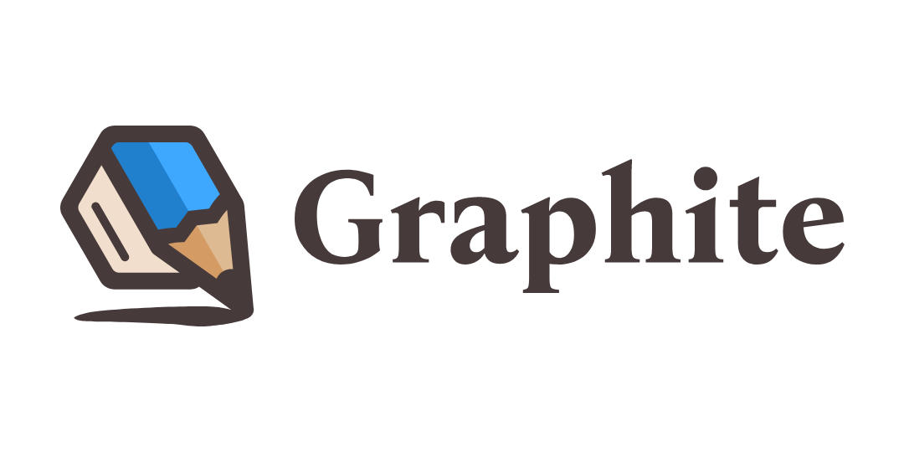

+++
title = "This Month in Rust GameDev #34 - May 2022"
transparent = true
date = 2022-06-02
draft = true
+++

<!-- no toc -->

<!-- Check the post with markdownlint-->

Welcome to the 34th issue of the Rust GameDev Workgroup's
monthly newsletter.
[Rust] is a systems language pursuing the trifecta:
safety, concurrency, and speed.
These goals are well-aligned with game development.
We hope to build an inviting ecosystem for anyone wishing
to use Rust in their development process!
Want to get involved? [Join the Rust GameDev working group!][join]

You can follow the newsletter creation process
by watching [the coordination issues][coordination].
Want something mentioned in the next newsletter?
[Send us a pull request][pr].
Feel free to send PRs about your own projects!

[Rust]: https://rust-lang.org
[join]: https://github.com/rust-gamedev/wg#join-the-fun
[pr]: https://github.com/rust-gamedev/rust-gamedev.github.io
[coordination]: https://github.com/rust-gamedev/rust-gamedev.github.io/issues?q=label%3Acoordination
[Rust]: https://rust-lang.org
[join]: https://github.com/rust-gamedev/wg#join-the-fun

- [Game Updates](#game-updates)
- [Learning Material Updates](#learning-material-updates)
- [Engine Updates](#engine-updates)
- [Tooling Updates](#tooling-updates)
- [Library Updates](#library-updates)
- [Other News](#other-news)
- [Popular Workgroup Issues in Github](#popular-workgroup-issues-in-github)
- [Meeting Minutes](#meeting-minutes)
- [Discussions](#discussions)
- [Requests for Contribution](#requests-for-contribution)
- [Jobs](#jobs)
- [Bonus](#bonus)

<!--
Ideal section structure is:

```
### [Title]


_image caption_

A paragraph or two with a summary and [useful links].

_Discussions:
[/r/rust](https://reddit.com/r/rust/todo),
[twitter](https://twitter.com/todo/status/123456)_

[Title]: https://first.link
[useful links]: https://other.link
```

If needed, a section can be split into subsections with a "------" delimiter.
-->

## Game Updates

### [Battleship]


[Battleship] by [@orhun] is the [battleship game] implemented in Rust.

Features:

- Fully playable between 2 players on the terminal.
- No installation required.
- Works over TCP sockets.
- Very lightweight to host your own server (only has 1 dependency).

[Battleship]: https://github.com/orhun/battleship-rs
[battleship game]: https://en.wikipedia.org/wiki/Battleship_(game)
[@orhun]: https://github.com/orhun/

## Engine Updates

## Learning Material Updates

### [Intro to Material/Shaders in Bevy][bevy-materials-playlist]


[Matthew Bryant][matthew-bryant-youtube] has created
[a series about Bevy's Material abstraction][bevy-materials-playlist],
showing how to use custom WGSL shaders in Bevy.

The series walks through the documention to understand why steps are done in
order to build a clear theoretical understanding of Bevy's high level abstractions.

- The first of the three videos covers the bare minimum needed
  to render a material;
- the second introduces bind groups to use textures and generic data in
  the shader;
- and the final video ties into Bevy's ECS to copy game data onto the
  graphics card every frame.

He will be releasing videos about UI in Bevy and Rapier physics next month.

[bevy-materials-playlist]: https://youtube.com/playlist?list=PLT_D88-MTFOMNRPAC-62Hz096aIjT4Noy
[matthew-bryant-youtube]: https://youtube.com/channel/UC7v3YEDa603x_84PgCPytzA

### [Kubecon 2022, Lightning Talk: Wasmcloud + Bevy ECS][Lightning-Talk-schedule]


[QQparty][alanpoon-qqparty] is a serverless multiplayer game built with Bevy ECS
and [Wasmcloud][wasmcloud_website].

This month, [@rustropy_gaming][alanpoon_twitter] joined Cosmonic to give
a series of Wasmcloud talks in Kubecon 2022 VLC. They demonstrated
how Bevy can be added into Wasmcloud's actors as a serverless
game server.

You can check out a recording of the talk on [YouTube][Lightning-Talk-youtube],
as well as viewing the [slides][Lightning-Talk-pdf]. For updates on QQparty,
follow [@rustropy_gaming][alanpoon_twitter] on Twitter!

[Lightning-Talk-schedule]: https://cloudnativewasmdayeu22.sched.com/event/zgbG/lightning-talk-wasmcloud-bevy-ecs-solution-to-woe-of-indie-game-developers-alan-poon-yong-quan-shopee?iframe=no&w=100%&sidebar=yes&bg=no
[Lightning-Talk-pdf]: https://static.sched.com/hosted_files/cloudnativewasmdayeu22/3c/lightingtalk-alan_pdf.pdf
[Lightning-Talk-youtube]: https://youtube.com/watch?v=8q2sPPX5aXY&list=PLj6h78yzYM2Ni0u-ONljTkv4uOutyjwq9&index=3
[alanpoon-qqparty]: https://github.com/alanpoon/qq_party
[alanpoon_twitter]: https://twitter.com/rustropy_gaming
[wasmcloud_website]: https://wasmcloud.dev/

### [Rusteroids][rusteroids-youtube-playlist]


[Rusteroids][rusteroids-github] is a tutorial recreating a clone of Asteroids
in Rust, using SDL2 and the [Specs][rust-specs-crate] library.

New episodes are released weekly and added to the playlist. Most recently,
collision detection was added to reset the game state when the asteroid
and player collide. The latest episode is [here][rusteroids-latest].

You can subscribe to the [YouTube Channel][electrocat-youtube],
to never miss an episode, or follow [@ecatstudios][ecatstudios-twitter] on
Twitter!

[rusteroids-youtube-playlist]: https://youtube.com/playlist?list=PLFOS-Gn3aXROnSfl26esPExssd-rQw6jD
[rusteroids-github]: https://github.com/filtoid/rusteroids
[rust-specs-crate]: https://docs.rs/specs/latest/specs/
[rusteroids-latest]: https://youtube.com/watch?v=KTDdlWErmYU&list=PLFOS-Gn3aXROnSfl26esPExssd-rQw6jD&index=9
[electrocat-youtube]: https://youtube.com/channel/UC1m6P72nySpB3lKWDYGVipw
[ecatstudios-twitter]: https://twitter.com/ecatstudios

## Tooling Updates

### [Bloom3D][bloom3d]

[][bloom3d]

[Bloom3D](bloom3d) is a minimalist web app for 3D modeling that's built in Rust.

This month [@kettlecorn][kettlecorn_twitter] released a new version of
[Bloom3D][bloom3d] that adds a variety of new features including a
rectangle tool, move tool, and OBJ export.

Check out the [Twitter announcement thread][bloom_update_twitter] for an overview
and videos of all the new features.

Bloom is powered by a custom game engine called [`koi`](koi) that is open-sourced
on GitHub.

[bloom3d]: https://bloom3d.com
[koi]: https://github.com/kettle11/koi
[kettlecorn_twitter]: https://twitter.com/kettlecorn
[bloom_update_twitter]: https://twitter.com/kettlecorn/status/1529193509462360065

### [Graphite][graphite-website]



Graphite ([website][graphite-website], [GitHub][graphite-repo],
[Discord][graphite-discord], [Twitter][graphite-twitter]) is a free,
in-development raster and vector 2D graphics editor. It will be powered by a
node graph compositing engine that supercharges your layer stack, providing a
completely non-destructive editing experience.

- **Spring cleaning:** The past month's Sprint 15 work has focused mostly on
technical debt cleanup, documentation, and bug fixes around the frontend. That
continues with the Rust backend next month.

- **A Radiant Gradient:** The Gradient tool now supports radial styles in
addition to linear.

- **New blog post:** [Learn about the plans][graphite-blog-post] for
distributed computing across many CPUs and GPUs with Graphene, the Rust-based
node graph engine and renderer that will power Graphite.

Open the [Graphite editor][graphite-live-demo] in your browser to give it a try
and share your creations with `#MadeWithGraphite` on Twitter.

[graphite-website]: https://graphite.rs
[graphite-repo]: https://github.com/GraphiteEditor/Graphite
[graphite-discord]: https://discord.graphite.rs
[graphite-twitter]: https://twitter.com/GraphiteEditor
[graphite-live-demo]: https://editor.graphite.rs
[graphite-blog-post]: https://graphite.rs/blog/distributed-computing-in-the-graphene-runtime/

## Library Updates

### [bevy_mod_scripting]


[bevy_mod_scripting] by @makspll is a brand new Bevy plugin
enabling multi-language scripting (currently in Lua and Rhai).

The plugin is in early stages but as of now supports:

- Handling events at multiple points of your stage pipeleine.
- Sending events to specific, or all scripts.
- Setting event priority to order your callbacks.
- Defining custom state and API's at initialization.
- Sending run-time error events (to for example show them in an in-game console).
- One-shot scripts.

General Bevy API support is under-way so stay tuned!

[bevy_mod_scripting]: https://github.com/makspll/bevy_mod_scripting

## Popular Workgroup Issues in Github

<!-- Up to 10 links to interesting issues -->

## Other News

<!-- One-liners for plan items that haven't got their own sections. -->

## Meeting Minutes

<!-- Up to 10 most important notes + a link to the full details -->

[See all meeting issues][label_meeting] including full text notes
or [join the next meeting][join].

[label_meeting]: https://github.com/rust-gamedev/wg/issues?q=label%3Ameeting

## Discussions

<!-- Links to handpicked reddit/twitter/urlo/etc threads that provide
useful information -->

## Requests for Contribution

<!-- Links to "good first issue"-labels or direct links to specific tasks -->

## Jobs

<!-- An optional section for new jobs related to Rust gamedev -->

## Bonus

<!-- Bonus section to make the newsletter more interesting
and highlight events from the past. -->

------

That's all news for today, thanks for reading!

Want something mentioned in the next newsletter?
[Send us a pull request][pr].

Also, subscribe to [@rust_gamedev on Twitter][@rust_gamedev]
or [/r/rust_gamedev subreddit][/r/rust_gamedev] if you want to receive fresh news!

<!--
TODO: Add real links and un-comment once this post is published
**Discuss this post on**:
[/r/rust_gamedev](TODO),
[Twitter](TODO),
[Discord](https://discord.gg/yNtPTb2).
-->

[/r/rust_gamedev]: https://reddit.com/r/rust_gamedev
[@rust_gamedev]: https://twitter.com/rust_gamedev
[pr]: https://github.com/rust-gamedev/rust-gamedev.github.io
