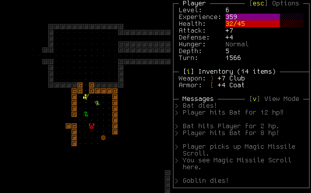

+++
title = "This Month in Rust GameDev #35 - June 2022"
transparent = true
date = 2022-07-03
draft = true
+++

<!-- no toc -->

<!-- Check the post with markdownlint-->

Welcome to the 35th issue of the Rust GameDev Workgroup's
monthly newsletter.
[Rust] is a systems language pursuing the trifecta:
safety, concurrency, and speed.
These goals are well-aligned with game development.
We hope to build an inviting ecosystem for anyone wishing
to use Rust in their development process!
Want to get involved? [Join the Rust GameDev working group!][join]

You can follow the newsletter creation process
by watching [the coordination issues][coordination].
Want something mentioned in the next newsletter?
[Send us a pull request][pr].
Feel free to send PRs about your own projects!

[Rust]: https://rust-lang.org
[join]: https://github.com/rust-gamedev/wg#join-the-fun
[pr]: https://github.com/rust-gamedev/rust-gamedev.github.io
[coordination]: https://github.com/rust-gamedev/rust-gamedev.github.io/issues?q=label%3Acoordination
[Rust]: https://rust-lang.org
[join]: https://github.com/rust-gamedev/wg#join-the-fun

- [Game Updates](#game-updates)
- [Learning Material Updates](#learning-material-updates)
- [Engine Updates](#engine-updates)
- [Tooling Updates](#tooling-updates)
- [Library Updates](#library-updates)
- [Other News](#other-news)
- [Popular Workgroup Issues in Github](#popular-workgroup-issues-in-github)
- [Discussions](#discussions)
- [Requests for Contribution](#requests-for-contribution)
- [Jobs](#jobs)
- [Bonus](#bonus)

<!--
Ideal section structure is:

```
### [Title]


_image caption_

A paragraph or two with a summary and [useful links].

_Discussions:
[/r/rust](https://reddit.com/r/rust/todo),
[twitter](https://twitter.com/todo/status/123456)_

[Title]: https://first.link
[useful links]: https://other.link
```

If needed, a section can be split into subsections with a "------" delimiter.
-->

## Game Updates

### [RuggRogue]



[RuggRogue] by [@tung] is a simple web-playable roguelike, inspired by the
[Rust Roguelike Tutorial] and made using Rust and SDL.
It can be played natively on Windows and Linux,
and in the browser thanks to Emscripten.

Features:

- Discover new monsters and equipment the deeper you go.
- Hunger and regeneration: stay fed and stay healed!
- Choose between graphical tiles and ASCII display.
- Menu-based UI with hot keys.
- Auto-run to quickly follow corridors and cross open space.
- Save and load system.
- New Game Plus mode!

The source code is complemented by the
[RuggRogue Source Code Guide][ruggrogue-book],
a 23-chapter technical web book covering the ideas, algorithms and structure of
the code.

_Discussions:
[/r/rust_gamedev](https://reddit.com/r/rust_gamedev/comments/vluy7u/ruggrogue_a_simple_webplayable_roguelike_made/),
[/r/roguelikes](https://reddit.com/r/roguelikes/comments/vluuud/ruggrogue_a_simple_webplayable_roguelike_inspired/)_

[RuggRogue]: https://tung.github.io/ruggrogue/
[Rust Roguelike Tutorial]: https://bfnightly.bracketproductions.com/
[ruggrogue-book]: https://tung.github.io/ruggrogue/source-code-guide/
[@tung]: https://github.com/tung/

## Engine Updates

### [ggez] 0.8.0-rc0


[ggez] by [@icefoxen], [@nobbele] and [@PSteinhaus] is a cross-platform game
framework for making 2D games with minimum friction. It aims to implement an
API based on the LÖVE game framework.

This version has finally moved ggez away from pre-ll gfx and into the world
of [wgpu]! This hopefully means less bugs, greater stability and easier
maintainability at the cost of some low performance devices such as the
Raspberry Pi.

As for the user-facing API:

- Instead of module functions, you now have methods on sub-contexts, which
  look like `ctx.keyboard.is_key_pressed(key)`.
- You are now required to pass around an explicit canvas to draw onto.
- `DrawParam` now has a Z (aka layer) parameter, so you don't have to draw
  objects in order.
- Shaders are far easier to use, via normal Rust structs with a simple derive.

As this is a rather large update and a first release candidate, there are plenty
of bugs that are currently being fixed - please send us any issues you encounter
to their [issue tracker][ggez-issues]!

_Discussions: [/r/rust_gamedev](https://www.reddit.com/r/rust_gamedev/comments/v6a3kn/ggez_080rc0_is_out/)_

[ggez]: https://github.com/ggez/ggez
[@icefoxen]: https://github.com/icefoxen
[@nobbele]: https://github.com/nobbele
[@PSteinhaus]: https://github.com/PSteinhaus
[wgpu]: https://github.com/gfx-rs/wgpu
[ggez-issues]: https://github.com/ggez/ggez/issues

## Learning Material Updates

## Tooling Updates

## Library Updates

### [psf2]

[psf2] is a minimal, unopinionated, no-std parser for the v2
[PC Screen Font][psf2-format] bitmap font format.

PSF2 fonts are simple, compact, and readily available due to their use as Linux
console fonts. They are extremely fast to draw at their intended resolution,
making them a great choice to quickly get text on the screen, especially when a
low-resolution, fixed-width aesthetic is desired.

The psf2 crate parses font data, exposing font size, glyph lookup, and iterators
to traverse a glyph's bitmap for easy rendering. Due to its limited scope, it is
much smaller and faster than conventional text rasterizers, but cannot support
variable-width, anti-aliased, or shaped text.

[psf2]: https://github.com/Ralith/psf2
[psf2-format]: https://www.win.tue.nl/~aeb/linux/kbd/font-formats-1.html

## Popular Workgroup Issues in Github

<!-- Up to 10 links to interesting issues -->

## Other News

<!-- One-liners for plan items that haven't got their own sections. -->

## Discussions

<!-- Links to handpicked reddit/twitter/urlo/etc threads that provide
useful information -->

## Requests for Contribution

<!-- Links to "good first issue"-labels or direct links to specific tasks -->

## Jobs

<!-- An optional section for new jobs related to Rust gamedev -->

## Bonus

<!-- Bonus section to make the newsletter more interesting
and highlight events from the past. -->

------

That's all news for today, thanks for reading!

Want something mentioned in the next newsletter?
[Send us a pull request][pr].

Also, subscribe to [@rust_gamedev on Twitter][@rust_gamedev]
or [/r/rust_gamedev subreddit][/r/rust_gamedev] if you want to receive fresh news!

<!--
TODO: Add real links and un-comment once this post is published
**Discuss this post on**:
[/r/rust_gamedev](TODO),
[Twitter](TODO),
[Discord](https://discord.gg/yNtPTb2).
-->

[/r/rust_gamedev]: https://reddit.com/r/rust_gamedev
[@rust_gamedev]: https://twitter.com/rust_gamedev
[pr]: https://github.com/rust-gamedev/rust-gamedev.github.io
