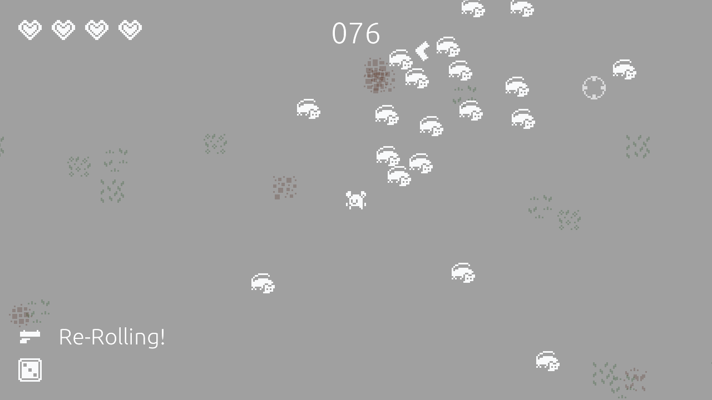
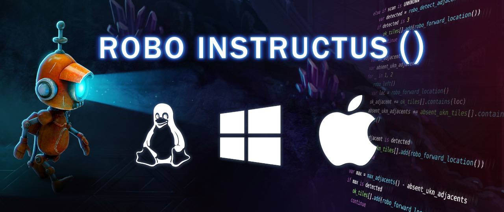
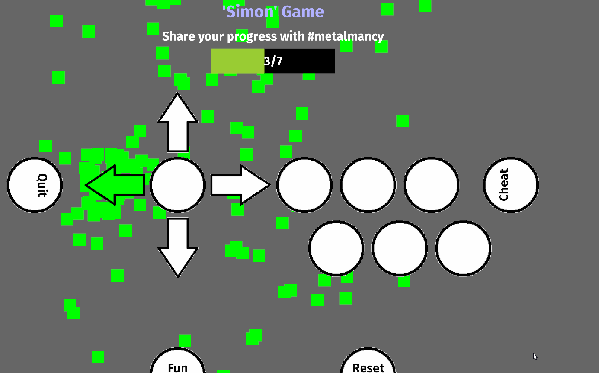
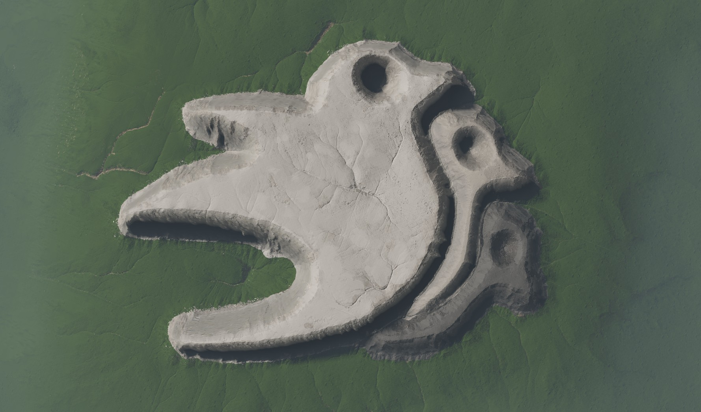
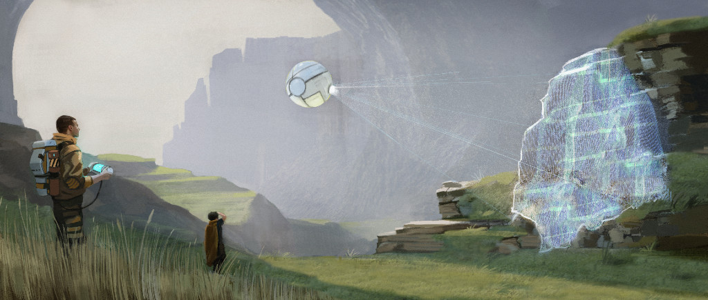
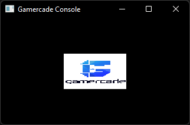
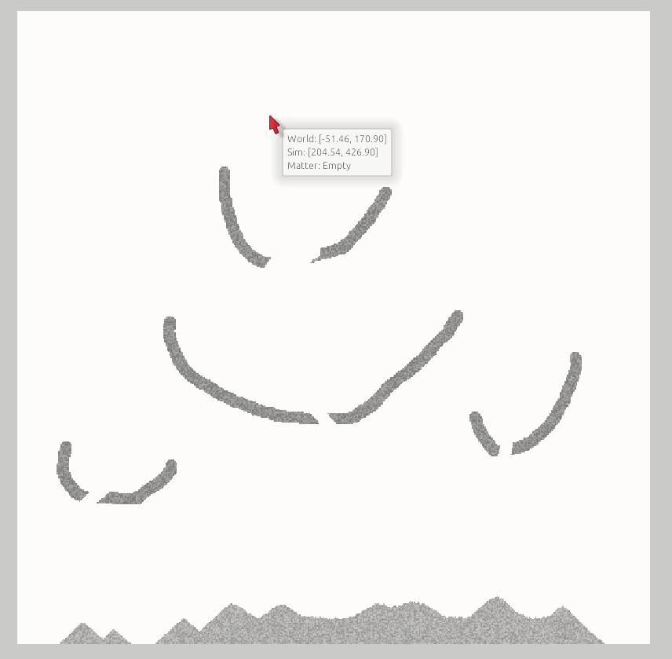
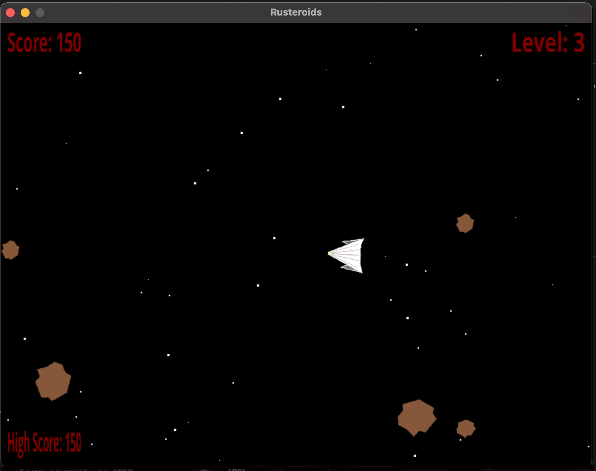
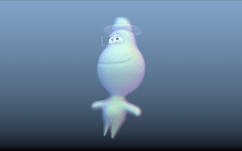
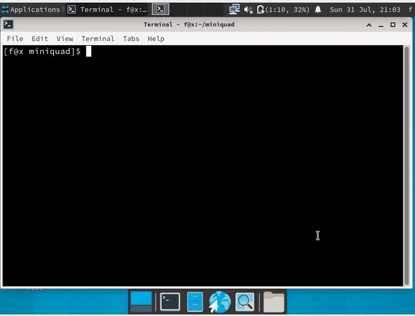

+++
title = "This Month in Rust GameDev #36 - July 2022"
transparent = true
date = 2022-08-01
draft = true
+++

<!-- no toc -->

<!-- Check the post with markdownlint-->

Welcome to the 36th issue of the Rust GameDev Workgroup's
monthly newsletter.
[Rust] is a systems language pursuing the trifecta:
safety, concurrency, and speed.
These goals are well-aligned with game development.
We hope to build an inviting ecosystem for anyone wishing
to use Rust in their development process!
Want to get involved? [Join the Rust GameDev working group!][join]

You can follow the newsletter creation process
by watching [the coordination issues][coordination].
Want something mentioned in the next newsletter?
[Send us a pull request][pr].
Feel free to send PRs about your own projects!

[Rust]: https://rust-lang.org
[join]: https://github.com/rust-gamedev/wg#join-the-fun
[pr]: https://github.com/rust-gamedev/rust-gamedev.github.io
[coordination]: https://github.com/rust-gamedev/rust-gamedev.github.io/issues?q=label%3Acoordination
[Rust]: https://rust-lang.org
[join]: https://github.com/rust-gamedev/wg#join-the-fun

- [Game Updates](#game-updates)
- [Learning Material Updates](#learning-material-updates)
- [Engine Updates](#engine-updates)
- [Tooling Updates](#tooling-updates)
- [Library Updates](#library-updates)
- [Other News](#other-news)
- [Popular Workgroup Issues in Github](#popular-workgroup-issues-in-github)
- [Meeting Minutes](#meeting-minutes)
- [Discussions](#discussions)
- [Requests for Contribution](#requests-for-contribution)
- [Jobs](#jobs)
- [Bonus](#bonus)

<!--
Ideal section structure is:

```
### [Title]


_image caption_

A paragraph or two with a summary and [useful links].

_Discussions:
[/r/rust](https://reddit.com/r/rust/todo),
[twitter](https://twitter.com/todo/status/123456)_

[Title]: https://first.link
[useful links]: https://other.link
```

If needed, a section can be split into subsections with a "------" delimiter.
-->

## Game Updates

### [Way of Rhea][wor]

[][wor]

[Way of Rhea][wor] is a puzzle adventure with hard puzzles and forgiving
mechanics being produced by [@masonremaley][wor-mason-remaley] in a custom Rust
engine. You can support development by
[checking out the free demo and wishlisting on Steam][wor]!

Way of Rhea was selected to be part of [PAX Rising online][wor-pax-rising]! It
was also shown off in the June [Steam Game Festival][wor-steam-game-fest].
Other recent updates:

- Kotaku mentioned Way of Rhea in an article about
  [fascinating upcoming indie games][wor-kotaku]
- [Lost In Cult][wor-lic], a gaming journal, announced [preorders][wor-lic-pre] for
  a new edition of Lock On containing a card game containing a card with a character
  from Way of Rhea featured
- Mason posted a video interview covering [why he became an indie dev][wor-interview],
  among other things
- Work has begun on puzzles for the final level of the game. This area combines the
  puzzle elements from all previous biomes for a final set of challenging puzzles.
- A weather system with [rain][wor-rain] and [snow][wor-snow] was added to the game
- More progress was made on the unreleased Linux platform layer
- More wildlife was added to the game
- Some logging and editor improvements were made

[wor]: https://store.steampowered.com/app/1110620/Way_of_Rhea/?utm_campaign=tmirgd&utm_source=n36
[wor-pax-rising]: https://store.steampowered.com/sale/PAXRisingOnline
[wor-steam-game-fest]: https://store.steampowered.com/sale/nextfest_june2022
[wor-kotaku]: https://kotaku.com/steam-indie-games-pc-wishlist-arctic-awakening-1849140770
[wor-mason-remaley]: https://twitter.com/masonremaley
[wor-forum]: https://steamcommunity.com/app/1110620/discussions/0/3275817732933009791/
[wor-rain]: https://twitter.com/AnthropicSt/status/1546207348259266560
[wor-snow]: https://twitter.com/AnthropicSt/status/1546320074923024384
[wor-lic]: https://www.lostincult.co.uk/
[wor-lic-pre]: https://www.lostincult.co.uk/?aff=18
[wor-interview]: https://youtu.be/H0sIsrLWojs

### Flesh


_3rd area_

[Flesh] by [@im_oab] is a 2D-horizontal shmup game with hand-drawn animation and
an organic/fleshy theme. It is implemented using [Tetra]. This month's updates
include:

- The game has BGM.
- Support global leaderboard.
- Integrate steam SDK using [steamworks] crate.
- Add new enemy types for the 3rd area.
- Add squeezing effect when the enemy gets hit.

[Flesh]: https://store.steampowered.com/app/1660850/Flesh/
[@im_oab]: https://twitter.com/im_oab
[Tetra]: https://github.com/17cupsofcoffee/tetra
[steamworks]: https://crates.io/crates/steamworks

### [CyberGate][cybergate-yt]


_The server and clients are able to smoothly handle
over a thousand balls rained from above_

CyberGate ([YouTube][cybergate-yt], [Discord][cybergate-dis]) by CyberSoul
is a new multiplayer project that aims at procedurally generating distinct
universes and gameplay experiences. CyberGate is the name of the main world
where universes can be created and accessed by quantum portals.

Recent updates:

- Bandwidth became 16 times smaller by implementing entity prioritization
  \+ other techniques.
- Interpolation and Jitter prediction makes entities way smoother.
- Automatic and Reliable Spawn and Despawn of entities.
- Many other features and optimizations to do with rapier 3d physics,
  wgpu renderer and quinn (quic) protocol.

[Join the Discord server][cybergate-dis] to participate in tests.

_Discussions: [/r/rust_gamedev](https://reddit.com/r/rust_gamedev/comments/vy7vms/multiplayer_stress_test_1_million_balls)_

[cybergate-yt]: https://youtube.com/channel/UClrsOso3Xk2vBWqcsHC3Z4Q
[cybergate-dis]: https://discord.gg/R7DkHqw7zJ

### [Botnet]


[Botnet] is an upcoming programming-based multiplayer game, where you write
scripts (compiled to WebAssembly) to control robots. Coordinate your network
of bots to gather resources, build new industry, and expand your control of
the server!

This month was primarily spent on BotnetReplayViewer - a visual program to
watch matches, and inspect entity data.

Additionally, the antenna structure was added. Building an antenna gives you
control over the bay (room) it's in, letting you build additional structures,
and increasing the total number of bots you can control. Bots can also use
antennas to store resources.

Interested in contributing? Head over to the
[github discussion page][botnet_ideas] and suggest some ideas!

[Botnet]: https://github.com/JMS55/botnet
[botnet_ideas]: https://github.com/JMS55/botnet/discussions/categories/ideas

### [Re-Rolling!]



[Re-Rolling!] by [@mystalice](https://twitter.com/mystalice) is a top-down 2D
survival shooter where you fight off a horde of rats using weapons you randomly
rolled.

The game was created for [GMTK Jam 2022][rr_gmtk2022] in 48 hours and was
heavily inspired by [20 Minutes Till Dawn][rr_20minutes].

Re-Rolling! was made with Bevy using heron for physics, bevy_egui for in-game
UI, and a handful of other helpful crates and plugins. You can browse the source
on [GitHub][rr_github].

[Re-Rolling!]: https://mystal.itch.io/re-rolling
[rr_gmtk2022]: https://itch.io/jam/gmtk-jam-2022
[rr_20minutes]: https://store.steampowered.com/app/1966900/20_Minutes_Till_Dawn/
[rr_github]: https://github.com/mystal/re-rolling

### [Robo Instructus: 3 Years Old][robo-3]



In 2019 the programming puzzler [Robo Instructus][robo-site] released on
[Steam][robo-steam] & [itch.io][robo-itch].

This month [Alex Butler][alex-butler] wrote ["Robo Instructus: 3 Years Old"][robo-3]
about how well the game did in the last year & to date: Sales by
platform/country/OS, player feedback, reviews & game updates.

[robo-site]: https://www.roboinstruct.us
[robo-steam]: https://store.steampowered.com/app/1032170/Robo_Instructus
[robo-itch]: https://bigabgames.itch.io/robo-instructus
[alex-butler]: https://twitter.com/bigabgames
[robo-3]: https://blog.roboinstruct.us/2022/07/16/3-years-old.html

### [Simon Arcade]


_a Simon Arcade gameplay with cheats enabled_

Based on [Simon (Original)], made with [Bevy],
the goal of this game is to push buttons in the correct order,
in an ever-increasing sequence.

This game was made to fit with the [Rust Arcade Cabinet]
and was showcased at [RustConf Portland] on August 5th 2022.

[Simon Arcade]: https://github.com/Vrixyz/simon
[Simon (Original)]: https://en.wikipedia.org/wiki/Simon_(game)
[Rust Arcade Cabinet]: https://github.com/rust-arcade/bevy-rust-arcade
[RustConf Portland]: https://rustconf.com
[Bevy]: https://bevyengine.org

## Engine Updates

### [Bevy v0.8][bevy-blog]


_Bevy-shaped mountains in a Bevy-based Witcher 3 terrain texturing tool built by
rmemr_

[Bevy][bevy] is a refreshingly simple data-driven game engine built in Rust. It
is [free and open source][bevy-git] forever!

Bevy 0.8 was a massive community effort. You can check out the [full release
blog post here][bevy-blog], but here are some highlights:

- [New Material System][bevy-materials]
- [Camera-driven Rendering][bevy-camera]
- [Built-in Shader Modularization][bevy-shader-mod]
- [Spot Lights][bevy-spotlights]
- [Visibility Inheritance][bevy-visibility]
- [Upgraded to wgpu 0.13][bevy-wgpu]
- [Automatic Mesh Tangent Generation][bevy-tangent]
- [Renderer Optimizations][bevy-render-opt]
- [Scene Bundle][bevy-scene]
- [Scripting / Modding Progress][bevy-scripting]
- [ECS Query Ergonomics and Usability][bevy-ecs-ergo]
- [ECS Internals Refactors][bevy-refactors]
- [Reflection Improvements][bevy-reflect]
- [Hierarchy Commands][bevy-hierarchy]
- [Bevy UI Now Uses Taffy][bevy-taffy]

_Discussions:
[/r/rust](https://www.reddit.com/r/rust/comments/wc0sqc/bevy_08/),
[Hacker News](https://news.ycombinator.com/item?id=32287828),
[Twitter](https://twitter.com/cart_cart/status/1553411157662187521)_

[bevy]: https://bevyengine.org
[bevy-git]: https://github.com/bevyengine/bevy
[bevy-blog]: https://bevyengine.org/news/bevy-0-8
[bevy-materials]: https://bevyengine.org/news/bevy-0-8/#new-material-system
[bevy-camera]: https://bevyengine.org/news/bevy-0-8/#camera-driven-rendering
[bevy-spotlights]: https://bevyengine.org/news/bevy-0-8/#spotlights
[bevy-visibility]: https://bevyengine.org/news/bevy-0-8/#visibility-inheritance
[bevy-shader-mod]: https://bevyengine.org/news/bevy-0-8/#built-in-shader-modularization
[bevy-wgpu]: https://bevyengine.org/news/bevy-0-8/#wgpu-0-13-new-wgsl-shader-syntax
[bevy-tangent]: https://bevyengine.org/news/bevy-0-8/#automatic-mesh-tangent-generation
[bevy-render-opt]: https://bevyengine.org/news/bevy-0-8/#render-phase-sorting-optimization
[bevy-scene]: https://bevyengine.org/news/bevy-0-8/#scene-bundle
[bevy-scripting]: https://bevyengine.org/news/bevy-0-8/#scripting-modding-progress-untyped-ecs-apis
[bevy-ecs-ergo]: https://bevyengine.org/news/bevy-0-8/#query-intoiter
[bevy-refactors]: https://bevyengine.org/news/bevy-0-8/#ecs-lifetimed-pointers
[bevy-reflect]: https://bevyengine.org/news/bevy-0-8/#bevy-reflection-improvements
[bevy-hierarchy]: https://bevyengine.org/news/bevy-0-8/#hierarchy-commands
[bevy-taffy]: https://bevyengine.org/news/bevy-0-8/#taffy-migration-a-refreshed-ui-layout-library

### [Dims][dims-website]



[Dims][dims-website] ([Twitter][dims-twitter], [Discord][dims-discord],
[YouTube][dims-youtube]) is a pre-alpha collaborative open-world
creation platform.
Users can hop in sessions and build a game together, allowing everyone
to bring out their inner game-maker.

In July, development continued to make great strides. Some of the highlights
include:

- Continued work on the audio system, including in-game graphs of attenuation
  and other audio-related functions
- The introduction of an intent system that allows for user actions to be
  undone and replayed arbitrarily
- A complete UI facelift using Material UI icons and a new design language
- A new scripting system using WebAssembly + WASI and Rust as a guest language
  (look forward to an article on this soon!)
- The beginnings of a shared asset database that lets you and your team easily
  share assets amongst each other and with other projects
- Various infrastructural and rendering fixes, including more accurate PBR

Want to try Dims out for yourself? Come join the [Discord][dims-discord] to be
notified of future public tests, see the latest features before everyone else,
and to talk to the devs personally.

[dims-website]: https://dims.co
[dims-twitter]: https://twitter.com/DimsWorlds
[dims-discord]: https://discord.gg/Z5CAVmNE57
[dims-youtube]: https://youtube.com/channel/UCR5gOwS7uSl0a0dl7MLQoqg

### [godot-rust][gd-github]


godot-rust ([GitHub][gd-github], [Discord][gd-discord], [Twitter][gd-twitter])
is a Rust library that provides bindings for the Godot game engine.

The last few months have been a bit quieter around godot-rust. A lot of this
can be attributed to developers exploring the [GDExtension API][gd-gdext], the
successor of GDNative for Godot 4. At this point, a lot of the foundation is
still being built, however some more concrete plans are outlined in
[#824][gd-824]. Further updates will be posted in that issue or on Twitter.

Nevertheless, several improvements have been integrated to godot-rust since
0.10, with [version 0.10.1 on the horizon][gd-907]. Some notable examples:

- GDScript utility functions like `lerp`, `ease` or `linear2db` ([#901][gd-901])
- Property support for standard collection types ([#883][gd-883])
- Methods for `Rect2` and `Aabb` ([#867][gd-867])

[gd-824]: https://github.com/godot-rust/godot-rust/issues/824
[gd-883]: https://github.com/godot-rust/godot-rust/issues/883
[gd-867]: https://github.com/godot-rust/godot-rust/issues/867
[gd-901]: https://github.com/godot-rust/godot-rust/issues/901
[gd-907]: https://github.com/godot-rust/godot-rust/issues/907
[gd-github]: https://github.com/godot-rust/godot-rust
[gd-discord]: https://discord.com/invite/FNudpBD
[gd-twitter]: https://twitter.com/GodotRust
[gd-gdext]: https://godotengine.org/article/introducing-gd-extensions

### [Gamercade]


_WASM 3d CPU Rendering On a 2d Fantasy Console?_

[Gamercade] ([Discord][Gamercade-Discord], [Github][Gamercade-Github])
by @RobDavenport is a WASM powered fantasy console focused
on building multiplayer neo-retro games.

After over half a year in development, Gamercade and related tools are ready
for pre-alpha testing. This includes the [console](Gamercade-Console) itself,
as well as the [editor](Gamercade-Editor).

Gamercade's killer feature is ease of developing multiplayer games.
The console is able to simplify networked game development process
in the best way possible: build a local multiplayer game, and get full online
play for free!

The WASM Api features powerful but simple built-in features like input,
2d graphics, random number generation, and more. Limitations do exist, but are
flexible, such as resolutions up to 1920 x 1080, and a maximum of 256 color
palettes with up to 64 colors each.

The community around the project is small, but is looking to expand.
Come on over to the [subreddit](Gamercade-Subreddit), or hang out and chat
on [Discord](Gamercade-Discord), where the developers interact with members
and post updates daily. The project is newly [open source](Gamercade-Github)
and looking for contributors, suggestions, as well as awesome game demos.

_Discussions:
[/r/rust_gamedev](https://reddit.com/r/rust_gamedev/comments/w8idew/announcing_gamercade_a_new_wasm_powered_fantasy),
[/r/fantasyconsoles](https://reddit.com/r/fantasyconsoles/comments/w8ics8/announcing_gamercade_a_new_wasm_powered_fantasy)_

[Gamercade]: https://gamercade.io
[Gamercade-Console]: https://github.com/gamercade-io/gamercade_console
[Gamercade-Editor]: https://github.com/gamercade-io/gamercade_editor
[Gamercade-Discord]: https://discord.gg/Qafv2Fpt5j
[Gamercade-Github]: https://github.com/gamercade-io

## Learning Material Updates

### [Sand Fall With Compute Shaders in Rust]


_Drawing Sand_

[@hakolao](https://github.com/hakolao) published a
[tutorial](https://www.okkohakola.com/posts/sandfall_tutorial/) about creating
[cellular automata](https://en.wikipedia.org/wiki/Conway%27s_Game_of_Life)
sand fall simulations with compute shaders.

Typically, cellular automata sand fall is done with the CPU due to the two way
relationship between the cells on a grid. This article shows a way to tackle
sand fall creation using compute shaders to achieve massive parallelism.

Additional to compute shaders, this tutorial is a great introduction to the
[Vulkano](https://github.com/vulkano-rs/vulkano) library. It also works as a
good base for learning how to create simple graphics pipelines. You will also
get to use Bevy and Egui.

Discussion: [/r/rust_gamedev](https://www.reddit.com/r/rust_gamedev/comments/vmynrq/sand_fall_with_compute_shaders_in_rust/)

[sand fall with compute shaders in rust]: https://www.okkohakola.com/posts/sandfall_tutorial/

### Pathfinding in Rust


[Pathfinding in Rust: A tutorial with examples](https://blog.logrocket.com/pathfinding-rust-tutorial-examples)
is an article with examples of how to use the [`pathfinding`](https://crates.io/crates/pathfinding)
crate to do breadth-first, Dijkstra's, and A* search. It links to the
[gregstoll/rust-pathfinding](https://github.com/gregstoll/rust-pathfinding)
repo which has working code for all of these.

### [Creating mountains from planes with vertex shaders and Bevy][chrisbiscardi-vid1]

[][chrisbiscardi-vid1]
_Creating mountains from planes with vertex shaders and Bevy_

[@chrisbiscardi] published a [video][chrisbiscardi-vid1]
about using the new Material shader APIs in Bevy 0.8 to transform the
vertex positions in a custom mesh plane using a vertex shader.

_Discussions: [Twitter](https://twitter.com/chrisbiscardi/status/1549089599971938304)_

[chrisbiscardi-vid1]: https://youtube.com/watch?v=85uJc81SQZ4
[@chrisbiscardi]: https://twitter.com/chrisbiscardi

### [What's in a wgsl fragment shader? ft Bevy][chrisbiscardi-vid2]

[][chrisbiscardi-vid2]
_What's in a wgsl fragment shader? ft Bevy_

[@chrisbiscardi] published a [video][chrisbiscardi-vid2]
that introduces the new Material APIs in Bevy 0.8. It covers AsBindGroup,
uniforms, and using Perlin Noise in a fragment shader to render different
colors onto a cube in a variety of ways.

_Discussions: [Twitter](https://twitter.com/chrisbiscardi/status/1546909993726726144)_

[chrisbiscardi-vid2]: https://youtube.com/watch?v=SOOOc9-joVo
[@chrisbiscardi]: https://twitter.com/chrisbiscardi

### [Rusteroids][rusteroids-youtube-playlist]



[Rusteroids][rusteroids-github] is a tutorial recreating a clone of Asteroids
in Rust, using SDL2 and the [Specs][rust-specs-crate] library.

New episodes are released weekly and added to the playlist. The most
recent video shows how to safely create global state to store global values,
such as the high score. The most recent code has been released for Windows, on
[Itch.io][itch-io] (with other platforms coming soon).

You can subscribe to the [YouTube Channel][electrocat-youtube],
to never miss an episode, or follow [@ecatstudios][ecatstudios-twitter] on
Twitter!

[rusteroids-youtube-playlist]: https://youtube.com/playlist?list=PLFOS-Gn3aXROnSfl26esPExssd-rQw6jD
[rusteroids-github]: https://github.com/filtoid/rusteroids
[rust-specs-crate]: https://docs.rs/specs/latest/specs/
[itch-io]: https://filtoid.itch.io/rusteroids
[electrocat-youtube]: https://youtube.com/channel/UC1m6P72nySpB3lKWDYGVipw
[ecatstudios-twitter]: https://twitter.com/ecatstudios

## Tooling Updates

### [NES Bundler][nes-bundler]


_NES Bundler in action_

[NES Bundler][nes-bundler] by [@tedsteen].
Did you make a NES-game but none of your friends own a Nintendo? Don't worry.
Put your ROM and configuration in NES Bundler and build an executable for Mac,
Windows or Linux. What you get is a single executable with

- Simple UI for settings
- Re-mappable Keyboard and Gamepad input (you bundle your default mappings).
- Save/Restore state
- Netplay!

It's early days, but the key features are there and work is ongoing
to make it more mature!

[nes-bundler]: https://github.com/tedsteen/nes-bundler
[@tedsteen]: https://github.com/tedsteen

### [Blackjack]


[Blackjack] by @setzer22 is a new procedural modeling application made in Rust,
using rend3, wgpu, and egui. It follows the steps of applications like
Houdini, or Blender's geometry nodes project and provides a node-based
environment to compose procedural recipes to create 3d models.

The focus for the past few months has been into evolving Blackjack from a proof
of concept into a usable application. It's current status is not yet production
ready, but it can now be used to build complex procedural models editable inside
a game engine thanks to its new engine integration system.

Some of the new features include:

- A better data model for meshes, based on groups and channels.
- Game engine integration with Godot, more engines coming soon.
- Introduce Lua as an extension language.
- Add *many* new nodes: Extrude along curve, Copy to points...
- Add experimental support for L-Systems.
- Reworked Look & Feel

A talk about Blackjack's vision and a tour of its features was shared at the
start of July in the [Rust gamedev meetup][blackjack-talk-yt]. Interested
developers are encouraged to [check the project out on GitHub][Blackjack] and
post on the Discussion boards!

[Blackjack]: https://github.com/setzer22/blackjack
[blackjack-talk-yt]: https://onrendering.com/data/papers/catmark/HalfedgeCatmullClark.pdf

### [bevy_shadertoy_wgsl] and [GLSL2WGSL]



[bevy_shadertoy_wgsl] is a [Shadertoy] clone for the Bevy game engine,
where the GLSL shader language is replaced by WGSL. It already comes
with a dozen examples and plenty more to go. Feel free to add your own
shaders to the list!

Plus, [GLSL2WGSL] is a new translator tool that should help migrate the
vast majority of GLSL code to WGSL.

The above GIF showcases the new additions to the examples for
[bevy_shadertoy_wgsl]: two shaders originally written in [Shadertoy] by
[@leondenise], and translated to WGSL with the help of [GLSL2WGSL].
The first part is a reproduction of Joe Gardner from the movie Soul,
and the second part is a lightweight fluid shader.

[bevy_shadertoy_wgsl]: https://github.com/eliotbo/bevy_shadertoy_wgsl
[Shadertoy]: https://www.shadertoy.com
[GLSL2WGSL]: https://eliotbo.github.io/glsl2wgsl/
[@leondenise]: https://twitter.com/leondenise

## Library Updates

### [hecs]

[hecs] is a fast, lightweight, and unopinionated archetypal ECS library.

[Version 0.8][hecs-changelog] marks a breaking change to most methods that
previously took a generic type parameter `T: Component`, replacing them with
methods taking type parameters which must be *references to* component types
instead. This resolves a long-standing footgun where users accustomed to writing
`&T` in queries might write `world.get::<&T>`, interpreted by rustc as
referencing the valid component type `&'static T`, resulting in code that
compiles but fails to access the intended component.

[hecs]: https://github.com/Ralith/hecs
[hecs-changelog]: https://github.com/Ralith/hecs/blob/master/CHANGELOG.md#080

### [bevy_mod_wanderlust]

[bevy_mod_wanderlust]
([GitHub](https://github.com/PROMETHIA-27/bevy_mod_wanderlust)) by
[@PROMETHIA-27] is a character controller plugin for Bevy engine.

Inspired by [this excellent video](https://www.youtube.com/watch?v=qdskE8PJy6Q),
it is implemented on top of [Rapier physics](https://rapier.rs/) and highly
customizable. Wanderlust includes a variety of settings to target many different
character controller types, including 2D/3D platformers, spacecraft, and
first/third person games.

[bevy_mod_wanderlust]: https://crates.io/crates/bevy_mod_wanderlust

### [Lyon]


[Lyon] ([GitHub](https://github.com/nical/lyon)) by [Nical](https://github.com/nical)
is a collection of crates providing various 2D vector graphics utilities, including
fast tessellation algorithms, easy to integrate in typical GPU accelerated rendering
engines.

Lyon made its symbolic [`1.0.0` release](https://crates.io/crates/lyon/1.0.0)
reflecting the stability of the project. Highlights in this release include:

- Initial support for variable line width in the stroke tessellator.
- An efficient algorithm to query positions at given distances along a path.
- Improved support for specifying custom endpoint attributes in paths and algorithms.
- And more. You can read the [announcement blog post here](https://nical.github.io/posts/lyon-1-0.html).

_Discussions: [/r/rust](https://reddit.com/r/rust/comments/vwdxim/announcing_lyon_100),
[Twitter](https://twitter.com/nicalsilva/status/1546424285442473987?s=20&t=S1fXSoh2zWHbfTImCGYpPQ)_

[Lyon]: https://github.com/nical/lyon

### [Renet]


*Demo using renet and bevy*

[Renet] by [@lucaspoffo] is a network library to create
games with the Server-Client architecture.

Built on top of UDP, it has its own protocol to send and receive reliable messages
more suited for fast-paced games than TCP. Some other features are:

- Connection management
- Authentication and encrypted connections
- Communication through multiple types of channels:
  - Reliable Ordered: guarantee ordering and delivery of all messages
  - Unreliable Unordered: no guarantee of delivery or ordering of messages
  - Block Reliable: for bigger messages, such as level initialization
- Packet fragmentation and reassembly

Renet comes with [bevy_renet], a plugin for the Bevy engine, and also with
[renet_visualizer], an egui interface to visualize network metrics.

[Renet]: https://github.com/lucaspoffo/renet
[@lucaspoffo]: https://github.com/lucaspoffo
[bevy_renet]: https://github.com/lucaspoffo/renet/tree/master/bevy_renet
[renet_visualizer]: https://github.com/lucaspoffo/renet/tree/master/renet_visualizer

### [miniquad]


*VirtualBox, gl2 as the only GPU accelaration available*

[miniquad] is a safe and cross-platform rendering library
focused on portability and low-end platform support.

This month [OpenGl 2.1/GLESv2][gl2pr] PR got merged, adding support for old
android phones, virtual machines, and just old computers.

While the PR itself is quite small, it solved a very old design issue:
[compatibilities proposal][mqcompat]. Fixing this issue opened the door for
both lower-end backends, like gl1, and higher-level backends. Metal being the
next in line.

[miniquad]: https://github.com/not-fl3/miniquad/
[gl2pr]: https://github.com/not-fl3/miniquad/pull/305
[mqcompat]: https://github.com/not-fl3/miniquad/pull/176

### [bevy_fbx]


_model courtesy of [Samuel Rosario], rendered in bevy_

[bevy_fbx] is a pre-alpha library to load FBX (Autodesk Filmbox) files
into [bevy] 0.8, based on [fbxcel-dom].
It currently:

- Loads geometry and meshes
- Loads mesh attributes such as color
- Loads default material diffuse textures, normal maps and emissive maps
- Loads the custom Maya PBR materials, including all material textures
- Load the scene tree and translate it to bevy's hierarchy

Planned features include providing a basic Lambert/Phong shader
to better handle more standard materials,
loading animations and skinned mesh skeletons/rigs.

The project is poorly tested and is looking for testers. It will soon be
available on crates.io.

[fbxcel-dom]: https://lib.rs/crates/fbxcel-dom
[bevy]: https://bevyengine.org/
[bevy_fbx]: https://github.com/HeavyRain266/bevy_fbx
[Samuel Rosario]: https://www.artstation.com/artwork/bKJ0EE

## Popular Workgroup Issues in Github

<!-- Up to 10 links to interesting issues -->

## Other News

<!-- One-liners for plan items that haven't got their own sections. -->

## Meeting Minutes

<!-- Up to 10 most important notes + a link to the full details -->

[See all meeting issues][label_meeting] including full text notes
or [join the next meeting][join].

[label_meeting]: https://github.com/rust-gamedev/wg/issues?q=label%3Ameeting

## Discussions

<!-- Links to handpicked reddit/twitter/urlo/etc threads that provide
useful information -->

## Requests for Contribution

<!-- Links to "good first issue"-labels or direct links to specific tasks -->

## Jobs

<!-- An optional section for new jobs related to Rust gamedev -->

## Bonus

<!-- Bonus section to make the newsletter more interesting
and highlight events from the past. -->

------

That's all news for today, thanks for reading!

Want something mentioned in the next newsletter?
[Send us a pull request][pr].

Also, subscribe to [@rust_gamedev on Twitter][@rust_gamedev]
or [/r/rust_gamedev subreddit][/r/rust_gamedev] if you want to receive fresh news!

<!--
TODO: Add real links and un-comment once this post is published
**Discuss this post on**:
[/r/rust_gamedev](TODO),
[Twitter](TODO),
[Discord](https://discord.gg/yNtPTb2).
-->

[/r/rust_gamedev]: https://reddit.com/r/rust_gamedev
[@rust_gamedev]: https://twitter.com/rust_gamedev
[pr]: https://github.com/rust-gamedev/rust-gamedev.github.io
