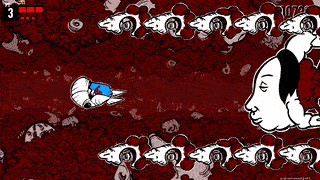
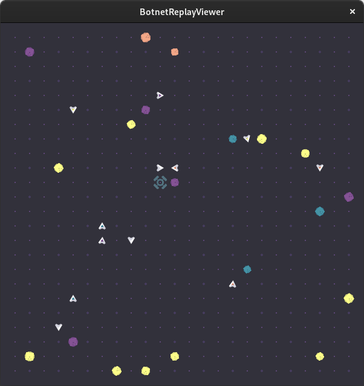
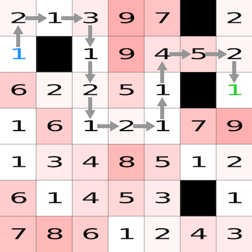
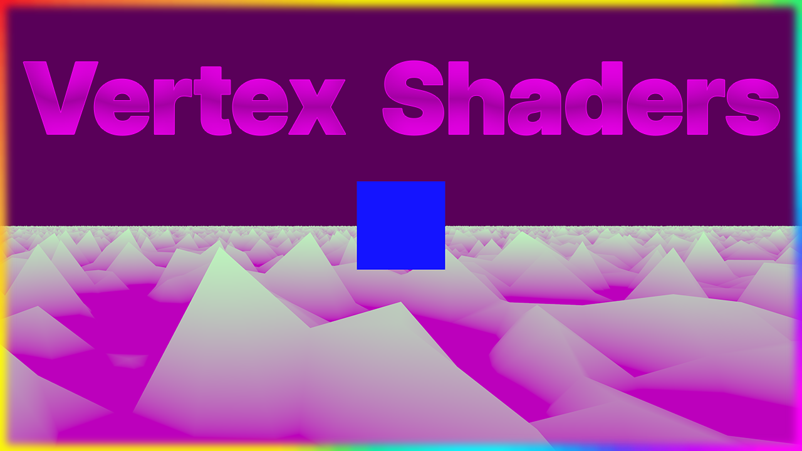
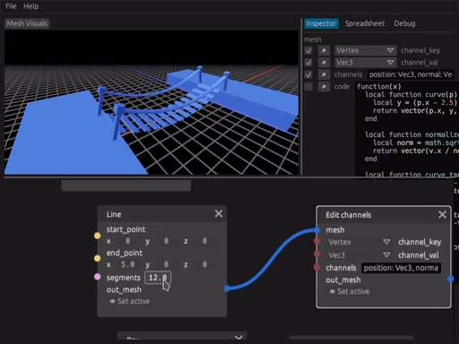
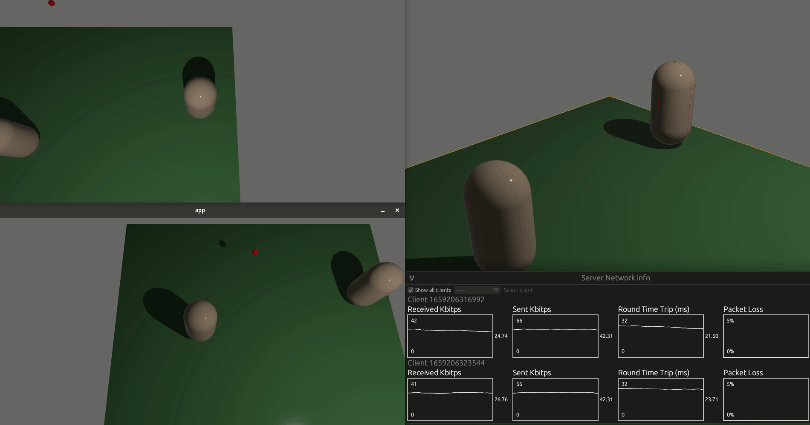

+++
title = "This Month in Rust GameDev #36 - July 2022"
transparent = true
date = 2022-08-01
draft = true
+++

<!-- no toc -->

<!-- Check the post with markdownlint-->

Welcome to the 36th issue of the Rust GameDev Workgroup's
monthly newsletter.
[Rust] is a systems language pursuing the trifecta:
safety, concurrency, and speed.
These goals are well-aligned with game development.
We hope to build an inviting ecosystem for anyone wishing
to use Rust in their development process!
Want to get involved? [Join the Rust GameDev working group!][join]

You can follow the newsletter creation process
by watching [the coordination issues][coordination].
Want something mentioned in the next newsletter?
[Send us a pull request][pr].
Feel free to send PRs about your own projects!

[Rust]: https://rust-lang.org
[join]: https://github.com/rust-gamedev/wg#join-the-fun
[pr]: https://github.com/rust-gamedev/rust-gamedev.github.io
[coordination]: https://github.com/rust-gamedev/rust-gamedev.github.io/issues?q=label%3Acoordination
[Rust]: https://rust-lang.org
[join]: https://github.com/rust-gamedev/wg#join-the-fun

- [Game Updates](#game-updates)
- [Learning Material Updates](#learning-material-updates)
- [Engine Updates](#engine-updates)
- [Tooling Updates](#tooling-updates)
- [Library Updates](#library-updates)
- [Other News](#other-news)
- [Popular Workgroup Issues in Github](#popular-workgroup-issues-in-github)
- [Meeting Minutes](#meeting-minutes)
- [Discussions](#discussions)
- [Requests for Contribution](#requests-for-contribution)
- [Jobs](#jobs)
- [Bonus](#bonus)

<!--
Ideal section structure is:

```
### [Title]


_image caption_

A paragraph or two with a summary and [useful links].

_Discussions:
[/r/rust](https://reddit.com/r/rust/todo),
[twitter](https://twitter.com/todo/status/123456)_

[Title]: https://first.link
[useful links]: https://other.link
```

If needed, a section can be split into subsections with a "------" delimiter.
-->

## Game Updates

### Flesh


_3rd area_

[Flesh] by [@im_oab] is a 2D-horizontal shmup game with hand-drawn animation and
an organic/fleshy theme. It is implemented using [Tetra]. This month's updates
include:

- The game has BGM.
- Support global leaderboard.
- Integrate steam SDK using [steamworks] crate.
- Add new enemy types for the 3rd area.
- Add squeezing effect when the enemy gets hit.

[Flesh]: https://store.steampowered.com/app/1660850/Flesh/
[@im_oab]: https://twitter.com/im_oab
[Tetra]: https://github.com/17cupsofcoffee/tetra
[steamworks]: https://crates.io/crates/steamworks

### [CyberGate][cybergate-yt]


_The server and clients are able to smoothly handle
over a thousand balls rained from above_

CyberGate ([YouTube][cybergate-yt], [Discord][cybergate-dis]) by CyberSoul
is a new multiplayer project that aims at procedurally generating distinct
universes and gameplay experiences. CyberGate is the name of the main world
where universes can be created and accessed by quantum portals.

Recent updates:

- Bandwidth became 16 times smaller by implementing entity prioritization
  \+ other techniques.
- Interpolation and Jitter prediction makes entities way smoother.
- Automatic and Reliable Spawn and Despawn of entities.
- Many other features and optimizations to do with rapier 3d physics,
  wgpu renderer and quinn (quic) protocol.

[Join the Discord server][cybergate-dis] to participate in tests.

_Discussions: [/r/rust_gamedev](https://reddit.com/r/rust_gamedev/comments/vy7vms/multiplayer_stress_test_1_million_balls)_

[cybergate-yt]: https://youtube.com/channel/UClrsOso3Xk2vBWqcsHC3Z4Q
[cybergate-dis]: https://discord.gg/R7DkHqw7zJ

### [Botnet]



[Botnet] is an upcoming programming-based multiplayer game, where you write
scripts (compiled to WebAssembly) to control robots. Coordinate your network
of bots to gather resources, build new industry, and expand your control of
the server!

This month was primarily spent on BotnetReplayViewer - a visual program to
watch matches, and inspect entity data.

Additionally, the antenna structure was added. Building an antenna gives you
control over the bay (room) it's in, letting you build additional structures,
and increasing the total number of bots you can control. Bots can also use
antennas to store resources.

Interested in contributing? Head over to the
[github discussion page][botnet_ideas] and suggest some ideas!

[Botnet]: https://github.com/JMS55/botnet
[botnet_ideas]: https://github.com/JMS55/botnet/discussions/categories/ideas

## Engine Updates

## Learning Material Updates

### Pathfinding in Rust



[Pathfinding in Rust: A tutorial with examples](https://blog.logrocket.com/pathfinding-rust-tutorial-examples)
is an article with examples of how to use the [`pathfinding`](https://crates.io/crates/pathfinding)
crate to do breadth-first, Dijkstra's, and A* search. It links to the
[gregstoll/rust-pathfinding](https://github.com/gregstoll/rust-pathfinding)
repo which has working code for all of these.

### [Creating mountains from planes with vertex shaders and Bevy][chrisbiscardi-vid1]

[][chrisbiscardi-vid1]
_Creating mountains from planes with vertex shaders and Bevy_

[@chrisbiscardi] published a [video][chrisbiscardi-vid1]
about using the new Material shader APIs in Bevy 0.8 to transform the
vertex positions in a custom mesh plane using a vertex shader.

_Discussions: [Twitter](https://twitter.com/chrisbiscardi/status/1549089599971938304)_

[chrisbiscardi-vid1]: https://youtube.com/watch?v=85uJc81SQZ4
[@chrisbiscardi]: https://twitter.com/chrisbiscardi

### [What's in a wgsl fragment shader? ft Bevy][chrisbiscardi-vid2]

[][chrisbiscardi-vid2]
_What's in a wgsl fragment shader? ft Bevy_

[@chrisbiscardi] published a [video][chrisbiscardi-vid2]
that introduces the new Material APIs in Bevy 0.8. It covers AsBindGroup,
uniforms, and using Perlin Noise in a fragment shader to render different
colors onto a cube in a variety of ways.

_Discussions: [Twitter](https://twitter.com/chrisbiscardi/status/1546909993726726144)_

[chrisbiscardi-vid2]: https://youtube.com/watch?v=SOOOc9-joVo
[@chrisbiscardi]: https://twitter.com/chrisbiscardi

## Tooling Updates

### [Blackjack]



[Blackjack] by @setzer22 is a new procedural modeling application made in Rust,
using rend3, wgpu, and egui. It follows the steps of applications like
Houdini, or Blender's geometry nodes project and provides a node-based
environment to compose procedural recipes to create 3d models.

The focus for the past few months has been into evolving Blackjack from a proof
of concept into a usable application. It's current status is not yet production
ready, but it can now be used to build complex procedural models editable inside
a game engine thanks to its new engine integration system.

Some of the new features include:

- A better data model for meshes, based on groups and channels.
- Game engine integration with Godot, more engines coming soon.
- Introduce Lua as an extension language.
- Add *many* new nodes: Extrude along curve, Copy to points...
- Add experimental support for L-Systems.
- Reworked Look & Feel

A talk about Blackjack's vision and a tour of its features was shared at the
start of July in the [Rust gamedev meetup][blackjack-talk-yt]. Interested
developers are encouraged to [check the project out on GitHub][Blackjack] and
post on the Discussion boards!

[Blackjack]: https://github.com/setzer22/blackjack
[blackjack-talk-yt]: https://onrendering.com/data/papers/catmark/HalfedgeCatmullClark.pdf

## Library Updates

### [hecs]

[hecs] is a fast, lightweight, and unopinionated archetypal ECS library.

[Version 0.8][hecs-changelog] marks a breaking change to most methods that
previously took a generic type parameter `T: Component`, replacing them with
methods taking type parameters which must be *references to* component types
instead. This resolves a long-standing footgun where users accustomed to writing
`&T` in queries might write `world.get::<&T>`, interpreted by rustc as
referencing the valid component type `&'static T`, resulting in code that
compiles but fails to access the intended component.

[hecs]: https://github.com/Ralith/hecs
[hecs-changelog]: https://github.com/Ralith/hecs/blob/master/CHANGELOG.md#080

### [bevy_mod_wanderlust]

[bevy_mod_wanderlust]
([GitHub](https://github.com/PROMETHIA-27/bevy_mod_wanderlust)) by
[@PROMETHIA-27] is a character controller plugin for Bevy engine.

Inspired by [this excellent video](https://www.youtube.com/watch?v=qdskE8PJy6Q),
it is implemented on top of [Rapier physics](https://rapier.rs/) and highly
customizable. Wanderlust includes a variety of settings to target many different
character controller types, including 2D/3D platformers, spacecraft, and
first/third person games.

[bevy_mod_wanderlust]: https://crates.io/crates/bevy_mod_wanderlust

### [Lyon]


[Lyon] ([GitHub](https://github.com/nical/lyon)) by [Nical](https://github.com/nical)
is a collection of crates providing various 2D vector graphics utilities, including
fast tessellation algorithms, easy to integrate in typical GPU accelerated rendering
engines.

Lyon made its symbolic [`1.0.0` release](https://crates.io/crates/lyon/1.0.0)
reflecting the stability of the project. Highlights in this release include:

- Initial support for variable line width in the stroke tessellator.
- An efficient algorithm to query positions at given distances along a path.
- Improved support for specifying custom endpoint attributes in paths and algorithms.
- And more. You can read the [announcement blog post here](https://nical.github.io/posts/lyon-1-0.html).

_Discussions: [/r/rust](https://reddit.com/r/rust/comments/vwdxim/announcing_lyon_100),
[Twitter](https://twitter.com/nicalsilva/status/1546424285442473987?s=20&t=S1fXSoh2zWHbfTImCGYpPQ)_

[Lyon]: https://github.com/nical/lyon

### [Renet]


*Demo using renet and bevy*

[Renet] by [@lucaspoffo] is a network library to create
games with the Server-Client architecture.

Built on top of UDP, it has its own protocol to send and receive reliable messages
more suited for fast-paced games than TCP. Some other features are:

- Connection management
- Authentication and encrypted connections
- Communication through multiple types of channels:
  - Reliable Ordered: guarantee ordering and delivery of all messages
  - Unreliable Unordered: no guarantee of delivery or ordering of messages
  - Block Reliable: for bigger messages, such as level initialization
- Packet fragmentation and reassembly

Renet comes with [bevy_renet], a plugin for the Bevy engine, and also with
[renet_visualizer], an egui interface to visualize network metrics.

[Renet]: https://github.com/lucaspoffo/renet
[@lucaspoffo]: https://github.com/lucaspoffo
[bevy_renet]: https://github.com/lucaspoffo/renet/tree/master/bevy_renet
[renet_visualizer]: https://github.com/lucaspoffo/renet/tree/master/renet_visualizer

## Popular Workgroup Issues in Github

<!-- Up to 10 links to interesting issues -->

## Other News

<!-- One-liners for plan items that haven't got their own sections. -->

## Meeting Minutes

<!-- Up to 10 most important notes + a link to the full details -->

[See all meeting issues][label_meeting] including full text notes
or [join the next meeting][join].

[label_meeting]: https://github.com/rust-gamedev/wg/issues?q=label%3Ameeting

## Discussions

<!-- Links to handpicked reddit/twitter/urlo/etc threads that provide
useful information -->

## Requests for Contribution

<!-- Links to "good first issue"-labels or direct links to specific tasks -->

## Jobs

<!-- An optional section for new jobs related to Rust gamedev -->

## Bonus

<!-- Bonus section to make the newsletter more interesting
and highlight events from the past. -->

------

That's all news for today, thanks for reading!

Want something mentioned in the next newsletter?
[Send us a pull request][pr].

Also, subscribe to [@rust_gamedev on Twitter][@rust_gamedev]
or [/r/rust_gamedev subreddit][/r/rust_gamedev] if you want to receive fresh news!

<!--
TODO: Add real links and un-comment once this post is published
**Discuss this post on**:
[/r/rust_gamedev](TODO),
[Twitter](TODO),
[Discord](https://discord.gg/yNtPTb2).
-->

[/r/rust_gamedev]: https://reddit.com/r/rust_gamedev
[@rust_gamedev]: https://twitter.com/rust_gamedev
[pr]: https://github.com/rust-gamedev/rust-gamedev.github.io
