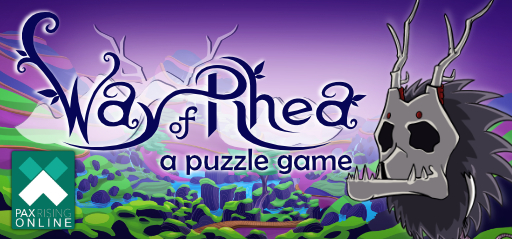

+++
title = "This Month in Rust GameDev #36 - July 2022"
transparent = true
date = 2022-08-01
draft = true
+++

<!-- no toc -->

<!-- Check the post with markdownlint-->

Welcome to the 36th issue of the Rust GameDev Workgroup's
monthly newsletter.
[Rust] is a systems language pursuing the trifecta:
safety, concurrency, and speed.
These goals are well-aligned with game development.
We hope to build an inviting ecosystem for anyone wishing
to use Rust in their development process!
Want to get involved? [Join the Rust GameDev working group!][join]

You can follow the newsletter creation process
by watching [the coordination issues][coordination].
Want something mentioned in the next newsletter?
[Send us a pull request][pr].
Feel free to send PRs about your own projects!

[Rust]: https://rust-lang.org
[join]: https://github.com/rust-gamedev/wg#join-the-fun
[pr]: https://github.com/rust-gamedev/rust-gamedev.github.io
[coordination]: https://github.com/rust-gamedev/rust-gamedev.github.io/issues?q=label%3Acoordination
[Rust]: https://rust-lang.org
[join]: https://github.com/rust-gamedev/wg#join-the-fun

- [Game Updates](#game-updates)
- [Learning Material Updates](#learning-material-updates)
- [Engine Updates](#engine-updates)
- [Tooling Updates](#tooling-updates)
- [Library Updates](#library-updates)
- [Other News](#other-news)
- [Popular Workgroup Issues in Github](#popular-workgroup-issues-in-github)
- [Meeting Minutes](#meeting-minutes)
- [Discussions](#discussions)
- [Requests for Contribution](#requests-for-contribution)
- [Jobs](#jobs)
- [Bonus](#bonus)

<!--
Ideal section structure is:

```
### [Title]


_image caption_

A paragraph or two with a summary and [useful links].

_Discussions:
[/r/rust](https://reddit.com/r/rust/todo),
[twitter](https://twitter.com/todo/status/123456)_

[Title]: https://first.link
[useful links]: https://other.link
```

If needed, a section can be split into subsections with a "------" delimiter.
-->

## Game Updates

### [Way of Rhea][wor]

[][wor]

[Way of Rhea][wor] is a puzzle adventure with hard puzzles and forgiving
mechanics being produced by [@masonremaley][wor-mason-remaley] in a custom Rust
engine. You can support development by
[checking out the free demo and wishlisting on Steam][wor]!

Way of Rhea was selected to be part of [PAX Rising online][wor-pax-rising]! It
was also shown off in the June [Steam Game Festival][wor-steam-game-fest].
Other recent updates:

- Kotaku mentioned Way of Rhea in an article about
  [fascinating upcoming indie games][wor-kotaku]
- [Lost In Cult][wor-lic], a gaming journal, announced [preorders][wor-lic-pre] for
  a new edition of Lock On containing a card game containing a card with a character
  from Way of Rhea featured
- Mason posted a video interview covering [why he became an indie dev][wor-interview],
  among other things
- Work has begun on puzzles for the final level of the game. This area combines the
  puzzle elements from all previous biomes for a final set of challenging puzzles.
- A weather system with [rain][wor-rain] and [snow][wor-snow] was added to the game
- More progress was made on the unreleased Linux platform layer
- More wildlife was added to the game
- Some logging and editor improvements were made

[wor]: https://store.steampowered.com/app/1110620/Way_of_Rhea/?utm_campaign=tmirgd&utm_source=n36
[wor-pax-rising]: https://store.steampowered.com/sale/PAXRisingOnline
[wor-steam-game-fest]: https://store.steampowered.com/sale/nextfest_june2022
[wor-kotaku]: https://kotaku.com/steam-indie-games-pc-wishlist-arctic-awakening-1849140770
[wor-mason-remaley]: https://twitter.com/masonremaley
[wor-forum]: https://steamcommunity.com/app/1110620/discussions/0/3275817732933009791/
[wor-rain]: https://twitter.com/AnthropicSt/status/1546207348259266560
[wor-snow]: https://twitter.com/AnthropicSt/status/1546320074923024384
[wor-lic]: https://www.lostincult.co.uk/
[wor-lic-pre]: https://www.lostincult.co.uk/?aff=18
[wor-interview]: https://youtu.be/H0sIsrLWojs

### Flesh


_3rd area_

[Flesh] by [@im_oab] is a 2D-horizontal shmup game with hand-drawn animation and
an organic/fleshy theme. It is implemented using [Tetra]. This month's updates
include:

- The game has BGM.
- Support global leaderboard.
- Integrate steam SDK using [steamworks] crate.
- Add new enemy types for the 3rd area.
- Add squeezing effect when the enemy gets hit.

[Flesh]: https://store.steampowered.com/app/1660850/Flesh/
[@im_oab]: https://twitter.com/im_oab
[Tetra]: https://github.com/17cupsofcoffee/tetra
[steamworks]: https://crates.io/crates/steamworks

## Engine Updates

## Learning Material Updates

## Tooling Updates

### [Blackjack]


[Blackjack] by @setzer22 is a new procedural modeling application made in Rust,
using rend3, wgpu, and egui. It follows the steps of applications like
Houdini, or Blender's geometry nodes project and provides a node-based
environment to compose procedural recipes to create 3d models.

The focus for the past few months has been into evolving Blackjack from a proof
of concept into a usable application. It's current status is not yet production
ready, but it can now be used to build complex procedural models editable inside
a game engine thanks to its new engine integration system.

Some of the new features include:

- A better data model for meshes, based on groups and channels.
- Game engine integration with Godot, more engines coming soon.
- Introduce Lua as an extension language.
- Add *many* new nodes: Extrude along curve, Copy to points...
- Add experimental support for L-Systems.
- Reworked Look & Feel

A talk about Blackjack's vision and a tour of its features was shared at the
start of July in the [Rust gamedev meetup][blackjack-talk-yt]. Interested
developers are encouraged to [check the project out on GitHub][Blackjack] and
post on the Discussion boards!

[Blackjack]: https://github.com/setzer22/blackjack
[blackjack-talk-yt]: https://onrendering.com/data/papers/catmark/HalfedgeCatmullClark.pdf

## Library Updates

### [hecs]

[hecs] is a fast, lightweight, and unopinionated archetypal ECS library.

[Version 0.8][hecs-changelog] marks a breaking change to most methods that
previously took a generic type parameter `T: Component`, replacing them with
methods taking type parameters which must be *references to* component types
instead. This resolves a long-standing footgun where users accustomed to writing
`&T` in queries might write `world.get::<&T>`, interpreted by rustc as
referencing the valid component type `&'static T`, resulting in code that
compiles but fails to access the intended component.

[hecs]: https://github.com/Ralith/hecs
[hecs-changelog]: https://github.com/Ralith/hecs/blob/master/CHANGELOG.md#080

## Popular Workgroup Issues in Github

<!-- Up to 10 links to interesting issues -->

## Other News

<!-- One-liners for plan items that haven't got their own sections. -->

## Meeting Minutes

<!-- Up to 10 most important notes + a link to the full details -->

[See all meeting issues][label_meeting] including full text notes
or [join the next meeting][join].

[label_meeting]: https://github.com/rust-gamedev/wg/issues?q=label%3Ameeting

## Discussions

<!-- Links to handpicked reddit/twitter/urlo/etc threads that provide
useful information -->

## Requests for Contribution

<!-- Links to "good first issue"-labels or direct links to specific tasks -->

## Jobs

<!-- An optional section for new jobs related to Rust gamedev -->

## Bonus

<!-- Bonus section to make the newsletter more interesting
and highlight events from the past. -->

------

That's all news for today, thanks for reading!

Want something mentioned in the next newsletter?
[Send us a pull request][pr].

Also, subscribe to [@rust_gamedev on Twitter][@rust_gamedev]
or [/r/rust_gamedev subreddit][/r/rust_gamedev] if you want to receive fresh news!

<!--
TODO: Add real links and un-comment once this post is published
**Discuss this post on**:
[/r/rust_gamedev](TODO),
[Twitter](TODO),
[Discord](https://discord.gg/yNtPTb2).
-->

[/r/rust_gamedev]: https://reddit.com/r/rust_gamedev
[@rust_gamedev]: https://twitter.com/rust_gamedev
[pr]: https://github.com/rust-gamedev/rust-gamedev.github.io
