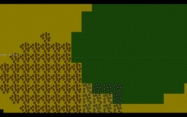

+++
title = "This Month in Rust GameDev #36 - July 2022"
transparent = true
date = 2022-08-11
draft = false
+++

<!-- no toc -->

<!-- Check the post with markdownlint-->

Welcome to the 36th issue of the Rust GameDev Workgroup's
monthly newsletter.
[Rust] is a systems language pursuing the trifecta:
safety, concurrency, and speed.
These goals are well-aligned with game development.
We hope to build an inviting ecosystem for anyone wishing
to use Rust in their development process!
Want to get involved? [Join the Rust GameDev working group!][join]

You can follow the newsletter creation process
by watching [the coordination issues][coordination].
Want something mentioned in the next newsletter?
[Send us a pull request][pr].
Feel free to send PRs about your own projects!

[Rust]: https://rust-lang.org
[join]: https://github.com/rust-gamedev/wg#join-the-fun
[pr]: https://github.com/rust-gamedev/rust-gamedev.github.io
[coordination]: https://github.com/rust-gamedev/rust-gamedev.github.io/issues?q=label%3Acoordination
[Rust]: https://rust-lang.org
[join]: https://github.com/rust-gamedev/wg#join-the-fun

- [Announcements](#announcements)
- [Game Updates](#game-updates)
- [Engine Updates](#engine-updates)
- [Learning Material Updates](#learning-material-updates)
- [Tooling Updates](#tooling-updates)
- [Library Updates](#library-updates)
- [Other News](#other-news)
- [Discussions](#discussions)
- [Requests for Contribution](#requests-for-contribution)

<!--
Ideal section structure is:

```
### [Title]


_image caption_

A paragraph or two with a summary and [useful links].

_Discussions:
[/r/rust](https://reddit.com/r/rust/todo),
[twitter](https://twitter.com/todo/status/123456)_

[Title]: https://first.link
[useful links]: https://other.link
```

If needed, a section can be split into subsections with a "------" delimiter.
-->

## Announcements

### Rust GameDev Meetup


The 18th Rust Gamedev Meetup took place in July. You can watch the recording of
the meetup [here on Youtube][gamedev-meetup-video]. Here was the schedule from
the meetup:

- RustConf Arcade Cabinet - [@carlosupina]
- Blackjack - [@setzer22]
- Dotrix - [@lowenware]
- Graphite - [@GraphiteEditor]

The meetups take place on the second Saturday every month via the [Rust Gamedev
Discord server][rust-gamedev-discord] and are also [streamed on
Twitch][rust-gamedev-twitch]. If you would like to show off what you've been
working on at the next meetup on [August 13th][rust-meetup-time], fill out [this
form][gamedev-meetup-form].

[gamedev-meetup-video]: https://youtu.be/mnuchYuR_ck
[rust-gamedev-discord]: https://discord.gg/yNtPTb2
[rust-gamedev-twitch]: https://twitch.tv/rustgamedev
[rust-meetup-time]: https://everytimezone.com/s/17260ccd
[gamedev-meetup-form]: https://forms.gle/BS1zCyZaiUFSUHxe6
[@carlosupina]: https://twitter.com/carlosupina
[@setzer22]: https://twitter.com/playtheprocess
[@lowenware]: https://twitter.com/lowenware
[@GraphiteEditor]: https://twitter.com/graphiteeditor

### Rust Game Ports Officialization


[64kramsystem][64kramsystem]'s Rust Game Ports [project][game-ports-project] has
been officially adopted by the Rust game development working group.

The project is intended to be a reference for Rust game development, helping
developers, especially newcomers, to understand how to use Rust game libraries,
and design Rust games in general.

Devs are invited to explore and contribute! There are ports for all the levels
and interests 😄

[64kramsystem]: https://github.com/64kramsystem
[game-ports-project]: https://github.com/rust-gamedev/rust-game-ports

### [Ferris 3D Got Released!][ferris3d-github]


[@RayMarch][raymarch-twitter] created a 3d model of [Ferris the Rustacean][ferris]
for the Rust community!

The model is [now available for free here on github][ferris3d-github]!

It was released into the [public domain][public-domain] so you can use it
however you like, even commercially!

_Discussions: [Twitter][raymarch-twitter-release]_

[ferris]: https://rustacean.net/
[raymarch-twitter]: https://twitter.com/Ray__March
[raymarch-twitter-release]: https://twitter.com/Ray__March/status/1554115149312790529
[ferris3d-github]: https://github.com/RayMarch/ferris3d
[public-domain]: https://creativecommons.org/publicdomain/zero/1.0/

### [Tokyo Rust Game Hack Event][tokyo-event]: Aug 12th


The team at [tonari.no](http://tonari.no) is back with the second edition
of the Tokyo Rust Game Hack event!

> For this edition of the Game Hack event, we're dragging you back
> through the mists of time, to the earlier days of arcade games.
> We've built a Bevy-powered, simple reimagining of classic Bomberman,
> with a modern twist.
> Players don't participate by taking turns on an arcade stick.
> Instead, we will provide a crate that defines the character's
> interaction with the world through a Player trait.
> By simply implementing that trait and compiling to a wasm target,
> you'll be able to upload your character to the game, live.
> Adapt your strategy on the fly and bomb your way into the scoreboard!

[The player template repository][bombercrab-player] is open sourced
ahead of time so you can get a nice headstart.

If you decide to come please sign up on [the event's page][tokyo-event].
You can participate physically or online, see the full announcement
for the details.

_Discussions:
[/r/rust](https://reddit.com/r/rust/comments/w7bktx/2022_tokyo_rust_game_hack_event)_

[tokyo-event]: https://bombercrab-rust-game-hack.peatix.com/view
[bombercrab-player]: https://github.com/tonarino/bombercrab-player

## Game Updates

### [Way of Rhea][wor]

[][wor]

[Way of Rhea][wor] is a puzzle adventure with hard puzzles and forgiving
mechanics being produced by [@masonremaley][wor-mason-remaley] in a custom Rust
engine. You can support development by
[checking out the free demo and wishlisting on Steam][wor]!

Way of Rhea was selected to be part of [PAX Rising online][wor-pax-rising]! It
was also shown off in the June [Steam Game Festival][wor-steam-game-fest].
Other recent updates:

- Kotaku mentioned Way of Rhea in an article about
  [fascinating upcoming indie games][wor-kotaku]
- [Lost In Cult][wor-lic], a gaming journal, announced [preorders][wor-lic-pre] for
  a new edition of Lock On containing a card game containing a card with a character
  from Way of Rhea featured
- Mason posted a video interview covering [why he became an indie dev][wor-interview],
  among other things
- Work has begun on puzzles for the final level of the game. This area combines the
  puzzle elements from all previous biomes for a final set of challenging puzzles.
- A weather system with [rain][wor-rain] and [snow][wor-snow] was added to the game
- More progress was made on the unreleased Linux platform layer
- More wildlife was added to the game
- Some logging and editor improvements were made

[wor]: https://store.steampowered.com/app/1110620/Way_of_Rhea/?utm_campaign=tmirgd&utm_source=n36
[wor-pax-rising]: https://store.steampowered.com/sale/PAXRisingOnline
[wor-steam-game-fest]: https://store.steampowered.com/sale/nextfest_june2022
[wor-kotaku]: https://kotaku.com/steam-indie-games-pc-wishlist-arctic-awakening-1849140770
[wor-mason-remaley]: https://twitter.com/masonremaley
[wor-forum]: https://steamcommunity.com/app/1110620/discussions/0/3275817732933009791/
[wor-rain]: https://twitter.com/AnthropicSt/status/1546207348259266560
[wor-snow]: https://twitter.com/AnthropicSt/status/1546320074923024384
[wor-lic]: https://www.lostincult.co.uk/
[wor-lic-pre]: https://www.lostincult.co.uk/?aff=18
[wor-interview]: https://youtu.be/H0sIsrLWojs

### Flesh


_3rd area_

[Flesh] by [@im_oab] is a 2D-horizontal shmup game with hand-drawn animation and
an organic/fleshy theme. It is implemented using [Tetra]. This month's updates
include:

- The game has BGM.
- Support global leaderboard.
- Integrate steam SDK using [steamworks] crate.
- Add new enemy types for the 3rd area.
- Add squeezing effect when the enemy gets hit.

[Flesh]: https://store.steampowered.com/app/1660850/Flesh/
[@im_oab]: https://twitter.com/im_oab
[Tetra]: https://github.com/17cupsofcoffee/tetra
[steamworks]: https://crates.io/crates/steamworks

### [CyberGate][cybergate-yt]


_The server and clients are able to smoothly handle
over a thousand balls rained from above_

CyberGate ([YouTube][cybergate-yt], [Discord][cybergate-dis]) by CyberSoul
is a new multiplayer project that aims at procedurally generating distinct
universes and gameplay experiences. CyberGate is the name of the main world
where universes can be created and accessed by quantum portals.

Recent updates:

- Bandwidth became 16 times smaller by implementing entity prioritization
  \+ other techniques.
- Interpolation and Jitter prediction makes entities way smoother.
- Automatic and Reliable Spawn and Despawn of entities.
- Many other features and optimizations to do with rapier 3d physics,
  wgpu renderer, and quinn (quic) protocol.

[Join the Discord server][cybergate-dis] to participate in tests.

_Discussions: [/r/rust_gamedev](https://reddit.com/r/rust_gamedev/comments/vy7vms/multiplayer_stress_test_1_million_balls)_

[cybergate-yt]: https://youtube.com/channel/UClrsOso3Xk2vBWqcsHC3Z4Q
[cybergate-dis]: https://discord.gg/R7DkHqw7zJ

### [Botnet]


[Botnet] is an upcoming programming-based multiplayer game, where you write
scripts (compiled to WebAssembly) to control robots. Coordinate your network
of bots to gather resources, build new industry, and expand your control of
the server!

This month was primarily spent on BotnetReplayViewer - a visual program to
watch matches and inspect entity data.

Additionally, the antenna structure was added. Building an antenna gives you
control over the bay (room) it's in, letting you build additional structures,
and increasing the total number of bots you can control. Bots can also use
antennas to store resources.

Interested in contributing? Head over to the
[Github discussion page][botnet_ideas] and suggest some ideas!

[Botnet]: https://github.com/JMS55/botnet
[botnet_ideas]: https://github.com/JMS55/botnet/discussions/categories/ideas

### [Re-Rolling!]


[Re-Rolling!] by [@mystalice](https://twitter.com/mystalice) is a top-down 2D
survival shooter where you fight off a horde of rats using weapons you randomly
rolled.

The game was created for [GMTK Jam 2022][rr_gmtk2022] in 48 hours and was
heavily inspired by [20 Minutes Till Dawn][rr_20minutes].

Re-Rolling! was made with Bevy using heron for physics, bevy_egui for in-game
UI, and a handful of other helpful crates and plugins. You can browse the source
on [GitHub][rr_github].

[Re-Rolling!]: https://mystal.itch.io/re-rolling
[rr_gmtk2022]: https://itch.io/jam/gmtk-jam-2022
[rr_20minutes]: https://store.steampowered.com/app/1966900/20_Minutes_Till_Dawn/
[rr_github]: https://github.com/mystal/re-rolling

### [Robo Instructus: 3 Years Old][robo-3]


In 2019 the programming puzzler [Robo Instructus][robo-site] was released
on [Steam][robo-steam] & [itch.io][robo-itch].

This month [Alex Butler][alex-butler] wrote ["Robo Instructus: 3 Years Old"][robo-3]
about how well the game did in the last year & to date: Sales by
platform/country/OS, player feedback, reviews & game updates.

[robo-site]: https://www.roboinstruct.us
[robo-steam]: https://store.steampowered.com/app/1032170/Robo_Instructus
[robo-itch]: https://bigabgames.itch.io/robo-instructus
[alex-butler]: https://twitter.com/bigabgames
[robo-3]: https://blog.roboinstruct.us/2022/07/16/3-years-old.html

### [Simon Arcade]


_a Simon Arcade gameplay with cheats enabled_

Based on [Simon (Original)], made with [Bevy],
the goal of this game is to push buttons in the correct order,
in an ever-increasing sequence.

This game was made to fit with the [Rust Arcade Cabinet]
and was showcased at [RustConf Portland] on August 5th 2022.

[Simon Arcade]: https://github.com/Vrixyz/simon
[Simon (Original)]: https://en.wikipedia.org/wiki/Simon_(game)
[Rust Arcade Cabinet]: https://github.com/rust-arcade/bevy-rust-arcade
[RustConf Portland]: https://rustconf.com
[Bevy]: https://bevyengine.org

### [Veloren][veloren]


_New cave systems to explore_

[Veloren][veloren] is an open world, open-source voxel RPG inspired by Dwarf
Fortress and Cube World.

In July, Veloren released 0.13! You can [read the full blog post][veloren-0.13]
that includes a trailer for the release party, and information about the new
features in the release. This release party set a new record for most players on
the server at once, going from 195 to now 277! This version brings modular
weapons, real-time weather, cliff towns, cave biomes, level of detail trees, and
much more.

Other than the release party, July saw lots of work getting done. The
translation system is undergoing an overhaul. Work is being done on the
Scrolling Combat Text system, which gives some visual indicator to how much
damage or healing you're taking. Though is going into how to better handle
server-side physics to reduce latency.

July's full weekly devlogs: "This Week In Veloren...":
[#179][veloren-179],
[#180][veloren-180],
[#181][veloren-181],
[#182][veloren-182].

[veloren]: https://veloren.net
[veloren-0.13]: https://veloren.net/release-0-13
[veloren-179]: https://veloren.net/devblog-179
[veloren-180]: https://veloren.net/devblog-180
[veloren-181]: https://veloren.net/devblog-181
[veloren-182]: https://veloren.net/devblog-182

### [Agma]


_Moving around_

[Agma] by [@TuckerBMorgan] is a 3D game built in the [Storm Engine] that is based
on games like Lost Ark and Diablo. The author has been writing about their experience
with changing how they approach working on personal projects [here].
It is built using a custom UDP-based networking stack, a custom ECS,
and a custom-skinned mesh renderer to maximize what the author could learn.

[Agma]: https://github.com/TuckerBMorgan/Agma
[@TuckerBMorgan]: https://twitter.com/T_B_Morgan
[here]: https://medium.com/@tucker.bull.morgan/summoning-a-devil-544b130c8889
[Storm Engine]: https://github.com/mooman219/Storm

### [Combine&Conquer][cnc-logs]


_Seamless transition between planet and space views_

[Combine&Conquer][cnc-itch] by [Martin Buck][@I3ck] is a WIP strategy game
about automation similar to Satisfactory or Factorio.
This month's updates include:

- [Audio support, a new space view, colonization of planets,
  inventory overlay, and better notifications][cnc-log-0-8].
- [New textures for structures, info box, updated overlays and modles][cnc-log-0-9].

[@I3ck]: https://github.com/I3ck
[cnc-itch]: https://martinbucksoftware.itch.io
[cnc-logs]: https://buckmartin.de/combine-and-conquer.html
[cnc-log-0-8]: https://buckmartin.de/combine-and-conquer/2022-07-06-v0.0.8.html
[cnc-log-0-9]: https://buckmartin.de/combine-and-conquer/2022-07-31-v0.0.9.html

### Life Code

[][lifecode-video]

[Bytellation shared the first video devlog][lifecode-video] of a WIP ecosystem
coding game "Life Code":

> The game is intended to run in the browser and will be written
> in Rust which will be compiled to WASM.
> I'm using a very new and not yet matured game engine called Bevy.
> I will be creating the art and models in the game using Blender.
>
> This will be a coding game which means players will have to use languages
> such as Python, Javascript, Rust, C++, and hopefully many more.
> It will be possible to play even if you don't know how to code but the game
> will try to guide you to use real code instead of predefined behavior sets.
> Follow my journey where I try to create an impossible solo indie game
> with little to no game dev experience.

[lifecode-video]: https://youtube.com/watch?v=a6ZnhXGp3JI

## Engine Updates

### [Bevy v0.8][bevy-blog]


_Bevy-shaped mountains in a Bevy-based Witcher 3 terrain texturing tool built by
rmemr_

[Bevy][bevy] is a refreshingly simple data-driven game engine built in Rust. It
is [free and open source][bevy-git] forever!

Bevy 0.8 was a massive community effort. You can check out the [full release
blog post here][bevy-blog], but here are some highlights:

- [New Material System][bevy-materials]
- [Camera-driven Rendering][bevy-camera]
- [Built-in Shader Modularization][bevy-shader-mod]
- [Spot Lights][bevy-spotlights]
- [Visibility Inheritance][bevy-visibility]
- [Upgraded to wgpu 0.13][bevy-wgpu]
- [Automatic Mesh Tangent Generation][bevy-tangent]
- [Renderer Optimizations][bevy-render-opt]
- [Scene Bundle][bevy-scene]
- [Scripting / Modding Progress][bevy-scripting]
- [ECS Query Ergonomics and Usability][bevy-ecs-ergo]
- [ECS Internals Refactors][bevy-refactors]
- [Reflection Improvements][bevy-reflect]
- [Hierarchy Commands][bevy-hierarchy]
- [Bevy UI Now Uses Taffy][bevy-taffy]

_Discussions:
[/r/rust](https://reddit.com/r/rust/comments/wc0sqc/bevy_08),
[Hacker News](https://news.ycombinator.com/item?id=32287828),
[Twitter](https://twitter.com/cart_cart/status/1553411157662187521)_

[bevy]: https://bevyengine.org
[bevy-git]: https://github.com/bevyengine/bevy
[bevy-blog]: https://bevyengine.org/news/bevy-0-8
[bevy-materials]: https://bevyengine.org/news/bevy-0-8/#new-material-system
[bevy-camera]: https://bevyengine.org/news/bevy-0-8/#camera-driven-rendering
[bevy-spotlights]: https://bevyengine.org/news/bevy-0-8/#spotlights
[bevy-visibility]: https://bevyengine.org/news/bevy-0-8/#visibility-inheritance
[bevy-shader-mod]: https://bevyengine.org/news/bevy-0-8/#built-in-shader-modularization
[bevy-wgpu]: https://bevyengine.org/news/bevy-0-8/#wgpu-0-13-new-wgsl-shader-syntax
[bevy-tangent]: https://bevyengine.org/news/bevy-0-8/#automatic-mesh-tangent-generation
[bevy-render-opt]: https://bevyengine.org/news/bevy-0-8/#render-phase-sorting-optimization
[bevy-scene]: https://bevyengine.org/news/bevy-0-8/#scene-bundle
[bevy-scripting]: https://bevyengine.org/news/bevy-0-8/#scripting-modding-progress-untyped-ecs-apis
[bevy-ecs-ergo]: https://bevyengine.org/news/bevy-0-8/#query-intoiter
[bevy-refactors]: https://bevyengine.org/news/bevy-0-8/#ecs-lifetimed-pointers
[bevy-reflect]: https://bevyengine.org/news/bevy-0-8/#bevy-reflection-improvements
[bevy-hierarchy]: https://bevyengine.org/news/bevy-0-8/#hierarchy-commands
[bevy-taffy]: https://bevyengine.org/news/bevy-0-8/#taffy-migration-a-refreshed-ui-layout-library

### [Dims][dims-website]


[Dims][dims-website] ([Twitter][dims-twitter], [Discord][dims-discord],
[YouTube][dims-youtube]) is a pre-alpha collaborative open-world
creation platform.
Users can hop in sessions and build a game together, allowing everyone
to bring out their inner game-maker.

In July, development continued to make great strides. Some of the highlights
include:

- Continued work on the audio system, including in-game graphs of attenuation
  and other audio-related functions
- The introduction of an intent system that allows for user actions to be
  undone and replayed arbitrarily
- A complete UI facelift using Material UI icons and a new design language
- A new scripting system using WebAssembly + WASI and Rust as a guest language
  (look forward to an article on this soon!)
- The beginnings of a shared asset database that lets you and your team easily
  share assets amongst each other and with other projects
- Various infrastructural and rendering fixes, including more accurate PBR

Want to try Dims out for yourself? Come join the [Discord][dims-discord] to be
notified of future public tests, see the latest features before everyone else,
and to talk to the devs personally.

[dims-website]: https://dims.co
[dims-twitter]: https://twitter.com/DimsWorlds
[dims-discord]: https://discord.gg/Z5CAVmNE57
[dims-youtube]: https://youtube.com/channel/UCR5gOwS7uSl0a0dl7MLQoqg

### [godot-rust][gd-github]


godot-rust ([GitHub][gd-github], [Discord][gd-discord], [Twitter][gd-twitter])
is a Rust library that provides bindings for the Godot game engine.

The last few months have been a bit quieter around godot-rust. A lot of this
can be attributed to developers exploring the [GDExtension API][gd-gdext], the
successor of GDNative for Godot 4. At this point, a lot of the foundation is
still being built, however, some more concrete plans are outlined in
[#824][gd-824]. Further updates will be posted in that issue or on Twitter.

Nevertheless, several improvements have been integrated to godot-rust since
0.10, with [version 0.10.1 on the horizon][gd-907]. Some notable examples:

- GDScript utility functions like lerp, ease or linear2db ([#901][gd-901])
- Property support for standard collection types ([#883][gd-883])
- Methods for Rect2 and Aabb ([#867][gd-867])

[gd-824]: https://github.com/godot-rust/godot-rust/issues/824
[gd-883]: https://github.com/godot-rust/godot-rust/issues/883
[gd-867]: https://github.com/godot-rust/godot-rust/issues/867
[gd-901]: https://github.com/godot-rust/godot-rust/issues/901
[gd-907]: https://github.com/godot-rust/godot-rust/issues/907
[gd-github]: https://github.com/godot-rust/godot-rust
[gd-discord]: https://discord.com/invite/FNudpBD
[gd-twitter]: https://twitter.com/GodotRust
[gd-gdext]: https://godotengine.org/article/introducing-gd-extensions

### [Gamercade]


_WASM 3d CPU Rendering On a 2d Fantasy Console?_

[Gamercade] ([Discord][Gamercade-Discord], [Github][Gamercade-Github])
by @RobDavenport is a WASM-powered fantasy console focused
on building multiplayer neo-retro games.

After over half a year in development, Gamercade and related tools are ready
for pre-alpha testing. This includes the [console][Gamercade-Console] itself,
as well as the [editor][Gamercade-Editor].

Gamercade's killer feature is the ease of developing multiplayer games.
The console is able to simplify networked game development process
in the best way possible: build a local multiplayer game, and get full online
play for free!

The WASM Api features powerful but simple built-in features like input,
2d graphics, random number generation, and more. Limitations do exist, but are
flexible, such as resolutions up to 1920 x 1080, and a maximum of 256 color
palettes with up to 64 colors each.

The community around the project is small, but is looking to expand.
Come on over to the [subreddit][Gamercade-Subreddit], or hang out and chat
on [Discord][Gamercade-Discord], where the developers interact with members
and post updates daily. The project is newly [open source][Gamercade-Github]
and looking for contributors, suggestions, as well as awesome game demos.

_Discussions:
[/r/rust_gamedev](https://reddit.com/r/rust_gamedev/comments/w8idew/announcing_gamercade_a_new_wasm_powered_fantasy),
[/r/fantasyconsoles](https://reddit.com/r/fantasyconsoles/comments/w8ics8/announcing_gamercade_a_new_wasm_powered_fantasy)_

[Gamercade]: https://gamercade.io
[Gamercade-Console]: https://github.com/gamercade-io/gamercade_console
[Gamercade-Editor]: https://github.com/gamercade-io/gamercade_editor
[Gamercade-Discord]: https://discord.gg/Qafv2Fpt5j
[Gamercade-Github]: https://github.com/gamercade-io

## Learning Material Updates

### [Sand Fall With Compute Shaders in Rust][sandfall-tutorial]


_Drawing Sand_

[@hakolao] published a [tutorial][sandfall-tutorial] about creating
[cellular automata][wiki-cgol] sand fall simulations with compute shaders.

Typically, cellular automata sand fall is done with the CPU due to the two-way
relationship between the cells on a grid. This article shows a way to tackle
sand fall creation using compute shaders to achieve massive parallelism.

Additional to compute shaders, this tutorial is a great introduction to the
[Vulkano](https://github.com/vulkano-rs/vulkano) library. It also works as a
good base for learning how to create simple graphics pipelines. You will also
get to use Bevy and Egui.

_Discussions:
[/r/rust_gamedev](https://reddit.com/r/rust_gamedev/comments/vmynrq/sand_fall_with_compute_shaders_in_rust)_

[@hakolao]: https://github.com/hakolao
[sandfall-tutorial]: https://okkohakola.com/posts/sandfall_tutorial
[wiki-cgol]: https://en.wikipedia.org/wiki/Conway%27s_Game_of_Life

[sand fall with compute shaders in rust]: https://www.okkohakola.com/posts/sandfall_tutorial/

### [Pathfinding in Rust][pf-in-rust]


[Pathfinding in Rust: A tutorial with examples][pf-in-rust]
is an article with examples of how to use the [pathfinding]
crate to do breadth-first, Dijkstra's, and A* search. It links to the
[gregstoll/rust-pathfinding] repo which has working code for all of these.

[pf-in-rust]: https://blog.logrocket.com/pathfinding-rust-tutorial-examples
[pathfinding]: https://crates.io/crates/pathfinding
[gregstoll/rust-pathfinding]: https://github.com/gregstoll/rust-pathfinding

### [Creating Mountains From Planes with Vertex Shaders and Bevy][chrisbiscardi-vid1]

[][chrisbiscardi-vid1]
_Creating mountains from planes with vertex shaders and Bevy_

[@chrisbiscardi] published a [video][chrisbiscardi-vid1]
about using the new Material shader APIs in Bevy 0.8 to transform the
vertex positions in a custom mesh plane using a vertex shader.

_Discussions: [Twitter](https://twitter.com/chrisbiscardi/status/1549089599971938304)_

[chrisbiscardi-vid1]: https://youtube.com/watch?v=85uJc81SQZ4
[@chrisbiscardi]: https://twitter.com/chrisbiscardi

### [What's in a wgsl fragment shader? ft Bevy][chrisbiscardi-vid2]

[][chrisbiscardi-vid2]
_What's in a wgsl fragment shader? ft Bevy_

[@chrisbiscardi] published a [video][chrisbiscardi-vid2]
that introduces the new Material APIs in Bevy 0.8. It covers AsBindGroup,
uniforms, and using Perlin Noise in a fragment shader to render different
colors onto a cube in a variety of ways.

_Discussions: [Twitter](https://twitter.com/chrisbiscardi/status/1546909993726726144)_

[chrisbiscardi-vid2]: https://youtube.com/watch?v=SOOOc9-joVo
[@chrisbiscardi]: https://twitter.com/chrisbiscardi

### [Rusteroids][rusteroids-youtube-playlist]

[][rusteroids-youtube-playlist]

[Rusteroids][rusteroids-github] is a tutorial recreating a clone of Asteroids
in Rust, using SDL2 and the [Specs][rust-specs-crate] library.

New episodes are released weekly and added to the playlist. The most
recent video shows how to safely create global state to store global values,
such as the high score. The most recent code has been released for Windows, on
[Itch.io][itch-io] (with other platforms coming soon).

You can subscribe to the [YouTube Channel][electrocat-youtube],
to never miss an episode, or follow [@ecatstudios][ecatstudios-twitter] on
Twitter!

[rusteroids-youtube-playlist]: https://youtube.com/playlist?list=PLFOS-Gn3aXROnSfl26esPExssd-rQw6jD
[rusteroids-github]: https://github.com/filtoid/rusteroids
[rust-specs-crate]: https://docs.rs/specs/latest/specs/
[itch-io]: https://filtoid.itch.io/rusteroids
[electrocat-youtube]: https://youtube.com/channel/UC1m6P72nySpB3lKWDYGVipw
[ecatstudios-twitter]: https://twitter.com/ecatstudios

### [RuggRogue Source Code Guide][ruggrogue-guide]


[@tung] has been working on a simple web-playable roguelike [RuggRogue][ruggrogue]
inspired by the [Rust Roguelike Tutorial][rl-tut]
and documented the source code structure in a guide:

> If you want to learn about the [source code][ruggrogue-src], you'll also want
> to check out the [RuggRogue Source Code Guide][ruggrogue-guide]:
> a 23-chapter technical web book about the ideas,
> algorithms and structure of the code.
> It covers topics such as rendering, event handling, game states,
> the hand-rolled field of view and pathfinding calculations,
> game balance and more.

_Discussions:
[/r/roguelikes](https://reddit.com/r/roguelikes/comments/vluuud/ruggrogue_a_simple_webplayable_roguelike_inspired),
[/r/rust](https://reddit.com/r/rust_gamedev/comments/vluy7u/ruggrogue_a_simple_webplayable_roguelike_made)_

[@tung]: https://github.com/tung
[ruggrogue]: https://tung.github.io/ruggrogue
[ruggrogue-web]: https://tung.github.io/ruggrogue/play
[ruggrogue-src]: https://github.com/tung/ruggrogue
[ruggrogue-guide]: https://tung.github.io/ruggrogue/source-code-guide
[rl-tut]: https://bfnightly.bracketproductions.com/

## Tooling Updates

### [NES Bundler][nes-bundler]


_NES Bundler in action_

[NES Bundler][nes-bundler] is a NES ROM packaging tool by [@tedsteen].
Did you make a NES-game but none of your friends own a Nintendo? Don't worry.
Put your ROM and configuration in NES Bundler and build an executable for Mac,
Windows or Linux. What you get is a single executable with

- Simple UI for settings
- Re-mappable Keyboard and Gamepad input (you bundle your default mappings).
- Save/Restore state
- Netplay!

It's early days, but the key features are there, and work is ongoing
to make it more mature!

[nes-bundler]: https://github.com/tedsteen/nes-bundler
[@tedsteen]: https://github.com/tedsteen

### [Blackjack]


[Blackjack] by @setzer22 is a new procedural modeling application made in Rust,
using rend3, wgpu, and egui. It follows the steps of applications like
Houdini, or Blender's geometry nodes project and provides a node-based
environment to compose procedural recipes to create 3d models.

The focus for the past few months has been on evolving Blackjack from a proof
of concept into a usable application. Its current status is not yet production
ready, but it can now be used to build complex procedural models editable inside
a game engine thanks to its new engine integration system.

Some of the new features include:

- A better data model for meshes, based on groups and channels.
- Game engine integration with Godot, more engines coming soon.
- Introduce Lua as an extension language.
- Add many new nodes: Extrude along curve, Copy to points...
- Add experimental support for L-Systems.
- Reworked Look & Feel

A talk about Blackjack's vision and a tour of its features was shared at the
start of July in the [Rust gamedev meetup][blackjack-talk-yt]. Interested
developers are encouraged to [check the project out on GitHub][Blackjack] and
post on the Discussion boards!

[Blackjack]: https://github.com/setzer22/blackjack
[blackjack-talk-yt]: https://onrendering.com/data/papers/catmark/HalfedgeCatmullClark.pdf

### [bevy_shadertoy_wgsl] and [GLSL2WGSL]


[bevy_shadertoy_wgsl] is a [Shadertoy] clone for the Bevy game engine,
where the GLSL shader language is replaced by WGSL. It already comes
with a dozen examples and plenty more to go. Feel free to add your own
shaders to the list!

Plus, [GLSL2WGSL] is a new translator tool that should help migrate the
vast majority of GLSL code to WGSL.

The above GIF showcases the new additions to the examples for
[bevy_shadertoy_wgsl]: two shaders originally written in [Shadertoy] by
[@leondenise], and translated to WGSL with the help of [GLSL2WGSL].
The first part is a reproduction of Joe Gardner from the movie Soul,
and the second part is a lightweight fluid shader.

[bevy_shadertoy_wgsl]: https://github.com/eliotbo/bevy_shadertoy_wgsl
[Shadertoy]: https://www.shadertoy.com
[GLSL2WGSL]: https://eliotbo.github.io/glsl2wgsl/
[@leondenise]: https://twitter.com/leondenise

### [Graphite][graphite-website]


Graphite ([website][graphite-website], [GitHub][graphite-repo],
[Discord][graphite-discord], [Twitter][graphite-twitter]) is a free,
in-development raster and vector 2D graphics editor that will be based around a
Rust-powered node graph compositing engine.

July's [sprint][graphite-sprint-17] focused on editor-centric
refactors upgrading stopgap measures to more robust systems.

- Making a splash: The default document is replaced by a welcome splash screen
  following a refactor allowing for zero open documents.
- Modifying for Macs: Input handling supports the nonstandard modifier keys on
  Mac keyboards, including labels in the UI.
- Setting a high bar: The menu bar cleans up actions and supports new ones like
  "File" > "Import". Displayed hotkeys are based on the actual key mapping
  source, varying by OS.
- Keeping organized: The editor codebase is restructured to cut away technical
  debt and create consistency for new contributors and better docs going forward.

Open the [Graphite editor][graphite-live-demo] in your browser to give it a try
and share your creations with #MadeWithGraphite on Twitter.

[graphite-website]: https://graphite.rs
[graphite-repo]: https://github.com/GraphiteEditor/Graphite
[graphite-discord]: https://discord.graphite.rs
[graphite-twitter]: https://twitter.com/GraphiteEditor
[graphite-sprint-17]: https://github.com/GraphiteEditor/Graphite/milestone/17
[graphite-live-demo]: https://editor.graphite.rs

### Nintendo Switch Will Be a Tier 3 Target in Rust 1.64

[The pull request by @jam1garner][switch-pr] that adds a no_std support for
the aarch64-nintendo-switch-freestanding target was merged this month
after a lengthy legal investigation.
This is the first step towards working on incrementally adding support
for the Nintendo Switch.
Check out [this Twitter thread][switch-twi] for more details
about the changes.

And btw, speaking of Nintendo targets: the std support for the Nintendo 3DS
(armv6k-nintendo-3ds) was [also merged this month][3ds-pr]!

_Discussions:
[/r/rust](https://reddit.com/r/rust/comments/vzr6oq/nintendo_switch_target_merged)_

[@jam1garner]: https://github.com/jam1garner
[switch-pr]: https://github.com/rust-lang/rust/pull/88991
[switch-twi]: https://twitter.com/jam1garner/status/1547814292107378695
[3ds-pr]: https://github.com/rust-lang/rust/pull/95897

## Library Updates

### [bevy_godot]

[bevy_godot] is an in-development library that offers a familiar Bevy environment
inside of the [Godot Engine][godot-engine]. [bevy_godot] currently features Scene
Tree integration, collision detection, spawning Godot scenes from Bevy, and
included examples to demonstrate the API. The upcoming update will feature Godot
signal events, Bevy assets integration, and a full implementation of the Dodge
the Creeps example game.

[bevy_godot] is looking for contributors to help grow the library to fit all
Godot Engine game development needs.

[bevy_godot]: https://github.com/rand0m-cloud/bevy_godot
[godot-engine]: https://godotengine.org

### [hecs]

[hecs] is a fast, lightweight, and unopinionated archetypal ECS library.

[Version 0.8][hecs-changelog] marks a breaking change to most methods that
previously took a generic type parameter `T: Component`, replacing them with
methods taking type parameters which must be _references to_ component types
instead. This resolves a long-standing footgun where users accustomed to writing
`&T` in queries might write `world.get::<&T>`, interpreted by rustc as
referencing the valid component type `&'static T`, resulting in code that
compiles but fails to access the intended component.

[hecs]: https://github.com/Ralith/hecs
[hecs-changelog]: https://github.com/Ralith/hecs/blob/master/CHANGELOG.md#080

### [bevy_mod_wanderlust]

[bevy_mod_wanderlust]
([GitHub](https://github.com/PROMETHIA-27/bevy_mod_wanderlust)) by
[@PROMETHIA-27] is a character controller plugin for Bevy engine.

Inspired by [this excellent video](https://www.youtube.com/watch?v=qdskE8PJy6Q),
it is implemented on top of [Rapier physics](https://rapier.rs) and highly
customizable. Wanderlust includes a variety of settings to target many different
character controller types, including 2D/3D platformers, spacecraft, and
first/third person games.

[bevy_mod_wanderlust]: https://crates.io/crates/bevy_mod_wanderlust
[@PROMETHIA-27]: https://github.com/PROMETHIA-27

### [Lyon]


[Lyon] ([GitHub](https://github.com/nical/lyon)) by [Nical](https://github.com/nical)
is a collection of crates providing various 2D vector graphics utilities, including
fast tessellation algorithms, easy to integrate in typical GPU accelerated rendering
engines.

Lyon made its symbolic [1.0.0 release](https://crates.io/crates/lyon/1.0.0)
reflecting the stability of the project. Highlights in this release include:

- Initial support for variable line width in the stroke tessellator.
- An efficient algorithm to query positions at given distances along a path.
- Improved support for specifying custom endpoint attributes in paths and algorithms.
- And more. You can read the [announcement blog post here](https://nical.github.io/posts/lyon-1-0.html).

_Discussions: [/r/rust](https://reddit.com/r/rust/comments/vwdxim/announcing_lyon_100),
[Twitter](https://twitter.com/nicalsilva/status/1546424285442473987?s=20&t=S1fXSoh2zWHbfTImCGYpPQ)_

[Lyon]: https://github.com/nical/lyon

### [Renet]


_Demo using renet and bevy_

[Renet] by [@lucaspoffo] is a network library to create
games with the Server-Client architecture.

Built on top of UDP, it has its own protocol to send and receive reliable messages
more suited for fast-paced games than TCP. Some other features are:

- Connection management
- Authentication and encrypted connections
- Communication through multiple types of channels:
  - Reliable Ordered: guarantee ordering and delivery of all messages
  - Unreliable Unordered: no guarantee of delivery or ordering of messages
  - Block Reliable: for bigger messages, such as level initialization
- Packet fragmentation and reassembly

Renet comes with [bevy_renet], a plugin for the Bevy engine, and also with
[renet_visualizer], an egui interface to visualize network metrics.

[Renet]: https://github.com/lucaspoffo/renet
[@lucaspoffo]: https://github.com/lucaspoffo
[bevy_renet]: https://github.com/lucaspoffo/renet/tree/master/bevy_renet
[renet_visualizer]: https://github.com/lucaspoffo/renet/tree/master/renet_visualizer

### [miniquad]


_VirtualBox, gl2 as the only GPU acceleration available_

[miniquad] is a safe and cross-platform rendering library
focused on portability and low-end platform support.

This month [OpenGl 2.1/GLESv2][gl2pr] PR got merged, adding support for old
android phones, virtual machines, and just old computers.
While the PR itself is quite small, it solved a very old design issue:
[compatibilities proposal][mqcompat]. Fixing this issue opened the door for
both lower-end backends, like gl1, and higher-level backends. Metal is the
next in line.

[miniquad]: https://github.com/not-fl3/miniquad/
[gl2pr]: https://github.com/not-fl3/miniquad/pull/305
[mqcompat]: https://github.com/not-fl3/miniquad/pull/176

### [bevy_mod_fbx]


_model courtesy of [Samuel Rosario], rendered in bevy_

[bevy_mod_fbx] is a pre-alpha library to load FBX (Autodesk Filmbox) files
into [bevy] 0.8, based on [fbxcel-dom].
It currently:

- Loads geometry and meshes
- Loads mesh attributes such as color
- Loads default material diffuse textures, normal maps, and emissive maps
- Loads the custom Maya PBR materials, including all material textures
- Load the scene tree and translate it to bevy's hierarchy

Planned features include providing a basic Lambert/Phong shader
to better handle more standard materials,
loading animations and skinned mesh skeletons/rigs.

The project is poorly tested and is looking for testers. It will soon be
available on crates.io.

[fbxcel-dom]: https://lib.rs/crates/fbxcel-dom
[bevy]: https://bevyengine.org/
[bevy_mod_fbx]: https://github.com/HeavyRain266/bevy_mod_fbx
[Samuel Rosario]: https://www.artstation.com/artwork/bKJ0EE

### [shame]


[shame] lets you author shaders and pipeline layouts
in a single seamless piece of rust code. It offers:

- a simple and lightweight setup,
- type checks from input assembly all the way to fragment output,
- (re)generate different shaders/pipelines based on runtime parameters,
- [shader hot reloading][shame-examples],
- [examples using wgpu][shame-examples]!

A Discord channel for questions/feedback is linked in the
[Github readme][shame].

<!-- i am unable to generate a permanent discord invite link,
thats why i link to the project github, where i can update the
link once it is outdated -->

[raymarch-github]: https://github.com/RayMarch
[shame]: https://github.com/RayMarch/shame
[shame-examples]: https://github.com/RayMarch/shame/tree/main/examples

### [bonsai-bt]


_A visualization of a simple NPC behavior tree_

[bonsai-bt] by [@Sollimann] is a Rust implementation of behavior trees.

> A Behavior Tree (BT) is a data structure in which we can set the rules of how
> certain behaviors can occur and the order in which they would execute.
> BTs are a very efficient way of creating complex systems that
> are both modular and reactive.
> These properties are crucial in many applications,
> which has led to the spread of BT from computer game programming
> to many branches of AI and Robotics.

_Discussions: [/r/rust_gamedev](https://reddit.com/r/rust_gamedev/comments/vxk8h9/bonsaibt_a_behavior_tree_lib)_

[bonsai-bt]: https://github.com/Sollimann/bonsai
[@Sollimann]: https://github.com/Sollimann

### [shades] and [shades-edsl]


[@phaazon] has published [a detailed article][shades-article] that introduces
[shades] and [shades-edsl] - two Rust crates to write shaders by writing pure Rust:

- The [shades] crate provides all needed types and other building blocks
- while [shades-edsl] provides a proc-macro [EDSL][edsl-wiki]
for transforming regular Rust code into the API from shades.

> This crate provides an EDSL to build shaders, leveraging the Rust compiler (rustc)
> and its type system to ensure soundness and typing.
> Because shaders are written in Rust, this crate is completely language agnostic:
> it can in theory target any shading language - the current tier-1 language
> being GLSL. The EDSL allows to statically type shaders while still generating
> the actual shading code at runtime.

[@phaazon]: https://phaazon.net
[shades-article]: https://phaazon.net/blog/shades-edsl
[shades]: https://github.com/phaazon/shades
[shades-edsl]: https://github.com/phaazon/shades-edsl
[edsl-wiki]: https://en.wikipedia.org/wiki/Domain-specific_language#External_and_Embedded_Domain_Specific_Languages

### [fdg]


[fdg] by [@grantshandy] is a [force-directed graph][fdg-wiki] drawing framework.

> The goal of this project is to provide a force-directed graph framework
> and algorithms for Rust, as well as 2D and 3D visualizers
> that work on the web and desktop.
> It sits on top of [petgraph] and manages the positions of your nodes.

You can view all the examples online [here][fdg-web].

The project consists of three parts:

- [fdg-sim] - the underlying force simulation framework that handles your
  dataset's positions based on a physics engine of your choice (or creation).
- [fdg-macroquad] - a visualizer that uses macroquad for rendering.
- [fdg-img] - a SVG visualizer for your graphs.

_Discussions: [/r/rust](https://reddit.com/r/rust/comments/w92aya/fdg)_

[fdg]: https://github.com/grantshandy/fdg
[fdg-web]: https://grantshandy.github.io/fdg
[@grantshandy]: https://grantshandy.github.io
[petgraph]: https://crates.io/crates/petgraph
[fdg-sim]: https://github.com/grantshandy/fdg/tree/main/fdg-sim
[fdg-macroquad]: https://github.com/grantshandy/fdg/blob/main/fdg-macroquad
[fdg-img]: https://github.com/grantshandy/fdg/tree/main/fdg-img
[fdg-wiki]: https://en.wikipedia.org/wiki/Force-directed_graph_drawing
[fdg-web-json]: https://grantshandy.github.io/fdg/json.html

## Other News

<!-- One-liners for plan items that haven't got their own sections. -->

- Other game updates:
  - [Hydrofoil Generation devs shared](https://twitter.com/HydrofoilG)
    a bunch of screenshots and videos with a new boat.
  - [@epcc10] shared a few videos about Idu getting a
    [better water rendering and physics][idu-1] and [better interaction with soil][idu-2].
  - [Felix Windström](https://twitter.com/sov_gott_games) shared a couple of
    Paddlepunks updates: [a wizard leveling up their walls][paddlepunks-1],
    and [increased the active time on witch's doritos][paddlepunks-2].
  - [Legend of Worlds released their first devlog][legendofworlds-log].
  - The [Bounce Up!][bounceup] block breaker game
    shared a [video preview of the practice mode][bounceup-video].
  - [Theta Wave is now is now playable in the browser on itch.io][theta-wave-itch].
    Give it a try and let the author know what you think!
  - [Fish Folly][fish-folly] posted a couple videos of
    [their new AI](https://youtube.com/watch?v=YRE5g57aZEg) and
    [the falling over mechanic](https://youtube.com/watch?v=RuoLInE34dM).
  - [Punchy v0.0.2][punchy-2] and [v0.0.3][punchy-3] were released, featuring
    scenes, egui UI, AI, playable web build,
    new enemy variants, controller remapping, and throwable bottles.
- Other tooling updates:
  - [annelid] is a speedrun timer with autosplitter for fxpak/sd2snes written
    using egui.
  - [unitypacker] is a tool for creating .unitypackages from the command line.
- Other learning material updates:
  - [@PhaestusFox] released a bunch of Bevy tutorial videos covering:
    gamepads, touch input, bevy 0.8 update & migration, and hierarchy.
  - [The "Learn WGPU" tutorial was updated to wgpu v0.13][lear-wgpu-0-13].
  - KyleMayes [has ported vulkan-tutorial.com to vulkanalia][vulkanalia-tut].
  - [bevy_roguelike] is a project that implements reusable Bevy ECS
    systems and components for writing roguelike games.
- Other library updates:
  - [wgpu v0.13 and naga v0.9][wgpu-13] bring the newest WGSL spec support,
    improved presentation and pipelining, and lots of performance
    and correctness improvements. The devs also decided to make the DX12 backend
    default on Windows and are looking for testers.
  - [bevy_pancam] is a 2d-camera plugin for Bevy that works with orthographic cameras.

[@epcc10]: https://twitter.com/epcc10
[idu-1]: https://twitter.com/epcc10/status/1545918011185549313
[idu-2]: https://twitter.com/epcc10/status/1547723415015919622
[paddlepunks-1]: https://twitter.com/sov_gott_games/status/1543227926052847616
[paddlepunks-2]: https://twitter.com/sov_gott_games/status/1548340577233580035
[legendofworlds-log]: https://reddit.com/r/rust_gamedev/comments/w2508b/legend_of_worlds_1
[bounceup]: https://cryscan.itch.io/bounce-up
[bounceup-video]: https://youtube.com/watch?v=ohNQgahuj6U
[theta-wave-itch]: https://reddit.com/r/rust/comments/w4h4ad/thetawave_play_itch
[fish-folly]: https://github.com/mrDIMAS/FishFolly
[punchy-2]: https://reddit.com/r/rust/comments/vt44wq/media_punchy_v002
[punchy-3]: https://reddit.com/r/rust/comments/waltwb/media_fish_fight_punchy_v003
[annelid]: https://github.com/dagit/annelid
[unitypacker]: https://github.com/paulfigiel/unitypacker
[lear-wgpu-0-13]: https://sotrh.github.io/learn-wgpu/news/0.13
[bevy-basics]: https://youtube.com/playlist?list=PL6uRoaCCw7GN_lJxpKS3j-KXuThRiSXc6
[@PhaestusFox]: https://youtube.com/c/PhaestusFox
[vulkanalia-tut]: https://reddit.com/r/rust_gamedev/comments/w2g16h/another_vulkan_tutorial
[wgpu-13]: https://reddit.com/r/rust_gamedev/comments/vp571t/release_of_wgpu_v013_and_call_for_testing
[bevy_pancam]: https://github.com/johanhelsing/bevy_pancam
[bevy_roguelike]: https://github.com/tomuxmon/bevy_roguelike

## Discussions

<!-- Links to handpicked reddit/twitter/urlo/etc threads that provide
useful information -->

- [/r/rust](https://reddit.com/r/rust):
  - ["Are these misconceptions about rust?"](https://reddit.com/r/rust/comments/vruvxx/are_these_misconceptions_about_rust)
- [/r/rust_gamedev](https://reddit.com/r/rust_gamedev):
  - ["Using WGPU + crates directly or Bevy?"](https://reddit.com/r/rust_gamedev/comments/vrfjw2/using_wgpu_crates_directly_or_bevy)
  - ["A 2D, lightweight graphics library, Rust-only?"](https://reddit.com/r/rust_gamedev/comments/w9l1um/a_2d_lightweight_graphics_library_rustonly)
  - ["Framework or libraries for developing Android/iOS games"](https://reddit.com/r/rust_gamedev/comments/wbg7xg/framework_or_libraries_for_developing_androidios)

## Requests for Contribution

<!-- Links to "good first issue"-labels or direct links to specific tasks -->

- ['Are We Game Yet?' wants to know about projects/games/resources that
  aren't listed yet][awgy].
- [Graphite is looking for contributors][graphite-contribute] to help build the
  new node graph and 2D rendering systems.
- [winit's "difficulty: easy" issues][winit-issues].
- [Backroll-rs, a new networking library][backroll-rs].
- [Embark's open issues][embark-open-issues] ([embark.rs]).
- [wgpu's "help wanted" issues][wgpu-issues].
- [luminance's "low hanging fruit" issues][luminance-fruits].
- [ggez's "good first issue" issues][ggez-issues].
- [Veloren's "beginner" issues][veloren-beginner].
- [Amethyst's "good first issue" issues][amethyst-issues].
- [A/B Street's "good first issue" issues][abstreet-issues].
- [Mun's "good first issue" issues][mun-issues].
- [SIMple Mechanic's good first issues][simm-issues].
- [Bevy's "good first issue" issues][bevy-issues].

[awgy]: https://github.com/rust-gamedev/arewegameyet#contribute
[graphite-contribute]: https://graphite.rs/contribute
[winit-issues]: https://github.com/rust-windowing/winit/issues?q=is%3Aopen+is%3Aissue+label%3A%22difficulty%3A+easy%22
[backroll-rs]: https://github.com/HouraiTeahouse/backroll-rs/issues
[embark.rs]: https://embark.rs
[embark-open-issues]: https://github.com/search?q=user:EmbarkStudios+state:open
[wgpu-issues]: https://github.com/gfx-rs/wgpu/issues?q=is%3Aissue+is%3Aopen+label%3A%22help+wanted%22
[luminance-fruits]: https://github.com/phaazon/luminance-rs/issues?q=is%3Aissue+is%3Aopen+label%3A%22low+hanging+fruit%22
[ggez-issues]: https://github.com/ggez/ggez/labels/%2AGOOD%20FIRST%20ISSUE%2A
[veloren-beginner]: https://gitlab.com/veloren/veloren/issues?label_name=beginner
[amethyst-issues]: https://github.com/amethyst/amethyst/issues?q=is%3Aissue+is%3Aopen+label%3A%22good+first+issue%22
[abstreet-issues]: https://github.com/a-b-street/abstreet/issues?q=is%3Aissue+is%3Aopen+label%3A%22good+first+issue%22
[mun-issues]: https://github.com/mun-lang/mun/labels/good%20first%20issue
[simm-issues]: https://github.com/mkhan45/SIMple-Mechanics/labels/good%20first%20issue
[bevy-issues]: https://github.com/bevyengine/bevy/labels/E-Good-First-Issue

------

That's all news for today, thanks for reading!

Want something mentioned in the next newsletter?
[Send us a pull request][pr].

Also, subscribe to [@rust_gamedev on Twitter][@rust_gamedev]
or [/r/rust_gamedev subreddit][/r/rust_gamedev] if you want to receive fresh news!

**Discuss this post on**:
[/r/rust_gamedev](https://reddit.com/r/rust_gamedev/comments/wm0rl8/this_month_in_rust_gamedev_36_july_2022),
[Twitter](https://twitter.com/rust_gamedev/status/1557819704684716035),
[Discord](https://discord.gg/yNtPTb2).

[/r/rust_gamedev]: https://reddit.com/r/rust_gamedev
[@rust_gamedev]: https://twitter.com/rust_gamedev
[pr]: https://github.com/rust-gamedev/rust-gamedev.github.io
