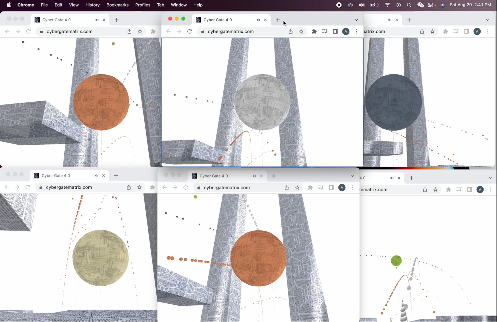
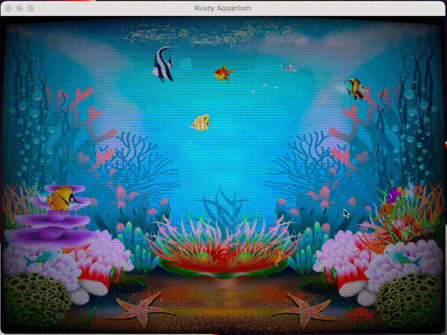
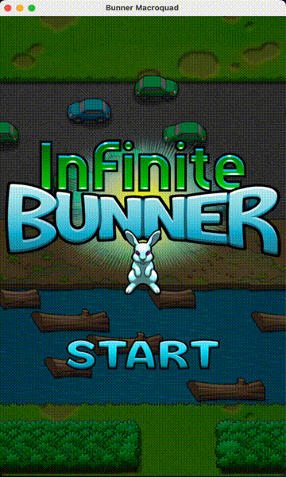
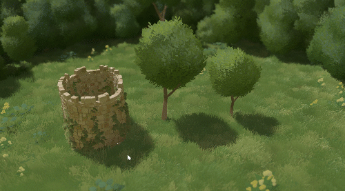
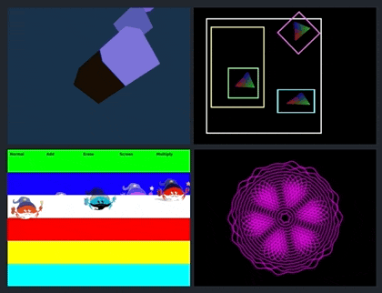

+++
title = "This Month in Rust GameDev #37 - August 2022"
transparent = true
date = 2022-09-05
draft = true
+++

<!-- no toc -->

<!-- Check the post with markdownlint-->

Welcome to the 37th issue of the Rust GameDev Workgroup's
monthly newsletter.
[Rust] is a systems language pursuing the trifecta:
safety, concurrency, and speed.
These goals are well-aligned with game development.
We hope to build an inviting ecosystem for anyone wishing
to use Rust in their development process!
Want to get involved? [Join the Rust GameDev working group!][join]

You can follow the newsletter creation process
by watching [the coordination issues][coordination].
Want something mentioned in the next newsletter?
[Send us a pull request][pr].
Feel free to send PRs about your own projects!

[Rust]: https://rust-lang.org
[join]: https://github.com/rust-gamedev/wg#join-the-fun
[pr]: https://github.com/rust-gamedev/rust-gamedev.github.io
[coordination]: https://github.com/rust-gamedev/rust-gamedev.github.io/issues?q=label%3Acoordination

- [Announcements](#announcements)
- [Game Updates](#game-updates)
- [Engine Updates](#engine-updates)
- [Learning Material Updates](#learning-material-updates)
- [Tooling Updates](#tooling-updates)
- [Library Updates](#library-updates)
- [Popular Workgroup Issues in Github](#popular-workgroup-issues-in-github)
- [Other News](#other-news)
- [Discussions](#discussions)
- [Requests for Contribution](#requests-for-contribution)
- [Jobs](#jobs)
- [Bonus](#bonus)

<!--
Ideal section structure is:

```
### [Title]


_image caption_

A paragraph or two with a summary and [useful links].

_Discussions:
[/r/rust](https://reddit.com/r/rust/todo),
[twitter](https://twitter.com/todo/status/123456)_

[Title]: https://first.link
[useful links]: https://other.link
```

If needed, a section can be split into subsections with a "------" delimiter.
-->

## Announcements

## Game Updates

### [Catacomb 2-64k][catacomb-2-repo]

[][catacomb-2-repo]

[Catacomb 2-64k][catacomb-2-repo] is a (completed) experimental
project in porting a moderately complex project, first from C to unsafe Rust,
then to (fully) safe Rust.

The objective of the project has been to study the tooling, transformations
and the overall process required perfom real-world, exact, ports; an article
will follow in September on [64kramsystem's blog][64ramsystem-blog].

The port uses the [Rust-SDL2 bindings][rust-sdl2-bindings]. More exact ports
of id Software games are expected in the future, with the introduction of a
refactoring tool based on the [Language Server Protocol][language-server-protocol]
/[Rust Analyzer][rust-analyzer].

[catacomb-2-repo]: https://github.com/64kramsystem/catacomb_ii-64k
[64ramsystem-blog]: https://saveriomiroddi.github.io
[rust-sdl2-bindings]: https://github.com/Rust-SDL2/rust-sdl2
[language-server-protocol]: https://microsoft.github.io/language-server-protocol
[rust-analyzer]: https://github.com/rust-lang/rust-analyzer

### [CyberGate][cybergate-yt]


_The new browser version works exactly like the native version_

CyberGate ([YouTube][cybergate-yt], [Discord][cybergate-dis]) by CyberSoul
is a new multiplayer project that aims at procedurally generating distinct
universes and gameplay experiences. CyberGate is the name of the main world
where universes can be created and accessed by quantum portals.

Recent updates:

- Ported to browser (wgpu with webgl backend)
- Unreliable network protocol achieved with WebRTC
- Dynamically spawn and synchronize ECS components using macros
- Massively improved the events system and actions system
- Refactored over 50% of the project
- Small features such as grabbing objects and dash forward
- Fixed 3 major bugs that slowed down the server

[Join the Discord server][cybergate-dis] to participate in upcoming Phase 5.0!

_Discussions: [/r/rust_gamedev](https://www.reddit.com/r/rust_gamedev/comments/x60n9y/cybergate_45_progress_browser_udp_client_with/)_

[cybergate-yt]: https://youtube.com/channel/UClrsOso3Xk2vBWqcsHC3Z4Q
[cybergate-dis]: https://discord.gg/R7DkHqw7zJ

### [Rusty Aquarium]


_Visualize data as a fish tank with Rusty Aquarium_

[Rusty Aquarium] by [@ollej] is a data visualization tool as a virtual fish
tank written in Rust and Macroquad. Different data points control how many
fishes are shown, how they move, how fast they swim, and which size they are.
It can be used to monitor data in a visual way, while those uninitiated only
see a serene fish tank.

Since Macroquad is cross-platform, Rusty Aquarium is available for Windows,
Mac, Linux as well as for browsers using WebAssembly.

The aquarium can be controlled in various different ways:

- System monitoring binary to show CPU usage, disk usage and processes.
- Integrate with Google Sheets to control fishes.
- Back it with an URL that generates a JSON file.

This month, a blog post with the [story behind Rusty Aquarium][RustyAquariumStory]
was published on the [Agical] blog. The code was restructured and the packaged
files now contain binaries for input data generation.

[Rusty Aquarium]: https://github.com/ollej/rusty-aquarium
[@ollej]: https://twitter.com/ollej
[RustyAquariumStory]: https://blog.agical.se/en/posts/the-story-behind-rusty-aquarium/
[Agical]: https://blog.agical.se/en/

### [Infinite Bunner]


_Port of the Infinite Bunner game to Rust and Macroquad_

[Infinite Bunner] is a game from the book [Code the Classics vol 1] that has
been ported by [@ollej] to Rust and Macroquad from Python and PyGame Zero.
It is a modern version of the classic arcade game Frogger with improved
graphics and sound.

The game has been sent in to the [Rust Game Ports][rust-game-ports] project as
an educational example. It shows how to make a 2D game in Macroquad with
graphics and sound.

[Code the Classics vol 1] is a book from Wireframe Magazine that tells the
history of five classic video games. It also includes code listings of modern
versions of the games written in Python with the PyGame Zero framework.

[Infinite Bunner]: https://github.com/ollej/rust-bunner-macroquad
[@ollej]: https://twitter.com/ollej
[rust-game-ports]: https://github.com/rust-gamedev/rust-game-ports
[Code the Classics vol 1]: https://wireframe.raspberrypi.org/books/code-the-classics1

### Tiny Building Game



The untitled "Tiny Building Game" is a stress-free feel-good game focused on just
building something pretty. It is being made by [@anastasiaopara] and
[@h3r2tic], who has recently joined the project!

This month, there was a large visual update, which added [trees and flowers][twitter-thread-1],
as well as [fences and gates][twitter-thread-2].

Right now, the team is actively working on setting up a Steam page. Stay
tuned by following the [newsletter][country-slice-newsletter]!

[country-slice-newsletter]: https://dashboard.mailerlite.com/forms/10395/51067704544593017/share
[twitter-thread-1]: https://twitter.com/anastasiaopara/status/1560673892574035969
[twitter-thread-2]: https://twitter.com/anastasiaopara/status/1565629377823395841
[@anastasiaopara]: https://twitter.com/anastasiaopara
[@h3r2tic]: https://twitter.com/h3r2tic

## Engine Updates

### [miniquad]

[][quad-android-playground]

[miniquad] is a pure Rust, cross-platform graphics library.

This month was about polishing miniquad-android experience.
To make it easier for regression testing, miniquad got
[the android playground][quad-android-playground].

The playground demonstrates all known android shenanigans in
one quad-based app.

It includes:

- onscreen keyboard
- java interop (with file dialog as an example)
- dealing with big java services (with bluetooth as an example)
- accessing permissions, both runtime and compile time

[miniquad]: https://github.com/not-fl3/miniquad/
[quad-android-playground]: https://github.com/not-fl3/quad-android-playground

### [Runty8][runty8-repo]

[![Runty 8 logo][runty8-logo]][runty8-repo]

[Runty8][runty8-repo] is an experimental port of the [Pico8][pico8-site]
fantasy console that supports writing games in Rust.

Its current goals are to follow Pico8's APIs as closely as possible,
to allow easily porting existing games to Rust,
as well as developing new games in a familiar development environment.

The project is in very early stages, and is currently looking for contributors.
If you're interested, feel free to read their [contributing guide][runty8-contributing-guide]
or browse through the [open issues][runty8-open-issues].

[runty8-repo]: https://github.com/jjant/runty8
[runty8-contributing-guide]: https://github.com/jjant/runty8/blob/master/CONTRIBUTING.md
[runty8-open-issues]: https://github.com/jjant/runty8/issues
[pico8-site]: https://www.lexaloffle.com/pico-8.php
[runty8-logo]: https://user-images.githubusercontent.com/15112080/188467323-037617cf-7dbc-4988-bbd7-fbafd1524455.png

### [Gamercade]


_Preview of the Audio Editor in Action_

[Gamercade] ([Discord][Gamercade-Discord], [Github][Gamercade-Github])
by @RobDavenport is a WASM-powered fantasy console focused
on building multiplayer neo-retro games.

Gamercade is preparing for their first alpha release! This includes all the
core features needed for a fantasy console and game library: input, graphics,
and audio. It also has networked multiplayer, and an editor.

They implemented the in-game sound engine from scratch. They also improved the
editor to allow creation of instruments and tracks. It synthesizes sounds at
runtime, and produces something like an 80s synth, a 90s SoundBlaster, and a
touch of SNES. Songs and Sfx are built using a tracker interface.
[This video][Gamercade-Video] shows a small sample of what it is capable of.

"Wavetables" are great for classic sounds like 8-bit chiptunes or even more
complicated sounds. "FM Synth" is a 4-op FM synthesizer. Masters of this
technique can produce a huge variety of instruments, effects, and other
otherwordly things. "Sampler" rounds out the rest of the system, providing
pre-recorded sample playback. Samples can be pitched and played as the desired
note.

Come hang out and chat on [Discord][Gamercade-Discord], where the developers
interact with members and post updates daily. The project is
[open source][Gamercade-Github] and looking for contributors, suggestions,
as well as awesome game demos.

[Gamercade]: https://gamercade.io
[Gamercade-Discord]: https://discord.gg/Qafv2Fpt5j
[Gamercade-Github]: https://github.com/gamercade-io/gamercade_console
[Gamercade-Video]: https://www.youtube.com/watch?v=cRsOvefap_U

## Learning Material Updates

## Tooling Updates

## Library Updates

### [hot-lib-reloader]


[hot-lib-reloader] is a development tool that allows you to reload functions
of a running Rust program. This allows to do "live programming" where you
modify code and immediately see the effects in your running program. Gone
are the days of edit-compile-restart loops (to some degree).

hot-lib-reloader works by reloading parts of your application that are defined
as dynamic libraries. This approach works on Linux, MacOS, and Windows but has
some constraints - see the [documentation] for details. There are several
[examples], showing how to create hot-reload setups with various frameworks
and libraries, e.g. bevy, egui, and [nannou].

[hot-lib-reloader]: https://github.com/rksm/hot-lib-reloader-rs
[documentation]: https://docs.rs/hot-lib-reloader/latest/hot_lib_reloader/
[examples]: https://github.com/rksm/hot-lib-reloader-rs/tree/master/examples
[nannou]: https://youtu.be/hyyeLtJ7SQk

### [bevy_kira_audio]


_Configuring a sound when playing it_

[bevy_kira_audio] by [@nikl_me] is an alternative audio plugin for the [Bevy]
game engine. It uses [Kira] as its audio library and aims to integrate
well with Bevy's ECS.

Last month saw the release of versions [0.11.0] and [0.12.0]. With the
latest version, sound settings like volume, playback-rate, or panning can
be adjusted directly when playing audio. The screenshot above shows the new API
with multiple example settings. The plugin now also offers control
over single sound instances via asset handles and will apply configurable
tweens to most operations.

[bevy_kira_audio]: https://github.com/NiklasEi/bevy_kira_audio/
[Kira]: https://github.com/tesselode/kira
[@nikl_me]: https://twitter.com/nikl_me
[Bevy]: https://bevyengine.org/
[0.11.0]: https://github.com/NiklasEi/bevy_kira_audio/blob/main/CHANGELOG.md#v0110
[0.12.0]: https://github.com/NiklasEi/bevy_kira_audio/blob/main/CHANGELOG.md#v0120

### [bevy_asset_loader]


_Configuration of a loading state_

[bevy_asset_loader] by [@nikl_me] is a plugin for [Bevy] apps aiming to
improve a common pattern for asset-loading. The boilerplate required to set up
a loading-state is reduced to a minimum. The plugin is based on storing
asset handles in resources, which makes it easy to use them in any system
across your app.

The screenshot above shows how a loading state can be added to the Bevy app
in the latest version of the plugin. The update also fixed issues with
configuring the same loading state in different places of your code and enabled
users to define their own dynamic assets.

[@nikl_me]: https://twitter.com/nikl_me
[bevy_asset_loader]: https://github.com/NiklasEi/bevy_asset_loader/
[Bevy]: https://bevyengine.org/

### [Notan v0.6][Notan]



[Notan] is a simple and portable layer designed to create your own
apps on top of it without worrying about platform-specific code.

It provides a set of APIs and tools that can be used to create your
project in an ergonomic manner without enforcing any structure or pattern,
sharing the same codebase across multiple platforms.

The main focus for version [v0.6] was improving how uniforms
are set using the layout std140 for the user with a macro,
among internal fixes and improvements.

[Notan]: https://github.com/Nazariglez/notan
[v0.6]: https://github.com/Nazariglez/notan/releases/tag/v0.6.0

### [Shipyard]

[Shipyard] is an Entity Component System focused on usability and speed.

This monthh, 0.6 was released with big improvements to workloads and
tracking.

The new [visualizer][shipyard-visualizer] is a first step towards visual
inspection and interaction with the library.
For now it can only show which components are used by which systems
and vice-versa.

Learn more about this release in the [release post][shipyard-release-post].

_Discussions:
[/r/rust](https://www.reddit.com/r/rust/comments/wi71lu/shipyard_06_release/)
[/r/rust_gamedev](https://www.reddit.com/r/rust_gamedev/comments/wi72vc/shipyard_06_release/)_

[Shipyard]: https://github.com/leudz/shipyard
[shipyard-visualizer]: https://leudz.github.io/shipyard/visualizer
[shipyard-release-post]: https://users.rust-lang.org/t/shipyard-0-6-release/79504

### [Edict]

[Edict] by [@zakarumych] is powerful Rust ECS crate
that expands traditional ECS feature set.

New version 0.2 is getting [ready for release].

This ECS is based on archetypes for fast cache-friendly
iteration. And there are quite a few novel features:

[Edict] allows to express relations between entities using [`Relation`]
trait. Relations are linked to a pair of
entities - origin and target. This opens a wide range of opportunities to create
entity graphs with custom logic.

Custom hooks for components and relations to trigger actions
when component is dropped/replaced, or when relation target is dropped.

Optional [`Component`] trait. [Edict] allows using component types that
do not implement [`Component`] with some restrictions.

Change tracking with flexible queries for modified components
suitable for complex use cases. E.g. incremental saves can
fetch all components modified since previous save.

Type-agnostic component borrowing.
Component type may define list of types that can be borrowed from it.
Important use case is borrowing [`dyn Traits`].

[Edict] supports parallel execution.
Built-in scheduler uses systems that implement [`System`] trait.
Functions can be safely transformed into systems similarly to [`bevy_ecs`].

[Edict]: https://github.com/zakarumych/edict
[@zakarumych]: https://github.com/zakarumych
[ready for release]: https://docs.rs/edict/0.2.0-rc.3/edict/
[`Relation`]: https://docs.rs/edict/0.2.0-rc.3/edict/relation/trait.Relation.html
[`Component`]: https://docs.rs/edict/0.2.0-rc.3/edict/component/trait.Component.html
[`dyn Traits`]: https://doc.rust-lang.org/book/ch17-02-trait-objects.html
[`System`]: https://docs.rs/edict/0.2.0-rc.3/edict/system/trait.System.html
[`bevy_ecs`]: https://crates.io/crates/bevy_ecs

## Popular Workgroup Issues in Github

<!-- Up to 10 links to interesting issues -->

## Other News

<!-- One-liners for plan items that haven't got their own sections. -->

## Discussions

<!-- Links to handpicked reddit/twitter/urlo/etc threads that provide
useful information -->

## Requests for Contribution

<!-- Links to "good first issue"-labels or direct links to specific tasks -->

## Jobs

<!-- An optional section for new jobs related to Rust gamedev -->

## Bonus

<!-- Bonus section to make the newsletter more interesting
and highlight events from the past. -->

------

That's all news for today, thanks for reading!

Want something mentioned in the next newsletter?
[Send us a pull request][pr].

Also, subscribe to [@rust_gamedev on Twitter][@rust_gamedev]
or [/r/rust_gamedev subreddit][/r/rust_gamedev] if you want to receive fresh news!

<!--
TODO: Add real links and un-comment once this post is published
**Discuss this post on**:
[/r/rust_gamedev](TODO),
[Twitter](TODO),
[Discord](https://discord.gg/yNtPTb2).
-->

[/r/rust_gamedev]: https://reddit.com/r/rust_gamedev
[@rust_gamedev]: https://twitter.com/rust_gamedev
