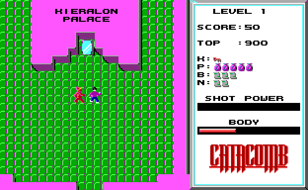
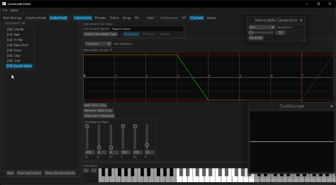
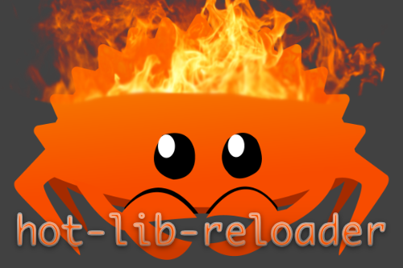
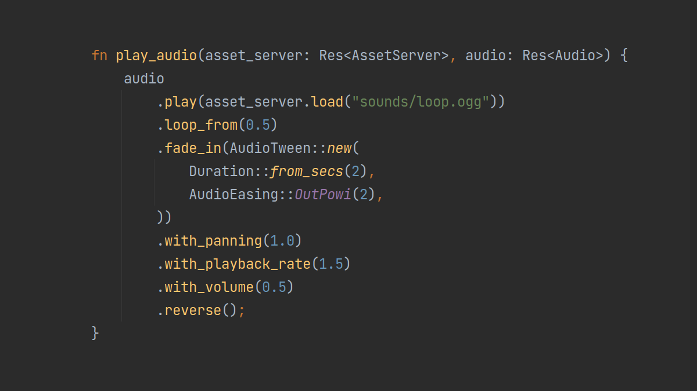
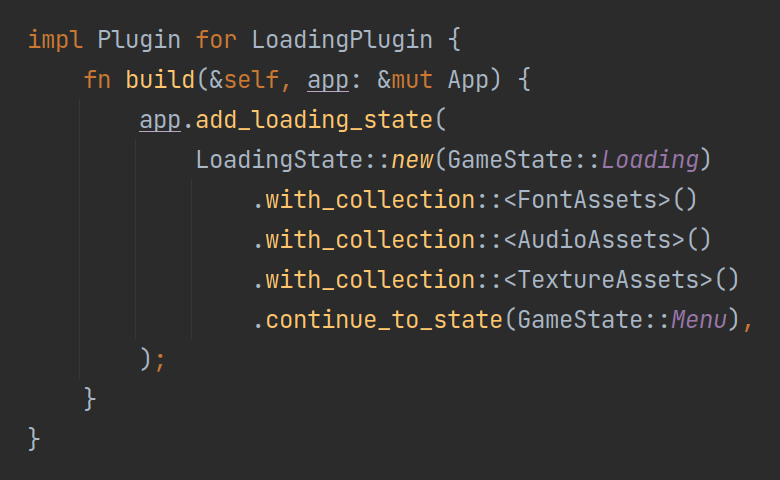

+++
title = "This Month in Rust GameDev #37 - August 2022"
transparent = true
date = 2022-09-05
draft = true
+++

<!-- no toc -->

<!-- Check the post with markdownlint-->

Welcome to the 37th issue of the Rust GameDev Workgroup's
monthly newsletter.
[Rust] is a systems language pursuing the trifecta:
safety, concurrency, and speed.
These goals are well-aligned with game development.
We hope to build an inviting ecosystem for anyone wishing
to use Rust in their development process!
Want to get involved? [Join the Rust GameDev working group!][join]

You can follow the newsletter creation process
by watching [the coordination issues][coordination].
Want something mentioned in the next newsletter?
[Send us a pull request][pr].
Feel free to send PRs about your own projects!

[Rust]: https://rust-lang.org
[join]: https://github.com/rust-gamedev/wg#join-the-fun
[pr]: https://github.com/rust-gamedev/rust-gamedev.github.io
[coordination]: https://github.com/rust-gamedev/rust-gamedev.github.io/issues?q=label%3Acoordination

- [Announcements](#announcements)
- [Game Updates](#game-updates)
- [Engine Updates](#engine-updates)
- [Learning Material Updates](#learning-material-updates)
- [Tooling Updates](#tooling-updates)
- [Library Updates](#library-updates)
- [Popular Workgroup Issues in Github](#popular-workgroup-issues-in-github)
- [Other News](#other-news)
- [Discussions](#discussions)
- [Requests for Contribution](#requests-for-contribution)
- [Jobs](#jobs)
- [Bonus](#bonus)

<!--
Ideal section structure is:

```
### [Title]


_image caption_

A paragraph or two with a summary and [useful links].

_Discussions:
[/r/rust](https://reddit.com/r/rust/todo),
[twitter](https://twitter.com/todo/status/123456)_

[Title]: https://first.link
[useful links]: https://other.link
```

If needed, a section can be split into subsections with a "------" delimiter.
-->

## Announcements

## Game Updates

### [Catacomb 2-64k][catacomb-2-repo]

[][catacomb-2-repo]

[Catacomb 2-64k][catacomb-2-repo] is a (completed) experimental
project in porting a moderately complex project, first from C to unsafe Rust,
then to (fully) safe Rust.

The objective of the project has been to study the tooling, transformations
and the overall process required perfom real-world, exact, ports; an article
will follow in September on [64kramsystem's blog][64ramsystem-blog].

The port uses the [Rust-SDL2 bindings][rust-sdl2-bindings]. More exact ports
of id Software games are expected in the future, with the introduction of a
refactoring tool based on the [Language Server Protocol][language-server-protocol]
/[Rust Analyzer][rust-analyzer].

[catacomb-2-repo]: https://github.com/64kramsystem/catacomb_ii-64k
[64ramsystem-blog]: https://saveriomiroddi.github.io
[rust-sdl2-bindings]: https://github.com/Rust-SDL2/rust-sdl2
[language-server-protocol]: https://microsoft.github.io/language-server-protocol
[rust-analyzer]: https://github.com/rust-lang/rust-analyzer

## Engine Updates

### [Gamercade]


_Preview of the Audio Editor in Action_

[Gamercade] ([Discord][Gamercade-Discord], [Github][Gamercade-Github])
by @RobDavenport is a WASM-powered fantasy console focused
on building multiplayer neo-retro games.

Gamercade is preparing for their first alpha release! This includes all the
core features needed for a fantasy console and game library: input, graphics,
and audio. It also has networked multiplayer, and an editor.

They implemented the in-game sound engine from scratch. They also improved the
editor to allow creation of instruments and tracks. It synthesizes sounds at
runtime, and produces something like an 80s synth, a 90s SoundBlaster, and a
touch of SNES. Songs and Sfx are built using a tracker interface.
[This video][Gamercade-Video] shows a small sample of what it is capable of.

"Wavetables" are great for classic sounds like 8-bit chiptunes or even more
complicated sounds. "FM Synth" is a 4-op FM synthesizer. Masters of this
technique can produce a huge variety of instruments, effects, and other 
otherwordly things. "Sampler" rounds out the rest of the system, providing 
pre-recorded sample playback. Samples can be pitched and played as the desired
note.

Come hang out and chat on [Discord][Gamercade-Discord], where the developers
interact with members and post updates daily. The project is
[open source][Gamercade-Github] and looking for contributors, suggestions,
as well as awesome game demos.

[Gamercade]: https://gamercade.io
[Gamercade-Discord]: https://discord.gg/Qafv2Fpt5j
[Gamercade-Github]: https://github.com/gamercade-io/gamercade_console
[Gamercade-Video]: https://www.youtube.com/watch?v=cRsOvefap_U

## Learning Material Updates

## Tooling Updates

## Library Updates

### [hot-lib-reloader]



[hot-lib-reloader] is a development tool that allows you to reload functions
of a running Rust program. This allows to do "live programming" where you
modify code and immediately see the effects in your running program. Gone
are the days of edit-compile-restart loops (to some degree).

hot-lib-reloader works by reloading parts of your application that are defined
as dynamic libraries. This approach works on Linux, MacOS, and Windows but has
some constraints - see the [documentation] for details. There are several
[examples], showing how to create hot-reload setups with various frameworks
and libraries, e.g. bevy, egui, and [nannou].

[hot-lib-reloader]: https://github.com/rksm/hot-lib-reloader-rs
[documentation]: https://docs.rs/hot-lib-reloader/latest/hot_lib_reloader/
[examples]: https://github.com/rksm/hot-lib-reloader-rs/tree/master/examples
[nannou]: https://youtu.be/hyyeLtJ7SQk

### [bevy_kira_audio]


_Configuring a sound when playing it_

[bevy_kira_audio] by [@nikl_me] is an alternative audio plugin for the [Bevy]
game engine. It uses [Kira] as its audio library and aims to integrate
well with Bevy's ECS.

Last month saw the release of versions [0.11.0] and [0.12.0]. With the
latest version, sound settings like volume, playback-rate, or panning can
be adjusted directly when playing audio. The screenshot above shows the new API
with multiple example settings. The plugin now also offers control
over single sound instances via asset handles and will apply configurable
tweens to most operations.

[bevy_kira_audio]: https://github.com/NiklasEi/bevy_kira_audio/
[Kira]: https://github.com/tesselode/kira
[@nikl_me]: https://twitter.com/nikl_me
[Bevy]: https://bevyengine.org/
[0.11.0]: https://github.com/NiklasEi/bevy_kira_audio/blob/main/CHANGELOG.md#v0110
[0.12.0]: https://github.com/NiklasEi/bevy_kira_audio/blob/main/CHANGELOG.md#v0120

### [bevy_asset_loader]


_Configuration of a loading state_

[bevy_asset_loader] by [@nikl_me] is a plugin for [Bevy] apps aiming to
improve a common pattern for asset-loading. The boilerplate required to set up
a loading-state is reduced to a minimum. The plugin is based on storing
asset handles in resources, which makes it easy to use them in any system
across your app.

The screenshot above shows how a loading state can be added to the Bevy app
in the latest version of the plugin. The update also fixed issues with
configuring the same loading state in different places of your code and enabled
users to define their own dynamic assets.

[@nikl_me]: https://twitter.com/nikl_me
[bevy_asset_loader]: https://github.com/NiklasEi/bevy_asset_loader/
[Bevy]: https://bevyengine.org/

## Popular Workgroup Issues in Github

<!-- Up to 10 links to interesting issues -->

## Other News

<!-- One-liners for plan items that haven't got their own sections. -->

## Discussions

<!-- Links to handpicked reddit/twitter/urlo/etc threads that provide
useful information -->

## Requests for Contribution

<!-- Links to "good first issue"-labels or direct links to specific tasks -->

## Jobs

<!-- An optional section for new jobs related to Rust gamedev -->

## Bonus

<!-- Bonus section to make the newsletter more interesting
and highlight events from the past. -->

------

That's all news for today, thanks for reading!

Want something mentioned in the next newsletter?
[Send us a pull request][pr].

Also, subscribe to [@rust_gamedev on Twitter][@rust_gamedev]
or [/r/rust_gamedev subreddit][/r/rust_gamedev] if you want to receive fresh news!

<!--
TODO: Add real links and un-comment once this post is published
**Discuss this post on**:
[/r/rust_gamedev](TODO),
[Twitter](TODO),
[Discord](https://discord.gg/yNtPTb2).
-->

[/r/rust_gamedev]: https://reddit.com/r/rust_gamedev
[@rust_gamedev]: https://twitter.com/rust_gamedev
