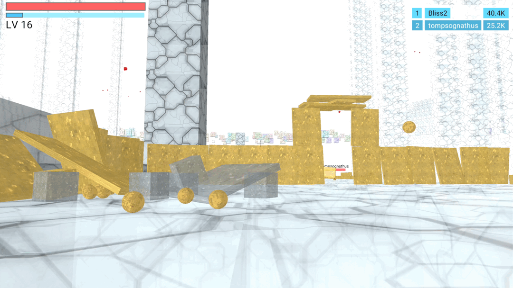
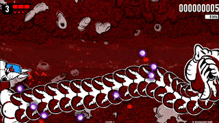
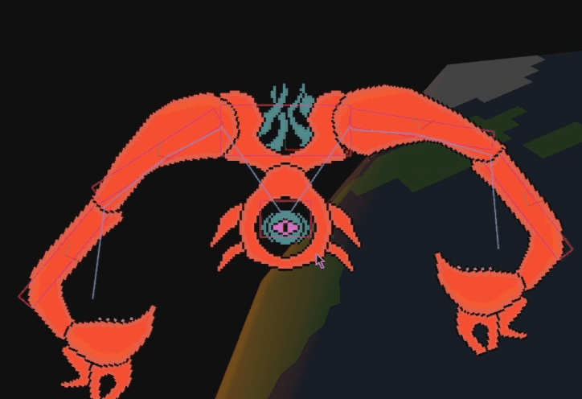
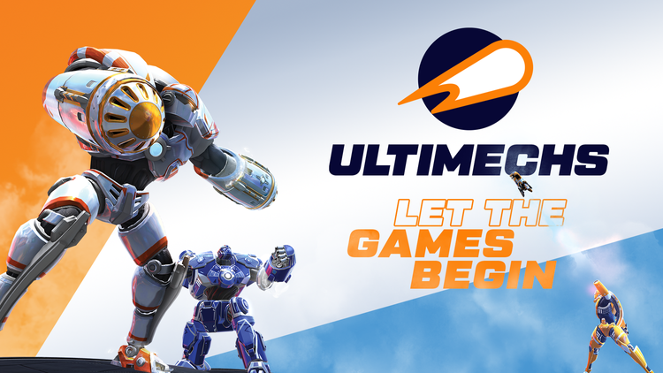
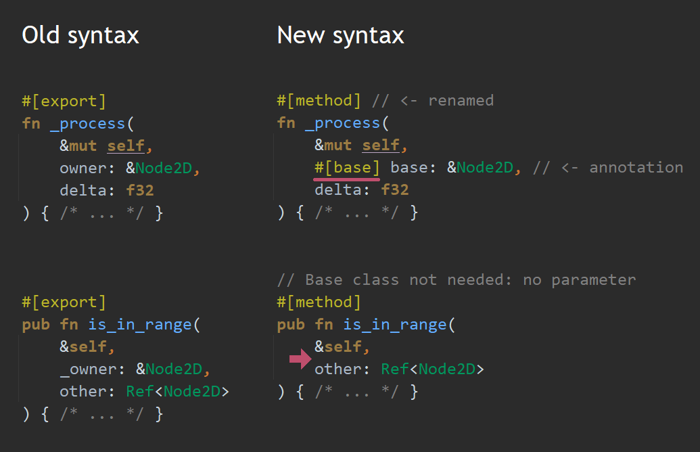
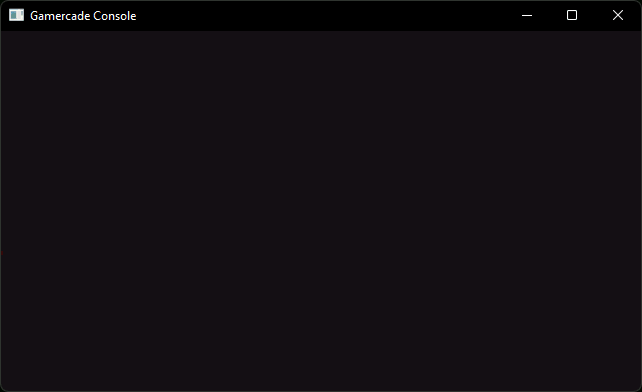
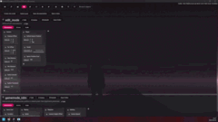
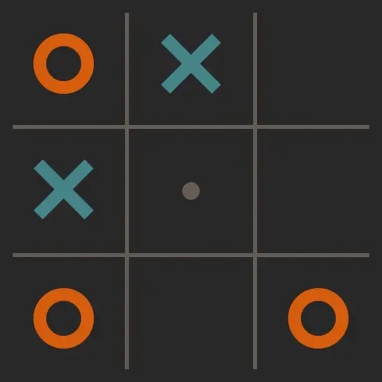
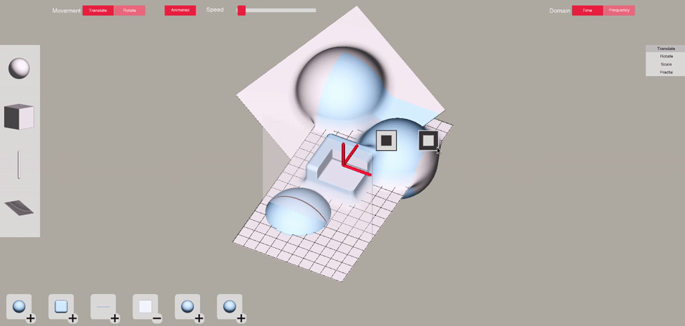
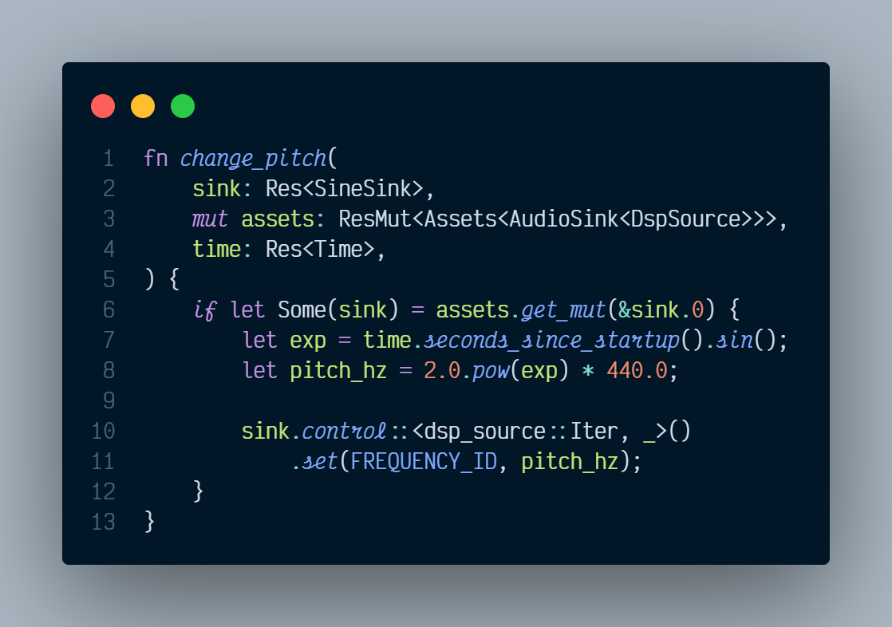

+++
title = "This Month in Rust GameDev #38 - September 2022"
transparent = true
date = 2022-10-08
draft = true
+++

<!-- no toc -->

<!-- Check the post with markdownlint-->

Welcome to the 38th issue of the Rust GameDev Workgroup's
monthly newsletter.
[Rust] is a systems language pursuing the trifecta:
safety, concurrency, and speed.
These goals are well-aligned with game development.
We hope to build an inviting ecosystem for anyone wishing
to use Rust in their development process!
Want to get involved? [Join the Rust GameDev working group!][join]

You can follow the newsletter creation process
by watching [the coordination issues][coordination].
Want something mentioned in the next newsletter?
[Send us a pull request][pr].
Feel free to send PRs about your own projects!

[Rust]: https://rust-lang.org
[join]: https://github.com/rust-gamedev/wg#join-the-fun
[pr]: https://github.com/rust-gamedev/rust-gamedev.github.io
[coordination]: https://github.com/rust-gamedev/rust-gamedev.github.io/issues?q=label%3Acoordination

- [Announcements](#announcements)
- [Game Updates](#game-updates)
- [Engine Updates](#engine-updates)
- [Learning Material Updates](#learning-material-updates)
- [Tooling Updates](#tooling-updates)
- [Library Updates](#library-updates)
- [Other News](#other-news)
- [Popular Workgroup Issues in Github](#popular-workgroup-issues-in-github)
- [Discussions](#discussions)
- [Requests for Contribution](#requests-for-contribution)
- [Jobs](#jobs)
- [Bonus](#bonus)

<!--
Ideal section structure is:

```
### [Title]


_image caption_

A paragraph or two with a summary and [useful links].

_Discussions:
[/r/rust](https://reddit.com/r/rust/todo),
[twitter](https://twitter.com/todo/status/123456)_

[Title]: https://first.link
[useful links]: https://other.link
```

If needed, a section can be split into subsections with a "------" delimiter.
-->

## Announcements

## Game Updates

### [CyberGate][cybergate-yt]


_building shelter and fighting a colony of red monsters_

CyberGate ([YouTube][cybergate-yt], [Discord][cybergate-dis]) by CyberSoul
is an attempt to use artificial intelligence to build diverse universe experiences
with strange creatures and procedural gameplay styles.
Currently in Phase 5.2 (analogously version 0.5.2),
they finalized a playable game with the tech they have developed up until now.

Recent updates:

- In-house Transport layer with Reliability and Package aggregation, over WebRTC
- Implemented Winit background process on all browsers
- Introduced Grabbing and Building Mechanics
- Created enemy AI that groups and flies in colonies. Includes a deadly night mode
- Usernames and life points with Fontdue.rs
- Menu and leaderboard using yakui.rs
- Improved the Automation to push Server Updates
- Improved wasm related performance, latency, and connection freezing bugs.

[Join the Discord server][cybergate-dis] to participate in upcoming Phase 6.0!

_Discussions: [/r/rust_gamedev](https://www.reddit.com/r/rust_gamedev/comments/xo03s5/cybergate_release_5_webrtc_multiplayer_with/)_

[cybergate-yt]: https://youtube.com/channel/UClrsOso3Xk2vBWqcsHC3Z4Q
[cybergate-dis]: https://discord.gg/R7DkHqw7zJ

### [Graviton][graviton-website]


_Take a little break to relax and draw some sand art_

[Graviton](https://www.gravitongame.art/) by
[@hakolao](https://github.com/hakolao)
is a relaxing simulation game in which you draw colored sand and watch it
interact with gravity.

The game is going to be released in early access on
[Steam](https://store.steampowered.com/app/2137280/Graviton__A_Relaxing_Sand_Simulation/?utm_source=rust_gamedev&utm_medium=web)
during this October.

_Discussions: [/r/rust_gamedev](https://www.reddit.com/r/rust_gamedev/comments/xfqd2t/graviton_relaxing_sand_art)_

[graviton-website]: https://www.gravitongame.art/

### Flesh


_4th area_

[Flesh] by [@im_oab] is a 2D-horizontal shmup game with hand-drawn animation and
an organic/fleshy theme. It is implemented using [Tetra]. This month's updates
include:

- Finishing up the last area of the game.
- Making animation of the game's intro/ending.

[Flesh]: https://store.steampowered.com/app/1660850/Flesh/
[@im_oab]: https://twitter.com/im_oab
[Tetra]: https://github.com/17cupsofcoffee/tetra

### Thetawave


_First boss in progress_

Thetawave is a physics based, cosmic horror themed space shooter by
[@carlosupina].
In the past month, work has begun on the first boss enemy in the game,
the [Repeater].

Thetawave has also joined the [@spicylobsterfam] incubator.
Feel free to reach out to the developer
if you are interested in contributing!

[Repeater]: https://twitter.com/carlosupina/status/1572976552165474307
[@carlosupina]: https://twitter.com/carlosupina
[@spicylobsterfam]: https://twitter.com/spicylobsterfam

### [Ultimechs]



[Ultimechs]
([Discord](https://discord.com/invite/srX92DRt9G),
[Twitter](https://twitter.com/ultimechs),
[Facebook](https://www.facebook.com/Ultimechs/),
[Reddit](https://www.reddit.com/r/Ultimechs/),
[YouTube](https://www.youtube.com/channel/UC6t6delBJRxnaBcqBPpC3Gg))
by [Resolution Games](https://www.resolutiongames.com)
is a future sports game played with mechs.
It is VR, multiplayer, and free to play.

Ultimechs is partially written in Rust.
The Rust code is for the core of the game, including the game rules,
networking, and physics (that use [Rapier]).
The rest of the game, including the graphics, audio, user input,
and everything that happens outside the arena,
is made in [Unity](https://unity.com/).

The game was released on the 15th of September
on the [Meta Quest 2][ultimechs-quest] and [SteamVR][ultimechs-steamvr].

There is [a conference talk][ultimechs-talk]
and [a blog post][ultimechs-post]
about the choice of Rust and how they combined Rust with the studio's
standard tools Unity and C#.
[Another blog post][ultimechs-post-2]
goes into more depth about calling Rust code from C# in Unity.

[Ultimechs]: https://www.resolutiongames.com/ultimechs
[ultimechs-quest]: https://www.oculus.com/experiences/quest/5118731164870081/
[ultimechs-steamvr]: https://store.steampowered.com/app/1657780/Ultimechs/
[Rapier]: https://www.rapier.rs/
[ultimechs-talk]: https://www.youtube.com/watch?v=nLCNsIs1-ZU
[ultimechs-post]: https://www.resolutiongames.com/blog/programming-a-vr-game-using-rust
[ultimechs-post-2]: https://www.resolutiongames.com/blog/calling-rust-from-c-in-unity

### [eo.rs][eo-rs-website]


_NPCs chatting in the game world_

[eo-rs][eo-rs-website] by [@sorokya](https://github.com/sorokya)
is a development library and game server for the MMORPG
[Endless Online](https://www.endless-online.com).

Recent updates:

- Made NPCs appear and move around in the game world
- Created a proxy tool to document interactions between the original client and server
- Implemented player stat calculations
- Made NPCs talk

[eo-rs-website]: https://eo-rs.dev

## Engine Updates

### [godot-rust][gd-github]


_The new `#[method]` syntax, which replaces existing `#[export]` and allows omitting
the base parameter._

godot-rust ([GitHub][gd-github], [Discord][gd-discord], [Twitter][gd-twitter])
is a Rust library that provides bindings for the Godot engine.
In September, development was divided into three tasks:

- Maintenance releases [0.10.1][gd-0.10.1] and [0.10.2][gd-0.10.2]
- Godot 3.5 support in v0.11 ([#910][gd-910])
- Ongoing [GDExtension][gd-gdext] efforts ([#824][gd-824])

Besides support for Godot 3.5.1, a change that many users will notice is the
new `#[method]` + `#[base]` syntax, replacing `#[export]` as illustrated above.

The GDExtension/Rust binding has finally reached a state where a first
experimental version is within reach in October. If you are fine with the
bugs and missing features, you can give it a try very soon!

[gd-0.10.1]: https://github.com/godot-rust/godot-rust/pulls?q=is%3Apr+milestone%3Av0.10.1
[gd-0.10.2]: https://github.com/godot-rust/godot-rust/pulls?q=is%3Apr+milestone%3Av0.10.2
[gd-824]: https://github.com/godot-rust/godot-rust/issues/824
[gd-910]: https://github.com/godot-rust/godot-rust/issues/910
[gd-github]: https://github.com/godot-rust/godot-rust
[gd-discord]: https://discord.gg/aKUCJ8rJsc
[gd-twitter]: https://twitter.com/GodotRust
[gd-gdext]: https://godotengine.org/article/introducing-gd-extensions

### [Gamercade]


_Gamercade Sprite Animations_

[Gamercade] ([Discord][Gamercade-Discord], [Github][Gamercade-Github])
by @RobDavenport is a WASM-powered fantasy console focused
on building multiplayer neo-retro games.

Gamercade has launched their first official release! Version `0.1.0` has
all of the functions and features need to start building awesome single-
and multi-player games: input, graphics, audo, networking, and more.
[The full release article][Gamercade-Release] goes into higher detail about
the feature set of Gamercade, and includes example images and animations.

Full controller support made it into the `0.1.0` release, including analog
sticks, analog triggers, as well as emulation of those for those without
a game pad. Additionally, they added a command line tool, called `gccl` which
streamlines many of the pain points in developing Gamercade games. A number of
quality-of-life and bug fixes also made it into the release.

The team is already planning out their feature set for the next release, `0.2.0`,
which is based around the theme of "two." The next release will include more
multiplayer features like two or more local players, two or more networked instances,
stereo sound support, and much more.

Come hang out and chat on [Discord][Gamercade-Discord], where the developers
interact with members and post updates daily. The project is
[open source][Gamercade-Github] and looking for contributors, suggestions,
as well as your awesome game creations.

[Gamercade]: https://gamercade.io
[Gamercade-Discord]: https://discord.gg/Qafv2Fpt5j
[Gamercade-Github]: https://github.com/gamercade-io/gamercade_console
[Gamercade-Release]: https://gamercade.io/blog/gamercade-0-1-0

### [Dims][dims-website]



[Dims][dims-website] ([Twitter][dims-twitter], [Discord][dims-discord],
[YouTube][dims-youtube]) is a pre-alpha collaborative open-world
creation platform.
Users can hop in sessions and build a game together, allowing everyone
to bring out their inner game-maker.

In September, the platform continued to make steady progress, with new features
and bugfixes being made on a daily basis. The highlights are:

- The team's very first game of entirely scripted multiplayer Team Deathmatch 🎉
- All player logic was moved to the Rust scripting layer, allowing for it to be
  changed on the fly
- The implementation of animation retargeting, so you can use any animation with
  any model, as long as they share the same skeletal structure
- Scripting now has greater access to the ECS, allowing it to move the sun 🌅
- Initial work on an asset database and pipeline, so that you can import any
  asset and use it amongst your Dims projects
- An all-new object manipulation/placement tool suite
  - Objects can now be consistently stacked, moved as a group, placed within
    each other, and more!
- Many other infrastructural changes and improvements, including macOS and
  Linux builds

Want to try Dims out for yourself? Come join the [Discord][dims-discord] to be
notified of future public tests, see the latest features before everyone else,
and to talk to the devs personally.

[dims-website]: https://dims.co
[dims-twitter]: https://twitter.com/DimsWorlds
[dims-discord]: https://discord.gg/Z5CAVmNE57
[dims-youtube]: https://youtube.com/channel/UCR5gOwS7uSl0a0dl7MLQoqg

## Learning Material Updates

### [Making a turn-based multiplayer game in Rust][tbs-tutrial-1]



@herluf-ba published a beginner friendly [3 part tutorial series][tbs-tutrial-1]
about making turn-based multiplayer games using rust.
It covers what games can be considered "turn-based",
how to write a simple but neat game server using [renet],
and finally how to tie it all together with a client app made with [bevy].

[tbs-tutrial-1]: https://herluf-ba.github.io/making-a-turn-based-multiplayer-game-in-rust-01-whats-a-turn-based-game-anyway.html
[renet]: https://github.com/lucaspoffo/renet
[bevy]: https://github.com/bevyengine/bevy

## Tooling Updates

### Feldversuch



Feldversuch by [@siebencorgie](https://twitter.com/siebencorgie)
is an experimental extension to the class of wavetable
synthesizers based on signed distance fields.

Feldversuch uses user defined fields not only to render the
interface, but to generate sound based on them as well. The
so-called *sampling plane* (seen moving back and forth above)
defines the wave shape that is played back.

Further experiments include rotation (instead of the sweep
movement) as well as different interpretations of the wave
shape. Have a look at the [presentation video](https://www.youtube.com/watch?v=GZVdzcwSEaw)
and the [blog post](https://siebencorgie.rs/gallery/feldversuch/)
for further details.

## Library Updates

### bevy_oddio


_an example using bevy_oddio_

[bevy_oddio] by [@harudagondi] is an audio plugin
for the [Bevy] game engine that uses the [oddio] library.
It aims to allow first class support of non-static audio sources
like procedurally generated audio.
The library also aims to have a high amount of flexibility
in controlling custom audio sources where typical audio sink methods
would not suffice.

The previous month saw a new [0.2.0][bevy_oddio_02] release which
irons out some bugs and added new ergonomic features to allow a
better user experience. There is now added support for `Mono`
and `Stereo` audio sources, support for more [oddio]
types, a new example for controlling volume, and much more.
A lot of the APIs have been reworked to make it more flexible
and some public items were deleted to reduce redundancy.

The above screen shows an example of controlling a custom made audio source
([taken from here][bevy_fundsp_example]) by calling the .control() method.

[bevy_oddio]: https://github.com/harudagondi/bevy_oddio
[@harudagondi]: https://twitter.com/harudagondi
[Bevy]: https://bevyengine.org/
[oddio]: https://github.com/Ralith/oddio
[bevy_oddio_02]: https://github.com/harudagondi/bevy_oddio/releases/tag/v0.2.0
[bevy_fundsp_example]: https://github.com/harudagondi/bevy_fundsp/blob/ca08963820c83dd723784db6c6f87df8eadd60e0/examples/oddio/controlled.rs#L40-L52

### [Particular]

  
_Showcase using the [demo]_

[Particular] by [@Canleskis] is a library allowing for simulations of
N-body gravitational interaction of particles. It aims to be simple
to integrate in existing game and physics engines, such as [Bevy] or [Rapier].
See the [demo source code] for the example of an integration (less than 50
actual lines of code!).
The [demo] is available on the browser (Chromium-based recommended)
with various scenes you can interact with.

Particular can be used with [rayon] to leverage multithreading on the
CPU (`parallel` feature). Although the current algorithm performs well enough
for most use cases, with a single frame taking around 5 ms with 5000 particles
on an I9 9900K, future updates will introduce other implementations to allow for
faster computation of the forces (example: [Barnes-Hut]).

You can find more about Particular with
[this video](https://www.youtube.com/watch?v=oFrq9ckHoN8&) from
[@ChristopherBiscardi](https://github.com/ChristopherBiscardi), or
[this post](https://www.reddit.com/r/rust/comments/x7uhoq/media_particular_a_simple_library_for_nbody/)
on Reddit.

[Particular]: https://github.com/Canleskis/particular
[demo]: https://canleskis.github.io/bevy-particular-demo/
[demo source code]: https://github.com/Canleskis/bevy-particular-demo/blob/main/src/nbody.rs
[@Canleskis]: https://github.com/Canleskis
[rayon]: https://github.com/rayon-rs/rayon
[Barnes-Hut]: https://en.wikipedia.org/wiki/Barnes%E2%80%93Hut_simulation

## Popular Workgroup Issues in Github

<!-- Up to 10 links to interesting issues -->

## Other News

<!-- One-liners for plan items that haven't got their own sections. -->

- Other library updates
  - [big-brain](https://github.com/zkat/big-brain) released [version 0.14](https://github.com/zkat/big-brain/releases/tag/v0.14.0)
    of its Utility AI library, with fixes and lots more observability improvements.

## Discussions

<!-- Links to handpicked reddit/twitter/urlo/etc threads that provide
useful information -->

## Requests for Contribution

<!-- Links to "good first issue"-labels or direct links to specific tasks -->

## Jobs

<!-- An optional section for new jobs related to Rust gamedev -->

## Bonus

<!-- Bonus section to make the newsletter more interesting
and highlight events from the past. -->

------

That's all news for today, thanks for reading!

Want something mentioned in the next newsletter?
[Send us a pull request][pr].

Also, subscribe to [@rust_gamedev on Twitter][@rust_gamedev]
or [/r/rust_gamedev subreddit][/r/rust_gamedev] if you want to receive fresh news!

<!--
TODO: Add real links and un-comment once this post is published
**Discuss this post on**:
[/r/rust_gamedev](TODO),
[Twitter](TODO),
[Discord](https://discord.gg/yNtPTb2).
-->

[/r/rust_gamedev]: https://reddit.com/r/rust_gamedev
[@rust_gamedev]: https://twitter.com/rust_gamedev
