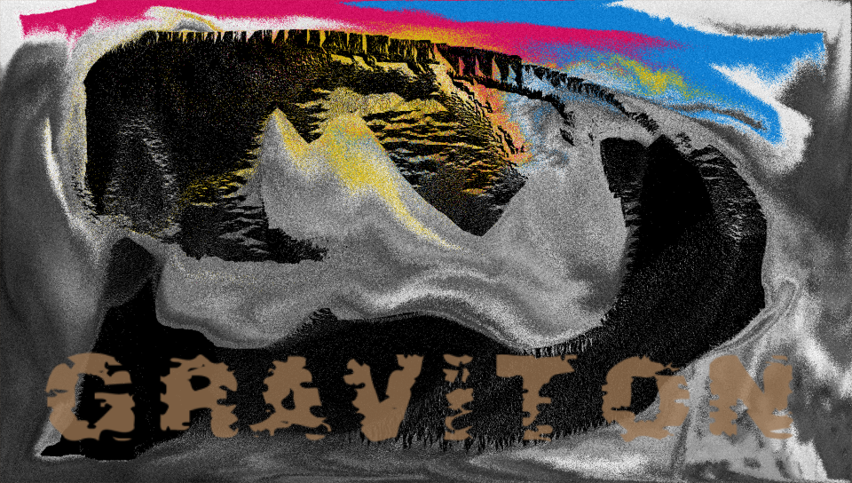

+++
title = "This Month in Rust GameDev #38 - September 2022"
transparent = true
date = 2022-10-08
draft = true
+++

<!-- no toc -->

<!-- Check the post with markdownlint-->

Welcome to the 38th issue of the Rust GameDev Workgroup's
monthly newsletter.
[Rust] is a systems language pursuing the trifecta:
safety, concurrency, and speed.
These goals are well-aligned with game development.
We hope to build an inviting ecosystem for anyone wishing
to use Rust in their development process!
Want to get involved? [Join the Rust GameDev working group!][join]

You can follow the newsletter creation process
by watching [the coordination issues][coordination].
Want something mentioned in the next newsletter?
[Send us a pull request][pr].
Feel free to send PRs about your own projects!

[Rust]: https://rust-lang.org
[join]: https://github.com/rust-gamedev/wg#join-the-fun
[pr]: https://github.com/rust-gamedev/rust-gamedev.github.io
[coordination]: https://github.com/rust-gamedev/rust-gamedev.github.io/issues?q=label%3Acoordination

- [Announcements](#announcements)
- [Game Updates](#game-updates)
- [Engine Updates](#engine-updates)
- [Learning Material Updates](#learning-material-updates)
- [Tooling Updates](#tooling-updates)
- [Library Updates](#library-updates)
- [Other News](#other-news)
- [Popular Workgroup Issues in Github](#popular-workgroup-issues-in-github)
- [Discussions](#discussions)
- [Requests for Contribution](#requests-for-contribution)
- [Jobs](#jobs)
- [Bonus](#bonus)

<!--
Ideal section structure is:

```
### [Title]


_image caption_

A paragraph or two with a summary and [useful links].

_Discussions:
[/r/rust](https://reddit.com/r/rust/todo),
[twitter](https://twitter.com/todo/status/123456)_

[Title]: https://first.link
[useful links]: https://other.link
```

If needed, a section can be split into subsections with a "------" delimiter.
-->

## Announcements

## Game Updates

### [CyberGate][cybergate-yt]


_building shelter and fighting a colony of red monsters_

CyberGate ([YouTube][cybergate-yt], [Discord][cybergate-dis]) by CyberSoul
is an attempt to use artificial intelligence to build diverse universe experiences
with strange creatures and procedural gameplay styles.
Currently in Phase 5.2 (analogously version 0.5.2),
they finalized a playable game with the tech they have developed up until now.

Recent updates:

- In-house Transport layer with Reliability and Package aggregation, over WebRTC
- Implemented Winit background process on all browsers
- Introduced Grabbing and Building Mechanics
- Created enemy AI that groups and flies in colonies. Includes a deadly night mode
- Usernames and life points with Fontdue.rs
- Menu and leaderboard using yakui.rs
- Improved the Automation to push Server Updates
- Improved wasm related performance, latency, and connection freezing bugs.

[Join the Discord server][cybergate-dis] to participate in upcoming Phase 6.0!

_Discussions: [/r/rust_gamedev](https://www.reddit.com/r/rust_gamedev/comments/xo03s5/cybergate_release_5_webrtc_multiplayer_with/)_

[cybergate-yt]: https://youtube.com/channel/UClrsOso3Xk2vBWqcsHC3Z4Q
[cybergate-dis]: https://discord.gg/R7DkHqw7zJ

### [Graviton][graviton-website]


_Take a little break to relax and draw some sand art_

[Graviton](https://www.gravitongame.art/) by
[@hakolao](https://github.com/hakolao)
is a relaxing simulation game in which you draw colored sand and watch it
interact with gravity.

The game is going to be released in early access on
[Steam](https://store.steampowered.com/app/2137280/Graviton__A_Relaxing_Sand_Simulation/?utm_source=rust_gamedev&utm_medium=web)
during this October.

_Discussions: [/r/rust_gamedev](https://www.reddit.com/r/rust_gamedev/comments/xfqd2t/graviton_relaxing_sand_art)_

[graviton-website]: https://www.gravitongame.art/

### Flesh


_4th area_

[Flesh] by [@im_oab] is a 2D-horizontal shmup game with hand-drawn animation and
an organic/fleshy theme. It is implemented using [Tetra]. This month's updates
include:

- Finishing up the last area of the game.
- Making animation of the game's intro/ending.

[Flesh]: https://store.steampowered.com/app/1660850/Flesh/
[@im_oab]: https://twitter.com/im_oab
[Tetra]: https://github.com/17cupsofcoffee/tetra

## Engine Updates

### [godot-rust][gd-github]


_The new `#[method]` syntax, which replaces existing `#[export]` and allows omitting
the base parameter._

godot-rust ([GitHub][gd-github], [Discord][gd-discord], [Twitter][gd-twitter])
is a Rust library that provides bindings for the Godot engine.
In September, development was divided into three tasks:

- Maintenance releases [0.10.1][gd-0.10.1] and [0.10.2][gd-0.10.2]
- Godot 3.5 support in v0.11 ([#910][gd-910])
- Ongoing [GDExtension][gd-gdext] efforts ([#824][gd-824])

Besides support for Godot 3.5.1, a change that many users will notice is the
new `#[method]` + `#[base]` syntax, replacing `#[export]` as illustrated above.

The GDExtension/Rust binding has finally reached a state where a first
experimental version is within reach in October. If you are fine with the
bugs and missing features, you can give it a try very soon!

[gd-0.10.1]: https://github.com/godot-rust/godot-rust/pulls?q=is%3Apr+milestone%3Av0.10.1
[gd-0.10.2]: https://github.com/godot-rust/godot-rust/pulls?q=is%3Apr+milestone%3Av0.10.2
[gd-824]: https://github.com/godot-rust/godot-rust/issues/824
[gd-910]: https://github.com/godot-rust/godot-rust/issues/910
[gd-github]: https://github.com/godot-rust/godot-rust
[gd-discord]: https://discord.gg/aKUCJ8rJsc
[gd-twitter]: https://twitter.com/GodotRust
[gd-gdext]: https://godotengine.org/article/introducing-gd-extensions

## Learning Material Updates

### [Making a turn-based multiplayer game in Rust][tbs-tutrial-1]


@herluf-ba published a beginner friendly [3 part tutorial series][tbs-tutrial-1]
about making turn-based multiplayer games using rust.
It covers what games can be considered "turn-based",
how to write a simple but neat game server using [renet],
and finally how to tie it all together with a client app made with [bevy].

[tbs-tutrial-1]: https://herluf-ba.github.io/making-a-turn-based-multiplayer-game-in-rust-01-whats-a-turn-based-game-anyway.html
[renet]: https://github.com/lucaspoffo/renet
[bevy]: https://github.com/bevyengine/bevy

## Tooling Updates

### Feldversuch


Feldversuch by [@siebencorgie](https://twitter.com/siebencorgie)
is an experimental extension to the class of wavetable
synthesizers based on signed distance fields.

Feldversuch uses user defined fields not only to render the
interface, but to generate sound based on them as well. The
so-called *sampling plane* (seen moving back and forth above)
defines the wave shape that is played back.

Further experiments include rotation (instead of the sweep
movement) as well as different interpretations of the wave
shape. Have a look at the [presentation video](https://www.youtube.com/watch?v=GZVdzcwSEaw)
and the [blog post](https://siebencorgie.rs/gallery/feldversuch/)
for further details.

## Library Updates

## Popular Workgroup Issues in Github

<!-- Up to 10 links to interesting issues -->

## Other News

<!-- One-liners for plan items that haven't got their own sections. -->

- Other library updates
  - [big-brain](https://github.com/zkat/big-brain) released [version 0.14](https://github.com/zkat/big-brain/releases/tag/v0.14.0)
    of its Utility AI library, with fixes and lots more observability improvements.

## Discussions

<!-- Links to handpicked reddit/twitter/urlo/etc threads that provide
useful information -->

## Requests for Contribution

<!-- Links to "good first issue"-labels or direct links to specific tasks -->

## Jobs

<!-- An optional section for new jobs related to Rust gamedev -->

## Bonus

<!-- Bonus section to make the newsletter more interesting
and highlight events from the past. -->

------

That's all news for today, thanks for reading!

Want something mentioned in the next newsletter?
[Send us a pull request][pr].

Also, subscribe to [@rust_gamedev on Twitter][@rust_gamedev]
or [/r/rust_gamedev subreddit][/r/rust_gamedev] if you want to receive fresh news!

<!--
TODO: Add real links and un-comment once this post is published
**Discuss this post on**:
[/r/rust_gamedev](TODO),
[Twitter](TODO),
[Discord](https://discord.gg/yNtPTb2).
-->

[/r/rust_gamedev]: https://reddit.com/r/rust_gamedev
[@rust_gamedev]: https://twitter.com/rust_gamedev
