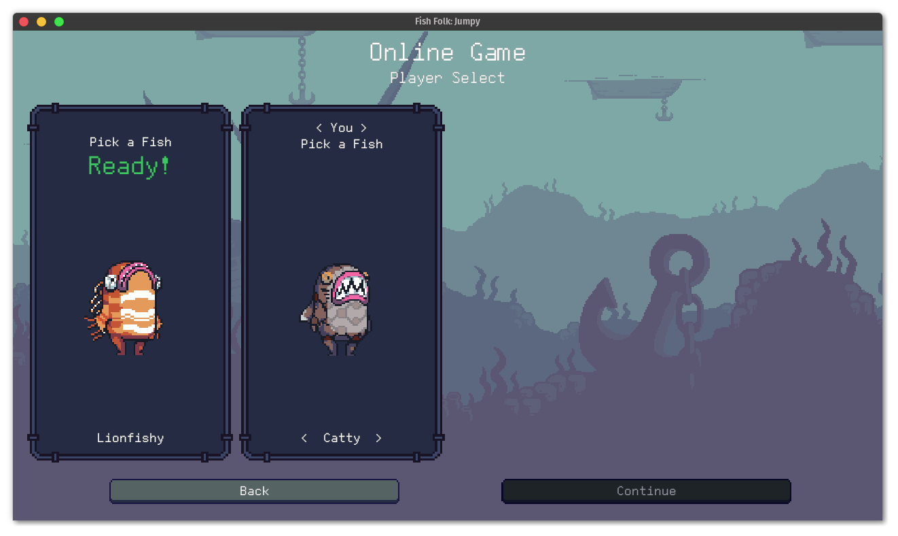
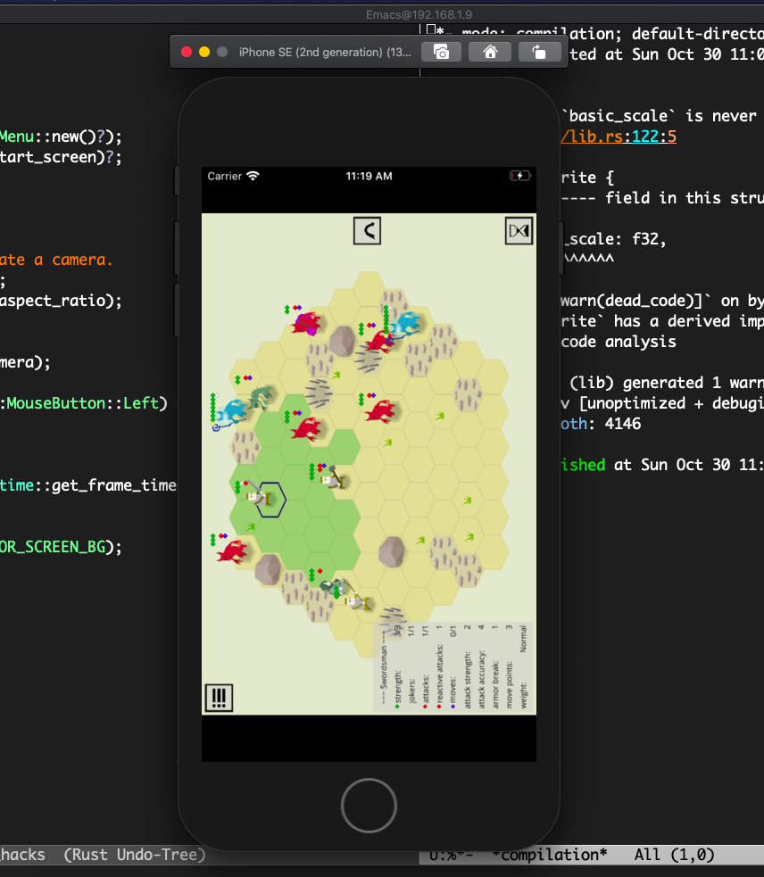

+++
title = "This Month in Rust GameDev #39 - October 2022"
transparent = true
date = 2022-11-01
draft = true
+++

<!-- no toc -->

<!-- Check the post with markdownlint-->

Welcome to the 39th issue of the Rust GameDev Workgroup's
monthly newsletter.
[Rust] is a systems language pursuing the trifecta:
safety, concurrency, and speed.
These goals are well-aligned with game development.
We hope to build an inviting ecosystem for anyone wishing
to use Rust in their development process!
Want to get involved? [Join the Rust GameDev working group!][join]

You can follow the newsletter creation process
by watching [the coordination issues][coordination].
Want something mentioned in the next newsletter?
[Send us a pull request][pr].
Feel free to send PRs about your own projects!

[Rust]: https://rust-lang.org
[join]: https://github.com/rust-gamedev/wg#join-the-fun
[pr]: https://github.com/rust-gamedev/rust-gamedev.github.io
[coordination]: https://github.com/rust-gamedev/rust-gamedev.github.io/issues?q=label%3Acoordination

- [Announcements](#announcements)
- [Game Updates](#game-updates)
- [Engine Updates](#engine-updates)
- [Learning Material Updates](#learning-material-updates)
- [Tooling Updates](#tooling-updates)
- [Library Updates](#library-updates)
- [Other News](#other-news)
- [Popular Workgroup Issues in Github](#popular-workgroup-issues-in-github)
- [Meeting Minutes](#meeting-minutes)
- [Discussions](#discussions)
- [Requests for Contribution](#requests-for-contribution)
- [Jobs](#jobs)
- [Bonus](#bonus)

<!--
Ideal section structure is:

```
### [Title]


_image caption_

A paragraph or two with a summary and [useful links].

_Discussions:
[/r/rust](https://reddit.com/r/rust/todo),
[twitter](https://twitter.com/todo/status/123456)_

[Title]: https://first.link
[useful links]: https://other.link
```

If needed, a section can be split into subsections with a "------" delimiter.
-->

## Announcements

## Game Updates

### miam


[miam] ([GitHub][miam-src]) by [yopox], [on100balec], and [hadri]
is a cooking game made for the Ludum Dare 51.
"miam" is the French interjection for "yum".

The theme of the game jam was "Every 10 seconds".
Here instead of having 10 seconds to make a burger,
the chef is really indecisive and comes to change
the menu every 10 seconds.

The game was built using Bevy 0.8 with [bevy_game_template]
to save precious time when starting the game jam.
[bevy_tweening] was also really useful to polish the game.

The game was ranked 120th overall and 94th for audio out of 1240 jam entries.

_Discussions: [Submission page](https://ldjam.com/events/ludum-dare/51/miam)_

[miam]: https://yopox.itch.io/miam
[miam-src]: https://www.github.com/yopox/LD51
[yopox]: https://mstdn.social/@yopox
[on100balec]: https://soundcloud.com/jmen_balec
[hadri]: https://github.com/HadrienRenaud
[bevy_game_template]: https://github.com/NiklasEi/bevy_game_template
[bevy_tweening]: https://github.com/djeedai/bevy_tweening

### [Jumpy]


_Online Game Fish Selection Screen_

[Jumpy] ([GitHub][Jumpy], [Discord][jumpy_discord], [Twitter][jumpy_twitter]) by
[Spicy Lobster][spicy_lobster] is a pixel-style, tactical 2D shooter with a fishy
theme.

In the last month,
the devs started [rewriting][jumpy_rewrite] Jumpy to use the [Bevy] game engine.
Massive progress has been made,
establishing foundational features such as input mapping, UI, and localization,
along with the addition of a few major features:

- Network play, complete with a matchmaking server for joining public games online.
- A scripting engine using TypeScript/JavaScript powered by [`bevy_mod_js_scripting`].
- A revamped map editor that renders the actual game in the viewport.
  This lets you switch back and forth between editing and playing,
  and has the potential for multiplayer map editing in the future.

The physics have been ported from the old version of the game
with the basic gameplay and the sword item nearly finished.
The next tasks include porting some of the old items to the new scripting system
and finishing off the map editor's editing functionality.

_Discussions: [GitHub][jumpy_discussions], [Twitter][jumpy_twitter]_

[Jumpy]: https://github.com/fishfolks/jumpy
[jumpy_rewrite]: https://github.com/fishfolks/jumpy/pull/466
[Bevy]: https://bevyengine.org
[jumpy_discussions]: https://github.com/fishfolks/jumpy/discussions
[jumpy_twitter]: https://twitter.com/spicylobsterfam
[jumpy_discord]: https://discord.gg/4smxjcheE5
[spicy_lobster]:  https://spicylobster.itch.io/
[`bevy_mod_js_scripting`]: https://github.com/jakobhellermann/bevy_mod_js_scripting

### [CyberGate][cybergate-yt]


_The health bar that is closer updates more frequently_

CyberGate ([YouTube][cybergate-yt], [Discord][cybergate-dis]) by CyberSoul
is an attempt to use artificial intelligence to build diverse universe experiences
with strange creatures and procedural gameplay styles.

Recent updates:

- Constructed powerful and extremely fast synchronization for states:
  - Able to Extract and Merge partial changes of components and global states.
  - Restrict visibility, if the state is conditionally decided to be private.
  - Limit the frequency of these state updates based on object priority.
- Big improvement of the organization of the networking systems
- Improved timers in 70 places, resulting in higher performance and flexibility
- Better health bars
- Several minor game content fixes

[Join the Discord server][cybergate-dis] to participate in upcoming Phase 6.0!

[cybergate-yt]: https://youtube.com/channel/UClrsOso3Xk2vBWqcsHC3Z4Q
[cybergate-dis]: https://discord.gg/R7DkHqw7zJ

### Digital Extinction

 _selection circles & health bars in Digital
Extinction_

[Digital Extinction] ([GitHub][de-github], [Discord][de-discord],
[Reddit][de-reddit]) by [@Indy2222] is a 3D real-time strategy game made with
[Bevy].

The game repository was opened a month ago under the GPLv3 license. Here is the
summary of the changes since the opening of the repository. It consists of
commit range `f23d51e..ffd5987` (2022-10-09–2022-11-03). There were 50
non-merge commits in total, with the most notable improvements below:

- Object & map bounds repulsion was added.
- Terrain got a texture.
- Select all (CTRL+A) and select all visible (CTRL+Shift+A) functionality was
  introduced.
- Circle markers below selected objects are now displayed.
- Drag selection was implemented.
- Simple health bars were introduced.

A more detailed update summary is available [here][de-newsletter].

[Digital Extinction]: https://de-game.org
[de-github]: https://github.com/DigitalExtinction/Game
[de-discord]: https://discord.gg/vHMFuCWGSX
[de-reddit]: https://www.reddit.com/r/DigitalExtinction/
[@Indy2222]: https://github.com/Indy2222/
[Bevy]: https://bevyengine.org/
[de-newsletter]: https://mgn.cz/blog/de01/

### [Turn-based strategy game (ThousandthStar's devlog)]


[ThousandthStar] ([Github](https://github.com/ThousandthStar/multiplayer_game))
is creating a simple turn-based strategy game using the Bevy game engine. It's a
small side project he's been building in his spare time.

The game aims to be a cross between Chess and the game [Clash Mini](https://clash.com).
Players move their troops around the board and try to get them to their opponent's
side. The game is far from playable, but here is some of the progress that has
been done:

- Server and client troop information exchange through packets.
- Threads to allow for multiple games to run at the same time.
- Tile selection appears when troops are clicked.

More features are currently under development:

- Troop movement.
- Troop attacks.

The game uses an extremely simple 8x pixel art style. The palette is
[Paper Pixels](https://lospec.com/palette-list/paper-pixels) with some extra colors.

_Discussions: [/r/rust_gamedev](https://www.reddit.com/r/rust_gamedev/comments/ylksma/discussion_thread_for_thousandthstars_multiplayer)_

[ThousandthStar]: https://github.com/ThousandthStar
[Turn-based strategy game (ThousandthStar's devlog)]: https://dev.to/thousandthstar-start-of-the-game-development-blog-series-p42

## Engine Updates

### [Fyrox]


[Fyrox] ([Discord][fyrox_discord], [Twitter][fyrox_twitter]) is a game engine that
aims to be easy to use and provide a large set of out-of-the-box features. In October
it hit version 0.28 which added new functionality and improved existing:

- Asset preview during instantiation (see the gif above).
- Improved and deterministic script processing.
- Scripts are now compatible with saved games.
- Major text box widget improvements.
- Prefab property inheritance via reflection.
- Automatic node handle mapping via reflection.
- Sprite sheet animation support.
- Multi-borrow context to solve borrowing issues.
- Editor now stores list of recently used files, scene settings, and more.
- World Viewer now allows you to change a node type.
- Major [book] improvements.
- See the full list of changes in the [blog post][0.28].

[Fyrox]: https://github.com/FyroxEngine/Fyrox
[0.28]: https://fyrox.rs/blog/post/feature-highlights-0-28/
[fyrox_discord]: https://discord.com/invite/xENF5Uh
[fyrox_twitter]: https://twitter.com/DmitryNStepanov
[book]: https://fyrox-book.github.io/

### [miniquad]


*[zemeroth](github.com/ozkriff/zemeroth/) on the iOS simulator*

[miniquad] is a pure Rust, cross-platform graphics library.

This month was about improving miniquad on mobile experience.

On iOS, miniquad got [an article](https://macroquad.rs/articles/ios/)
on setting up the developer environment, getting provisioning files,
etc.

TL;DR: even on old Macs/Xcode, mini/macroquad-based games can
be built with  

```rust
cargo build --target aarch64-apple-ios && ios_deploy
```

No iOS-specific code required and no need to deal with Xcode projects.

For Android, miniquad got
[a writeup](https://www.patreon.com/posts/73600033)
on Java interop, AAB bundles and other Android specific internals.

[miniquad]: https://github.com/not-fl3/miniquad/

## Learning Material Updates

### WGPU Wiki

[@wumpf](https://twitter.com/wumpf/) updated the
[wgpu wiki](https://github.com/gfx-rs/wgpu/wiki/Learning-wgpu)
to include an explanation of some of the fundamental
wgpu/WebGPU concepts.

It includes info diagrams on how `RenderPipeline` connects
to other resources as well as an overview on the data structures
involved in rendering a frame.

### [Learn Wgpu] Updated

The Learn Wgpu tutorial has been updated to 0.14!

The API changes from 0.13 are pretty simple - check them out
[here](https://sotrh.github.io/learn-wgpu/news/0.14/)

[Learn Wgpu]: https://sotrh.github.io/learn-wgpu

## Tooling Updates

### [Blackjack]


[Blackjack] by @setzer22 is a procedural modeling application made in Rust,
using rend3, wgpu, and egui. It follows the steps of applications like Houdini,
or Blender's geometry nodes project and provides a node-based environment to
compose procedural recipes to create 3d models.

The past couple months have been busy for Blackjack, the work continues with a
focus of filling in all the missing bits to enable usage in more indie gamedev
workflows.

Some of the changes include:

- New nodes for geometry editing, like: _Resample curve_, _Point cloud_,
  _Polygon_, _Line from points_ or _Edit geometry_.
- A new type of mesh, the height map with its set of nodes.
- A way to import OBJ meshes into procedural graphs.
- Bug fixes in extrude and bevel nodes, making them more robust and handle more
  kinds of meshes.
- A new DragValue widget offering more precise control when tweaking parameters.
- Smoother camera controls and various editor UX improvements.

Blackjack has no release notes yet, but make sure to check out the recently
merged PRs ([1][blackjack-pr-1], [2][blackjack-pr-2], [3][blackjack-pr-3]) for a
more in-depth summary of the changes and lots of animated gifs.

On the social side, a first [blog post][blackjack-blog-post] in a series was
published on Ko-fi showing a real gamedev use case using Blackjack and the Godot
engine together to implement a racing game. Additionally, Blackjack now has a
[Twitter account][blackjack-twitter]. Consider following both for more frequent
updates!

Currently, development is focused on implementing the next major feature:
Gizmos. There are [some initial results][blackjack-gizmos], and the full PR for
it is expected to land sometime during November.

[Blackjack]: https://github.com/setzer22/blackjack
[blackjack-pr-1]: https://github.com/setzer22/blackjack/pull/45
[blackjack-pr-2]: https://github.com/setzer22/blackjack/pull/46
[blackjack-pr-3]: https://github.com/setzer22/blackjack/pull/52
[blackjack-gizmos]: https://twitter.com/Blackjack3dRust/status/1587900630718615552
[blackjack-blog-post]: https://ko-fi.com/post/New-nodes-Improved-Lua-bindings-and-lots-of-QoL-i-S6S6FK40S
[blackjack-twitter]: https://twitter.com/Blackjack3dRust

## Library Updates

### [presser]

[presser] ([GitHub][presser-github], [docs.rs][presser-docs])
by [@fu5ha] ([Embark Studios][embark])
is a crate to help you copy things into raw buffers without
invoking spooky action at a distance (undefined behavior).

Ever done something like this?

```rust
#[derive(Clone, Copy)]
#[repr(C)]
struct MyDataStruct {
    a: u8,
    b: u32,
}

let my_data = MyDataStruct { a: 0, b: 42 };

// 🚨 MyDataStruct contains 3 padding bytes after `a`, which are
// uninit, therefore getting a slice that includes them is UB!
let my_data_bytes: &[u8] = transmute(&my_data);

// allocate an uninit buffer of some size
let my_buffer: MyBufferType = some_api.alloc_buffer_size(2048);

// 🚨 this is UB for the same reason, these bytes are uninit!*
let buffer_as_bytes: &mut [u8] =
    slice::from_raw_parts(my_buffer.ptr(), my_buffer.size());

// 🚨 this is UB because not only are both slices invalid,
// this is not ensuring proper alignment!
buffer_as_bytes.copy_from_slice(my_data_bytes);
```

[presser] can help.

```rust
// borrow our raw allocation as a presser::Slab, asserting we have
// unique access to it. see the docs for more.
let slab = unsafe { raw_allocation.borrow_as_slab(); }

// now we may safely copy `my_data` into `my_buffer`,
// starting at a minimum offset of 0 into the buffer
let copy_record = presser::copy_to_offset(&my_data, &mut slab, 0)?;
```

If you're not convinced this is actually an issue, read more in the
[crate readme][presser-readme]. If you're intrigued and want to know more,
see the [docs][presser-docs].

_Discussions: [/r/rust](https://reddit.com/r/rust/comments/y5mq3w/presser),
[Twitter](https://twitter.com/fu5ha/status/1581705656218062848)_

[presser]: https://crates.io/crates/presser
[presser-github]: https://github.com/embarkstudios/presser
[presser-docs]: https://docs.rs/presser
[@fu5ha]: https://github.com/fu5ha
[embark]: https://github.com/embarkstudios
[presser-readme]: https://crates.io/crates/presser

### [Hanabi]

The [Hanabi] library ([GitHub][hanabi-github], [docs.rs][hanabi-docs]) is a
modern VFX library for the [Bevy Game Engine][bevy]. It focuses on scale to produce
stunning visual effects (VFX) in real time, offloading most of the work to
the GPU (compute shaders), with minimal CPU intervention. The design is inspired
by modern particle systems found in other industry-leading game engines.

This month, [Hanabi] v0.4.0 was released, adding a 3D cone emitter and some
more testing, followed by v0.4.1 providing several bug fixes and support for custom
MSAA settings. Both versions target the latest Bevy 0.8 release.

The internal architecture was also updated to decouple particle spawning and update,
allowing to update over [6 millions particles][hanabi-6m] in real time with close
to zero CPU usage. This new architecture will be available in the upcoming v0.5.0
release as part of the upgrade to the imminent Bevy 0.9 release.

[Hanabi]: https://crates.io/crates/bevy_hanabi
[hanabi-github]: https://github.com/djeedai/bevy_hanabi
[hanabi-docs]: https://github.com/djeedai/bevy_hanabi
[bevy]: https://bevyengine.org/
[hanabi-6m]: https://twitter.com/djeedai/status/1586812459737923586

### [`seldom_state`]

`seldom_state` by [Seldom] ([Github][seldom-github]) is a component-based
state machine plugin for Bevy. It's useful for AI, player state, animation,
and other entities that occupy varying states.

In October, `seldom_state` recieved its 0.2 and 0.2.1 updates. 0.2 gave `Done`
and `DoneTrigger` success and failure variants, and changed states to be
bundles instead of components. 0.2.1 added `insert_on_enter`
and `remove_on_exit` methods to the state machine, which let you automatically
add and remove bundles upon state change.

_Discussions:
[0.2](https://twitter.com/Seldom_SE/status/1581696118064177152),
[0.2.1](https://twitter.com/Seldom_SE/status/1586647959201906688)_

[`seldom_state`]: https://github.com/Seldom-SE/seldom_state
[Seldom]: https://twitter.com/Seldom_SE
[seldom-github]: https://github.com/Seldom-SE

## Popular Workgroup Issues in Github

<!-- Up to 10 links to interesting issues -->

## Other News

<!-- One-liners for plan items that haven't got their own sections. -->

## Meeting Minutes

<!-- Up to 10 most important notes + a link to the full details -->

[See all meeting issues][label_meeting] including full text notes
or [join the next meeting][join].

[label_meeting]: https://github.com/rust-gamedev/wg/issues?q=label%3Ameeting

## Discussions

<!-- Links to handpicked reddit/twitter/urlo/etc threads that provide
useful information -->

## Requests for Contribution

<!-- Links to "good first issue"-labels or direct links to specific tasks -->

## Jobs

<!-- An optional section for new jobs related to Rust gamedev -->

## Bonus

<!-- Bonus section to make the newsletter more interesting
and highlight events from the past. -->

------

That's all news for today, thanks for reading!

Want something mentioned in the next newsletter?
[Send us a pull request][pr].

Also, subscribe to [@rust_gamedev on Twitter][@rust_gamedev]
or [/r/rust_gamedev subreddit][/r/rust_gamedev] if you want to receive fresh news!

<!--
TODO: Add real links and un-comment once this post is published
**Discuss this post on**:
[/r/rust_gamedev](TODO),
[Twitter](TODO),
[Discord](https://discord.gg/yNtPTb2).
-->

[/r/rust_gamedev]: https://reddit.com/r/rust_gamedev
[@rust_gamedev]: https://twitter.com/rust_gamedev
