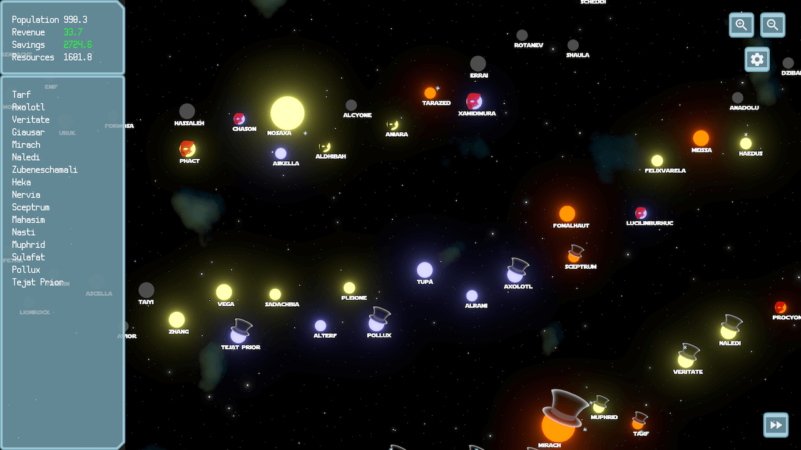
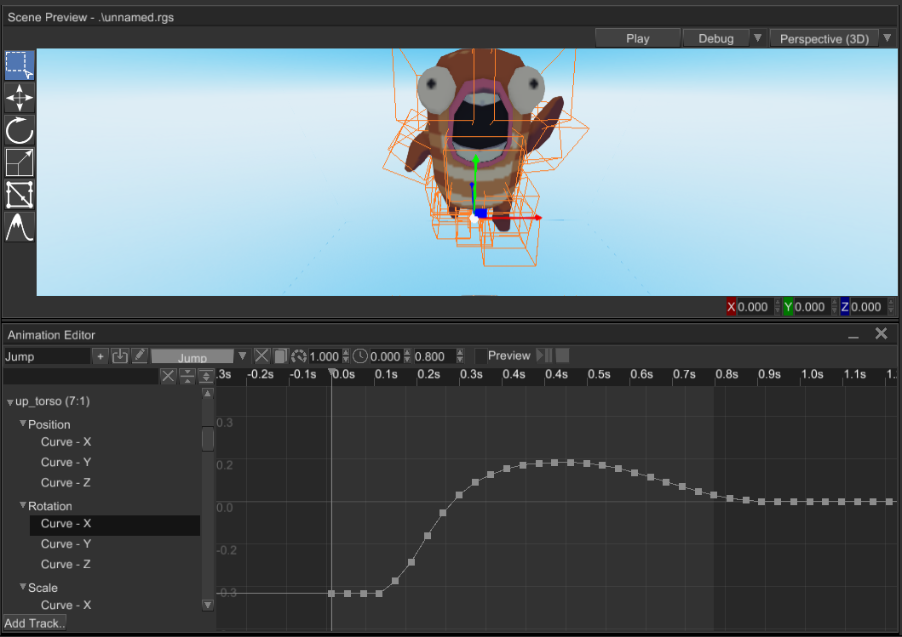
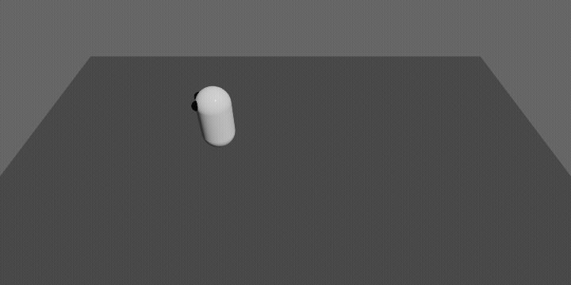

+++
title = "This Month in Rust GameDev #40 - November 2022"
transparent = true
date = 2022-12-01
draft = true
+++

<!-- no toc -->

<!-- Check the post with markdownlint-->

Welcome to the 40th issue of the Rust GameDev Workgroup's
monthly newsletter.
[Rust] is a systems language pursuing the trifecta:
safety, concurrency, and speed.
These goals are well-aligned with game development.
We hope to build an inviting ecosystem for anyone wishing
to use Rust in their development process!
Want to get involved? [Join the Rust GameDev working group!][join]

You can follow the newsletter creation process
by watching [the coordination issues][coordination].
Want something mentioned in the next newsletter?
[Send us a pull request][pr].
Feel free to send PRs about your own projects!

[Rust]: https://rust-lang.org
[join]: https://github.com/rust-gamedev/wg#join-the-fun
[pr]: https://github.com/rust-gamedev/rust-gamedev.github.io
[coordination]: https://github.com/rust-gamedev/rust-gamedev.github.io/issues?q=label%3Acoordination

- [Announcements](#announcements)
- [Game Updates](#game-updates)
- [Engine Updates](#engine-updates)
- [Learning Material Updates](#learning-material-updates)
- [Tooling Updates](#tooling-updates)
- [Library Updates](#library-updates)
- [Other News](#other-news)
- [Popular Workgroup Issues in Github](#popular-workgroup-issues-in-github)
- [Meeting Minutes](#meeting-minutes)
- [Discussions](#discussions)
- [Requests for Contribution](#requests-for-contribution)
- [Jobs](#jobs)
- [Bonus](#bonus)

<!--
Ideal section structure is:

```
### [Title]


_image caption_

A paragraph or two with a summary and [useful links].

_Discussions:
[/r/rust](https://reddit.com/r/rust/todo),
[twitter](https://twitter.com/todo/status/123456)_

[Title]: https://first.link
[useful links]: https://other.link
```

If needed, a section can be split into subsections with a "------" delimiter.
-->

## Announcements

## Game Updates

### [Jumpy]


_Jumpy Items: Swords, Crates, Grenades, & Mines_

[Jumpy] ([GitHub][Jumpy], [Discord][jumpy_discord], [Twitter][jumpy_twitter]) by
[Spicy Lobster][spicy_lobster] is a pixel-style, tactical 2D shooter with a fishy
theme.

In the last month, Jumpy migrated from a client-server networking model to a P2P
Rollback model using [GGRS]. This was to address shortcommings with the server
model that had been implemented, and to take advantage of the excellent user
user experience that rollback networking can offer.

The rollback model did come with the new requirement to run up to 8 simulation
frames per 16ms screen refresh, though, and unfortunatley the JavaScript
bindings used to implement the game items were not performant enough to keep up.
For now, scripting has been temporarily disabled.

This sparked a quick migration of the TypeScript files to Rust, and also
[discussion][jumpy_wasm_discussion] about future possibilities for using WASM to
get beter determinism and rollback performance, along with lower-overhead WASM
scripts.

With promising ideas for future improvements, the rest of the month was spent
focusing on getting the initial items completed, with Grenades, Swords, Crates,
and Mines all landing recently.

With just one more item planned and minimal clean up work, an MVP release is
just around the corner!

_Discussions: [GitHub][jumpy_discussions], [Twitter][jumpy_twitter]_

[Jumpy]: https://github.com/fishfolks/jumpy
[jumpy_rewrite]: https://github.com/fishfolks/jumpy/pull/466
[Bevy]: https://bevyengine.org
[GGRS]: https://github.com/gschup/ggrs
[jumpy_discussions]: https://github.com/fishfolks/jumpy/discussions
[jumpy_twitter]: https://twitter.com/spicylobsterfam
[jumpy_discord]: https://discord.gg/4smxjcheE5
[spicy_lobster]:  https://spicylobster.itch.io/
[jumpy_wasm_discussion]: https://github.com/fishfolk/jumpy/discussions/489

### [CyberGate][cybergate-yt]


_The abyss is the deepest, hardest level, filled with monsters of all sizes and strength_

CyberGate ([YouTube][cybergate-yt], [Discord][cybergate-dis]) by CyberSoul is an
ambitious endeavor to create an immersive universe experience with the power of
artificial intelligence and procedurally generated gameplay styles. Explore a
world filled with strange creatures and thrilling adventures!

The latest updates include:

- A new islands map featuring a safe zone and progressively more challenging
  levels
- Collectible Cubic Orbs that provide health, points and bullets
- An intuitive interface for day cycle, inventory (bullets) and cooldowns
- Upgrade your stats as you level up
- And an Emergency Recall feature for when you’re stranded

Be among the first to experience the wonders of AI-driven universe with
CyberGate! [Join the Discord server][cybergate-dis] to participate in upcoming
Phase 7.0!

[cybergate-yt]: https://youtube.com/channel/UClrsOso3Xk2vBWqcsHC3Z4Q
[cybergate-dis]: https://discord.gg/R7DkHqw7zJ

### Rusty Vangers


[Rusty Vangers] ([GitHub][vangers-src], [Itch-io][vangers-itch]) is an
experimental re-implementation of the [Vangers] game,
using GPUs and multi-threading in Rust.

The project has started with a strong focus on rendering,
since efficient GPU implementation of a Voxel world as large as
2048x16384x256 (that's about 8 giga-voxels!) turned into a tough challenge,
even though the original game from 1998 easily does it on CPU.

Finally, after years of experiments, a method has been implemented
that is fast and universal when it comes to viewing angles. It's based
on an acceleration structure in the form of a voxel octree.
This work has landed at the start of November, and now it's possible
to [ride through][vangers-video] the strange worlds
while looking from behind the car, or even from inside it.

This method runs on all APIs (including OpenGL!), thanks to wgpu/naga
portability. It's suitably fast, regardless of perspective, even on
an old macBook with an integrated GPU. It concludes the rendering story
of the project, and the devs can shift focus on other areas.

_Discussions: [Reddit](https://www.reddit.com/r/rust_gamedev/comments/ypf38k/description_of_the_voxel_tracing_in_rusty_vangers/)_

[Rusty Vangers]: https://vange.rs/
[vangers-src]: https://www.github.com/yopox/LD51
[vangers-itch]: https://kvark.itch.io/vangers
[Vangers]: https://store.steampowered.com/app/264080/Vangers/
[vangers-video]: https://vimeo.com/manage/videos/765602608

### Digital Extinction


_Laser trail in Digital Extinction_

[Digital Extinction] ([GitHub][de-github], [Discord][de-discord],
[Reddit][de-reddit]) by [@Indy2222] is a 3D real-time strategy game made with
[Bevy].

Here is the summary of the changes since the last update. It consists of commit
range ffd5987..494096b (2022-11-03–2022-11-27). There were 75 non-merge commits
in total.

The most notable updates are:

- trails after laser fires are briefly visible,
- flying drones no longer slide on terrain but fly in height,
- simple main menu and map selection were added,
- a game design document was kicked off,
- both Rust API, and other technical documentation are automatically published
  at [docs.de-game.org][de-docs],
- many community-related improvements have been made,
- the game was migrated to the new Bevy v0.9,
- there were some code quality and performance improvements,
- de_tools crate was fixed.

A more detailed update summary is available [here][de-update-02].

[Digital Extinction]: https://de-game.org
[de-github]: https://github.com/DigitalExtinction/Game
[de-discord]: https://discord.gg/vHMFuCWGSX
[de-reddit]: https://www.reddit.com/r/DigitalExtinction
[@Indy2222]: https://github.com/Indy2222
[Bevy]: https://bevyengine.org
[de-docs]: https://docs.de-game.org
[de-update-02]: https://mgn.cz/blog/de02

### [Space Frontiers]


[Space Frontiers] ([GitHub], [Discord], [Twitter], [Reddit], [Steam Group])
by [Star Wolves] is an online sci-fi action community RPG game simulating
space (and spaceships) in 3D.

The game has been in-development for over two years.
The server and client were successfully prototyped with Godot several
years ago. After that, the server, with all its features, was
successfully ported to [Bevy]. The client is now getting the same
porting treatment!

The project is commercial, [open-source] and has a proprietary license.
There is a milestone for a license change to free open-source.

Space Frontiers seeks to deliver customized community gameplay experiences.
Read more about plugins and content customization in the [development journal].

The official StarWolves.io forum and discussion board were launched a week ago.
The first 50 registrants will receive a permanent unique forum group/title.

_Discussions: [StarWolves.io Bulletin Board]_

[StarWolves.io Bulletin Board]: https://starwolves.io
[Star Wolves]: https://starwolves.io
[development journal]: https://starwolves.io/showthread.php?tid=1
[Bevy]: https://bevyengine.org/
[Space Frontiers]: https://github.com/starwolves/space
[GitHub]: https://github.com/starwolves/space
[open-source]: https://github.com/starwolves/space
[Steam Group]: https://steamcommunity.com/groups/starwolvescommunity
[Discord]: https://discord.gg/yYpMun9CTT
[Twitter]: https://twitter.com/starwolvesstar
[Reddit]: https://reddit.com/u/StarwolvesStar

### [Timely Defuse]


[Timely Defuse] ([GitHub][timely-defuse-github]) by [@E_net4]
is a mobile Web game using Bevy, submitted to GitHub Game Off 2022.
In this game, explosives are coming out of nowhere
and it's the hero's job to stop as many of them from exploding as possible.

Some remarks about the experience of creating Timely Defuse
were shared on [Dev.to][timely-defuse-dev].

[Timely Defuse]: https://e-net4.itch.io/timely-defuse
[timely-defuse-github]: https://github.com/Enet4/timely-defuse
[@E_net4]: https://hachyderm.io/@E_net4
[timely-defuse-dev]: https://dev.to/e_net4/timely-wrap-up-quick-notes-on-timely-defuse-441o

### [Spaceviata]



[Spaceviata] ([GitHub][spaceviata-github]) by [@FrancoisMockers]
is a strategy game made with [Bevy], submitted to GitHub Game Off 2022.

Starting with one star, your goal in this turn by turn game is to conquer the
galaxy, fighting against AI players, and balancing exploration with
colonization to avoid stretching your resources too thin.

[Spaceviata]: https://vleue.itch.io/spaceviata
[spaceviata-github]: https://github.com/mockersf/spaceviata
[@FrancoisMockers]: https://hachyderm.io/@FrancoisMockers

### [Scummstreets]

[Scummstreets] is a new multiplayer online role-playing game by [@dooskington].
The game is a fork/sequel to [Antorum Isles], so the game server is written in Rust,
and the official client is made with Unity. It's still in a pre-alpha state.

There was one dev log published this month:

- [2: Character And Combat Work](https://ratwizard.dev/dev-log/scummstreets/2)

[Scummstreets]: https://ratwizard.dev/dev-log/scummstreets
[Antorum Isles]: https://antorum.ratwizard.dev/
[@dooskington]: https://twitter.com/dooskington

### [8bit Duels]


_UI preview_

[@ThousandthStar] is creating an 8bit themed multiplayer game. It's a turn based
strategy game and is currently under development. This month, the
[blog][8bit-blog] got moved from [dev.to][8bit-dev.to] to ThousandthStar's own
blog on Github.

The game is soon getting a UI, and more packets need to be implemented before
the game is ready to play. ThousandthStar is excited for the game to be
playable, but it will probably take some time, since he is doing it as a side
project when he has some time. The game is lacking troop spawns, a turn system,
and some more troops! Any and all ideas posted to the
[r/rust_gamedev][8bit-r/rust_gamedev] thread are greatly appreciated.

If possible, ThousandthStar would like the art to be made up of voxel models
instead of just pixel art, but he doesn't know if he'll reach that point yet.

_Discussion: [r/rust_gamedev][8bit-r/rust_gamedev]_

[8bit Duels]: https://thousandthstar.github.io
[@ThousandthStar]: https://github.com/ThousandthStar
[8bit-blog]: https://thousandthstar.github.io
[8bit-dev.to]: https://dev.to/
[8bit-r/rust_gamedev]: https://www.reddit.com/r/rust_gamedev/comments/ylksma/discussion_thread_for_thousandthstars_multiplayer/

## Engine Updates

### [Pixel Engine][pixel_engine]

[pixel_engine] by [@Maix0] is a 2D game engine that started as a Rust-version
of olcPixelGameEngine (written in C++). It was used as a learning project
for Maix0, where he worked on it for over 3 years.

This engine has a very straightforward API and is mostly CPU based
(the exception is Decals which are GPU-sprites) but it can achieve some things.
Use it as a way to learn new algorithms or to make a simple game.

It uses [wgpu] underneath so there is support for all desktop targets and WASM
(even though there is a bug in the WASM builds
where the keyboard layout is only QWERTY).

The most recent addition is the [SpriteRef], a way to create a view
inside a sprite where it is possible to draw in it.
You can have multiple non-overlapping views at the same time.

[pixel_engine]: https://github.com/Maix0/pixel_engine
[@Maix0]: https://github.com/Maix0
[SpriteRef]: https://docs.rs/pixel_engine/0.6.0/pixel_engine/graphics/struct.SpriteMutRef.html
[wgpu]: https://wgpu.rs/

### [Fyrox]



[Fyrox] ([Discord][fyrox_discord], [Twitter][fyrox_twitter]) is a game engine that
aims to be easy to use and provide a large set of out-of-the-box features. In November
it got a lot of new functionality and improved existing:

- Major animation system rework
- New animation editor
- Reworked animation blending state machine editor
- Major improvements to the curve editor widget
- Curve-based animation system
- Smart placement mode for move gizmo
- Node and property selectors
- Better WebAssembly support - asynchronous scene loading and WASM project template
- Various improvements for project template generator
- Lots of bug fixes

[Fyrox]: https://github.com/FyroxEngine/Fyrox
[fyrox_discord]: https://discord.com/invite/xENF5Uh
[fyrox_twitter]: https://twitter.com/DmitryNStepanov

### [Bevy v0.9][bevy_news]


[Bevy][bevy_engine] is a refreshingly simple data-driven game engine built in Rust.
It is [free and open source][bevy_repo] forever!

Bevy 0.9 brought many incredible new features.
You can check out the [full release blog post here][bevy_news],
but here are some highlights:

- [HDR Post Processing, Tonemapping, and Bloom](https://bevyengine.org/news/bevy-0-9/#hdr-post-processing-tonemapping-and-bloom)
- [FXAA](https://bevyengine.org/news/bevy-0-9/#fxaa-fast-approximate-anti-aliasing)
- [Deband Dithering](https://bevyengine.org/news/bevy-0-9/#deband-dithering)
- [Other Post Processing Improvements](https://bevyengine.org/news/bevy-0-9/#post-processing-view-target-double-buffering)
- [New Scene Format](https://bevyengine.org/news/bevy-0-9/#new-scene-format)
- [Code Driven Scene Construction](https://bevyengine.org/news/bevy-0-9/#dynamic-scene-builder)
- [Improved Entity/Component APIs](https://bevyengine.org/news/bevy-0-9/#improved-entity-component-apis)
- [Exclusive System Rework](https://bevyengine.org/news/bevy-0-9/#exclusive-system-rework)
- [Enum Reflection](https://bevyengine.org/news/bevy-0-9/#enum-reflection)
- [Time Shader Globals](https://bevyengine.org/news/bevy-0-9/#time-shader-globals)
- [Plugin Settings](https://bevyengine.org/news/bevy-0-9/#plugin-settings)
- [Bevy UI Z-Indices](https://bevyengine.org/news/bevy-0-9/#bevy-ui-z-indices)

_Discussions:
[/r/rust](https://www.reddit.com/r/rust/comments/ytiv2a/bevy_09/),
[Hacker News](https://news.ycombinator.com/item?id=33577284),
[Twitter](https://twitter.com/cart_cart/status/1591543728233385984)_

[bevy_engine]: https://bevyengine.org/
[bevy_news]: https://bevyengine.org/news/bevy-0-9/
[bevy_repo]: https://github.com/bevyengine/bevy

### [godot-rust][gd-github]


godot-rust ([GitHub][gd-github], [Discord][gd-discord], [Twitter][gd-twitter])
is a Rust library that provides bindings for the Godot engine. Just this month,
a [Mastodon account][gd-mastodon] was opened to share development info.

November brings the long-awaited GDExtension binding, enabling access to Godot 4
features from Rust. Still in an early experimental phase, it is already possible
to run smaller examples like Godot's famous Dodge-the-Creeps tutorial game.

Compared to the GDNative binding, APIs are a bit simpler now:

- One central `Gd<T>` pointer combining `Ref`/`Instance` and their type-states
- Self-registering classes: `#[derive(GodotClass)]` and you're good-to-go
- Less `unsafe`, less `unwrap()`, more runtime checks

The repository is available at [godot-rust/gdextension][gd-github], while the
current development status is tracked in [#24][gd-24]. The [book][gd-book] as
well as documentation are still under construction.

[gd-24]: https://github.com/godot-rust/gdextension/issues/24
[gd-book]: https://github.com/godot-rust/book
[gd-github]: https://github.com/godot-rust/gdextension
[gd-discord]: https://discord.gg/aKUCJ8rJsc
[gd-twitter]: https://twitter.com/GodotRust
[gd-mastodon]: https://mastodon.gamedev.place/@GodotRust

## Learning Material Updates

## Tooling Updates

### [Boytacean][boytacean]

Boytacean ([Github][boytacean], [Working Emulator][boytacean-web])
by [@joamag] is a Game Boy emulator written in Rust
with both Native (using SDL) and Web (using WebAssembly) frontends that has been
created as a learning experiment to better understand both Rust capabilities and
Game Boy hardware.
The Web frontend is especially interesting making use of Web standards like
[Gamepad API][gamepad-api] to provide a rich and joyful experience for both
desktop and mobile devices.
Performance wise the web version runs smoothly with little to no significant
hardware requirements.

Even though Boytacean supports most Game Boy games and passes most well known
test ROMs there are still some features lacking like support for Game Boy Color
and APU (sound) support.

You can check this [Reddit post][boytacean-red-ann] for more information.

[boytacean]: https://github.com/joamag/boytacean
[boytacean-web]: https://boytacean.joao.me
[@joamag]: https://github.com/joamag
[gamepad-api]: https://developer.mozilla.org/docs/Web/API/Gamepad_API/Using_the_Gamepad_API
[boytacean-red-ann]: https://reddit.com/r/rust/comments/ywxugc/game_boy_emulator_using_rust

### [Graphite][graphite-website]


Graphite ([website][graphite-website], [GitHub][graphite-repo],
[Discord][graphite-discord], [Twitter][graphite-twitter]) is a free,
in-development raster and vector 2D graphics editor based around a Rust-powered
node graph compositing engine.

November's [sprint 20][graphite-sprint-20] introduces:

- Filling in the blanks: The Imaginate tool gains Inpaint/Outpaint, letting
  users [replace content][graphite-inpaint-demo] in masked areas and even
  ["uncrop"][graphite-outpaint-demo] entire images, powered by
  [Stable Diffusion][graphite-stable-diffusion].
- Going native: Graphite is now available as a desktop app, thanks to Tauri.
  The app now has access to system resources like rustc and the GPU, which lets
  it compile and run node graph effects as SPIR-V compute shaders in Vulkan for
  hardware-accelerated rendering.
- Connecting the dots: The node graph compositor now
  [supports interactive editing][graphite-nodes-demo], so users can drag nodes
  and chain together effects. Nodes can be set in the Properties panel or
  exposed as inputs in the graph.

It's easy to get involved with the project by developing new nodes. Join the
project [Discord][graphite-discord] and ask how to begin.

Stay tuned for the imminent Alpha Milestone 2 release and progress converting
existing features into nodes.

Open the [Graphite editor][graphite-editor] in your browser to give it a try
and share your creations with #MadeWithGraphite on Twitter.

[graphite-website]: https://graphite.rs
[graphite-repo]: https://github.com/GraphiteEditor/Graphite
[graphite-discord]: https://discord.graphite.rs
[graphite-twitter]: https://twitter.com/GraphiteEditor
[graphite-sprint-20]: https://github.com/GraphiteEditor/Graphite/milestone/20
[graphite-inpaint-demo]: https://www.youtube.com/watch?v=Ck2R0yqTLcU&t=3269
[graphite-outpaint-demo]: https://www.youtube.com/watch?v=Ck2R0yqTLcU&t=3862s
[graphite-nodes-demo]: https://www.youtube.com/watch?v=Ck2R0yqTLcU&t=4332
[graphite-stable-diffusion]: https://en.wikipedia.org/wiki/Stable_Diffusion
[graphite-editor]: https://editor.graphite.rs

## Library Updates

### [bevy_atmosphere v0.5][bevy_atmosphere]


bevy_atmosphere ([crates.io][bevy_atmosphere],
[docs.rs](https://docs.rs/bevy_atmosphere/latest/bevy_atmosphere/),
[GitHub](https://github.com/JonahPlusPlus/bevy_atmosphere))
is now compatible with Bevy 0.9.

The focus of this update was decoupling the atmospheric model from the
compute pipeline. What this means is that users can choose a different model
or create their own using the `Atmospheric` trait. This sets the groundwork for
having a variety of models to choose from, each for a different type of game.

With the removal of the `Atmosphere` resource, comes the addition of the
`AtmosphereModel` resource and the `Nishita` and `Gradient` models. `Nishita`
is the same model that was used in previous version of bevy_atmosphere.
`Gradient` is a new model that provides a simple gradient of three colors,
making it ideal for stylized games.

There is also the `Atmosphere<T>` and `AtmosphereMut<T>` system params,
which can be used to work with a particular model
without having to cast it from `AtmosphereModel`.

If you want to read more about the technical changes, check out the developer's
[blog post](https://jonahplusplus.dev/2022/12/01/bevy_atmosphere_0.5.html)!

_Discussions:
[/r/rust_gamedev](https://reddit.com/r/rust_gamedev/comments/za948o/bevy_atmosphere_05_is_now_released),
[/r/bevy](https://reddit.com/r/bevy/comments/za93oo/bevy_atmosphere_05_is_now_released),
[/r/rust](https://reddit.com/r/rust/comments/za93zb/bevy_atmosphere_05_is_now_released)_

[bevy_atmosphere]: https://crates.io/crates/bevy_atmosphere

### [Bevy Sequential Actions]


_An entity with a queue of repeating actions._

`bevy-sequential-actions` ([GitHub][seq-actions-gh], [docs.rs][seq-actions-docs])
is a simple helper library for the [Bevy][bevy] game engine.
It aims to execute a queue of various actions in a sequential manner.

An action is anything that implements the `Action` trait,
and can be added to any `Entity` that contains the `ActionsBundle`.
In the image above, the following actions have been added:

```rust
commands
    .actions(entity)
    .config(AddConfig {
        order: AddOrder::Back,
        start: true,
        repeat: Repeat::Forever,
    })
    .add(WaitAction::new(1.0))
    .add(MoveAction::new(Vec3::X * 2.0))
    .add(WaitAction::new(1.0))
    .add(MoveAction::new(Vec3::X * -2.0));
```

With version `0.6` comes the ability to
add a collection of actions that run in parallel.
This means that all actions will start and stop at the same time,
as the whole collection is treated as "one action".
In other words, the action queue will only advance
when all actions in the collection are finished.

```rust
commands
    .actions(agent)
    .add_many(
        ExecutionMode::Parallel,
        actions![
            action_a,
            action_b,
            action_c,
        ]
    );
```

[Bevy Sequential Actions]: https://crates.io/crates/bevy-sequential-actions
[seq-actions-gh]: https://github.com/hikikones/bevy-sequential-actions
[seq-actions-docs]: https://docs.rs/bevy-sequential-actions
[bevy]: https://bevyengine.org

### [Sparsey] v0.10

[Sparsey] by [@LechintanTudor] is an Entity Component System focused on
flexibility, conciseness and providing features exclusive to its sparse
set-based implementation.

The latest release takes advantage of the newly added Generic Associated Types
to provide a uniform interface for running systems, functions and closures that
borrow data from World and Resources, via the "run", "run_locally" and
"run_exclusive" functions.

Example:

```rust
let heaviest = sparsey::run(&world, &resources, |weights: Comp<Weight>| {
    (&weights)
        .iter()
        .with_entity()
        .max_by_key(|(_entity, &weight)| weight)
        .map(|(entity, _weight)| entity)
});
```

[Sparsey]: https://github.com/LechintanTudor/sparsey
[@LechintanTudor]: https://github.com/LechintanTudor

### [Bevy Quickmenu][bevy_quickmenu_crates]


bevy_quickmenu ([crates.io][bevy_quickmenu_crates],
[docs.rs][bevy_quickmenu_docs], [GitHub][bevy_quickmenu_github]) allows quickly
creating nested game menus that can be navigated with keyboard, gamepad or
mouse.

Bevy Quickmenu builds on BevyUI and allows defining nested menu structures in a
super simple way. Its also very extensible and customisable. If you game needs
menus and you would like to support multiple input methods, give it a try.

For example, a simple vertical menu can be defined like this:

```rust
fn root_menu(state: &CustomState) -> Menu<Actions, Screens, CustomState> {
    Menu::new(
        "root",
        vec![
            MenuItem::image(state.logo.clone()),
            MenuItem::headline("Menu"),
            MenuItem::action("Start", Actions::Close),
            MenuItem::screen("Sound", Screens::Sound)
                .with_icon(MenuIcon::Sound),
            MenuItem::screen("Controls", Screens::Controls)
                .with_icon(MenuIcon::Controls),
        ],
    )
}
```

For a more involved example, check out [this definition of a settings screen
with control device selection and a sound menu][bevy_quickmenu_settings].
[Version `0.1.5`][bevy_quickmenu_0.1.5] was just released which simplifies
generics and makes it easier to create dynamic menus.

_Discussion:
[/r/rust_gamedev][bevy_quickmenu_reddit]_

[bevy_quickmenu_crates]: https://crates.io/crates/bevy_quickmenu
[bevy_quickmenu_docs]: https://docs.rs/bevy_quickmenu
[bevy_quickmenu_github]: https://github.com/terhechte/bevy_quickmenu
[bevy_quickmenu_settings]: https://github.com/terhechte/bevy_quickmenu/blob/main/examples/settings.rs
[bevy_quickmenu_0.1.5]: https://github.com/terhechte/bevy_quickmenu/releases/tag/0.1.5
[bevy_quickmenu_reddit]: https://www.reddit.com/r/bevy/comments/yyl73c/new_plugin_bevy_quickmenu_quickly_create_nested

### [Notan v0.8][Notan]


[Notan] is a simple abstraction layer that provides cross-platform windowing,
input, audio, graphics and other features, in an ergonomic manner without
enforcing any structure or pattern and treating WebAssembly as a first-class citizen.

The version [v0.8] is one of the biggest releases, adding several improvements
in the drawing APIs and fixes and improvements in some other features like the
clipboard support.

You can check the [demos] online and read more about the changes on the [changelog].

[Notan]: https://github.com/Nazariglez/notan
[v0.8]: https://github.com/Nazariglez/notan/releases/tag/v0.8.0
[changelog]: https://github.com/Nazariglez/notan/blob/main/CHANGELOG.md
[demos]: https://nazariglez.github.io/notan-web

### [Bevy Hikari] v0.3


_Direct lighting, emissive lighting and indirect global illumination under 4x
temporal upscaling._

`bevy-hikari` ([crates.io][hikari-crates], [docs.rs][hikari-docs],
[GitHub][hikari-github]), a path tracing renderer for [Bevy], is now compatible
with the 0.9 version of the engine.

In recent updates, the renderer implements light BVH, which allows faster and
more accurate multiple emissive sampling. It also features a spatial upscaler
based on FSR 1.0 and a temporal upscaler based on SMAA Tu4x, making it more
affordable for median end devices.

[Bevy Hikari]: https://github.com/cryscan/bevy-hikari
[hikari-crates]: https://crates.io/crates/bevy-hikari
[hikari-docs]: https://docs.rs/bevy-hikari
[hikari-github]: https://github.com/cryscan/bevy-hikari

### [Bevy Vfx Bag]


_A composite effect applied to Bevy's 3D shapes example._

`bevy-vfx-bag` ([GitHub][bevy-vfx-bag-gh], [docs.rs][bevy-vfx-bag-docs])
is a visual effects library for the [Bevy][bevy] game engine.

It had its initial 0.1.0 release aligned with Bevy's recent 0.9.0 release.
Each effect has a plugin and effects are applied in order:

```rust
// Shows an example of adding three post processing effects:
app
    .add_plugin(BevyVfxBagPlugin)           // Always needed
    .add_plugin(RaindropsPlugin)            // Shows rain on-screen
    .add_plugin(ChromaticAberrationPlugin)  // Skews color channels
    .add_plugin(LutPlugin)                  // Allows using a look-up table to remap colors for
                                            // having a specific "feel" to your game
    .run();
```

The camera which receives these effects is marked as such:

```rust
commands
    .spawn(Camera3dBundle { ... })
    .insert(PostProcessingInput)            // Marks this camera for post processing usage
```

Effect settings can be changed at runtime:

```rust
fn update(time: Res<Time>, mut ca: ResMut<ChromaticAberration>) {
    // Make the red color channel skew in a sinusoidal fashion
    ca.magnitude_r = time.elapsed_seconds().sin();
}
```

The GitHub repository has examples and videos for all effects.

A complete rework of the plugin is underway for version 0.2.0, where the
main goal is to align with and use Bevy's render graph features,
including the new post processing double buffering feature which arrived
in 0.9.0.

[Bevy Vfx Bag]: https://crates.io/crates/bevy-vfx-bag
[bevy-vfx-bag-gh]: https://github.com/torsteingrindvik/bevy-vfx-bag
[bevy-vfx-bag-docs]: https://docs.rs/bevy-vfx-bag/0.1.0/bevy_vfx_bag/
[bevy]: https://bevyengine.org

### [`seldom_pixel`][seldom_pixel-github]


`seldom_pixel` ([GitHub][seldom_pixel-github], [Video Demo][seldom_pixel-demo])
by [Seldom] is a Bevy plugin for limited color palette pixel art games,
with features for filters, animations, typefaces, particle emitters,
`bevy_ecs_tilemap` integration, and much more.

In November, `seldom_pixel` received its 0.1 and 0.1.1 releases for Bevy 0.8.
Its `main` branch supports Bevy 0.9, but depends on a particular
`bevy_ecs_tilemap` commit.

_Discussions:
[Twitter](https://twitter.com/Seldom_SE/status/1587619563276902400)_

[seldom_pixel-github]: https://github.com/Seldom-SE/seldom_pixel
[seldom_pixel-demo]: https://youtu.be/pmTPdGxYVYw
[Seldom]: https://github.com/Seldom-SE

## Popular Workgroup Issues in Github

<!-- Up to 10 links to interesting issues -->

## Other News

<!-- One-liners for plan items that haven't got their own sections. -->

## Meeting Minutes

<!-- Up to 10 most important notes + a link to the full details -->

[See all meeting issues][label_meeting] including full text notes
or [join the next meeting][join].

[label_meeting]: https://github.com/rust-gamedev/wg/issues?q=label%3Ameeting

## Discussions

<!-- Links to handpicked reddit/twitter/urlo/etc threads that provide
useful information -->

## Requests for Contribution

<!-- Links to "good first issue"-labels or direct links to specific tasks -->

## Jobs

<!-- An optional section for new jobs related to Rust gamedev -->

## Bonus

<!-- Bonus section to make the newsletter more interesting
and highlight events from the past. -->

------

That's all news for today, thanks for reading!

Want something mentioned in the next newsletter?
[Send us a pull request][pr].

Also, subscribe to [@rust_gamedev on Twitter][@rust_gamedev]
or [/r/rust_gamedev subreddit][/r/rust_gamedev] if you want to receive fresh news!

<!--
TODO: Add real links and un-comment once this post is published
**Discuss this post on**:
[/r/rust_gamedev](TODO),
[Twitter](TODO),
[Discord](https://discord.gg/yNtPTb2).
-->

[/r/rust_gamedev]: https://reddit.com/r/rust_gamedev
[@rust_gamedev]: https://twitter.com/rust_gamedev
