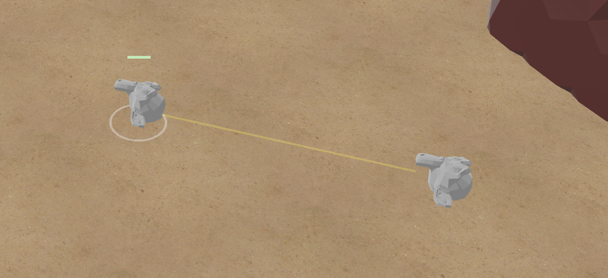
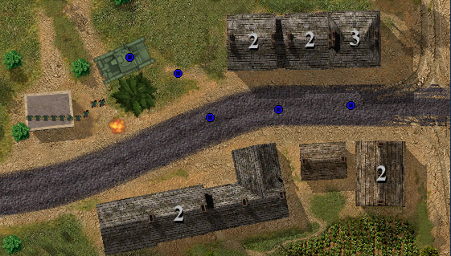
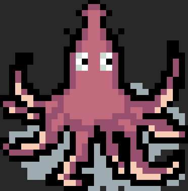
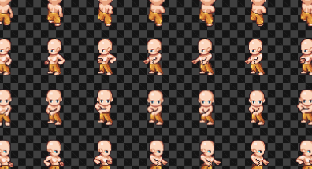

+++
title = "This Month in Rust GameDev #41 - December 2022"
transparent = true
date = 2023-01-04
draft = true
+++

<!-- no toc -->

<!-- Check the post with markdownlint-->

Welcome to the 41st issue of the Rust GameDev Workgroup's
monthly newsletter.
[Rust] is a systems language pursuing the trifecta:
safety, concurrency, and speed.
These goals are well-aligned with game development.
We hope to build an inviting ecosystem for anyone wishing
to use Rust in their development process!
Want to get involved? [Join the Rust GameDev working group!][join]

You can follow the newsletter creation process
by watching [the coordination issues][coordination].
Want something mentioned in the next newsletter?
[Send us a pull request][pr].
Feel free to send PRs about your own projects!

[Rust]: https://rust-lang.org
[join]: https://github.com/rust-gamedev/wg#join-the-fun
[pr]: https://github.com/rust-gamedev/rust-gamedev.github.io
[coordination]: https://github.com/rust-gamedev/rust-gamedev.github.io/issues?q=label%3Acoordination

- [Announcements](#announcements)
- [Game Updates](#game-updates)
- [Engine Updates](#engine-updates)
- [Learning Material Updates](#learning-material-updates)
- [Tooling Updates](#tooling-updates)
- [Library Updates](#library-updates)
- [Other News](#other-news)
- [Popular Workgroup Issues in Github](#popular-workgroup-issues-in-github)
- [Meeting Minutes](#meeting-minutes)
- [Discussions](#discussions)
- [Requests for Contribution](#requests-for-contribution)
- [Jobs](#jobs)
- [Bonus](#bonus)

<!--
Ideal section structure is:

```
### [Title]


_image caption_

A paragraph or two with a summary and [useful links].

_Discussions:
[/r/rust](https://reddit.com/r/rust/todo),
[twitter](https://twitter.com/todo/status/123456)_

[Title]: https://first.link
[useful links]: https://other.link
```

If needed, a section can be split into subsections with a "------" delimiter.
-->

## Announcements

## Game Updates

### Digital Extinction


_Laser trail in Digital Extinction_

[Digital Extinction] ([GitHub][de-github], [Discord][de-discord],
[Reddit][de-reddit]) by [@Indy2222] is a 3D real-time strategy game made with
[Bevy].

This month's update is somewhat smaller but there has been some important
progress in multiplayer.

The most notable updates are:

- game configuration is loaded from a file ([docs][de-docs]),
- a simple game lobby server has been created ([docs][de-docs]),
- a Bevy plugin with the lobby client has been implemented,
- several minor community, infrastructure, and other improvements have been
  done.

A more detailed update summary is available [here][de-update-03].

[Digital Extinction]: https://de-game.org
[de-github]: https://github.com/DigitalExtinction/Game
[de-discord]: https://discord.gg/vHMFuCWGSX
[de-reddit]: https://reddit.com/r/DigitalExtinction
[@Indy2222]: https://github.com/Indy2222
[Bevy]: https://bevyengine.org
[de-docs]: https://docs.de-game.org
[de-update-03]: https://mgn.cz/blog/de03

### [Open Combat][OpenCombat_website]


_Game now include vehicle (T-26) and shelling FX_

Open Combat
([Website][OpenCombat_website],
[GitHub][OpenCombat_github],
[Discord][OpenCombat_discord],
[Reddit](OpenCombat_reddit))
by [bux][bux] is a real time tactical game
which takes place during the 2nd world war.

Since the last news about this game,
the game engine has been rewritten to permit multiplayer.
Most of the basic game engine feature have been rewritten with
the new engine (soldier moves, visibilities, map, etc.).
Vehicle concept has been introduced to a T-26 tank.
Basic fight features like gunfire and shelling have been introduced.

[OpenCombat_website]: https://opencombat.bux.fr/
[OpenCombat_github]: https://github.com/buxx/OpenCombat
[OpenCombat_discord]: https://discord.gg/6P2vtFh2Px
[bux]: https://github.com/buxx/

### [Tiny Glade]


[@anopara]'s and [@h3r2tic]'s tiny building game
now finally has a name! It's [Tiny Glade]!

Tiny Glade is a small relaxing game about doodling
castles. Explore gridless building chemistry, and
watch the game carefully assemble every brick, pebble
and plank. There's no management, combat, or wrong
answers - just kick back and turn forgotten meadows
into lovable dioramas. Wishlist on [Steam][Tiny Glade]!

[@anopara]: https://twitter.com/anastasiaopara
[@h3r2tic]: https://twitter.com/h3r2tic
[Tiny Glade]: https://store.steampowered.com/app/2198150/Tiny_Glade/

### [8bit Duels]


_The newly added Kraken_

[@ThousandthStar] is creating 8bit Duels
([Discord][8bit-discord], [Github][8bit-github]),
an 8bit style turn-based multiplayer strategy game.

Last month, an artist joined ThousandthStar to create art for the game.
A testing server has now been set up
(more information is in the [Discord][8bit-discord] server).

Furthermore, these three new troops have been added to the game:
Reaper, Kraken, and Spider.
The game now also includes new abilities for the various troops to come.

The full devlog for this month can be found [here][8bit-log5].

[8bit Duels]: https://thousandthstar.github.io/posts/8bd-intro/
[@ThousandthStar]: https://github.com/ThousandthStar
[8bit-discord]: https://discord.gg/NbBcF4bGU5
[8bit-github]: https://github.com/ThousandthStar/8bit-duels
[8bit-log5]: https://thousandthstar.github.io/posts/8bd-part5

## Engine Updates

## Learning Material Updates

## Tooling Updates

## Library Updates

### [Inox2d][inox2d]


[Inox2d][inox2d] ([Discord][inox2d-discord]) by the Inox2d Workgroup
is an experimental official Rust implementation
of the [Inochi2D] puppet animation technology.
Inochi2d is notably used by the popular vtuber [@AsahiLina].

Currently, Inox2d is still not on par with the [reference implementation][Inochi2D-src].
Basic features like [animations][inox2d-animations] and
a proper [camera API][inox2d-camera] have yet to be worked on.

Users who really want to use it should instead go with the reference implementation.
If using Rust, through the official [inochi2d-rs] bindings.

Currently, Inox2d contributors are working on a [WGPU renderer backend][inox2d-wgpu].
They are also looking forward towards an [official Bevy integration][inox2d-bevy]!

[inox2d]: https://github.com/Inochi2D/inox2d
[inox2d-discord]: https://discord.com/invite/abnxwN6r9v
[Inochi2D]: https://inochi2d.com
[Inochi2D-src]: https://github.com/Inochi2D/inochi2d
[@AsahiLina]: https://youtube.com/@AsahiLina
[inox2d-animations]: https://github.com/Inochi2D/inox2d/issues/5
[inox2d-camera]: https://github.com/Inochi2D/inox2d/issues/7
[inox2d-wgpu]: https://github.com/Inochi2D/inox2d/pull/6
[inochi2d-rs]: https://github.com/Inochi2D/inochi2d-rs
[inox2d-bevy]: https://github.com/Inochi2D/inox2d/issues/1

### [bevy_rpg]


[bevy_rpg] ([Discord channel][bevy-rpg-discord]) by [@fianathedevgirl]
is a plugin allowing RPG or visual novel dialogs
to be made with the Bevy game engine.

At the moment, it can be used for very basic dialogs.
"Choose dialog" or text input dialog are still not implemented
and the dialog controller buttons doesn't work yet.

If you are interested in seeing how it should be used in production,
checkout ["Project Flara"][project-flara]. It's a prototype/demo game
made by the same author showcasing a JRPG-ish indie game written in Rust.
The author also made a basic example [here][bevy-rpg-example].

[bevy_rpg]: https://github.com/project-flara/bevy-rpg
[bevy-rpg-discord]: https://discord.com/channels/676678179678715904/1054506073240899684
[@fianathedevgirl]: https://github.com/fianathedevgirl
[project-flara]: https://github.com/project-flara/project-flara
[bevy-rpg-example]: https://github.com/project-flara/bevy-rpg/blob/main/examples/basic.rs

### [lpcg][lpcg_crate]


_A new library which generates character sprites_

lpcg ([Crates.io][lpcg_crate], [GitHub][lpcg_github]) by
[bux][bux] is a library which generates character sprites,
based on assets from the [Liberated Pixel Cup][lpc].

[lpcg_crate]: https://crates.io/crates/lpcg
[lpcg_github]: https://github.com/buxx/lpcg/
[lpc]: https://lpc.opengameart.org/

## Popular Workgroup Issues in Github

<!-- Up to 10 links to interesting issues -->

## Other News

<!-- One-liners for plan items that haven't got their own sections. -->

## Meeting Minutes

<!-- Up to 10 most important notes + a link to the full details -->

[See all meeting issues][label_meeting] including full text notes
or [join the next meeting][join].

[label_meeting]: https://github.com/rust-gamedev/wg/issues?q=label%3Ameeting

## Discussions

<!-- Links to handpicked reddit/twitter/urlo/etc threads that provide
useful information -->

## Requests for Contribution

<!-- Links to "good first issue"-labels or direct links to specific tasks -->

## Jobs

<!-- An optional section for new jobs related to Rust gamedev -->

## Bonus

<!-- Bonus section to make the newsletter more interesting
and highlight events from the past. -->

------

That's all news for today, thanks for reading!

Want something mentioned in the next newsletter?
[Send us a pull request][pr].

Also, subscribe to [@rust_gamedev on Twitter][@rust_gamedev]
or [/r/rust_gamedev subreddit][/r/rust_gamedev] if you want to receive fresh news!

<!--
TODO: Add real links and un-comment once this post is published
**Discuss this post on**:
[/r/rust_gamedev](TODO),
[Twitter](TODO),
[Mastodon](TODO),
[Discord](https://discord.gg/yNtPTb2).
-->

[/r/rust_gamedev]: https://reddit.com/r/rust_gamedev
[@rust_gamedev]: https://twitter.com/rust_gamedev
