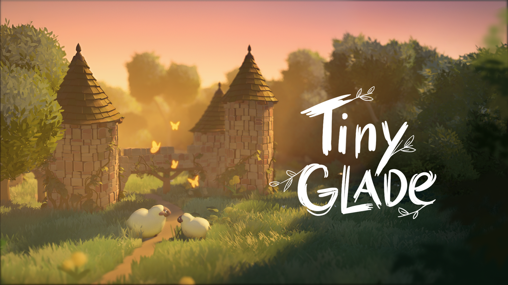
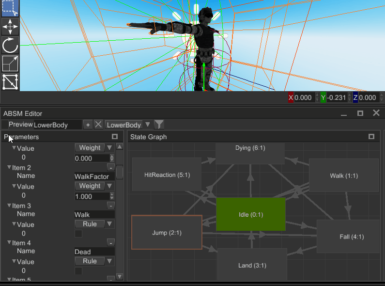
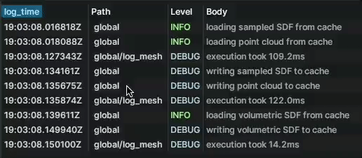

+++
title = "This Month in Rust GameDev #41 - December 2022"
transparent = true
date = 2023-01-28
draft = false
+++

<!-- no toc -->

<!-- Check the post with markdownlint-->

Welcome to the 41st issue of the Rust GameDev Workgroup's
monthly newsletter.
[Rust] is a systems language pursuing the trifecta:
safety, concurrency, and speed.
These goals are well-aligned with game development.
We hope to build an inviting ecosystem for anyone wishing
to use Rust in their development process!
Want to get involved? [Join the Rust GameDev working group!][join]

You can follow the newsletter creation process
by watching [the coordination issues][coordination].
Want something mentioned in the next newsletter?
[Send us a pull request][pr].
Feel free to send PRs about your own projects!

[Rust]: https://rust-lang.org
[join]: https://github.com/rust-gamedev/wg#join-the-fun
[pr]: https://github.com/rust-gamedev/rust-gamedev.github.io
[coordination]: https://github.com/rust-gamedev/rust-gamedev.github.io/issues?q=label%3Acoordination

- [Announcements](#announcements)
- [Game Updates](#game-updates)
- [Engine Updates](#engine-updates)
- [Learning Material Updates](#learning-material-updates)
- [Tooling Updates](#tooling-updates)
- [Library Updates](#library-updates)
- [Other News](#other-news)
- [Discussions](#discussions)
- [Requests for Contribution](#requests-for-contribution)

<!--
Ideal section structure is:

```
### [Title]


_image caption_

A paragraph or two with a summary and [useful links].

_Discussions:
[/r/rust](https://reddit.com/r/rust/todo),
[twitter](https://twitter.com/todo/status/123456)_

[Title]: https://first.link
[useful links]: https://other.link
```

If needed, a section can be split into subsections with a "------" delimiter.
-->

## Announcements

### Rust Graphics Meetup 3


The 3rd Rust Graphics Meetup will take place on the [28th of January 2023 at
16:00 GMT][graphics-meetup-time]. This meetup is a chance to show off what
you've been working on in the graphics community, or see what other people have
been doing!

If you're interested in speaking, please add a comment to [this
issue][graphics-meetup-issue]. You can also [read about the previous graphics
meetup][graphics-meetup-2].

[graphics-meetup-issue]: https://github.com/gfx-rs/meetup/issues/3
[graphics-meetup-time]: https://everytimezone.com/s/feafb968
[graphics-meetup-2]: https://gamedev.rs/blog/graphics-meetup-02/

### Rust GameDev Meetup


The 22nd Rust Gamedev Meetup took place in December. You can watch the recording
of the meetup [here on Youtube][gamedev-meetup-video]. Here was the schedule
from the meetup:

- Fyrox Engine - [@dmitrynstepanov]
- Rusty Vangers - [@kvark]
- Graphite - [@GraphiteEditor]

The meetups take place on the second Saturday of every month via the [Rust
Gamedev Discord server][rust-gamedev-discord] and are also [streamed on
Twitch][rust-gamedev-twitch]. If you would like to speak at the next meetup on
January 14th, please [respond to the monthly GitHub
issue][gamedev-meetup-speakers].

[gamedev-meetup-video]: https://youtube.com/watch?v=Ck2R0yqTLcU
[gamedev-meetup-speakers]: https://github.com/rust-gamedev/meetup/issues/2
[rust-gamedev-discord]: https://discord.gg/yNtPTb2
[rust-gamedev-twitch]: https://twitch.tv/rustgamedev
[@dmitrynstepanov]: https://twitter.com/dmitrynstepanov
[@GraphiteEditor]: https://twitter.com/GraphiteEditor
[@kvark]: http://kvark.github.io

### [@rust_gamedev Mastodon Feed][masto]


As you may know, we have [a @rust_gamedev Twitter account][twi] for
making announcements and collecting all the cool rust gamedev stuff there
into one feed.

In the last couple of months a significant portion of rust game developers
has either migrated from Twitter to [Mastodon] or started cross-posting there,
so [we've decided][masto-issue] to create a similar "official"
[@rust_gamedev account on the mastodon.gamedev.place server][masto].

Please follow us there and post your own relevant updates on [Fediverse]
using either the #RustGameDev tag or #RustLang #GameDev combo.

_Discussions:
[/r/rust_gamedev](https://reddit.com/r/rust_gamedev/comments/zplfyi/rust_gamedev_mastodon)_

[twi]: https://twitter.com/rust_gamedev
[masto]: https://mastodon.gamedev.place/@rust_gamedev
[Mastodon]: https://en.wikipedia.org/wiki/Mastodon_(social_network)
[masto-issue]: https://github.com/rust-gamedev/wg/issues/131
[Fediverse]: https://en.wikipedia.org/wiki/Fediverse

## Game Updates

### Digital Extinction


_Laser trail in Digital Extinction_

[Digital Extinction] ([GitHub][de-github], [Discord][de-discord],
[Reddit][de-reddit]) by [@Indy2222] is a 3D real-time strategy game made with
[Bevy].

This month's update is somewhat smaller but there has been some important
progress in multiplayer.

The most notable updates are:

- game configuration is loaded from a file ([docs][de-docs]),
- a simple game lobby server has been created ([docs][de-docs]),
- a Bevy plugin with the lobby client has been implemented,
- several minor community, infrastructure, and other improvements have been
  done.

A more detailed update summary is available [here][de-update-03].

[Digital Extinction]: https://de-game.org
[de-github]: https://github.com/DigitalExtinction/Game
[de-discord]: https://discord.gg/vHMFuCWGSX
[de-reddit]: https://reddit.com/r/DigitalExtinction
[@Indy2222]: https://github.com/Indy2222
[Bevy]: https://bevyengine.org
[de-docs]: https://docs.de-game.org
[de-update-03]: https://mgn.cz/blog/de03

### [Open Combat][OpenCombat_website]


_Game now includes vehicle (T-26) and shelling FX_

Open Combat
([Website][OpenCombat_website],
[GitHub][OpenCombat_github],
[Discord][OpenCombat_discord])
by [bux][bux] is a real time tactical game
which takes place during the 2nd world war.

Since the last news about this game,
the game engine has been rewritten to permit multiplayer.
Most of the basic game engine features have been rewritten with
the new engine (soldier moves, visibilities, map, etc.).
Vehicle concept has been introduced to a T-26 tank.
Basic fight features like gunfire and shelling have been introduced.

[OpenCombat_website]: https://opencombat.bux.fr/
[OpenCombat_github]: https://github.com/buxx/OpenCombat
[OpenCombat_discord]: https://discord.gg/6P2vtFh2Px
[bux]: https://github.com/buxx/

### [Tiny Glade]



[@anopara]'s and [@h3r2tic]'s tiny building game
now finally has a name! It's [Tiny Glade]!

Tiny Glade is a small relaxing game about doodling
castles. Explore gridless building chemistry, and
watch the game carefully assemble every brick, pebble,
and plank. There's no management, combat, or wrong
answers - just kick back and turn forgotten meadows
into lovable dioramas. Wishlist on [Steam][Tiny Glade]!

[@anopara]: https://twitter.com/anastasiaopara
[@h3r2tic]: https://twitter.com/h3r2tic
[Tiny Glade]: https://store.steampowered.com/app/2198150/Tiny_Glade/

### [Temple Knight]


_Shooting automatons in Temple Knight_

Temple Knight ([Itch.io][tk-itch], [Twitter][tk-twitter])
by [@nilaysavant] is a 3D FPS game developed using [Bevy].
You play the role of a knight and protect the temple from raiding automatons.

What began as an experiment to learn game dev in Rust using [Bevy].
Initially motivated by the visual appeal of a [scene running in the browser via WASM].
It quickly started taking the shape of a game:

- From adding [Rapier] for [basic physics] to developing mechanics for other entities.
- Path finding for Automaton's using [control systems].
- Which was later switched to a deterministic [A-start navmesh approach].
- Developed mechanics for the player controller including the first-person-camera.
- Implemented weapon + projectiles systems.
- Finally, [custom shaders for projectiles] were added as a finishing touch.

An experiment that became the first game published by [@nilaysavant].
Play [Temple Knight] in your browser.

[Temple Knight]: https://nilaysavant.itch.io/temple-knight
[tk-itch]: https://nilaysavant.itch.io/temple-knight
[tk-twitter]: https://twitter.com/nilay_savant/status/1607789552621727744
[@nilaysavant]: https://github.com/nilaysavant
[scene running in the browser via WASM]: https://twitter.com/nilay_savant/status/1568307034390675456
[Rapier]: https://rapier.rs/
[basic physics]: https://twitter.com/nilay_savant/status/1569665425046384641
[control systems]: https://twitter.com/nilay_savant/status/1573783227911012352
[A-start navmesh approach]: https://twitter.com/nilay_savant/status/1574735050809413633
[custom shaders for projectiles]: https://twitter.com/nilay_savant/status/1607115041253519361

### [Cargo Space][cargospace]


[Cargo Space][cargospace] ([Discord][cargospace_discord]) by
[@johanhelsing][johanhelsing_mastodon] is a co-op 2d space game where you build a
ship and fly it through space looking for new parts, fighting pirates and the
environment.

Johan wrote [an introductory post][cargospace_devlog_0] about the design idea,
and a tentative plan for its development.

The first step was to make an initial offline single-player prototype. This is
covered in the [first devlog][cargospace_devlog_1] along with topics such as
procedural generation, 2d platforming, bloom, and various community Bevy crates,
such as [bevy_ecs_tilemap], [bevy_ecs_ldtk] and [bevy_particle_systems].

The procedural generation needs for the game also resulted in a new crate being born.
[noisy_bevy] is a CPU and GPU noise plugin for Bevy.

After this, p2p rollback networking was added using [bevy_ggrs] and [Matchbox].
The [second devlog][cargospace_devlog_2] goes through this in detail, and in
particular how integration between [bevy_ggrs] and [leafwing_input_manager] was
implemented.

[cargospace]: https://helsing.studio/cargospace
[cargospace_discord]: https://discord.gg/ye9UDNvqQD
[johanhelsing_mastodon]: https://mastodon.social/@johanhelsing
[cargospace_devlog_0]: https://johanhelsing.studio/posts/cargo-space-devlog-0
[cargospace_devlog_1]: https://johanhelsing.studio/posts/cargo-space-devlog-1
[cargospace_devlog_2]: https://johanhelsing.studio/posts/cargo-space-devlog-2
[noisy_bevy]: https://github.com/johanhelsing/noisy_bevy
[Matchbox]: https://github.com/johanhelsing/matchbox
[bevy_ggrs]: https://github.com/gschup/bevy_ggrs
[leafwing_input_manager]: https://github.com/Leafwing-Studios/leafwing-input-manager
[bevy_ecs_ldtk]: https://github.com/Trouv/bevy_ecs_ldtk
[bevy_ecs_tilemap]: https://github.com/StarArawn/bevy_ecs_tilemap
[bevy_particle_systems]: https://github.com/abnormalbrain/bevy_particle_systems

### [8bit Duels]


_The newly added Kraken_

[@ThousandthStar] is creating 8bit Duels
([Discord][8bit-discord], [Github][8bit-github]),
an 8bit style turn-based multiplayer strategy game.

Last month, an artist joined ThousandthStar to create art for the game.
A testing server has now been set up
(more information is in the [Discord][8bit-discord] server).

Furthermore, these three new troops have been added to the game:
Reaper, Kraken, and Spider.
The game now also includes new abilities for the various troops to come.

The full devlog for this month can be found [here][8bit-log5].

[8bit Duels]: https://thousandthstar.github.io/posts/8bd-intro/
[@ThousandthStar]: https://github.com/ThousandthStar
[8bit-discord]: https://discord.gg/NbBcF4bGU5
[8bit-github]: https://github.com/ThousandthStar/8bit-duels
[8bit-log5]: https://thousandthstar.github.io/posts/8bd-part5

### [Flesh]


_more blood_

[Flesh] by [@im_oab] is a 2D-horizontal shmup game with hand-drawn animation and
an organic/fleshy theme. It is implemented using [Tetra]. This month's updates
include:

- Change player bullet color and add trail particle.
- Add SFX when special weapon ready.
- Increase blood splash particles.
- Postpone release date to Q1, 2023.

[Flesh]: https://store.steampowered.com/app/1660850/Flesh/
[@im_oab]: https://twitter.com/im_oab
[Tetra]: https://github.com/17cupsofcoffee/tetra

### Pirate Annihilation


_Pirate annihilation game view, asset pack by [Kenney](https://twitter.com/KenneyNL)_

Pirate Annihilation ([GitHub][pirate_annihilation_repo], [Twitter][indiedevcasts_twitter])
by [indiedevcasts][indiedevcasts_www] ([@theredfish]) is a last-man-standing game
where pirate ships battle against each other in stormy seas.

The very [first devlog](https://youtu.be/lT1QmAHPRoo) is available on Youtube.
It describes the implementation of a smooth damping effect to follow the player
with the camera, jitter and stuttering issues, and the core game mechanics are
now defined.

[pirate_annihilation_repo]: https://github.com/indiedevcasts/pirate-annihilation
[indiedevcasts_twitter]: https://twitter.com/indiedevcasts
[indiedevcasts_www]: https://indiedevcasts.com
[@theredfish]: https://twitter.com/theredfi_sh

### [Veloren][veloren]


_A fearsome wendigo encounter_

[Veloren][veloren] is an open world, open-source voxel RPG inspired by Dwarf
Fortress and Cube World.

In December, work has been done to create a website to better assist moderation
in the game. Several months of project finances were done, and all of the data
is [publically visible][veloren-finances]. Work on Wyverns has continued, and
lots of effort is being put into their wings. Some UI elements have changed
location, both the bag and spellbook buttons were merged with other button bars.

Frost Gigas are another big item in the works. These creatures will be Veloren's
world boss. Gigas will hopefully be the first of a numerous elemental giants to
roam the open world of Veloren and will need a large group of players to be able
to take it down and collect it's new uncraftable and legendary loot!

December's full weekly devlogs: "This Week In Veloren...":
[#201][veloren-201],
[#202][veloren-202],
[#203][veloren-203].

[veloren]: https://veloren.net
[veloren-201]: https://veloren.net/devblog-201
[veloren-202]: https://veloren.net/devblog-202
[veloren-203]: https://veloren.net/devblog-203
[veloren-finances]: https://docs.google.com/spreadsheets/d/1Fk6kDsCdZLhVszXdsWUjoG4Cgc3cLbTqJgZ-gY3Ndq0/edit#gid=0

### [Thetawave]


_First boss enemy in Thetawave_

Thetawave is an open-source, roguelite, physics-based, space shooter game made
with [Bevy] and [Rapier].

This month, the first boss enemy was added to the
game. Unlike other enemies, it is composed of a single "mob" entity and 7
"mob segment" entities. It also uses behavior sequences to regularly change
its active set of behaviors. You can follow [@carlosupina] on Twitter for
regular updates about the game.

[Thetawave]: https://github.com/thetawavegame/thetawave
[@carlosupina]: https://twitter.com/carlosupina

### [Jumpy]


_Jumpy Items: Swords, Crates, Grenades, & Mines_

[Jumpy] ([GitHub][Jumpy], [Discord][jumpy_discord], [Twitter][jumpy_twitter]) by
[Spicy Lobster][spicy_lobster] is a pixel-style, tactical 2D shooter with a fishy
theme.

In the last month, work started on a new architecture for the core Jumpy game loop.

Determinism and snapshot/restore functionality has been a challenge for
networking support in jumpy. To address this, Jumpy has started migrating the core
game loop to a custom, micro Entity Component System that is deterministic and can
be trivially snapshot and restored.

By being simple and planning to eventually support a pure C API, it's also
intended for the micro-ECS approach to make it vastly easier to create a
performant modding interface to Jumpy in the future.

Work has almost been finished on the new Bones ECS and the surrounding [Bones]
framework, which is still built on Bevy for rendering and otherwise talking to
the hardware. The hope is that Bones can become a framework for making other
games similar in scope to Jumpy, without those games have to re-invent everything
that was needed to get features like UI, networking, localization, asset loading,
etc.

As soon as the ECS migration is finished, the plan is to get the final game juicing
and polish done and to make a proper MVP release.

[Jumpy]: https://github.com/fishfolks/jumpy
[jumpy_twitter]: https://twitter.com/spicylobsterfam
[jumpy_discord]: https://discord.gg/4smxjcheE5
[spicy_lobster]: https://spicylobster.itch.io
[Bones]: https://github.com/fishfolk/bones

### [Hydrofoil Generation]


[Hydrofoil Generation]
([Steam][hgs_steam], [Facebook][hgs_facebook], [Discord][hgs_discord])
is a realistic sailing/foiling inshore simulator in development for PC/Steam
that will put you in the driving seat of modern competitive sailing.

The game is written completely in Rust, using a custom engine based on
DirectX 11, physics powered by Rapier-3D.

Jaxx Vane Studio army of 2, Stefano Casillo and Chax Duero is pushing
through the final steps to get the game ready for Steam Early Access release.

As final QA approaches the team is at work to add the last level of polish
and more details as possible to every aspect of the game.

A new Tutorial System has been added to introduce people with different
backgrounds to the game as gently as possible making the learning curve
of this complex simulator less steep.

Stefano is also back on [Twitch][hgs_twitch] streaming coding sessions live.

Hydrofoil Generation should be available on Steam in the first months of 2023.

[Hydrofoil Generation]: https://hydrofoil-generation.com/
[hgs_facebook]: https://facebook.com/HydrofoilGenerationSailing/
[hgs_discord]: https://discord.gg/DtKgt2duAy/
[hgs_steam]: https://store.steampowered.com/app/1448820/Hydrofoil_Generation/
[hgs_twitch]: https://twitch.tv/kunosstefano

### [Doomé][doome]


[Doomé][doome] by [Patryk Wychowaniec] and [Jakub Trąd]
is a GameOff'22 FPS game:

> <...> the topic was cliché and our game is Doom meets Portal meets
> The Stanley Parable, with real-time raytraced graphics
> (that work plenty fast even on a CPU) and a 10-minute storyline!

The source code [is available on GitHub][doome-src].
The game is written with a custom [rust-gpu]-based raytracer:
[strolle].
[Watch a talk from a recent Rust Wrocław's meeting][doome-talk]
to learn more about the implementation details.

You can play the game online and/or get binaries [at itch.io][doome].

_Discussions: [/r/rust](https://reddit.com/r/rust/comments/zbd8w2/doome)_

[doome]: https://dzejkop.itch.io/doome
[doome-src]: https://github.com/Patryk27/doome
[doome-talk]: https://youtu.be/S85Tw0dVtmw?t=5306
[Patryk Wychowaniec]: https://pwy.io
[Jakub Trąd]: https://github.com/Dzejkop
[strolle]: https://reddit.com/r/rust/comments/zsrvss/strolle_raytracing

### [Combine&Conquer][cnc-steam]


[Combine&Conquer][cnc-steam] ([itch.io][cnc-itch], [devlog][cnc-logs],
[Discord][cnc-discord]) by [Martin Buck][@I3ck]
is a WIP relaxing multi-planetary 2D factory automation game.
This month's updates include:

- [Early Access release on Steam][cnc-steam].
- [A bunch of minor v0.3.* versions][cnc-logs] with loads of bugfixes
  and small improvements in UX, rendering, etc.

_Discussions:
[/r/rust_gamedev](https://reddit.com/r/rust_gamedev/comments/zd96f1/cnc_steam)_

[@I3ck]: https://github.com/I3ck
[cnc-itch]: https://martinbucksoftware.itch.io
[cnc-steam]: https://store.steampowered.com/app/2220850/Combine_And_Conquer
[cnc-logs]: https://buckmartin.de/combine-and-conquer.html
[cnc-discord]: https://discord.gg/peBD6Z5PvN

### [triverse]


[triverse] by [@cragwind] is a WIP smart-pause RTS with custom unit creation
on a triangle grid canvas.

> In a distant star system, AI collectives vie for power.
> Assemble and control a self-replicating fleet to harvest resources,
> salvage wreckage, and defend your territory.
> Using modular parts, design ships to counter threats
> while balancing mobility, defense, and firepower.

You can find [the detailed guide to playing here][triverse-guide]
and [play the web version on itch.io][triverse].

This month's [updates][triverse-logs] include:

- [Salvaging parts][triverse-log-1] from wreckage using workers
  for building your own units.
- [Torpedo launchers][triverse-log-2] for taking out large
  or stationary targets.

[@cragwind]: https://cragwind.com
[triverse]: https://cragwind.itch.io/triverse
[triverse-guide]: https://cragwind.com/triverse/
[triverse-logs]: https://cragwind.itch.io/triverse/devlog
[triverse-log-1]: https://cragwind.itch.io/triverse/devlog/458561/salvaging-parts
[triverse-log-2]: https://cragwind.itch.io/triverse/devlog/464791/torpedo-launcher

## Engine Updates

### [Fyrox]



[Fyrox] ([Discord][fyrox_discord], [Twitter][fyrox_twitter]) is a game engine that
aims to be easy to use and provide a large set of out-of-the-box features. In December
it got a lot of new functionality and improved existing:

- Animation system rework is completed
- Animation and ABSM editors are now fully usable
- Reflection improvements
- `Copy Value as String` for Inspector
- Ability to enable/disable scene nodes
- Customizable graph update pipeline
- UI Widgets improvements
- Curve editor improvements
- Lots of bug fixes

[Fyrox]: https://github.com/FyroxEngine/Fyrox
[fyrox_discord]: https://discord.com/invite/xENF5Uh
[fyrox_twitter]: https://twitter.com/DmitryNStepanov

### [Runty8][runty8-repo]

[][runty8-repo]

[Runty8][runty8-repo] is an experimental port of the [Pico8][pico8-site]
fantasy console that supports writing games in Rust.

Runty8 has recently added support for WebAssembly,
which means that you can now run your games in the browser!

Feel free to [follow their template][runty8-template] to start making your own games.

The project is in very early stages, and is currently looking for contributors.
If you're interested, feel free to read their [contributing guide][runty8-contributing-guide]
or browse through the [open issues][runty8-open-issues].

[runty8-repo]: https://github.com/jjant/runty8
[runty8-contributing-guide]: https://github.com/jjant/runty8/blob/master/CONTRIBUTING.md
[runty8-open-issues]: https://github.com/jjant/runty8/issues
[pico8-site]: https://www.lexaloffle.com/pico-8.php
[runty8-template]: https://github.com/jjant/runty8#making-your-own-games

## Learning Material Updates

### [Rustacean Station: Presser with Gray Olson][rustacean-station-gray]


The [Rustacean Station][rustacean-station] podcast
[interviewed Gray Olson][rustacean-station-gray],
the developer of [Presser][presser] - a library that aims to make
it easier to safely work with byte buffers.

In this episode, [Gray][gray] talks about
art and graphic designing work for Embark Studio,
computer graphics and ray tracing,
memory allocation in Rust's virtual machine,
and Embark's vision of Rust gamedev.

[rustacean-station-gray]: https://rustacean-station.org/episode/gray-olson
[rustacean-station]: https://rustacean-station.org
[presser]: https://gamedev.rs/news/039#presser
[gray]: https://grayolson.me

### [GLTF Animations in wgpu][tut-gltf-wgpu]


[@whoisryosuke] released [a blog post][tut-gltf-wgpu] on how to
parse GLTF files in Rust, render them using wgpu,
and play animations imported from Blender.

[tut-gltf-wgpu]: https://whoisryosuke.com/blog/2022/importing-gltf-with-wgpu-and-rust
[@whoisryosuke]: https://mastodon.gamedev.place/@whoisryosuke

### [Create a Clicker Game with Macroquad][clicker-tut-1]


[@Paper010] released a short two-part tutorial
aimed at beginners who want to get started with game development
with Rust and [macroquad]:

- [The first part][clicker-tut-1] covers the minimal version of a clicker game.
- [The second part][clicker-tut-2] explains how to play sounds and change colors.

The final source code [is available on GitHub][clicker-src].

[clicker-tut-1]: https://dev.to/paper010/rust-create-a-clicker-game-with-macroquad-1820
[clicker-tut-2]: https://dev.to/paper010/part-2-create-a-clicker-game-with-rust-4nne
[clicker-src]: https://github.com/Paper010/rust-clicker-game
[@Paper010]: https://github.com/Paper010

## Tooling Updates

### [Graphite][graphite-website]

[

_Video: 3-minute timelapse of a vector art piece illustrated in Graphite_
][graphite-vector-demo]

Graphite ([website][graphite-website], [GitHub][graphite-repo],
[Discord][graphite-discord], [Twitter][graphite-twitter]) is a free,
in-development raster and vector 2D graphics editor based around a Rust-powered
node graph compositing engine.

December's [sprint 21][graphite-sprint-21] introduces:

- Chain reaction: The Imaginate feature, an AI image generation workflow
  powered by [Stable Diffusion][graphite-stable-diffusion], becomes a node.
  Chain together a sequence of fine-tuned generation steps. And explore ideas
  by branching the graph into new creative directions.
- Node nurturing: New features provide polish to the node graph. Nodes can be
  copy/pasted, hidden, previewed, and linked more easily.
- Bugs, begone!: A major effort to improve editor usability fixes dozens of
  bugs and paper cuts. Boolean shape operations now crash less frequently, the
  UI no longer slows down badly over time, and undo history is finally fixed.

Stay tuned for the imminent Alpha Milestone 2 release and progress converting
existing features into nodes.

Open the [Graphite editor][graphite-editor] in your browser to give it a try
and share your creations with #MadeWithGraphite on Twitter.

[graphite-vector-demo]: https://youtube.com/watch?v=JgJvAHQLnXA
  "Graphite Vector Editing: \"Commander Basstronaut\" Artwork (25x Timelapse)"
[graphite-website]: https://graphite.rs
[graphite-repo]: https://github.com/GraphiteEditor/Graphite
[graphite-discord]: https://discord.graphite.rs
[graphite-twitter]: https://twitter.com/GraphiteEditor
[graphite-sprint-21]: https://github.com/GraphiteEditor/Graphite/milestone/21
[graphite-stable-diffusion]: https://en.wikipedia.org/wiki/Stable_Diffusion
[graphite-editor]: https://editor.graphite.rs

## Library Updates

### [Inox2d][inox2d]


[Inox2d][inox2d] ([Discord][inox2d-discord]) by the Inox2d Workgroup
is an experimental official Rust implementation
of the [Inochi2D] puppet animation technology.
Inochi2d is notably used by the popular vtuber [@AsahiLina].

Currently, Inox2d is still not on par with the [reference implementation][Inochi2D-src].
Basic features like [animations][inox2d-animations] and
a proper [camera API][inox2d-camera] have yet to be worked on.

Users who really want to use it should instead go with the reference implementation.
If using Rust, through the official [inochi2d-rs] bindings.

Currently, Inox2d contributors are working on a [WGPU renderer backend][inox2d-wgpu].
They are also looking forward towards an [official Bevy integration][inox2d-bevy]!

[inox2d]: https://github.com/Inochi2D/inox2d
[inox2d-discord]: https://discord.com/invite/abnxwN6r9v
[Inochi2D]: https://inochi2d.com
[Inochi2D-src]: https://github.com/Inochi2D/inochi2d
[@AsahiLina]: https://youtube.com/@AsahiLina
[inox2d-animations]: https://github.com/Inochi2D/inox2d/issues/5
[inox2d-camera]: https://github.com/Inochi2D/inox2d/issues/7
[inox2d-wgpu]: https://github.com/Inochi2D/inox2d/pull/6
[inochi2d-rs]: https://github.com/Inochi2D/inochi2d-rs
[inox2d-bevy]: https://github.com/Inochi2D/inox2d/issues/1

### [bevy_rpg]


[bevy_rpg] ([Discord channel][bevy-rpg-discord]) by [@fianathedevgirl]
is a plugin allowing RPG or visual novel dialogs
to be made with the Bevy game engine.

At the moment, it can be used for very basic dialogs.
"Choose dialog" or text input dialog are still not implemented
and the dialog controller buttons doesn't work yet.

If you are interested in seeing how it should be used in production,
checkout ["Project Flara"][project-flara]. It's a prototype/demo game
made by the same author showcasing a JRPG-ish indie game written in Rust.
The author also made a basic example [here][bevy-rpg-example].

[bevy_rpg]: https://github.com/project-flara/bevy-rpg
[bevy-rpg-discord]: https://discord.com/channels/676678179678715904/1054506073240899684
[@fianathedevgirl]: https://github.com/fianathedevgirl
[project-flara]: https://github.com/project-flara/project-flara
[bevy-rpg-example]: https://github.com/project-flara/bevy-rpg/blob/main/examples/basic.rs

### [lpcg][lpcg_crate]


_A new library which generates character sprites_

lpcg ([Crates.io][lpcg_crate], [GitHub][lpcg_github]) by
[bux][bux] is a library which generates character sprites,
based on assets from the [Liberated Pixel Cup][lpc].

[lpcg_crate]: https://crates.io/crates/lpcg
[lpcg_github]: https://github.com/buxx/lpcg/
[lpc]: https://lpc.opengameart.org/

### [egui_dnd]


_A [showcase](https://lucasmerlin.github.io/egui_dnd/) of egui_dnd_

[egui_dnd] ([github][egui_dnd_github], [crates.io][egui_dnd_crates_io]) by [@lucasmerlin]
is a new drag and drop sorting crate for egui. While egui itself includes some drag
and drop support, it's not intuitive to use. This crate provides a simple
abstraction over egui's drag and drop features.

The first release contains initial support for vertical sorting. If there
is interest, more features could be added.

_Discussions: [/r/rust](https://reddit.com/r/rust/comments/zpo4w9/egui_dnd)_

[egui_dnd]: https://lucasmerlin.github.io/egui_dnd/
[egui_dnd_github]: https://github.com/lucasmerlin/egui_dnd
[egui_dnd_crates_io]: https://crates.io/crates/egui_dnd
[@lucasmerlin]: https://github.com/lucasmerlin

### [bevy_rapier_collider_gen][brcg-repo]


[bevy_rapier_collider_gen][brcg-repo] by [@shnewto] is a library
for generating bevy_rapier2d colliders for bevy apps, from images with
transparency.

Features include out of box support for generating:

- Convex polyline colliders
- Polyline colliders
- Convex hull colliders
- Heightfield colliders
- Other colliders or geometries by getting edge coordinates in "drawing order"
- Multiple colliders from a single image

For more, in pictures, see the picture book retrospective
["misadventures in collider generation"][brcg-retro].

[brcg-repo]: https://github.com/shnewto/bevy_rapier_collider_gen
[brcg-retro]: https://drinkspiller.com/bevy-rapier-collider-gen
[@shnewto]: https://github.com/shnewto

### [Mun v0.4.0][mun-release]

[][Mun]

[Mun] is a scripting language for gamedev focused on quick iteration times
that is written in Rust.

The previous Mun release dates back over one and a half years. Since then -
slowly but steadily - the Mun Community and Core Team have been working towards
Mun v0.4.0 and it’s finally here!

Mun v0.4 does not only bring array support to Mun, but it also lays the
groundwork for a plethora of language features that require indirect types and
recursion. For a full list have a look at the [changelog][mun-changelog], but
the main improvements are:

- Dynamically-sized arrays
- Simplified function invocations from Rust
- Simplified struct API for Rust
- Apple M1 & experimental iOS support
- Upgrade to LLVM 13
- Support for runtime usage in entity component systems (ECS)

[Mun]: https://mun-lang.org
[mun-release]: https://mun-lang.org/blog/2022/12/12/release-mun-v0-4-0/
[mun-changelog]: https://github.com/mun-lang/mun/releases/tag/v0.4.0

### [rust-gpu v0.4.0][rust-gpu-release]


_Embark's [Creative Playground][embark-creative-playground],
which uses rust-gpu and raytracing_

[Rust-gpu][rust-gpu] ([Discord][rust-gpu-discord]) allows you
to write your GPU shaders in the Rust language.
It consists of a Rust compiler backend for generating SPIR-V shader
modules and an API to address GPU resources.

Release v0.4.0 brings a lot of upgrades, bug fixes, maturity, and now also
supports raytracing shaders! Furthermore, all dependent crates have been
published to crates.io, so pointing to rust-gpu's GitHub in your Cargo.toml
is no longer required.

Eager to get started? Check out the [Dev Guide][rust-gpu-dev-guide], or
chat with the devs and the community on the public [Discord server][rust-gpu-discord].

[rust-gpu]: https://github.com/EmbarkStudios/rust-gpu
[rust-gpu-release]: https://github.com/EmbarkStudios/rust-gpu/releases/tag/v0.4.0
[embark-creative-playground]: https://twitter.com/createplayremix
[rust-gpu-dev-guide]: https://embarkstudios.github.io/rust-gpu/book/introduction.html
[rust-gpu-discord]: https://discord.com/channels/750717012564770887/750717499737243679

### [assets_manager]

assets_manager ([GitHub][assets_manager], [crates.io][assets_manager_crates])
is a library to easily load and cache assets. It comes with support for multiple
file formats and out-of-the-box hot-reloading.

The last release includes internals performance improvements and more flexibility
in the way to load assets.

[Ggez bindings][ggez-assets_manager] were also updated to latest ggez version.

[assets_manager]: https://github.com/a1phyr/assets_manager
[assets_manager_crates]: https://crates.io/crates/assets_manager
[ggez-assets_manager]: https://github.com/a1phyr/ggez-assets_manager

### [egui v0.20][egui-twi]



[egui] is an easy-to-use immediate mode GUI library in pure Rust.

This month [egui v0.20][egui-twi] was released. Highlights:

- Support for [AccessKit] vastly improves the accessibility of [eframe] apps
  on Windows and Mac.
- Vastly improved tables (see above) for [rerun.io]'s needs.
- Improved wgpu renderer that now allows using  egui-wgpu on the web,
  with a WebGL backend.
- egui now expects integrations to do all color blending in gamma space.
- Interactive widgets can now be on top of other interactive widgets.
  Great for putting floating widgets on top of 3D content, for instance.
- [ecolor] helper lib for all the color conversions needs.
- Helper functions for animating panels that collapse/expand.

For full details see the [changelog][egui-changelog].

[egui]: https://egui.rs
[egui-twi]: https://twitter.com/ernerfeldt/status/1600869756491673600
[egui-changelog]: https://github.com/emilk/egui/blob/master/CHANGELOG.md#0200---2022-12-08---accesskit-prettier-text-overlapping-widgets
[AccessKit]: https://github.com/AccessKit/accesskit
[eframe]: https://lib.rs/eframe
[rerun.io]: https://rerun.io
[ecolor]: https://docs.rs/ecolor

### [google/forma][forma]

[
][forma-demo]

[forma] by google is a (thoroughly) parallelized experimental
Rust vector-graphics renderer with both a software (CPU) and hardware (GPU)
back-end having the [goals][forma-goals] of portability, performance, simplicity,
and minimal size.
Forma relies on Rust's SIMD auto-vectorization/intrinsics and [Rayon]
to have good performance on the CPU,
while using [WebGPU] ([wgpu]) to take advantage of the GPU.

A few implementation highlights that make the library stand out
from commonly used vector renderers:

> - Curvature-aware flattening.
>   All higher cubic Béziers are approximated by quadratic ones, then,
>   in parallel, flattened to line segments according to their curvature.
>   This [technique] was developed by Raph Levien.
> - Cheap translations and rotations.
>   Translations and rotations can be rendered without having
>   to re-flatten the curves, all the while maintaining full quality.
> - Parallel pixel grid intersection.
>   Line segments are transformed into pixel segments by intersecting them
>   with the pixel grid. We developed a simple method that performs this computation
>   in O(1) and which is run in parallel.
> - Efficient sorting.
>   We ported [crumsort] to Rust and parallelized it with Rayon, delivering
>   improved performance over its pdqsort implementation for 64-bit random data.
>   Scattering pixel segments with a sort was inspired from Allan MacKinnon's work
>   on [Spinel].
> - Update only the tiles that change (currently CPU-only).
>   We implemented a fail-fast per-tile optimizer that tries to skip
>   the painting step entirely. A similar approach could also be tested on the GPU.

While Forma is a general-purpose library it can be an interesting building block
for vector-based games and engines (see the [spaceship demo][forma-demo]
from the above image).

_Discussions: [/r/rust](https://reddit.com/r/rust/comments/znhus1/google_forma)_

[forma]: https://github.com/google/forma
[Rayon]: https://github.com/rayon-rs/rayon
[WebGPU]: https://github.com/gpuweb/gpuweb
[wgpu]: https://wgpu.rs/
[forma-goals]: https://github.com/google/forma#readme
[technique]: https://raphlinus.github.io/graphics/curves/2019/12/23/flatten-quadbez.html
[crumsort]: https://github.com/google/crumsort-rs
[Spinel]: https://cs.opensource.google/fuchsia/fuchsia/+/main:src/graphics/lib/compute/spinel
[forma-demo]: https://github.com/google/forma/blob/681e8bfd3/demo/src/demos/spaceship.rs

## Other News

<!-- One-liners for plan items that haven't got their own sections. -->

- Other game updates:
  - [Ivy Sly renamed][yomi-rename] their online turn-based fighting game
    (and superpowered fight scene simulator) Yomi Hustle
    to "Your Only Move Is HUSTLE" due to a trademark infringement;
    The game also [got a Steam page][yomi-steam] in preparation
    for the upcoming release in February.
  - Orlando Valverde published [a new version Pushin' Boxes][pushin-boxes]
    that features a level editor.
  - [Dustin Carlino shared][ab-street] a retrospective of 2022
    and 2023 plans for the A/B Street project.
  - [Paddlepunks got a new parry variation][paddlepunks] to homura that "pauses"
    the ball for a bit before reflecting it back harder than the regular parry
  - [@ollej released a web playable version][bunner] of the macroquad port
    of the Infinite Bunner game.
  - [@kuviman released Flashdark][flashdark] -  a small first-person horror game
    where you see the dark world using your flashdark and solve puzzles
    while avoiding the ghost.
  - [Fish Folk: Punchy v0.2 was released][punchy]:
    Big Bass Boss has a new bomb toss attack,
    hitstop on damage application has changed,
    the beginnings of support for multiple attacks per fighter and attack chains
    are implemented, and players can now wear special hats.
  - [Red Life][red-life] is a small game about an astronaut who is trying
    to survive in the hostile environment of Mars.
  - [@Tantan shared a vlog][tantan-vid] about a bug he had encountered
    during adding multiplayer to his voxel game.
  - [Life Code shared a vlog][life-code] about making a user interface
    using egui with AI assistance.
  - [@enigmanark shared a bunch of updates][retrosic2]
    about the RetrosicII shmup game.
- Other engine updates:
  - [square_wheel] is a pretty advanced FPS-oriented software renderer
    for modern CPUs.
  - [Anthony Utt] released new vlogs about the [Alkahest] engine progress:
    [orthograthic cameras](https://youtube.com/watch?v=eCVLRpJFOTQ),
    [transforms, textures, and scenes](https://youtube.com/watch?v=WMIfFA2m9TA),
    and [2D render batching](https://youtube.com/watch?v=HEqvKx4ihRU).
- Other learning material updates:
  - [Raph gave a talk](https://youtube.com/watch?v=zVUTZlNCb8U)
    about the vision for high performance UI implemented in Rust,
    and status of the current Xilem effort to build it.
    Includes sections on the piet-gpu 2D rendering engine,
    integration with AccessKit, and some details of the reactive architecture.
  - [PhaestusFox](https://youtube.com/playlist?list=PL6uRoaCCw7GN_lJxpKS3j-KXuThRiSXc6)
    has posted more episodes of their 'Bevy Basics' tutorial series.
  - [Maciej Główka released a blog post][tut-bevy-load-toml] on nuances of
    loading game data from TOML or JSON assets into Bevy-based games.
  - Matthew Bryant released another [Bevy Intro Tutorials][bevy-intro-playlist]
    YouTube video: ["Compute Shaders in Bevy"](https://youtube.com/watch?v=neyIpnII-WQ).
- Other tooling updates:
  - [uCrowds shared a video][ucrowds-sim] of a Rusty crowd simulation engine
    compiled to WASM and running a simulation of 150.000 agents in real-time
    in a browser.
- Other library updates:
  - [devices] is a cross-platform library for retrieving information about
    connected devices, supports Linux and Windows.
  - [quad-svg] is a small library for rendering
    .svg files to [macroquad]'s Texture2D using [resvg].
  - [@MatanLurey] released [mythoji] - a minimal Rust crate that helps to
    identify and display fantasy appropriate emojis.
  - [durian] is a general purpose client/server networking library that
    provides a "thin" abstraction layer on top of the QUIC protocol (using [quinn])
    to make writing netcode extremely simple, automatically taking care of
    connection/streams management, byte details,
    packet framing/fragmentation/reassembly, parallel sender/receivers, etc.
  - [faer] is a collection of crates that implement a low-level API
    for linear algebra routines that is somewhat similar to BLAS/Lapack,
    but gives more control to users by allowing parallelism
    to be specified on a per-call basis.
  - [bevy_adventure] is a framework for building adventure games in Bevy
    that features GLTF support, multuple scenes with dynamic objects, inventory,
    and automatic camera animation.

[yomi-rename]: https://twitter.com/ivy_sly_/status/1603289612574937092
[yomi-steam]: https://store.steampowered.com/app/2212330/Your_Only_Move_Is_HUSTLE
[pushin-boxes]: https://twitter.com/septum___/status/1606176677540683776
[ab-street]: https://a-b-street.github.io/docs/project/history/vision_and_validate
[paddlepunks]: https://twitter.com/sov_gott_games/status/1600958840220299266
[bunner]: https://hachyderm.io/@ollej/109506591357987042
[flashdark]: https://twitter.com/kuviman/status/1598410936460738560
[punchy]: https://twitter.com/spicylobsterfam/status/1600122907572654080
[red-life]: https://reddit.com/r/rust/comments/zgv101/red_life_surviving_on_mars
[tantan-vid]: https://youtube.com/watch?v=PnwhUeyrQ54
[life-code]: https://youtube.com/watch?v=miUD9Ni7LnQ
[retrosic2]: https://twitter.com/hashtag/RetrosicII?f=live
[square_wheel]: https://reddit.com/r/rust/comments/zd31kv/squarewheel_software_renderer_video
[Anthony Utt]: https://twitter.com/alkimia_studios
[Alkahest]: https://github.com/AlkimiaStudios/alkahest-rs
[tut-bevy-load-toml]: https://maciejglowka.com/blog/text-based-json-toml-resources-in-bevy-engine
[bevy-intro-playlist]: https://youtube.com/playlist?list=PLT_D88-MTFOPPl75g4WshL1Gx2bnGTUkz
[ucrowds-sim]: https://reddit.com/r/rust_gamedev/comments/zvud5j/ucrowds_150k_agents
[devices]: https://github.com/hankjordan/devices
[quad-svg]: https://github.com/macnelly/quad-svg
[macroquad]: https://github.com/not-fl3/macroquad
[resvg]: https://github.com/RazrFalcon/resvg
[@MatanLurey]: https://twitter.com/MatanLurey
[mythoji]: https://github.com/matanlurey/mythoji
[durian]: https://github.com/spoorn/durian
[quinn]: https://github.com/quinn-rs/quinn
[faer]: https://github.com/sarah-ek/faer-rs
[bevy_adventure]: https://github.com/hankjordan/bevy_adventure

## Discussions

<!-- Links to handpicked reddit/twitter/urlo/etc threads that provide
useful information -->

- /r/rust_gamedev:
  - ["Can a 2D game be made with rust without a game engine?"](https://reddit.com/r/rust_gamedev/comments/zrdsts/can_a_2d_game_be_made_with_rust_without_engine)
  - ["DataFrames instead of ECS?"](https://reddit.com/r/rust_gamedev/comments/zoea0b/what_if_we_use_dataframes)

## Requests for Contribution

<!-- Links to "good first issue"-labels or direct links to specific tasks -->

- ['Are We Game Yet?' wants to know about projects/games/resources that
  aren't listed yet][awgy].
- [Graphite is looking for contributors][graphite-contribute] to help build the
  new node graph and 2D rendering systems.
- [winit's "difficulty: easy" issues][winit-issues].
- [Backroll-rs, a new networking library][backroll-rs].
- [Embark's open issues][embark-open-issues] ([embark.rs]).
- [wgpu's "help wanted" issues][wgpu-issues].
- [luminance's "low hanging fruit" issues][luminance-fruits].
- [ggez's "good first issue" issues][ggez-issues].
- [Veloren's "beginner" issues][veloren-beginner].
- [A/B Street's "good first issue" issues][abstreet-issues].
- [Mun's "good first issue" issues][mun-issues].
- [SIMple Mechanic's good first issues][simm-issues].
- [Bevy's "good first issue" issues][bevy-issues].

[awgy]: https://github.com/rust-gamedev/arewegameyet#contribute
[graphite-contribute]: https://graphite.rs/contribute
[winit-issues]: https://github.com/rust-windowing/winit/issues?q=is%3Aopen+is%3Aissue+label%3A%22difficulty%3A+easy%22
[backroll-rs]: https://github.com/HouraiTeahouse/backroll-rs/issues
[embark.rs]: https://embark.rs
[embark-open-issues]: https://github.com/search?q=user:EmbarkStudios+state:open
[wgpu-issues]: https://github.com/gfx-rs/wgpu/issues?q=is%3Aissue+is%3Aopen+label%3A%22help+wanted%22
[luminance-fruits]: https://github.com/phaazon/luminance-rs/issues?q=is%3Aissue+is%3Aopen+label%3A%22low+hanging+fruit%22
[ggez-issues]: https://github.com/ggez/ggez/labels/%2AGOOD%20FIRST%20ISSUE%2A
[veloren-beginner]: https://gitlab.com/veloren/veloren/issues?label_name=beginner
[abstreet-issues]: https://github.com/a-b-street/abstreet/issues?q=is%3Aissue+is%3Aopen+label%3A%22good+first+issue%22
[mun-issues]: https://github.com/mun-lang/mun/labels/good%20first%20issue
[simm-issues]: https://github.com/mkhan45/SIMple-Mechanics/labels/good%20first%20issue
[bevy-issues]: https://github.com/bevyengine/bevy/labels/D-Good-First-Issue

------

That's all news for today, thanks for reading!

Want something mentioned in the next newsletter?
[Send us a pull request][pr].

Also, subscribe to [@rust_gamedev on Twitter][@rust_gamedev]
or [/r/rust_gamedev subreddit][/r/rust_gamedev] if you want to receive fresh news!

<!--
TODO: Add real links and un-comment once this post is published
**Discuss this post on**:
[/r/rust_gamedev](TODO),
[Twitter](TODO),
[Mastodon](TODO),
[Discord](https://discord.gg/yNtPTb2).
-->

[/r/rust_gamedev]: https://reddit.com/r/rust_gamedev
[@rust_gamedev]: https://twitter.com/rust_gamedev
