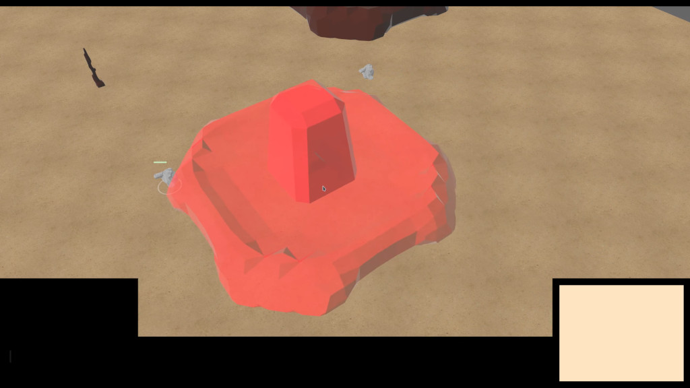
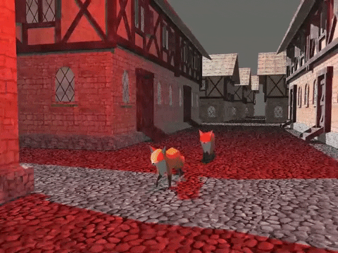
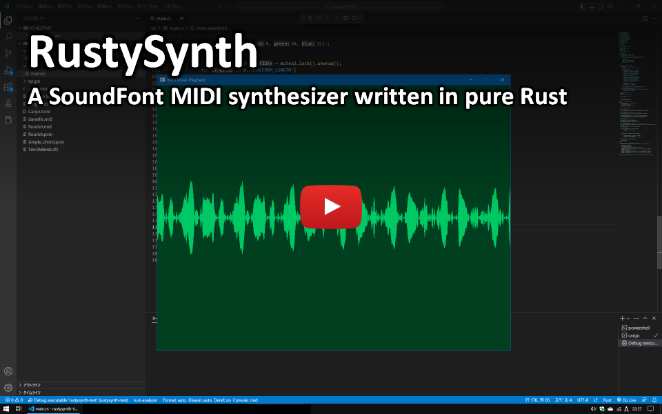

+++
title = "This Month in Rust GameDev #42 - January 2023"
transparent = true
date = 2023-02-09
draft = true
+++

<!-- no toc -->

<!-- Check the post with markdownlint-->

Welcome to the 42nd issue of the Rust GameDev Workgroup's
monthly newsletter.
[Rust] is a systems language pursuing the trifecta:
safety, concurrency, and speed.
These goals are well-aligned with game development.
We hope to build an inviting ecosystem for anyone wishing
to use Rust in their development process!
Want to get involved? [Join the Rust GameDev working group!][join]

You can follow the newsletter creation process
by watching [the coordination issues][coordination].
Want something mentioned in the next newsletter?
[Send us a pull request][pr].
Feel free to send PRs about your own projects!

[Rust]: https://rust-lang.org
[join]: https://github.com/rust-gamedev/wg#join-the-fun
[pr]: https://github.com/rust-gamedev/rust-gamedev.github.io
[coordination]: https://github.com/rust-gamedev/rust-gamedev.github.io/issues?q=label%3Acoordination

- [Announcements](#announcements)
- [Game Updates](#game-updates)
- [Engine Updates](#engine-updates)
- [Learning Material Updates](#learning-material-updates)
- [Tooling Updates](#tooling-updates)
- [Library Updates](#library-updates)
- [Other News](#other-news)
- [Popular Workgroup Issues in Github](#popular-workgroup-issues-in-github)
- [Meeting Minutes](#meeting-minutes)
- [Discussions](#discussions)
- [Requests for Contribution](#requests-for-contribution)
- [Jobs](#jobs)
- [Bonus](#bonus)

<!--
Ideal section structure is:

```
### [Title]


_image caption_

A paragraph or two with a summary and [useful links].

_Discussions:
[/r/rust](https://reddit.com/r/rust/todo),
[twitter](https://twitter.com/todo/status/123456)_

[Title]: https://first.link
[useful links]: https://other.link
```

If needed, a section can be split into subsections with a "------" delimiter.
-->

## Announcements

## Game Updates

### Digital Extinction


_Building Placement in Digital Extinction_

[Digital Extinction] ([GitHub][de-github], [Discord][de-discord],
[Reddit][de-reddit]) by [@Indy2222] is a 3D real-time strategy game made with
[Bevy].

This month the game had two new first time contributors, [@0HyperCube] and
[@Polostor] (Péťa Tománek).

The most notable updates are:

- several multiplayer related screens were added to the menu: sign-in /
  sign-up, game listing, and game creation,
- building draft is now semi-transparent and colored green or red based on
  obstacles,
- double clicking on a unit or building leads to the selection of all visible
  entities of the same type,
- the mouse cursor is now confined to the game window,
- the camera can be moved horizontally with arrow keys,
- pop-up in-game menu was added, it is opened with Escape key,
- work on game head-up display / panel (HUD) was initiated,
- various errors are now briefly displayed as toasts in the UI,
- support of map hashing was added and deterministic map paths are used,
- several small fixes, code quality improvements.

See [gameplay][video-game] and [menu][video-menu] screen recordings on YouTube.

A more detailed update summary is available [here][de-update-04].

[Digital Extinction]: https://de-game.org
[de-github]: https://github.com/DigitalExtinction/Game
[de-discord]: https://discord.gg/vHMFuCWGSX
[de-reddit]: https://reddit.com/r/DigitalExtinction
[@Indy2222]: https://github.com/Indy2222
[@0HyperCube]: https://github.com/0HyperCube
[@Polostor]: https://github.com/Polostor
[Bevy]: https://bevyengine.org
[video-game]: https://youtu.be/JP01dAbtoc8
[video-menu]: https://youtu.be/APTlkGnn6vA
[de-update-04]: https://mgn.cz/blog/de04/

### [Cargo Space]


_Cross-platform p2p multiplayer in Cargo Space_

[Cargo Space] ([Discord][cargospace_discord]) by
[@johanhelsing][johanhelsing_mastodon] is a co-op 2d space game where you build
a ship and fly it through space looking for new parts, fighting pirates and the
environment.

This month, sprites were added for basic character poses, as well as basic sound
effects, making the game come alive and feel more like a proper 2D platformer.

Support for [`bevy_ggrs`][bevy_ggrs]' synctest sessions was implemented. This
allows detecting de-syncs by constantly performing rollbacks and comparing world
state checksums). This caught some very rare de-sync bugs.

The game also adopted [Matchbox][cargospace_matchbox]' newly added support for
cross-platform p2p. Which means sessions between players on web and native
are now supported ([video][cargospace_cross_platform_video]).

All of this is discussed in detail the [third devlog
entry][cargospace_devlog_3].

Johan also wrote [an article][cargospace_devlog_4] on how sound effects were
implemented in a rollback-aware way, cancelling mis-predicted sounds, and
handling "late" sounds. It describes a solution that could easily be adopted for
any game made with [`bevy_ggrs`][bevy_ggrs].

[Cargo Space]: https://helsing.studio/cargospace
[cargospace_devlog_3]: https://johanhelsing.studio/posts/cargo-space-devlog-3
[cargospace_devlog_4]: https://johanhelsing.studio/posts/cargo-space-devlog-4
[cargospace_discord]: https://discord.gg/ye9UDNvqQD
[cargospace_matchbox]: https://github.com/johanhelsing/matchbox
[johanhelsing_mastodon]: https://mastodon.social/@johanhelsing
[bevy_ggrs]: https://github.com/gschup/bevy_ggrs
[cargospace_cross_platform_video]: https://mastodon.social/@johanhelsing/109681997649114818

## Engine Updates

## Learning Material Updates

## Tooling Updates

### [Foxtrot]



[Foxtrot] was created by [@janhohenheim] as an all-in-one starting point for 3D
projects made in Bevy. While he appreciated that other Bevy templates showed
nicely how to wire up systems and setup a game loop, he was missing a showcase
for commonly used features that are scattered around various libraries. So he created
Foxtrot, where he collected most basic features he could need for future
projects or jams. The current version [v0.1.5] features:

- loading a 3D level from GLTF files
- automatically assigning physics colliders
- a custom dialog system
- saving and loading the game
- a force-based third-person character controller
- shaders
- pathfinding
- a flexible camera system with easings
- a custom ingame editor window for live tweaks such as spawning new objects.

[Foxtrot]: https://github.com/janhohenheim/foxtrot
[@janhohenheim]: https://github.com/janhohenheim
[v0.1.5]: https://github.com/janhohenheim/foxtrot/releases/tag/v0.1.5

## Library Updates

### [big-brain]

[big-brain] ([GitHub][big-brain-github], [Discord][big-brain-discord]) by [@zkat]
is a highly-parallel [Utility AI][big-brain-utility-ai] library
for the Bevy game engine.

[big-brain] recently tagged [v0.16.0][big-brain-v16],
bringing with it a couple of breaking changes and a few goodies.

Probably the biggest change in this release is removal of the blanket
[`ActionBuilder`][big-brain-action-builder] and [`ScorerBuilder`][big-brain-scorer-builder]
implementations for `Clone` types. This is a fairly significant breaking change,
but one that is fairly easy to resolve: simply use the new `#[derive(ActionBuilder)]`
and `#[derive(ScorerBuilder)]` macros to derive the necessary implementations
for your Action and Scorer Components and you should be good to go.

Finally, since the recent [merging of the bevy scheduler changes][big-brain-bevy-scheduler-changes],
big-brain users should expect the next version of big-brain to bring with it
some significant breaking changes to scheduling, so keep an eye out for that
and be mindful of building a lot on top of the current [`BigBrainStage`][big-brain-stage]
(which is used by the default `BigBrainPlugin`).

_Discussions: [Mastodon][zkat-mastodon-ann]_

[big-brain]: https://crates.io/crates/big-brain
[big-brain-github]: https://github.com/zkat/big-brain
[big-brain-discord]: https://discord.com/channels/691052431525675048/829441190067306596
[@zkat]: https://github.com/zkat
[big-brain-utility-ai]: https://en.wikipedia.org/wiki/Utility_system
[big-brain-v16]: https://github.com/zkat/big-brain/releases/tag/v0.16.0
[big-brain-action-builder]: https://docs.rs/big-brain/0.16.0/big_brain/actions/trait.ActionBuilder.html
[big-brain-scorer-builder]: https://docs.rs/big-brain/0.16.0/big_brain/scorers/trait.ScorerBuilder.html
[big-brain-bevy-scheduler-changes]: https://tech.lgbt/@alice_i_cecile/109815432105482093
[big-brain-stage]: https://docs.rs/big-brain/0.16.0/big_brain/enum.BigBrainStage.html
[zkat-mastodon-ann]: https://toot.cat/@zkat/109776883506682388

### [RustySynth]

[

_Video: an example of realtime MIDI synthesis with RustySynth on rust-sfml_
][rustysynth-video]

[RustySynth] is a SoundFont MIDI synthesizer written in pure Rust.
The purpose of this library is to provide MIDI music playback functionality
for any Rust application without complicated dependencies.
The code base is lightweight and can be used with any audio driver
that supports streaming audio (e.g. [rust-sfml]).

Features:

- Tuned mainly for gamedev and has low CPU usage.
- Support for standard MIDI files.
- No dependencies other than the standard library.
- Available under a permissive license (MIT).

[rustysynth-video]: https://www.youtube.com/watch?v=o9rPTJIPmVk
[RustySynth]: https://github.com/sinshu/rustysynth
[rust-sfml]: https://github.com/jeremyletang/rust-sfml

### [tween]

`tween` is a library for manipulating values in stylish and beautiful ways.
It has been almost entirely rewritten for `v2.0.0`, now featuring a
significantly improved API, fewer generics, and much, much faster performance.

Additionally, it has added support for Looping, Oscillating, and Extrapolating tweens.
With all of this, making custom tweens is much easier. An example of making a Bezier
tween is included.

[tween]: https://github.com/sanbox-irl/tween

### [scene-graph]

`scene-graph` is a library for creating graph structures similar to the
one used in engines like Unity or Unreal. It is fast, performant, and easy to
manipulate. It's especially useful for user interfaces. Although only in `v0.1.0`,
feedback would be very appreciated.

[scene-graph]: https://github.com/sanbox-irl/scene-graph

### [torchbearer]


_An exemple of torchbearer in action,
demonstrating both pathfinding and field of view_

[torchbearer] by [@redwarp] is a library that provides a set of tools
to find your path in a grid based dungeon. Specifically,
it provide a quick implementation of pathfinding and field of view algorithm.

The 0.6.x version rewrites the field of view algorithm to cast vision rays
in a bresenham circle around the point of origin.
This change from its [original implementation][torchbearer-orig] makes it faster
as it removes the needs for error correction.

[torchbearer]: https://github.com/redwarp/torchbearer
[@redwarp]: https://github.com/redwarp
[torchbearer-orig]: https://sites.google.com/site/jicenospam/visibilitydetermination

### [Matchbox]


[Matchbox] is a library for easily establishing unreliable, unordered,
peer-to-peer WebRTC data connections using rust WASM. This enables low-latency
multiplayer browser games.

Originally, it was written for web assembly, but a native implementation using
[WebRTC.rs] has been available since 0.4. However, a few minor incompatibilities
between the two implementations meant connections between native and web
were not possible.

In version 0.5, however, [Alex Rozgo] fixed the the last of these issues. And
cross-play sessions are now finally fully supported.

In addition, [johanhelsing][johanhelsing_mastodon] fixed a serious bug that used
to cause disconnections on recent versions of Firefox.

The tutorial series on [how to make a p2p web game with Bevy, GGRS and
Matchbox][extreme_bevy] was also updated to the latest versions of all three
libraries.

_Discussions: [Mastodon][cargospace_cross_platform_video]_

[extreme_bevy]: https://johanhelsing.studio/posts/extreme-bevy
[Matchbox]: https://github.com/johanhelsing/matchbox
[WebRTC.rs]: https://webrtc.rs
[Alex Rozgo]: https://github.com/rozgo

## Popular Workgroup Issues in Github

<!-- Up to 10 links to interesting issues -->

## Other News

<!-- One-liners for plan items that haven't got their own sections. -->

## Meeting Minutes

<!-- Up to 10 most important notes + a link to the full details -->

[See all meeting issues][label_meeting] including full text notes
or [join the next meeting][join].

[label_meeting]: https://github.com/rust-gamedev/wg/issues?q=label%3Ameeting

## Discussions

<!-- Links to handpicked reddit/twitter/urlo/etc threads that provide
useful information -->

## Requests for Contribution

<!-- Links to "good first issue"-labels or direct links to specific tasks -->

## Jobs

<!-- An optional section for new jobs related to Rust gamedev -->

## Bonus

<!-- Bonus section to make the newsletter more interesting
and highlight events from the past. -->

------

That's all news for today, thanks for reading!

Want something mentioned in the next newsletter?
[Send us a pull request][pr].

Also, subscribe to [@rust_gamedev on Twitter][@rust_gamedev]
or [/r/rust_gamedev subreddit][/r/rust_gamedev] if you want to receive fresh news!

<!--
TODO: Add real links and un-comment once this post is published
**Discuss this post on**:
[/r/rust_gamedev](TODO),
[Twitter](TODO),
[Mastodon](TODO),
[Discord](https://discord.gg/yNtPTb2).
-->

[/r/rust_gamedev]: https://reddit.com/r/rust_gamedev
[@rust_gamedev]: https://twitter.com/rust_gamedev
